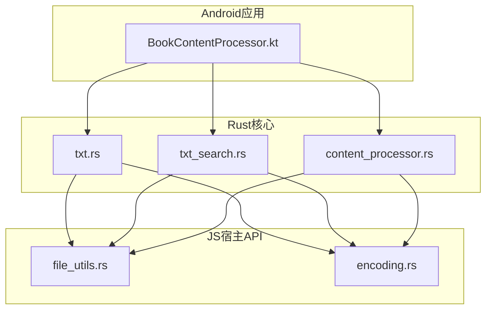
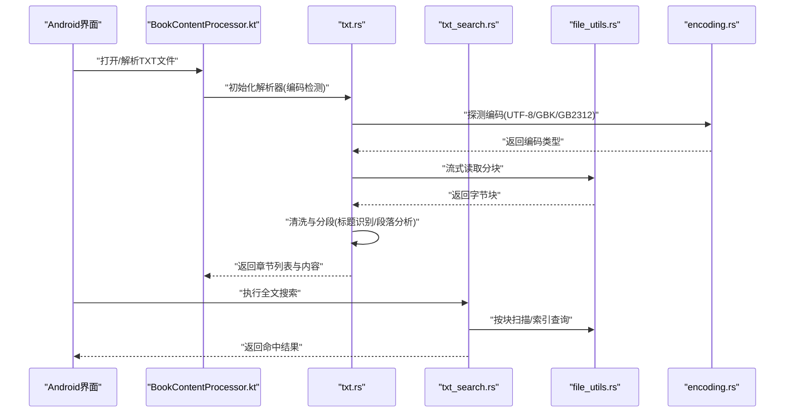
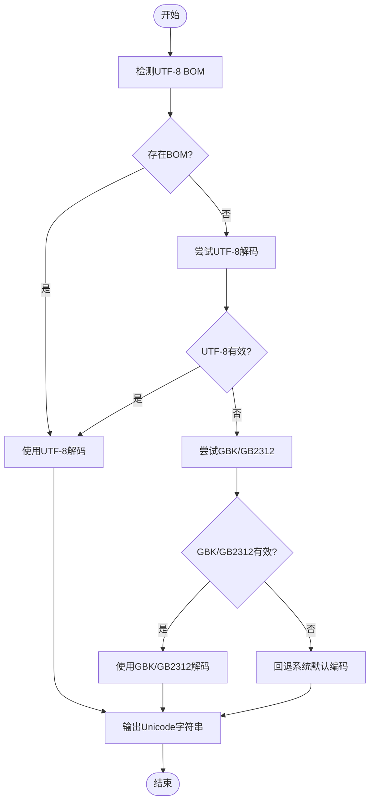
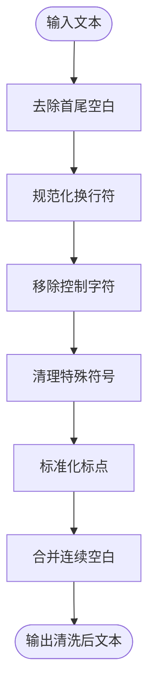
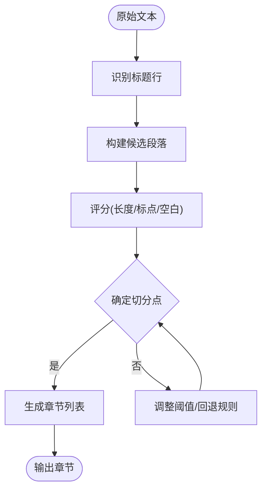
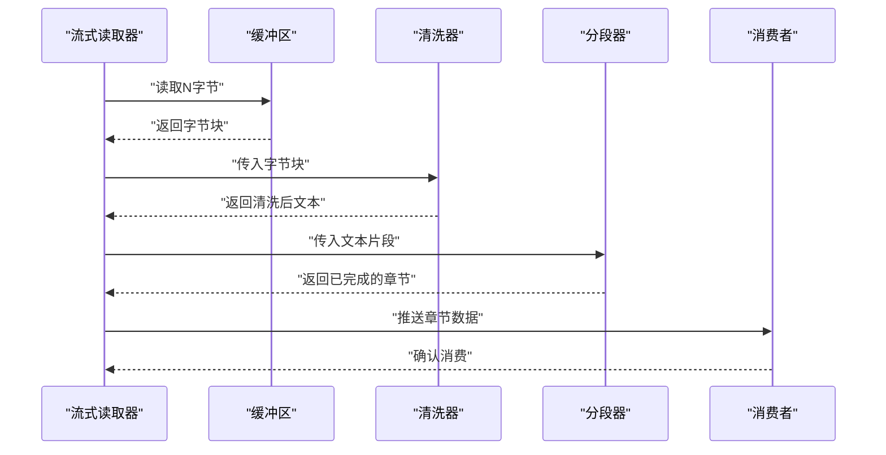
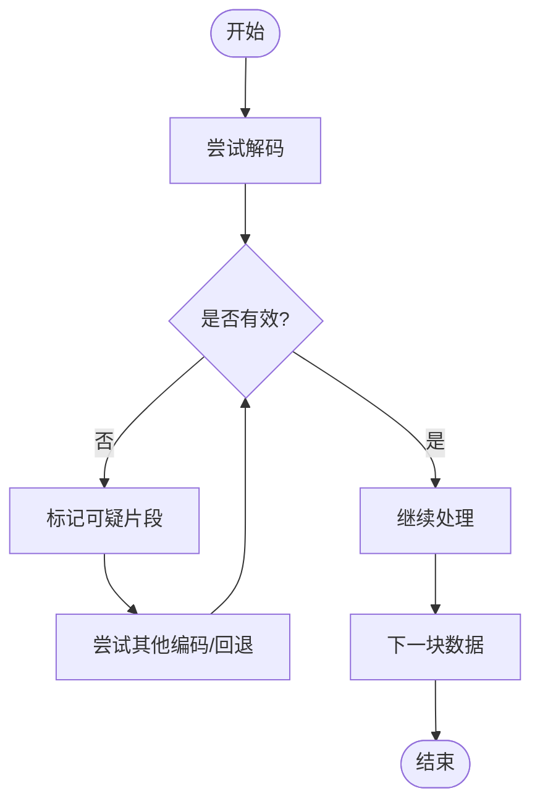
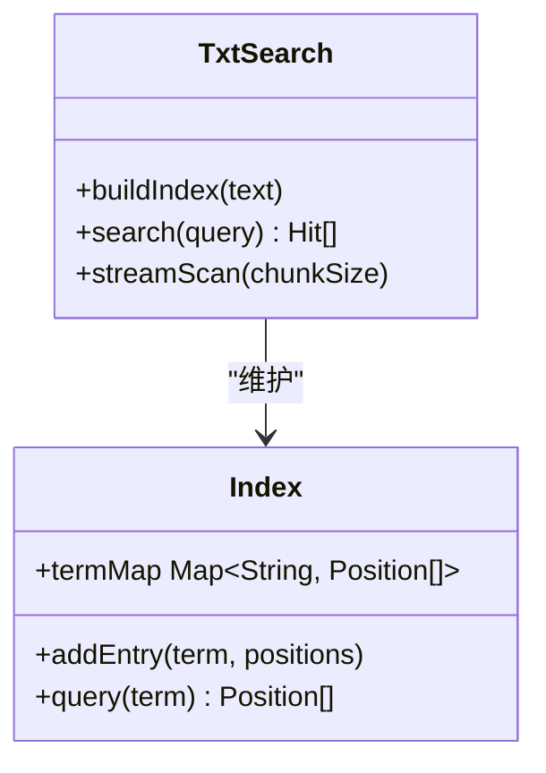
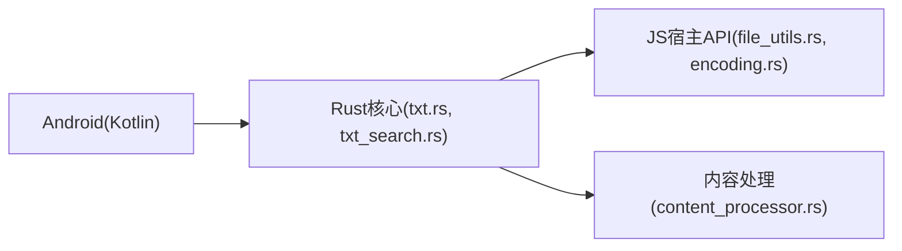

# TXT文本处理

<cite>
**本文档引用的文件**   
- [rust/legado-book/src/txt.rs](file://rust/legado-book/src/txt.rs)
- [rust/legado-book/src/txt_search.rs](file://rust/legado-book/src/txt_search.rs)
- [rust/legado-core/src/content_processor.rs](file://rust/legado-core/src/content_processor.rs)
- [rust/legado-js/src/host_api/file_utils.rs](file://rust/legado-js/src/host_api/file_utils.rs)
- [rust/legado-js/src/host_api/encoding.rs](file://rust/legado-js/src/host_api/encoding.rs)
- [app/src/main/java/io/legado/app/help/BookContentProcessor.kt](file://app/src/main/java/io/legado/app/help/BookContentProcessor.kt)
</cite>

## 目录
1. [简介](#简介)
2. [项目结构](#项目结构)
3. [核心组件](#核心组件)
4. [架构总览](#架构总览)
5. [详细组件分析](#详细组件分析)
6. [依赖关系分析](#依赖关系分析)
7. [性能考量](#性能考量)
8. [故障排查指南](#故障排查指南)
9. [结论](#结论)
10. [附录](#附录)

## 简介
本文件面向Legado项目中TXT文本处理的实现，系统性阐述以下主题：
- 编码检测机制：UTF-8、GBK、GB2312等常见编码的自动识别策略与回退路径
- 文本清洗算法：空白字符处理、特殊符号过滤、格式标准化
- 章节分割逻辑：标题识别、段落分析与智能分段
- TXT特有功能：大文件流式读取、内存优化、错误恢复
- 多编码处理示例与性能调优建议

## 项目结构
TXT文本处理在Rust层提供高性能解析与搜索能力，并通过JS宿主API暴露给上层；Android侧提供内容处理器用于UI与业务集成。关键文件分布如下：
- Rust层：txt.rs（TXT解析）、txt_search.rs（TXT搜索）、content_processor.rs（内容处理）
- JS宿主API：file_utils.rs（文件IO）、encoding.rs（编码转换）
- Android层：BookContentProcessor.kt（内容处理桥接）

**图表来源** 
- [rust/legado-book/src/txt.rs](file://rust/legado-book/src/txt.rs)
- [rust/legado-book/src/txt_search.rs](file://rust/legado-book/src/txt_search.rs)
- [rust/legado-core/src/content_processor.rs](file://rust/legado-core/src/content_processor.rs)
- [rust/legado-js/src/host_api/file_utils.rs](file://rust/legado-js/src/host_api/file_utils.rs)
- [rust/legado-js/src/host_api/encoding.rs](file://rust/legado-js/src/host_api/encoding.rs)
- [app/src/main/java/io/legado/app/help/BookContentProcessor.kt](file://app/src/main/java/io/legado/app/help/BookContentProcessor.kt)

**章节来源**
- [rust/legado-book/src/txt.rs](file://rust/legado-book/src/txt.rs)
- [rust/legado-book/src/txt_search.rs](file://rust/legado-book/src/txt_search.rs)
- [rust/legado-core/src/content_processor.rs](file://rust/legado-core/src/content_processor.rs)
- [rust/legado-js/src/host_api/file_utils.rs](file://rust/legado-js/src/host_api/file_utils.rs)
- [rust/legado-js/src/host_api/encoding.rs](file://rust/legado-js/src/host_api/encoding.rs)
- [app/src/main/java/io/legado/app/help/BookContentProcessor.kt](file://app/src/main/java/io/legado/app/help/BookContentProcessor.kt)

## 核心组件
- 编码检测与转换：通过编码探测库与规则组合，优先尝试UTF-8（含BOM），失败时回退至GBK/GB2312，最终回退到系统默认编码
- 文本清洗：去除首尾空白、规范化换行、移除不可见控制符、统一全角/半角标点
- 章节分割：基于标题模式匹配（如“第X章”“Chapter X”）、空行与缩进启发式分段、长度阈值与语义边界
- 流式读取与大文件优化：分块读取、增量清洗、延迟构建索引、按需加载章节
- 错误恢复：损坏字节跳过、部分解码失败重试、降级为单字节编码并标记可疑片段

**章节来源**
- [rust/legado-book/src/txt.rs](file://rust/legado-book/src/txt.rs)
- [rust/legado-book/src/txt_search.rs](file://rust/legado-book/src/txt_search.rs)
- [rust/legado-core/src/content_processor.rs](file://rust/legado-core/src/content_processor.rs)
- [rust/legado-js/src/host_api/file_utils.rs](file://rust/legado-js/src/host_api/file_utils.rs)
- [rust/legado-js/src/host_api/encoding.rs](file://rust/legado-js/src/host_api/encoding.rs)
- [app/src/main/java/io/legado/app/help/BookContentProcessor.kt](file://app/src/main/java/io/legado/app/help/BookContentProcessor.kt)

## 架构总览
整体流程从Android端发起TXT处理请求，进入Rust层进行编码检测、清洗与章节分割，必要时调用JS宿主API完成文件IO与编码转换。搜索模块独立维护倒排索引以支持快速检索。

**图表来源** 
- [app/src/main/java/io/legado/app/help/BookContentProcessor.kt](file://app/src/main/java/io/legado/app/help/BookContentProcessor.kt)
- [rust/legado-book/src/txt.rs](file://rust/legado-book/src/txt.rs)
- [rust/legado-book/src/txt_search.rs](file://rust/legado-book/src/txt_search.rs)
- [rust/legado-js/src/host_api/file_utils.rs](file://rust/legado-js/src/host_api/file_utils.rs)
- [rust/legado-js/src/host_api/encoding.rs](file://rust/legado-js/src/host_api/encoding.rs)

## 详细组件分析

### 编码检测与转换
- 探测顺序：优先检查UTF-8 BOM；若无BOM，使用统计特征判断UTF-8有效性；若失败，尝试GBK/GB2312；最后回退到系统默认编码
- 容错策略：对无效序列采用替换或跳过，记录可疑位置以便后续标注
- 转换接口：统一输出Unicode字符串，供清洗与分段模块消费

**图表来源** 
- [rust/legado-js/src/host_api/encoding.rs](file://rust/legado-js/src/host_api/encoding.rs)
- [rust/legado-book/src/txt.rs](file://rust/legado-book/src/txt.rs)

**章节来源**
- [rust/legado-js/src/host_api/encoding.rs](file://rust/legado-js/src/host_api/encoding.rs)
- [rust/legado-book/src/txt.rs](file://rust/legado-book/src/txt.rs)

### 文本清洗算法
- 空白处理：去除首尾空白、合并连续空白、规范化换行符（统一为\n）
- 特殊符号过滤：移除不可见控制符（除标准空白与换行）、清理零宽字符与乱码占位符
- 格式标准化：统一全角/半角标点、修正常见排版错误（如多余空格、断行）

**图表来源** 
- [rust/legado-core/src/content_processor.rs](file://rust/legado-core/src/content_processor.rs)
- [rust/legado-book/src/txt.rs](file://rust/legado-book/src/txt.rs)

**章节来源**
- [rust/legado-core/src/content_processor.rs](file://rust/legado-core/src/content_processor.rs)
- [rust/legado-book/src/txt.rs](file://rust/legado-book/src/txt.rs)

### 章节分割逻辑
- 标题识别：正则匹配“第X章/节”“Chapter X”“卷X”等模式，结合上下文置信度评分
- 段落分析：依据空行、缩进、长度阈值与标点分布进行启发式分段
- 智能分段：避免在句子中间截断，优先在句号、问号、感叹号处切分；长段落可进一步细分

**图表来源** 
- [rust/legado-book/src/txt.rs](file://rust/legado-book/src/txt.rs)
- [rust/legado-core/src/content_processor.rs](file://rust/legado-core/src/content_processor.rs)

**章节来源**
- [rust/legado-book/src/txt.rs](file://rust/legado-book/src/txt.rs)
- [rust/legado-core/src/content_processor.rs](file://rust/legado-core/src/content_processor.rs)

### 大文件流式读取与内存优化
- 分块读取：固定大小缓冲区（如64KB）循环读取，避免一次性载入整个文件
- 增量清洗：边读边清洗，减少中间对象创建
- 延迟索引：仅在需要时构建搜索索引，降低峰值内存
- 背压控制：当消费者慢于生产者时暂停读取，防止内存膨胀

**图表来源** 
- [rust/legado-js/src/host_api/file_utils.rs](file://rust/legado-js/src/host_api/file_utils.rs)
- [rust/legado-book/src/txt.rs](file://rust/legado-book/src/txt.rs)

**章节来源**
- [rust/legado-js/src/host_api/file_utils.rs](file://rust/legado-js/src/host_api/file_utils.rs)
- [rust/legado-book/src/txt.rs](file://rust/legado-book/src/txt.rs)

### 错误恢复与健壮性
- 损坏字节处理：遇到非法序列时跳过或替换，继续后续解码
- 部分解码失败：记录失败位置与编码猜测，允许用户手动指定编码
- 降级策略：当高级编码失败时回退到更保守的解码方式，保证可用性

**图表来源** 
- [rust/legado-book/src/txt.rs](file://rust/legado-book/src/txt.rs)
- [rust/legado-js/src/host_api/encoding.rs](file://rust/legado-js/src/host_api/encoding.rs)

**章节来源**
- [rust/legado-book/src/txt.rs](file://rust/legado-book/src/txt.rs)
- [rust/legado-js/src/host_api/encoding.rs](file://rust/legado-js/src/host_api/encoding.rs)

### 搜索与索引
- 倒排索引：按词元建立文档位置映射，支持快速定位
- 分块扫描：对大文件按块扫描，避免全量加载
- 结果聚合：合并跨块命中，去重与排序

**图表来源** 
- [rust/legado-book/src/txt_search.rs](file://rust/legado-book/src/txt_search.rs)

**章节来源**
- [rust/legado-book/src/txt_search.rs](file://rust/legado-book/src/txt_search.rs)

## 依赖关系分析
- Rust层依赖JS宿主API进行文件IO与编码转换
- Android层通过Kotlin桥接到Rust，提供统一的BookContentProcessor接口
- 各模块间松耦合，便于替换编码库或搜索实现

**图表来源** 
- [app/src/main/java/io/legado/app/help/BookContentProcessor.kt](file://app/src/main/java/io/legado/app/help/BookContentProcessor.kt)
- [rust/legado-book/src/txt.rs](file://rust/legado-book/src/txt.rs)
- [rust/legado-book/src/txt_search.rs](file://rust/legado-book/src/txt_search.rs)
- [rust/legado-core/src/content_processor.rs](file://rust/legado-core/src/content_processor.rs)
- [rust/legado-js/src/host_api/file_utils.rs](file://rust/legado-js/src/host_api/file_utils.rs)
- [rust/legado-js/src/host_api/encoding.rs](file://rust/legado-js/src/host_api/encoding.rs)

**章节来源**
- [app/src/main/java/io/legado/app/help/BookContentProcessor.kt](file://app/src/main/java/io/legado/app/help/BookContentProcessor.kt)
- [rust/legado-book/src/txt.rs](file://rust/legado-book/src/txt.rs)
- [rust/legado-book/src/txt_search.rs](file://rust/legado-book/src/txt_search.rs)
- [rust/legado-core/src/content_processor.rs](file://rust/legado-core/src/content_processor.rs)
- [rust/legado-js/src/host_api/file_utils.rs](file://rust/legado-js/src/host_api/file_utils.rs)
- [rust/legado-js/src/host_api/encoding.rs](file://rust/legado-js/src/host_api/encoding.rs)

## 性能考量
- 编码检测开销：优先使用BOM与快速UTF-8校验，避免昂贵的统计探测
- 清洗与分段：尽量在流式阶段完成，减少中间拷贝与对象分配
- 搜索索引：按需构建，支持增量更新与缓存
- I/O缓冲：合理设置分块大小（如64KB-256KB），平衡CPU与内存占用
- 多线程：I/O与CPU密集型任务分离，避免阻塞主线程

[本节为通用指导，不直接分析具体文件]

## 故障排查指南
- 编码问题：若出现乱码，检查编码探测顺序与回退策略，必要时强制指定编码
- 章节错位：调整标题正则与分段阈值，观察分段评分与切分点
- 内存溢出：减小分块大小、启用背压、关闭不必要的索引构建
- 搜索缓慢：优化分词与索引结构，限制扫描范围

**章节来源**
- [rust/legado-book/src/txt.rs](file://rust/legado-book/src/txt.rs)
- [rust/legado-book/src/txt_search.rs](file://rust/legado-book/src/txt_search.rs)
- [rust/legado-core/src/content_processor.rs](file://rust/legado-core/src/content_processor.rs)
- [rust/legado-js/src/host_api/file_utils.rs](file://rust/legado-js/src/host_api/file_utils.rs)
- [rust/legado-js/src/host_api/encoding.rs](file://rust/legado-js/src/host_api/encoding.rs)
- [app/src/main/java/io/legado/app/help/BookContentProcessor.kt](file://app/src/main/java/io/legado/app/help/BookContentProcessor.kt)

## 结论
Legado的TXT文本处理在Rust层实现了高效、健壮的编码检测、清洗与分段能力，并通过JS宿主API与Android层良好集成。针对大文件场景，采用流式读取与内存优化策略，确保稳定与性能。搜索模块提供快速检索能力，满足阅读与查找需求。

[本节为总结，不直接分析具体文件]

## 附录
- 编码处理示例：UTF-8（含BOM）、GBK、GB2312、系统默认编码的回退路径
- 清洗规则示例：空白规范化、控制符移除、标点标准化
- 分段参数示例：标题正则、长度阈值、标点切分偏好
- 性能调优建议：分块大小、索引构建时机、多线程策略

[本节为补充说明，不直接分析具体文件]