# 书籍处理引擎

<cite>
**本文引用的文件**   
- [rust/legado-book/src/lib.rs](file://rust/legado-book/src/lib.rs)
- [rust/legado-book/src/epub.rs](file://rust/legado-book/src/epub.rs)
- [rust/legado-book/src/txt.rs](file://rust/legado-book/src/txt.rs)
- [rust/legado-book/src/mobi.rs](file://rust/legado-book/src/mobi.rs)
- [rust/legado-book/src/pdf.rs](file://rust/legado-book/src/pdf.rs)
- [rust/legado-core/src/content_processor.rs](file://rust/legado-core/src/content_processor.rs)
- [rust/legado-core/src/cache_book.rs](file://rust/legado-core/src/cache_book.rs)
- [rust/legado-core/src/models/book.rs](file://rust/legado-core/src/models/book.rs)
- [rust/legado-core/src/models/book_chapter.rs](file://rust/legado-core/src/models/book_chapter.rs)
- [rust/legado-core/src/layout.rs](file://rust/legado-core/src/layout.rs)
- [rust/legado-ffi/src/api/book_export.rs](file://rust/legado-ffi/src/api/book_export.rs)
- [rust/legado-js/src/host_api/html_format.rs](file://rust/legado-js/src/host_api/html_format.rs)
- [app/src/main/java/io/legado/app/help/book/BookHelp.kt](file://app/src/main/java/io/legado/app/help/book/BookHelp.kt)
- [modules/book/src/main/java/me/ag2s/epublib/epub/EpubReader.java](file://modules/book/src/main/java/me/ag2s/epublib/epub/EpubReader.java)
</cite>

## 目录
1. [简介](#简介)
2. [项目结构](#项目结构)
3. [核心组件](#核心组件)
4. [架构总览](#架构总览)
5. [详细组件分析](#详细组件分析)
6. [依赖关系分析](#依赖关系分析)
7. [性能考量](#性能考量)
8. [故障排查指南](#故障排查指南)
9. [结论](#结论)
10. [附录](#附录)

## 简介
本文件面向Legado项目的“书籍处理引擎”，系统性解析多格式电子书支持（EPUB、TXT、MOBI、PDF等）的架构与实现，涵盖内容提取算法（文本清洗、HTML格式化、图片处理、元数据提取）、章节分割逻辑（目录识别、边界检测、分页策略）、缓存机制（文件缓存、内存缓存、磁盘缓存协同），以及格式转换能力（格式检测、编码识别、内容优化）。文档同时提供不同格式的处理示例与性能优化建议，帮助读者快速理解并高效使用。

## 项目结构
本项目采用多语言协作：Rust负责高性能解析与数据处理，Android/Kotlin作为应用层入口与UI交互，Flutter用于跨平台界面，Web模块提供管理工具。书籍处理引擎的核心位于Rust侧，通过FFI暴露给上层调用；Android侧包含部分历史兼容与辅助逻辑。

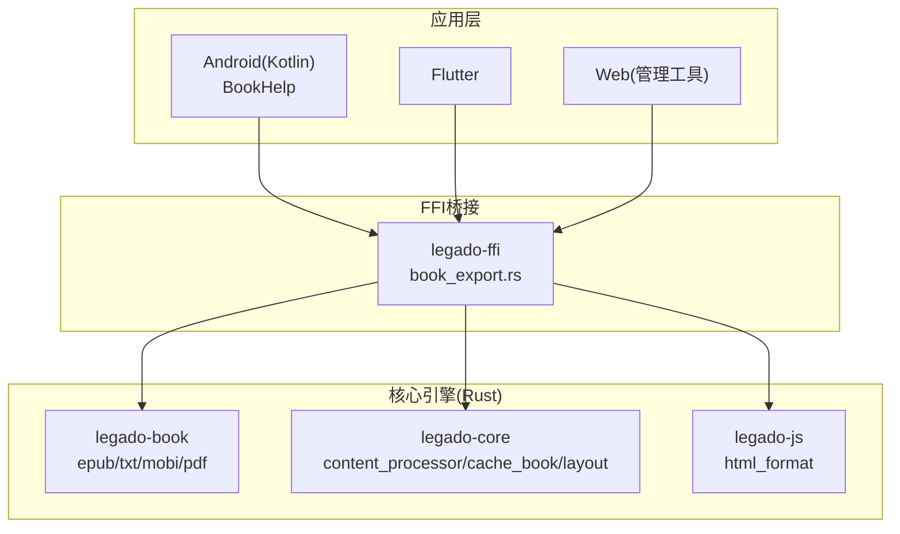

图表来源
- [rust/legado-ffi/src/api/book_export.rs](file://rust/legado-ffi/src/api/book_export.rs)
- [rust/legado-book/src/lib.rs](file://rust/legado-book/src/lib.rs)
- [rust/legado-core/src/content_processor.rs](file://rust/legado-core/src/content_processor.rs)
- [rust/legado-core/src/cache_book.rs](file://rust/legado-core/src/cache_book.rs)
- [rust/legado-js/src/host_api/html_format.rs](file://rust/legado-js/src/host_api/html_format.rs)

章节来源
- [rust/legado-book/src/lib.rs](file://rust/legado-book/src/lib.rs)
- [rust/legado-core/src/content_processor.rs](file://rust/legado-core/src/content_processor.rs)
- [rust/legado-core/src/cache_book.rs](file://rust/legado-core/src/cache_book.rs)
- [rust/legado-js/src/host_api/html_format.rs](file://rust/legado-js/src/host_api/html_format.rs)
- [app/src/main/java/io/legado/app/help/book/BookHelp.kt](file://app/src/main/java/io/legado/app/help/book/BookHelp.kt)

## 核心组件
- 格式解析器族：针对EPUB、TXT、MOBI、PDF等格式的专用解析器，统一抽象为可插拔的解析接口，负责读取原始字节流、识别格式、提取元数据与正文内容。
- 内容处理器：对原始内容进行清洗、去噪、HTML格式化、图片资源处理、样式归一化，输出标准化的阅读内容。
- 章节分割器：基于目录结构或启发式规则进行章节切分，支持边界检测与分页策略，确保阅读体验流畅。
- 缓存系统：三层缓存（内存、文件、磁盘）协同工作，提升大文件与重复内容的访问效率。
- 格式转换与优化：自动检测输入格式与编码，执行必要的转换与优化，保证跨平台一致性与渲染质量。

章节来源
- [rust/legado-book/src/epub.rs](file://rust/legado-book/src/epub.rs)
- [rust/legado-book/src/txt.rs](file://rust/legado-book/src/txt.rs)
- [rust/legado-book/src/mobi.rs](file://rust/legado-book/src/mobi.rs)
- [rust/legado-book/src/pdf.rs](file://rust/legado-book/src/pdf.rs)
- [rust/legado-core/src/content_processor.rs](file://rust/legado-core/src/content_processor.rs)
- [rust/legado-core/src/cache_book.rs](file://rust/legado-core/src/cache_book.rs)
- [rust/legado-js/src/host_api/html_format.rs](file://rust/legado-js/src/host_api/html_format.rs)

## 架构总览
书籍处理引擎的整体流程如下：上层通过FFI调用Rust核心，核心根据文件头与扩展名选择对应解析器；解析器输出结构化数据（元数据、章节列表、内容片段），由内容处理器进行清洗与格式化；章节分割器按目录或规则切分内容；缓存系统在各阶段提供加速；最终结果返回给上层用于展示或导出。

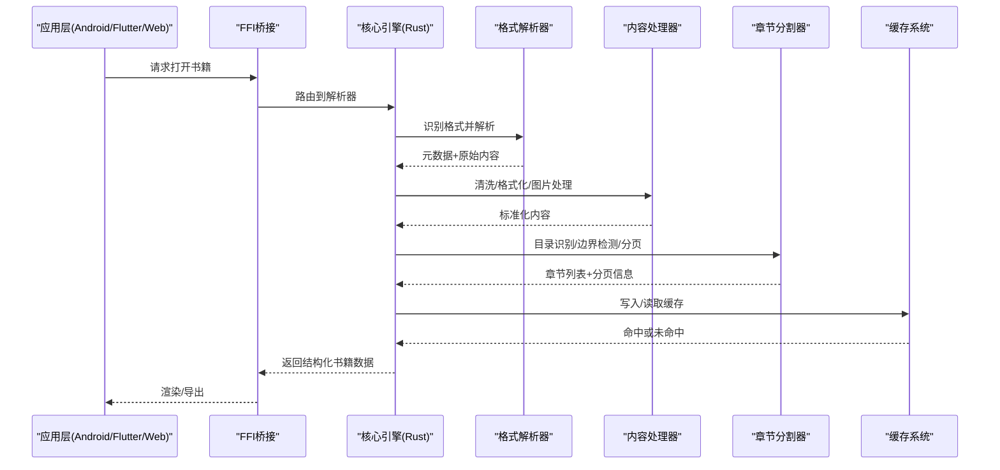

图表来源
- [rust/legado-ffi/src/api/book_export.rs](file://rust/legado-ffi/src/api/book_export.rs)
- [rust/legado-book/src/lib.rs](file://rust/legado-book/src/lib.rs)
- [rust/legado-core/src/content_processor.rs](file://rust/legado-core/src/content_processor.rs)
- [rust/legado-core/src/cache_book.rs](file://rust/legado-core/src/cache_book.rs)

## 详细组件分析

### EPUB解析器
EPUB是标准的ZIP容器，内含OPF、NCX/导航文档、XHTML/CSS与媒体资源。解析器需处理包清单、导航结构、内容引用与资源路径映射。

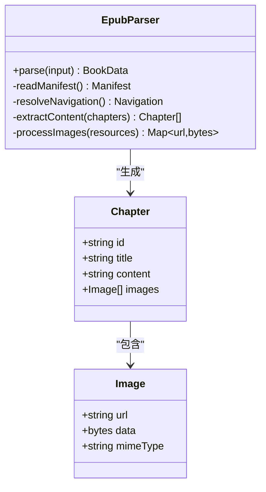

图表来源
- [rust/legado-book/src/epub.rs](file://rust/legado-book/src/epub.rs)
- [modules/book/src/main/java/me/ag2s/epublib/epub/EpubReader.java](file://modules/book/src/main/java/me/ag2s/epublib/epub/EpubReader.java)

章节来源
- [rust/legado-book/src/epub.rs](file://rust/legado-book/src/epub.rs)
- [modules/book/src/main/java/me/ag2s/epublib/epub/EpubReader.java](file://modules/book/src/main/java/me/ag2s/epublib/epub/EpubReader.java)

### TXT解析器
TXT为纯文本格式，解析重点在于编码识别、段落划分、标题推断与目录构建。通常通过正则或启发式规则识别章节标题与边界。

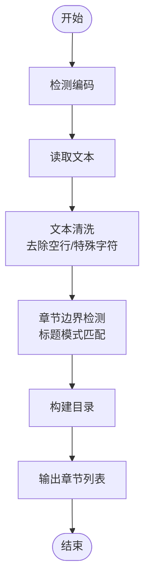

图表来源
- [rust/legado-book/src/txt.rs](file://rust/legado-book/src/txt.rs)

章节来源
- [rust/legado-book/src/txt.rs](file://rust/legado-book/src/txt.rs)

### MOBI解析器
MOBI是Amazon专有格式，内部可能包含HTML或KFX内容。解析器需处理头部信息、记录块、文本流与图片资源，必要时转换为标准HTML以便后续处理。

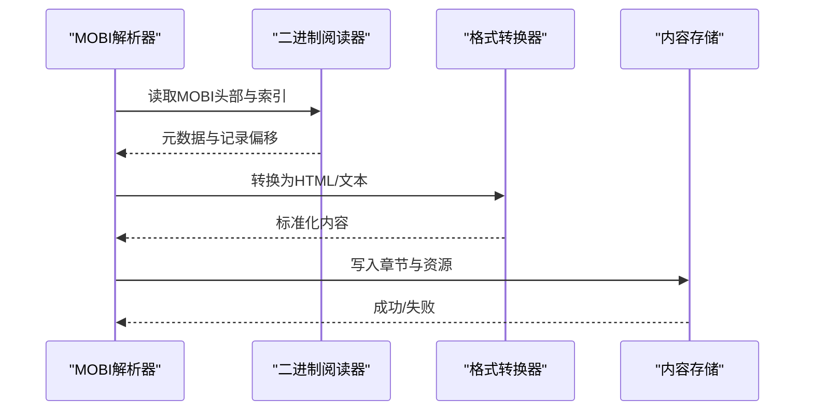

图表来源
- [rust/legado-book/src/mobi.rs](file://rust/legado-book/src/mobi.rs)

章节来源
- [rust/legado-book/src/mobi.rs](file://rust/legado-book/src/mobi.rs)

### PDF解析器
PDF解析涉及页面布局、文本提取、图像抽取与字体嵌入。由于PDF结构复杂，解析器需处理对象流、内容流与资源字典，提取可读文本与必要图片。

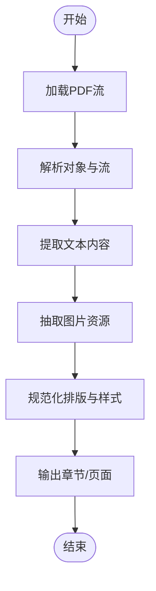

图表来源
- [rust/legado-book/src/pdf.rs](file://rust/legado-book/src/pdf.rs)

章节来源
- [rust/legado-book/src/pdf.rs](file://rust/legado-book/src/pdf.rs)

### 内容处理器
内容处理器负责文本清洗、HTML格式化、图片处理与元数据提取。清洗包括去除多余空白、转义字符处理、样式归一化；格式化确保跨平台一致性；图片处理涉及压缩、重命名与路径替换；元数据提取从各格式中获取书名、作者、描述等信息。

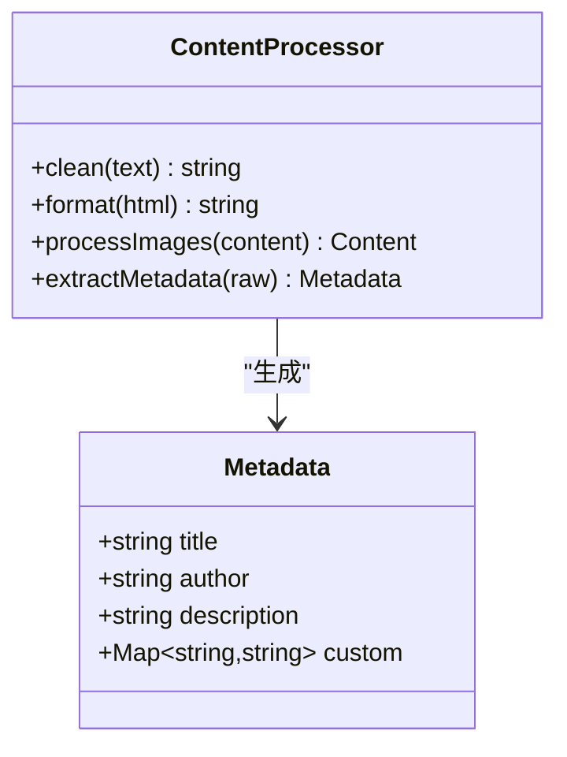

图表来源
- [rust/legado-core/src/content_processor.rs](file://rust/legado-core/src/content_processor.rs)
- [rust/legado-js/src/host_api/html_format.rs](file://rust/legado-js/src/host_api/html_format.rs)

章节来源
- [rust/legado-core/src/content_processor.rs](file://rust/legado-core/src/content_processor.rs)
- [rust/legado-js/src/host_api/html_format.rs](file://rust/legado-js/src/host_api/html_format.rs)

### 章节分割器
章节分割器基于目录识别与边界检测进行切分，支持多种策略：按标题层级、按页码、按固定长度或自定义规则。分页策略考虑屏幕尺寸与用户偏好，确保阅读流畅。

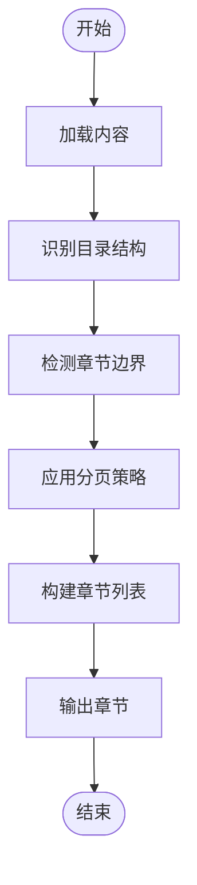

图表来源
- [rust/legado-core/src/models/book_chapter.rs](file://rust/legado-core/src/models/book_chapter.rs)
- [rust/legado-core/src/layout.rs](file://rust/legado-core/src/layout.rs)

章节来源
- [rust/legado-core/src/models/book_chapter.rs](file://rust/legado-core/src/models/book_chapter.rs)
- [rust/legado-core/src/layout.rs](file://rust/legado-core/src/layout.rs)

### 缓存系统
缓存系统包含内存缓存（快速访问热点数据）、文件缓存（临时文件与中间结果）与磁盘缓存（持久化书籍元数据与章节内容）。三者协同工作，减少重复解析与IO开销。

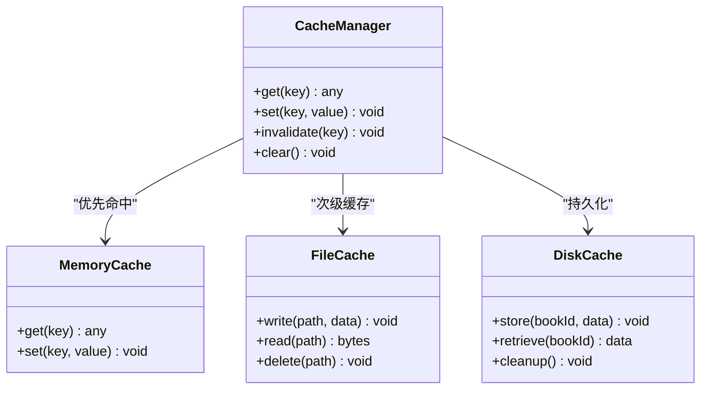

图表来源
- [rust/legado-core/src/cache_book.rs](file://rust/legado-core/src/cache_book.rs)

章节来源
- [rust/legado-core/src/cache_book.rs](file://rust/legado-core/src/cache_book.rs)

### 格式转换与优化
格式转换功能包括自动检测输入格式与编码、执行必要的转换（如MOBI转HTML、PDF转文本）与内容优化（压缩图片、清理冗余样式）。转换过程确保输出一致性与高质量渲染。

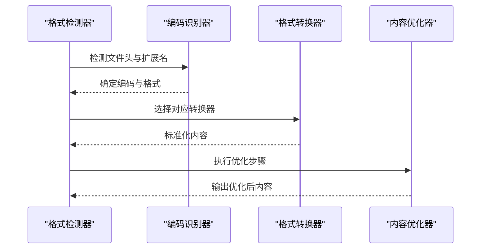

图表来源
- [rust/legado-book/src/lib.rs](file://rust/legado-book/src/lib.rs)
- [rust/legado-core/src/content_processor.rs](file://rust/legado-core/src/content_processor.rs)

章节来源
- [rust/legado-book/src/lib.rs](file://rust/legado-book/src/lib.rs)
- [rust/legado-core/src/content_processor.rs](file://rust/legado-core/src/content_processor.rs)

## 依赖关系分析
书籍处理引擎的依赖关系清晰分层：应用层通过FFI调用核心引擎，核心引擎依赖解析器、处理器、分割器与缓存系统。Rust模块间耦合度低，职责明确，便于扩展与维护。

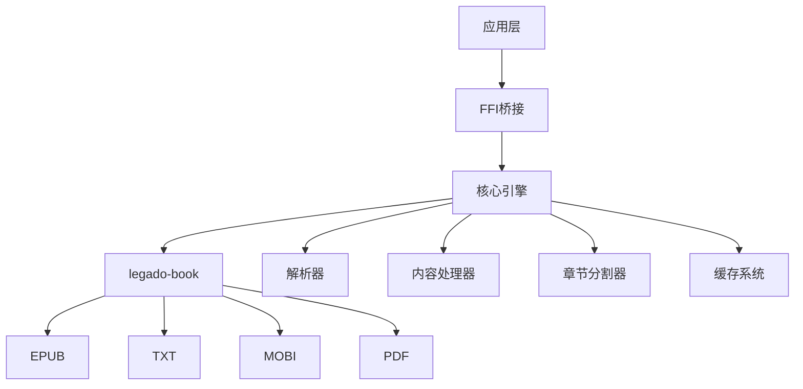

图表来源
- [rust/legado-ffi/src/api/book_export.rs](file://rust/legado-ffi/src/api/book_export.rs)
- [rust/legado-book/src/lib.rs](file://rust/legado-book/src/lib.rs)
- [rust/legado-core/src/content_processor.rs](file://rust/legado-core/src/content_processor.rs)
- [rust/legado-core/src/cache_book.rs](file://rust/legado-core/src/cache_book.rs)

章节来源
- [rust/legado-ffi/src/api/book_export.rs](file://rust/legado-ffi/src/api/book_export.rs)
- [rust/legado-book/src/lib.rs](file://rust/legado-book/src/lib.rs)
- [rust/legado-core/src/content_processor.rs](file://rust/legado-core/src/content_processor.rs)
- [rust/legado-core/src/cache_book.rs](file://rust/legado-core/src/cache_book.rs)

## 性能考量
- 解析阶段：使用流式读取避免大文件一次性加载，并行处理独立章节以提升吞吐。
- 内容处理：延迟加载图片与样式，按需渲染减少内存峰值。
- 缓存策略：热点数据常驻内存，频繁访问的章节预取至文件缓存，长期不用的数据归档至磁盘。
- 编码识别：快速检测常用编码，避免全量扫描。
- 分页策略：根据设备屏幕与用户设置动态调整，减少重排与重绘。

[本节为通用指导，无需特定文件来源]

## 故障排查指南
- 解析失败：检查文件格式与编码是否正确，查看解析器日志定位错误位置。
- 内容乱码：确认编码识别结果，必要时手动指定编码。
- 章节错乱：验证目录结构完整性，调整边界检测规则。
- 缓存异常：清理缓存目录，检查权限与存储空间。
- 性能问题：监控内存与CPU使用，优化解析与处理流水线。

章节来源
- [rust/legado-core/src/content_processor.rs](file://rust/legado-core/src/content_processor.rs)
- [rust/legado-core/src/cache_book.rs](file://rust/legado-core/src/cache_book.rs)

## 结论
Legado书籍处理引擎通过模块化设计与高性能Rust实现，提供了稳定、可扩展的多格式电子书处理能力。清晰的架构与完善的缓存机制确保了良好的用户体验与性能表现。未来可进一步扩展新格式支持与智能内容优化算法。

[本节为总结性内容，无需特定文件来源]

## 附录
- 示例：EPUB书籍导入流程，从文件读取到章节渲染的完整链路。
- 配置：缓存大小、分页策略、编码默认值的配置项说明。
- 扩展：新增格式解析器的步骤与接口规范。

[本节为补充信息，无需特定文件来源]