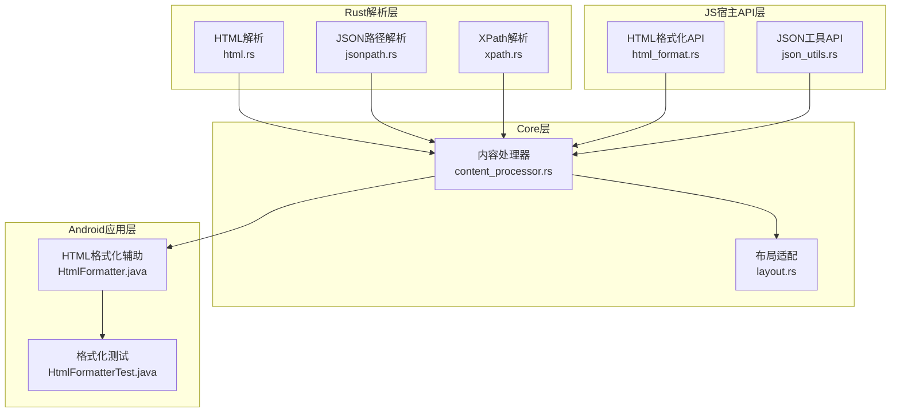
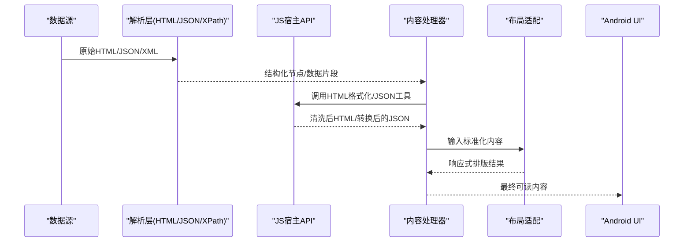
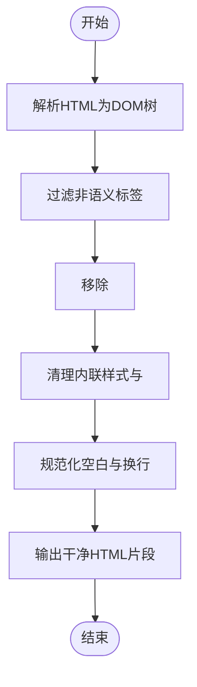
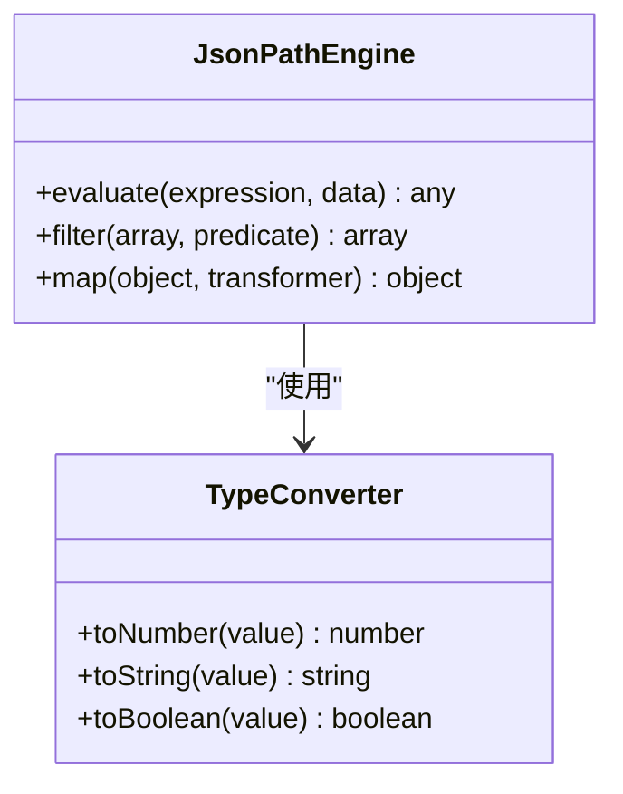
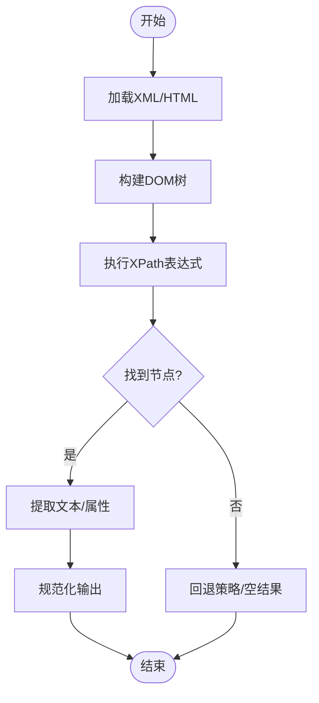
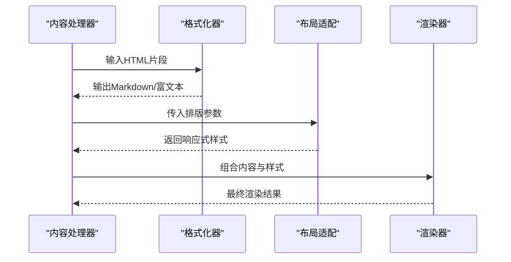
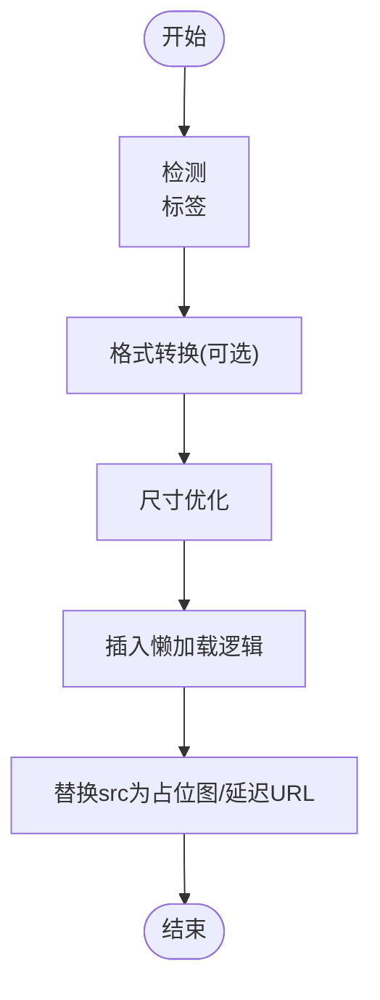
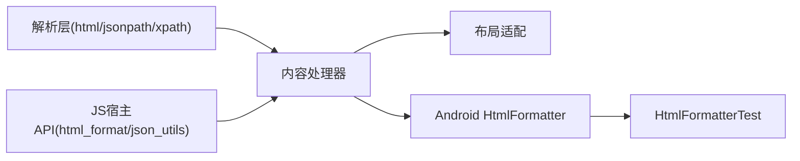

# 内容提取引擎

<cite>
**本文引用的文件**   
- [rust/legado-parser/src/html.rs](file://rust/legado-parser/src/html.rs)
- [rust/legado-parser/src/jsonpath.rs](file://rust/legado-parser/src/jsonpath.rs)
- [rust/legado-parser/src/xpath.rs](file://rust/legado-parser/src/xpath.rs)
- [rust/legado-js/src/host_api/html_format.rs](file://rust/legado-js/src/host_api/html_format.rs)
- [rust/legado-js/src/host_api/json_utils.rs](file://rust/legado-js/src/host_api/json_utils.rs)
- [rust/legado-core/src/content_processor.rs](file://rust/legado-core/src/content_processor.rs)
- [rust/legado-core/src/layout.rs](file://rust/legado-core/src/layout.rs)
- [app/src/main/java/io/legado/app/utils/HtmlFormatter.java](file://app/src/main/java/io/legado/app/utils/HtmlFormatter.java)
- [app/src/test/java/io/legado/app/utils/HtmlFormatterTest.java](file://app/src/test/java/io/legado/app/utils/HtmlFormatterTest.java)
</cite>

## 目录
1. [简介](#简介)
2. [项目结构](#项目结构)
3. [核心组件](#核心组件)
4. [架构总览](#架构总览)
5. [详细组件分析](#详细组件分析)
6. [依赖关系分析](#依赖关系分析)
7. [性能考虑](#性能考虑)
8. [故障排查指南](#故障排查指南)
9. [结论](#结论)
10. [附录](#附录)

## 简介
本文件面向Legado项目的“内容提取引擎”，系统性解析HTML、JSON与XML文档的提取流程，覆盖文本清洗（HTML标签过滤、JavaScript代码移除、CSS样式清理）、内容格式化（Markdown转换、富文本处理、响应式布局适配）、图片处理（格式转换、尺寸优化、懒加载）以及性能优化与缓存策略。文档以“从浅入深”的方式组织，既适合初学者快速上手，也为高级用户提供深入的技术细节与优化建议。

## 项目结构
内容提取能力由多模块协同实现：
- Rust解析层：负责HTML、JSON、XPath/JSONPath等结构化数据的抽取与规则解析。
- JS宿主API层：提供HTML格式化、JSON工具等能力供脚本调用。
- Core层：编排内容处理流水线，包括清洗、格式化、布局适配等。
- Android应用层：提供HTML格式化辅助工具与测试用例。

图表来源
- [rust/legado-parser/src/html.rs](file://rust/legado-parser/src/html.rs)
- [rust/legado-parser/src/jsonpath.rs](file://rust/legado-parser/src/jsonpath.rs)
- [rust/legado-parser/src/xpath.rs](file://rust/legado-parser/src/xpath.rs)
- [rust/legado-js/src/host_api/html_format.rs](file://rust/legado-js/src/host_api/html_format.rs)
- [rust/legado-js/src/host_api/json_utils.rs](file://rust/legado-js/src/host_api/json_utils.rs)
- [rust/legado-core/src/content_processor.rs](file://rust/legado-core/src/content_processor.rs)
- [rust/legado-core/src/layout.rs](file://rust/legado-core/src/layout.rs)
- [app/src/main/java/io/legado/app/utils/HtmlFormatter.java](file://app/src/main/java/io/legado/app/utils/HtmlFormatter.java)
- [app/src/test/java/io/legado/app/utils/HtmlFormatterTest.java](file://app/src/test/java/io/legado/app/utils/HtmlFormatterTest.java)

章节来源
- [rust/legado-parser/src/html.rs](file://rust/legado-parser/src/html.rs)
- [rust/legado-parser/src/jsonpath.rs](file://rust/legado-parser/src/jsonpath.rs)
- [rust/legado-parser/src/xpath.rs](file://rust/legado-parser/src/xpath.rs)
- [rust/legado-js/src/host_api/html_format.rs](file://rust/legado-js/src/host_api/html_format.rs)
- [rust/legado-js/src/host_api/json_utils.rs](file://rust/legado-js/src/host_api/json_utils.rs)
- [rust/legado-core/src/content_processor.rs](file://rust/legado-core/src/content_processor.rs)
- [rust/legado-core/src/layout.rs](file://rust/legado-core/src/layout.rs)
- [app/src/main/java/io/legado/app/utils/HtmlFormatter.java](file://app/src/main/java/io/legado/app/utils/HtmlFormatter.java)
- [app/src/test/java/io/legado/app/utils/HtmlFormatterTest.java](file://app/src/test/java/io/legado/app/utils/HtmlFormatterTest.java)

## 核心组件
- HTML解析器：负责DOM构建、节点遍历、属性与文本提取，支持常见选择器与规则匹配。
- JSON路径解析器：基于JSONPath表达式对JSON数据进行定位与切片，便于结构化数据抽取。
- XPath解析器：通过XPath表达式在XML/HTML树中精准定位节点，适用于复杂文档结构。
- HTML格式化API：提供HTML清洗、转义、样式剥离、脚本移除等能力，供脚本或上层逻辑调用。
- JSON工具API：提供JSON序列化/反序列化、字段映射、类型转换等工具方法。
- 内容处理器：编排清洗、格式化、布局适配等步骤，形成统一的内容提取流水线。
- 布局适配：根据设备与阅读场景调整排版，确保响应式展示效果。
- Android HTML格式化辅助：为UI层提供便捷的HTML处理工具与测试保障。

章节来源
- [rust/legado-parser/src/html.rs](file://rust/legado-parser/src/html.rs)
- [rust/legado-parser/src/jsonpath.rs](file://rust/legado-parser/src/jsonpath.rs)
- [rust/legado-parser/src/xpath.rs](file://rust/legado-parser/src/xpath.rs)
- [rust/legado-js/src/host_api/html_format.rs](file://rust/legado-js/src/host_api/html_format.rs)
- [rust/legado-js/src/host_api/json_utils.rs](file://rust/legado-js/src/host_api/json_utils.rs)
- [rust/legado-core/src/content_processor.rs](file://rust/legado-core/src/content_processor.rs)
- [rust/legado-core/src/layout.rs](file://rust/legado-core/src/layout.rs)
- [app/src/main/java/io/legado/app/utils/HtmlFormatter.java](file://app/src/main/java/io/legado/app/utils/HtmlFormatter.java)
- [app/src/test/java/io/legado/app/utils/HtmlFormatterTest.java](file://app/src/test/java/io/legado/app/utils/HtmlFormatterTest.java)

## 架构总览
内容提取引擎采用分层设计：解析层负责原始数据到结构化中间表示的转换；JS宿主API层暴露可复用的处理函数；Core层串联清洗、格式化与布局适配；Android层提供UI侧的工具与验证。

图表来源
- [rust/legado-parser/src/html.rs](file://rust/legado-parser/src/html.rs)
- [rust/legado-parser/src/jsonpath.rs](file://rust/legado-parser/src/jsonpath.rs)
- [rust/legado-parser/src/xpath.rs](file://rust/legado-parser/src/xpath.rs)
- [rust/legado-js/src/host_api/html_format.rs](file://rust/legado-js/src/host_api/html_format.rs)
- [rust/legado-js/src/host_api/json_utils.rs](file://rust/legado-js/src/host_api/json_utils.rs)
- [rust/legado-core/src/content_processor.rs](file://rust/legado-core/src/content_processor.rs)
- [rust/legado-core/src/layout.rs](file://rust/legado-core/src/layout.rs)
- [app/src/main/java/io/legado/app/utils/HtmlFormatter.java](file://app/src/main/java/io/legado/app/utils/HtmlFormatter.java)

## 详细组件分析

### HTML解析与清洗
- DOM构建与节点遍历：将HTML转换为可查询的树结构，支持按标签、类名、ID、属性等条件筛选。
- 文本清洗算法：
  - HTML标签过滤：保留必要语义标签，去除冗余装饰标签。
  - JavaScript代码移除：剥离script块与事件绑定，防止执行与渲染污染。
  - CSS样式清理：移除内联样式与<style>块，仅保留基础排版信息。
- 输出规范：生成干净的HTML片段，便于后续Markdown转换与富文本处理。

图表来源
- [rust/legado-parser/src/html.rs](file://rust/legado-parser/src/html.rs)
- [rust/legado-js/src/host_api/html_format.rs](file://rust/legado-js/src/host_api/html_format.rs)

章节来源
- [rust/legado-parser/src/html.rs](file://rust/legado-parser/src/html.rs)
- [rust/legado-js/src/host_api/html_format.rs](file://rust/legado-js/src/host_api/html_format.rs)

### JSON数据处理
- JSONPath表达式：用于定位数组元素、对象字段与嵌套结构，支持条件过滤与切片。
- 类型转换与校验：自动进行字符串、数字、布尔值等类型的转换与合法性检查。
- 字段映射：将JSON字段映射到内部模型，便于后续处理与持久化。

图表来源
- [rust/legado-parser/src/jsonpath.rs](file://rust/legado-parser/src/jsonpath.rs)
- [rust/legado-js/src/host_api/json_utils.rs](file://rust/legado-js/src/host_api/json_utils.rs)

章节来源
- [rust/legado-parser/src/jsonpath.rs](file://rust/legado-parser/src/jsonpath.rs)
- [rust/legado-js/src/host_api/json_utils.rs](file://rust/legado-js/src/host_api/json_utils.rs)

### XML文档操作
- XPath表达式：在XML/HTML树中进行精确节点定位，支持层级、属性与文本匹配。
- 节点操作：读取、修改、删除节点，合并相邻文本节点，规范化命名空间。
- 错误处理：对无效XPath表达式与不存在的节点进行容错与日志记录。

图表来源
- [rust/legado-parser/src/xpath.rs](file://rust/legado-parser/src/xpath.rs)

章节来源
- [rust/legado-parser/src/xpath.rs](file://rust/legado-parser/src/xpath.rs)

### 内容格式化与响应式布局
- Markdown转换：将HTML片段转换为Markdown，保持标题、列表、链接、表格等语义。
- 富文本处理：支持加粗、斜体、引用、代码块等富文本元素的渲染与导出。
- 响应式布局适配：根据屏幕宽度与阅读模式动态调整字体大小、行高、边距与图片尺寸。

图表来源
- [rust/legado-core/src/content_processor.rs](file://rust/legado-core/src/content_processor.rs)
- [rust/legado-core/src/layout.rs](file://rust/legado-core/src/layout.rs)
- [app/src/main/java/io/legado/app/utils/HtmlFormatter.java](file://app/src/main/java/io/legado/app/utils/HtmlFormatter.java)

章节来源
- [rust/legado-core/src/content_processor.rs](file://rust/legado-core/src/content_processor.rs)
- [rust/legado-core/src/layout.rs](file://rust/legado-core/src/layout.rs)
- [app/src/main/java/io/legado/app/utils/HtmlFormatter.java](file://app/src/main/java/io/legado/app/utils/HtmlFormatter.java)

### 图片处理功能
- 格式转换：将WebP、PNG、JPEG等格式统一为适合阅读的格式，减少体积并提升兼容性。
- 尺寸优化：根据显示区域计算最优尺寸，避免过大图片导致内存压力。
- 懒加载实现：仅在图片进入视口时加载，降低初始加载时间与带宽消耗。

图表来源
- [rust/legado-core/src/content_processor.rs](file://rust/legado-core/src/content_processor.rs)
- [rust/legado-core/src/layout.rs](file://rust/legado-core/src/layout.rs)

章节来源
- [rust/legado-core/src/content_processor.rs](file://rust/legado-core/src/content_processor.rs)
- [rust/legado-core/src/layout.rs](file://rust/legado-core/src/layout.rs)

## 依赖关系分析
- 解析层依赖Rust标准库与第三方解析器（如正则、XPath/JSONPath引擎）。
- JS宿主API依赖Core层提供的处理能力，并通过FFI暴露给脚本环境。
- Core层协调解析层与布局模块，形成端到端的内容处理流水线。
- Android层依赖Java/Kotlin工具类进行UI侧的HTML格式化与测试验证。

图表来源
- [rust/legado-parser/src/html.rs](file://rust/legado-parser/src/html.rs)
- [rust/legado-parser/src/jsonpath.rs](file://rust/legado-parser/src/jsonpath.rs)
- [rust/legado-parser/src/xpath.rs](file://rust/legado-parser/src/xpath.rs)
- [rust/legado-js/src/host_api/html_format.rs](file://rust/legado-js/src/host_api/html_format.rs)
- [rust/legado-js/src/host_api/json_utils.rs](file://rust/legado-js/src/host_api/json_utils.rs)
- [rust/legado-core/src/content_processor.rs](file://rust/legado-core/src/content_processor.rs)
- [rust/legado-core/src/layout.rs](file://rust/legado-core/src/layout.rs)
- [app/src/main/java/io/legado/app/utils/HtmlFormatter.java](file://app/src/main/java/io/legado/app/utils/HtmlFormatter.java)
- [app/src/test/java/io/legado/app/utils/HtmlFormatterTest.java](file://app/src/test/java/io/legado/app/utils/HtmlFormatterTest.java)

章节来源
- [rust/legado-parser/src/html.rs](file://rust/legado-parser/src/html.rs)
- [rust/legado-parser/src/jsonpath.rs](file://rust/legado-parser/src/jsonpath.rs)
- [rust/legado-parser/src/xpath.rs](file://rust/legado-parser/src/xpath.rs)
- [rust/legado-js/src/host_api/html_format.rs](file://rust/legado-js/src/host_api/html_format.rs)
- [rust/legado-js/src/host_api/json_utils.rs](file://rust/legado-js/src/host_api/json_utils.rs)
- [rust/legado-core/src/content_processor.rs](file://rust/legado-core/src/content_processor.rs)
- [rust/legado-core/src/layout.rs](file://rust/legado-core/src/layout.rs)
- [app/src/main/java/io/legado/app/utils/HtmlFormatter.java](file://app/src/main/java/io/legado/app/utils/HtmlFormatter.java)
- [app/src/test/java/io/legado/app/utils/HtmlFormatterTest.java](file://app/src/test/java/io/legado/app/utils/HtmlFormatterTest.java)

## 性能考虑
- 解析优化：
  - 增量解析：对大文档分块解析，避免一次性加载导致的内存峰值。
  - 缓存AST：对重复访问的DOM树片段进行缓存，减少重复构建成本。
- 清洗与格式化：
  - 规则预编译：将正则表达式与XPath/JSONPath表达式预编译，提升匹配速度。
  - 流式处理：对长文本采用流式清洗与格式化，降低内存占用。
- 图片处理：
  - 异步解码：后台线程进行图片解码与压缩，避免阻塞主线程。
  - 缓存策略：对已处理的图片进行本地缓存，避免重复转换。
- 布局适配：
  - 按需计算：仅在需要时计算响应式样式，避免全局重排。
  - 样式复用：对常用样式模板进行缓存，减少重复生成。

[本节为通用指导，无需具体文件来源]

## 故障排查指南
- HTML解析失败：
  - 检查输入是否为有效HTML片段，必要时进行修复与规范化。
  - 查看解析器的错误日志，定位非法标签或嵌套问题。
- JSONPath/XPath表达式错误：
  - 验证表达式语法与目标数据结构是否匹配。
  - 使用调试工具打印中间结果，逐步缩小问题范围。
- 格式化异常：
  - 确认HTML片段是否包含未闭合标签或非法字符。
  - 检查Markdown转换规则是否覆盖了所有必要元素。
- 图片处理问题：
  - 确认图片格式是否受支持，必要时进行格式降级。
  - 检查懒加载触发条件是否正确，避免图片无法显示。

章节来源
- [app/src/test/java/io/legado/app/utils/HtmlFormatterTest.java](file://app/src/test/java/io/legado/app/utils/HtmlFormatterTest.java)

## 结论
Legado的内容提取引擎通过分层架构实现了高效的HTML、JSON与XML数据处理，结合强大的清洗、格式化与布局适配能力，为用户提供稳定、高性能的阅读体验。未来可进一步优化解析性能、扩展更多格式支持与智能清洗规则，以满足更复杂的场景需求。

[本节为总结性内容，无需具体文件来源]

## 附录
- 最佳实践：
  - 优先使用XPath/JSONPath进行精准数据抽取，减少正则匹配的复杂度。
  - 对频繁使用的清洗与格式化规则进行缓存，提升整体性能。
  - 在移动端谨慎处理大图，采用懒加载与尺寸优化策略。
- 常见问题：
  - 中文编码问题：确保输入输出统一使用UTF-8编码。
  - 特殊字符转义：在HTML与Markdown之间转换时注意转义规则。
  - 跨平台兼容：不同平台的解析器行为可能存在差异，需进行充分测试。

[本节为补充信息，无需具体文件来源]