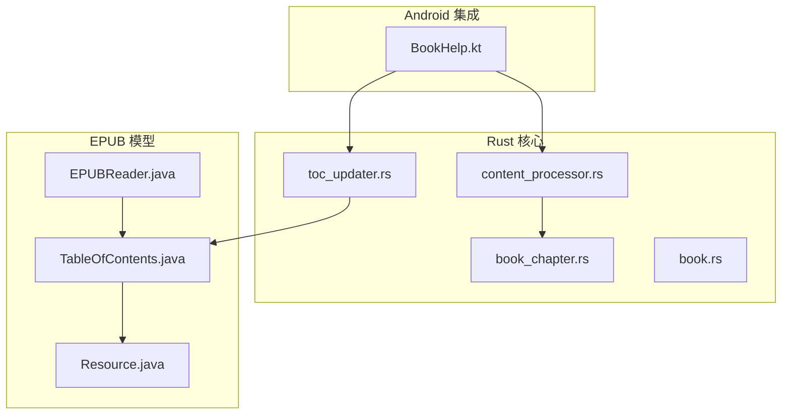
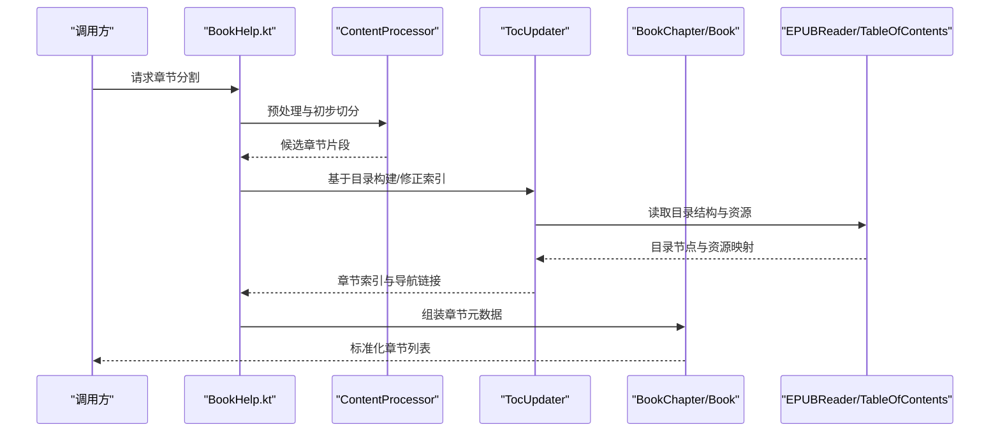
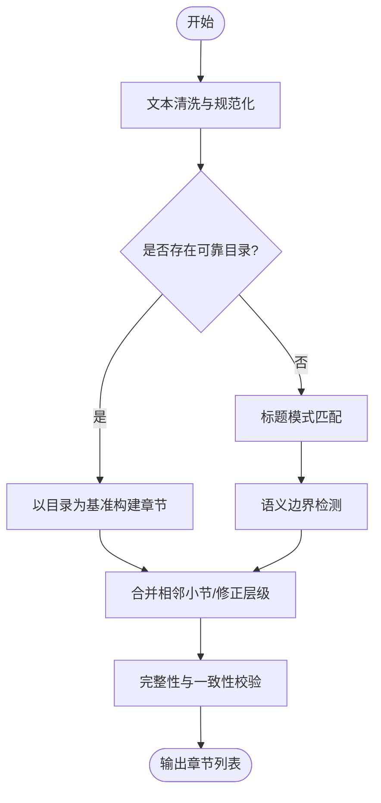
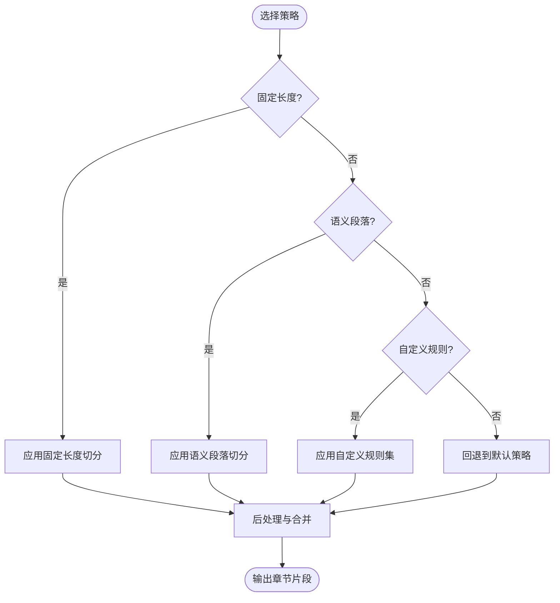
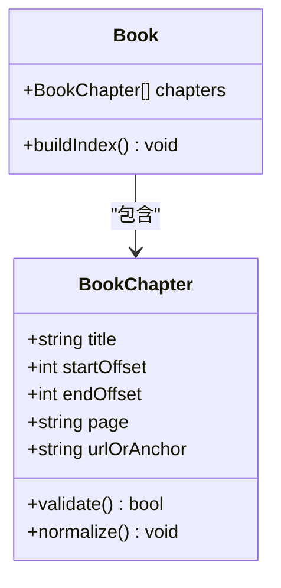
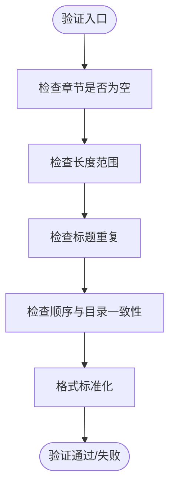
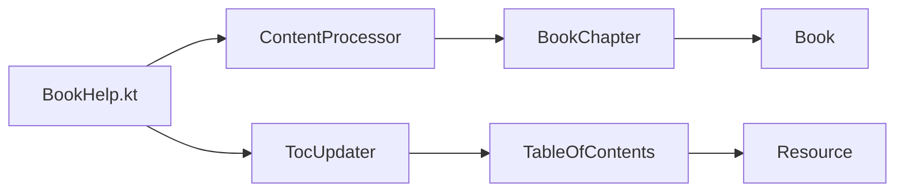

# 章节分割算法

<cite>
**本文引用的文件**   
- [legado-core/src/content_processor.rs](file://rust/legado-core/src/content_processor.rs)
- [legado-core/src/toc_updater.rs](file://rust/legado-core/src/toc_updater.rs)
- [legado-book/src/main/java/me/ag2s/epublib/EPUBReader.java](file://modules/book/src/main/java/me/ag2s/epublib/EPUBReader.java)
- [legado-book/src/main/java/me/ag2s/epublib/model/TableOfContents.java](file://modules/book/src/main/java/me/ag2s/epublib/model/TableOfContents.java)
- [legado-book/src/main/java/me/ag2s/epublib/model/Resource.java](file://modules/book/src/main/java/me/ag2s/epublib/model/Resource.java)
- [legado-core/src/models/book_chapter.rs](file://rust/legado-core/src/models/book_chapter.rs)
- [legado-core/src/models/book.rs](file://rust/legado-core/src/models/book.rs)
- [app/src/main/java/io/legado/app/help/book/BookHelp.kt](file://app/src/main/java/io/legado/app/help/book/BookHelp.kt)
</cite>

## 目录
1. [简介](#简介)
2. [项目结构](#项目结构)
3. [核心组件](#核心组件)
4. [架构总览](#架构总览)
5. [详细组件分析](#详细组件分析)
6. [依赖关系分析](#依赖关系分析)
7. [性能考量](#性能考量)
8. [故障排查指南](#故障排查指南)
9. [结论](#结论)
10. [附录](#附录)

## 简介
本文件系统性阐述 Legado 的“章节分割算法”，聚焦以下目标：
- 智能章节识别机制：标题模式匹配、目录结构分析、语义边界检测。
- 章节分割策略：固定长度分割、语义段落分割、自定义规则应用。
- 章节元数据提取：章节标题、页码信息、导航链接。
- 章节验证功能：内容完整性检查与格式标准化。
- 不同书籍类型的配置与优化建议（TXT、EPUB、PDF、MOBI 等）。

该文档面向开发者与高级用户，既提供高层架构概览，也深入到代码级实现细节，并辅以可视化图示帮助理解。

## 项目结构
Legado 在 Rust 层负责核心解析与处理逻辑，Java/Kotlin 层负责上层业务集成与 UI 交互，book 模块封装了 EPUB 等格式的底层能力。与章节分割相关的关键位置包括：
- Rust 核心：content_processor.rs、toc_updater.rs、models/book_chapter.rs、models/book.rs
- Java/Kotlin 集成：BookHelp.kt（书籍辅助工具）
- EPUB 模型：TableOfContents.java、Resource.java、EPUBReader.java

**图表来源** 
- [legado-core/src/content_processor.rs](file://rust/legado-core/src/content_processor.rs)
- [legado-core/src/toc_updater.rs](file://rust/legado-core/src/toc_updater.rs)
- [legado-core/src/models/book_chapter.rs](file://rust/legado-core/src/models/book_chapter.rs)
- [legado-core/src/models/book.rs](file://rust/legado-core/src/models/book.rs)
- [app/src/main/java/io/legado/app/help/book/BookHelp.kt](file://app/src/main/java/io/legado/app/help/book/BookHelp.kt)
- [legado-book/src/main/java/me/ag2s/epublib/model/TableOfContents.java](file://modules/book/src/main/java/me/ag2s/epublib/model/TableOfContents.java)
- [legado-book/src/main/java/me/ag2s/epublib/model/Resource.java](file://modules/book/src/main/java/me/ag2s/epublib/model/Resource.java)
- [legado-book/src/main/java/me/ag2s/epublib/EPUBReader.java](file://modules/book/src/main/java/me/ag2s/epublib/EPUBReader.java)

**章节来源**
- [legado-core/src/content_processor.rs](file://rust/legado-core/src/content_processor.rs)
- [legado-core/src/toc_updater.rs](file://rust/legado-core/src/toc_updater.rs)
- [legado-core/src/models/book_chapter.rs](file://rust/legado-core/src/models/book_chapter.rs)
- [legado-core/src/models/book.rs](file://rust/legado-core/src/models/book.rs)
- [app/src/main/java/io/legado/app/help/book/BookHelp.kt](file://app/src/main/java/io/legado/app/help/book/BookHelp.kt)
- [legado-book/src/main/java/me/ag2s/epublib/model/TableOfContents.java](file://modules/book/src/main/java/me/ag2s/epublib/model/TableOfContents.java)
- [legado-book/src/main/java/me/ag2s/epublib/model/Resource.java](file://modules/book/src/main/java/me/ag2s/epublib/model/Resource.java)
- [legado-book/src/main/java/me/ag2s/epublib/EPUBReader.java](file://modules/book/src/main/java/me/ag2s/epublib/EPUBReader.java)

## 核心组件
- 内容处理器（ContentProcessor）：负责文本预处理、正则匹配、语义切分、规则应用与结果聚合。
- 目录更新器（TocUpdater）：基于目录结构生成或修正章节索引，维护导航链接与层级关系。
- 章节模型（BookChapter）：定义章节标题、起始偏移、结束偏移、页码、URL/锚点等元数据。
- 书籍模型（Book）：承载书籍全局信息与章节集合。
- EPUB 模型：TableOfContents、Resource、EPUBReader 提供目录树与资源访问能力。
- Android 集成（BookHelp）：协调各模块完成章节分割流程，输出标准化结果。

**章节来源**
- [legado-core/src/content_processor.rs](file://rust/legado-core/src/content_processor.rs)
- [legado-core/src/toc_updater.rs](file://rust/legado-core/src/toc_updater.rs)
- [legado-core/src/models/book_chapter.rs](file://rust/legado-core/src/models/book_chapter.rs)
- [legado-core/src/models/book.rs](file://rust/legado-core/src/models/book.rs)
- [legado-book/src/main/java/me/ag2s/epublib/model/TableOfContents.java](file://modules/book/src/main/java/me/ag2s/epublib/model/TableOfContents.java)
- [legado-book/src/main/java/me/ag2s/epublib/model/Resource.java](file://modules/book/src/main/java/me/ag2s/epublib/model/Resource.java)
- [legado-book/src/main/java/me/ag2s/epublib/EPUBReader.java](file://modules/book/src/main/java/me/ag2s/epublib/EPUBReader.java)
- [app/src/main/java/io/legado/app/help/book/BookHelp.kt](file://app/src/main/java/io/legado/app/help/book/BookHelp.kt)

## 架构总览
章节分割的整体流程如下：
- 输入：原始文本或结构化文档（如 EPUB 的 HTML 片段）。
- 预处理：清洗、编码统一、空白规范化。
- 智能识别：标题模式匹配、目录结构分析、语义边界检测。
- 分割策略：固定长度、语义段落、自定义规则组合。
- 元数据提取：标题、页码、导航链接（URL/锚点）。
- 验证与标准化：完整性检查、格式归一化、去重与合并。
- 输出：标准化的章节列表及索引。

**图表来源** 
- [app/src/main/java/io/legado/app/help/book/BookHelp.kt](file://app/src/main/java/io/legado/app/help/book/BookHelp.kt)
- [legado-core/src/content_processor.rs](file://rust/legado-core/src/content_processor.rs)
- [legado-core/src/toc_updater.rs](file://rust/legado-core/src/toc_updater.rs)
- [legado-core/src/models/book_chapter.rs](file://rust/legado-core/src/models/book_chapter.rs)
- [legado-core/src/models/book.rs](file://rust/legado-core/src/models/book.rs)
- [legado-book/src/main/java/me/ag2s/epublib/EPUBReader.java](file://modules/book/src/main/java/me/ag2s/epublib/EPUBReader.java)
- [legado-book/src/main/java/me/ag2s/epublib/model/TableOfContents.java](file://modules/book/src/main/java/me/ag2s/epublib/model/TableOfContents.java)

## 详细组件分析

### 智能章节识别机制
- 标题模式匹配：通过正则表达式识别常见标题样式（如“第X章”、“Chapter X”、“X.”等），并结合上下文权重判定是否为章节起点。
- 目录结构分析：优先使用内置目录（如 EPUB 的 TableOfContents）作为权威来源；当目录缺失或不完整时回退到文本模式匹配。
- 语义边界检测：利用段落分隔、空行、标点特征与内容密度变化判断章节边界，避免将长段落错误切分。

**图表来源** 
- [legado-core/src/content_processor.rs](file://rust/legado-core/src/content_processor.rs)
- [legado-core/src/toc_updater.rs](file://rust/legado-core/src/toc_updater.rs)
- [legado-book/src/main/java/me/ag2s/epublib/model/TableOfContents.java](file://modules/book/src/main/java/me/ag2s/epublib/model/TableOfContents.java)

**章节来源**
- [legado-core/src/content_processor.rs](file://rust/legado-core/src/content_processor.rs)
- [legado-core/src/toc_updater.rs](file://rust/legado-core/src/toc_updater.rs)
- [legado-book/src/main/java/me/ag2s/epublib/model/TableOfContents.java](file://modules/book/src/main/java/me/ag2s/epublib/model/TableOfContents.java)

### 章节分割策略
- 固定长度分割：适用于无目录且标题不规范的纯文本，按字符数或行数切分，需配合最小长度阈值与最大碎片限制。
- 语义段落分割：依据段落分隔符、空行、标点与内容密度变化进行切分，适合小说、散文等自然语言文本。
- 自定义规则应用：允许通过规则引擎（正则、XPath、JSONPath）对特定站点或书籍类型进行精准切分，支持优先级与覆盖策略。

**图表来源** 
- [legado-core/src/content_processor.rs](file://rust/legado-core/src/content_processor.rs)

**章节来源**
- [legado-core/src/content_processor.rs](file://rust/legado-core/src/content_processor.rs)

### 章节元数据提取
- 章节标题：从目录节点或标题匹配结果中提取，并进行去噪与标准化（去除序号、统一大小写）。
- 页码信息：对于 PDF/EPUB 等带分页的结构化文档，尝试从页面元数据或渲染位置推断页码；否则标记为未知。
- 导航链接：记录 URL 或锚点，确保阅读跳转准确；对相对路径进行规范化与去重。

**图表来源** 
- [legado-core/src/models/book_chapter.rs](file://rust/legado-core/src/models/book_chapter.rs)
- [legado-core/src/models/book.rs](file://rust/legado-core/src/models/book.rs)

**章节来源**
- [legado-core/src/models/book_chapter.rs](file://rust/legado-core/src/models/book_chapter.rs)
- [legado-core/src/models/book.rs](file://rust/legado-core/src/models/book.rs)

### 章节验证与格式标准化
- 内容完整性检查：确保每个章节非空、长度合理、无重复标题、无异常嵌套。
- 格式标准化：统一换行、清理多余空白、修复破损标签（HTML）、转义特殊字符。
- 一致性校验：章节顺序与目录一致，导航链接有效，页码单调递增（若存在）。

**图表来源** 
- [legado-core/src/content_processor.rs](file://rust/legado-core/src/content_processor.rs)

**章节来源**
- [legado-core/src/content_processor.rs](file://rust/legado-core/src/content_processor.rs)

### 不同书籍类型的配置与优化建议
- TXT 文本：
  - 优先启用语义段落分割，设置合理的段落分隔符与最小长度阈值。
  - 若无标题，可结合固定长度分割作为兜底策略。
- EPUB：
  - 优先使用 TableOfContents 构建权威目录，回退到 HTML 标题匹配。
  - 注意资源路径规范化与锚点解析。
- PDF：
  - 页码推断需谨慎，避免跨页误判；必要时结合 OCR 或外部标注。
- MOBI：
  - 类似 EPUB，但需注意旧版格式差异与标签兼容性。

[本节为通用指导，不直接分析具体文件]

## 依赖关系分析
章节分割涉及多模块协作，关键依赖如下：
- BookHelp.kt 协调 ContentProcessor 与 TocUpdater。
- ContentProcessor 依赖正则与规则引擎进行文本处理。
- TocUpdater 依赖 EPUB 模型的 TableOfContents 与 Resource。
- BookChapter 与 Book 作为数据载体贯穿全流程。

**图表来源** 
- [app/src/main/java/io/legado/app/help/book/BookHelp.kt](file://app/src/main/java/io/legado/app/help/book/BookHelp.kt)
- [legado-core/src/content_processor.rs](file://rust/legado-core/src/content_processor.rs)
- [legado-core/src/toc_updater.rs](file://rust/legado-core/src/toc_updater.rs)
- [legado-core/src/models/book_chapter.rs](file://rust/legado-core/src/models/book_chapter.rs)
- [legado-core/src/models/book.rs](file://rust/legado-core/src/models/book.rs)
- [legado-book/src/main/java/me/ag2s/epublib/model/TableOfContents.java](file://modules/book/src/main/java/me/ag2s/epublib/model/TableOfContents.java)
- [legado-book/src/main/java/me/ag2s/epublib/model/Resource.java](file://modules/book/src/main/java/me/ag2s/epublib/model/Resource.java)

**章节来源**
- [app/src/main/java/io/legado/app/help/book/BookHelp.kt](file://app/src/main/java/io/legado/app/help/book/BookHelp.kt)
- [legado-core/src/content_processor.rs](file://rust/legado-core/src/content_processor.rs)
- [legado-core/src/toc_updater.rs](file://rust/legado-core/src/toc_updater.rs)
- [legado-core/src/models/book_chapter.rs](file://rust/legado-core/src/models/book_chapter.rs)
- [legado-core/src/models/book.rs](file://rust/legado-core/src/models/book.rs)
- [legado-book/src/main/java/me/ag2s/epublib/model/TableOfContents.java](file://modules/book/src/main/java/me/ag2s/epublib/model/TableOfContents.java)
- [legado-book/src/main/java/me/ag2s/epublib/model/Resource.java](file://modules/book/src/main/java/me/ag2s/epublib/model/Resource.java)

## 性能考量
- 文本预处理：尽量流式处理大文本，避免一次性加载全部内存。
- 正则匹配：编译复用正则表达式，减少重复开销。
- 目录解析：优先使用结构化目录（EPUB），避免全量文本扫描。
- 规则引擎：规则数量与复杂度影响性能，建议分层与短路评估。
- 缓存与增量更新：对已解析的目录与规则结果进行缓存，支持增量更新。

[本节为通用指导，不直接分析具体文件]

## 故障排查指南
- 章节标题缺失：检查目录是否可用，回退到标题模式匹配；确认正则规则是否覆盖目标样式。
- 章节过长或过短：调整固定长度阈值与语义段落分隔符；增加最小长度与最大碎片限制。
- 导航链接失效：校验相对路径规范化与锚点解析；检查资源路径与编码。
- 页码不准确：确认源格式是否支持页码推断；必要时关闭页码推断或引入外部标注。
- 重复章节：启用去重策略，合并相邻小节；检查目录层级是否正确。

**章节来源**
- [legado-core/src/content_processor.rs](file://rust/legado-core/src/content_processor.rs)
- [legado-core/src/toc_updater.rs](file://rust/legado-core/src/toc_updater.rs)
- [legado-book/src/main/java/me/ag2s/epublib/model/TableOfContents.java](file://modules/book/src/main/java/me/ag2s/epublib/model/TableOfContents.java)

## 结论
Legado 的章节分割算法以“目录优先、语义增强、规则定制”为核心思想，兼顾准确性与可扩展性。通过内容处理器与目录更新器的协同工作，能够在多种书籍类型下稳定输出标准化章节列表。实际应用中，应根据书籍类型选择合适的策略与参数，并结合验证与标准化流程提升质量。

[本节为总结，不直接分析具体文件]

## 附录
- 术语表：
  - 目录（TableOfContents）：书籍的结构化导航信息。
  - 语义边界：基于内容与格式特征的章节切分点。
  - 固定长度分割：按字符或行数切分的策略。
  - 自定义规则：针对特定来源或格式的正则/XPath/JSONPath 规则。
- 最佳实践：
  - 优先使用结构化目录，其次依赖语义与规则。
  - 保持规则简洁与高命中率，避免过度复杂。
  - 持续监控与迭代规则，适应新书源与格式变化。

[本节为补充信息，不直接分析具体文件]