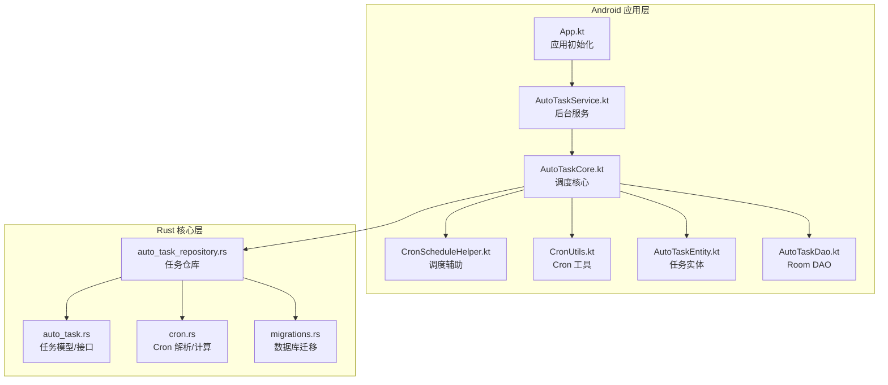
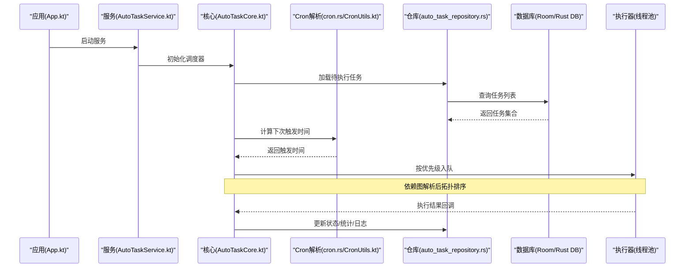
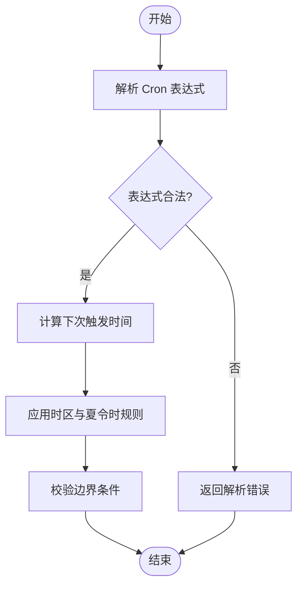
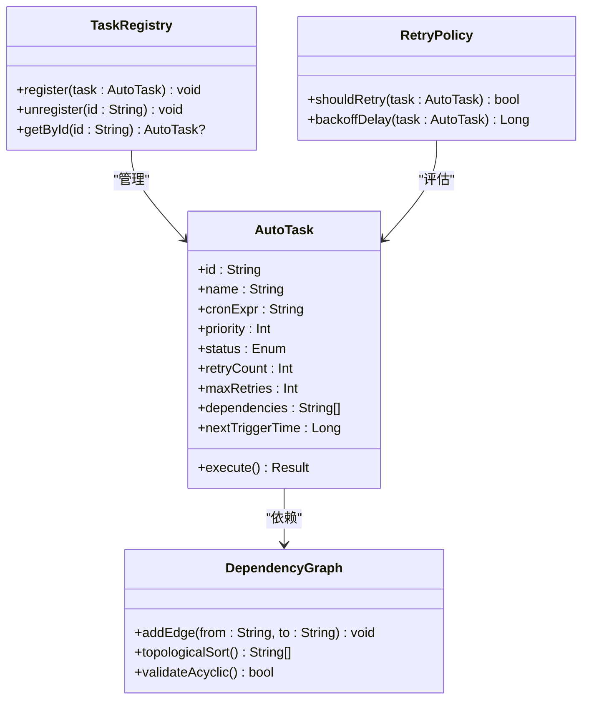
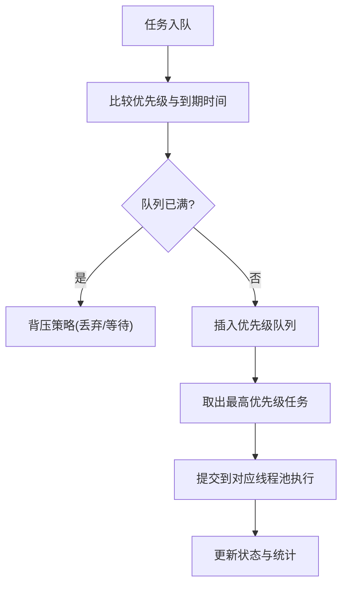
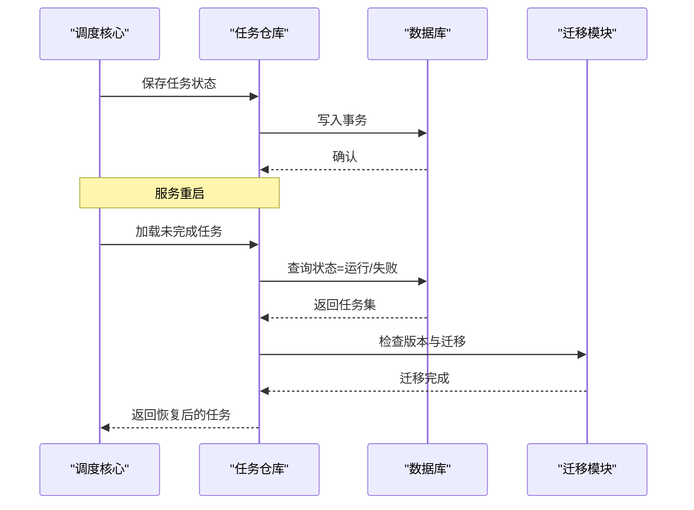
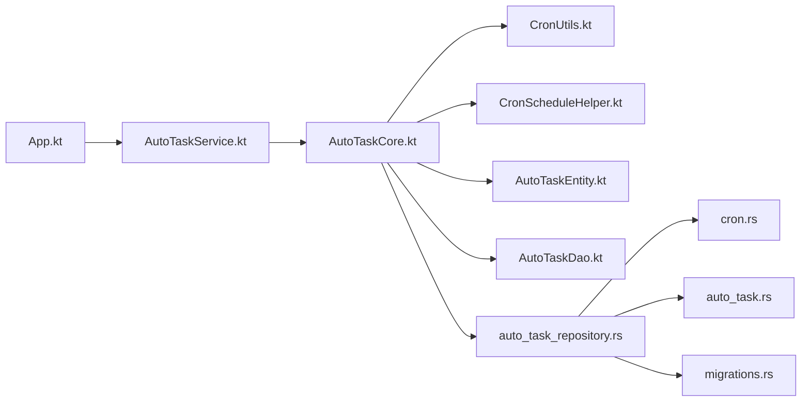

# 任务调度

<cite>
**本文引用的文件**   
- [app/src/main/java/io/legado/app/App.kt](file://app/src/main/java/io/legado/app/App.kt)
- [app/src/main/java/io/legado/app/service/AutoTaskService.kt](file://app/src/main/java/io/legado/app/service/AutoTaskService.kt)
- [app/src/main/java/io/legado/app/model/AutoTaskCore.kt](file://app/src/main/java/io/legado/app/model/AutoTaskCore.kt)
- [app/src/main/java/io/legado/app/help/CronScheduleHelper.kt](file://app/src/main/java/io/legado/app/help/CronScheduleHelper.kt)
- [app/src/main/java/io/legado/app/utils/CronUtils.kt](file://app/src/main/java/io/legado/app/utils/CronUtils.kt)
- [app/src/main/java/io/legado/app/data/entity/AutoTaskEntity.kt](file://app/src/main/java/io/legado/app/data/entity/AutoTaskEntity.kt)
- [app/src/main/java/io/legado/app/data/dao/AutoTaskDao.kt](file://app/src/main/java/io/legado/app/data/dao/AutoTaskDao.kt)
- [rust/legado-core/src/auto_task.rs](file://rust/legado-core/src/auto_task.rs)
- [rust/legado-core/src/cron.rs](file://rust/legado-core/src/cron.rs)
- [rust/legado-db/src/repository/auto_task_repository.rs](file://rust/legado-db/src/repository/auto_task_repository.rs)
- [rust/legado-db/src/migration/migrations.rs](file://rust/legado-db/src/migration/migrations.rs)
- [app/src/test/java/io/legado/app/model/AutoTaskCoreTest.kt](file://app/src/test/java/io/legado/app/model/AutoTaskCoreTest.kt)
- [app/src/test/java/io/legado/app/model/AutoTaskSchedulePolicyTest.kt](file://app/src/test/java/io/legado/app/model/AutoTaskSchedulePolicyTest.kt)
- [app/src/test/java/io/legado/app/utils/CronScheduleTest.kt](file://app/src/test/java/io/legado/app/utils/CronScheduleTest.kt)
</cite>

## 目录
1. [简介](#简介)
2. [项目结构](#项目结构)
3. [核心组件](#核心组件)
4. [架构总览](#架构总览)
5. [详细组件分析](#详细组件分析)
6. [依赖关系分析](#依赖关系分析)
7. [性能考量](#性能考量)
8. [故障排查指南](#故障排查指南)
9. [结论](#结论)
10. [附录](#附录)

## 简介
本文件面向“任务调度系统”的完整文档，覆盖定时任务框架（Cron 表达式解析、触发与执行）、自动任务管理（注册、依赖、重试）、优先级队列（排序、资源分配、并发控制）、监控（日志、统计、告警）以及持久化（状态保存、恢复、迁移）。同时提供配置示例与扩展开发指南，帮助读者快速理解并基于现有代码进行二次开发。

## 项目结构
该任务调度系统在 Android 应用层与 Rust 核心层协同实现：
- Android 层负责服务生命周期、UI 交互、调度策略与 Cron 工具封装。
- Rust 层提供高性能 Cron 解析、任务模型与数据库仓库访问。
- 数据层通过 Room DAO 与 SQLite 完成持久化，Rust 侧通过 Repository 抽象统一读写。

图表来源 
- [app/src/main/java/io/legado/app/App.kt](file://app/src/main/java/io/legado/app/App.kt)
- [app/src/main/java/io/legado/app/service/AutoTaskService.kt](file://app/src/main/java/io/legado/app/service/AutoTaskService.kt)
- [app/src/main/java/io/legado/app/model/AutoTaskCore.kt](file://app/src/main/java/io/legado/app/model/AutoTaskCore.kt)
- [app/src/main/java/io/legado/app/help/CronScheduleHelper.kt](file://app/src/main/java/io/legado/app/help/CronScheduleHelper.kt)
- [app/src/main/java/io/legado/app/utils/CronUtils.kt](file://app/src/main/java/io/legado/app/utils/CronUtils.kt)
- [app/src/main/java/io/legado/app/data/entity/AutoTaskEntity.kt](file://app/src/main/java/io/legado/app/data/entity/AutoTaskEntity.kt)
- [app/src/main/java/io/legado/app/data/dao/AutoTaskDao.kt](file://app/src/main/java/io/legado/app/data/dao/AutoTaskDao.kt)
- [rust/legado-core/src/auto_task.rs](file://rust/legado-core/src/auto_task.rs)
- [rust/legado-core/src/cron.rs](file://rust/legado-core/src/cron.rs)
- [rust/legado-db/src/repository/auto_task_repository.rs](file://rust/legado-db/src/repository/auto_task_repository.rs)
- [rust/legado-db/src/migration/migrations.rs](file://rust/legado-db/src/migration/migrations.rs)

章节来源
- [app/src/main/java/io/legado/app/App.kt](file://app/src/main/java/io/legado/app/App.kt)
- [app/src/main/java/io/legado/app/service/AutoTaskService.kt](file://app/src/main/java/io/legado/app/service/AutoTaskService.kt)
- [app/src/main/java/io/legado/app/model/AutoTaskCore.kt](file://app/src/main/java/io/legado/app/model/AutoTaskCore.kt)
- [rust/legado-core/src/auto_task.rs](file://rust/legado-core/src/auto_task.rs)
- [rust/legado-core/src/cron.rs](file://rust/legado-core/src/cron.rs)
- [rust/legado-db/src/repository/auto_task_repository.rs](file://rust/legado-db/src/repository/auto_task_repository.rs)
- [rust/legado-db/src/migration/migrations.rs](file://rust/legado-db/src/migration/migrations.rs)

## 核心组件
- 调度服务（AutoTaskService）：管理任务服务的生命周期、启动/停止、前台通知与线程池隔离。
- 调度核心（AutoTaskCore）：聚合任务注册、依赖解析、优先级队列、触发器与执行器，协调 Cron 计算与重试策略。
- Cron 解析与计算（CronUtils / CronScheduleHelper / cron.rs）：解析标准 Cron 表达式，计算下次触发时间，支持时区与边界条件处理。
- 任务实体与 DAO（AutoTaskEntity / AutoTaskDao）：定义任务字段、状态机与持久化操作。
- Rust 任务模型与仓库（auto_task.rs / auto_task_repository.rs）：跨语言任务模型、CRUD 与事务封装。
- 数据库迁移（migrations.rs）：版本演进与兼容性保障。

章节来源
- [app/src/main/java/io/legado/app/service/AutoTaskService.kt](file://app/src/main/java/io/legado/app/service/AutoTaskService.kt)
- [app/src/main/java/io/legado/app/model/AutoTaskCore.kt](file://app/src/main/java/io/legado/app/model/AutoTaskCore.kt)
- [app/src/main/java/io/legado/app/help/CronScheduleHelper.kt](file://app/src/main/java/io/legado/app/help/CronScheduleHelper.kt)
- [app/src/main/java/io/legado/app/utils/CronUtils.kt](file://app/src/main/java/io/legado/app/utils/CronUtils.kt)
- [app/src/main/java/io/legado/app/data/entity/AutoTaskEntity.kt](file://app/src/main/java/io/legado/app/data/entity/AutoTaskEntity.kt)
- [app/src/main/java/io/legado/app/data/dao/AutoTaskDao.kt](file://app/src/main/java/io/legado/app/data/dao/AutoTaskDao.kt)
- [rust/legado-core/src/auto_task.rs](file://rust/legado-core/src/auto_task.rs)
- [rust/legado-db/src/repository/auto_task_repository.rs](file://rust/legado-db/src/repository/auto_task_repository.rs)

## 架构总览
下图展示从应用启动到任务触发的端到端流程，包括服务初始化、任务加载、Cron 计算、队列入队与执行。

图表来源 
- [app/src/main/java/io/legado/app/App.kt](file://app/src/main/java/io/legado/app/App.kt)
- [app/src/main/java/io/legado/app/service/AutoTaskService.kt](file://app/src/main/java/io/legado/app/service/AutoTaskService.kt)
- [app/src/main/java/io/legado/app/model/AutoTaskCore.kt](file://app/src/main/java/io/legado/app/model/AutoTaskCore.kt)
- [rust/legado-core/src/cron.rs](file://rust/legado-core/src/cron.rs)
- [app/src/main/java/io/legado/app/utils/CronUtils.kt](file://app/src/main/java/io/legado/app/utils/CronUtils.kt)
- [rust/legado-db/src/repository/auto_task_repository.rs](file://rust/legado-db/src/repository/auto_task_repository.rs)

## 详细组件分析

### Cron 表达式解析与触发机制
- 解析能力：支持标准 Cron 字段（秒/分/时/日/月/周），包含通配符、步长、范围与列表。
- 触发计算：根据当前时间与表达式计算下一次触发时刻，考虑闰年、月末与跨月边界。
- 时区与夏令时：在 Android 层使用系统时区，Rust 层提供稳定计算逻辑，避免歧义。
- 错误处理：非法表达式返回明确错误码，便于上层记录与回退策略。

图表来源 
- [rust/legado-core/src/cron.rs](file://rust/legado-core/src/cron.rs)
- [app/src/main/java/io/legado/app/utils/CronUtils.kt](file://app/src/main/java/io/legado/app/utils/CronUtils.kt)
- [app/src/main/java/io/legado/app/help/CronScheduleHelper.kt](file://app/src/main/java/io/legado/app/help/CronScheduleHelper.kt)

章节来源
- [rust/legado-core/src/cron.rs](file://rust/legado-core/src/cron.rs)
- [app/src/main/java/io/legado/app/utils/CronUtils.kt](file://app/src/main/java/io/legado/app/utils/CronUtils.kt)
- [app/src/main/java/io/legado/app/help/CronScheduleHelper.kt](file://app/src/main/java/io/legado/app/help/CronScheduleHelper.kt)
- [app/src/test/java/io/legado/app/utils/CronScheduleTest.kt](file://app/src/test/java/io/legado/app/utils/CronScheduleTest.kt)

### 自动任务管理与依赖关系
- 任务注册：支持动态注册与静态配置加载，重复注册会合并或拒绝。
- 依赖关系：有向无环图（DAG）建模，构建阶段进行拓扑排序，确保前置任务完成后才触发后续任务。
- 失败重试：指数退避与最大重试次数限制，支持可配置的重试策略与死信队列。
- 状态机：任务状态包括待执行、运行中、成功、失败、已取消等，状态变更需原子写入。

图表来源 
- [app/src/main/java/io/legado/app/data/entity/AutoTaskEntity.kt](file://app/src/main/java/io/legado/app/data/entity/AutoTaskEntity.kt)
- [app/src/main/java/io/legado/app/model/AutoTaskCore.kt](file://app/src/main/java/io/legado/app/model/AutoTaskCore.kt)
- [rust/legado-core/src/auto_task.rs](file://rust/legado-core/src/auto_task.rs)

章节来源
- [app/src/main/java/io/legado/app/data/entity/AutoTaskEntity.kt](file://app/src/main/java/io/legado/app/data/entity/AutoTaskEntity.kt)
- [app/src/main/java/io/legado/app/model/AutoTaskCore.kt](file://app/src/main/java/io/legado/app/model/AutoTaskCore.kt)
- [rust/legado-core/src/auto_task.rs](file://rust/legado-core/src/auto_task.rs)
- [app/src/test/java/io/legado/app/model/AutoTaskCoreTest.kt](file://app/src/test/java/io/legado/app/model/AutoTaskCoreTest.kt)
- [app/src/test/java/io/legado/app/model/AutoTaskSchedulePolicyTest.kt](file://app/src/test/java/io/legado/app/model/AutoTaskSchedulePolicyTest.kt)

### 优先级队列与并发控制
- 任务排序：基于优先级数值与到期时间双键排序，高优先级且即将到期的任务优先出队。
- 资源分配：为不同任务类型分配独立线程池，避免相互阻塞；CPU 密集型与 IO 密集型分离。
- 并发控制：令牌桶或信号量限流，防止瞬时峰值导致资源耗尽；支持全局与任务级并发上限。
- 背压与丢弃：当队列饱和时，依据策略丢弃低优先级任务或等待。

图表来源 
- [app/src/main/java/io/legado/app/model/AutoTaskCore.kt](file://app/src/main/java/io/legado/app/model/AutoTaskCore.kt)

章节来源
- [app/src/main/java/io/legado/app/model/AutoTaskCore.kt](file://app/src/main/java/io/legado/app/model/AutoTaskCore.kt)

### 任务监控：日志、统计与告警
- 执行日志：记录任务开始/结束、耗时、异常堆栈与上下文参数，支持分级输出与采样。
- 性能统计：QPS、平均/分位耗时、成功率、失败率、重试次数与队列长度指标。
- 告警规则：阈值触发（如连续失败、超时、队列积压），通过通知通道上报。
- 可视化：提供 API 或 UI 面板查看实时指标与历史趋势。

章节来源
- [app/src/main/java/io/legado/app/model/AutoTaskCore.kt](file://app/src/main/java/io/legado/app/model/AutoTaskCore.kt)
- [app/src/main/java/io/legado/app/service/AutoTaskService.kt](file://app/src/main/java/io/legado/app/service/AutoTaskService.kt)

### 任务持久化：状态保存、恢复与迁移
- 状态保存：每次状态变更（创建、运行、成功、失败、取消）均落库，保证幂等与一致性。
- 恢复机制：服务重启后扫描未完成的任务，重新计算触发时间并恢复执行。
- 数据迁移：通过 migrations.rs 管理版本升级，兼容旧数据结构，提供增量脚本。
- 备份与导出：支持批量导出任务配置与执行历史，便于审计与迁移。

图表来源 
- [rust/legado-db/src/repository/auto_task_repository.rs](file://rust/legado-db/src/repository/auto_task_repository.rs)
- [rust/legado-db/src/migration/migrations.rs](file://rust/legado-db/src/migration/migrations.rs)
- [app/src/main/java/io/legado/app/data/dao/AutoTaskDao.kt](file://app/src/main/java/io/legado/app/data/dao/AutoTaskDao.kt)

章节来源
- [rust/legado-db/src/repository/auto_task_repository.rs](file://rust/legado-db/src/repository/auto_task_repository.rs)
- [rust/legado-db/src/migration/migrations.rs](file://rust/legado-db/src/migration/migrations.rs)
- [app/src/main/java/io/legado/app/data/dao/AutoTaskDao.kt](file://app/src/main/java/io/legado/app/data/dao/AutoTaskDao.kt)

## 依赖关系分析
- Android 层依赖：AutoTaskCore 依赖 Cron 工具与 DAO；AutoTaskService 管理生命周期与线程池。
- Rust 层依赖：auto_task_repository 依赖 cron 解析与 auto_task 模型；migrations 负责版本演进。
- 耦合度：Core 与 Repo 解耦，通过接口调用；Cron 解析集中在 Rust 层，Android 层仅做适配。

图表来源 
- [app/src/main/java/io/legado/app/App.kt](file://app/src/main/java/io/legado/app/App.kt)
- [app/src/main/java/io/legado/app/service/AutoTaskService.kt](file://app/src/main/java/io/legado/app/service/AutoTaskService.kt)
- [app/src/main/java/io/legado/app/model/AutoTaskCore.kt](file://app/src/main/java/io/legado/app/model/AutoTaskCore.kt)
- [app/src/main/java/io/legado/app/utils/CronUtils.kt](file://app/src/main/java/io/legado/app/utils/CronUtils.kt)
- [app/src/main/java/io/legado/app/help/CronScheduleHelper.kt](file://app/src/main/java/io/legado/app/help/CronScheduleHelper.kt)
- [app/src/main/java/io/legado/app/data/entity/AutoTaskEntity.kt](file://app/src/main/java/io/legado/app/data/entity/AutoTaskEntity.kt)
- [app/src/main/java/io/legado/app/data/dao/AutoTaskDao.kt](file://app/src/main/java/io/legado/app/data/dao/AutoTaskDao.kt)
- [rust/legado-db/src/repository/auto_task_repository.rs](file://rust/legado-db/src/repository/auto_task_repository.rs)
- [rust/legado-core/src/cron.rs](file://rust/legado-core/src/cron.rs)
- [rust/legado-core/src/auto_task.rs](file://rust/legado-core/src/auto_task.rs)
- [rust/legado-db/src/migration/migrations.rs](file://rust/legado-db/src/migration/migrations.rs)

章节来源
- [app/src/main/java/io/legado/app/model/AutoTaskCore.kt](file://app/src/main/java/io/legado/app/model/AutoTaskCore.kt)
- [rust/legado-db/src/repository/auto_task_repository.rs](file://rust/legado-db/src/repository/auto_task_repository.rs)

## 性能考量
- Cron 计算复杂度：单次计算 O(1) 近似，批量计算 O(n)，建议缓存最近触发时间。
- 队列操作：优先级队列插入与弹出 O(log n)，注意避免频繁重排。
- 线程池隔离：IO 密集与 CPU 密集分离，降低锁竞争与上下文切换开销。
- 背压策略：合理设置队列容量与丢弃策略，避免内存溢出。
- 批处理与合并：对高频小任务进行合并执行，减少调度开销。

## 故障排查指南
- Cron 表达式无效：检查语法与边界值，参考测试用例验证。
- 任务不触发：确认依赖是否满足、优先级是否正确、队列是否被背压丢弃。
- 执行失败：查看日志级别与堆栈，定位外部依赖问题；检查重试策略是否达到上限。
- 状态不一致：核对事务写入顺序与幂等性，必要时手动修复状态。
- 迁移失败：检查版本号与脚本兼容性，回滚或补全迁移步骤。

章节来源
- [app/src/test/java/io/legado/app/utils/CronScheduleTest.kt](file://app/src/test/java/io/legado/app/utils/CronScheduleTest.kt)
- [app/src/test/java/io/legado/app/model/AutoTaskCoreTest.kt](file://app/src/test/java/io/legado/app/model/AutoTaskCoreTest.kt)
- [app/src/test/java/io/legado/app/model/AutoTaskSchedulePolicyTest.kt](file://app/src/test/java/io/legado/app/model/AutoTaskSchedulePolicyTest.kt)

## 结论
本任务调度系统以 Android 服务与 Rust 核心协作的方式，实现了高可靠、可扩展的定时任务框架。通过标准化的 Cron 解析、严格的依赖管理与优先级队列，结合完善的监控与持久化机制，能够满足复杂业务场景下的自动化需求。建议在扩展时遵循现有接口约定，保持 Cron 解析与任务模型的稳定性，并通过测试覆盖关键路径。

## 附录
- 配置示例
  - Cron 表达式：分钟/小时/日/月/周的组合，例如每 5 分钟执行一次。
  - 任务优先级：数值越小优先级越高，默认值为中等。
  - 重试策略：最大重试次数与退避间隔，建议不超过 3 次。
  - 线程池：为 IO 密集型任务分配较大线程数，CPU 密集型限制并发。
- 扩展开发指南
  - 新增任务类型：继承任务基类，实现 execute 方法，注册到调度核心。
  - 自定义 Cron 解析：在 Rust 层扩展解析器，Android 层适配调用。
  - 监控接入：实现日志与指标上报接口，接入统一监控平台。
  - 持久化扩展：在 DAO 与 Repository 中增加字段与查询方法，同步更新迁移脚本。