# 自动任务管理

<cite>
**本文引用的文件**   
- [auto_task.rs](file://rust/legado-core/src/auto_task.rs)
- [cron.rs](file://rust/legado-core/src/cron.rs)
- [auto_task_repository.rs](file://rust/legado-db/src/repository/auto_task_repository.rs)
- [auto_task_api.rs](file://rust/legado-ffi/src/api/auto_task_api.rs)
- [auto_task_handler.rs](file://rust/legado-server/src/handlers/auto_task_handler.rs)
- [auto_task_notifier.dart](file://flutter_legado/lib/src/providers/auto_task/auto_task_notifier.dart)
- [auto_task_screen.dart](file://flutter_legado/lib/src/screens/auto_task_screen.dart)
- [other_settings_screen.dart](file://flutter_legado/lib/src/screens/other_settings_screen.dart)
- [AutoTask.kt](file://app/src/main/java/io/legado/app/model/AutoTask.kt)
- [AutoTaskScheduler.kt](file://app/src/main/java/io/legado/app/service/AutoTaskScheduler.kt)
- [AutoTaskRule.kt](file://app/src/main/java/io/legado/app/data/entities/AutoTaskRule.kt)
- [auto_task_scheduler.dart](file://flutter_legado/lib/src/services/auto_task_scheduler.dart)
- [book_api.dart](file://flutter_legado/lib/src/services/book_api.dart)
</cite>

## 更新摘要
**变更内容**
- 新增 Flutter 应用内自动任务调度器（AutoTaskScheduler）完整实现
- 对齐 Kotlin 原版 AutoTaskScheduler + AutoTaskJobService + AutoTaskSchedulePolicy 特性
- 实现 Cron 表达式支持、执行锁机制、指数退避重试等核心功能
- 补充调度器与 BookApi 的集成关系说明
- **新增** 原始 JSON 任务创建/更新能力：createTaskRaw/updateTaskRaw，保留复杂 action 脚本
- **新增** 书籍更新任务专用对话框：_showBookUpdateTaskDialog，仅编辑 name/cron，保留完整 script
- **新增** FFI/REST 双通道架构：FFI 优先，失败降级到 REST API
- **增强** 书籍更新任务查找逻辑：从 DB 读取全量规则进行匹配，避免占位脚本导致匹配失败
- **修复** 对话框红屏崩溃问题：将对话框重构为自包含 StatefulWidget 实例，防止异步回调中的跨上下文 setState 调用

## 目录
1. [简介](#简介)
2. [项目结构](#项目结构)
3. [核心组件](#核心组件)
4. [架构总览](#架构总览)
5. [详细组件分析](#详细组件分析)
6. [依赖关系分析](#依赖关系分析)
7. [性能考量](#性能考量)
8. [故障排查指南](#故障排查指南)
9. [结论](#结论)
10. [附录](#附录)

## 简介
本文件系统性梳理 Legado 项目的"自动任务管理"能力，覆盖 Rust 核心逻辑、FFI 暴露接口、服务端 REST API、Flutter 前端状态与页面、以及 Android 原生调度与持久化。重点包括：
- 任务协议与执行器（刷新目录、缓存新增章节、更新书源、备份、通知、自定义 JS）
- Cron 表达式解析与到期判定（轻量策略与完整解析）
- 数据持久化（SQLite 批量操作、导入导出合并策略）
- **新增** Flutter 端 FFI 优先 + REST 降级双通道架构
- **新增** Flutter 应用内调度器：基于 Timer 的定时调度，支持 Cron 表达式、执行锁、指数退避重试
- **新增** 原始 JSON 任务创建/更新：保留复杂 action 脚本，避免模型序列化丢失信息
- **新增** 书籍更新任务专用对话框：简化编辑流程，仅修改 name/cron 字段
- **修复** 对话框红屏崩溃问题：通过重构为自包含 StatefulWidget 实例来管理表单状态，防止异步回调中的跨上下文 setState 调用
- Android 端 JobScheduler 定时调度与规则管理

## 项目结构
自动任务相关代码横跨多模块：
- Rust 核心层：任务协议、执行器、调度策略、Cron 解析、导入导出
- Rust DB 层：auto_task_rules 表 CRUD 与批量更新
- Rust FFI 层：对外暴露 JSON 序列化接口
- Rust Server 层：REST API（开发/调试用内存存储）
- Flutter 层：Riverpod Notifier 与 UI 页面，**新增 FFI/REST 双通道、原始 JSON 操作、应用内调度器、自包含对话框组件**
- Android 层：实体模型、调度器、任务构建与导入导出

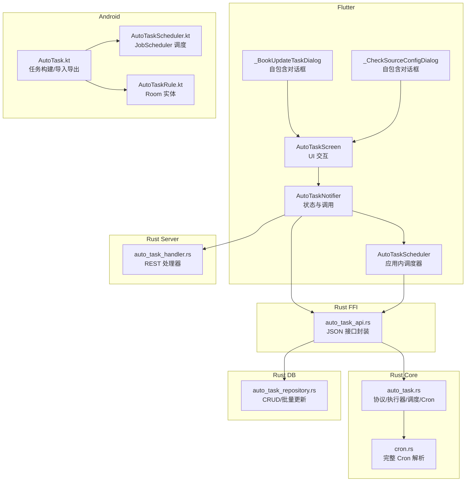

**图表来源** 
- [auto_task_scheduler.dart:14-34](file://flutter_legado/lib/src/services/auto_task_scheduler.dart#L14-L34)
- [book_api.dart:812-884](file://flutter_legado/lib/src/services/book_api.dart#L812-L884)
- [auto_task_api.rs:1-120](file://rust/legado-ffi/src/api/auto_task_api.rs#L1-L120)
- [auto_task.rs:1-200](file://rust/legado-core/src/auto_task.rs#L1-L200)
- [cron.rs:1-120](file://rust/legado-core/src/cron.rs#L1-L120)
- [auto_task_repository.rs:1-120](file://rust/legado-db/src/repository/auto_task_repository.rs#L1-L120)
- [auto_task_handler.rs:1-120](file://rust/legado-server/src/handlers/auto_task_handler.rs#L1-L120)
- [auto_task_notifier.dart:1-120](file://flutter_legado/lib/src/providers/auto_task/auto_task_notifier.dart#L1-L120)
- [auto_task_screen.dart:1-120](file://flutter_legado/lib/src/screens/auto_task_screen.dart#L1-L120)
- [other_settings_screen.dart:1326-1494](file://flutter_legado/lib/src/screens/other_settings_screen.dart#L1326-L1494)
- [AutoTask.kt:1-120](file://app/src/main/java/io/legado/app/model/AutoTask.kt#L1-L120)
- [AutoTaskScheduler.kt:1-98](file://app/src/main/java/io/legado/app/service/AutoTaskScheduler.kt#L1-L98)
- [AutoTaskRule.kt:1-52](file://app/src/main/java/io/legado/app/data/entities/AutoTaskRule.kt#L1-L52)

**章节来源**
- [auto_task_scheduler.dart:1-259](file://flutter_legado/lib/src/services/auto_task_scheduler.dart#L1-L259)
- [book_api.dart:812-884](file://flutter_legado/lib/src/services/book_api.dart#L812-L884)
- [auto_task.rs:1-200](file://rust/legado-core/src/auto_task.rs#L1-L200)
- [cron.rs:1-120](file://rust/legado-core/src/cron.rs#L1-L120)
- [auto_task_repository.rs:1-120](file://rust/legado-db/src/repository/auto_task_repository.rs#L1-L120)
- [auto_task_api.rs:1-120](file://rust/legado-ffi/src/api/auto_task_api.rs#L1-L120)
- [auto_task_handler.rs:1-120](file://rust/legado-server/src/handlers/auto_task_handler.rs#L1-L120)
- [auto_task_notifier.dart:1-120](file://flutter_legado/lib/src/providers/auto_task/auto_task_notifier.dart#L1-L120)
- [auto_task_screen.dart:1-120](file://flutter_legado/lib/src/screens/auto_task_screen.dart#L1-L120)
- [other_settings_screen.dart:1326-1494](file://flutter_legado/lib/src/screens/other_settings_screen.dart#L1326-L1494)
- [AutoTask.kt:1-120](file://app/src/main/java/io/legado/app/model/AutoTask.kt#L1-L120)
- [AutoTaskScheduler.kt:1-98](file://app/src/main/java/io/legado/app/service/AutoTaskScheduler.kt#L1-L98)
- [AutoTaskRule.kt:1-52](file://app/src/main/java/io/legado/app/data/entities/AutoTaskRule.kt#L1-L52)

## 核心组件
- 任务协议与执行器
  - 定义 TaskAction（刷新目录、缓存新增章节、更新书源、备份、通知、自定义 JS）
  - AutoTaskRunner 根据协议分发执行并返回结果（含耗时、消息等）
- 调度策略与 Cron
  - 轻量策略 AutoTaskSchedulePolicy：支持 */N 分钟/小时、固定时间、星期约束
  - 完整 CronExpression：标准 5 段表达式，支持范围、步长、列表、OR/AND 语义
- **新增** Flutter 应用内调度器
  - AutoTaskScheduler：基于 Timer 的定时调度，支持 Cron 表达式解析
  - 执行锁机制：串行批次执行，重复触发跳过
  - 指数退避重试：失败后 60 秒重试，避免频繁失败
  - 首次运行宽限期：5 分钟延迟，确保应用启动时不会立即触发
- **新增** 原始 JSON 任务操作
  - createTaskRaw/updateTaskRaw：直接传递完整规则 JSON，保留复杂 action 脚本
  - 避免经 AutoTask 模型序列化丢失 refreshToc action 等关键信息
- **新增** 书籍更新任务专用对话框
  - _showBookUpdateTaskDialog：仅编辑 name/cron 字段，保留完整 script
  - 支持从路由参数传入初始任务或按 ID 定位编辑
- **修复** 对话框红屏崩溃问题
  - _BookUpdateTaskDialog：自包含 StatefulWidget，控制器在 State 内创建和释放
  - _CheckSourceConfigDialog：同样采用自包含模式，避免 Navigator.pop 后立即 dispose 引发的框架断言
  - 确认回传值而非 controller，消除退场动画期间 dispose 引发的框架断言红屏
- 数据访问
  - AutoTaskRepository：auto_task_rules 表的 CRUD 与批量更新（分批避免 SQLite 参数限制）
- **新增** FFI/REST 双通道架构
  - FFI 优先：直接调用 Rust 核心逻辑，性能更优
  - REST 降级：FFI 不可用时回退到 HTTP 请求
- 服务端 REST
  - auto_task_handler.rs：提供 /api/auto-tasks 的增删改查、立即运行、导入导出（内存存储）
- Flutter 状态与 UI
  - AutoTaskNotifier：FFI 优先 + REST 降级；管理任务列表、创建/更新/删除/运行
  - AutoTaskScreen：任务列表、添加/编辑、导入/导出、帮助
- Android 原生
  - AutoTask.kt：任务构建（书籍更新）、导入导出、查找匹配
  - AutoTaskScheduler.kt：基于 JobScheduler 的定时调度
  - AutoTaskRule.kt：Room 实体映射

**章节来源**
- [auto_task.rs:1-200](file://rust/legado-core/src/auto_task.rs#L1-L200)
- [cron.rs:1-120](file://rust/legado-core/src/cron.rs#L1-L120)
- [auto_task_scheduler.dart:14-259](file://flutter_legado/lib/src/services/auto_task_scheduler.dart#L14-L259)
- [book_api.dart:812-884](file://flutter_legado/lib/src/services/book_api.dart#L812-L884)
- [auto_task_repository.rs:1-120](file://rust/legado-db/src/repository/auto_task_repository.rs#L1-L120)
- [auto_task_api.rs:1-120](file://rust/legado-ffi/src/api/auto_task_api.rs#L1-L120)
- [auto_task_handler.rs:1-120](file://rust/legado-server/src/handlers/auto_task_handler.rs#L1-L120)
- [auto_task_notifier.dart:1-120](file://flutter_legado/lib/src/providers/auto_task/auto_task_notifier.dart#L1-L120)
- [auto_task_screen.dart:100-202](file://flutter_legado/lib/src/screens/auto_task_screen.dart#L100-L202)
- [other_settings_screen.dart:1326-1494](file://flutter_legado/lib/src/screens/other_settings_screen.dart#L1326-L1494)
- [AutoTask.kt:1-120](file://app/src/main/java/io/legado/app/model/AutoTask.kt#L1-L120)
- [AutoTaskScheduler.kt:1-98](file://app/src/main/java/io/legado/app/service/AutoTaskScheduler.kt#L1-L98)
- [AutoTaskRule.kt:1-52](file://app/src/main/java/io/legado/app/data/entities/AutoTaskRule.kt#L1-L52)

## 架构总览
系统采用分层设计：Flutter 通过 FFI 调用 Rust 核心，必要时回退到 REST；**新增 Flutter 应用内调度器**负责定时调度；Rust 核心负责协议与调度，DB 层负责持久化；Android 侧使用 JobScheduler 驱动定时任务。**新增自包含对话框组件**解决红屏崩溃问题。

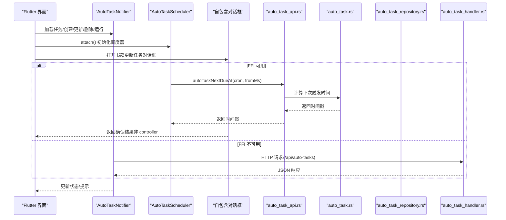

**图表来源** 
- [auto_task_scheduler.dart:65-134](file://flutter_legado/lib/src/services/auto_task_scheduler.dart#L65-L134)
- [book_api.dart:864-867](file://flutter_legado/lib/src/services/book_api.dart#L864-L867)
- [auto_task_notifier.dart:1-200](file://flutter_legado/lib/src/providers/auto_task/auto_task_notifier.dart#L1-L200)
- [auto_task_screen.dart:111-146](file://flutter_legado/lib/src/screens/auto_task_screen.dart#L111-L146)
- [other_settings_screen.dart:855-889](file://flutter_legado/lib/src/screens/other_settings_screen.dart#L855-L889)
- [auto_task_api.rs:1-120](file://rust/legado-ffi/src/api/auto_task_api.rs#L1-L120)
- [auto_task.rs:1-200](file://rust/legado-core/src/auto_task.rs#L1-L200)
- [auto_task_repository.rs:1-120](file://rust/legado-db/src/repository/auto_task_repository.rs#L1-L120)
- [auto_task_handler.rs:1-120](file://rust/legado-server/src/handlers/auto_task_handler.rs#L1-L120)

## 详细组件分析

### 任务协议与执行器（Rust 核心）
- 协议类型与构造
  - TaskProtocol：action + params，提供便捷工厂方法（refresh_toc、cache_chapters、update_sources、backup、notify、custom）
- 执行器
  - AutoTaskRunner.execute_with_id：按 action 分派执行，记录耗时与结果
- 调度策略
  - AutoTaskSchedulePolicy：next_due_at/is_due/due_rules/base_time，支持简单 cron 与周约束
- 工具函数
  - normalize_script：去除 @js: 或 <js></js> 包裹
  - book_update_task_id/build_book_update_task/find_book_update_task：书籍更新任务生成与匹配
  - can_refresh_book_toc：尊重 canUpdate 标志的判断
  - count_new_chapters/new_content_chapters：新增章节统计与提取

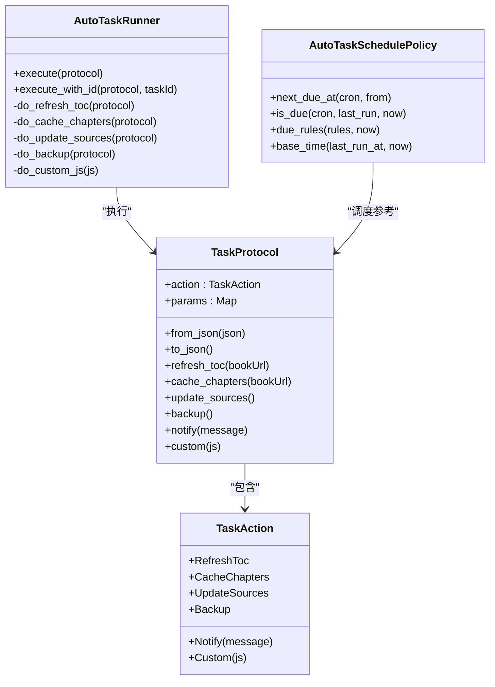

**图表来源** 
- [auto_task.rs:16-196](file://rust/legado-core/src/auto_task.rs#L16-L196)

**章节来源**
- [auto_task.rs:1-200](file://rust/legado-core/src/auto_task.rs#L1-L200)

### Cron 表达式解析（Rust 核心）
- CronExpression：解析标准 5 段表达式，支持 *、*/N、N-M、N-M/S、N,M,O、N/S，周日 0/7 兼容
- next_fire_time：从给定毫秒时间戳开始扫描，最多 8 年周期，返回下一次触发时间
- is_cron_due：便捷判断是否到期

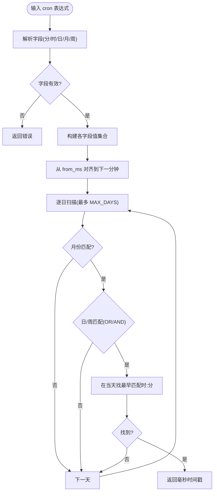

**图表来源** 
- [cron.rs:1-200](file://rust/legado-core/src/cron.rs#L1-L200)

**章节来源**
- [cron.rs:1-200](file://rust/legado-core/src/cron.rs#L1-L200)

### **新增** Flutter 应用内调度器（AutoTaskScheduler）
- **全局单例模式**：对齐 PlatformBridgeService.instance 模式
- **生命周期管理**：WidgetsBindingObserver 监听应用状态变化
- **配置开关**：通过 BookApi.getConfig('autoTaskService') 控制启用状态
- **调度算法**：
  - refresh(afterBatch=false)：基于 lastRunAt 或首次运行宽限期计算下次触发
  - refresh(afterBatch=true)：基于当前时间严格计算下次触发
  - cancelAll()：取消所有待调度任务
- **执行控制**：
  - 执行锁 (_running)：同一时刻仅一批执行，重复触发跳过
  - 代数机制 (_generation)：并发 refresh 互相作废旧一代结果
  - 指数退避重试：失败后 60 秒重试，避免频繁失败
- **任务执行**：
  - 批量获取到期任务 (_dueRules)
  - 逐个执行任务 (autoTaskExecuteWithId)
  - 批次完成后重新调度

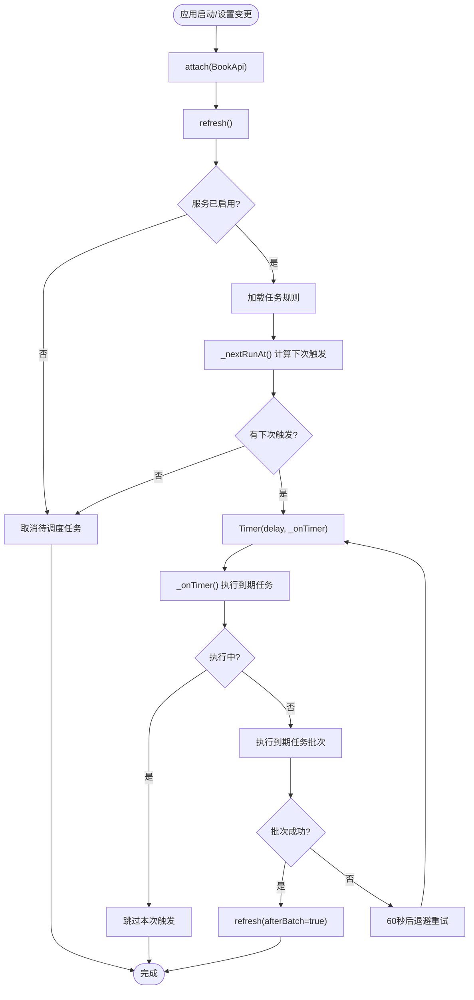

**图表来源** 
- [auto_task_scheduler.dart:65-259](file://flutter_legado/lib/src/services/auto_task_scheduler.dart#L65-L259)

**章节来源**
- [auto_task_scheduler.dart:14-259](file://flutter_legado/lib/src/services/auto_task_scheduler.dart#L14-L259)

### **新增** 原始 JSON 任务操作（AutoTaskNotifier）
- **createTaskRaw(ruleJson)**：直接传递完整规则 JSON，适用于书籍更新任务等复杂 action
- **updateTaskRaw(ruleJson)**：更新时仅修改指定字段，保留其他字段原样
- **错误处理**：jsonDecode 异常捕获，id 缺失时返回 false 而非抛出异常
- **返回值**：bool 类型，true 表示成功，false 表示失败，供调用方决定后续行为

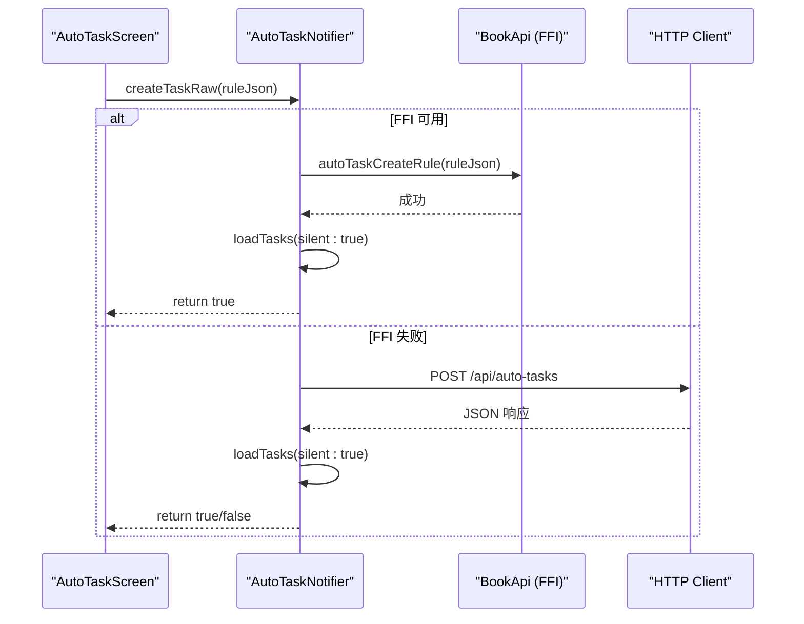

**图表来源** 
- [auto_task_notifier.dart:161-200](file://flutter_legado/lib/src/providers/auto_task/auto_task_notifier.dart#L161-L200)
- [auto_task_notifier.dart:202-253](file://flutter_legado/lib/src/providers/auto_task/auto_task_notifier.dart#L202-L253)

**章节来源**
- [auto_task_notifier.dart:161-253](file://flutter_legado/lib/src/providers/auto_task/auto_task_notifier.dart#L161-L253)

### **新增** 书籍更新任务专用对话框（AutoTaskScreen）
- **_showBookUpdateTaskDialog(rule, isNew)**：专门处理书籍更新任务的创建和编辑
- **字段限制**：仅允许编辑 name 和 cron 字段，保护复杂的 script 不被覆盖
- **Cron 验证**：通过 notifier.nextDueAt 进行实时验证，非法表达式阻止保存
- **路由支持**：支持从 initialNewTask 或 initialEditTaskId 参数进入编辑模式
- **调度器同步**：保存成功后调用 _resyncScheduler() 重新计算调度

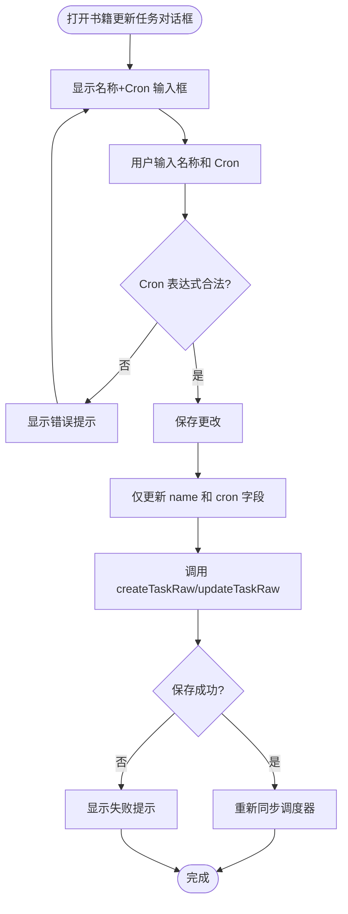

**图表来源** 
- [auto_task_screen.dart:100-202](file://flutter_legado/lib/src/screens/auto_task_screen.dart#L100-L202)

**章节来源**
- [auto_task_screen.dart:100-202](file://flutter_legado/lib/src/screens/auto_task_screen.dart#L100-L202)

### **修复** 对话框红屏崩溃问题（自包含 StatefulWidget）
- **_BookUpdateTaskDialog**：自包含 StatefulWidget，控制器在 State 内创建和释放
- **_CheckSourceConfigDialog**：同样采用自包含模式，避免框架断言红屏
- **解决方案**：controller 在 State 内创建、dispose 中随子树卸载统一释放
- **返回值优化**：确认回传值而非 controller，消除退场动画期间 dispose 引发的框架断言
- **防重复提交**：异步校验时使用 _validating 标志防止重复提交

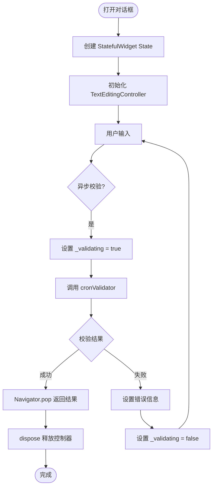

**图表来源** 
- [auto_task_screen.dart:806-928](file://flutter_legado/lib/src/screens/auto_task_screen.dart#L806-L928)
- [other_settings_screen.dart:1326-1494](file://flutter_legado/lib/src/screens/other_settings_screen.dart#L1326-L1494)

**章节来源**
- [auto_task_screen.dart:806-928](file://flutter_legado/lib/src/screens/auto_task_screen.dart#L806-L928)
- [other_settings_screen.dart:1326-1494](file://flutter_legado/lib/src/screens/other_settings_screen.dart#L1326-L1494)

### 数据访问与批量更新（Rust DB）
- AutoTaskRepository：find_all/find_by_id/insert/update/delete
- 批量更新：
  - update_cron_batch：分批（每批 900）更新 cron，避免 SQLite 参数上限
  - update_enabled：批量启用/禁用
  - clear_run_log：清空运行日志字段（保留 lastRunAt）

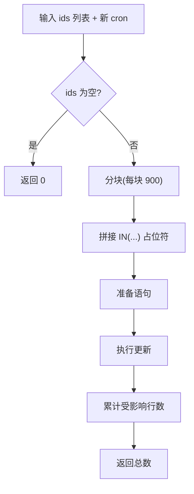

**图表来源** 
- [auto_task_repository.rs:1-120](file://rust/legado-db/src/repository/auto_task_repository.rs#L1-L120)

**章节来源**
- [auto_task_repository.rs:1-120](file://rust/legado-db/src/repository/auto_task_repository.rs#L1-L120)

### **新增** FFI/REST 双通道架构（AutoTaskNotifier）
- **FFI 优先路径**：尝试通过 BookApi 直接调用 Rust 核心逻辑
- **REST 降级路径**：FFI 失败时回退到 HTTP 请求
- **统一接口**：对外暴露相同的方法签名，调用方无需关心底层实现
- **错误处理**：两种路径都有完善的异常捕获和错误提示

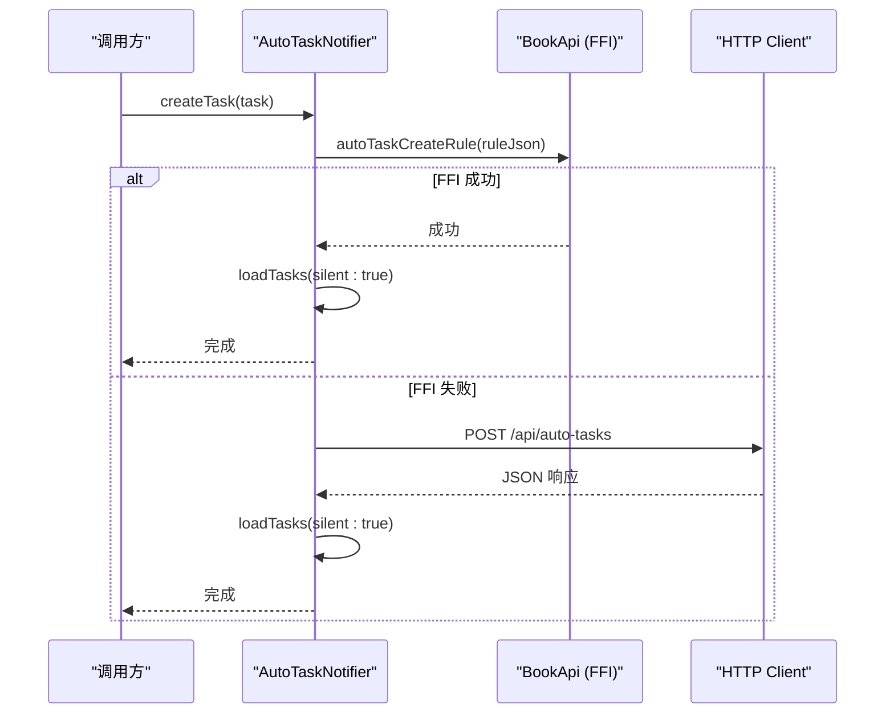

**图表来源** 
- [auto_task_notifier.dart:127-159](file://flutter_legado/lib/src/providers/auto_task/auto_task_notifier.dart#L127-L159)

**章节来源**
- [auto_task_notifier.dart:127-159](file://flutter_legado/lib/src/providers/auto_task/auto_task_notifier.dart#L127-L159)

### FFI 接口（Rust FFI）
- 暴露核心能力：构建书籍更新任务、批量更新 cron、导入合并、执行协议、脚本规范化、canRefreshBookToc、查找书籍更新任务、next_due_at
- 数据库 CRUD：list_rules_db/create_rule_db/update_rule_db/delete_rule_db/find_rule_by_id_db

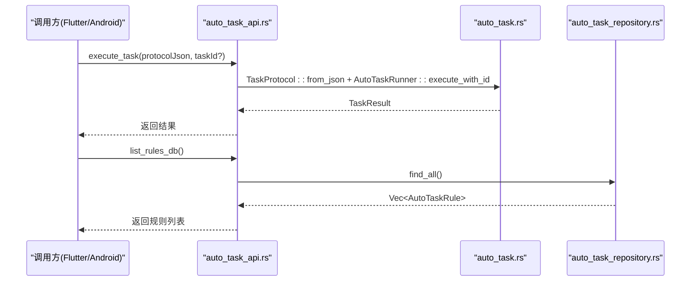

**图表来源** 
- [auto_task_api.rs:1-120](file://rust/legado-ffi/src/api/auto_task_api.rs#L1-L120)
- [auto_task.rs:1-200](file://rust/legado-core/src/auto_task.rs#L1-L200)
- [auto_task_repository.rs:1-120](file://rust/legado-db/src/repository/auto_task_repository.rs#L1-L120)

**章节来源**
- [auto_task_api.rs:1-120](file://rust/legado-ffi/src/api/auto_task_api.rs#L1-L120)

### 服务端 REST API（Rust Server）
- 端点：
  - GET /api/auto-tasks：列表
  - POST /api/auto-tasks：创建
  - PUT /api/auto-tasks/:id：更新
  - DELETE /api/auto-tasks/:id：删除
  - POST /api/auto-tasks/:id/run：立即执行
  - POST /api/auto-tasks/import：导入
  - GET /api/auto-tasks/export：导出
- 实现：内存存储（Mutex<Vec<AutoTaskRule>>），适合开发/调试

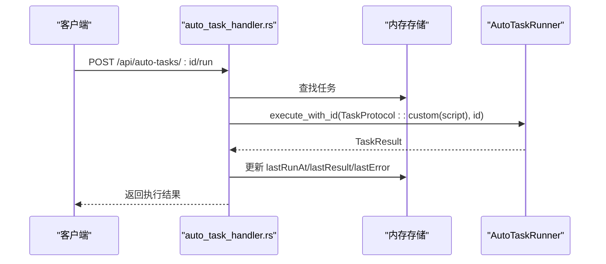

**图表来源** 
- [auto_task_handler.rs:1-200](file://rust/legado-server/src/handlers/auto_task_handler.rs#L1-L200)
- [auto_task.rs:1-200](file://rust/legado-core/src/auto_task.rs#L1-L200)

**章节来源**
- [auto_task_handler.rs:1-200](file://rust/legado-server/src/handlers/auto_task_handler.rs#L1-L200)

### Flutter 状态与 UI（Flutter）
- AutoTaskNotifier：
  - FFI 优先：autoTaskListRules/autoTaskCreateRule/autoTaskUpdateRule/autoTaskDeleteRule/autoTaskExecuteWithId 等
  - REST 降级：HTTP 调用 /api/auto-tasks 系列端点
  - 乐观更新：toggleTask 先本地切换再同步
- AutoTaskScreen：
  - 列表展示、添加/编辑对话框、长按菜单（立即运行/编辑/删除）
  - 导入本地/线上文件，经 FFI 合并后确认入库
  - 导出为 JSON，支持保存或分享
  - **新增** 书籍更新任务专用对话框
  - **修复** 对话框红屏崩溃问题

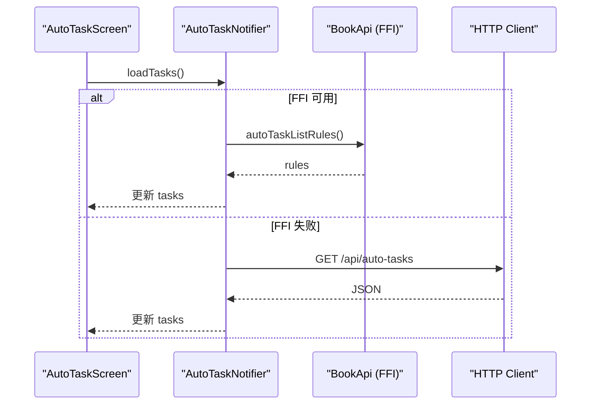

**图表来源** 
- [auto_task_notifier.dart:1-200](file://flutter_legado/lib/src/providers/auto_task/auto_task_notifier.dart#L1-L200)
- [auto_task_screen.dart:1-200](file://flutter_legado/lib/src/screens/auto_task_screen.dart#L1-L200)

**章节来源**
- [auto_task_notifier.dart:1-200](file://flutter_legado/lib/src/providers/auto_task/auto_task_notifier.dart#L1-L200)
- [auto_task_screen.dart:1-200](file://flutter_legado/lib/src/screens/auto_task_screen.dart#L1-L200)

### Android 原生（Kotlin）
- AutoTask.kt：
  - buildBookUpdateTask/findBookUpdateTask：生成与匹配书籍更新任务
  - exportJson/importRules/all/enabled/upsert/delete/move：规则管理与迁移
- AutoTaskScheduler.kt：
  - refresh：根据 enabled 规则计算下次触发，注册 JobScheduler 任务
  - cancelAll/markRunning/markStopped：生命周期管理
- AutoTaskRule.kt：
  - Room 实体映射 auto_task_rules 表

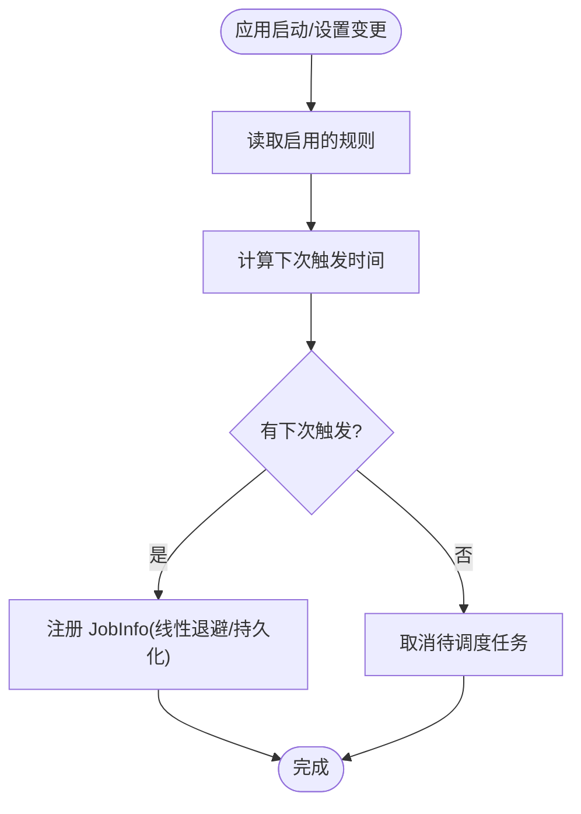

**图表来源** 
- [AutoTaskScheduler.kt:1-98](file://app/src/main/java/io/legado/app/service/AutoTaskScheduler.kt#L1-L98)
- [AutoTask.kt:1-120](file://app/src/main/java/io/legado/app/model/AutoTask.kt#L1-L120)
- [AutoTaskRule.kt:1-52](file://app/src/main/java/io/legado/app/data/entities/AutoTaskRule.kt#L1-L52)

**章节来源**
- [AutoTask.kt:1-120](file://app/src/main/java/io/legado/app/model/AutoTask.kt#L1-L120)
- [AutoTaskScheduler.kt:1-98](file://app/src/main/java/io/legado/app/service/AutoTaskScheduler.kt#L1-L98)
- [AutoTaskRule.kt:1-52](file://app/src/main/java/io/legado/app/data/entities/AutoTaskRule.kt#L1-L52)

## 依赖关系分析
- Flutter 依赖 FFI 与 REST 两种后端；FFI 失败自动降级
- **新增** Flutter 调度器依赖 BookApi 进行 Cron 解析和任务执行
- **新增** 原始 JSON 操作避免模型序列化导致的脚本丢失
- **新增** 自包含对话框组件避免跨上下文 setState 调用
- FFI 依赖 Rust Core（协议/执行/调度）与 Rust DB（持久化）
- Rust Server 独立于 DB，用于快速验证
- Android 原生与 Rust 无直接耦合，但概念一致（任务模型/调度）

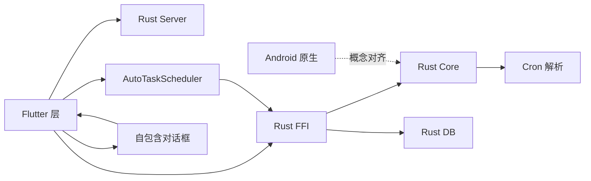

**图表来源** 
- [auto_task_scheduler.dart:14-69](file://flutter_legado/lib/src/services/auto_task_scheduler.dart#L14-L69)
- [book_api.dart:812-884](file://flutter_legado/lib/src/services/book_api.dart#L812-L884)
- [auto_task_notifier.dart:1-200](file://flutter_legado/lib/src/providers/auto_task/auto_task_notifier.dart#L1-L200)
- [auto_task_screen.dart:806-928](file://flutter_legado/lib/src/screens/auto_task_screen.dart#L806-L928)
- [other_settings_screen.dart:1326-1494](file://flutter_legado/lib/src/screens/other_settings_screen.dart#L1326-L1494)
- [auto_task_api.rs:1-120](file://rust/legado-ffi/src/api/auto_task_api.rs#L1-L120)
- [auto_task.rs:1-200](file://rust/legado-core/src/auto_task.rs#L1-L200)
- [cron.rs:1-200](file://rust/legado-core/src/cron.rs#L1-L200)
- [auto_task_repository.rs:1-120](file://rust/legado-db/src/repository/auto_task_repository.rs#L1-L120)
- [auto_task_handler.rs:1-200](file://rust/legado-server/src/handlers/auto_task_handler.rs#L1-L200)

**章节来源**
- [auto_task_scheduler.dart:14-69](file://flutter_legado/lib/src/services/auto_task_scheduler.dart#L14-L69)
- [book_api.dart:812-884](file://flutter_legado/lib/src/services/book_api.dart#L812-L884)
- [auto_task_notifier.dart:1-200](file://flutter_legado/lib/src/providers/auto_task/auto_task_notifier.dart#L1-L200)
- [auto_task_screen.dart:806-928](file://flutter_legado/lib/src/screens/auto_task_screen.dart#L806-L928)
- [other_settings_screen.dart:1326-1494](file://flutter_legado/lib/src/screens/other_settings_screen.dart#L1326-L1494)
- [auto_task_api.rs:1-120](file://rust/legado-ffi/src/api/auto_task_api.rs#L1-L120)
- [auto_task.rs:1-200](file://rust/legado-core/src/auto_task.rs#L1-L200)
- [cron.rs:1-200](file://rust/legado-core/src/cron.rs#L1-L200)
- [auto_task_repository.rs:1-120](file://rust/legado-db/src/repository/auto_task_repository.rs#L1-L120)
- [auto_task_handler.rs:1-200](file://rust/legado-server/src/handlers/auto_task_handler.rs#L1-L200)

## 性能考量
- Cron 解析复杂度：完整解析逐日扫描，最多 8 年周期；轻量策略仅计算间隔，适合高频轮询
- **新增** Flutter 调度器性能优化：
  - 执行锁机制避免重复执行
  - 代数机制处理并发 refresh 冲突
  - 指数退避重试减少失败时的资源消耗
  - 首次运行宽限期避免应用启动时立即触发
- **新增** 原始 JSON 操作减少序列化开销：避免 AutoTask 模型转换带来的性能损失
- **新增** 自包含对话框优化：避免跨上下文 setState 调用的性能开销
- 批量更新：SQLite 分批（每批 900）避免参数上限，减少 SQL 编译开销
- **新增** FFI/REST 降级：FFI 直连本地 DB，延迟更低；REST 作为兜底
- 内存存储：Server 层使用 Mutex<Vec>，并发安全但非持久化，仅用于测试/调试

## 故障排查指南
- 任务未触发
  - 检查 cron 表达式是否合法（完整解析 vs 轻量策略）
  - 确认 last_run_at 与 now 的关系，确保 is_due 为真
  - **新增** 检查 Flutter 调度器是否已 attach 并启用
  - **新增** 查看调度器日志输出，确认 Timer 是否正确设置
- 批量更新无效
  - 确认传入 ids 非空且存在
  - 检查 SQLite 参数数量限制（已分批处理）
- **新增** FFI 调用失败
  - Flutter 层会降级到 REST；检查 REST 服务是否运行
  - 查看日志中的 Parser/Database 错误信息
- **新增** 调度器相关问题
  - 检查 BookApi 是否正确注入
  - 确认 'autoTaskService' 配置项是否为 'true'
  - 查看 WidgetsBindingObserver 是否正确注册
  - 检查应用生命周期状态变化是否正确触发 refresh
- **新增** 原始 JSON 操作问题
  - 确认传入的 ruleJson 格式正确
  - 检查 jsonDecode 是否成功
  - 验证 id 字段是否存在
- **新增** 书籍更新任务对话框问题
  - 检查 cron 表达式验证逻辑
  - 确认 only name/cron 字段被修改
  - 验证调度器重新同步是否成功
- **修复** 对话框红屏崩溃问题
  - 确认对话框已重构为自包含 StatefulWidget
  - 检查 controller 是否在 State 的 dispose 中正确释放
  - 验证异步回调中是否检查了 mounted 状态
  - 确认返回值为确认结果而非 controller
- 导入合并异常
  - 确认导入 JSON 格式正确（数组或单对象）
  - 本地运行时状态会被保留（lastRunAt/lastResult/lastError/lastLog）

**章节来源**
- [auto_task_scheduler.dart:65-134](file://flutter_legado/lib/src/services/auto_task_scheduler.dart#L65-L134)
- [auto_task_scheduler.dart:210-259](file://flutter_legado/lib/src/services/auto_task_scheduler.dart#L210-L259)
- [auto_task_repository.rs:1-120](file://rust/legado-db/src/repository/auto_task_repository.rs#L1-L120)
- [auto_task_api.rs:1-120](file://rust/legado-ffi/src/api/auto_task_api.rs#L1-L120)
- [auto_task_notifier.dart:1-200](file://flutter_legado/lib/src/providers/auto_task/auto_task_notifier.dart#L1-L200)
- [auto_task_screen.dart:806-928](file://flutter_legado/lib/src/screens/auto_task_screen.dart#L806-L928)
- [other_settings_screen.dart:1326-1494](file://flutter_legado/lib/src/screens/other_settings_screen.dart#L1326-L1494)

## 结论
自动任务管理在 Legado 中实现了跨平台、可插拔、高可靠的设计：
- Rust 核心提供稳定协议与调度能力
- **新增** Flutter 应用内调度器提供完整的定时任务调度功能
- **新增** FFI/REST 双通道架构保障可用性
- **新增** 原始 JSON 操作避免复杂脚本丢失
- **新增** 书籍更新任务专用对话框提升用户体验
- **修复** 对话框红屏崩溃问题，通过自包含 StatefulWidget 模式确保稳定性
- Flutter 端状态管理与 UI 完善
- Android 原生调度与持久化完备
建议在生产环境优先使用 FFI + Rust DB 路径，REST 作为降级；对复杂 cron 场景使用完整解析模块；Flutter 应用内调度器适用于需要应用内定时任务的场景；对于书籍更新任务，推荐使用专用对话框和原始 JSON 操作以确保脚本完整性；所有对话框都应采用自包含 StatefulWidget 模式以避免红屏崩溃问题。

## 附录
- 常用 Cron 示例
  - 每 30 分钟：*/30 * * * *
  - 每天 8:00：0 8 * * *
  - 每周一 8:00：0 8 * * 1
- 任务动作
  - refreshToc：刷新目录（需 bookUrl）
  - cacheChapters：缓存新增章节（需 bookUrl）
  - updateSources：更新书源（可选 sourceUrl）
  - backup：备份（可选 path）
  - notify：通知（message）
  - custom：自定义 JS（脚本）
- **新增** Flutter 调度器配置
  - 启用开关：'autoTaskService' = 'true'
  - 首次运行宽限期：5 分钟
  - 失败重试间隔：60 秒
  - 执行锁：防止重复执行
- **新增** 原始 JSON 操作接口
  - createTaskRaw：创建任务（完整规则 JSON）
  - updateTaskRaw：更新任务（完整规则 JSON）
  - 返回值：bool 表示成功/失败
- **新增** 书籍更新任务对话框
  - 仅编辑 name 和 cron 字段
  - 自动验证 cron 表达式
  - 支持路由参数传入初始任务
- **修复** 对话框最佳实践
  - 使用自包含 StatefulWidget
  - Controller 在 State 内创建和释放
  - 异步回调中检查 mounted 状态
  - 返回确认结果而非 controller