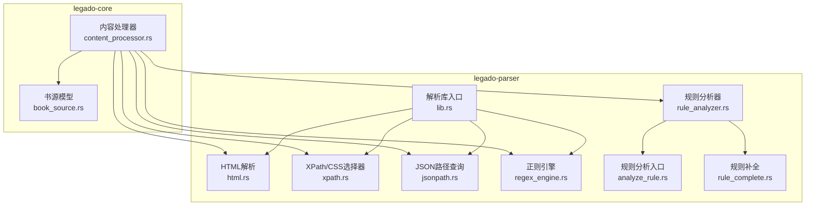
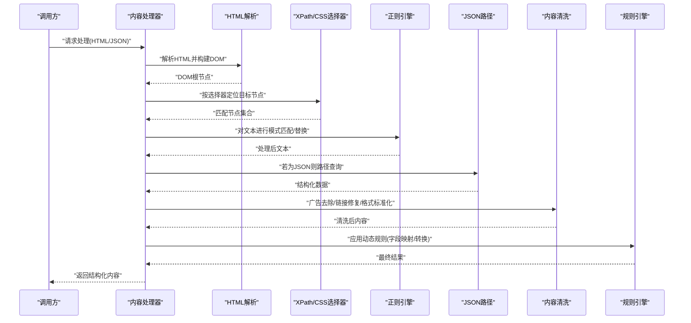
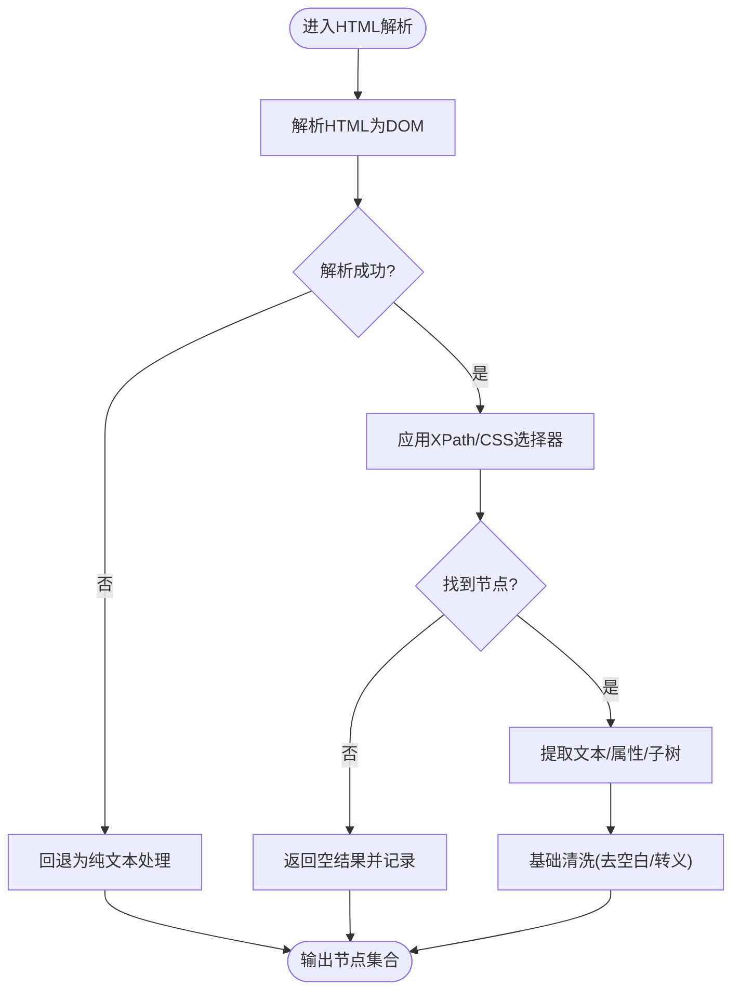
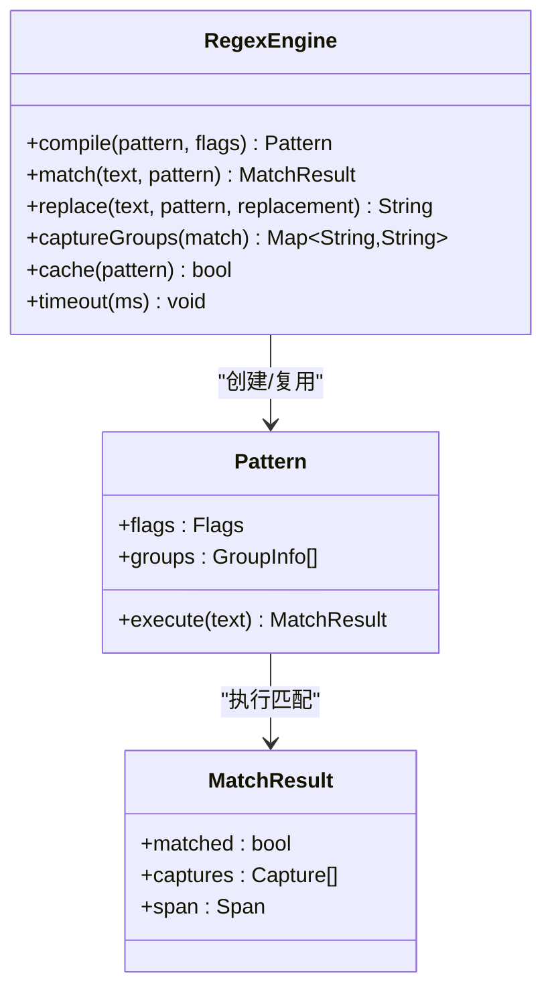
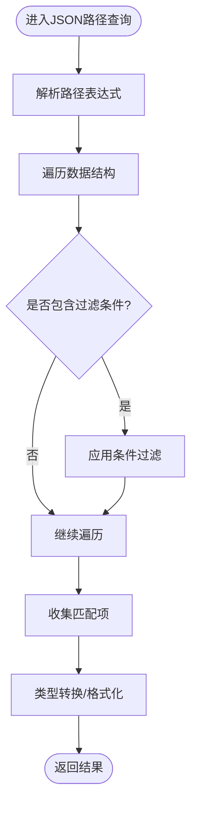
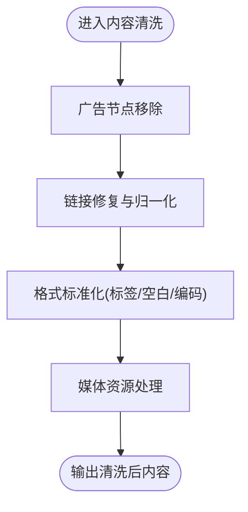
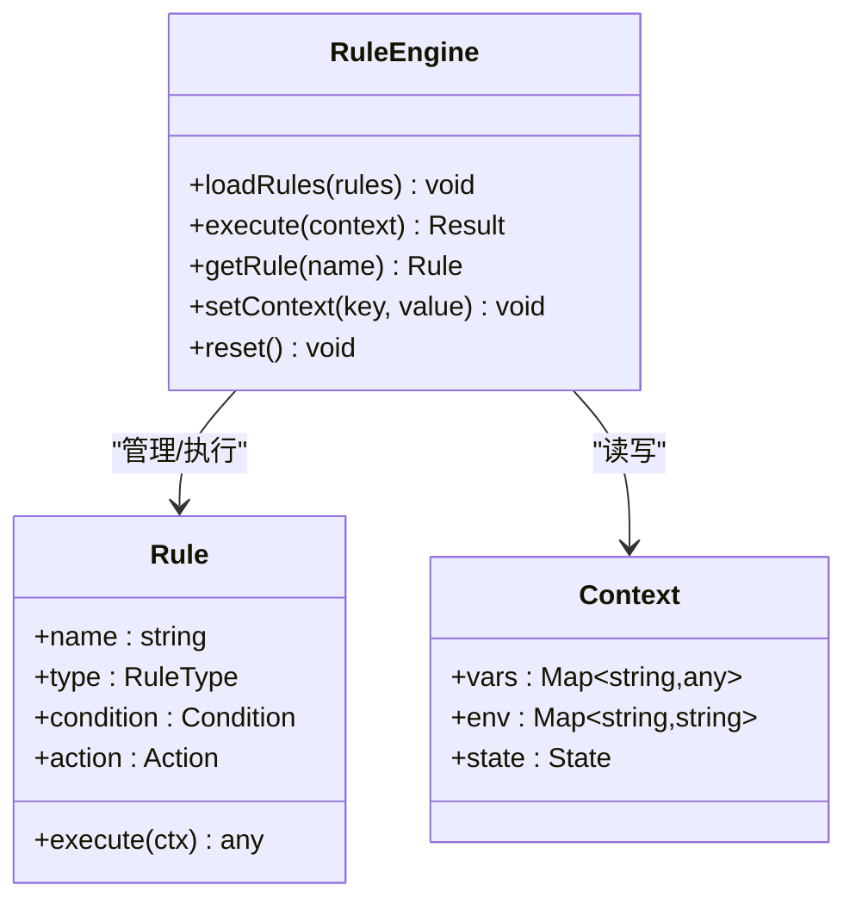
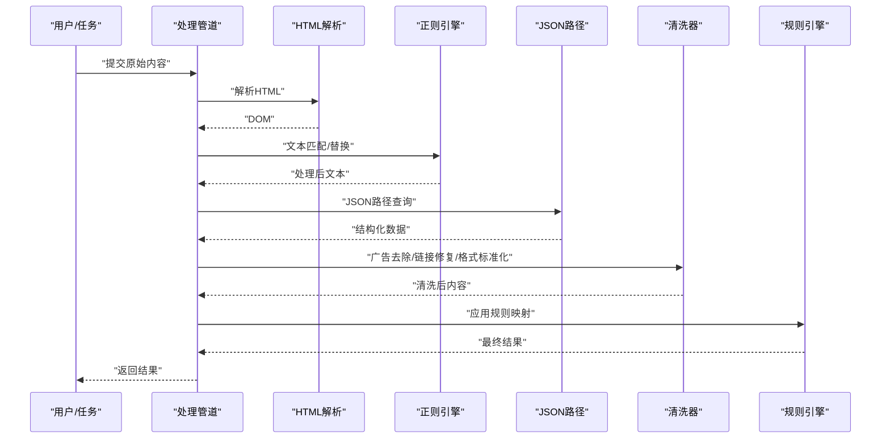
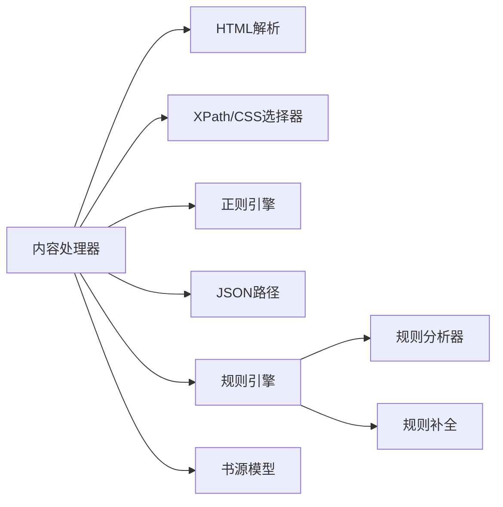

# 内容处理器

<cite>
**本文引用的文件**   
- [content_processor.rs](file://rust/legado-core/src/content_processor.rs)
- [html.rs](file://rust/legado-parser/src/html.rs)
- [jsonpath.rs](file://rust/legado-parser/src/jsonpath.rs)
- [regex_engine.rs](file://rust/legado-parser/src/regex_engine.rs)
- [rule_analyzer.rs](file://rust/legado-parser/src/rule_analyzer.rs)
- [analyze_rule.rs](file://rust/legado-parser/src/analyze_rule.rs)
- [rule_complete.rs](file://rust/legado-parser/src/rule_complete.rs)
- [xpath.rs](file://rust/legado-parser/src/xpath.rs)
- [lib.rs](file://rust/legado-parser/src/lib.rs)
- [book_source.rs](file://rust/legado-core/src/models/book_source.rs)
</cite>

## 目录
1. [简介](#简介)
2. [项目结构](#项目结构)
3. [核心组件](#核心组件)
4. [架构总览](#架构总览)
5. [详细组件分析](#详细组件分析)
6. [依赖关系分析](#依赖关系分析)
7. [性能考量](#性能考量)
8. [故障排查指南](#故障排查指南)
9. [结论](#结论)
10. [附录](#附录)

## 简介
本文件面向Legado项目的“内容处理器”子系统，系统性阐述网页内容提取、正则表达式引擎、JSON路径查询、内容清洗与规则引擎等关键能力。文档以代码级视角展开，结合架构图、流程图与时序图，帮助读者快速理解HTML解析、DOM操作、CSS选择器支持、模式匹配与捕获组、嵌套数据处理、数组操作、条件过滤、广告去除、链接修复、格式标准化、动态规则加载、执行上下文与错误处理等实现要点，并提供管道示例与自定义规则开发指南。

## 项目结构
内容处理器主要位于Rust模块中：
- 解析与查询：legado-parser（HTML解析、XPath/CSS选择器、JSON路径、正则引擎、规则分析）
- 核心编排：legado-core（内容处理器编排、数据模型、流程控制）
- 数据模型：book_source（源配置与规则定义）

图表来源
- [content_processor.rs](file://rust/legado-core/src/content_processor.rs)
- [html.rs](file://rust/legado-parser/src/html.rs)
- [xpath.rs](file://rust/legado-parser/src/xpath.rs)
- [jsonpath.rs](file://rust/legado-parser/src/jsonpath.rs)
- [regex_engine.rs](file://rust/legado-parser/src/regex_engine.rs)
- [rule_analyzer.rs](file://rust/legado-parser/src/rule_analyzer.rs)
- [analyze_rule.rs](file://rust/legado-parser/src/analyze_rule.rs)
- [rule_complete.rs](file://rust/legado-parser/src/rule_complete.rs)
- [lib.rs](file://rust/legado-parser/src/lib.rs)
- [book_source.rs](file://rust/legado-core/src/models/book_source.rs)

章节来源
- [content_processor.rs](file://rust/legado-core/src/content_processor.rs)
- [lib.rs](file://rust/legado-parser/src/lib.rs)

## 核心组件
- HTML解析与DOM操作：提供HTML文档解析、节点遍历、属性与文本提取、子树裁剪与拼接，支持XPath与类CSS选择器定位。
- 正则表达式引擎：高性能模式匹配、捕获组、替换、预编译缓存与超时保护。
- JSON路径查询：支持嵌套对象与数组的层级访问、索引与切片、条件过滤与聚合。
- 内容清洗：广告去除、链接修复、空白与标签规范化、编码统一。
- 规则引擎：动态规则加载、执行上下文（变量与作用域）、错误隔离与回退策略。

章节来源
- [html.rs](file://rust/legado-parser/src/html.rs)
- [regex_engine.rs](file://rust/legado-parser/src/regex_engine.rs)
- [jsonpath.rs](file://rust/legado-parser/src/jsonpath.rs)
- [rule_analyzer.rs](file://rust/legado-parser/src/rule_analyzer.rs)
- [analyze_rule.rs](file://rust/legado-parser/src/analyze_rule.rs)
- [rule_complete.rs](file://rust/legado-parser/src/rule_complete.rs)

## 架构总览
内容处理器作为编排层，串联解析、查询、清洗与规则执行，形成稳定的处理管道。输入为原始HTML或JSON响应，输出为目标结构化内容（标题、正文、图片、音频等）。

图表来源
- [content_processor.rs](file://rust/legado-core/src/content_processor.rs)
- [html.rs](file://rust/legado-parser/src/html.rs)
- [xpath.rs](file://rust/legado-parser/src/xpath.rs)
- [regex_engine.rs](file://rust/legado-parser/src/regex_engine.rs)
- [jsonpath.rs](file://rust/legado-parser/src/jsonpath.rs)
- [rule_analyzer.rs](file://rust/legado-parser/src/rule_analyzer.rs)

## 详细组件分析

### HTML解析与DOM操作
- 功能要点
  - 容错解析：兼容不完整或畸形HTML，生成稳定DOM。
  - DOM遍历：支持父子、兄弟、祖先、后代遍历；按属性、类名、标签名筛选。
  - 选择器支持：XPath表达式与类CSS选择器混合使用，便于复杂定位。
  - 节点操作：文本提取、属性读取、子树裁剪、片段拼接。
- 复杂度与优化
  - 选择器编译缓存，避免重复解析。
  - 大文档分块处理，降低内存峰值。
- 错误处理
  - 解析失败降级到文本模式；定位失败返回空集合并记录日志。

图表来源
- [html.rs](file://rust/legado-parser/src/html.rs)
- [xpath.rs](file://rust/legado-parser/src/xpath.rs)

章节来源
- [html.rs](file://rust/legado-parser/src/html.rs)
- [xpath.rs](file://rust/legado-parser/src/xpath.rs)

### 正则表达式引擎
- 功能要点
  - 模式匹配：支持多行、全局、忽略大小写等标志。
  - 捕获组：命名与非命名捕获组，用于字段抽取与重组。
  - 替换：基于分组引用与回调函数的高级替换。
  - 性能优化：预编译与缓存、超时保护、回溯限制。
- 使用场景
  - 正文段落切分、时间戳提取、URL归一化、敏感信息脱敏。
- 错误处理
  - 非法模式抛出可恢复错误；超时自动降级为简单匹配。

图表来源
- [regex_engine.rs](file://rust/legado-parser/src/regex_engine.rs)

章节来源
- [regex_engine.rs](file://rust/legado-parser/src/regex_engine.rs)

### JSON路径查询
- 功能要点
  - 路径语法：点号与方括号组合，支持多级嵌套。
  - 数组操作：索引访问、切片、迭代与聚合。
  - 条件过滤：基于键值比较、存在性检查与逻辑组合。
  - 类型安全：自动类型推断与转换，缺失路径返回默认值。
- 使用场景
  - API响应解析、分页数据扁平化、字段映射与重命名。
- 错误处理
  - 路径不存在时返回空或默认值；类型不匹配给出明确错误。

图表来源
- [jsonpath.rs](file://rust/legado-parser/src/jsonpath.rs)

章节来源
- [jsonpath.rs](file://rust/legado-parser/src/jsonpath.rs)

### 内容清洗流程
- 功能要点
  - 广告去除：基于选择器黑名单与正则关键词过滤。
  - 链接修复：相对路径转绝对路径、协议补全、参数规范化。
  - 格式标准化：HTML标签清理、多余空白移除、字符编码统一。
  - 图片与媒体：懒加载占位符替换、尺寸归一化、防盗链处理。
- 性能考量
  - 批量替换与一次性扫描，减少多次遍历。
  - 规则优先级与短路机制，提升常见场景速度。
- 错误处理
  - 清洗失败不影响主流程，保留原始片段并记录告警。

图表来源
- [content_processor.rs](file://rust/legado-core/src/content_processor.rs)
- [html.rs](file://rust/legado-parser/src/html.rs)

章节来源
- [content_processor.rs](file://rust/legado-core/src/content_processor.rs)
- [html.rs](file://rust/legado-parser/src/html.rs)

### 规则引擎
- 功能要点
  - 动态规则加载：从配置或远程源加载规则，支持热更新。
  - 执行上下文：变量作用域、环境变量注入、运行时状态隔离。
  - 错误处理：单条规则失败不影响整体，支持回退与重试。
  - 规则类型：字段映射、内容转换、条件分支、循环与聚合。
- 性能优化
  - 规则编译缓存、惰性求值、并行执行可选。
- 调试与观测
  - 执行轨迹记录、命中统计、耗时分布。

图表来源
- [rule_analyzer.rs](file://rust/legado-parser/src/rule_analyzer.rs)
- [analyze_rule.rs](file://rust/legado-parser/src/analyze_rule.rs)
- [rule_complete.rs](file://rust/legado-parser/src/rule_complete.rs)

章节来源
- [rule_analyzer.rs](file://rust/legado-parser/src/rule_analyzer.rs)
- [analyze_rule.rs](file://rust/legado-parser/src/analyze_rule.rs)
- [rule_complete.rs](file://rust/legado-parser/src/rule_complete.rs)

### 内容处理管道示例
- 典型流程
  - 输入：HTTP响应体（HTML或JSON）
  - 步骤：解析→选择器定位→正则抽取→JSON路径查询→清洗→规则映射→输出
- 扩展点
  - 新增清洗阶段：插入自定义过滤器
  - 新增规则类型：扩展动作与条件
  - 性能调优：调整缓存策略与并发度

图表来源
- [content_processor.rs](file://rust/legado-core/src/content_processor.rs)
- [html.rs](file://rust/legado-parser/src/html.rs)
- [regex_engine.rs](file://rust/legado-parser/src/regex_engine.rs)
- [jsonpath.rs](file://rust/legado-parser/src/jsonpath.rs)
- [rule_analyzer.rs](file://rust/legado-parser/src/rule_analyzer.rs)

章节来源
- [content_processor.rs](file://rust/legado-core/src/content_processor.rs)

## 依赖关系分析
- 模块耦合
  - 内容处理器依赖解析库（HTML/XPath/JSON/正则）与规则分析器。
  - 书源模型提供规则定义与字段映射配置。
- 外部依赖
  - 网络响应、文件系统（规则与模板）、日志系统。
- 潜在循环
  - 通过接口抽象与分层设计避免循环依赖。

图表来源
- [content_processor.rs](file://rust/legado-core/src/content_processor.rs)
- [lib.rs](file://rust/legado-parser/src/lib.rs)
- [book_source.rs](file://rust/legado-core/src/models/book_source.rs)

章节来源
- [content_processor.rs](file://rust/legado-core/src/content_processor.rs)
- [book_source.rs](file://rust/legado-core/src/models/book_source.rs)

## 性能考量
- 解析与选择器
  - 选择器编译缓存、DOM遍历剪枝、按需加载子树。
- 正则引擎
  - 预编译与LRU缓存、超时与回溯限制、批量匹配。
- JSON路径
  - 路径解析缓存、惰性求值、短路评估。
- 清洗与规则
  - 批量替换、规则优先级排序、并行执行可选。
- 内存与I/O
  - 流式处理大文档、缓冲池复用、异步I/O。

[本节为通用指导，无需特定文件来源]

## 故障排查指南
- 常见问题
  - 选择器未命中：检查XPath/CSS语法与DOM结构变化。
  - 正则匹配异常：验证模式合法性与标志位设置。
  - JSON路径失败：确认路径存在性与数据类型。
  - 规则执行错误：查看上下文变量与作用域是否正确注入。
- 诊断手段
  - 启用详细日志与执行轨迹。
  - 使用最小复现用例与断点调试。
  - 逐步禁用清洗与规则定位问题阶段。

章节来源
- [rule_analyzer.rs](file://rust/legado-parser/src/rule_analyzer.rs)
- [analyze_rule.rs](file://rust/legado-parser/src/analyze_rule.rs)
- [rule_complete.rs](file://rust/legado-parser/src/rule_complete.rs)

## 结论
内容处理器通过模块化设计与清晰的职责划分，实现了高可用、可扩展的网页内容提取与处理能力。HTML解析、正则引擎、JSON路径与规则引擎协同工作，形成稳定高效的管道。建议在生产环境中启用缓存与监控，持续优化选择器与规则，确保性能与稳定性。

[本节为总结性内容，无需特定文件来源]

## 附录
- 自定义规则开发指南
  - 定义规则类型与动作接口
  - 在规则分析器中注册新规则
  - 编写单元测试覆盖边界情况
  - 发布前进行性能回归测试
- 最佳实践
  - 选择器尽量具体，避免过度通配
  - 正则模式保持简洁，必要时拆分
  - JSON路径优先使用确定性路径
  - 清洗规则按优先级排序，避免冲突

[本节为概念性内容，无需特定文件来源]