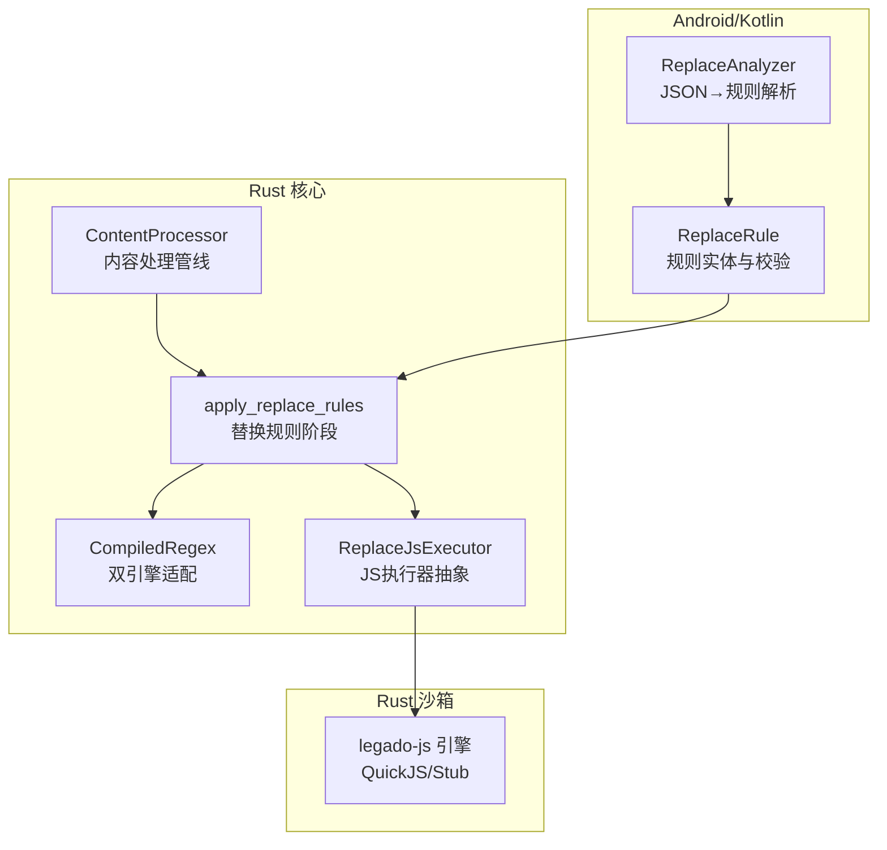
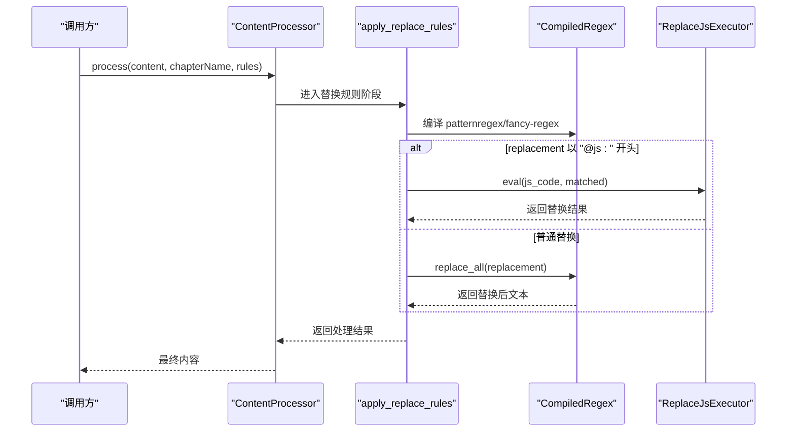
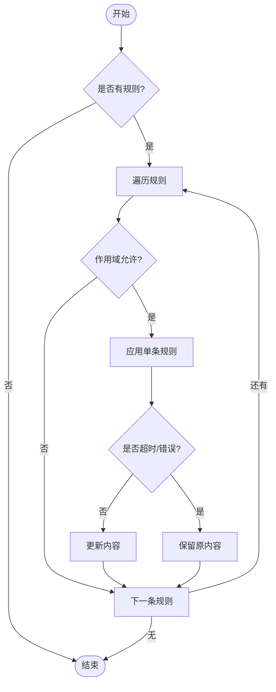
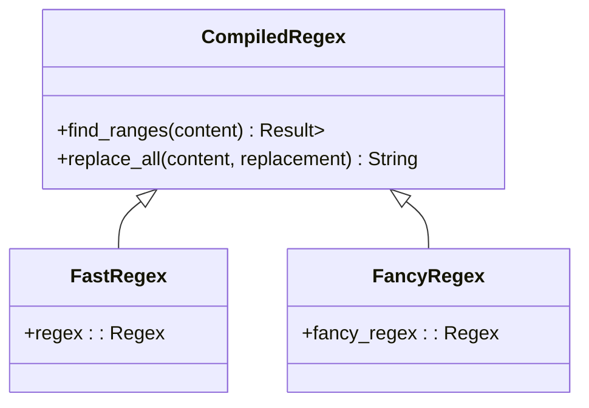
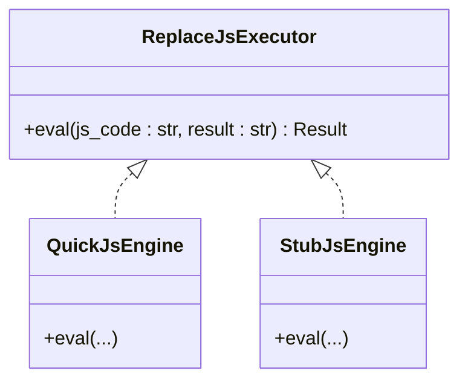
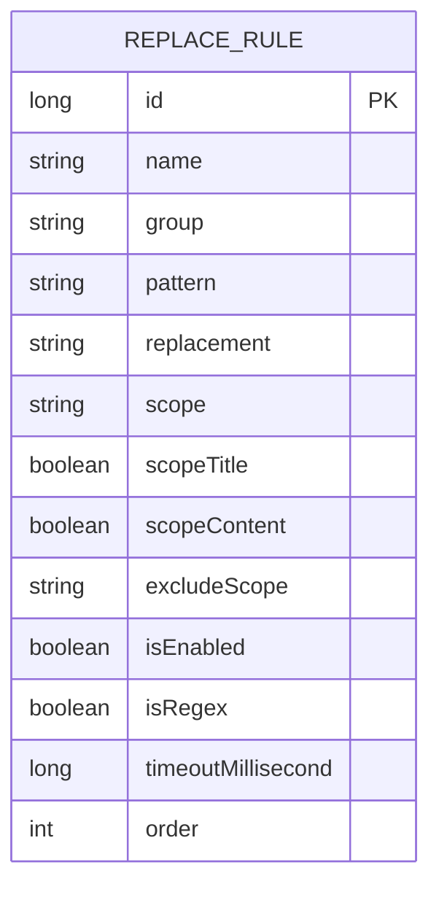
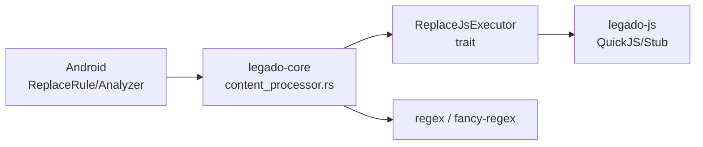

# JavaScript替换规则引擎

<cite>
**本文引用的文件**   
- [README.md](file://README.md)
- [content_processor.rs](file://rust/legado-core/src/content_processor.rs)
- [lib.rs](file://rust/legado-js/src/lib.rs)
- [ReplaceRule.kt](file://app/src/main/java/io/legado/app/data/entities/ReplaceRule.kt)
- [ReplaceAnalyzer.kt](file://app/src/main/java/io/legado/app/help/ReplaceAnalyzer.kt)
</cite>

## 目录
1. [简介](#简介)
2. [项目结构](#项目结构)
3. [核心组件](#核心组件)
4. [架构总览](#架构总览)
5. [详细组件分析](#详细组件分析)
6. [依赖关系分析](#依赖关系分析)
7. [性能考量](#性能考量)
8. [故障排查指南](#故障排查指南)
9. [结论](#结论)
10. [附录](#附录)

## 简介
本文件聚焦于 Legado 项目中的“JavaScript 替换规则引擎”，即内容处理管线中支持以 JS 表达式进行动态替换的规则执行机制。该能力在 Rust 核心层通过抽象接口与双正则引擎（高性能 regex + 兼容 fancy-regex）实现，并在 Android/Kotlin 侧提供数据模型、导入解析与校验逻辑，形成跨语言一致的替换规则体系。

## 项目结构
- Rust 核心：legado-core 的内容处理器负责编排“去重标题 → 段落重排 → 简繁转换 → 替换规则 → 缩进/空行清理”的完整管线；其中替换规则阶段支持 @js: 表达式注入执行器。
- Rust 沙箱：legado-js 提供 JS 引擎抽象与执行环境（QuickJS），上层通过 trait 注入到 core 层，避免循环依赖。
- Android/Kotlin：ReplaceRule 实体定义规则字段与校验；ReplaceAnalyzer 负责 JSON→规则对象的解析与兼容旧格式。

图表来源
- [content_processor.rs:104-184](file://rust/legado-core/src/content_processor.rs#L104-L184)
- [content_processor.rs:315-332](file://rust/legado-core/src/content_processor.rs#L315-L332)
- [content_processor.rs:504-549](file://rust/legado-core/src/content_processor.rs#L504-L549)
- [lib.rs:1-66](file://rust/legado-js/src/lib.rs#L1-L66)
- [ReplaceRule.kt:24-121](file://app/src/main/java/io/legado/app/data/entities/ReplaceRule.kt#L24-L121)
- [ReplaceAnalyzer.kt:9-46](file://app/src/main/java/io/legado/app/help/ReplaceAnalyzer.kt#L9-L46)

章节来源
- [README.md:1-26](file://README.md#L1-L26)

## 核心组件
- 内容处理器 ContentProcessor：编排多阶段处理流程，包含替换规则阶段；支持作用域上下文（书名/书源）过滤。
- 替换规则条目 ReplaceRuleEntry：承载规则元数据（pattern/replacement/scope/excludeScope/isEnabled/isRegex/timeout）。
- 双正则引擎 CompiledRegex：优先使用 regex crate（线性时间复杂度），对 Java 方言语法回退至 fancy-regex。
- JS 执行器 ReplaceJsExecutor：抽象接口，由上层注入具体实现（legado-js QuickJS 或 Stub），用于 @js: 表达式逐匹配计算。
- Android 规则模型 ReplaceRule：持久化实体，含名称、分组、模式、替换文本、作用域、超时等字段及校验逻辑。
- 规则解析器 ReplaceAnalyzer：将 JSON（新旧两种格式）转换为 ReplaceRule 对象，便于导入与迁移。

章节来源
- [content_processor.rs:104-184](file://rust/legado-core/src/content_processor.rs#L104-L184)
- [content_processor.rs:608-680](file://rust/legado-core/src/content_processor.rs#L608-L680)
- [content_processor.rs:504-549](file://rust/legado-core/src/content_processor.rs#L504-L549)
- [ReplaceRule.kt:24-121](file://app/src/main/java/io/legado/app/data/entities/ReplaceRule.kt#L24-L121)
- [ReplaceAnalyzer.kt:9-46](file://app/src/main/java/io/legado/app/help/ReplaceAnalyzer.kt#L9-L46)

## 架构总览
替换规则引擎在“内容处理管线”的第四步执行，支持按作用域过滤、逐规则超时保护、Java 正则方言适配以及 @js: 动态替换。JS 执行器通过 trait 注入，保持 core 层无外部依赖。

图表来源
- [content_processor.rs:134-184](file://rust/legado-core/src/content_processor.rs#L134-L184)
- [content_processor.rs:315-332](file://rust/legado-core/src/content_processor.rs#L315-L332)
- [content_processor.rs:449-498](file://rust/legado-core/src/content_processor.rs#L449-L498)
- [content_processor.rs:504-549](file://rust/legado-core/src/content_processor.rs#L504-L549)

## 详细组件分析

### 内容处理器与替换规则阶段
- 处理管线：去除重复标题、段落重排、简繁转换、应用替换规则、首行缩进、清理多余空行。
- 替换规则阶段：
  - 作用域过滤：根据 scopeTitle/scopeContent、scope、excludeScope 与当前 ScopeContext（书名/书源）决定是否生效。
  - 单条规则执行：非正则直接字面替换；正则走 CompiledRegex；若 replacement 以 @js: 开头则逐匹配调用 JS 执行器。
  - 超时保护：每条规则在独立线程执行，超过 timeoutMillisecond 自动跳过，保证管线稳定性。

图表来源
- [content_processor.rs:398-442](file://rust/legado-core/src/content_processor.rs#L398-L442)
- [content_processor.rs:449-498](file://rust/legado-core/src/content_processor.rs#L449-L498)

章节来源
- [content_processor.rs:104-184](file://rust/legado-core/src/content_processor.rs#L104-L184)
- [content_processor.rs:398-442](file://rust/legado-core/src/content_processor.rs#L398-L442)

### 双正则引擎与 Java 方言适配
- 编译策略：优先 regex crate（高性能），遇到 Java 方言不支持的语法（如 lookbehind/backreference/原子组）回退 fancy-regex。
- 方言适配：\uXXXX → \x{XXXX}；\R → 显式换行序列；移除 (?d)/(?c)/(?u) 内联标志；其余转义保留。
- 替换语义：$n 组引用与 Java Matcher.appendReplacement 对齐；@js: 模式下逐匹配拼接结果。

图表来源
- [content_processor.rs:504-549](file://rust/legado-core/src/content_processor.rs#L504-L549)
- [content_processor.rs:560-604](file://rust/legado-core/src/content_processor.rs#L560-L604)

章节来源
- [content_processor.rs:504-549](file://rust/legado-core/src/content_processor.rs#L504-L549)
- [content_processor.rs:560-604](file://rust/legado-core/src/content_processor.rs#L560-L604)

### JS 执行器抽象与注入
- 抽象接口 ReplaceJsExecutor：eval(js_code, result) → 返回替换字符串；core 层不依赖具体引擎，避免循环依赖。
- 注入方式：上层（FFI/legado-js）提供具体实现（QuickJS 或 Stub），在 @js: 分支被调用。
- 安全与隔离：由 legado-js 的沙箱配置与状态监控保障脚本执行安全。

图表来源
- [content_processor.rs:30-38](file://rust/legado-core/src/content_processor.rs#L30-L38)
- [lib.rs:1-66](file://rust/legado-js/src/lib.rs#L1-L66)

章节来源
- [content_processor.rs:30-38](file://rust/legado-core/src/content_processor.rs#L30-L38)
- [lib.rs:1-66](file://rust/legado-js/src/lib.rs#L1-L66)

### Android 规则模型与导入解析
- ReplaceRule：Room 实体，包含 id/name/group/pattern/replacement/scope/scopeTitle/scopeContent/excludeScope/isEnabled/isRegex/timeoutMillisecond/order 等字段；提供 isValid()/checkValid() 校验正则与边界情况。
- ReplaceAnalyzer：支持新旧两种 JSON 格式转换为 ReplaceRule；旧格式映射 regex→pattern、replaceSummary→name、useTo→scope、enable→isEnabled、serialNumber→order。

图表来源
- [ReplaceRule.kt:24-121](file://app/src/main/java/io/legado/app/data/entities/ReplaceRule.kt#L24-L121)

章节来源
- [ReplaceRule.kt:24-121](file://app/src/main/java/io/legado/app/data/entities/ReplaceRule.kt#L24-L121)
- [ReplaceAnalyzer.kt:9-46](file://app/src/main/java/io/legado/app/help/ReplaceAnalyzer.kt#L9-L46)

## 依赖关系分析
- 模块耦合：
  - legado-core 仅依赖 traits（ReplaceJsExecutor），不直接依赖 legado-js，避免循环依赖。
  - Android 层的 ReplaceRule/ReplaceAnalyzer 与 Rust 层通过 FFI/数据契约对接（字段语义一致）。
- 外部依赖：
  - regex crate（高性能）、fancy-regex（兼容性回退）。
  - serde（序列化/反序列化）。
  - tokio/reqwest 等网络栈由上层集成，替换规则阶段不涉及网络 IO。

图表来源
- [content_processor.rs:30-38](file://rust/legado-core/src/content_processor.rs#L30-L38)
- [content_processor.rs:504-549](file://rust/legado-core/src/content_processor.rs#L504-L549)
- [lib.rs:1-66](file://rust/legado-js/src/lib.rs#L1-L66)

章节来源
- [content_processor.rs:30-38](file://rust/legado-core/src/content_processor.rs#L30-L38)
- [content_processor.rs:504-549](file://rust/legado-core/src/content_processor.rs#L504-L549)
- [lib.rs:1-66](file://rust/legado-js/src/lib.rs#L1-L66)

## 性能考量
- 正则引擎选择：regex crate 提供线性时间匹配，优先使用；仅在需要 Java 方言特性时回退 fancy-regex。
- 超时保护：每条规则独立线程执行，超时即跳过，避免单条病态规则拖垮整体管线。
- 作用域过滤：在进入替换前按 scope/excludeScope 过滤，减少不必要的规则执行。
- 内存与字符串拼接：@js: 模式采用区间收集与容量预分配，降低频繁扩容开销。

[本节为通用指导，无需源码引用]

## 故障排查指南
- 正则语法错误：
  - Android 端 ReplaceRule.isValid() 会捕获 PatternSyntaxException 并记录日志；检查 pattern 是否合法，尤其是末尾的 | 未转义等情况。
- 规则超时：
  - Rust 端 apply_rule_with_timeout 会在超时后跳过该规则；建议缩短复杂 @js: 代码或优化正则表达式。
- 作用域不生效：
  - 检查 scopeTitle/scopeContent 开关与 scope/excludeScope 是否包含当前书名/书源子串。
- JS 执行失败：
  - ReplaceJsExecutor.eval 返回错误会被捕获并跳过该规则；确认 JS 代码无运行时异常。

章节来源
- [ReplaceRule.kt:88-113](file://app/src/main/java/io/legado/app/data/entities/ReplaceRule.kt#L88-L113)
- [content_processor.rs:420-442](file://rust/legado-core/src/content_processor.rs#L420-L442)
- [content_processor.rs:357-395](file://rust/legado-core/src/content_processor.rs#L357-L395)

## 结论
JavaScript 替换规则引擎在 Legado 中以“抽象 trait + 双正则引擎 + 超时保护 + 作用域过滤”的方式实现，既保证了高性能与兼容性，又提供了强大的动态替换能力。Android 侧的数据模型与解析器确保了规则的导入与校验一致性。整体设计清晰、可扩展，适合在跨平台阅读器场景下持续演进。

[本节为总结性内容，无需源码引用]

## 附录
- 快速上手：
  - 在 Rust 层通过 ContentProcessor.process 传入规则数组即可启用替换阶段。
  - 在 Android 层通过 ReplaceAnalyzer.jsonToReplaceRule/jsonToReplaceRules 导入规则。
- 扩展点：
  - 实现 ReplaceJsExecutor 以接入自定义 JS 引擎或调试工具。
  - 扩展 ProcessorConfig 以调整管线步骤行为。

[本节为概念性说明，无需源码引用]