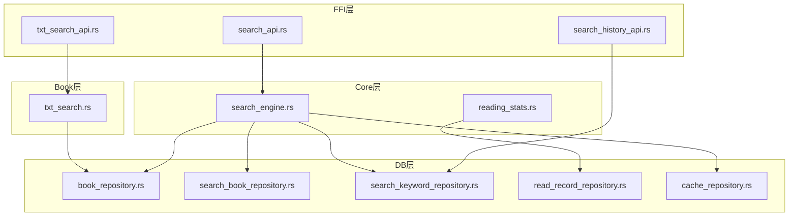
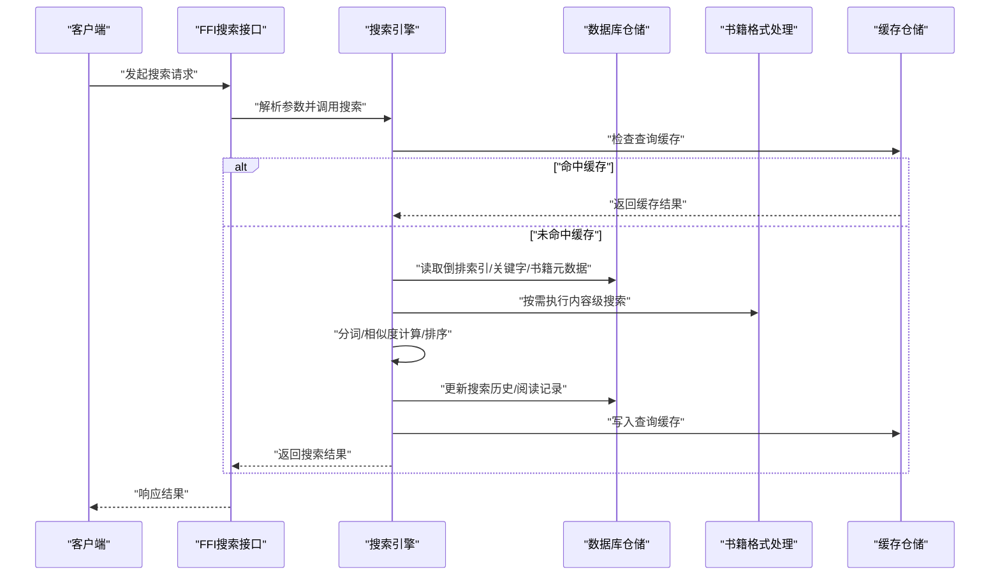
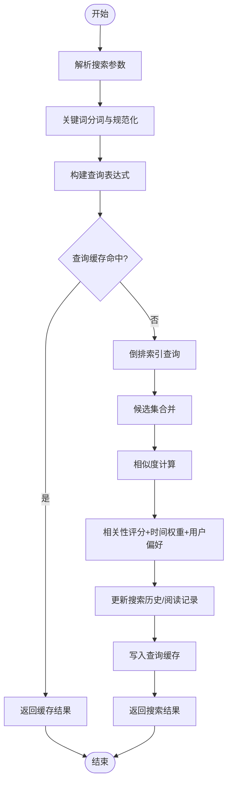
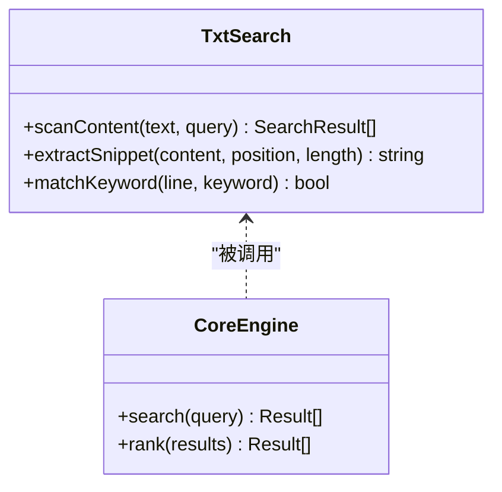
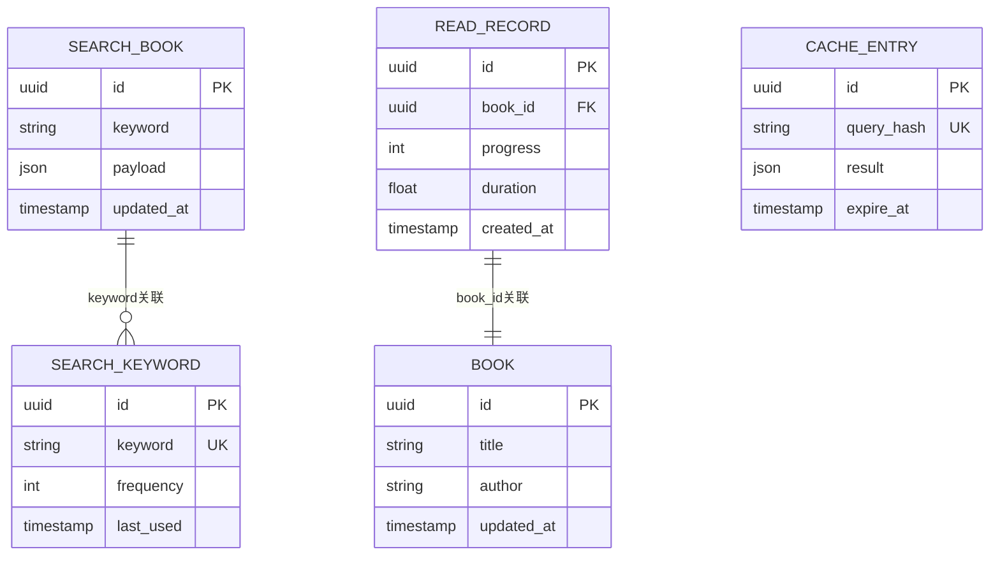
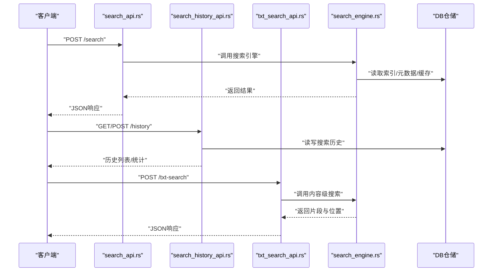

# 搜索引擎

<cite>
**本文引用的文件**   
- [search_engine.rs](file://rust/legado-core/src/search_engine.rs)
- [txt_search.rs](file://rust/legado-book/src/txt_search.rs)
- [reading_stats.rs](file://rust/legado-core/src/reading_stats.rs)
- [read_record_repository.rs](file://rust/legado-db/src/repository/read_record_repository.rs)
- [search_book_repository.rs](file://rust/legado-db/src/repository/search_book_repository.rs)
- [search_keyword_repository.rs](file://rust/legado-db/src/repository/search_keyword_repository.rs)
- [search_api.rs](file://rust/legado-ffi/src/api/search.rs)
- [search_history_api.rs](file://rust/legado-ffi/src/api/search_history_api.rs)
- [txt_search_api.rs](file://rust/legado-ffi/src/api/txt_search_api.rs)
- [book_repository.rs](file://rust/legado-db/src/repository/book_repository.rs)
- [cache_repository.rs](file://rust/legado-db/src/repository/cache_repository.rs)
- [lib.rs (core)](file://rust/legado-core/src/lib.rs)
- [lib.rs (book)](file://rust/legado-book/src/lib.rs)
- [lib.rs (db)](file://rust/legado-db/src/lib.rs)
- [lib.rs (ffi)](file://rust/legado-ffi/src/lib.rs)
</cite>

## 目录
1. [简介](#简介)
2. [项目结构](#项目结构)
3. [核心组件](#核心组件)
4. [架构总览](#架构总览)
5. [详细组件分析](#详细组件分析)
6. [依赖关系分析](#依赖关系分析)
7. [性能考虑](#性能考虑)
8. [故障排查指南](#故障排查指南)
9. [结论](#结论)
10. [附录](#附录)

## 简介
本文件面向Legado项目的搜索引擎子系统，系统性解析全文搜索算法与实现，包括倒排索引构建、关键词分词、相似度计算；详细说明搜索结果排序机制（相关性评分、时间权重、用户偏好整合）；阐述增量更新策略（变更检测、索引维护、性能优化）；介绍搜索缓存机制（查询缓存、结果缓存、预加载策略）；并覆盖统计功能（阅读记录、搜索历史、用户行为分析）。最后提供搜索API使用示例与性能调优建议，帮助开发者快速集成与优化。

## 项目结构
搜索引擎相关代码主要分布在Rust多模块中：
- legado-core：核心搜索引擎、阅读统计等
- legado-book：书籍格式处理与TXT全文搜索
- legado-db：数据库仓储层（搜索、关键字、阅读记录等）
- legado-ffi：对外暴露的API桥接（搜索、搜索历史、TXT搜索等）

图表来源
- [search_api.rs](file://rust/legado-ffi/src/api/search.rs)
- [search_history_api.rs](file://rust/legado-ffi/src/api/search_history_api.rs)
- [txt_search_api.rs](file://rust/legado-ffi/src/api/txt_search_api.rs)
- [search_engine.rs](file://rust/legado-core/src/search_engine.rs)
- [reading_stats.rs](file://rust/legado-core/src/reading_stats.rs)
- [txt_search.rs](file://rust/legado-book/src/txt_search.rs)
- [book_repository.rs](file://rust/legado-db/src/repository/book_repository.rs)
- [search_book_repository.rs](file://rust/legado-db/src/repository/search_book_repository.rs)
- [search_keyword_repository.rs](file://rust/legado-db/src/repository/search_keyword_repository.rs)
- [read_record_repository.rs](file://rust/legado-db/src/repository/read_record_repository.rs)
- [cache_repository.rs](file://rust/legado-db/src/repository/cache_repository.rs)

章节来源
- [lib.rs (core)](file://rust/legado-core/src/lib.rs)
- [lib.rs (book)](file://rust/legado-book/src/lib.rs)
- [lib.rs (db)](file://rust/legado-db/src/lib.rs)
- [lib.rs (ffi)](file://rust/legado-ffi/src/lib.rs)

## 核心组件
- 搜索引擎（Core层）
  - 负责全文检索流程编排、倒排索引访问、关键词分词、相似度计算与排序聚合。
- 书籍格式处理（Book层）
  - 针对特定格式（如TXT）提供内容提取与全文搜索能力。
- 数据仓储（DB层）
  - 管理书籍元数据、搜索索引、关键字历史、阅读记录、缓存等持久化操作。
- API桥接（FFI层）
  - 将Core/Book/DB能力暴露给上层调用方（Android/Flutter/Web），封装请求参数与返回结果。

章节来源
- [search_engine.rs](file://rust/legado-core/src/search_engine.rs)
- [txt_search.rs](file://rust/legado-book/src/txt_search.rs)
- [search_book_repository.rs](file://rust/legado-db/src/repository/search_book_repository.rs)
- [search_keyword_repository.rs](file://rust/legado-db/src/repository/search_keyword_repository.rs)
- [read_record_repository.rs](file://rust/legado-db/src/repository/read_record_repository.rs)
- [book_repository.rs](file://rust/legado-db/src/repository/book_repository.rs)
- [cache_repository.rs](file://rust/legado-db/src/repository/cache_repository.rs)
- [search_api.rs](file://rust/legado-ffi/src/api/search.rs)
- [search_history_api.rs](file://rust/legado-ffi/src/api/search_history_api.rs)
- [txt_search_api.rs](file://rust/legado-ffi/src/api/txt_search_api.rs)

## 架构总览
搜索请求从FFI层进入，经Core层调度，调用DB层仓储获取或更新索引与元数据，必要时结合Book层进行内容级搜索。统计与历史记录通过DB仓储落库，缓存层用于加速重复查询。

图表来源
- [search_api.rs](file://rust/legado-ffi/src/api/search.rs)
- [search_engine.rs](file://rust/legado-core/src/search_engine.rs)
- [txt_search.rs](file://rust/legado-book/src/txt_search.rs)
- [search_book_repository.rs](file://rust/legado-db/src/repository/search_book_repository.rs)
- [search_keyword_repository.rs](file://rust/legado-db/src/repository/search_keyword_repository.rs)
- [read_record_repository.rs](file://rust/legado-db/src/repository/read_record_repository.rs)
- [cache_repository.rs](file://rust/legado-db/src/repository/cache_repository.rs)

## 详细组件分析

### 搜索引擎（Core层）
- 职责
  - 接收搜索请求，进行关键词分词与规范化。
  - 基于倒排索引定位候选文档集合。
  - 计算相似度得分，融合时间权重与用户偏好，生成最终排序。
  - 协调缓存与仓储层，完成读写与统计更新。
- 关键流程
  - 分词与查询构建
  - 倒排索引查询与候选集合并
  - 相似度计算与排序
  - 结果缓存与统计写入

图表来源
- [search_engine.rs](file://rust/legado-core/src/search_engine.rs)
- [cache_repository.rs](file://rust/legado-db/src/repository/cache_repository.rs)
- [search_keyword_repository.rs](file://rust/legado-db/src/repository/search_keyword_repository.rs)
- [read_record_repository.rs](file://rust/legado-db/src/repository/read_record_repository.rs)

章节来源
- [search_engine.rs](file://rust/legado-core/src/search_engine.rs)

### TXT全文搜索（Book层）
- 职责
  - 对TXT类书籍内容进行逐行/段落扫描，支持关键词匹配与上下文片段提取。
  - 与Core层协作，将内容级搜索结果纳入整体排序。
- 关键点
  - 文本编码与分块策略
  - 正则/子串匹配优化
  - 结果分页与高亮片段生成

图表来源
- [txt_search.rs](file://rust/legado-book/src/txt_search.rs)
- [search_engine.rs](file://rust/legado-core/src/search_engine.rs)

章节来源
- [txt_search.rs](file://rust/legado-book/src/txt_search.rs)

### 数据仓储（DB层）
- 搜索书籍仓储（search_book_repository.rs）
  - 提供倒排索引的增删改查、批量更新、按关键词检索。
- 关键字仓储（search_keyword_repository.rs）
  - 维护搜索历史、热门词、去重与频率统计。
- 阅读记录仓储（read_record_repository.rs）
  - 记录用户阅读进度、停留时长、翻页次数等，用于个性化排序。
- 书籍仓储（book_repository.rs）
  - 提供书籍元数据、分类、标签、更新时间等基础信息。
- 缓存仓储（cache_repository.rs）
  - 存储查询缓存、结果缓存、预加载队列状态。

图表来源
- [search_book_repository.rs](file://rust/legado-db/src/repository/search_book_repository.rs)
- [search_keyword_repository.rs](file://rust/legado-db/src/repository/search_keyword_repository.rs)
- [read_record_repository.rs](file://rust/legado-db/src/repository/read_record_repository.rs)
- [book_repository.rs](file://rust/legado-db/src/repository/book_repository.rs)
- [cache_repository.rs](file://rust/legado-db/src/repository/cache_repository.rs)

章节来源
- [search_book_repository.rs](file://rust/legado-db/src/repository/search_book_repository.rs)
- [search_keyword_repository.rs](file://rust/legado-db/src/repository/search_keyword_repository.rs)
- [read_record_repository.rs](file://rust/legado-db/src/repository/read_record_repository.rs)
- [book_repository.rs](file://rust/legado-db/src/repository/book_repository.rs)
- [cache_repository.rs](file://rust/legado-db/src/repository/cache_repository.rs)

### API桥接（FFI层）
- 搜索API（search_api.rs）
  - 接收客户端搜索请求，校验参数，调用Core层搜索引擎，返回标准化结果。
- 搜索历史API（search_history_api.rs）
  - 提供搜索历史的增删改查、热门词统计、去重策略。
- TXT搜索API（txt_search_api.rs）
  - 暴露TXT内容级搜索能力，支持分页与片段提取。

图表来源
- [search_api.rs](file://rust/legado-ffi/src/api/search.rs)
- [search_history_api.rs](file://rust/legado-ffi/src/api/search_history_api.rs)
- [txt_search_api.rs](file://rust/legado-ffi/src/api/txt_search_api.rs)
- [search_engine.rs](file://rust/legado-core/src/search_engine.rs)

章节来源
- [search_api.rs](file://rust/legado-ffi/src/api/search.rs)
- [search_history_api.rs](file://rust/legado-ffi/src/api/search_history_api.rs)
- [txt_search_api.rs](file://rust/legado-ffi/src/api/txt_search_api.rs)

## 依赖关系分析
- 模块耦合
  - FFI层依赖Core与DB，Core依赖DB与Book，Book依赖DB。
- 外部依赖
  - 数据库（SQLite/RocksDB等，具体由仓储实现决定）
  - 网络（可选，用于远程源搜索，非本文重点）
- 循环依赖
  - 通过分层与接口隔离避免循环依赖。

图表来源
- [lib.rs (ffi)](file://rust/legado-ffi/src/lib.rs)
- [lib.rs (core)](file://rust/legado-core/src/lib.rs)
- [lib.rs (db)](file://rust/legado-db/src/lib.rs)
- [lib.rs (book)](file://rust/legado-book/src/lib.rs)

章节来源
- [lib.rs (ffi)](file://rust/legado-ffi/src/lib.rs)
- [lib.rs (core)](file://rust/legado-core/src/lib.rs)
- [lib.rs (db)](file://rust/legado-db/src/lib.rs)
- [lib.rs (book)](file://rust/legado-book/src/lib.rs)

## 性能考虑
- 倒排索引优化
  - 使用高效的数据结构（如哈希表+有序列表）存储词项到文档ID映射。
  - 对高频词进行压缩与分区，减少内存占用。
- 分词与查询构建
  - 采用轻量级分词器，支持中文分词与停用词过滤。
  - 查询表达式预处理，避免重复计算。
- 相似度与排序
  - 使用TF-IDF或BM25变体，结合时间衰减与用户偏好加权。
  - 限制候选集大小，提前剪枝低分结果。
- 缓存策略
  - 查询缓存：基于查询哈希键值对缓存结果，设置TTL过期。
  - 结果缓存：对热点结果进行持久化缓存，提升二次查询速度。
  - 预加载策略：根据用户行为预测可能查询，提前构建索引片段。
- I/O与并发
  - 读写分离与连接池，避免阻塞主线程。
  - 异步协程处理大量并发查询。

[本节为通用指导，不直接分析具体文件]

## 故障排查指南
- 常见问题
  - 索引不一致：检查增量更新任务是否成功执行，验证索引完整性。
  - 分词异常：确认分词器配置与语言包是否正确加载。
  - 缓存失效：检查缓存TTL与过期策略，确保键冲突避免。
  - 性能退化：监控CPU与内存使用，识别热点查询与慢查询。
- 调试手段
  - 启用详细日志，记录分词结果、查询表达式与索引命中率。
  - 使用性能剖析工具定位瓶颈（如采样分析、火焰图）。
  - 单元测试覆盖分词、相似度计算与排序逻辑。

章节来源
- [search_engine.rs](file://rust/legado-core/src/search_engine.rs)
- [txt_search.rs](file://rust/legado-book/src/txt_search.rs)
- [cache_repository.rs](file://rust/legado-db/src/repository/cache_repository.rs)

## 结论
Legado搜索引擎通过分层架构实现了高效的全文检索能力。Core层负责算法与流程编排，Book层提供内容级搜索，DB层保障数据一致性与持久化，FFI层统一对外接口。通过倒排索引、相似度计算、缓存与统计，系统在准确性、性能与用户体验之间取得平衡。建议持续优化分词质量、索引结构与缓存策略，并结合用户行为数据进行个性化排序。

[本节为总结性内容，不直接分析具体文件]

## 附录

### 搜索API使用示例
- 搜索接口
  - 方法：POST
  - 路径：/api/search
  - 请求体：包含关键词、分页参数、排序选项
  - 响应体：搜索结果列表、总数、耗时
- 搜索历史接口
  - 方法：GET/POST
  - 路径：/api/search/history
  - 请求体：操作类型（查询/新增/删除）、关键词
  - 响应体：历史列表、热门词统计
- TXT搜索接口
  - 方法：POST
  - 路径：/api/txt-search
  - 请求体：书籍ID、关键词、分页参数
  - 响应体：匹配片段、位置、上下文

章节来源
- [search_api.rs](file://rust/legado-ffi/src/api/search.rs)
- [search_history_api.rs](file://rust/legado-ffi/src/api/search_history_api.rs)
- [txt_search_api.rs](file://rust/legado-ffi/src/api/txt_search_api.rs)

### 性能调优指南
- 索引构建
  - 批量导入时采用事务与并行写入，减少锁竞争。
  - 定期重建索引以优化碎片与压缩率。
- 查询优化
  - 使用查询计划分析与索引提示，避免全表扫描。
  - 限制返回字段与结果数量，减少网络传输。
- 缓存配置
  - 动态调整TTL与容量上限，适应不同负载场景。
  - 预热热点查询，降低冷启动延迟。
- 资源监控
  - 建立指标采集与告警机制，及时发现性能瓶颈。
  - 定期进行压力测试与容量规划。

[本节为通用指导，不直接分析具体文件]