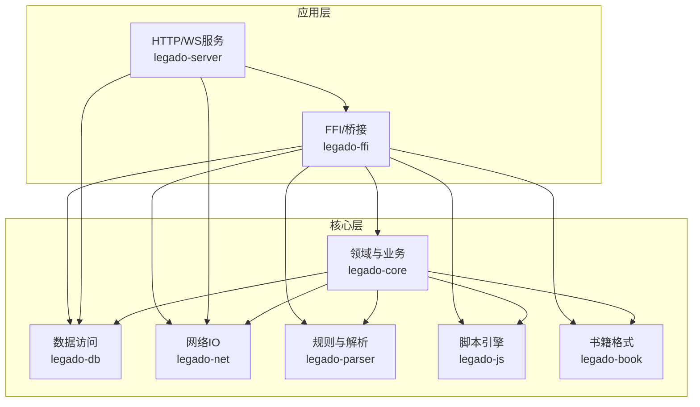
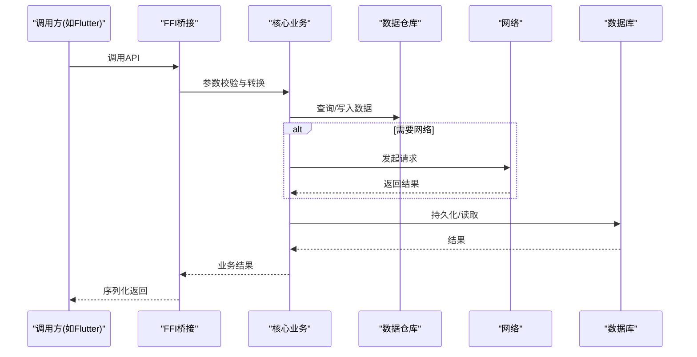
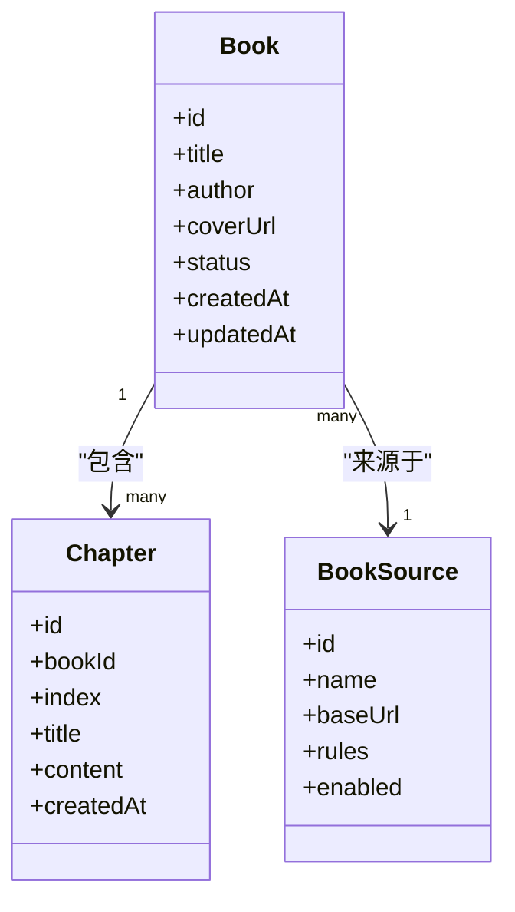
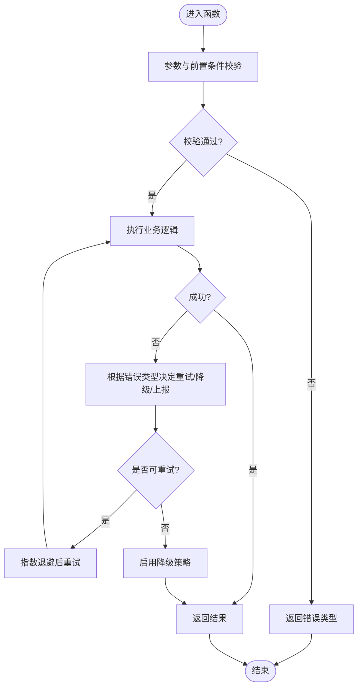
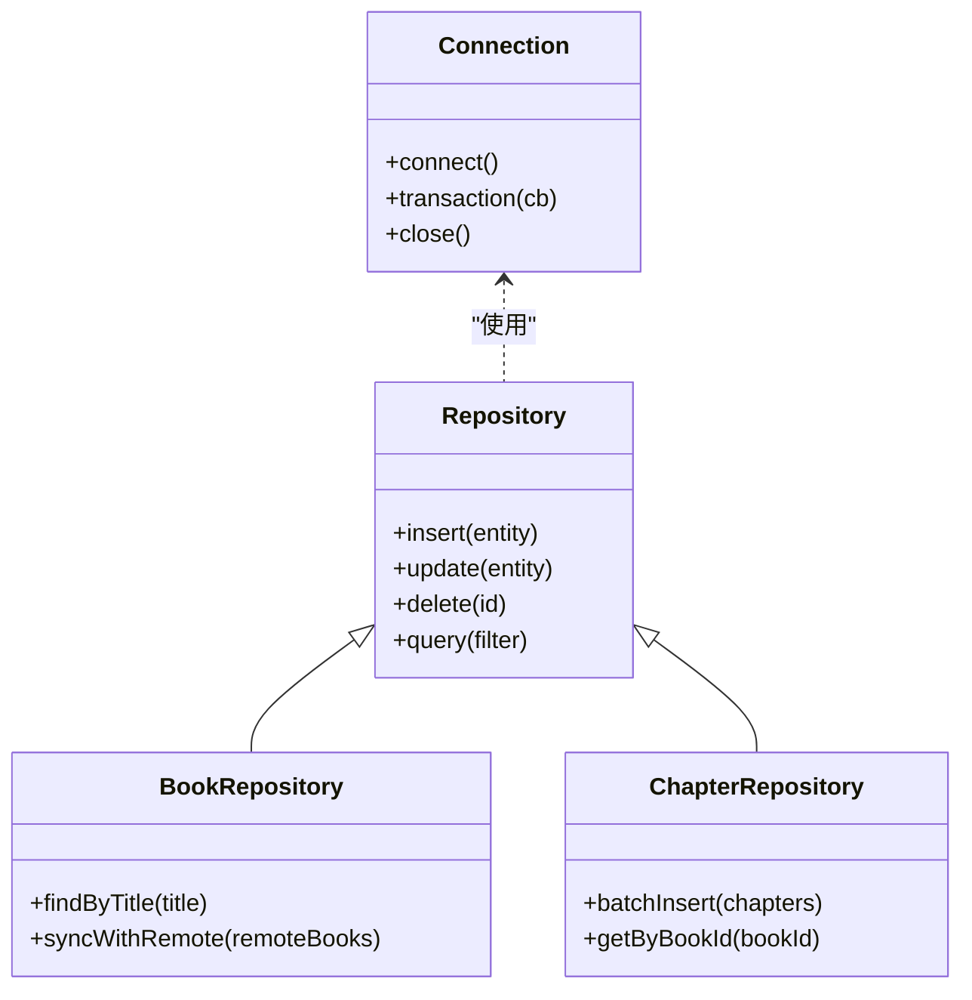
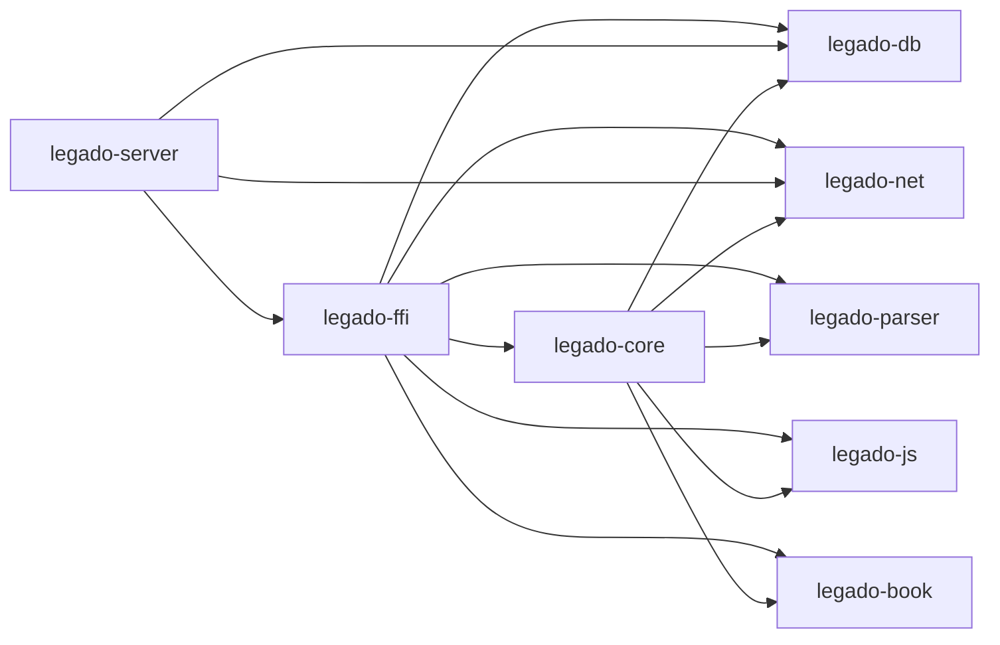

# 核心模块架构

<cite>
**本文引用的文件**   
- [rust/Cargo.toml](file://rust/Cargo.toml)
- [rust/legado-core/src/lib.rs](file://rust/legado-core/src/lib.rs)
- [rust/legado-core/src/models/mod.rs](file://rust/legado-core/src/models/mod.rs)
- [rust/legado-core/src/models/book.rs](file://rust/legado-core/src/models/book.rs)
- [rust/legado-core/src/models/book_chapter.rs](file://rust/legado-core/src/models/book_chapter.rs)
- [rust/legado-core/src/models/book_source.rs](file://rust/legado-core/src/models/book_source.rs)
- [rust/legado-core/src/error.rs](file://rust/legado-core/src/error.rs)
- [rust/legado-core/src/types.rs](file://rust/legado-core/src/types.rs)
- [rust/legado-db/src/lib.rs](file://rust/legado-db/src/lib.rs)
- [rust/legado-db/src/connection.rs](file://rust/legado-db/src/connection.rs)
- [rust/legado-db/src/schema.rs](file://rust/legado-db/src/schema.rs)
- [rust/legado-db/src/repository/mod.rs](file://rust/legado-db/src/repository/mod.rs)
- [rust/legado-db/src/repository/book_repository.rs](file://rust/legado-db/src/repository/book_repository.rs)
- [rust/legado-db/src/repository/book_chapter_repository.rs](file://rust/legado-db/src/repository/book_chapter_repository.rs)
- [rust/legado-ffi/src/lib.rs](file://rust/legado-ffi/src/lib.rs)
- [rust/legado-ffi/src/bridge.rs](file://rust/legado-ffi/src/bridge.rs)
- [rust/legado-ffi/src/api/mod.rs](file://rust/legado-ffi/src/api/mod.rs)
- [rust/legado-net/src/lib.rs](file://rust/legado-net/src/lib.rs)
- [rust/legado-net/src/client.rs](file://rust/legado-net/src/client.rs)
- [rust/legado-parser/src/lib.rs](file://rust/legado-parser/src/lib.rs)
- [rust/legado-js/src/lib.rs](file://rust/legado-js/src/lib.rs)
- [rust/legado-book/src/lib.rs](file://rust/legado-book/src/lib.rs)
- [rust/legado-server/src/lib.rs](file://rust/legado-server/src/lib.rs)
</cite>

## 目录
1. [简介](#简介)
2. [项目结构](#项目结构)
3. [核心组件](#核心组件)
4. [架构总览](#架构总览)
5. [详细组件分析](#详细组件分析)
6. [依赖分析](#依赖分析)
7. [性能考量](#性能考量)
8. [故障排查指南](#故障排查指南)
9. [结论](#结论)
10. [附录](#附录)

## 简介
本文件面向Legado的Rust核心模块，系统性梳理其整体设计模式与关键实现：模块化组织、依赖管理、接口定义、数据模型层（实体关系映射、字段类型与验证）、错误处理机制、类型系统使用（泛型、生命周期、内存安全）、并发模型（异步、任务调度、资源竞争）、以及模块间通信模式与最佳实践。文档以“由浅入深”的方式呈现，既适合初学者快速理解，也便于资深开发者深入定位问题与优化性能。

## 项目结构
Legado的Rust核心位于 rust 目录下，采用多crate（模块）划分职责，顶层Cargo配置统一管理依赖与编译目标。核心分层如下：
- legado-core：领域模型、业务逻辑、通用工具与类型定义
- legado-db：数据库连接、迁移、Schema与Repository层
- legado-ffi：对外暴露的FFI/桥接API，供上层语言或Flutter调用
- legado-net：网络请求、重试、代理、Cookie、SSL等能力
- legado-parser：规则解析、HTML/JSON/XPath/正则引擎适配
- legado-js：JS引擎集成与沙箱执行环境
- legado-book：电子书格式处理（EPUB/TXT/PDF/MOBI/UMD）
- legado-server：HTTP/WebSocket服务与处理器

图表来源 
- [rust/Cargo.toml](file://rust/Cargo.toml)
- [rust/legado-ffi/src/lib.rs](file://rust/legado-ffi/src/lib.rs)
- [rust/legado-server/src/lib.rs](file://rust/legado-server/src/lib.rs)

章节来源
- [rust/Cargo.toml](file://rust/Cargo.toml)

## 核心组件
- 领域与业务（legado-core）
  - 提供统一的数据模型、业务规则、状态管理与通用类型
  - 通过错误类型与Result传播异常，保证上层可组合的错误处理
- 数据访问（legado-db）
  - 封装数据库连接、迁移、Schema与Repository抽象
  - 将领域模型持久化到SQLite，并提供事务与批量操作
- 网络（legado-net）
  - 统一的HTTP客户端、重试策略、代理与Cookie管理
  - 支持SSL配置、速率限制与请求/响应中间件
- 解析（legado-parser）
  - 规则分析与模板匹配，支持XPath/JSONPath/正则
  - 对网页与结构化数据进行抽取与清洗
- 脚本（legado-js）
  - 基于Rhino/QuickJS等的宿主API，提供沙箱执行环境
  - 为扩展源提供安全的运行时能力
- 书籍格式（legado-book）
  - 针对多种电子书格式的读取、导出与搜索
- 服务（legado-server）
  - 提供HTTP/WS接口，暴露核心能力给前端或外部系统

章节来源
- [rust/legado-core/src/lib.rs](file://rust/legado-core/src/lib.rs)
- [rust/legado-db/src/lib.rs](file://rust/legado-db/src/lib.rs)
- [rust/legado-net/src/lib.rs](file://rust/legado-net/src/lib.rs)
- [rust/legado-parser/src/lib.rs](file://rust/legado-parser/src/lib.rs)
- [rust/legado-js/src/lib.rs](file://rust/legado-js/src/lib.rs)
- [rust/legado-book/src/lib.rs](file://rust/legado-book/src/lib.rs)
- [rust/legado-server/src/lib.rs](file://rust/legado-server/src/lib.rs)

## 架构总览
Legado的核心采用“清晰分层+明确边界”的设计：
- FFI层仅暴露稳定的C/FFI接口，屏蔽内部实现细节
- 核心层负责业务编排与数据转换，不直接耦合平台特性
- 数据层通过Repository抽象解耦存储实现
- 网络与解析作为横切能力被核心层复用
- 脚本与书籍格式作为插件式能力按需加载

图表来源 
- [rust/legado-ffi/src/bridge.rs](file://rust/legado-ffi/src/bridge.rs)
- [rust/legado-core/src/lib.rs](file://rust/legado-core/src/lib.rs)
- [rust/legado-db/src/repository/mod.rs](file://rust/legado-db/src/repository/mod.rs)
- [rust/legado-net/src/client.rs](file://rust/legado-net/src/client.rs)

## 详细组件分析

### 数据模型层（legado-core/models）
- 实体关系映射
  - 书籍、章节、来源等实体在core中定义，并在db层通过Repository进行持久化
  - 实体之间通过ID建立关联，避免循环引用，保持单向依赖
- 字段类型定义
  - 使用强类型字段，必要时引入自定义类型确保语义正确性
  - 时间戳、URL、路径等采用专用类型，减少字符串误用
- 验证规则
  - 在构造与入库前进行字段校验（非空、长度、格式）
  - 对复杂规则（如XPath/JSONPath）进行预检查，失败时快速返回

图表来源 
- [rust/legado-core/src/models/book.rs](file://rust/legado-core/src/models/book.rs)
- [rust/legado-core/src/models/book_chapter.rs](file://rust/legado-core/src/models/book_chapter.rs)
- [rust/legado-core/src/models/book_source.rs](file://rust/legado-core/src/models/book_source.rs)

章节来源
- [rust/legado-core/src/models/mod.rs](file://rust/legado-core/src/models/mod.rs)
- [rust/legado-core/src/models/book.rs](file://rust/legado-core/src/models/book.rs)
- [rust/legado-core/src/models/book_chapter.rs](file://rust/legado-core/src/models/book_chapter.rs)
- [rust/legado-core/src/models/book_source.rs](file://rust/legado-core/src/models/book_source.rs)

### 错误处理机制（legado-core/error）
- 自定义错误类型
  - 定义领域相关的错误枚举，区分网络、解析、IO、校验等类别
- 错误传播策略
  - 使用Result<T, E>向上层传播，结合?操作符简化链式调用
  - 对不可恢复错误进行日志记录并终止流程
- 异常恢复机制
  - 对可预期异常（如临时网络抖动）进行重试与降级
  - 提供默认值或回退策略，保障用户体验

图表来源 
- [rust/legado-core/src/error.rs](file://rust/legado-core/src/error.rs)

章节来源
- [rust/legado-core/src/error.rs](file://rust/legado-core/src/error.rs)

### 类型系统与内存安全（legado-core/types）
- 泛型应用
  - 对可复用的数据结构（如分页、结果包装）使用泛型，提高复用性与类型安全
- 生命周期管理
  - 对借用与引用严格遵循生命周期，避免悬垂指针与数据竞争
- 内存安全保证
  - 利用所有权与借用检查器，消除常见内存错误
  - 对大对象使用池化或流式处理降低峰值内存

章节来源
- [rust/legado-core/src/types.rs](file://rust/legado-core/src/types.rs)

### 并发模型（异步、任务调度、资源竞争）
- 异步编程
  - 使用async/await进行非阻塞IO，提升吞吐与响应性
- 任务调度
  - 通过tokio等运行时进行任务调度，合理设置线程数与队列大小
- 资源竞争处理
  - 使用Arc/RwLock保护共享状态，避免数据竞争
  - 对热点资源（如连接池、缓存）进行限流与熔断

章节来源
- [rust/legado-net/src/client.rs](file://rust/legado-net/src/client.rs)
- [rust/legado-core/src/lib.rs](file://rust/legado-core/src/lib.rs)

### 数据访问层（legado-db）
- 连接与迁移
  - 集中管理数据库连接与版本迁移，确保一致性
- Schema与Repository
  - 通过Repository抽象隔离SQL细节，便于测试与替换
- 事务与批量
  - 对导入/更新等场景提供事务与批量操作，提升性能

图表来源 
- [rust/legado-db/src/connection.rs](file://rust/legado-db/src/connection.rs)
- [rust/legado-db/src/repository/mod.rs](file://rust/legado-db/src/repository/mod.rs)
- [rust/legado-db/src/repository/book_repository.rs](file://rust/legado-db/src/repository/book_repository.rs)
- [rust/legado-db/src/repository/book_chapter_repository.rs](file://rust/legado-db/src/repository/book_chapter_repository.rs)

章节来源
- [rust/legado-db/src/lib.rs](file://rust/legado-db/src/lib.rs)
- [rust/legado-db/src/connection.rs](file://rust/legado-db/src/connection.rs)
- [rust/legado-db/src/schema.rs](file://rust/legado-db/src/schema.rs)
- [rust/legado-db/src/repository/mod.rs](file://rust/legado-db/src/repository/mod.rs)
- [rust/legado-db/src/repository/book_repository.rs](file://rust/legado-db/src/repository/book_repository.rs)
- [rust/legado-db/src/repository/book_chapter_repository.rs](file://rust/legado-db/src/repository/book_chapter_repository.rs)

### 网络层（legado-net）
- 客户端与中间件
  - 统一HTTP客户端，支持中间件链（鉴权、日志、重试）
- 重试与限速
  - 对不稳定网络进行指数退避重试，防止雪崩
- Cookie与SSL
  - 会话Cookie持久化，SSL证书与协议版本可控

章节来源
- [rust/legado-net/src/lib.rs](file://rust/legado-net/src/lib.rs)
- [rust/legado-net/src/client.rs](file://rust/legado-net/src/client.rs)

### 解析层（legado-parser）
- 规则分析
  - 将用户定义的规则转换为可执行的解析计划
- 多引擎适配
  - XPath/JSONPath/正则引擎统一抽象，便于扩展
- 内容清洗
  - 去除广告、无关标签，规范化文本

章节来源
- [rust/legado-parser/src/lib.rs](file://rust/legado-parser/src/lib.rs)

### 脚本引擎（legado-js）
- 沙箱执行
  - 限制危险API，提供宿主能力（网络、文件、加密等）
- 上下文与范围
  - 隔离不同源的执行上下文，避免相互污染

章节来源
- [rust/legado-js/src/lib.rs](file://rust/legado-js/src/lib.rs)

### 书籍格式（legado-book）
- 多格式支持
  - EPUB/TXT/PDF/MOBI/UMD的统一读取接口
- 导出与搜索
  - 支持导出为常用格式，提供全文搜索能力

章节来源
- [rust/legado-book/src/lib.rs](file://rust/legado-book/src/lib.rs)

### 服务层（legado-server）
- HTTP/WS路由
  - 将核心能力暴露为REST/WS接口
- 处理器与状态
  - 按功能拆分处理器，集中管理应用状态

章节来源
- [rust/legado-server/src/lib.rs](file://rust/legado-server/src/lib.rs)

## 依赖分析
- crate依赖关系
  - FFI依赖核心、数据库、网络、解析、脚本与书籍格式
  - 服务器依赖FFI与数据库、网络
  - 核心依赖数据库、网络、解析、脚本与书籍格式
- 耦合与内聚
  - 通过Repository与Parser等抽象降低耦合，提高内聚
- 外部依赖
  - 网络库、数据库驱动、解析库、脚本引擎等

图表来源 
- [rust/Cargo.toml](file://rust/Cargo.toml)
- [rust/legado-ffi/src/lib.rs](file://rust/legado-ffi/src/lib.rs)
- [rust/legado-server/src/lib.rs](file://rust/legado-server/src/lib.rs)

章节来源
- [rust/Cargo.toml](file://rust/Cargo.toml)

## 性能考量
- I/O与并发
  - 合理使用异步与线程池，避免阻塞；对热点路径进行批量化
- 内存管理
  - 大对象流式处理，避免一次性加载；使用对象池减少分配
- 缓存与去重
  - 对频繁访问的数据（如规则、封面）进行缓存与去重
- 网络优化
  - 连接复用、压缩传输、超时与重试策略调优

[本节为通用指导，不直接分析具体文件]

## 故障排查指南
- 错误分类与定位
  - 根据错误类型快速定位是网络、解析、IO还是业务逻辑问题
- 日志与追踪
  - 在关键路径添加结构化日志，配合请求ID追踪
- 常见问题
  - 数据库迁移失败：检查版本号与迁移脚本一致性
  - 网络超时：调整超时与重试策略，检查代理与SSL配置
  - 解析失败：校验规则语法与目标页面结构变化

章节来源
- [rust/legado-core/src/error.rs](file://rust/legado-core/src/error.rs)
- [rust/legado-db/src/migration.rs](file://rust/legado-db/src/migration.rs)
- [rust/legado-net/src/retry.rs](file://rust/legado-net/src/retry.rs)

## 结论
Legado的Rust核心通过清晰的模块划分与严格的类型系统，实现了高内聚、低耦合的可维护架构。数据模型、错误处理、并发与网络等关键能力均具备良好扩展性与稳定性。建议在实际使用中遵循本文的最佳实践，持续优化性能与可靠性。

[本节为总结，不直接分析具体文件]

## 附录
- 术语表
  - FFI：跨语言调用接口
  - Repository：数据访问抽象
  - 沙箱：受限的执行环境
- 参考
  - Rust官方文档与社区最佳实践
  - tokio异步运行时与SQLite驱动文档

[本节为补充信息，不直接分析具体文件]