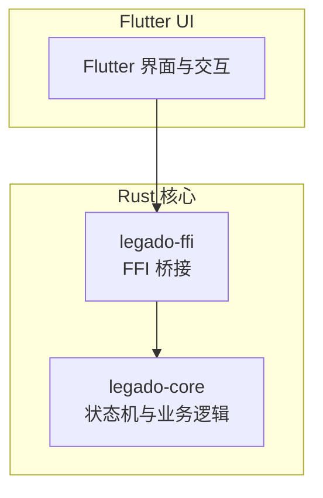
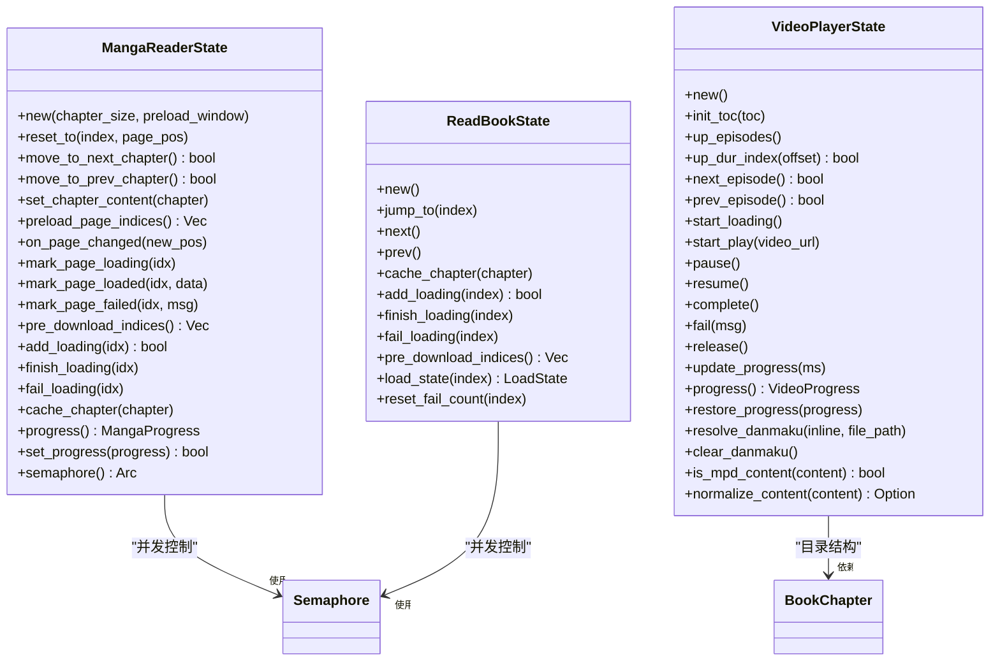
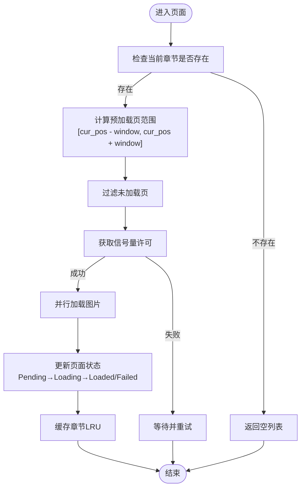
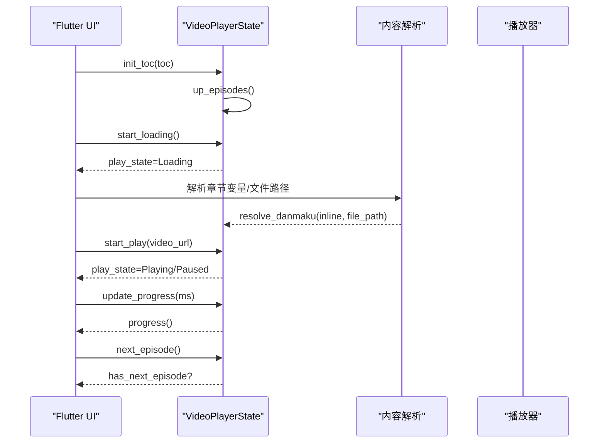
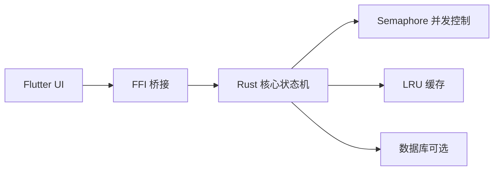

# 漫画视频状态机系统

<cite>
**本文引用的文件**   
- [manga_state.rs](file://rust/legado-core/src/manga_state.rs)
- [video_state.rs](file://rust/legado-core/src/video_state.rs)
- [read_state.rs](file://rust/legado-core/src/read_state.rs)
- [audio.rs](file://rust/legado-core/src/audio.rs)
- [bridge.rs](file://rust/legado-ffi/src/bridge.rs)
- [README.md](file://README.md)
</cite>

## 目录
1. [简介](#简介)
2. [项目结构](#项目结构)
3. [核心组件](#核心组件)
4. [架构总览](#架构总览)
5. [详细组件分析](#详细组件分析)
6. [依赖关系分析](#依赖关系分析)
7. [性能考量](#性能考量)
8. [故障排查指南](#故障排查指南)
9. [结论](#结论)
10. [附录](#附录)

## 简介
本文件系统化梳理 Legado 项目中“漫画与视频”的状态机实现，聚焦 Rust 核心层的 MangaReaderState、VideoPlayerState 以及文本阅读 ReadBookState 等关键状态机。文档从系统架构、组件职责、数据流、并发控制、缓存策略、错误处理与性能优化等方面展开，并辅以类图、时序图和流程图帮助理解。该状态机体系移植自 Kotlin 实现，确保行为一致性与可维护性。

## 项目结构
- Rust 核心引擎位于 rust/ 目录下，包含多个 crate：
  - legado-core：公共基础层（数据模型、错误、加密、排版、状态机等）
  - legado-ffi：FFI 出口（flutter_rust_bridge 与旧式 C ABI）
  - 其他：网络、解析、数据库、JS 引擎、服务器等
- Flutter UI 层位于 flutter_legado/ 目录，通过 FFI 调用 Rust 状态机能力。

图表来源
- [README.md:10-26](file://README.md#L10-L26)

章节来源
- [README.md:10-26](file://README.md#L10-L26)

## 核心组件
- 漫画阅读状态机：MangaReaderState
  - 三章滑动窗口（prev/cur/next）
  - 页级预加载（可配置窗口大小）
  - 有界并发加载（Semaphore 控制）
  - 页面状态机（Pending → Loading → Loaded / Failed）
  - LRU 章节缓存与失败熔断
- 视频播放状态机：VideoPlayerState
  - 卷/剧集目录组织与切换
  - 播放状态机（Idle → Loading → Playing ⇄ Paused → Completed / Error）
  - 播放进度管理（卷索引、剧集索引、毫秒位置）
  - 弹幕来源解析（内联或文件路径）
  - MPD 清单内容检测与规范化
- 文本阅读状态机：ReadBookState
  - 三章滑动窗口、LRU 缓存、失败熔断、预下载
- 音频播放状态：PlayerState（用于听书与播放模式）

章节来源
- [manga_state.rs:1-10](file://rust/legado-core/src/manga_state.rs#L1-L10)
- [video_state.rs:1-16](file://rust/legado-core/src/video_state.rs#L1-L16)
- [read_state.rs:1-5](file://rust/legado-core/src/read_state.rs#L1-L5)
- [audio.rs:86-94](file://rust/legado-core/src/audio.rs#L86-L94)

## 架构总览
整体采用“状态机 + 并发控制 + 缓存 + 熔断”的通用设计模式，适用于漫画、视频、文本等多媒体阅读场景。状态机负责业务规则与状态迁移，FFI 层提供跨语言接口，Flutter 负责 UI 与用户交互。

图表来源
- [manga_state.rs:163-582](file://rust/legado-core/src/manga_state.rs#L163-L582)
- [video_state.rs:81-498](file://rust/legado-core/src/video_state.rs#L81-L498)
- [read_state.rs:29-221](file://rust/legado-core/src/read_state.rs#L29-L221)

## 详细组件分析

### 漫画阅读状态机（MangaReaderState）
- 三章滑动窗口：通过 prev/cur/next 三个槽位管理当前及相邻章节，移动时按偏移更新槽位。
- 页级预加载：基于 cur_page_pos 与 preload_window 计算待加载页索引范围，避免一次性加载过多。
- 并发控制：使用 tokio::sync::Semaphore 限制同时加载的页数，默认 2 并发。
- 页面状态机：PageState 枚举表示 Pending/Loading/Loaded/Failed，支持重试计数。
- LRU 缓存：cached_chapters 以 HashMap 存储章节，超过 max_cache_size 时淘汰距当前最远的章节。
- 失败熔断：fail_count 记录章节失败次数，达到阈值后跳过预下载。
- 阅读进度：MangaProgress 保存 chapter_index 与 page_pos，支持跳转与持久化。

图表来源
- [manga_state.rs:307-333](file://rust/legado-core/src/manga_state.rs#L307-L333)
- [manga_state.rs:447-459](file://rust/legado-core/src/manga_state.rs#L447-L459)

章节来源
- [manga_state.rs:163-582](file://rust/legado-core/src/manga_state.rs#L163-L582)

### 视频播放状态机（VideoPlayerState）
- 目录组织：toc 为完整目录，volumes 为卷列表，episodes 为当前卷内的剧集列表。
- 剧集切换：up_dur_index 支持按偏移切换，边界判断防止越界。
- 播放状态机：PlayState 枚举表示 Idle/Loading/Playing/Paused/Completed/Error。
- 进度管理：VideoProgress 保存 volume_index、episode_index、position_ms，支持恢复。
- 弹幕来源：DanmakuSource 支持 Inline（字符串）与 File（路径），优先级内联 > 文件。
- MPD 检测：is_mpd_content 与 normalize_content 处理 MPD 清单与直接 URL。

图表来源
- [video_state.rs:142-183](file://rust/legado-core/src/video_state.rs#L142-L183)
- [video_state.rs:253-307](file://rust/legado-core/src/video_state.rs#L253-L307)
- [video_state.rs:345-362](file://rust/legado-core/src/video_state.rs#L345-L362)

章节来源
- [video_state.rs:81-498](file://rust/legado-core/src/video_state.rs#L81-L498)

### 文本阅读状态机（ReadBookState）
- 三章滑动窗口：prev/cur/next 槽位管理，jump_to/next/prev 更新窗口。
- LRU 缓存：cached_chapters 超过阈值时淘汰距当前最远的章节。
- 并发控制：semaphore 限制预下载并发数（默认 2）。
- 失败熔断：fail_count 记录失败次数，达到阈值后跳过。
- 预下载：pre_download_indices 计算前向和后向需下载的章节索引。

章节来源
- [read_state.rs:29-221](file://rust/legado-core/src/read_state.rs#L29-L221)

### 音频播放状态（PlayerState）
- 播放状态：Idle/Playing/Paused/Loading/Error
- 播放列表：AudioPlaylist 支持顺序、单曲循环、随机模式
- 播放模式写入：with_audio_play_mode 将模式写入 readConfig JSON

章节来源
- [audio.rs:86-94](file://rust/legado-core/src/audio.rs#L86-L94)
- [audio.rs:206-216](file://rust/legado-core/src/audio.rs#L206-L216)

## 依赖关系分析
- 状态机之间相对独立，但共享并发控制（Semaphore）与缓存策略（LRU）。
- FFI 层提供统一响应结构 FfiResponse，封装错误码与数据。
- Flutter UI 通过 FFI 调用状态机方法，实现跨平台一致性。

图表来源
- [bridge.rs:18-55](file://rust/legado-ffi/src/bridge.rs#L18-L55)
- [manga_state.rs:179-180](file://rust/legado-core/src/manga_state.rs#L179-L180)
- [read_state.rs:38-40](file://rust/legado-core/src/read_state.rs#L38-L40)

章节来源
- [bridge.rs:18-55](file://rust/legado-ffi/src/bridge.rs#L18-L55)

## 性能考量
- 并发控制：Semaphore 限制同时加载任务数，避免资源竞争。
- 预加载窗口：合理设置 preload_window 平衡内存与流畅度。
- LRU 缓存：按距离当前章节的远近淘汰，减少热点数据丢失。
- 失败熔断：快速跳过频繁失败的章节，提升整体体验。
- 页级加载：按需加载图片，避免一次性加载全部页面。

## 故障排查指南
- 页面加载失败：检查 PageState 的 Failed 状态与 count，确认重试机制是否生效。
- 章节加载卡顿：检查 semaphore 可用许可数，确认是否有死锁或阻塞。
- 缓存溢出：监控 cache_size 与 max_cache_size，调整淘汰策略。
- 视频播放异常：查看 PlayState 的 Error 状态与 last_error 信息。
- 弹幕解析失败：确认 DanmakuSource 的优先级与数据来源有效性。

章节来源
- [manga_state.rs:82-88](file://rust/legado-core/src/manga_state.rs#L82-L88)
- [video_state.rs:291-294](file://rust/legado-core/src/video_state.rs#L291-L294)

## 结论
Legado 的状态机系统通过清晰的状态定义、严格的并发控制与智能缓存策略，实现了漫画、视频、文本等多媒体阅读的高性能与高可靠性。其模块化设计与 FFI 桥接确保了跨平台一致性与可维护性，为后续功能扩展奠定了坚实基础。

## 附录
- 相关测试用例：各状态机模块均包含单元测试，覆盖状态迁移、边界条件与并发场景。
- 开发指南：参考 README.md 中的快速开始与文档链接。

章节来源
- [manga_state.rs:590-903](file://rust/legado-core/src/manga_state.rs#L590-L903)
- [video_state.rs:512-777](file://rust/legado-core/src/video_state.rs#L512-L777)
- [read_state.rs:223-529](file://rust/legado-core/src/read_state.rs#L223-L529)
- [README.md:30-53](file://README.md#L30-L53)