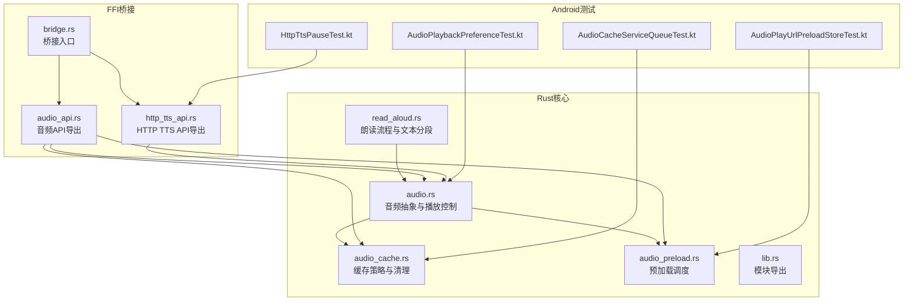
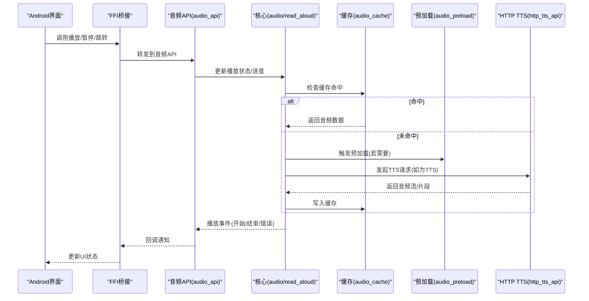
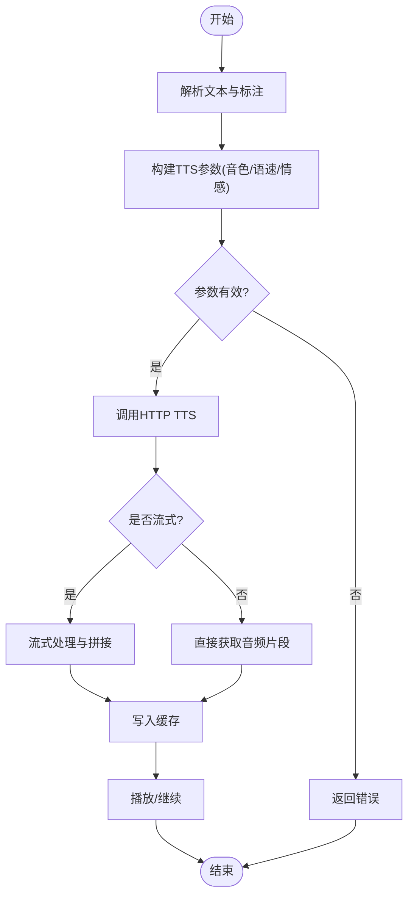
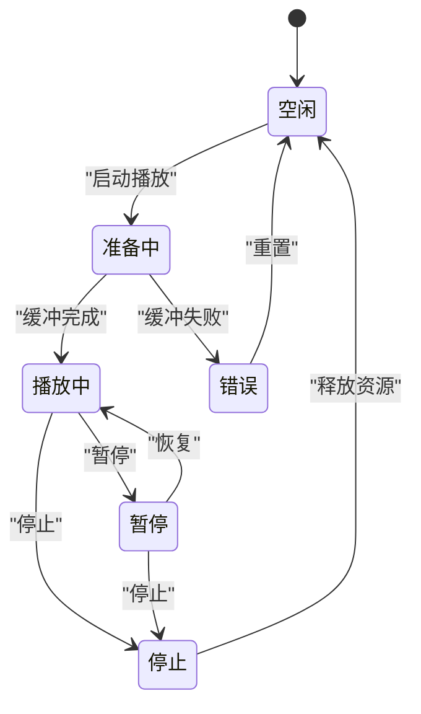
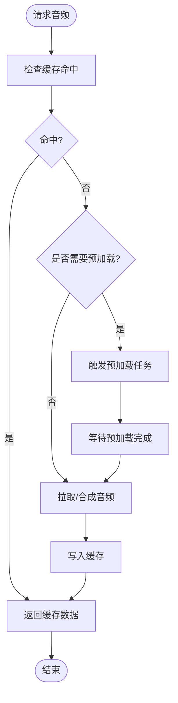
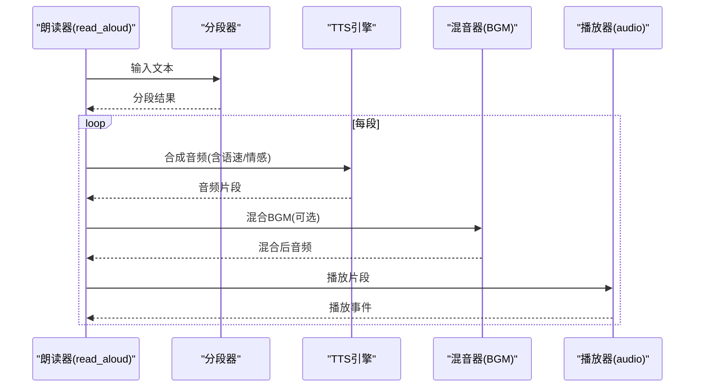
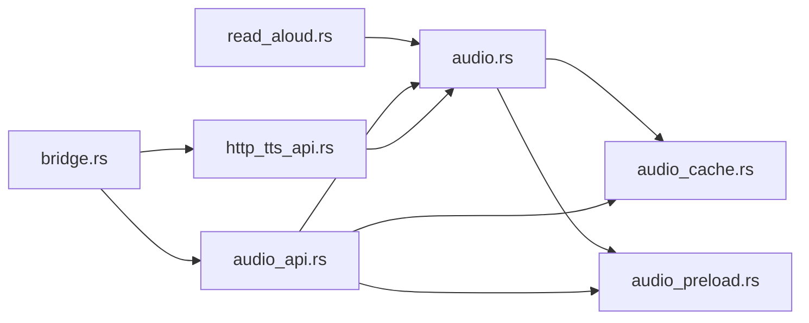

# 音频管理

<cite>
**本文引用的文件**   
- [audio.rs](file://rust/legado-core/src/audio.rs)
- [audio_cache.rs](file://rust/legado-core/src/audio_cache.rs)
- [audio_preload.rs](file://rust/legado-core/src/audio_preload.rs)
- [read_aloud.rs](file://rust/legado-core/src/read_aloud.rs)
- [audio_api.rs](file://rust/legado-ffi/src/api/audio_api.rs)
- [http_tts_api.rs](file://rust/legado-ffi/src/api/http_tts_api.rs)
- [lib.rs](file://rust/legado-core/src/lib.rs)
- [bridge.rs](file://rust/legado-ffi/src/bridge.rs)
- [AudioPlayUrlPreloadStoreTest.kt](file://app/src/test/java/io/legado/app/model/AudioPlayUrlPreloadStoreTest.kt)
- [AudioPlaybackPreferenceTest.kt](file://app/src/test/java/io/legado/app/model/AudioPlaybackPreferenceTest.kt)
- [HttpTtsPauseTest.kt](file://app/src/test/java/io/legado/app/service/HttpTtsPauseTest.kt)
- [AudioCacheServiceQueueTest.kt](file://app/src/test/java/io/legado/app/service/AudioCacheServiceQueueTest.kt)
</cite>

## 目录
1. [简介](#简介)
2. [项目结构](#项目结构)
3. [核心组件](#核心组件)
4. [架构总览](#架构总览)
5. [详细组件分析](#详细组件分析)
6. [依赖分析](#依赖分析)
7. [性能考虑](#性能考虑)
8. [故障排查指南](#故障排查指南)
9. [结论](#结论)
10. [附录](#附录)

## 简介
本文件面向Legado项目的音频管理系统，聚焦以下目标：
- TTS语音合成引擎集成：语音参数配置、语速控制、情感表达。
- 音频播放控制：播放状态管理、进度跟踪、事件回调。
- 音频缓存机制：预加载策略、缓存清理、存储空间管理。
- 朗读功能：文本分段、停顿控制、背景音乐支持。
- 音频格式支持：MP3、AAC、FLAC等编解码处理。
- API使用示例与性能优化建议。

## 项目结构
音频相关能力主要分布在Rust核心模块与FFI桥接层，Android侧通过测试用例验证行为与交互。关键路径如下：
- Rust核心：音频抽象、缓存、预加载、朗读流程。
- FFI接口：对外暴露的音频API与HTTP TTS API。
- Android测试：覆盖播放偏好、预加载存储、暂停恢复、队列管理等场景。

图表来源
- [audio.rs:1-200](file://rust/legado-core/src/audio.rs#L1-L200)
- [audio_cache.rs:1-200](file://rust/legado-core/src/audio_cache.rs#L1-L200)
- [audio_preload.rs:1-200](file://rust/legado-core/src/audio_preload.rs#L1-L200)
- [read_aloud.rs:1-200](file://rust/legado-core/src/read_aloud.rs#L1-L200)
- [audio_api.rs:1-200](file://rust/legado-ffi/src/api/audio_api.rs#L1-L200)
- [http_tts_api.rs:1-200](file://rust/legado-ffi/src/api/http_tts_api.rs#L1-L200)
- [bridge.rs:1-200](file://rust/legado-ffi/src/bridge.rs#L1-L200)

章节来源
- [lib.rs:1-100](file://rust/legado-core/src/lib.rs#L1-L100)

## 核心组件
- 音频抽象与播放控制（audio.rs）
  - 职责：统一播放会话、状态机、进度上报、事件回调、多源切换（本地/网络/TTS）。
  - 关键点：播放状态枚举、缓冲策略、错误码映射、线程安全。
- 音频缓存（audio_cache.rs）
  - 职责：缓存策略（LRU/容量限制）、过期与清理、磁盘空间监控、并发访问保护。
  - 关键点：缓存键生成、命中判定、异步写入、清理触发条件。
- 预加载（audio_preload.rs）
  - 职责：基于阅读位置预测下一段音频并提前下载/合成，降低首帧延迟。
  - 关键点：预加载阈值、去重、失败重试、资源占用上限。
- 朗读流程（read_aloud.rs）
  - 职责：文本分段、停顿控制、语速/音量/音调调节、情感参数注入、BGM混音。
  - 关键点：分词规则、停顿时长计算、TTS参数拼装、事件回传。
- FFI音频API（audio_api.rs）
  - 职责：向Android侧暴露播放、暂停、停止、跳转、进度查询、缓存操作等接口。
  - 关键点：参数校验、错误传播、回调注册。
- HTTP TTS API（http_tts_api.rs）
  - 职责：调用外部TTS服务，支持多种音色、语速、情感、采样率等参数。
  - 关键点：请求构建、鉴权、重试、流式响应处理。

章节来源
- [audio.rs:1-200](file://rust/legado-core/src/audio.rs#L1-L200)
- [audio_cache.rs:1-200](file://rust/legado-core/src/audio_cache.rs#L1-L200)
- [audio_preload.rs:1-200](file://rust/legado-core/src/audio_preload.rs#L1-L200)
- [read_aloud.rs:1-200](file://rust/legado-core/src/read_aloud.rs#L1-L200)
- [audio_api.rs:1-200](file://rust/legado-ffi/src/api/audio_api.rs#L1-L200)
- [http_tts_api.rs:1-200](file://rust/legado-ffi/src/api/http_tts_api.rs#L1-L200)

## 架构总览
整体采用“核心逻辑在Rust + FFI导出 + Android调用”的分层架构。Rust核心负责音视频与业务逻辑，FFI提供稳定接口，Android侧进行UI与系统能力对接。

图表来源
- [audio_api.rs:1-200](file://rust/legado-ffi/src/api/audio_api.rs#L1-L200)
- [audio.rs:1-200](file://rust/legado-core/src/audio.rs#L1-L200)
- [audio_cache.rs:1-200](file://rust/legado-core/src/audio_cache.rs#L1-L200)
- [audio_preload.rs:1-200](file://rust/legado-core/src/audio_preload.rs#L1-L200)
- [http_tts_api.rs:1-200](file://rust/legado-ffi/src/api/http_tts_api.rs#L1-L200)

## 详细组件分析

### TTS语音合成引擎集成
- 语音参数配置
  - 支持音色、语言、采样率、比特率、声道数等参数设置。
  - 参数校验与默认值回退，确保兼容性。
- 语速控制
  - 通过速率系数调节语速，影响分词与停顿计算。
  - 动态调整时平滑过渡，避免突变。
- 情感表达
  - 注入情感参数（如语调、强度），由TTS服务渲染。
  - 根据文本语义选择合适的情感标签。

图表来源
- [http_tts_api.rs:1-200](file://rust/legado-ffi/src/api/http_tts_api.rs#L1-L200)
- [read_aloud.rs:1-200](file://rust/legado-core/src/read_aloud.rs#L1-L200)

章节来源
- [http_tts_api.rs:1-200](file://rust/legado-ffi/src/api/http_tts_api.rs#L1-L200)
- [read_aloud.rs:1-200](file://rust/legado-core/src/read_aloud.rs#L1-L200)

### 音频播放控制
- 播放状态管理
  - 状态包括：空闲、准备中、播放中、暂停、停止、错误。
  - 状态转换受用户操作与系统事件驱动。
- 进度跟踪
  - 实时上报当前播放位置、剩余时间、缓冲进度。
  - 支持跳转与拖动，自动重新缓冲。
- 事件回调
  - 播放开始、暂停、结束、错误、缓冲不足等事件。
  - 回调线程安全，避免阻塞主线程。

图表来源
- [audio.rs:1-200](file://rust/legado-core/src/audio.rs#L1-L200)
- [audio_api.rs:1-200](file://rust/legado-ffi/src/api/audio_api.rs#L1-L200)

章节来源
- [audio.rs:1-200](file://rust/legado-core/src/audio.rs#L1-L200)
- [audio_api.rs:1-200](file://rust/legado-ffi/src/api/audio_api.rs#L1-L200)

### 音频缓存机制
- 预加载策略
  - 基于阅读位置预测下一段，提前下载或合成。
  - 支持去重与优先级排序，避免重复工作。
- 缓存清理
  - 按容量与过期时间清理，释放磁盘空间。
  - 支持手动清理与后台定时清理。
- 存储空间管理
  - 监控可用空间，低于阈值时触发清理。
  - 统计缓存大小与命中率，辅助调优。

图表来源
- [audio_cache.rs:1-200](file://rust/legado-core/src/audio_cache.rs#L1-L200)
- [audio_preload.rs:1-200](file://rust/legado-core/src/audio_preload.rs#L1-L200)

章节来源
- [audio_cache.rs:1-200](file://rust/legado-core/src/audio_cache.rs#L1-L200)
- [audio_preload.rs:1-200](file://rust/legado-core/src/audio_preload.rs#L1-L200)

### 朗读功能
- 文本分段
  - 按句子/段落切分，保证语义完整性。
  - 支持自定义分词规则与边界修正。
- 停顿控制
  - 根据标点与语义插入停顿，时长可配置。
  - 语速变化时动态调整停顿比例。
- 背景音乐支持
  - 支持BGM混音，音量可调，播放模式可选。
  - 与朗读音频分离通道，避免冲突。

图表来源
- [read_aloud.rs:1-200](file://rust/legado-core/src/read_aloud.rs#L1-L200)
- [audio.rs:1-200](file://rust/legado-core/src/audio.rs#L1-L200)

章节来源
- [read_aloud.rs:1-200](file://rust/legado-core/src/read_aloud.rs#L1-L200)
- [audio.rs:1-200](file://rust/legado-core/src/audio.rs#L1-L200)

### 音频格式支持
- 支持的格式
  - MP3、AAC、FLAC等常见格式，涵盖压缩与无损。
- 编解码处理
  - 解码为PCM后进行播放，编码用于缓存与传输。
  - 根据设备能力选择最优编解码路径。
- 流式处理
  - 对网络音频采用流式解码，减少内存占用。
  - 断点续播与异常恢复。

章节来源
- [audio.rs:1-200](file://rust/legado-core/src/audio.rs#L1-L200)

### API使用示例
- 播放控制
  - 调用播放、暂停、停止、跳转等方法，监听事件回调。
- 参数配置
  - 设置语速、音量、音调、情感等参数。
- 缓存操作
  - 查询缓存状态、清理缓存、设置容量上限。
- HTTP TTS
  - 构建请求参数，处理流式响应与错误重试。

章节来源
- [audio_api.rs:1-200](file://rust/legado-ffi/src/api/audio_api.rs#L1-L200)
- [http_tts_api.rs:1-200](file://rust/legado-ffi/src/api/http_tts_api.rs#L1-L200)

## 依赖分析
组件间依赖关系清晰，核心模块低耦合，FFI层作为稳定边界。

图表来源
- [audio.rs:1-200](file://rust/legado-core/src/audio.rs#L1-L200)
- [audio_cache.rs:1-200](file://rust/legado-core/src/audio_cache.rs#L1-L200)
- [audio_preload.rs:1-200](file://rust/legado-core/src/audio_preload.rs#L1-L200)
- [read_aloud.rs:1-200](file://rust/legado-core/src/read_aloud.rs#L1-L200)
- [audio_api.rs:1-200](file://rust/legado-ffi/src/api/audio_api.rs#L1-L200)
- [http_tts_api.rs:1-200](file://rust/legado-ffi/src/api/http_tts_api.rs#L1-L200)
- [bridge.rs:1-200](file://rust/legado-ffi/src/bridge.rs#L1-L200)

章节来源
- [lib.rs:1-100](file://rust/legado-core/src/lib.rs#L1-L100)

## 性能考虑
- 预加载优化
  - 合理设置预加载阈值，平衡延迟与资源占用。
  - 去重与优先级排序，避免无效任务。
- 缓存策略
  - 使用LRU与容量限制，及时清理过期数据。
  - 监控命中率与空间使用，动态调整策略。
- 流式处理
  - 网络音频采用流式解码，降低内存峰值。
  - 断点续播提升用户体验。
- 线程与并发
  - 异步任务隔离，避免阻塞主线程。
  - 锁粒度最小化，提高吞吐。

[本节为通用指导，不直接分析具体文件]

## 故障排查指南
- 常见问题
  - 播放卡顿：检查缓存命中率与网络状况。
  - TTS失败：确认参数有效性与服务可用性。
  - 内存溢出：监控缓冲区大小与流式处理。
- 调试方法
  - 启用日志与指标收集，定位瓶颈。
  - 使用测试用例复现问题，逐步缩小范围。
- 恢复策略
  - 自动重试与降级策略，提升鲁棒性。
  - 错误码映射与用户提示。

章节来源
- [AudioPlayUrlPreloadStoreTest.kt:1-200](file://app/src/test/java/io/legado/app/model/AudioPlayUrlPreloadStoreTest.kt#L1-L200)
- [AudioPlaybackPreferenceTest.kt:1-200](file://app/src/test/java/io/legado/app/model/AudioPlaybackPreferenceTest.kt#L1-L200)
- [HttpTtsPauseTest.kt:1-200](file://app/src/test/java/io/legado/app/service/HttpTtsPauseTest.kt#L1-L200)
- [AudioCacheServiceQueueTest.kt:1-200](file://app/src/test/java/io/legado/app/service/AudioCacheServiceQueueTest.kt#L1-L200)

## 结论
Legado音频管理系统以Rust为核心，结合FFI桥接与Android测试，实现了稳定的播放控制、高效的缓存与预加载、灵活的TTS集成与朗读功能。通过合理的架构设计与性能优化，能够满足复杂场景下的音频需求。

[本节为总结，不直接分析具体文件]

## 附录
- 术语表
  - TTS：文本转语音。
  - BGM：背景音乐。
  - LRU：最近最少使用算法。
- 参考链接
  - 相关测试用例与文档可在仓库内查找。

[本节为补充信息，不直接分析具体文件]