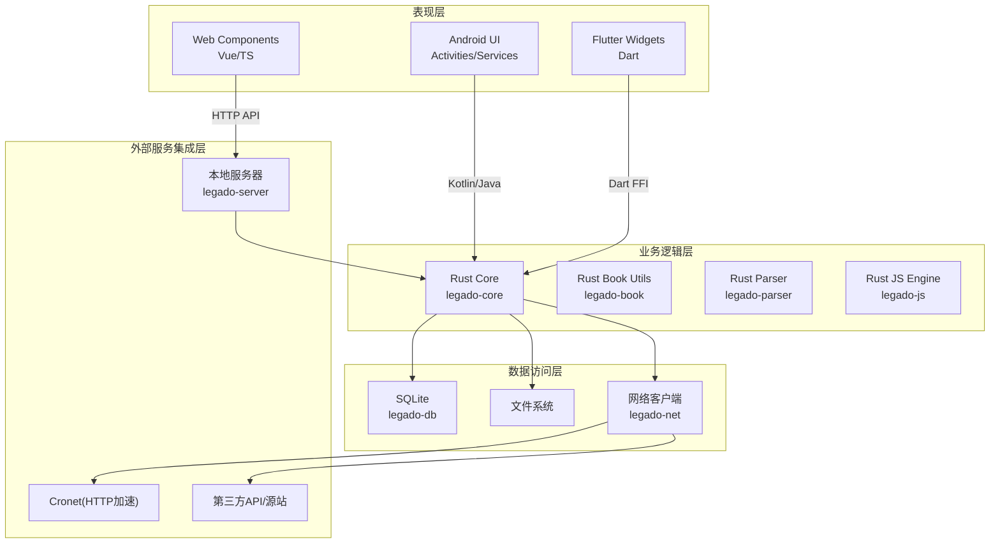
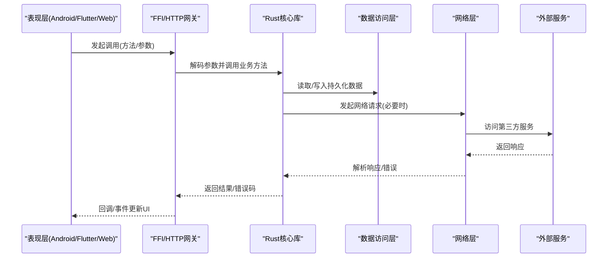
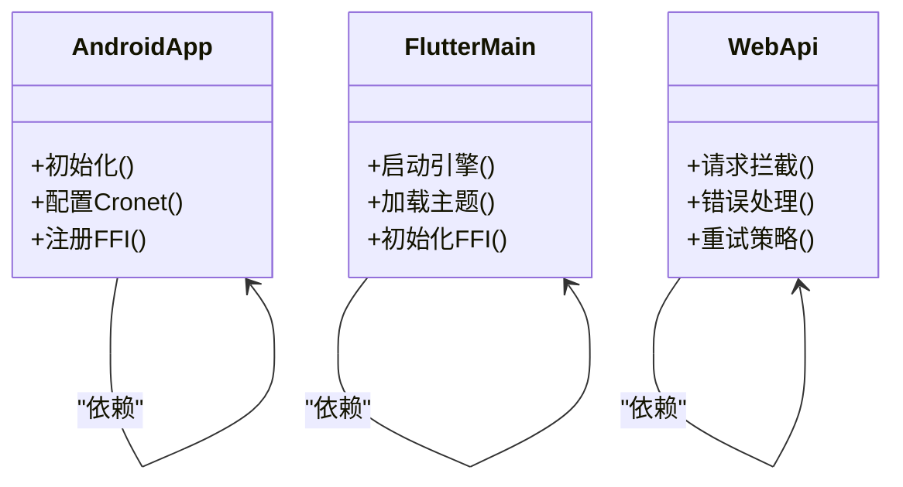
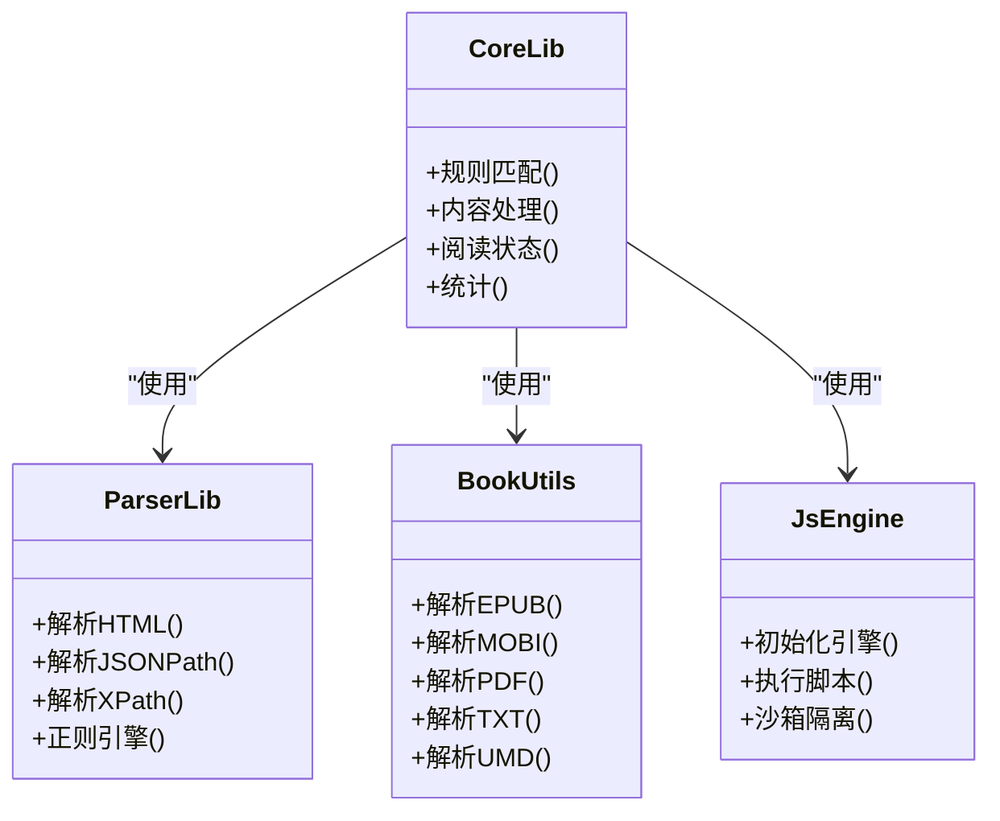
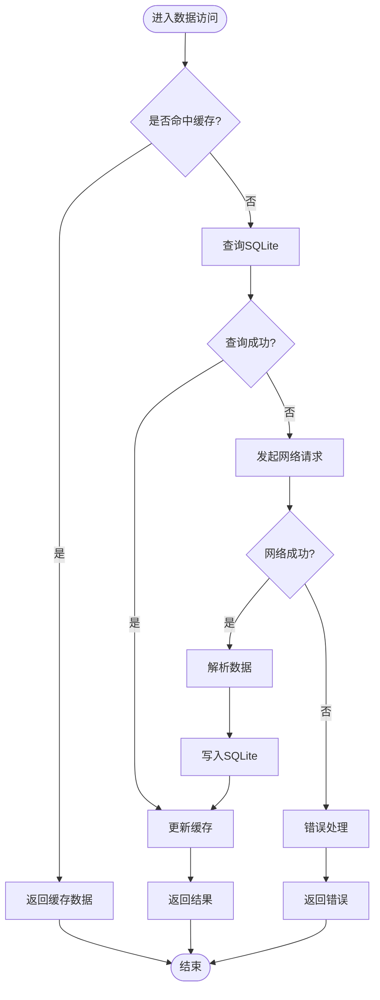
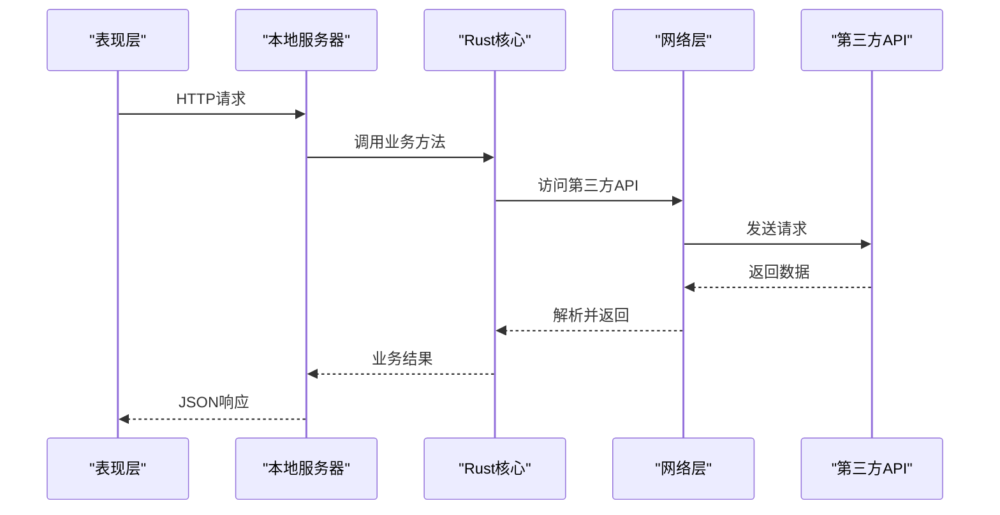
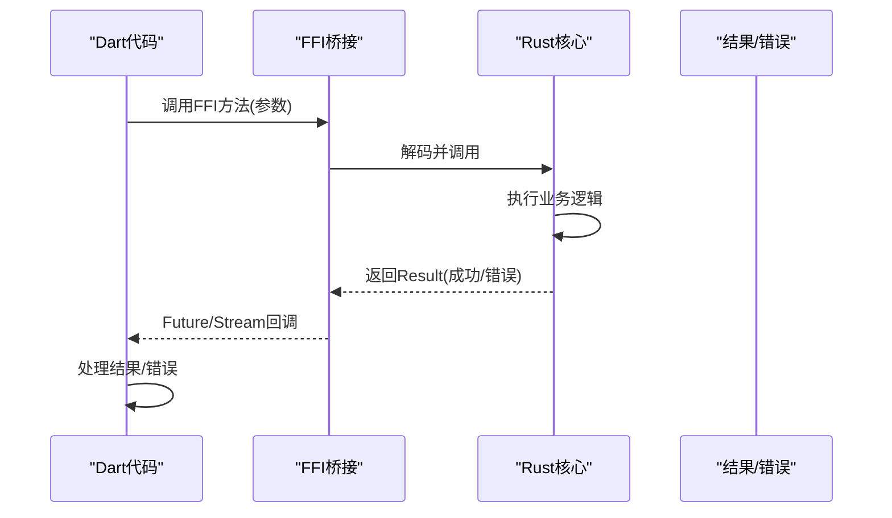
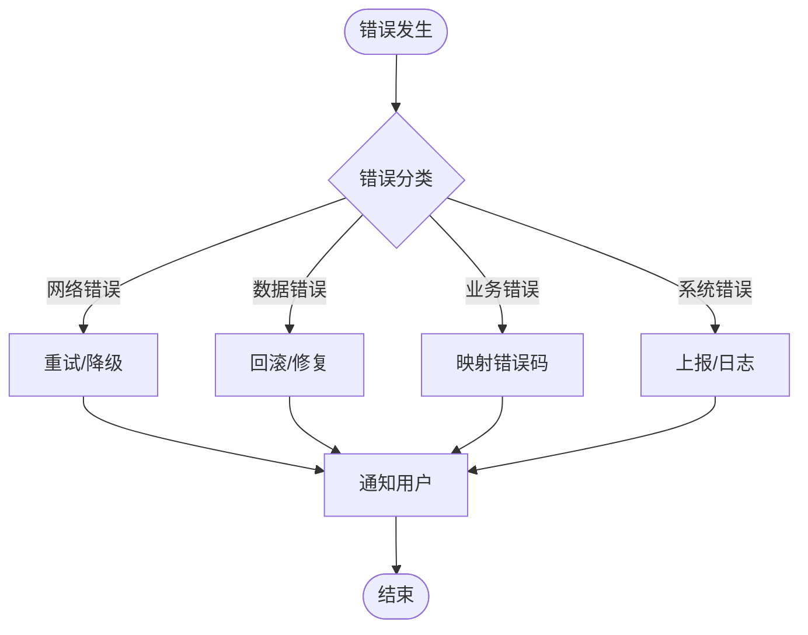
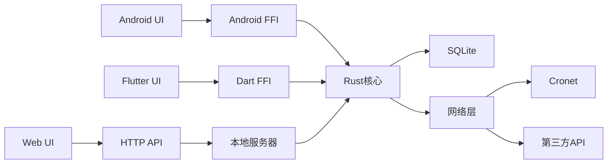

# 分层架构设计

<cite>
**本文引用的文件**   
- [app/src/main/java/io/legado/app/App.kt](file://app/src/main/java/io/legado/app/App.kt)
- [app/src/main/java/io/legado/app/lib/cronet/CronetDownloadTask.kt](file://app/src/main/java/io/legado/app/lib/cronet/CronetDownloadTask.kt)
- [flutter_legado/lib/main.dart](file://flutter_legado/lib/main.dart)
- [flutter_legado/flutter_rust_bridge.yaml](file://flutter_legado/flutter_rust_bridge.yaml)
- [rust/legado-ffi/src/lib.rs](file://rust/legado-ffi/src/lib.rs)
- [rust/legado-ffi/src/bridge.rs](file://rust/legado-ffi/src/bridge.rs)
- [rust/legado-core/src/lib.rs](file://rust/legado-core/src/lib.rs)
- [rust/legado-db/src/lib.rs](file://rust/legado-db/src/lib.rs)
- [rust/legado-net/src/lib.rs](file://rust/legado-net/src/lib.rs)
- [rust/legado-server/src/lib.rs](file://rust/legado-server/src/lib.rs)
- [modules/web/src/api/index.ts](file://modules/web/src/api/index.ts)
- [modules/web/src/api/axios.ts](file://modules/web/src/api/axios.ts)
</cite>

## 目录
1. [简介](#简介)
2. [项目结构](#项目结构)
3. [核心组件](#核心组件)
4. [架构总览](#架构总览)
5. [详细组件分析](#详细组件分析)
6. [依赖关系分析](#依赖关系分析)
7. [性能考量](#性能考量)
8. [故障排查指南](#故障排查指南)
9. [结论](#结论)
10. [附录](#附录)

## 简介
本文件面向Legado应用的分层架构设计与实现，围绕四层职责边界与接口契约展开：表现层（Android Activities/Flutter Widgets/Web Components）、业务逻辑层（Rust核心库）、数据访问层（SQLite/文件系统/网络请求）和外部服务集成层。文档重点说明：
- 各层职责与边界、接口定义
- FFI接口规范与调用约定（Kotlin-Java互操作、Dart-Rust FFI、Web API调用）
- 层间通信机制与错误处理策略（异常传播、错误码映射）
- 分层架构图与数据流图，展示请求处理的完整路径
- 分层设计的优势（解耦、可测试性、可维护性）

## 项目结构
Legado采用多模块、跨语言的多端统一架构：
- Android应用模块（Kotlin/Java）负责UI与系统能力封装
- Flutter工程（Dart）提供跨平台UI与桥接
- Rust核心库（多个crate）承载业务逻辑、解析、网络、数据库与FFI暴露
- Web管理端（Vue+TS）通过HTTP API与后端交互

图表来源 
- [rust/legado-core/src/lib.rs](file://rust/legado-core/src/lib.rs)
- [rust/legado-db/src/lib.rs](file://rust/legado-db/src/lib.rs)
- [rust/legado-net/src/lib.rs](file://rust/legado-net/src/lib.rs)
- [rust/legado-server/src/lib.rs](file://rust/legado-server/src/lib.rs)
- [app/src/main/java/io/legado/app/App.kt](file://app/src/main/java/io/legado/app/App.kt)
- [flutter_legado/lib/main.dart](file://flutter_legado/lib/main.dart)
- [modules/web/src/api/index.ts](file://modules/web/src/api/index.ts)

章节来源
- [app/src/main/java/io/legado/app/App.kt](file://app/src/main/java/io/legado/app/App.kt)
- [flutter_legado/lib/main.dart](file://flutter_legado/lib/main.dart)
- [rust/legado-core/src/lib.rs](file://rust/legado-core/src/lib.rs)
- [rust/legado-db/src/lib.rs](file://rust/legado-db/src/lib.rs)
- [rust/legado-net/src/lib.rs](file://rust/legado-net/src/lib.rs)
- [rust/legado-server/src/lib.rs](file://rust/legado-server/src/lib.rs)
- [modules/web/src/api/index.ts](file://modules/web/src/api/index.ts)

## 核心组件
- 表现层
  - Android：Activity/Service/ViewModel等UI与系统能力封装，调用Rust FFI或本地服务
  - Flutter：Dart侧Widgets与Provider/State管理，通过Dart-Rust FFI调用核心能力
  - Web：Vue组件与状态管理，通过HTTP API与本地服务器交互
- 业务逻辑层（Rust核心库）
  - legado-core：领域模型、规则匹配、内容处理、阅读状态、统计等
  - legado-book：电子书格式处理（epub/mobi/pdf/txt/umd）
  - legado-parser：HTML/JSONPath/XPath/正则规则解析
  - legado-js：Rhino脚本引擎与宿主API沙箱
- 数据访问层
  - legado-db：SQLite ORM、迁移、默认数据、仓库模式
  - legado-net：HTTP客户端、Cookie、代理、重试、限速、SSL配置
  - 文件系统：本地缓存、下载、导入导出
- 外部服务集成层
  - Cronet：Android高性能HTTP引擎
  - legado-server：内置HTTP/WS服务，供Web端与管理工具使用
  - 第三方源站/服务：RSS、搜索、TTS等

章节来源
- [rust/legado-core/src/lib.rs](file://rust/legado-core/src/lib.rs)
- [rust/legado-db/src/lib.rs](file://rust/legado-db/src/lib.rs)
- [rust/legado-net/src/lib.rs](file://rust/legado-net/src/lib.rs)
- [rust/legado-server/src/lib.rs](file://rust/legado-server/src/lib.rs)

## 架构总览
整体遵循“表现层 → FFI/HTTP → Rust核心 → 数据访问/网络 → 外部服务”的单向依赖与清晰边界。关键要点：
- 表现层仅依赖稳定的接口（FFI函数签名、HTTP API），不感知底层实现细节
- Rust核心库作为唯一业务中心，保证跨端一致性
- 数据访问层抽象化存储与IO，便于替换与测试
- 外部服务通过适配器隔离，避免污染核心逻辑

图表来源 
- [rust/legado-ffi/src/lib.rs](file://rust/legado-ffi/src/lib.rs)
- [rust/legado-core/src/lib.rs](file://rust/legado-core/src/lib.rs)
- [rust/legado-db/src/lib.rs](file://rust/legado-db/src/lib.rs)
- [rust/legado-net/src/lib.rs](file://rust/legado-net/src/lib.rs)

## 详细组件分析

### 表现层（Android/Flutter/Web）
- Android
  - 入口与应用初始化：App.kt中完成全局配置、日志、线程池、FFI初始化等
  - 网络加速：CronetDownloadTask封装下载任务，提升大文件/并发下载性能
- Flutter
  - 入口main.dart启动Flutter引擎，加载主题、路由、状态管理
  - 通过flutter_rust_bridge.yaml生成Dart侧FFI绑定，调用Rust核心能力
- Web
  - Vue组件通过api/index.ts与axios.ts封装HTTP请求，统一鉴权、错误处理与重试

图表来源 
- [app/src/main/java/io/legado/app/App.kt](file://app/src/main/java/io/legado/app/App.kt)
- [app/src/main/java/io/legado/app/lib/cronet/CronetDownloadTask.kt](file://app/src/main/java/io/legado/app/lib/cronet/CronetDownloadTask.kt)
- [flutter_legado/lib/main.dart](file://flutter_legado/lib/main.dart)
- [flutter_legado/flutter_rust_bridge.yaml](file://flutter_legado/flutter_rust_bridge.yaml)
- [modules/web/src/api/index.ts](file://modules/web/src/api/index.ts)
- [modules/web/src/api/axios.ts](file://modules/web/src/api/axios.ts)

章节来源
- [app/src/main/java/io/legado/app/App.kt](file://app/src/main/java/io/legado/app/App.kt)
- [app/src/main/java/io/legado/app/lib/cronet/CronetDownloadTask.kt](file://app/src/main/java/io/legado/app/lib/cronet/CronetDownloadTask.kt)
- [flutter_legado/lib/main.dart](file://flutter_legado/lib/main.dart)
- [flutter_legado/flutter_rust_bridge.yaml](file://flutter_legado/flutter_rust_bridge.yaml)
- [modules/web/src/api/index.ts](file://modules/web/src/api/index.ts)
- [modules/web/src/api/axios.ts](file://modules/web/src/api/axios.ts)

### 业务逻辑层（Rust核心库）
- legado-core
  - 领域模型：Book、Chapter、Source、Rule等
  - 规则引擎：匹配、转换、渲染
  - 阅读状态与统计：进度、书签、阅读时长
- legado-book
  - 多格式解析与导出：EPUB/MOBI/PDF/TXT/UMD
- legado-parser
  - HTML/JSONPath/XPath/正则规则分析与执行
- legado-js
  - Rhino脚本引擎与宿主API沙箱，支持动态扩展源逻辑

图表来源 
- [rust/legado-core/src/lib.rs](file://rust/legado-core/src/lib.rs)
- [rust/legado-book/src/lib.rs](file://rust/legado-book/src/lib.rs)
- [rust/legado-parser/src/lib.rs](file://rust/legado-parser/src/lib.rs)
- [rust/legado-js/src/lib.rs](file://rust/legado-js/src/lib.rs)

章节来源
- [rust/legado-core/src/lib.rs](file://rust/legado-core/src/lib.rs)
- [rust/legado-book/src/lib.rs](file://rust/legado-book/src/lib.rs)
- [rust/legado-parser/src/lib.rs](file://rust/legado-parser/src/lib.rs)
- [rust/legado-js/src/lib.rs](file://rust/legado-js/src/lib.rs)

### 数据访问层（SQLite/文件系统/网络）
- legado-db
  - SQLite连接、迁移、默认数据注入
  - 仓库模式：BookRepository、ChapterRepository、BookmarkRepository等
- legado-net
  - HTTP客户端封装：请求构建、响应解析、Cookie管理、代理、重试、限速、SSL配置
- 文件系统
  - 缓存、下载、导入导出、临时文件清理

图表来源 
- [rust/legado-db/src/lib.rs](file://rust/legado-db/src/lib.rs)
- [rust/legado-net/src/lib.rs](file://rust/legado-net/src/lib.rs)

章节来源
- [rust/legado-db/src/lib.rs](file://rust/legado-db/src/lib.rs)
- [rust/legado-net/src/lib.rs](file://rust/legado-net/src/lib.rs)

### 外部服务集成层（Cronet/本地服务器/第三方API）
- Cronet：Android高性能HTTP引擎，用于下载与网络加速
- legado-server：内置HTTP/WS服务，为Web端提供统一API
- 第三方API：源站、RSS、TTS、搜索等，通过net层适配

图表来源 
- [rust/legado-server/src/lib.rs](file://rust/legado-server/src/lib.rs)
- [rust/legado-net/src/lib.rs](file://rust/legado-net/src/lib.rs)

章节来源
- [rust/legado-server/src/lib.rs](file://rust/legado-server/src/lib.rs)
- [rust/legado-net/src/lib.rs](file://rust/legado-net/src/lib.rs)

### FFI接口规范与调用约定
- Dart-Rust FFI
  - 通过flutter_rust_bridge.yaml声明接口，自动生成Dart侧绑定
  - 数据类型映射：基础类型、字符串、字节数组、枚举、结构体
  - 异步调用：Future/Stream，错误以Result或自定义错误码返回
- Kotlin-Java互操作
  - Android侧通过JNI/FFI调用Rust，或使用本地服务HTTP接口
  - 参数序列化与反序列化需严格一致
- Web API
  - 统一RESTful风格，错误码与消息体标准化
  - 鉴权、限流、重试在axios拦截器中实现

图表来源 
- [flutter_legado/flutter_rust_bridge.yaml](file://flutter_legado/flutter_rust_bridge.yaml)
- [rust/legado-ffi/src/lib.rs](file://rust/legado-ffi/src/lib.rs)
- [rust/legado-ffi/src/bridge.rs](file://rust/legado-ffi/src/bridge.rs)

章节来源
- [flutter_legado/flutter_rust_bridge.yaml](file://flutter_legado/flutter_rust_bridge.yaml)
- [rust/legado-ffi/src/lib.rs](file://rust/legado-ffi/src/lib.rs)
- [rust/legado-ffi/src/bridge.rs](file://rust/legado-ffi/src/bridge.rs)

### 错误处理策略
- 表现层
  - Android：统一异常捕获、用户提示、崩溃上报
  - Flutter：错误边界、Toast/Snackbar提示、重试按钮
  - Web：axios拦截器统一错误处理，友好提示与重试
- Rust核心
  - 使用Result类型传递错误，区分业务错误与系统错误
  - 错误码映射到上层（Dart/Kotlin/Web）统一处理
- 数据访问层
  - 网络超时、重试、降级策略
  - 数据库事务回滚、迁移失败处理

[此图为概念流程，无需源码映射]

## 依赖关系分析
- 表现层依赖FFI/HTTP接口，不直接依赖Rust实现
- Rust核心依赖数据访问与网络层，保持业务纯净
- 数据访问层与外部服务通过适配器隔离，便于替换与测试
- 本地服务器作为Web端的唯一入口，屏蔽底层复杂性

图表来源 
- [rust/legado-core/src/lib.rs](file://rust/legado-core/src/lib.rs)
- [rust/legado-db/src/lib.rs](file://rust/legado-db/src/lib.rs)
- [rust/legado-net/src/lib.rs](file://rust/legado-net/src/lib.rs)
- [rust/legado-server/src/lib.rs](file://rust/legado-server/src/lib.rs)

章节来源
- [rust/legado-core/src/lib.rs](file://rust/legado-core/src/lib.rs)
- [rust/legado-db/src/lib.rs](file://rust/legado-db/src/lib.rs)
- [rust/legado-net/src/lib.rs](file://rust/legado-net/src/lib.rs)
- [rust/legado-server/src/lib.rs](file://rust/legado-server/src/lib.rs)

## 性能考量
- 网络优化
  - Cronet加速下载与并发请求
  - 连接池、Keep-Alive、压缩传输
- 缓存策略
  - 多级缓存（内存/磁盘/SQLite）
  - TTL与失效策略
- 解析性能
  - 规则预编译与缓存
  - 流式解析大文件
- 异步与并发
  - Rust侧Tokio协程，Android侧协程/线程池
  - Flutter侧Isolate与后台任务

[本节为通用指导，无需源码映射]

## 故障排查指南
- 常见问题
  - FFI调用失败：检查参数序列化、类型映射、版本一致性
  - 网络请求失败：检查代理、SSL配置、重试策略
  - 数据库迁移失败：检查schema版本、默认数据注入
- 调试手段
  - 启用详细日志，定位错误堆栈
  - 使用本地服务器WebSocket进行实时调试
  - 单元测试与集成测试覆盖关键路径

章节来源
- [rust/legado-ffi/src/lib.rs](file://rust/legado-ffi/src/lib.rs)
- [rust/legado-net/src/lib.rs](file://rust/legado-net/src/lib.rs)
- [rust/legado-db/src/lib.rs](file://rust/legado-db/src/lib.rs)

## 结论
Legado的分层架构通过清晰的职责边界与稳定的接口契约，实现了跨端一致性与高可维护性。Rust核心库作为业务中枢，结合SQLite与网络层的抽象，使系统具备良好的扩展性与可测试性。FFI与HTTP API的统一设计，确保了Android、Flutter与Web端的无缝协作。未来可进一步优化缓存策略、解析性能与错误处理体验。

[本节为总结，无需源码映射]

## 附录
- 术语表
  - FFI：外部函数接口
  - Cronet：Android高性能HTTP引擎
  - Repo：仓库模式，数据访问抽象
- 参考文件
  - [app/src/main/java/io/legado/app/App.kt](file://app/src/main/java/io/legado/app/App.kt)
  - [flutter_legado/lib/main.dart](file://flutter_legado/lib/main.dart)
  - [flutter_legado/flutter_rust_bridge.yaml](file://flutter_legado/flutter_rust_bridge.yaml)
  - [rust/legado-ffi/src/lib.rs](file://rust/legado-ffi/src/lib.rs)
  - [rust/legado-core/src/lib.rs](file://rust/legado-core/src/lib.rs)
  - [rust/legado-db/src/lib.rs](file://rust/legado-db/src/lib.rs)
  - [rust/legado-net/src/lib.rs](file://rust/legado-net/src/lib.rs)
  - [rust/legado-server/src/lib.rs](file://rust/legado-server/src/lib.rs)
  - [modules/web/src/api/index.ts](file://modules/web/src/api/index.ts)
  - [modules/web/src/api/axios.ts](file://modules/web/src/api/axios.ts)