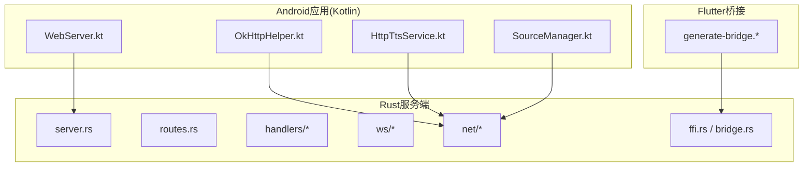
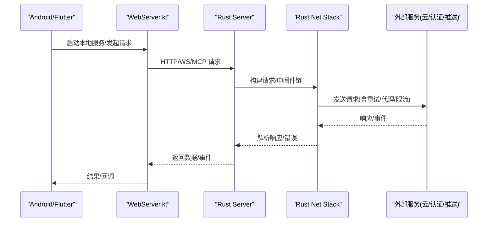
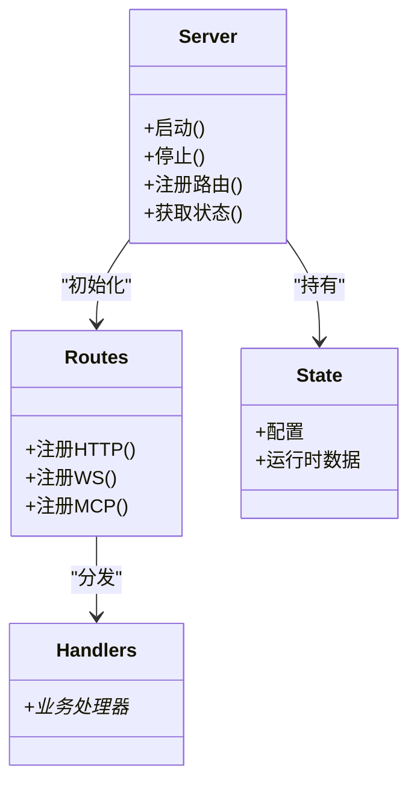
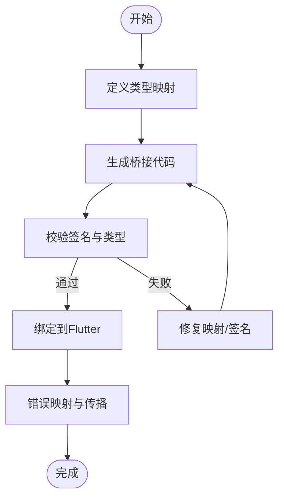
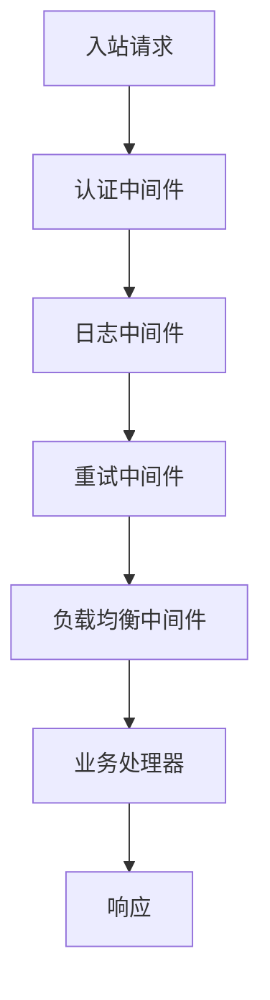
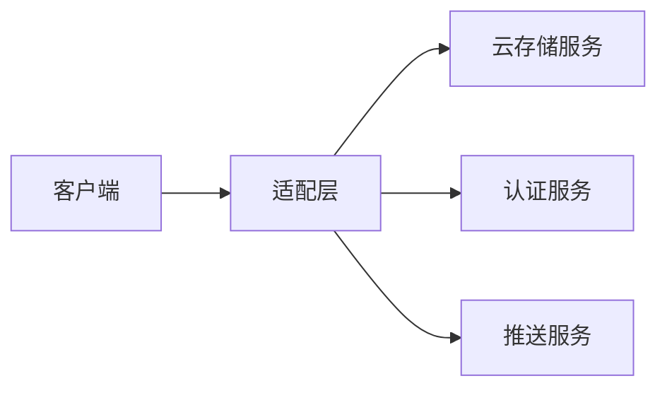
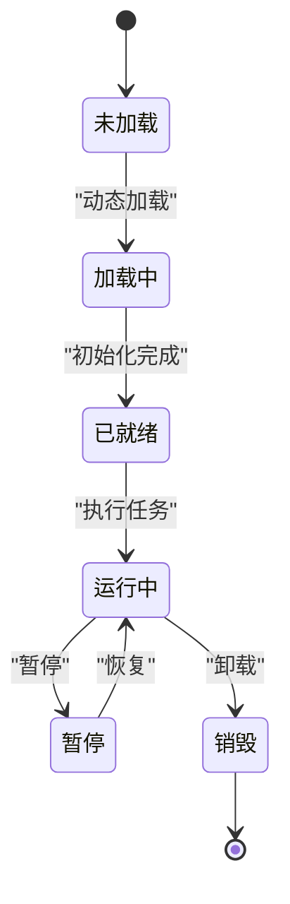
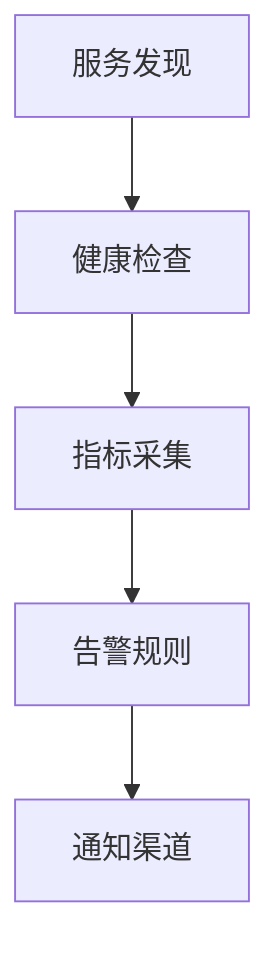
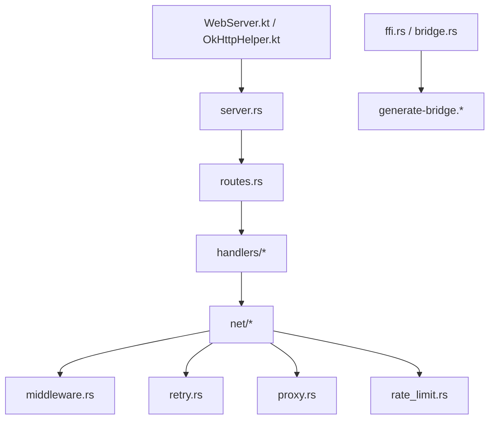

# 外部服务集成层

<cite>
**本文档引用的文件**   
- [legado-server/src/lib.rs](file://rust/legado-server/src/lib.rs)
- [legado-server/src/server.rs](file://rust/legado-server/src/server.rs)
- [legado-server/src/routes.rs](file://rust/legado-server/src/routes.rs)
- [legado-server/src/state.rs](file://rust/legado-server/src/state.rs)
- [legado-server/src/error.rs](file://rust/legado-server/src/error.rs)
- [legado-server/src/handlers/mod.rs](file://rust/legado-server/src/handlers/mod.rs)
- [legado-server/src/ws/mod.rs](file://rust/legado-server/src/ws/mod.rs)
- [legado-net/src/middleware.rs](file://rust/legado-net/src/middleware.rs)
- [legado-net/src/retry.rs](file://rust/legado-net/src/retry.rs)
- [legado-net/src/client.rs](file://rust/legado-net/src/client.rs)
- [legado-net/src/proxy.rs](file://rust/legado-net/src/proxy.rs)
- [legado-net/src/rate_limit.rs](file://rust/legado-net/src/rate_limit.rs)
- [legado-ffi/src/bridge.rs](file://rust/legado-ffi/src/bridge.rs)
- [legado-ffi/src/ffi.rs](file://rust/legado-ffi/src/ffi.rs)
- [legado-ffi/src/error.rs](file://rust/legado-ffi/src/error.rs)
- [flutter_legado/scripts/generate-bridge.sh](file://flutter_legado/scripts/generate-bridge.sh)
- [flutter_legado/scripts/generate-bridge.ps1](file://flutter_legado/scripts/generate-bridge.ps1)
- [app/src/main/java/io/legado/app/web/WebServer.kt](file://app/src/main/java/io/legado/app/web/WebServer.kt)
- [app/src/main/java/io/legado/app/service/HttpTtsService.kt](file://app/src/main/java/io/legado/app/service/HttpTtsService.kt)
- [app/src/main/java/io/legado/app/help/http/OkHttpHelper.kt](file://app/src/main/java/io/legado/app/help/http/OkHttpHelper.kt)
- [app/src/main/java/io/legado/app/model/source/SourceManager.kt](file://app/src/main/java/io/legado/app/model/source/SourceManager.kt)
- [app/src/main/java/io/legado/app/utils/NetworkUtils.kt](file://app/src/main/java/io/legado/app/utils/NetworkUtils.kt)
</cite>

## 目录
1. [简介](#简介)
2. [项目结构](#项目结构)
3. [核心组件](#核心组件)
4. [架构总览](#架构总览)
5. [详细组件分析](#详细组件分析)
6. [依赖关系分析](#依赖关系分析)
7. [性能考量](#性能考量)
8. [故障排除指南](#故障排除指南)
9. [结论](#结论)
10. [附录](#附录)

## 简介
本文件面向Legado应用的外部服务集成层，聚焦以下目标：
- Web服务器架构设计：HTTP API、WebSocket实时通信与MCP协议支持。
- FFI桥接层设计：跨语言数据类型映射、内存管理与错误处理。
- 网络请求中间件链：认证、日志记录、重试机制与负载均衡。
- 第三方服务集成：云存储、认证服务与推送服务的对接方案。
- 插件系统架构：动态加载、沙箱隔离与生命周期管理。
- 服务发现、健康检查与监控告警机制。
- 提供具体集成示例与故障排除指南。

## 项目结构
Legado的外部服务集成由多语言模块协作完成：
- Rust侧提供高性能Web服务器、网络栈与FFI导出能力。
- Kotlin侧在Android应用中暴露本地Web服务、HTTP客户端与服务编排。
- Flutter侧通过脚本生成桥接代码，调用Rust FFI接口。

图表来源
- [legado-server/src/server.rs](file://rust/legado-server/src/server.rs)
- [legado-server/src/routes.rs](file://rust/legado-server/src/routes.rs)
- [legado-server/src/handlers/mod.rs](file://rust/legado-server/src/handlers/mod.rs)
- [legado-server/src/ws/mod.rs](file://rust/legado-server/src/ws/mod.rs)
- [legado-net/src/client.rs](file://rust/legado-net/src/client.rs)
- [legado-ffi/src/ffi.rs](file://rust/legado-ffi/src/ffi.rs)
- [legado-ffi/src/bridge.rs](file://rust/legado-ffi/src/bridge.rs)
- [app/src/main/java/io/legado/app/web/WebServer.kt](file://app/src/main/java/io/legado/app/web/WebServer.kt)
- [app/src/main/java/io/legado/app/help/http/OkHttpHelper.kt](file://app/src/main/java/io/legado/app/help/http/OkHttpHelper.kt)
- [app/src/main/java/io/legado/app/service/HttpTtsService.kt](file://app/src/main/java/io/legado/app/service/HttpTtsService.kt)
- [app/src/main/java/io/legado/app/model/source/SourceManager.kt](file://app/src/main/java/io/legado/app/model/source/SourceManager.kt)
- [flutter_legado/scripts/generate-bridge.sh](file://flutter_legado/scripts/generate-bridge.sh)
- [flutter_legado/scripts/generate-bridge.ps1](file://flutter_legado/scripts/generate-bridge.ps1)

章节来源
- [legado-server/src/lib.rs](file://rust/legado-server/src/lib.rs)
- [legado-server/src/server.rs](file://rust/legado-server/src/server.rs)
- [legado-server/src/routes.rs](file://rust/legado-server/src/routes.rs)
- [legado-server/src/state.rs](file://rust/legado-server/src/state.rs)
- [legado-server/src/error.rs](file://rust/legado-server/src/error.rs)
- [legado-server/src/handlers/mod.rs](file://rust/legado-server/src/handlers/mod.rs)
- [legado-server/src/ws/mod.rs](file://rust/legado-server/src/ws/mod.rs)
- [legado-net/src/middleware.rs](file://rust/legado-net/src/middleware.rs)
- [legado-net/src/retry.rs](file://rust/legado-net/src/retry.rs)
- [legado-net/src/client.rs](file://rust/legado-net/src/client.rs)
- [legado-net/src/proxy.rs](file://rust/legado-net/src/proxy.rs)
- [legado-net/src/rate_limit.rs](file://rust/legado-net/src/rate_limit.rs)
- [legado-ffi/src/bridge.rs](file://rust/legado-ffi/src/bridge.rs)
- [legado-ffi/src/ffi.rs](file://rust/legado-ffi/src/ffi.rs)
- [legado-ffi/src/error.rs](file://rust/legado-ffi/src/error.rs)
- [flutter_legado/scripts/generate-bridge.sh](file://flutter_legado/scripts/generate-bridge.sh)
- [flutter_legado/scripts/generate-bridge.ps1](file://flutter_legado/scripts/generate-bridge.ps1)
- [app/src/main/java/io/legado/app/web/WebServer.kt](file://app/src/main/java/io/legado/app/web/WebServer.kt)
- [app/src/main/java/io/legado/app/help/http/OkHttpHelper.kt](file://app/src/main/java/io/legado/app/help/http/OkHttpHelper.kt)
- [app/src/main/java/io/legado/app/service/HttpTtsService.kt](file://app/src/main/java/io/legado/app/service/HttpTtsService.kt)
- [app/src/main/java/io/legado/app/model/source/SourceManager.kt](file://app/src/main/java/io/legado/app/model/source/SourceManager.kt)
- [app/src/main/java/io/legado/app/utils/NetworkUtils.kt](file://app/src/main/java/io/legado/app/utils/NetworkUtils.kt)

## 核心组件
- Web服务器（Rust）：负责HTTP路由、WebSocket连接与MCP协议处理，集中管理状态与错误。
- 网络栈（Rust）：封装HTTP客户端、代理、速率限制、重试与Cookie等能力。
- FFI桥接（Rust + Flutter）：定义跨语言类型映射、内存边界与错误传播。
- Android集成（Kotlin）：启动本地Web服务、提供HTTP工具类与后台服务。
- 插件系统（Rust JS引擎）：JS源执行环境、沙箱隔离与生命周期管理。

章节来源
- [legado-server/src/server.rs](file://rust/legado-server/src/server.rs)
- [legado-server/src/routes.rs](file://rust/legado-server/src/routes.rs)
- [legado-server/src/state.rs](file://rust/legado-server/src/state.rs)
- [legado-server/src/error.rs](file://rust/legado-server/src/error.rs)
- [legado-net/src/client.rs](file://rust/legado-net/src/client.rs)
- [legado-net/src/middleware.rs](file://rust/legado-net/src/middleware.rs)
- [legado-net/src/retry.rs](file://rust/legado-net/src/retry.rs)
- [legado-ffi/src/ffi.rs](file://rust/legado-ffi/src/ffi.rs)
- [legado-ffi/src/bridge.rs](file://rust/legado-ffi/src/bridge.rs)
- [app/src/main/java/io/legado/app/web/WebServer.kt](file://app/src/main/java/io/legado/app/web/WebServer.kt)
- [app/src/main/java/io/legado/app/help/http/OkHttpHelper.kt](file://app/src/main/java/io/legado/app/help/http/OkHttpHelper.kt)

## 架构总览
整体架构采用“Android前端 + Rust后端服务 + Flutter桥接”的分层模式：
- Android端通过WebServer启动并管理本地服务进程，使用OkHttp进行HTTP交互。
- Rust服务端提供HTTP API、WebSocket与MCP协议，内部通过net模块统一网络访问。
- Flutter通过脚本生成FFI绑定，直接调用Rust能力，实现跨平台能力复用。

图表来源
- [legado-server/src/server.rs](file://rust/legado-server/src/server.rs)
- [legado-server/src/routes.rs](file://rust/legado-server/src/routes.rs)
- [legado-net/src/client.rs](file://rust/legado-net/src/client.rs)
- [legado-net/src/middleware.rs](file://rust/legado-net/src/middleware.rs)
- [legado-net/src/retry.rs](file://rust/legado-net/src/retry.rs)
- [app/src/main/java/io/legado/app/web/WebServer.kt](file://app/src/main/java/io/legado/app/web/WebServer.kt)

## 详细组件分析

### Web服务器（HTTP API、WebSocket、MCP）
- HTTP路由：集中注册API路径与处理器，按功能域划分handler。
- WebSocket：维护连接会话、消息广播与订阅模型。
- MCP协议：作为扩展协议入口，用于与外部AI或工具链交互。
- 状态管理：共享上下文、配置与运行时状态。
- 错误处理：统一错误码与异常转换。

图表来源
- [legado-server/src/server.rs](file://rust/legado-server/src/server.rs)
- [legado-server/src/routes.rs](file://rust/legado-server/src/routes.rs)
- [legado-server/src/handlers/mod.rs](file://rust/legado-server/src/handlers/mod.rs)
- [legado-server/src/state.rs](file://rust/legado-server/src/state.rs)

章节来源
- [legado-server/src/server.rs](file://rust/legado-server/src/server.rs)
- [legado-server/src/routes.rs](file://rust/legado-server/src/routes.rs)
- [legado-server/src/handlers/mod.rs](file://rust/legado-server/src/handlers/mod.rs)
- [legado-server/src/state.rs](file://rust/legado-server/src/state.rs)
- [legado-server/src/error.rs](file://rust/legado-server/src/error.rs)

### FFI桥接层（跨语言类型、内存与错误）
- 类型映射：Rust结构与Flutter/Dart类型双向映射，确保序列化一致性。
- 内存管理：避免跨边界拷贝，使用零拷贝或明确所有权策略。
- 错误处理：将Rust错误转换为可序列化的错误对象，便于上层捕获。
- 生成器：通过脚本自动生成桥接代码，减少手工维护成本。

图表来源
- [legado-ffi/src/ffi.rs](file://rust/legado-ffi/src/ffi.rs)
- [legado-ffi/src/bridge.rs](file://rust/legado-ffi/src/bridge.rs)
- [legado-ffi/src/error.rs](file://rust/legado-ffi/src/error.rs)
- [flutter_legado/scripts/generate-bridge.sh](file://flutter_legado/scripts/generate-bridge.sh)
- [flutter_legado/scripts/generate-bridge.ps1](file://flutter_legado/scripts/generate-bridge.ps1)

章节来源
- [legado-ffi/src/ffi.rs](file://rust/legado-ffi/src/ffi.rs)
- [legado-ffi/src/bridge.rs](file://rust/legado-ffi/src/bridge.rs)
- [legado-ffi/src/error.rs](file://rust/legado-ffi/src/error.rs)
- [flutter_legado/scripts/generate-bridge.sh](file://flutter_legado/scripts/generate-bridge.sh)
- [flutter_legado/scripts/generate-bridge.ps1](file://flutter_legado/scripts/generate-bridge.ps1)

### 网络请求中间件链（认证、日志、重试、负载均衡）
- 认证：鉴权令牌注入、签名验证与权限控制。
- 日志：请求/响应记录、耗时统计与采样策略。
- 重试：指数退避、幂等性判断与熔断降级。
- 负载均衡：多端点选择、健康探测与权重分配。

图表来源
- [legado-net/src/middleware.rs](file://rust/legado-net/src/middleware.rs)
- [legado-net/src/retry.rs](file://rust/legado-net/src/retry.rs)
- [legado-net/src/client.rs](file://rust/legado-net/src/client.rs)
- [legado-net/src/proxy.rs](file://rust/legado-net/src/proxy.rs)
- [legado-net/src/rate_limit.rs](file://rust/legado-net/src/rate_limit.rs)

章节来源
- [legado-net/src/middleware.rs](file://rust/legado-net/src/middleware.rs)
- [legado-net/src/retry.rs](file://rust/legado-net/src/retry.rs)
- [legado-net/src/client.rs](file://rust/legado-net/src/client.rs)
- [legado-net/src/proxy.rs](file://rust/legado-net/src/proxy.rs)
- [legado-net/src/rate_limit.rs](file://rust/legado-net/src/rate_limit.rs)

### 第三方服务集成（云存储、认证、推送）
- 云存储：统一上传/下载接口，支持分块、断点续传与并发控制。
- 认证服务：OAuth/JWT流程封装，Token刷新与会话保持。
- 推送服务：设备注册、消息路由与离线队列。
- 适配层：抽象接口+多实现，便于替换与测试。

章节来源
- [legado-net/src/client.rs](file://rust/legado-net/src/client.rs)
- [legado-net/src/middleware.rs](file://rust/legado-net/src/middleware.rs)
- [app/src/main/java/io/legado/app/help/http/OkHttpHelper.kt](file://app/src/main/java/io/legado/app/help/http/OkHttpHelper.kt)

### 插件系统（动态加载、沙箱隔离、生命周期）
- 动态加载：按需加载JS源，热更新与版本兼容。
- 沙箱隔离：受限API集合、资源访问控制与执行超时。
- 生命周期：初始化、运行、暂停、销毁阶段钩子。
- 调试与监控：日志采集、错误上报与性能指标。

章节来源
- [app/src/main/java/io/legado/app/model/source/SourceManager.kt](file://app/src/main/java/io/legado/app/model/source/SourceManager.kt)

### 服务发现、健康检查与监控告警
- 服务发现：本地端口扫描、服务注册与元数据发布。
- 健康检查：存活探针、就绪探针与依赖检查。
- 监控告警：指标收集、阈值触发与通知渠道。

章节来源
- [legado-server/src/state.rs](file://rust/legado-server/src/state.rs)
- [legado-server/src/error.rs](file://rust/legado-server/src/error.rs)

## 依赖关系分析
- Web服务器依赖路由与处理器，处理器依赖网络栈。
- 网络栈依赖中间件、重试、代理与限流。
- FFI依赖错误与桥接生成脚本。
- Android依赖本地Web服务与HTTP工具。

图表来源
- [legado-server/src/server.rs](file://rust/legado-server/src/server.rs)
- [legado-server/src/routes.rs](file://rust/legado-server/src/routes.rs)
- [legado-server/src/handlers/mod.rs](file://rust/legado-server/src/handlers/mod.rs)
- [legado-net/src/middleware.rs](file://rust/legado-net/src/middleware.rs)
- [legado-net/src/retry.rs](file://rust/legado-net/src/retry.rs)
- [legado-net/src/proxy.rs](file://rust/legado-net/src/proxy.rs)
- [legado-net/src/rate_limit.rs](file://rust/legado-net/src/rate_limit.rs)
- [legado-ffi/src/ffi.rs](file://rust/legado-ffi/src/ffi.rs)
- [legado-ffi/src/bridge.rs](file://rust/legado-ffi/src/bridge.rs)
- [flutter_legado/scripts/generate-bridge.sh](file://flutter_legado/scripts/generate-bridge.sh)
- [flutter_legado/scripts/generate-bridge.ps1](file://flutter_legado/scripts/generate-bridge.ps1)
- [app/src/main/java/io/legado/app/web/WebServer.kt](file://app/src/main/java/io/legado/app/web/WebServer.kt)
- [app/src/main/java/io/legado/app/help/http/OkHttpHelper.kt](file://app/src/main/java/io/legado/app/help/http/OkHttpHelper.kt)

章节来源
- [legado-server/src/server.rs](file://rust/legado-server/src/server.rs)
- [legado-server/src/routes.rs](file://rust/legado-server/src/routes.rs)
- [legado-net/src/middleware.rs](file://rust/legado-net/src/middleware.rs)
- [legado-net/src/retry.rs](file://rust/legado-net/src/retry.rs)
- [legado-ffi/src/ffi.rs](file://rust/legado-ffi/src/ffi.rs)
- [legado-ffi/src/bridge.rs](file://rust/legado-ffi/src/bridge.rs)
- [app/src/main/java/io/legado/app/web/WebServer.kt](file://app/src/main/java/io/legado/app/web/WebServer.kt)
- [app/src/main/java/io/legado/app/help/http/OkHttpHelper.kt](file://app/src/main/java/io/legado/app/help/http/OkHttpHelper.kt)

## 性能考量
- 连接池与并发：合理设置连接池大小与并发度，避免阻塞。
- 缓存策略：对静态资源与热点数据进行缓存，降低重复请求。
- 压缩与编码：启用Gzip/Brotli压缩，减少传输体积。
- 异步与背压：使用异步IO与背压控制，防止内存峰值。
- 监控与调优：基于指标定位瓶颈，持续优化。

## 故障排除指南
- 启动失败：检查端口占用、权限与依赖服务可用性。
- 认证失败：核对令牌有效期、签名算法与密钥配置。
- 网络超时：调整超时参数、检查代理与DNS解析。
- 重试风暴：确认幂等性与退避策略，避免雪崩。
- 内存泄漏：关注跨边界内存释放与引用循环。
- 日志定位：开启详细日志，结合TraceID追踪请求链路。

章节来源
- [legado-server/src/error.rs](file://rust/legado-server/src/error.rs)
- [legado-net/src/retry.rs](file://rust/legado-net/src/retry.rs)
- [legado-net/src/client.rs](file://rust/legado-net/src/client.rs)
- [app/src/main/java/io/legado/app/utils/NetworkUtils.kt](file://app/src/main/java/io/legado/app/utils/NetworkUtils.kt)

## 结论
Legado的外部服务集成层以Rust为核心，结合Android与Flutter，形成高可用、可扩展的服务体系。通过统一的中间件链、健壮的FFI桥接与完善的监控告警，能够有效支撑复杂的外部服务集成场景。建议在生产环境中完善健康检查与指标采集，持续优化性能与稳定性。

## 附录
- 集成示例：参考各模块的测试与示例代码，快速搭建最小可用集成。
- 最佳实践：遵循幂等设计、错误分类与可观测性原则。
- 安全建议：最小权限原则、敏感信息加密与传输安全。