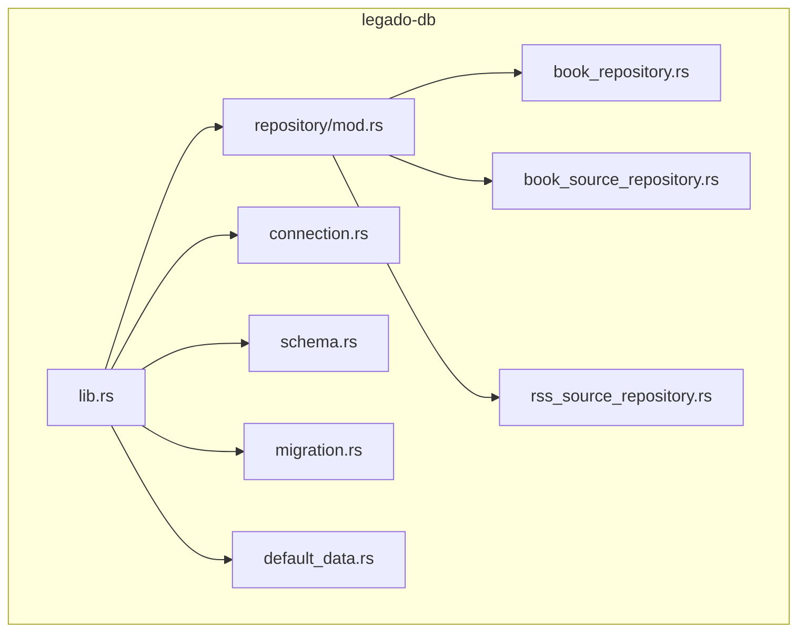
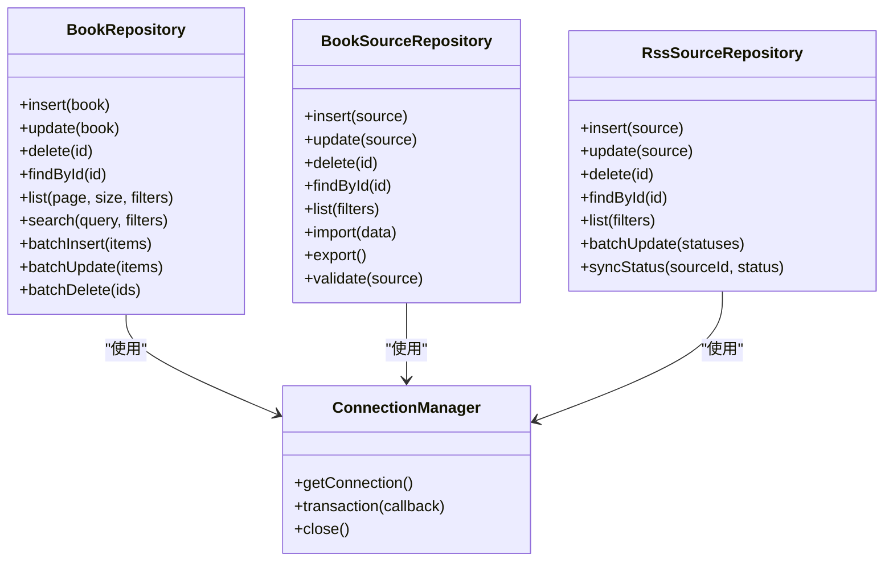
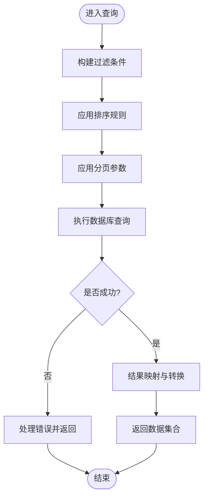
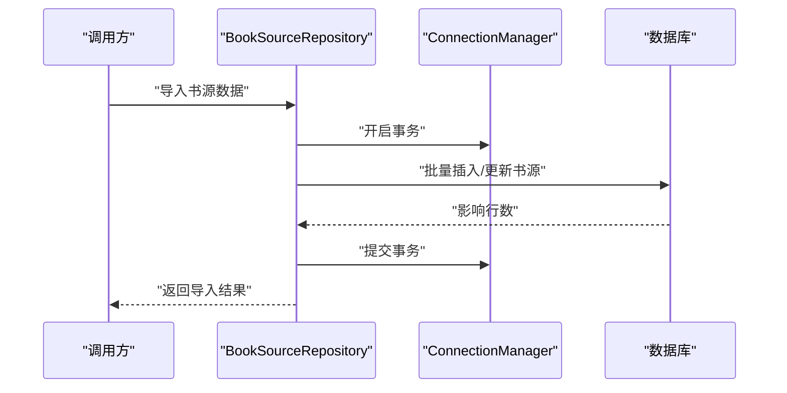
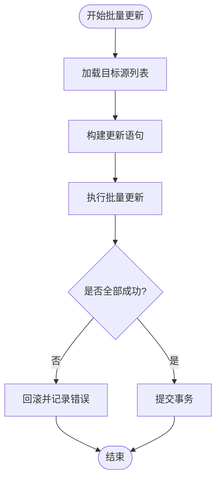
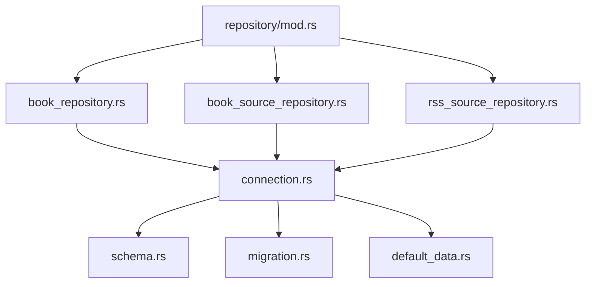

# Repository模式实现

<cite>
**本文档引用的文件**   
- [book_repository.rs](file://rust/legado-db/src/repository/book_repository.rs)
- [book_source_repository.rs](file://rust/legado-db/src/repository/book_source_repository.rs)
- [rss_source_repository.rs](file://rust/legado-db/src/repository/rss_source_repository.rs)
- [mod.rs](file://rust/legado-db/src/repository/mod.rs)
- [connection.rs](file://rust/legado-db/src/connection.rs)
- [lib.rs](file://rust/legado-db/src/lib.rs)
- [schema.rs](file://rust/legado-db/src/schema.rs)
- [migration.rs](file://rust/legado-db/src/migration.rs)
- [default_data.rs](file://rust/legado-db/src/default_data.rs)
</cite>

## 目录
1. [简介](#简介)
2. [项目结构](#项目结构)
3. [核心组件](#核心组件)
4. [架构总览](#架构总览)
5. [详细组件分析](#详细组件分析)
6. [依赖关系分析](#依赖关系分析)
7. [性能考虑](#性能考虑)
8. [故障排查指南](#故障排查指南)
9. [结论](#结论)
10. [附录](#附录)

## 简介
本文件系统化阐述Legado项目中Repository模式的实现与最佳实践，聚焦于数据访问层的抽象设计、职责划分、CRUD封装、查询条件构建、结果映射、异步处理（协程集成、错误处理、超时控制）、批量操作优化，以及事务管理、缓存集成与日志记录。文档面向不同技术背景的读者，提供从概念到代码级实现的渐进式说明，并给出可操作的扩展指南与常见问题排查方法。

## 项目结构
本项目在Rust侧通过模块化仓库组织数据访问逻辑，核心位于legado-db模块的repository子目录。各仓库按领域划分，统一对外暴露接口，内部基于数据库连接与迁移机制进行持久化操作。

图表来源
- [lib.rs](file://rust/legado-db/src/lib.rs)
- [mod.rs](file://rust/legado-db/src/repository/mod.rs)
- [connection.rs](file://rust/legado-db/src/connection.rs)
- [schema.rs](file://rust/legado-db/src/schema.rs)
- [migration.rs](file://rust/legado-db/src/migration.rs)
- [default_data.rs](file://rust/legado-db/src/default_data.rs)

章节来源
- [lib.rs](file://rust/legado-db/src/lib.rs)
- [mod.rs](file://rust/legado-db/src/repository/mod.rs)

## 核心组件
- BookRepository：负责书籍实体的CRUD、分页、搜索、统计等数据访问能力，是阅读书架的核心仓库。
- BookSourceRepository：负责书源配置与元数据的增删改查、导入导出、校验与同步。
- RssSourceRepository：负责RSS源配置与订阅信息的数据访问，支持批量更新与状态维护。
- 仓库模块入口（mod.rs）：集中导出仓库类型与公共工具，便于上层调用。

章节来源
- [book_repository.rs](file://rust/legado-db/src/repository/book_repository.rs)
- [book_source_repository.rs](file://rust/legado-db/src/repository/book_source_repository.rs)
- [rss_source_repository.rs](file://rust/legado-db/src/repository/rss_source_repository.rs)
- [mod.rs](file://rust/legado-db/src/repository/mod.rs)

## 架构总览
Repository层作为数据访问的统一抽象，屏蔽底层数据库细节，向上层服务提供一致的接口。其关键特性包括：
- 统一的CRUD封装：插入、更新、删除、查询均通过仓库方法暴露。
- 查询条件构建：支持动态条件组合、排序、分页。
- 结果映射：将数据库行映射为领域实体或DTO。
- 异步与并发：结合协程与任务调度，避免阻塞主线程。
- 事务与批处理：保证一致性并提升吞吐。
- 错误与超时：统一异常模型与超时策略。
- 日志与监控：结构化日志输出与指标收集。

图表来源
- [book_repository.rs](file://rust/legado-db/src/repository/book_repository.rs)
- [book_source_repository.rs](file://rust/legado-db/src/repository/book_source_repository.rs)
- [rss_source_repository.rs](file://rust/legado-db/src/repository/rss_source_repository.rs)
- [connection.rs](file://rust/legado-db/src/connection.rs)

章节来源
- [connection.rs](file://rust/legado-db/src/connection.rs)
- [schema.rs](file://rust/legado-db/src/schema.rs)
- [migration.rs](file://rust/legado-db/src/migration.rs)

## 详细组件分析

### BookRepository分析
- 职责：书籍实体的全生命周期管理，包含基础CRUD、复杂查询（标题、作者、标签、状态）、分页与统计。
- 设计要点：
  - CRUD封装：所有写入操作返回影响行数或实体ID，读取操作返回实体或集合。
  - 查询条件构建：支持多字段过滤、模糊匹配、范围查询、排序与分页。
  - 结果映射：将数据库列映射为领域对象，必要时进行转换与校验。
  - 异步处理：结合协程执行耗时查询，避免阻塞UI线程。
  - 批处理：批量插入/更新/删除以提升性能。
  - 事务：对复合操作使用事务确保一致性。
  - 错误处理：统一错误码与消息，便于上层捕获与展示。
  - 超时控制：为网络或IO密集型操作设置超时。
  - 日志记录：关键路径打点，便于问题定位。

图表来源
- [book_repository.rs](file://rust/legado-db/src/repository/book_repository.rs)

章节来源
- [book_repository.rs](file://rust/legado-db/src/repository/book_repository.rs)

### BookSourceRepository分析
- 职责：书源的增删改查、导入导出、校验与同步。
- 设计要点：
  - 导入导出：支持JSON/YAML格式，提供序列化与反序列化工具。
  - 校验：对URL、规则表达式等进行合法性检查。
  - 同步：与远程或本地配置中心保持同步。
  - 批处理：批量导入时采用事务与分片策略。
  - 错误处理：区分语法错误、网络错误与权限错误。
  - 日志记录：记录导入/导出过程的关键步骤与异常。

图表来源
- [book_source_repository.rs](file://rust/legado-db/src/repository/book_source_repository.rs)
- [connection.rs](file://rust/legado-db/src/connection.rs)

章节来源
- [book_source_repository.rs](file://rust/legado-db/src/repository/book_source_repository.rs)

### RssSourceRepository分析
- 职责：RSS源配置与订阅信息的数据访问，支持批量更新与状态维护。
- 设计要点：
  - 批量更新：针对订阅状态、抓取频率等字段进行批量修改。
  - 状态同步：与外部抓取器或服务端保持状态一致。
  - 错误处理：区分网络超时、解析失败与数据不一致。
  - 日志记录：记录抓取与状态变更的关键事件。

图表来源
- [rss_source_repository.rs](file://rust/legado-db/src/repository/rss_source_repository.rs)

章节来源
- [rss_source_repository.rs](file://rust/legado-db/src/repository/rss_source_repository.rs)

### 仓库模块入口（mod.rs）
- 职责：集中导出仓库类型与公共工具，简化上层依赖。
- 设计要点：
  - 统一导出：对外暴露仓库接口，隐藏内部实现细节。
  - 依赖注入：支持通过构造函数或容器注入仓库实例。
  - 版本兼容：提供向后兼容的API别名。

章节来源
- [mod.rs](file://rust/legado-db/src/repository/mod.rs)

## 依赖关系分析
仓库层依赖数据库连接管理与Schema定义，同时受迁移机制影响。各仓库之间保持低耦合，通过统一接口交互。

图表来源
- [mod.rs](file://rust/legado-db/src/repository/mod.rs)
- [connection.rs](file://rust/legado-db/src/connection.rs)
- [schema.rs](file://rust/legado-db/src/schema.rs)
- [migration.rs](file://rust/legado-db/src/migration.rs)
- [default_data.rs](file://rust/legado-db/src/default_data.rs)

章节来源
- [mod.rs](file://rust/legado-db/src/repository/mod.rs)
- [connection.rs](file://rust/legado-db/src/connection.rs)

## 性能考虑
- 批量操作：优先使用批量插入/更新/删除，减少往返次数与锁竞争。
- 索引优化：为高频查询字段建立合适索引，避免全表扫描。
- 分页查询：限制单次返回数据量，避免内存溢出。
- 异步处理：将耗时操作放入协程或后台任务，提升响应性。
- 连接池：合理配置连接池大小与超时，避免资源耗尽。
- 缓存策略：对热点数据使用本地缓存或Redis，降低数据库压力。
- 日志级别：生产环境降低日志级别，避免I/O瓶颈。

[本节为通用指导，不直接分析具体文件]

## 故障排查指南
- 常见错误：
  - 连接失败：检查数据库地址、端口、认证信息与防火墙设置。
  - 查询超时：优化SQL与索引，调整超时阈值。
  - 事务冲突：重试机制与死锁检测。
  - 数据不一致：核对Schema与迁移脚本，确保版本一致。
- 调试技巧：
  - 启用详细日志，记录SQL与参数。
  - 使用慢查询分析工具定位瓶颈。
  - 单元测试覆盖边界条件与异常路径。

章节来源
- [connection.rs](file://rust/legado-db/src/connection.rs)
- [migration.rs](file://rust/legado-db/src/migration.rs)

## 结论
Repository模式在Legado项目中提供了清晰的数据访问抽象，提升了代码的可维护性与可扩展性。通过统一的CRUD封装、查询条件构建、结果映射、异步处理、批处理与事务管理，有效支撑了复杂业务场景。建议在实际使用中遵循本文的最佳实践，并结合项目特点进行优化与扩展。

[本节为总结性内容，不直接分析具体文件]

## 附录
- 扩展指南：
  - 新增仓库：参考现有仓库结构，实现CRUD接口，注册到模块入口。
  - 自定义查询：在仓库中封装复杂查询逻辑，提供清晰的API。
  - 缓存集成：在仓库层引入缓存中间件，透明地读写缓存。
  - 日志增强：为关键操作添加结构化日志，便于追踪与分析。
- 示例用法：
  - 书籍查询：使用BookRepository的分页与过滤功能。
  - 书源导入：通过BookSourceRepository的导入接口批量加载配置。
  - RSS同步：调用RssSourceRepository的批量更新方法维护订阅状态。

[本节为补充说明，不直接分析具体文件]