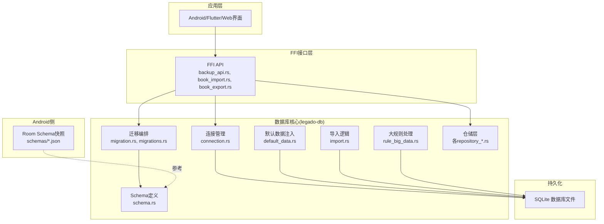
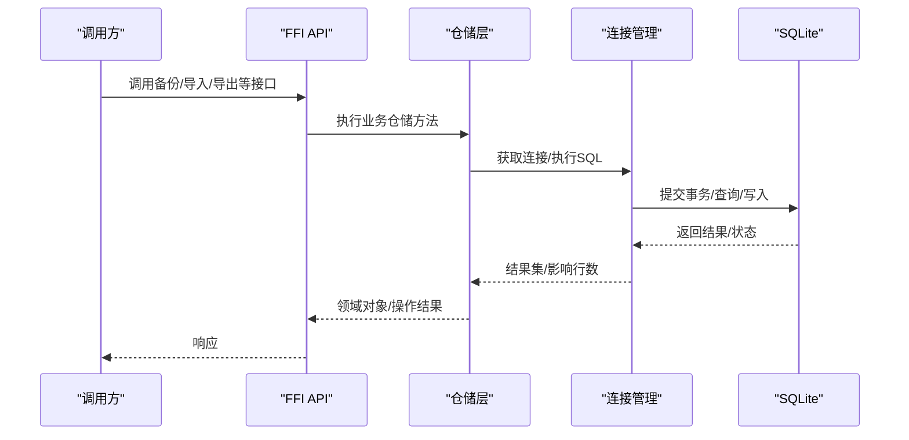
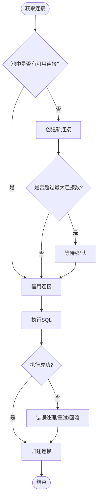
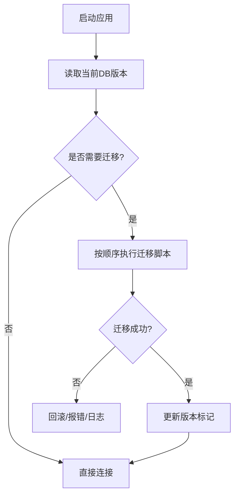
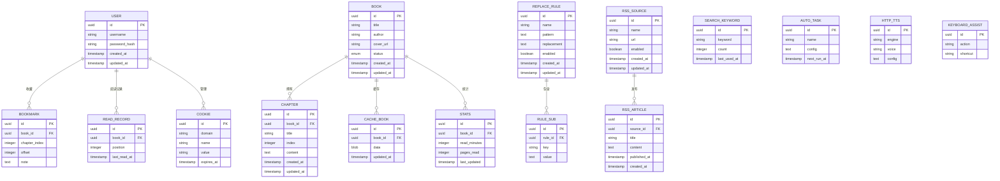
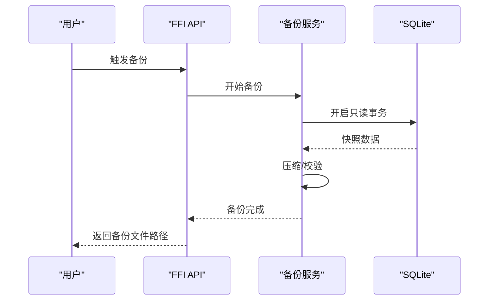
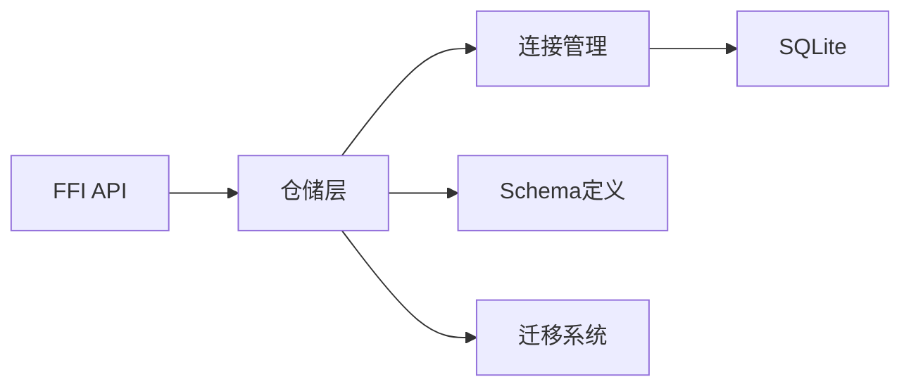

# SQLite数据库

<cite>
**本文档引用的文件**   
- [lib.rs](file://rust/legado-db/src/lib.rs)
- [connection.rs](file://rust/legado-db/src/connection.rs)
- [migration.rs](file://rust/legado-db/src/migration.rs)
- [migrations.rs](file://rust/legado-db/src/migration/migrations.rs)
- [schema.rs](file://rust/legado-db/src/schema.rs)
- [default_data.rs](file://rust/legado-db/src/default_data.rs)
- [import.rs](file://rust/legado-db/src/import.rs)
- [rule_big_data.rs](file://rust/legado-db/src/rule_big_data.rs)
- [book_repository.rs](file://rust/legado-db/src/repository/book_repository.rs)
- [book_chapter_repository.rs](file://rust/legado-db/src/repository/book_chapter_repository.rs)
- [user_repository.rs](file://rust/legado-db/src/repository/user_repository.rs)
- [replace_rule_repository.rs](file://rust/legado-db/src/repository/replace_rule_repository.rs)
- [book_source_repository.rs](file://rust/legado-db/src/repository/book_source_repository.rs)
- [rss_source_repository.rs](file://rust/legado-db/src/repository/rss_source_repository.rs)
- [cache_book_repository.rs](file://rust/legado-db/src/repository/cache_book_repository.rs)
- [read_record_repository.rs](file://rust/legado-db/src/repository/read_record_repository.rs)
- [reading_stats_repository.rs](file://rust/legado-db/src/repository/reading_stats_repository.rs)
- [bookmark_repository.rs](file://rust/legado-db/src/repository/bookmark_repository.rs)
- [cookie_repository.rs](file://rust/legado-db/src/repository/cookie_repository.rs)
- [search_book_repository.rs](file://rust/legado-db/src/repository/search_book_repository.rs)
- [search_keyword_repository.rs](file://legado-db/src/repository/search_keyword_repository.rs)
- [auto_task_repository.rs](file://rust/legado-db/src/repository/auto_task_repository.rs)
- [http_tts_repository.rs](file://rust/legado-db/src/repository/http_tts_repository.rs)
- [keyboard_assist_repository.rs](file://rust/legado-db/src/repository/keyboard_assist_repository.rs)
- [dict_rule_repository.rs](file://rust/legado-db/src/repository/dict_rule_repository.rs)
- [review_repository.rs](file://rust/legado-db/src/repository/review_repository.rs)
- [rss_article_repository.rs](file://rust/legado-db/src/repository/rss_article_repository.rs)
- [rss_star_repository.rs](file://rust/legado-db/src/repository/rss_star_repository.rs)
- [rule_sub_repository.rs](file://rust/legado-db/src/repository/rule_sub_repository.rs)
- [txt_toc_rule_repository.rs](file://rust/legado-db/src/repository/txt_toc_rule_repository.rs)
- [backup_api.rs](file://rust/legado-ffi/src/api/backup_api.rs)
- [book_import.rs](file://rust/legado-ffi/src/api/book_import.rs)
- [book_export.rs](file://rust/legado-ffi/src/api/book_export.rs)
- [1.json](file://app/schemas/io.legado.app.data.AppDatabase/1.json)
- [95.json](file://app/schemas/io.legado.app.data.AppDatabase/95.json)
</cite>

## 目录
1. [简介](#简介)
2. [项目结构](#项目结构)
3. [核心组件](#核心组件)
4. [架构总览](#架构总览)
5. [详细组件分析](#详细组件分析)
6. [依赖关系分析](#依赖关系分析)
7. [性能考虑](#性能考虑)
8. [故障排查指南](#故障排查指南)
9. [结论](#结论)
10. [附录](#附录)

## 简介
本文件面向Legado项目的SQLite数据库实现，系统性阐述连接管理、连接池配置与生命周期、表结构与实体关系、数据迁移策略、索引优化、事务机制、查询最佳实践以及备份恢复与导入导出。文档兼顾技术深度与可读性，帮助开发者快速理解并高效使用数据库子系统。

## 项目结构
数据库相关代码主要位于Rust模块legado-db中，包含连接、迁移、Schema定义、默认数据、导入逻辑与大规则数据处理等；FFI层提供备份、导入、导出等对外能力；Android端通过Room schema快照（schemas目录）保存历史版本结构，便于跨平台一致性校验与升级参考。

图表来源
- [connection.rs](file://rust/legado-db/src/connection.rs)
- [migration.rs](file://rust/legado-db/src/migration.rs)
- [migrations.rs](file://rust/legado-db/src/migration/migrations.rs)
- [schema.rs](file://rust/legado-db/src/schema.rs)
- [default_data.rs](file://rust/legado-db/src/default_data.rs)
- [import.rs](file://rust/legado-db/src/import.rs)
- [rule_big_data.rs](file://rust/legado-db/src/rule_big_data.rs)
- [backup_api.rs](file://rust/legado-ffi/src/api/backup_api.rs)
- [book_import.rs](file://rust/legado-ffi/src/api/book_import.rs)
- [book_export.rs](file://rust/legado-ffi/src/api/book_export.rs)
- [1.json](file://app/schemas/io.legado.app.data.AppDatabase/1.json)
- [95.json](file://app/schemas/io.legado.app.data.AppDatabase/95.json)

章节来源
- [lib.rs](file://rust/legado-db/src/lib.rs)

## 核心组件
- 连接管理：负责SQLite连接创建、复用、超时与错误处理，确保多线程并发访问安全。
- 迁移系统：基于版本号进行增量升级，支持向前兼容与回滚策略。
- Schema与实体：定义书籍、章节、用户、规则、RSS、缓存、阅读记录等核心表结构及约束。
- 仓储层：封装CRUD与复杂查询，向上暴露领域语义接口。
- 默认数据与导入：初始化基础数据，支持批量导入与兼容性处理。
- 大规则处理：针对规则类大数据的存储与检索优化。
- FFI备份/导入/导出：对外提供备份、恢复、书籍导入导出等能力。

章节来源
- [connection.rs](file://rust/legado-db/src/connection.rs)
- [migration.rs](file://rust/legado-db/src/migration.rs)
- [schema.rs](file://rust/legado-db/src/schema.rs)
- [default_data.rs](file://rust/legado-db/src/default_data.rs)
- [import.rs](file://rust/legado-db/src/import.rs)
- [rule_big_data.rs](file://rust/legado-db/src/rule_big_data.rs)
- [backup_api.rs](file://rust/legado-ffi/src/api/backup_api.rs)
- [book_import.rs](file://rust/legado-ffi/src/api/book_import.rs)
- [book_export.rs](file://rust/legado-ffi/src/api/book_export.rs)

## 架构总览
下图展示从FFI到仓储再到SQLite的数据流与职责边界。

图表来源
- [backup_api.rs](file://rust/legado-ffi/src/api/backup_api.rs)
- [book_import.rs](file://rust/legado-ffi/src/api/book_import.rs)
- [book_export.rs](file://rust/legado-ffi/src/api/book_export.rs)
- [connection.rs](file://rust/legado-db/src/connection.rs)
- [book_repository.rs](file://rust/legado-db/src/repository/book_repository.rs)
- [book_chapter_repository.rs](file://rust/legado-db/src/repository/book_chapter_repository.rs)
- [user_repository.rs](file://rust/legado-db/src/repository/user_repository.rs)
- [replace_rule_repository.rs](file://rust/legado-db/src/repository/replace_rule_repository.rs)

## 详细组件分析

### 连接管理与连接池
- 连接创建：集中式工厂或单例模式管理连接句柄，避免重复打开导致资源泄漏。
- 连接池：通过线程安全的队列或通道分发连接，限制最大并发数，防止锁竞争。
- 生命周期：按请求分配、使用后归还；异常路径确保释放；空闲连接定期清理。
- 并发控制：读写分离或统一写锁，保证SQLite单写特性不被破坏。
- 错误处理：网络/IO错误重试、超时熔断、降级策略。

章节来源
- [connection.rs](file://rust/legado-db/src/connection.rs)

### 迁移系统与版本管理
- 版本演进：每个迁移对应一个版本号，按序执行，确保向后兼容。
- 增量升级：仅变更差异部分，避免全量重建。
- 兼容性：对旧数据结构提供转换脚本，保证读取兼容。
- 回滚策略：关键迁移可设计反向脚本，失败时回滚至上一版本。
- 校验：迁移前后执行完整性检查，如计数校验、外键约束校验。

章节来源
- [migration.rs](file://rust/legado-db/src/migration.rs)
- [migrations.rs](file://rust/legado-db/src/migration/migrations.rs)

### 表结构与实体关系
核心实体包括书籍、章节、用户、规则（替换规则、字典规则、子规则等）、RSS源与文章、缓存、阅读记录、书签、Cookie、搜索关键词、自动任务、HTTP TTS、键盘辅助、统计等。典型关系如下：

章节来源
- [schema.rs](file://rust/legado-db/src/schema.rs)
- [book_repository.rs](file://rust/legado-db/src/repository/book_repository.rs)
- [book_chapter_repository.rs](file://rust/legado-db/src/repository/book_chapter_repository.rs)
- [user_repository.rs](file://rust/legado-db/src/repository/user_repository.rs)
- [replace_rule_repository.rs](file://rust/legado-db/src/repository/replace_rule_repository.rs)
- [book_source_repository.rs](file://rust/legado-db/src/repository/book_source_repository.rs)
- [rss_source_repository.rs](file://rust/legado-db/src/repository/rss_source_repository.rs)
- [cache_book_repository.rs](file://rust/legado-db/src/repository/cache_book_repository.rs)
- [read_record_repository.rs](file://rust/legado-db/src/repository/read_record_repository.rs)
- [reading_stats_repository.rs](file://rust/legado-db/src/repository/reading_stats_repository.rs)
- [bookmark_repository.rs](file://rust/legado-db/src/repository/bookmark_repository.rs)
- [cookie_repository.rs](file://rust/legado-db/src/repository/cookie_repository.rs)
- [search_book_repository.rs](file://rust/legado-db/src/repository/search_book_repository.rs)
- [search_keyword_repository.rs](file://legado-db/src/repository/search_keyword_repository.rs)
- [auto_task_repository.rs](file://rust/legado-db/src/repository/auto_task_repository.rs)
- [http_tts_repository.rs](file://rust/legado-db/src/repository/http_tts_repository.rs)
- [keyboard_assist_repository.rs](file://rust/legado-db/src/repository/keyboard_assist_repository.rs)
- [dict_rule_repository.rs](file://rust/legado-db/src/repository/dict_rule_repository.rs)
- [review_repository.rs](file://rust/legado-db/src/repository/review_repository.rs)
- [rss_article_repository.rs](file://rust/legado-db/src/repository/rss_article_repository.rs)
- [rss_star_repository.rs](file://rust/legado-db/src/repository/rss_star_repository.rs)
- [rule_sub_repository.rs](file://rust/legado-db/src/repository/rule_sub_repository.rs)
- [txt_toc_rule_repository.rs](file://rust/legado-db/src/repository/txt_toc_rule_repository.rs)

### 数据迁移策略
- 版本管理：以数字递增的版本号驱动迁移，确保幂等与可重入。
- 增量升级：只变更必要字段与索引，减少停机时间。
- 数据兼容：新增字段设置默认值，删除字段保留过渡期。
- 回滚与校验：失败即回滚，迁移后执行完整性校验。
- 测试覆盖：迁移用例覆盖正向与反向路径。

章节来源
- [migration.rs](file://rust/legado-db/src/migration.rs)
- [migrations.rs](file://rust/legado-db/src/migration/migrations.rs)

### 索引优化策略
- 复合索引：为高频查询条件组合建立复合索引，提升过滤与排序性能。
- 全文搜索：对内容字段启用FTS（如适用），加速文本检索。
- 唯一索引：对业务唯一键（如用户名、域名+名称）加唯一约束，避免重复。
- 覆盖索引：尽量让查询命中索引列，减少回表。
- 定期分析：使用EXPLAIN/ANALYZE评估执行计划，持续优化。

章节来源
- [schema.rs](file://rust/legado-db/src/schema.rs)
- [rule_big_data.rs](file://rust/legado-db/src/rule_big_data.rs)

### 事务管理机制
- 隔离级别：默认读已提交，必要时使用串行化保证强一致。
- 并发控制：写操作串行化，读多写少场景下合理拆分事务粒度。
- 死锁预防：固定加锁顺序，缩短事务时长，避免嵌套长事务。
- 回滚策略：异常路径自动回滚，确保数据一致性。

章节来源
- [connection.rs](file://rust/legado-db/src/connection.rs)

### 备份、恢复与导入导出
- 备份：全量或增量备份，支持压缩与校验。
- 恢复：校验备份完整性后恢复，支持断点续传。
- 导入：批量导入书籍、规则、RSS等，支持冲突解决与去重。
- 导出：按条件导出结构化数据，便于迁移与分析。

章节来源
- [backup_api.rs](file://rust/legado-ffi/src/api/backup_api.rs)
- [import.rs](file://rust/legado-db/src/import.rs)
- [book_import.rs](file://rust/legado-ffi/src/api/book_import.rs)
- [book_export.rs](file://rust/legado-ffi/src/api/book_export.rs)

### 默认数据与初始化
- 初始数据：预置主题、规则模板、RSS订阅示例等。
- 幂等插入：使用UPSERT或存在性检查避免重复。
- 版本兼容：根据目标版本动态选择默认数据。

章节来源
- [default_data.rs](file://rust/legado-db/src/default_data.rs)

## 依赖关系分析
仓储层依赖连接与Schema，FFI层依赖仓储与迁移，整体耦合清晰，职责单一。

图表来源
- [lib.rs](file://rust/legado-db/src/lib.rs)
- [connection.rs](file://rust/legado-db/src/connection.rs)
- [schema.rs](file://rust/legado-db/src/schema.rs)
- [migration.rs](file://rust/legado-db/src/migration.rs)

章节来源
- [lib.rs](file://rust/legado-db/src/lib.rs)

## 性能考虑
- 连接池大小：根据设备CPU核数与IO吞吐调优，避免过多连接导致上下文切换。
- 事务批量化：合并写入，减少磁盘同步次数。
- 索引选择性：优先为高区分度列建索引，避免过度索引。
- 分页与限流：大结果集分页返回，限制单次查询规模。
- 异步IO：非阻塞读取，避免主线程卡顿。
- 监控与诊断：采集慢查询、锁等待、命中率等指标。

[本节为通用指导，不直接分析具体文件]

## 故障排查指南
- 连接失败：检查权限、路径、磁盘空间、锁文件残留。
- 迁移失败：查看迁移日志，确认版本一致性与脚本幂等性。
- 查询缓慢：使用EXPLAIN分析执行计划，补充或调整索引。
- 死锁：定位长事务与加锁顺序，拆分事务或调整顺序。
- 备份损坏：校验校验和，重新生成备份。

章节来源
- [connection.rs](file://rust/legado-db/src/connection.rs)
- [migration.rs](file://rust/legado-db/src/migration.rs)
- [backup_api.rs](file://rust/legado-ffi/src/api/backup_api.rs)

## 结论
Legado的SQLite数据库子系统通过清晰的连接管理、稳健的迁移体系、完善的Schema与仓储抽象，以及完备的备份导入导出能力，提供了高性能、可扩展且易维护的数据层。建议在生产环境结合监控与压测持续优化索引与事务策略，确保稳定性与性能。

[本节为总结，不直接分析具体文件]

## 附录
- Android端Room Schema快照用于跨平台一致性参考，便于对比与验证结构演进。
- 建议在CI中加入迁移与Schema一致性校验，防止漂移。

章节来源
- [1.json](file://app/schemas/io.legado.app.data.AppDatabase/1.json)
- [95.json](file://app/schemas/io.legado.app.data.AppDatabase/95.json)