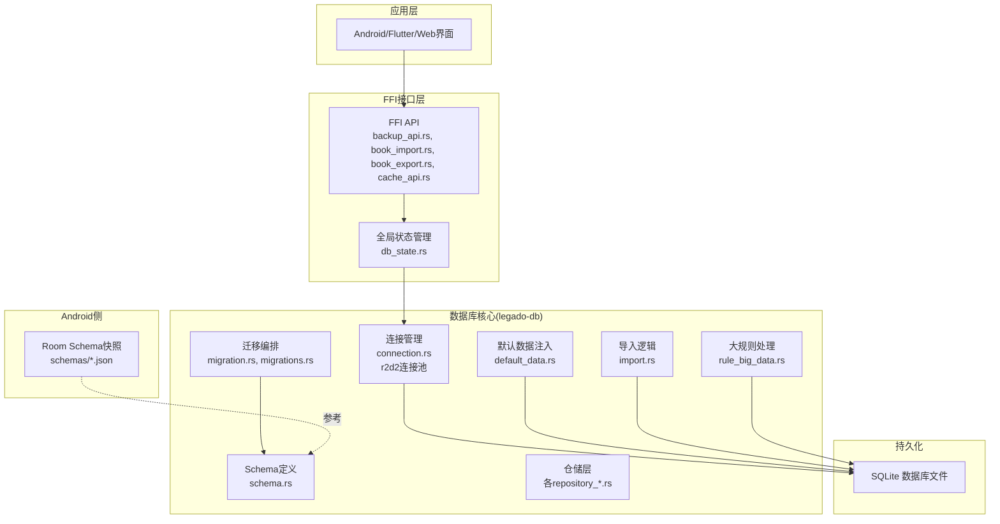
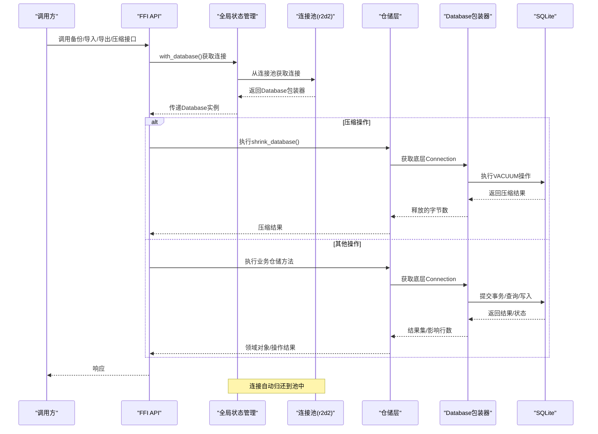
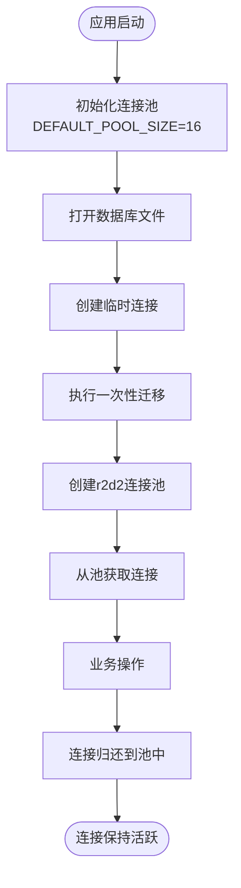
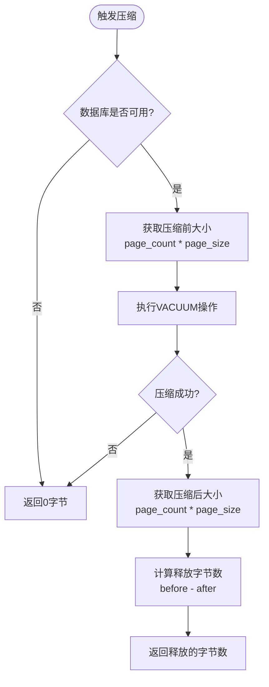
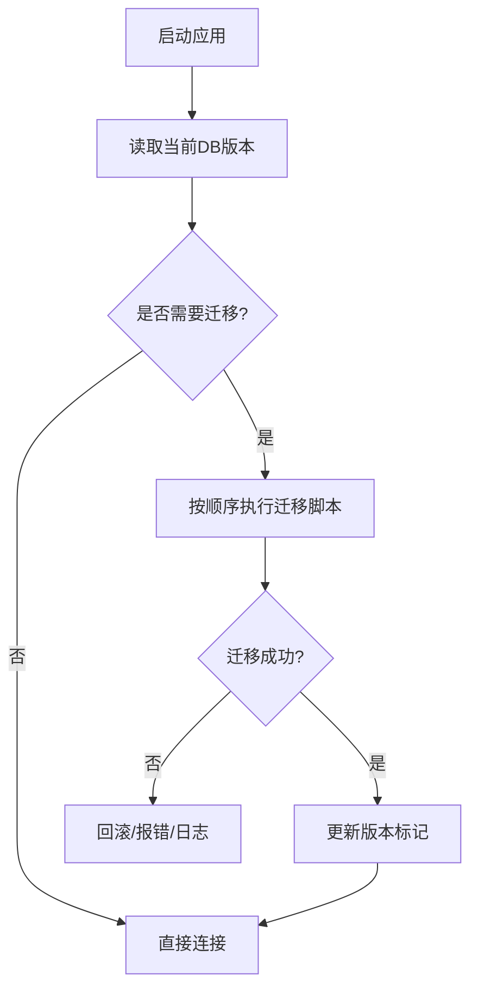
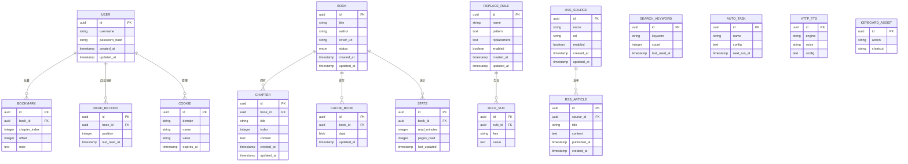
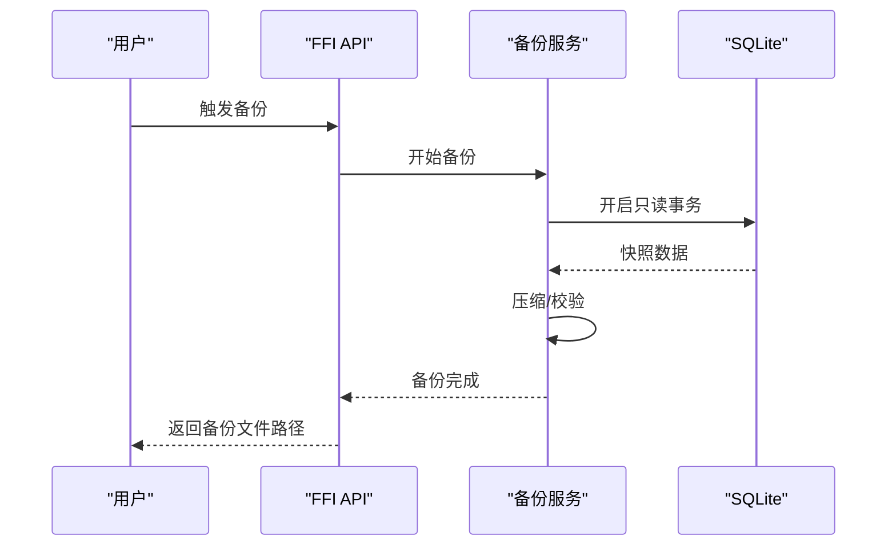
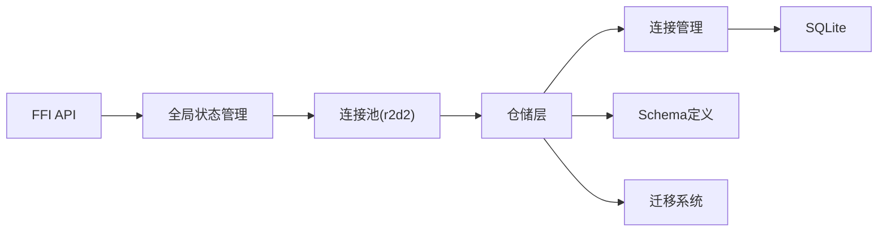

# SQLite数据库

<cite>
**本文档引用的文件**   
- [lib.rs](file://rust/legado-db/src/lib.rs)
- [connection.rs](file://rust/legado-db/src/connection.rs)
- [db_state.rs](file://rust/legado-ffi/src/db_state.rs)
- [backup_api.rs](file://rust/legado-ffi/src/api/backup_api.rs)
- [book_repository.rs](file://rust/legado-db/src/repository/book_repository.rs)
- [migration.rs](file://rust/legado-db/src/migration.rs)
- [migrations.rs](file://rust/legado-db/src/migration/migrations.rs)
- [schema.rs](file://rust/legado-db/src/schema.rs)
- [default_data.rs](file://rust/legado-db/src/default_data.rs)
- [import.rs](file://rust/legado-db/src/import.rs)
- [rule_big_data.rs](file://rust/legado-db/src/rule_big_data.rs)
- [cache_api.rs](file://rust/legado-ffi/src/api/cache_api.rs)
- [ffi.rs](file://rust/legado-ffi/src/ffi.rs)
</cite>

## 更新摘要
**变更内容**   
- 新增数据库压缩功能，通过SQLite VACUUM操作压缩数据库文件
- 实现了智能的字节释放计算，通过VACUUM前后逻辑大小对比
- 添加了非阻塞的错误处理机制，失败时返回零值而不影响业务逻辑
- 提供了FFI接口供上层应用调用数据库压缩功能
- 增强了UI交互，支持用户手动触发数据库压缩操作

## 目录
1. [简介](#简介)
2. [项目结构](#项目结构)
3. [核心组件](#核心组件)
4. [架构总览](#架构总览)
5. [详细组件分析](#详细组件分析)
6. [依赖关系分析](#依赖关系分析)
7. [性能考虑](#性能考虑)
8. [故障排查指南](#故障排查指南)
9. [结论](#结论)
10. [附录](#附录)

## 简介
本文件面向Legado项目的SQLite数据库实现，系统性阐述连接管理、连接池配置与生命周期、表结构与实体关系、数据迁移策略、索引优化、事务机制、查询最佳实践以及备份恢复与导入导出。文档兼顾技术深度与可读性，帮助开发者快速理解并高效使用数据库子系统。

**更新** 本次更新重点介绍了全新的连接管理架构，基于r2d2连接池实现了线程安全的并发访问和资源自动管理，并新增了数据库压缩功能以提升存储效率。

## 项目结构
数据库相关代码主要位于Rust模块legado-db中，包含连接、迁移、Schema定义、默认数据、导入逻辑与大规则数据处理等；FFI层提供备份、导入、导出、数据库压缩等对外能力；Android端通过Room schema快照（schemas目录）保存历史版本结构，便于跨平台一致性校验与升级参考。



**图表来源**
- [connection.rs](file://rust/legado-db/src/connection.rs)
- [db_state.rs](file://rust/legado-ffi/src/db_state.rs)
- [backup_api.rs](file://rust/legado-ffi/src/api/backup_api.rs)
- [cache_api.rs](file://rust/legado-ffi/src/api/cache_api.rs)
- [migration.rs](file://rust/legado-db/src/migration.rs)
- [migrations.rs](file://rust/legado-db/src/migration/migrations.rs)
- [schema.rs](file://rust/legado-db/src/schema.rs)
- [default_data.rs](file://rust/legado-db/src/default_data.rs)
- [import.rs](file://rust/legado-db/src/import.rs)
- [rule_big_data.rs](file://rust/legado-db/src/rule_big_data.rs)

章节来源
- [lib.rs](file://rust/legado-db/src/lib.rs)

## 核心组件
- **连接管理**：基于r2d2连接池的专业连接管理，支持多线程并发访问、自动资源回收和PRAGMA自动配置。
- **全局状态管理**：FFI层的全局连接池管理，确保单例模式和线程安全。
- **迁移系统**：基于版本号进行增量升级，支持向前兼容与回滚策略。
- **Schema与实体**：定义书籍、章节、用户、规则、RSS、缓存、阅读记录等核心表结构及约束。
- **仓储层**：封装CRUD与复杂查询，向上暴露领域语义接口。
- **默认数据与导入**：初始化基础数据，支持批量导入与兼容性处理。
- **大规则处理**：针对规则类大数据的存储与检索优化。
- **FFI备份/导入/导出**：对外提供备份、恢复、书籍导入导出等能力。
- **数据库压缩**：通过SQLite VACUUM操作压缩数据库文件，释放未使用的空间。

**更新** 连接管理组件现已完全重构，采用专业的连接池模式替代了原有的简单连接管理，并新增了数据库压缩功能。

章节来源
- [connection.rs](file://rust/legado-db/src/connection.rs)
- [db_state.rs](file://rust/legado-ffi/src/db_state.rs)
- [migration.rs](file://rust/legado-db/src/migration.rs)
- [schema.rs](file://rust/legado-db/src/schema.rs)
- [default_data.rs](file://rust/legado-db/src/default_data.rs)
- [import.rs](file://rust/legado-db/src/import.rs)
- [rule_big_data.rs](file://rust/legado-db/src/rule_big_data.rs)
- [backup_api.rs](file://rust/legado-ffi/src/api/backup_api.rs)
- [cache_api.rs](file://rust/legado-ffi/src/api/cache_api.rs)

## 架构总览
下图展示从FFI到仓储再到SQLite的数据流与职责边界，突出了新的连接池架构和数据库压缩功能。



**图表来源**
- [backup_api.rs](file://rust/legado-ffi/src/api/backup_api.rs)
- [cache_api.rs](file://rust/legado-ffi/src/api/cache_api.rs)
- [db_state.rs](file://rust/legado-ffi/src/db_state.rs)
- [connection.rs](file://rust/legado-db/src/connection.rs)
- [book_repository.rs](file://rust/legado-db/src/repository/book_repository.rs)

## 详细组件分析

### 连接管理与连接池架构

**重大更新** connection.rs已完全重构，引入了基于r2d2的专业连接池管理系统。

#### 核心设计特点
- **连接池管理**：使用r2d2库实现高性能连接池，支持最大16个并发连接
- **自动PRAGMA配置**：每个连接创建时自动设置WAL模式、外键约束、同步策略等
- **线程安全**：支持多线程并发访问，每个请求获得独立的连接包装器
- **资源自动管理**：RAII模式确保连接正确释放，防止资源泄漏
- **智能超时控制**：连接超时10秒，忙等待5秒，避免SQLITE_BUSY错误

#### 连接生命周期管理


**图表来源**
- [connection.rs:62-77](file://rust/legado-db/src/connection.rs#L62-L77)
- [connection.rs:142-159](file://rust/legado-db/src/connection.rs#L142-L159)

#### PRAGMA自动配置机制
每个连接在获取时自动执行以下PRAGMA设置：
- `journal_mode = WAL`：启用写前日志，支持并发读写
- `foreign_keys = ON`：启用外键约束保证数据完整性
- `synchronous = NORMAL`：平衡性能与数据安全
- `busy_timeout = 5000`：忙等待5秒，避免锁冲突

**章节来源**
- [connection.rs:34-42](file://rust/legado-db/src/connection.rs#L34-L42)
- [connection.rs:223-233](file://rust/legado-db/src/connection.rs#L223-L233)

### 全局连接池状态管理

**新增** db_state.rs提供了FFI层的全局连接池管理。

#### 设计模式
- **单例模式**：使用OnceLock确保全局唯一连接池实例
- **线程安全**：Send + Sync特性支持多线程并发访问
- **懒加载**：仅在首次使用时初始化连接池
- **资源隔离**：每个API调用获得独立的Database包装器

#### 使用模式
```rust
// 初始化全局连接池
let db = Database::open("path/to/db.sqlite")?;
init_database(db)?;

// 在任意位置安全访问数据库
with_database(|db| {
    let conn = db.connection();
    // 执行数据库操作
    Ok(result)
}) // 连接自动归还到池中
```

**章节来源**
- [db_state.rs:26-35](file://rust/legado-ffi/src/db_state.rs#L26-L35)
- [db_state.rs:46-55](file://rust/legado-ffi/src/db_state.rs#L46-L55)

### 内存数据库与文件数据库差异化处理

**更新** 连接管理现在区分处理内存数据库和文件数据库的不同需求。

#### 内存数据库优化
- **固定池大小**：内存数据库池大小固定为1，避免重复创建空数据库
- **禁用回收器**：禁用idle_timeout和max_lifetime，防止唯一连接被回收
- **数据持久化**：在整个进程生命周期内保持数据

#### 文件数据库优化
- **可配置池大小**：默认16个连接，可根据设备性能调整
- **连接复用**：支持连接池中的连接复用
- **磁盘持久化**：数据持久化到文件系统

**章节来源**
- [connection.rs:82-93](file://rust/legado-db/src/connection.rs#L82-L93)
- [connection.rs:142-159](file://rust/legado-db/src/connection.rs#L142-L159)

### 并发访问测试验证

**新增** connection.rs包含了完整的并发访问测试用例。

#### 多线程并发测试
- **8线程并发**：模拟真实的多线程应用场景
- **读写混合**：同时进行插入和查询操作
- **数据一致性**：验证所有写入操作的正确性
- **资源清理**：测试后自动清理临时文件和数据库

**章节来源**
- [connection.rs:324-381](file://rust/legado-db/src/connection.rs#L324-L381)

### 数据库压缩功能

**新增** 数据库压缩功能通过SQLite VACUUM操作有效减少数据库文件大小。

#### 核心实现原理
- **VACUUM操作**：执行SQLite内置的VACUUM命令重新构建数据库文件
- **空间计算**：通过VACUUM前后的`PRAGMA page_count * page_size`对比计算释放的字节数
- **错误降级**：失败时返回0而不是抛出异常，确保业务逻辑不受影响
- **非阻塞设计**：在工作线程中执行，不阻塞主业务流程

#### 压缩流程


**图表来源**
- [cache_api.rs:151-165](file://rust/legado-ffi/src/api/cache_api.rs#L151-L165)
- [cache_api.rs:167-176](file://rust/legado-ffi/src/api/cache_api.rs#L167-L176)

#### FFI接口暴露
- **cache_shrink_database()**：FFI层接口，供Flutter/Dart调用
- **返回值**：释放的字节数，失败时返回0
- **错误处理**：内部捕获所有异常，确保调用方不会收到错误

#### 测试验证
- **垃圾数据构造**：创建大量缓存数据然后删除，制造可回收空间
- **首次压缩验证**：确保首次压缩能释放正数字节
- **幂等性测试**：重复执行不会产生错误，第二次释放量应小于首次

**章节来源**
- [cache_api.rs:145-176](file://rust/legado-ffi/src/api/cache_api.rs#L145-L176)
- [cache_api.rs:279-311](file://rust/legado-ffi/src/api/cache_api.rs#L279-L311)
- [ffi.rs:1164-1169](file://rust/legado-ffi/src/ffi.rs#L1164-L1169)

### 迁移系统与版本管理
- 版本演进：每个迁移对应一个版本号，按序执行，确保向后兼容。
- 增量升级：仅变更差异部分，避免全量重建。
- 兼容性：对旧数据结构提供转换脚本，保证读取兼容。
- 回滚策略：关键迁移可设计反向脚本，失败时回滚至上一版本。
- 校验：迁移前后执行完整性检查，如计数校验、外键约束校验。



**章节来源**
- [migration.rs](file://rust/legado-db/src/migration.rs)
- [migrations.rs](file://rust/legado-db/src/migration/migrations.rs)

### 表结构与实体关系
核心实体包括书籍、章节、用户、规则（替换规则、字典规则、子规则等）、RSS源与文章、缓存、阅读记录、书签、Cookie、搜索关键词、自动任务、HTTP TTS、键盘辅助、统计等。典型关系如下：



**章节来源**
- [schema.rs](file://rust/legado-db/src/schema.rs)
- [book_repository.rs](file://rust/legado-db/src/repository/book_repository.rs)

### 数据迁移策略
- 版本管理：以数字递增的版本号驱动迁移，确保幂等与可重入。
- 增量升级：只变更必要字段与索引，减少停机时间。
- 数据兼容：新增字段设置默认值，删除字段保留过渡期。
- 回滚与校验：失败即回滚，迁移后执行完整性校验。
- 测试覆盖：迁移用例覆盖正向与反向路径。

**章节来源**
- [migration.rs](file://rust/legado-db/src/migration.rs)
- [migrations.rs](file://rust/legado-db/src/migration/migrations.rs)

### 索引优化策略
- 复合索引：为高频查询条件组合建立复合索引，提升过滤与排序性能。
- 全文搜索：对内容字段启用FTS（如适用），加速文本检索。
- 唯一索引：对业务唯一键（如用户名、域名+名称）加唯一约束，避免重复。
- 覆盖索引：尽量让查询命中索引列，减少回表。
- 定期分析：使用EXPLAIN/ANALYZE评估执行计划，持续优化。

**章节来源**
- [schema.rs](file://rust/legado-db/src/schema.rs)
- [rule_big_data.rs](file://rust/legado-db/src/rule_big_data.rs)

### 事务管理机制
- 隔离级别：默认读已提交，必要时使用串行化保证强一致。
- 并发控制：写操作串行化，读多写少场景下合理拆分事务粒度。
- 死锁预防：固定加锁顺序，缩短事务时长，避免嵌套长事务。
- 回滚策略：异常路径自动回滚，确保数据一致性。

**章节来源**
- [connection.rs](file://rust/legado-db/src/connection.rs)

### 备份、恢复与导入导出
- 备份：全量或增量备份，支持压缩与校验。
- 恢复：校验备份完整性后恢复，支持断点续传。
- 导入：批量导入书籍、规则、RSS等，支持冲突解决与去重。
- 导出：按条件导出结构化数据，便于迁移与分析。



**章节来源**
- [backup_api.rs](file://rust/legado-ffi/src/api/backup_api.rs)
- [import.rs](file://rust/legado-db/src/import.rs)

### 默认数据与初始化
- 初始数据：预置主题、规则模板、RSS订阅示例等。
- 幂等插入：使用UPSERT或存在性检查避免重复。
- 版本兼容：根据目标版本动态选择默认数据。

**章节来源**
- [default_data.rs](file://rust/legado-db/src/default_data.rs)

## 依赖关系分析
仓储层依赖连接与Schema，FFI层依赖仓储与迁移，整体耦合清晰，职责单一。新的连接池架构进一步解耦了连接管理与业务逻辑。



**图表来源**
- [lib.rs](file://rust/legado-db/src/lib.rs)
- [connection.rs](file://rust/legado-db/src/connection.rs)
- [db_state.rs](file://rust/legado-ffi/src/db_state.rs)
- [schema.rs](file://rust/legado-db/src/schema.rs)
- [migration.rs](file://rust/legado-db/src/migration.rs)

章节来源
- [lib.rs](file://rust/legado-db/src/lib.rs)

## 性能考虑

**重大更新** 新的连接池架构带来了显著的性能提升和优化机会，数据库压缩功能进一步优化了存储空间。

### 连接池性能优化
- **池大小调优**：默认16个连接，可根据设备CPU核数和IO吞吐能力调整
- **连接复用**：避免频繁创建销毁连接的开销
- **异步IO**：非阻塞连接获取，避免主线程卡顿
- **内存管理**：连接池内部使用Arc共享，clone开销极低

### 事务批量化优化
- **合并写入**：多个写入操作合并到单个事务中
- **减少同步**：降低磁盘同步次数，提升写入性能
- **批量操作**：使用INSERT OR REPLACE等批量操作

### 数据库压缩优化
- **智能时机**：建议在大量删除操作后执行压缩
- **非阻塞执行**：在工作线程中执行，不影响主流程
- **错误降级**：失败时返回0，确保业务连续性
- **空间监控**：通过压缩前后对比监控空间使用情况

### 监控与诊断
- **慢查询监控**：采集执行时间超过阈值的查询
- **连接池监控**：监控连接使用率、等待时间、错误率
- **性能指标**：QPS、延迟分布、吞吐量等关键指标

[本节为通用指导，不直接分析具体文件]

## 故障排查指南

**更新** 新增了连接池问题和数据库压缩相关的故障排查指南。

### 连接池问题排查
- **连接耗尽**：检查是否有未正确释放的连接，监控连接池使用率
- **连接超时**：调整connection_timeout参数，检查网络状况
- **内存泄漏**：确认Database包装器是否正确drop，连接是否归还到池中
- **并发冲突**：检查事务粒度和锁竞争情况

### 数据库压缩问题排查
- **压缩失败**：检查数据库文件权限、磁盘空间、锁状态
- **无空间释放**：确认是否有足够的删除操作产生可回收空间
- **性能影响**：压缩操作可能暂时影响数据库性能，建议错峰执行
- **数据完整性**：压缩后验证关键数据的一致性

### 常规问题排查
- **连接失败**：检查权限、路径、磁盘空间、锁文件残留。
- **迁移失败**：查看迁移日志，确认版本一致性与脚本幂等性。
- **查询缓慢**：使用EXPLAIN分析执行计划，补充或调整索引。
- **死锁**：定位长事务与加锁顺序，拆分事务或调整顺序。
- **备份损坏**：校验校验和，重新生成备份。

**章节来源**
- [connection.rs](file://rust/legado-db/src/connection.rs)
- [db_state.rs](file://rust/legado-ffi/src/db_state.rs)
- [cache_api.rs](file://rust/legado-ffi/src/api/cache_api.rs)
- [migration.rs](file://rust/legado-db/src/migration.rs)
- [backup_api.rs](file://rust/legado-ffi/src/api/backup_api.rs)

## 结论
Legado的SQLite数据库子系统经过重大重构，通过引入专业的r2d2连接池、完善的全局状态管理、自动化的PRAGMA配置、健壮的并发访问控制以及新增的数据库压缩功能，提供了高性能、线程安全且易于维护的数据层。新的架构不仅解决了原有的资源管理问题，还为未来的扩展奠定了坚实基础。建议在生产环境结合监控与压测持续优化连接池大小和事务策略，确保稳定性与性能。

**更新** 新的连接池架构显著提升了系统的并发性能和资源利用率，新增的数据库压缩功能有效减少了存储空间占用，为大规模数据操作提供了可靠的基础设施。

## 附录
- Android端Room Schema快照用于跨平台一致性参考，便于对比与验证结构演进。
- 建议在CI中加入迁移与Schema一致性校验，防止漂移。
- 连接池配置应根据实际部署环境和负载情况进行调优。
- 数据库压缩功能可通过UI界面手动触发，或通过API程序化调用。

**章节来源**
- [connection.rs](file://rust/legado-db/src/connection.rs)
- [db_state.rs](file://rust/legado-ffi/src/db_state.rs)
- [cache_api.rs](file://rust/legado-ffi/src/api/cache_api.rs)
- [ffi.rs](file://rust/legado-ffi/src/ffi.rs)