# 数据同步机制

<cite>
**本文引用的文件**   
- [README.md](file://README.md)
- [app/src/main/java/io/legado/app/App.kt](file://app/src/main/java/io/legado/app/App.kt)
- [modules/web/public/scripts/sync.js](file://modules/web/public/scripts/sync.js)
- [rust/legado-core/src/lib.rs](file://rust/legado-core/src/lib.rs)
- [rust/legado-core/src/download_manager.rs](file://rust/legado-core/src/download_manager.rs)
- [rust/legado-core/src/auto_task.rs](file://rust/legado-core/src/auto_task.rs)
- [rust/legado-core/src/cron.rs](file://rust/legado-core/src/cron.rs)
- [rust/legado-db/src/lib.rs](file://rust/legado-db/src/lib.rs)
- [rust/legado-db/src/migration.rs](file://rust/legado-db/src/migration.rs)
- [rust/legado-net/src/client.rs](file://rust/legado-net/src/client.rs)
- [rust/legado-net/src/retry.rs](file://rust/legado-net/src/retry.rs)
- [rust/legado-server/src/server.rs](file://rust/legado-server/src/server.rs)
- [rust/legado-server/src/routes.rs](file://rust/legado-server/src/routes.rs)
- [rust/legado-ffi/src/bridge.rs](file://rust/legado-ffi/src/bridge.rs)
- [flutter_legado/pubspec.yaml](file://flutter_legado/pubspec.yaml)
</cite>

## 目录
1. [简介](#简介)
2. [项目结构](#项目结构)
3. [核心组件](#核心组件)
4. [架构总览](#架构总览)
5. [详细组件分析](#详细组件分析)
6. [依赖关系分析](#依赖关系分析)
7. [性能考虑](#性能考虑)
8. [故障排查指南](#故障排查指南)
9. [结论](#结论)
10. [附录](#附录)

## 简介
本文件围绕 Legado 项目的“数据同步机制”进行系统化说明，覆盖协议设计（增量、全量、双向）、冲突检测（时间戳、版本号、内容哈希）、一致性保证（事务性、回滚、最终一致性）、任务调度（定时、事件触发、优先级）、状态管理（进度、断点续传、错误恢复）、性能优化（压缩、批量、并行）以及安全（加密、认证、访问控制）。文档基于仓库中的 Rust 核心库、网络层、服务器端、FFI 桥接与 Web 脚本等实现进行归纳与可视化。

## 项目结构
Legado 采用多语言混合架构：Android/Kotlin 应用层、Rust 核心与基础设施、Flutter 跨平台前端、Web 工具脚本与 Rust Server。数据同步的关键路径贯穿 FFI 桥接、网络客户端、下载管理器、数据库迁移与持久化、以及 Web 侧的同步脚本。

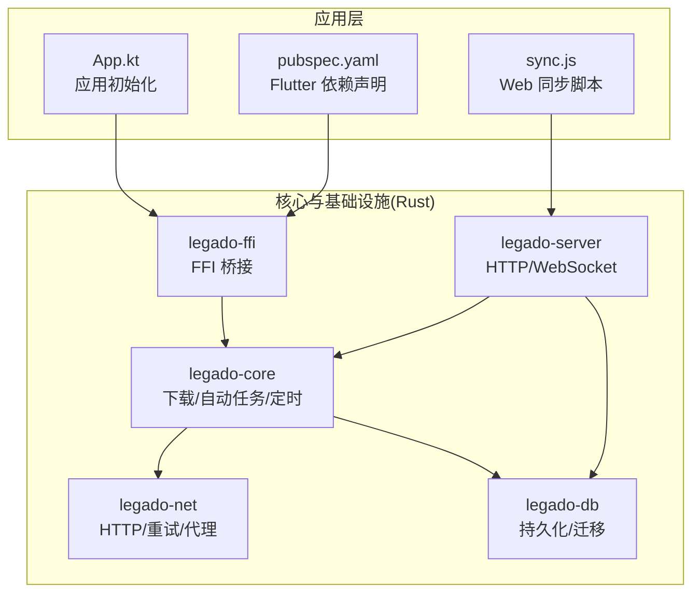

**图示来源** 
- [app/src/main/java/io/legado/app/App.kt](file://app/src/main/java/io/legado/app/App.kt)
- [modules/web/public/scripts/sync.js](file://modules/web/public/scripts/sync.js)
- [flutter_legado/pubspec.yaml](file://flutter_legado/pubspec.yaml)
- [rust/legado-core/src/lib.rs](file://rust/legado-core/src/lib.rs)
- [rust/legado-net/src/client.rs](file://rust/legado-net/src/client.rs)
- [rust/legado-db/src/lib.rs](file://rust/legado-db/src/lib.rs)
- [rust/legado-server/src/server.rs](file://rust/legado-server/src/server.rs)
- [rust/legado-ffi/src/bridge.rs](file://rust/legado-ffi/src/bridge.rs)

**章节来源**
- [README.md](file://README.md)

## 核心组件
- 同步协议与策略
  - 全量同步：用于首次或强制重建，按资源粒度拉取并落库。
  - 增量同步：基于时间戳/版本号/内容哈希的差异对比，仅传输变更。
  - 双向同步：两端均可能变更，通过冲突检测与合并策略达成一致。
- 冲突检测算法
  - 时间戳比较：以最后修改时间为序，结合冲突窗口判定。
  - 版本号管理：单调递增版本字段，支持乐观锁与冲突标记。
  - 内容哈希验证：对关键内容进行摘要校验，快速定位差异。
- 一致性保证
  - 事务性同步：在单条或多条记录级使用事务，失败回滚。
  - 回滚机制：写入前快照或预写日志，异常时回退到一致状态。
  - 最终一致性：允许短暂不一致，通过重试与补偿达到一致。
- 任务调度
  - 定时任务：基于 Cron 表达式周期性执行。
  - 事件触发：由 UI 操作或系统事件触发同步。
  - 优先级管理：高优先级任务抢占低优先级队列。
- 状态管理
  - 进度跟踪：分块/分页进度上报与持久化。
  - 断点续传：记录已传输偏移与校验和，支持中断恢复。
  - 错误恢复：指数退避重试、幂等处理与死信队列。
- 性能优化
  - 数据压缩：传输前压缩（如 Brotli/Gzip），降低带宽。
  - 批量传输：聚合多条记录一次提交，减少往返。
  - 并行处理：并发拉取与写入，受限于 I/O 与锁粒度。
- 安全考虑
  - 数据加密：TLS 传输与可选静态加密。
  - 身份认证：Token/签名校验，防重放。
  - 访问控制：最小权限与资源级鉴权。

**章节来源**
- [rust/legado-core/src/download_manager.rs](file://rust/legado-core/src/download_manager.rs)
- [rust/legado-core/src/auto_task.rs](file://rust/legado-core/src/auto_task.rs)
- [rust/legado-core/src/cron.rs](file://rust/legado-core/src/cron.rs)
- [rust/legado-net/src/client.rs](file://rust/legado-net/src/client.rs)
- [rust/legado-net/src/retry.rs](file://rust/legado-net/src/retry.rs)
- [rust/legado-db/src/migration.rs](file://rust/legado-db/src/migration.rs)
- [rust/legado-server/src/server.rs](file://rust/legado-server/src/server.rs)
- [rust/legado-server/src/routes.rs](file://rust/legado-server/src/routes.rs)
- [rust/legado-ffi/src/bridge.rs](file://rust/legado-ffi/src/bridge.rs)
- [modules/web/public/scripts/sync.js](file://modules/web/public/scripts/sync.js)

## 架构总览
下图展示从上层调用到核心处理的端到端流程，涵盖 FFI 桥接、核心调度、网络传输与数据库落盘。

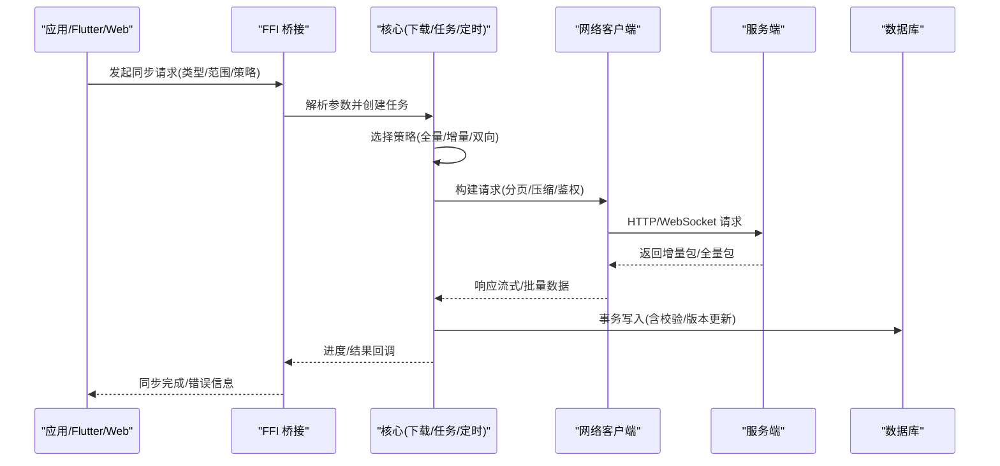

**图示来源** 
- [rust/legado-ffi/src/bridge.rs](file://rust/legado-ffi/src/bridge.rs)
- [rust/legado-core/src/lib.rs](file://rust/legado-core/src/lib.rs)
- [rust/legado-net/src/client.rs](file://rust/legado-net/src/client.rs)
- [rust/legado-server/src/server.rs](file://rust/legado-server/src/server.rs)
- [rust/legado-db/src/lib.rs](file://rust/legado-db/src/lib.rs)

## 详细组件分析

### 同步协议与策略
- 全量同步
  - 适用场景：首次初始化、数据损坏修复、强制重建。
  - 流程要点：资源清单获取、分页拉取、去重与索引重建、完整性校验。
- 增量同步
  - 适用场景：日常更新、弱网环境。
  - 流程要点：携带上次同步游标（时间戳/版本号/哈希），服务端返回差集，客户端合并。
- 双向同步
  - 适用场景：多端编辑、离线后合并。
  - 流程要点：本地变更日志与服务端变更日志比对，冲突检测与合并策略（以时间戳优先/用户选择/内容哈希判定）。

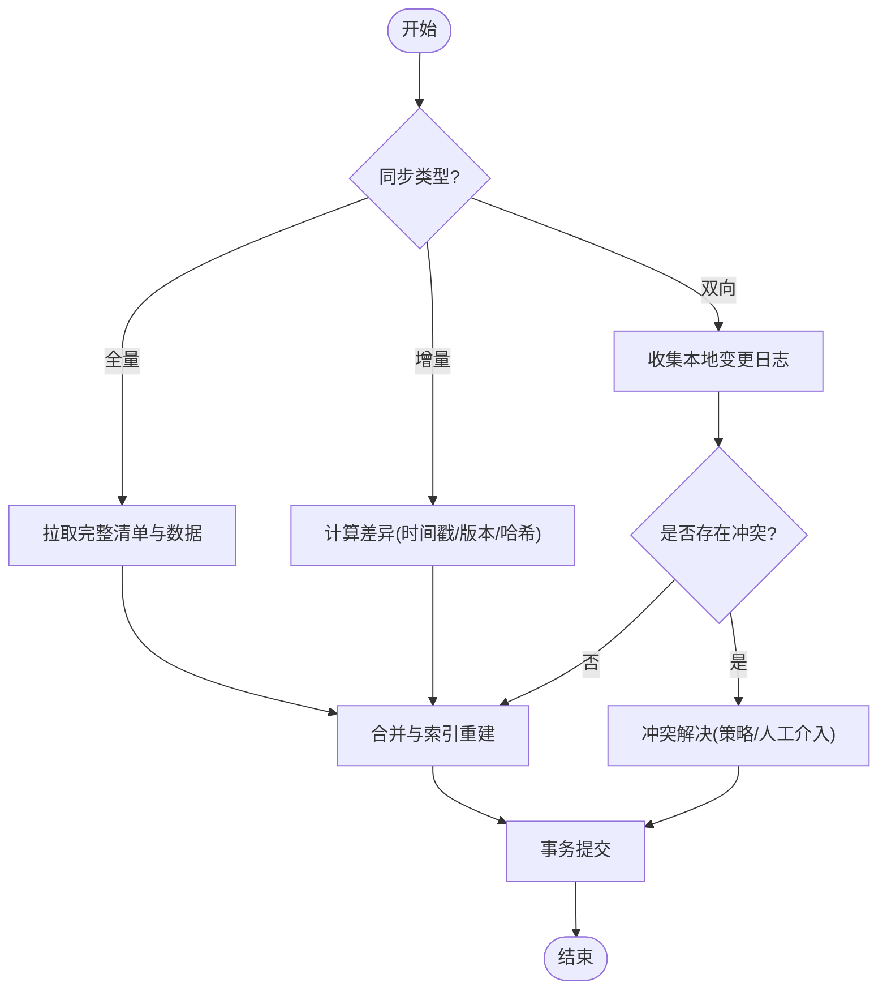

**图示来源** 
- [rust/legado-core/src/download_manager.rs](file://rust/legado-core/src/download_manager.rs)
- [rust/legado-net/src/client.rs](file://rust/legado-net/src/client.rs)
- [rust/legado-db/src/migration.rs](file://rust/legado-db/src/migration.rs)

**章节来源**
- [rust/legado-core/src/download_manager.rs](file://rust/legado-core/src/download_manager.rs)
- [rust/legado-net/src/client.rs](file://rust/legado-net/src/client.rs)
- [rust/legado-db/src/migration.rs](file://rust/legado-db/src/migration.rs)

### 冲突检测算法
- 时间戳比较
  - 以“最后修改时间”作为主键之一，结合冲突窗口避免抖动。
- 版本号管理
  - 单调递增版本字段，配合乐观锁确保写入不覆盖未察觉的变更。
- 内容哈希验证
  - 对关键字段或全文生成摘要，快速识别是否真正变化，减少无效合并。

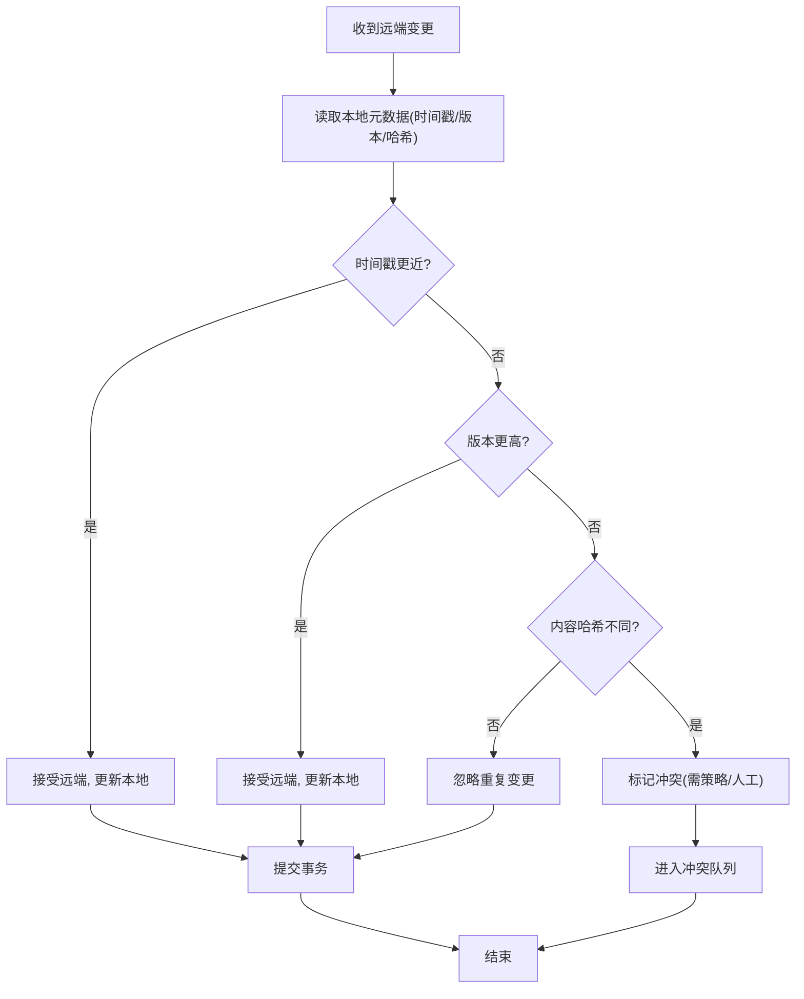

**图示来源** 
- [rust/legado-core/src/download_manager.rs](file://rust/legado-core/src/download_manager.rs)
- [rust/legado-db/src/migration.rs](file://rust/legado-db/src/migration.rs)

**章节来源**
- [rust/legado-core/src/download_manager.rs](file://rust/legado-core/src/download_manager.rs)
- [rust/legado-db/src/migration.rs](file://rust/legado-db/src/migration.rs)

### 一致性保证
- 事务性同步
  - 将多次写入封装为单一事务，失败时整体回滚，保证原子性。
- 回滚机制
  - 预写日志或快照，异常时恢复到最近一致点。
- 最终一致性
  - 允许短暂不一致，通过重试、补偿与幂等接口逐步收敛。

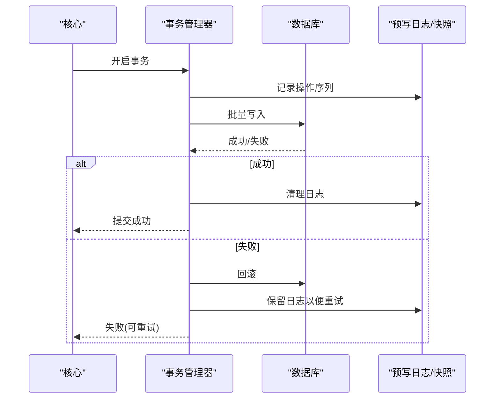

**图示来源** 
- [rust/legado-db/src/lib.rs](file://rust/legado-db/src/lib.rs)
- [rust/legado-db/src/migration.rs](file://rust/legado-db/src/migration.rs)

**章节来源**
- [rust/legado-db/src/lib.rs](file://rust/legado-db/src/lib.rs)
- [rust/legado-db/src/migration.rs](file://rust/legado-db/src/migration.rs)

### 同步任务调度
- 定时任务
  - 基于 Cron 表达式周期触发，支持延迟与限流。
- 事件触发
  - 由 UI 动作或系统广播触发，具备优先级与去重。
- 优先级管理
  - 高优先级队列优先执行，低优先级任务等待或降级。

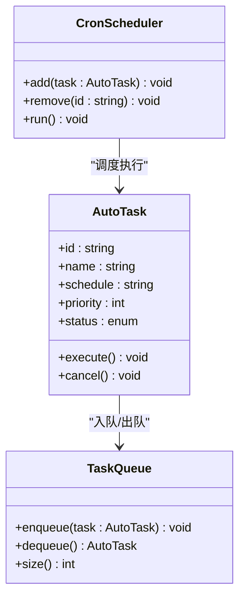

**图示来源** 
- [rust/legado-core/src/auto_task.rs](file://rust/legado-core/src/auto_task.rs)
- [rust/legado-core/src/cron.rs](file://rust/legado-core/src/cron.rs)

**章节来源**
- [rust/legado-core/src/auto_task.rs](file://rust/legado-core/src/auto_task.rs)
- [rust/legado-core/src/cron.rs](file://rust/legado-core/src/cron.rs)

### 同步状态管理
- 进度跟踪
  - 分块/分页计数与百分比上报，持久化至本地状态表。
- 断点续传
  - 记录已传输偏移、校验和与批次号，支持中断恢复。
- 错误恢复
  - 指数退避重试、幂等写入、死信队列与告警。

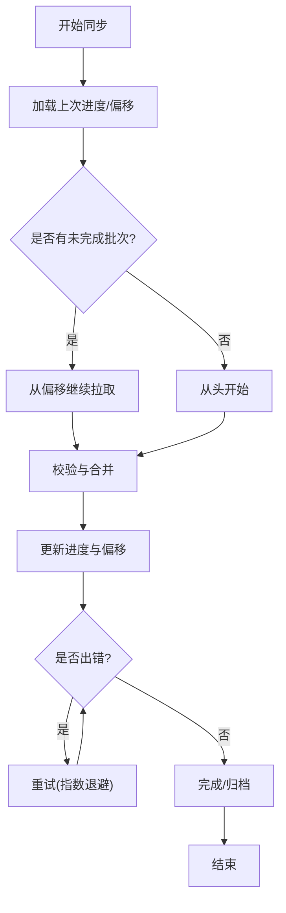

**图示来源** 
- [rust/legado-core/src/download_manager.rs](file://rust/legado-core/src/download_manager.rs)
- [rust/legado-net/src/retry.rs](file://rust/legado-net/src/retry.rs)

**章节来源**
- [rust/legado-core/src/download_manager.rs](file://rust/legado-core/src/download_manager.rs)
- [rust/legado-net/src/retry.rs](file://rust/legado-net/src/retry.rs)

### 网络与传输
- 客户端
  - 支持连接池、超时、重试、代理与 SSL 配置。
- 重试策略
  - 指数退避、抖动、最大重试次数与熔断。
- 服务端
  - HTTP/WebSocket 路由与处理器，提供同步接口与状态查询。

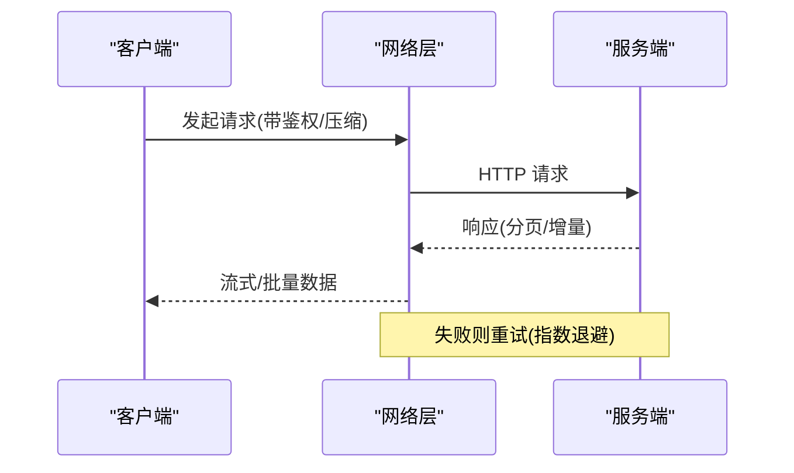

**图示来源** 
- [rust/legado-net/src/client.rs](file://rust/legado-net/src/client.rs)
- [rust/legado-net/src/retry.rs](file://rust/legado-net/src/retry.rs)
- [rust/legado-server/src/server.rs](file://rust/legado-server/src/server.rs)
- [rust/legado-server/src/routes.rs](file://rust/legado-server/src/routes.rs)

**章节来源**
- [rust/legado-net/src/client.rs](file://rust/legado-net/src/client.rs)
- [rust/legado-net/src/retry.rs](file://rust/legado-net/src/retry.rs)
- [rust/legado-server/src/server.rs](file://rust/legado-server/src/server.rs)
- [rust/legado-server/src/routes.rs](file://rust/legado-server/src/routes.rs)

### Web 同步脚本
- 作用
  - 提供浏览器端的同步入口，便于调试与手动触发。
- 能力
  - 调用服务端 API，显示进度与结果，支持重试与导出。

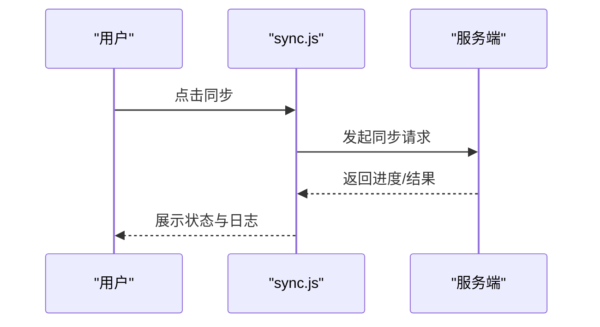

**图示来源** 
- [modules/web/public/scripts/sync.js](file://modules/web/public/scripts/sync.js)
- [rust/legado-server/src/routes.rs](file://rust/legado-server/src/routes.rs)

**章节来源**
- [modules/web/public/scripts/sync.js](file://modules/web/public/scripts/sync.js)
- [rust/legado-server/src/routes.rs](file://rust/legado-server/src/routes.rs)

### FFI 桥接与集成
- 职责
  - 暴露 Rust 能力给 Kotlin/Flutter，统一参数与返回值。
- 关键点
  - 错误映射、异步回调、内存安全与序列化。

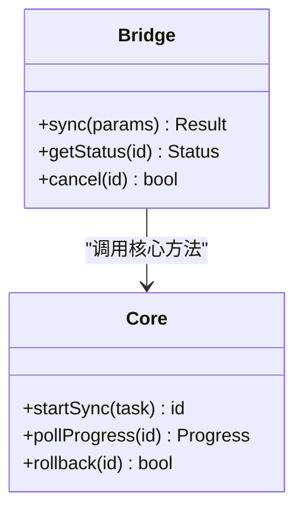

**图示来源** 
- [rust/legado-ffi/src/bridge.rs](file://rust/legado-ffi/src/bridge.rs)
- [rust/legado-core/src/lib.rs](file://rust/legado-core/src/lib.rs)

**章节来源**
- [rust/legado-ffi/src/bridge.rs](file://rust/legado-ffi/src/bridge.rs)
- [rust/legado-core/src/lib.rs](file://rust/legado-core/src/lib.rs)

## 依赖关系分析
- 模块耦合
  - FFI 依赖核心与数据库；核心依赖网络与数据库；服务器依赖核心与数据库。
- 外部依赖
  - 网络库、序列化库、加密库、调度库等。
- 循环依赖
  - 通过接口与消息解耦，避免直接循环引用。

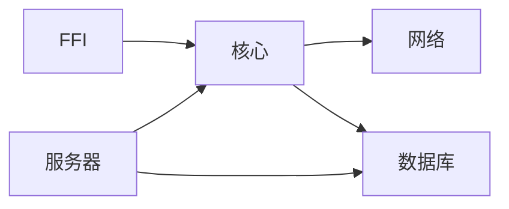

**图示来源** 
- [rust/legado-ffi/src/bridge.rs](file://rust/legado-ffi/src/bridge.rs)
- [rust/legado-core/src/lib.rs](file://rust/legado-core/src/lib.rs)
- [rust/legado-net/src/client.rs](file://rust/legado-net/src/client.rs)
- [rust/legado-db/src/lib.rs](file://rust/legado-db/src/lib.rs)
- [rust/legado-server/src/server.rs](file://rust/legado-server/src/server.rs)

**章节来源**
- [rust/legado-ffi/src/bridge.rs](file://rust/legado-ffi/src/bridge.rs)
- [rust/legado-core/src/lib.rs](file://rust/legado-core/src/lib.rs)
- [rust/legado-net/src/client.rs](file://rust/legado-net/src/client.rs)
- [rust/legado-db/src/lib.rs](file://rust/legado-db/src/lib.rs)
- [rust/legado-server/src/server.rs](file://rust/legado-server/src/server.rs)

## 性能考虑
- 数据压缩
  - 传输前压缩（Brotli/Gzip），服务端解压，降低带宽占用。
- 批量传输
  - 聚合多条记录一次提交，减少网络往返与事务开销。
- 并行处理
  - 并发拉取与写入，限制并发度以避免拥塞与锁竞争。
- 缓存与去重
  - 本地缓存热点数据，去重减少重复写入。
- 资源监控
  - 指标采集（吞吐、延迟、错误率）与告警。

[本节为通用指导，无需特定文件来源]

## 故障排查指南
- 常见问题
  - 网络超时与重试风暴：检查重试策略与退避参数。
  - 数据不一致：核对时间戳/版本/哈希，查看冲突队列。
  - 进度停滞：确认断点偏移与批次状态。
  - 权限与鉴权失败：检查 Token 与访问控制策略。
- 诊断步骤
  - 查看任务日志与错误码。
  - 检查数据库事务与迁移状态。
  - 抓包分析网络请求与响应。
  - 启用调试模式与详细日志。

**章节来源**
- [rust/legado-net/src/retry.rs](file://rust/legado-net/src/retry.rs)
- [rust/legado-core/src/download_manager.rs](file://rust/legado-core/src/download_manager.rs)
- [rust/legado-db/src/migration.rs](file://rust/legado-db/src/migration.rs)
- [rust/legado-server/src/routes.rs](file://rust/legado-server/src/routes.rs)

## 结论
Legado 的数据同步机制以 Rust 为核心，结合 FFI 桥接、网络层、服务器与数据库，实现了可扩展、可靠且高效的同步方案。通过明确的协议设计、冲突检测与一致性保证、完善的任务调度与状态管理，以及性能与安全优化，能够满足多端协同与复杂场景下的数据同步需求。建议在生产环境中完善监控与审计，持续优化重试与合并策略，确保在高负载与弱网条件下的稳定性。

[本节为总结，无需特定文件来源]

## 附录
- 术语
  - 增量同步、全量同步、双向同步、冲突检测、最终一致性、断点续传、幂等、预写日志、Cron 表达式。
- 参考
  - 相关模块源码与测试用例，便于进一步理解实现细节。

[本节为补充信息，无需特定文件来源]