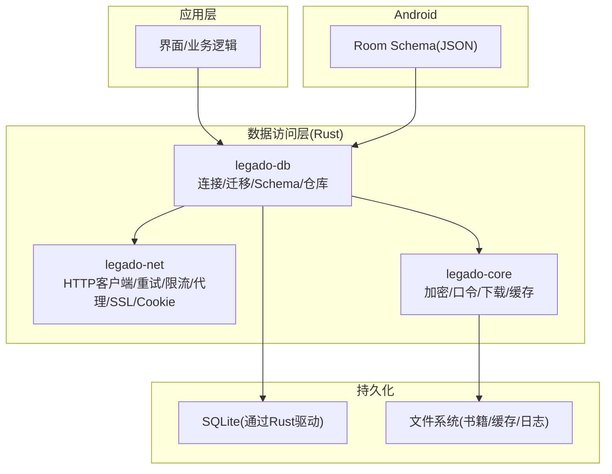
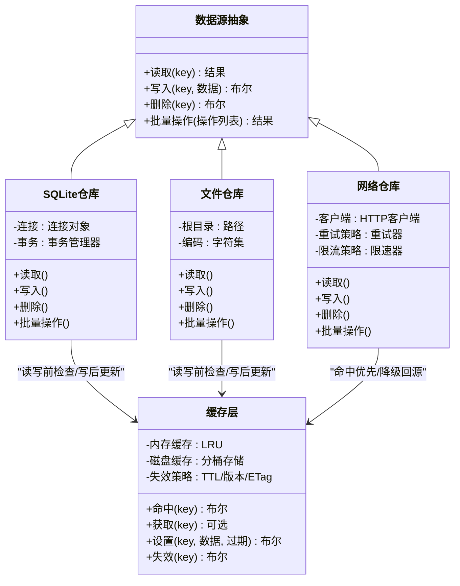
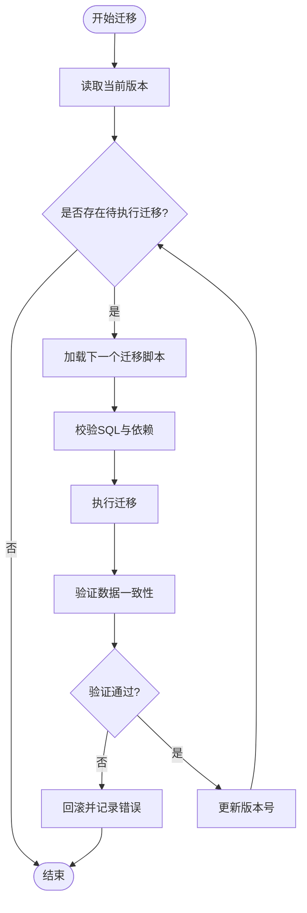
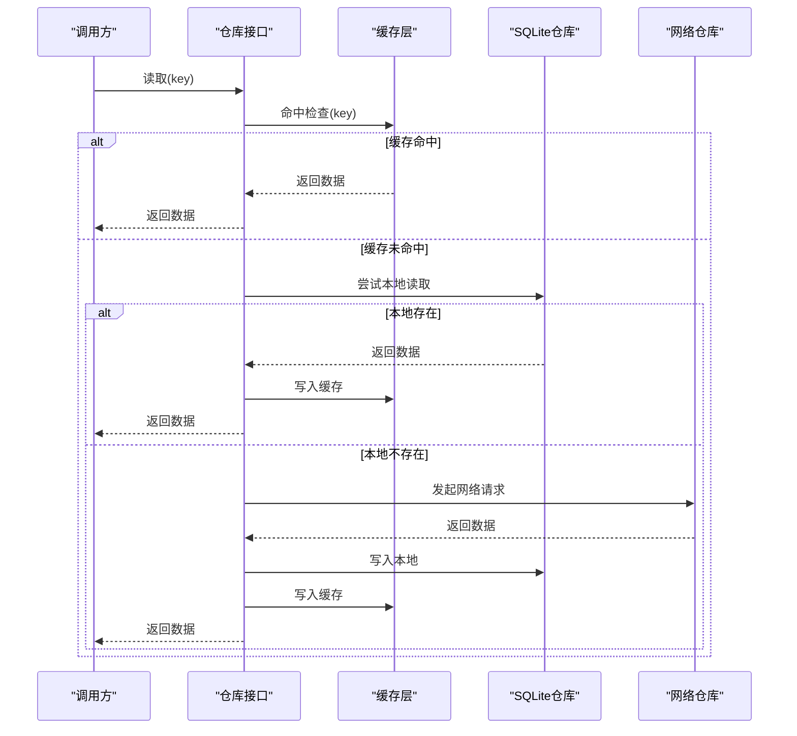
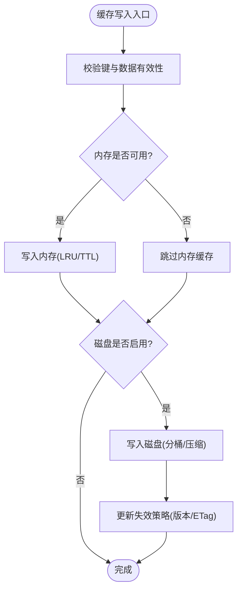
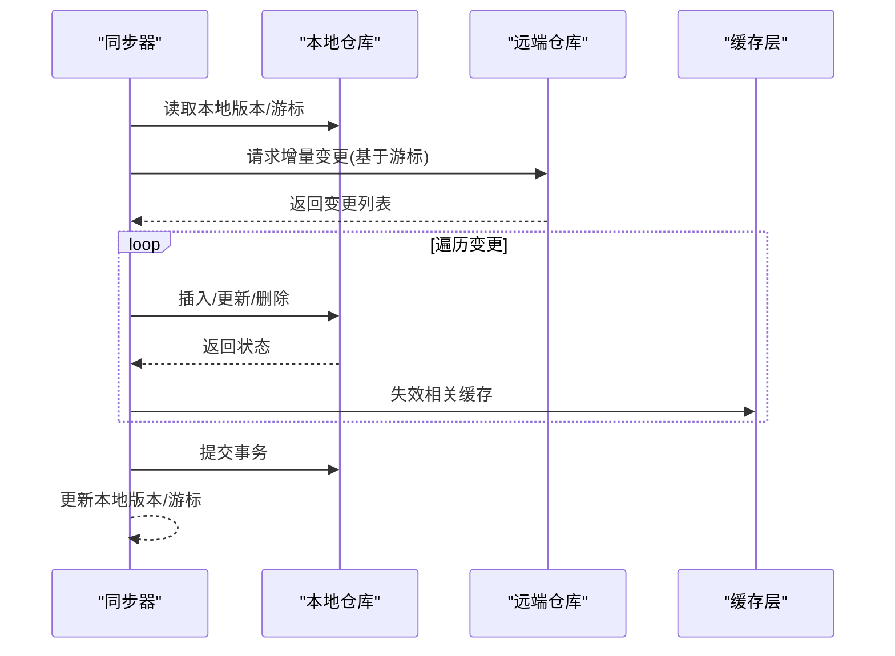
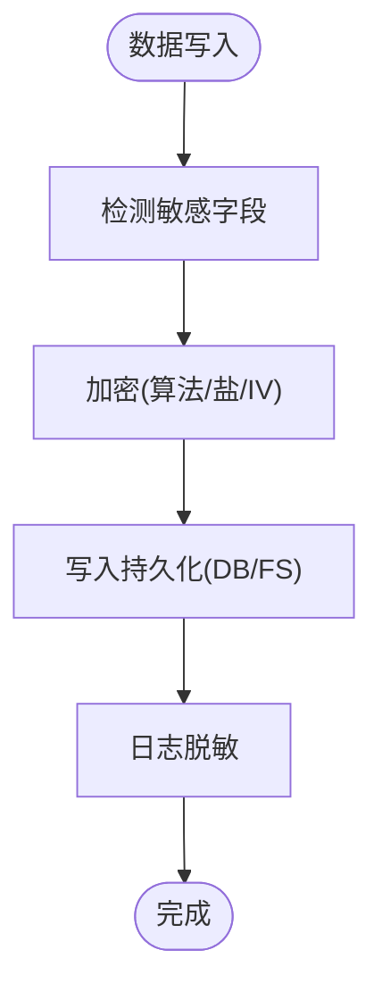
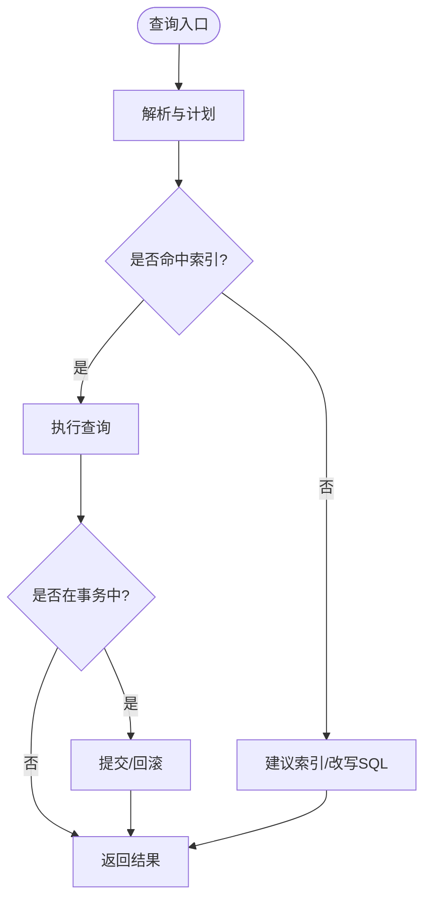
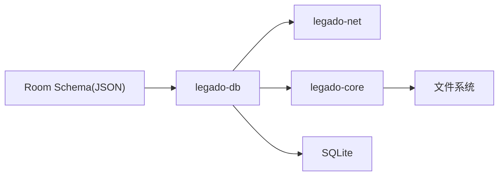

# 数据访问层

<cite>
**本文引用的文件**   
- [lib.rs](file://rust/legado-db/src/lib.rs)
- [connection.rs](file://rust/legado-db/src/connection.rs)
- [migration.rs](file://rust/legado-db/src/migration.rs)
- [schema.rs](file://rust/legado-db/src/schema.rs)
- [default_data.rs](file://rust/legado-db/src/default_data.rs)
- [import.rs](file://rust/legado-db/src/import.rs)
- [rule_big_data.rs](file://rust/legado-db/src/rule_big_data.rs)
- [migrations.rs](file://rust/legado-db/src/migration/migrations.rs)
- [book_repository.rs](file://rust/legado-db/src/repository/book_repository.rs)
- [book_chapter_repository.rs](file://rust/legado-db/src/repository/book_chapter_repository.rs)
- [cache_repository.rs](file://rust/legado-db/src/repository/cache_repository.rs)
- [cache_book_repository.rs](file://rust/legado-db/src/repository/cache_book_repository.rs)
- [cookie_repository.rs](file://rust/legado-db/src/repository/cookie_repository.rs)
- [read_record_repository.rs](file://rust/legado-db/src/repository/read_record_repository.rs)
- [reading_stats_repository.rs](file://rust/legado-db/src/repository/reading_stats_repository.rs)
- [rss_article_repository.rs](file://rust/legado-db/src/repository/rss_article_repository.rs)
- [rss_source_repository.rs](file://rust/legado-db/src/repository/rss_source_repository.rs)
- [rss_star_repository.rs](file://rust/legado-db/src/repository/rss_star_repository.rs)
- [search_book_repository.rs](file://rust/legado-db/src/repository/search_book_repository.rs)
- [search_keyword_repository.rs](file://rust/legado-db/src/repository/search_keyword_repository.rs)
- [user_repository.rs](file://rust/legado-db/src/repository/user_repository.rs)
- [mod.rs](file://rust/legado-db/src/repository/mod.rs)
- [client.rs](file://rust/legado-net/src/client.rs)
- [request.rs](file://rust/legado-net/src/request.rs)
- [response.rs](file://rust/legado-net/src/response.rs)
- [retry.rs](file://rust/legado-net/src/retry.rs)
- [rate_limit.rs](file://rust/legado-net/src/rate_limit.rs)
- [proxy.rs](file://rust/legado-net/src/proxy.rs)
- [ssl_config.rs](file://rust/legado-net/src/ssl_config.rs)
- [cookie_store.rs](file://rust/legado-net/src/cookie_store.rs)
- [crypto.rs](file://rust/legado-core/src/crypto.rs)
- [passphrase.rs](file://rust/legado-core/src/passphrase.rs)
- [download_manager.rs](file://rust/legado-core/src/download_manager.rs)
- [cache_book.rs](file://rust/legado-core/src/cache_book.rs)
- [audio_cache.rs](file://rust/legado-core/src/audio_cache.rs)
- [app_database_schema_1.json](file://app/schemas/io.legado.app.data.AppDatabase/1.json)
- [app_database_schema_95.json](file://app/schemas/io.legado.app.data.AppDatabase/95.json)
</cite>

## 目录
1. [简介](#简介)
2. [项目结构](#项目结构)
3. [核心组件](#核心组件)
4. [架构总览](#架构总览)
5. [详细组件分析](#详细组件分析)
6. [依赖关系分析](#依赖关系分析)
7. [性能考量](#性能考量)
8. [故障排查指南](#故障排查指南)
9. [结论](#结论)
10. [附录](#附录)

## 简介
本文件聚焦Legado应用的数据访问层，系统性阐述SQLite数据库表结构与关系映射、Repository模式在本地存储、文件系统与网络请求中的统一抽象、缓存机制（内存/磁盘/智能失效）、数据同步（增量同步、冲突检测、版本管理）、数据安全策略（加密存储、权限控制、隐私保护），以及查询优化、事务处理与并发访问控制。文档同时提供可操作的数据操作示例路径与性能调优建议，帮助开发者快速定位实现并高效扩展。

## 项目结构
数据访问层由Rust侧的数据库与仓库模块、网络客户端模块、核心缓存与加解密模块，以及Android侧Room数据库Schema共同构成：
- Rust数据库与仓库：legado-db负责连接、迁移、Schema定义、默认数据导入、规则大数据存储及各类实体仓库；
- 网络访问：legado-net提供HTTP客户端、请求/响应封装、重试、限流、代理、SSL配置与Cookie管理；
- 核心能力：legado-core提供加解密、口令、下载管理、缓存等通用能力；
- Android Room Schema：app/schemas下保存AppDatabase各版本的JSON描述，用于迁移与兼容性校验。

图表来源
- [lib.rs:1-200](file://rust/legado-db/src/lib.rs#L1-L200)
- [client.rs:1-200](file://rust/legado-net/src/client.rs#L1-L200)
- [crypto.rs:1-200](file://rust/legado-core/src/crypto.rs#L1-L200)
- [app_database_schema_1.json:1-200](file://app/schemas/io.legado.app.data.AppDatabase/1.json#L1-L200)

章节来源
- [lib.rs:1-200](file://rust/legado-db/src/lib.rs#L1-L200)
- [client.rs:1-200](file://rust/legado-net/src/client.rs#L1-L200)
- [crypto.rs:1-200](file://rust/legado-core/src/crypto.rs#L1-L200)
- [app_database_schema_1.json:1-200](file://app/schemas/io.legado.app.data.AppDatabase/1.json#L1-L200)

## 核心组件
- 数据库连接与生命周期：集中管理SQLite连接池、读写分离、事务边界与错误传播；
- 迁移系统：基于版本号的渐进式迁移，支持增量变更与回滚策略；
- Schema与默认数据：定义表结构、索引与约束，并提供初始数据注入；
- Repository模式：对本地SQLite、文件系统与网络请求进行统一抽象，屏蔽底层差异；
- 缓存体系：内存缓存（LRU/TTL）、磁盘缓存（按资源类型分桶）与智能失效（版本号/时间戳/ETag）；
- 数据同步：增量拉取、冲突检测（基于版本号或哈希）、合并策略与失败重试；
- 安全与隐私：敏感字段加密、口令派生、最小权限原则与脱敏输出。

章节来源
- [connection.rs:1-200](file://rust/legado-db/src/connection.rs#L1-L200)
- [migration.rs:1-200](file://rust/legado-db/src/migration.rs#L1-L200)
- [schema.rs:1-200](file://rust/legado-db/src/schema.rs#L1-L200)
- [default_data.rs:1-200](file://rust/legado-db/src/default_data.rs#L1-L200)
- [import.rs:1-200](file://rust/legado-db/src/import.rs#L1-L200)
- [rule_big_data.rs:1-200](file://rust/legado-db/src/rule_big_data.rs#L1-L200)

## 架构总览
数据访问层采用“仓库+领域服务”的分层设计：上层通过Repository接口获取数据，仓库内部根据数据来源选择SQLite、文件或网络通道，并通过缓存层降低重复IO与网络开销。

图表来源
- [book_repository.rs:1-200](file://rust/legado-db/src/repository/book_repository.rs#L1-L200)
- [cache_repository.rs:1-200](file://rust/legado-db/src/repository/cache_repository.rs#L1-L200)
- [cache_book_repository.rs:1-200](file://rust/legado-db/src/repository/cache_book_repository.rs#L1-L200)
- [client.rs:1-200](file://rust/legado-net/src/client.rs#L1-L200)

章节来源
- [book_repository.rs:1-200](file://rust/legado-db/src/repository/book_repository.rs#L1-L200)
- [cache_repository.rs:1-200](file://rust/legado-db/src/repository/cache_repository.rs#L1-L200)
- [cache_book_repository.rs:1-200](file://rust/legado-db/src/repository/cache_book_repository.rs#L1-L200)
- [client.rs:1-200](file://rust/legado-net/src/client.rs#L1-L200)

## 详细组件分析

### SQLite数据库表结构与关系映射
- 表结构设计：以书籍、章节、书签、阅读记录、RSS文章/订阅源/收藏、搜索历史/关键词、用户、Cookie、缓存条目、自动任务、替换规则、字典规则、键盘辅助、音频TTS、阅读统计等为核心实体；
- 关系映射：书籍与章节一对多，阅读记录与书籍一对一或多对一（取决于实现），RSS订阅源与文章一对多，书签与书籍/章节关联；
- 索引与约束：主键、唯一约束、外键约束、常用查询列建立索引以提升检索性能；
- 版本演进：Android端Room JSON Schema从v1到v95，确保跨版本兼容与迁移一致性。

```mermaid
erDiagram
BOOKS {
uuid id PK
string title
string author
string cover_url
string source_id
timestamp created_at
timestamp updated_at
}
CHAPTERS {
uuid id PK
uuid book_id FK
string title
int index
text content
timestamp created_at
timestamp updated_at
}
BOOKMARKS {
uuid id PK
uuid book_id FK
uuid chapter_id FK
int position
text note
timestamp created_at
}
READ_RECORDS {
uuid id PK
uuid book_id FK
int progress
float read_time
timestamp last_read_at
}
RSS_SOURCES {
uuid id PK
string name
string url
string rule_json
timestamp created_at
timestamp updated_at
}
RSS_ARTICLES {
uuid id PK
uuid source_id FK
string title
string link
text summary
timestamp published_at
timestamp fetched_at
}
SEARCH_HISTORY {
uuid id PK
string keyword
timestamp created_at
}
USERS {
uuid id PK
string username
string password_hash
string salt
boolean active
timestamp created_at
}
COOKIES {
uuid id PK
string domain
string name
string value
timestamp expires_at
}
CACHE_ENTRIES {
uuid id PK
string key
blob data
int ttl_seconds
timestamp created_at
}
AUTO_TASKS {
uuid id PK
string name
string cron_expr
string payload
timestamp next_run_at
timestamp created_at
}
REPLACEMENT_RULES {
uuid id PK
string name
string pattern
string replacement
boolean enabled
}
DICT_RULES {
uuid id PK
string name
string rule_json
boolean enabled
}
KEYBOARD_ASSIST {
uuid id PK
string action
string shortcut
boolean enabled
}
HTTP_TTS {
uuid id PK
string engine
string voice
string url_template
boolean enabled
}
READING_STATS {
uuid id PK
uuid book_id FK
int total_pages
int current_page
float total_time
timestamp last_updated
}
BOOKS ||--o{ CHAPTERS : "包含"
BOOKS ||--o{ BOOKMARKS : "被标记"
BOOKS ||--o| READ_RECORDS : "有记录"
RSS_SOURCES ||--o{ RSS_ARTICLES : "发布"
BOOKS ||--o{ SEARCH_HISTORY : "搜索过"
USERS ||--o{ COOKIES : "持有"
CACHE_ENTRIES ||--|| 任意实体 : "缓存"
AUTO_TASKS ||--o{ 任意实体 : "触发"
REPLACEMENT_RULES ||--o{ 内容处理 : "应用"
DICT_RULES ||--o{ 内容处理 : "应用"
KEYBOARD_ASSIST ||--o{ 快捷操作 : "绑定"
HTTP_TTS ||--o{ 语音合成 : "调用"
BOOKS ||--o{ READING_STATS : "统计"
```

图表来源
- [schema.rs:1-200](file://rust/legado-db/src/schema.rs#L1-L200)
- [app_database_schema_1.json:1-200](file://app/schemas/io.legado.app.data.AppDatabase/1.json#L1-L200)
- [app_database_schema_95.json:1-200](file://app/schemas/io.legado.app.data.AppDatabase/95.json#L1-L200)

章节来源
- [schema.rs:1-200](file://rust/legado-db/src/schema.rs#L1-L200)
- [app_database_schema_1.json:1-200](file://app/schemas/io.legado.app.data.AppDatabase/1.json#L1-L200)
- [app_database_schema_95.json:1-200](file://app/schemas/io.legado.app.data.AppDatabase/95.json#L1-L200)

### 数据迁移策略
- 版本管理：每个迁移对应一个版本号，按顺序执行；
- 增量变更：仅包含必要的ALTER TABLE/INSERT/UPDATE语句，避免全量重建；
- 回滚策略：提供反向迁移脚本或在必要时支持数据备份与恢复；
- 校验机制：迁移前后进行完整性检查与数据一致性校验；
- 默认数据注入：首次安装或重置时注入基础规则与模板。

图表来源
- [migration.rs:1-200](file://rust/legado-db/src/migration.rs#L1-L200)
- [migrations.rs:1-200](file://rust/legado-db/src/migration/migrations.rs#L1-L200)
- [default_data.rs:1-200](file://rust/legado-db/src/default_data.rs#L1-L200)

章节来源
- [migration.rs:1-200](file://rust/legado-db/src/migration.rs#L1-L200)
- [migrations.rs:1-200](file://rust/legado-db/src/migration/migrations.rs#L1-L200)
- [default_data.rs:1-200](file://rust/legado-db/src/default_data.rs#L1-L200)

### Repository模式在各数据源中的实现
- 统一接口：所有仓库暴露一致的CRUD与批量操作API；
- 本地存储：SQLite仓库使用连接池与事务，保证原子性与隔离性；
- 文件系统：文件仓库提供序列化/反序列化、路径管理与权限控制；
- 网络请求：网络仓库封装HTTP客户端、重试、限流、代理与SSL配置；
- 缓存集成：仓库在读写前检查缓存，命中则直接返回，未命中再回源并回填缓存。

图表来源
- [book_repository.rs:1-200](file://rust/legado-db/src/repository/book_repository.rs#L1-L200)
- [cache_repository.rs:1-200](file://rust/legado-db/src/repository/cache_repository.rs#L1-L200)
- [cache_book_repository.rs:1-200](file://rust/legado-db/src/repository/cache_book_repository.rs#L1-L200)
- [client.rs:1-200](file://rust/legado-net/src/client.rs#L1-L200)

章节来源
- [book_repository.rs:1-200](file://rust/legado-db/src/repository/book_repository.rs#L1-L200)
- [cache_repository.rs:1-200](file://rust/legado-db/src/repository/cache_repository.rs#L1-L200)
- [cache_book_repository.rs:1-200](file://rust/legado-db/src/repository/cache_book_repository.rs#L1-L200)
- [client.rs:1-200](file://rust/legado-net/src/client.rs#L1-L200)

### 缓存机制的设计
- 内存缓存：基于LRU与TTL，适合热点数据与短生命周期对象；
- 磁盘缓存：按资源类型分桶存储，支持压缩与去重；
- 智能失效：结合版本号、时间戳、ETag与自定义策略，确保数据新鲜度；
- 并发控制：读写锁与队列化更新，避免缓存击穿与雪崩；
- 监控与清理：定期扫描过期条目与空间回收。

图表来源
- [cache_repository.rs:1-200](file://rust/legado-db/src/repository/cache_repository.rs#L1-L200)
- [cache_book_repository.rs:1-200](file://rust/legado-db/src/repository/cache_book_repository.rs#L1-L200)
- [cache_book.rs:1-200](file://rust/legado-core/src/cache_book.rs#L1-L200)
- [audio_cache.rs:1-200](file://rust/legado-core/src/audio_cache.rs#L1-L200)

章节来源
- [cache_repository.rs:1-200](file://rust/legado-db/src/repository/cache_repository.rs#L1-L200)
- [cache_book_repository.rs:1-200](file://rust/legado-db/src/repository/cache_book_repository.rs#L1-L200)
- [cache_book.rs:1-200](file://rust/legado-core/src/cache_book.rs#L1-L200)
- [audio_cache.rs:1-200](file://rust/legado-core/src/audio_cache.rs#L1-L200)

### 数据同步的实现原理
- 增量同步：基于时间戳或游标拉取新增/变更数据，减少带宽与CPU消耗；
- 冲突检测：比较版本号或内容哈希，识别冲突并记录上下文；
- 合并策略：按优先级与时间线合并，保留最新有效版本；
- 版本管理：维护本地与远端版本对照表，支持断点续传；
- 重试与退避：失败自动重试，指数退避与熔断保护。

图表来源
- [book_repository.rs:1-200](file://rust/legado-db/src/repository/book_repository.rs#L1-L200)
- [rss_article_repository.rs:1-200](file://rust/legado-db/src/repository/rss_article_repository.rs#L1-200)
- [client.rs:1-200](file://rust/legado-net/src/client.rs#L1-200)
- [retry.rs:1-200](file://rust/legado-net/src/retry.rs#L1-200)

章节来源
- [book_repository.rs:1-200](file://rust/legado-db/src/repository/book_repository.rs#L1-200)
- [rss_article_repository.rs:1-200](file://rust/legado-db/src/repository/rss_article_repository.rs#L1-200)
- [client.rs:1-200](file://rust/legado-net/src/client.rs#L1-200)
- [retry.rs:1-200](file://rust/legado-net/src/retry.rs#L1-200)

### 数据安全策略
- 加密存储：敏感字段（密码、令牌、私有内容）使用强加密算法与随机盐；
- 口令派生：基于口令生成密钥材料，支持多轮迭代与抗暴力破解；
- 权限控制：最小权限原则，按需申请存储与网络权限；
- 隐私保护：日志脱敏、崩溃报告匿名化、用户数据导出与删除；
- 传输安全：HTTPS强制、证书校验、弱协议禁用。

图表来源
- [crypto.rs:1-200](file://rust/legado-core/src/crypto.rs#L1-200)
- [passphrase.rs:1-200](file://rust/legado-core/src/passphrase.rs#L1-200)
- [ssl_config.rs:1-200](file://rust/legado-net/src/ssl_config.rs#L1-200)

章节来源
- [crypto.rs:1-200](file://rust/legado-core/src/crypto.rs#L1-200)
- [passphrase.rs:1-200](file://rust/legado-core/src/passphrase.rs#L1-200)
- [ssl_config.rs:1-200](file://rust/legado-net/src/ssl_config.rs#L1-200)

### 数据库查询优化、事务处理与并发访问控制
- 查询优化：合理使用索引、分页与投影，避免SELECT *；复杂查询拆分为多次简单查询；
- 事务处理：批量写入使用事务包裹，确保原子性与一致性；长事务避免阻塞；
- 并发控制：读写锁分离、连接池限制、队列化写操作，防止死锁与竞争；
- 监控与诊断：慢查询日志、命中率统计、连接池使用率监控。

图表来源
- [connection.rs:1-200](file://rust/legado-db/src/connection.rs#L1-200)
- [book_repository.rs:1-200](file://rust/legado-db/src/repository/book_repository.rs#L1-200)
- [read_record_repository.rs:1-200](file://rust/legado-db/src/repository/read_record_repository.rs#L1-200)
- [reading_stats_repository.rs:1-200](file://rust/legado-db/src/repository/reading_stats_repository.rs#L1-200)

章节来源
- [connection.rs:1-200](file://rust/legado-db/src/connection.rs#L1-200)
- [book_repository.rs:1-200](file://rust/legado-db/src/repository/book_repository.rs#L1-200)
- [read_record_repository.rs:1-200](file://rust/legado-db/src/repository/read_record_repository.rs#L1-200)
- [reading_stats_repository.rs:1-200](file://rust/legado-db/src/repository/reading_stats_repository.rs#L1-200)

### 具体数据操作示例与性能调优建议
- 书籍章节操作：批量插入章节、分页读取内容、更新阅读进度；
- RSS同步：增量拉取文章、去重与归档、标签与收藏同步；
- 搜索与历史：关键词去重、最近搜索排序、模糊匹配优化；
- 缓存调优：调整LRU大小与TTL阈值，热点数据预热；
- 网络调优：合理设置超时、并发数与重试次数，启用GZIP/HTTP2；
- 存储调优：开启WAL模式、调整页大小与PRAGMA参数。

章节来源
- [book_chapter_repository.rs:1-200](file://rust/legado-db/src/repository/book_chapter_repository.rs#L1-200)
- [rss_article_repository.rs:1-200](file://rust/legado-db/src/repository/rss_article_repository.rs#L1-200)
- [search_keyword_repository.rs:1-200](file://rust/legado-db/src/repository/search_keyword_repository.rs#L1-200)
- [cache_repository.rs:1-200](file://rust/legado-db/src/repository/cache_repository.rs#L1-200)
- [client.rs:1-200](file://rust/legado-net/src/client.rs#L1-200)
- [rate_limit.rs:1-200](file://rust/legado-net/src/rate_limit.rs#L1-200)
- [proxy.rs:1-200](file://rust/legado-net/src/proxy.rs#L1-200)

## 依赖关系分析
数据访问层内部模块与外部依赖如下：
- legado-db依赖legado-net进行网络访问，依赖legado-core进行加解密与缓存；
- Android Room Schema作为迁移与校验依据，不直接参与运行时；
- 仓库模块之间通过接口解耦，便于替换实现与单元测试。

图表来源
- [lib.rs:1-200](file://rust/legado-db/src/lib.rs#L1-200)
- [client.rs:1-200](file://rust/legado-net/src/client.rs#L1-200)
- [crypto.rs:1-200](file://rust/legado-core/src/crypto.rs#L1-200)
- [app_database_schema_1.json:1-200](file://app/schemas/io.legado.app.data.AppDatabase/1.json#L1-200)

章节来源
- [lib.rs:1-200](file://rust/legado-db/src/lib.rs#L1-200)
- [client.rs:1-200](file://rust/legado-net/src/client.rs#L1-200)
- [crypto.rs:1-200](file://rust/legado-core/src/crypto.rs#L1-200)
- [app_database_schema_1.json:1-200](file://app/schemas/io.legado.app.data.AppDatabase/1.json#L1-200)

## 性能考量
- 连接池与线程模型：合理配置最大连接数与队列长度，避免阻塞UI线程；
- 索引与查询计划：为高频查询列建立复合索引，避免函数索引导致失效；
- 批量操作：使用事务与批量插入减少IO次数；
- 缓存命中率：热点数据预热与动态TTL调整；
- 网络优化：启用连接复用、压缩与CDN缓存；
- I/O调度：异步与协程化，避免阻塞；
- 监控指标：QPS、延迟分布、错误率与资源占用。

[本节为通用指导，不直接分析具体文件]

## 故障排查指南
- 迁移失败：检查版本号与脚本顺序，查看迁移日志与回滚信息；
- 查询缓慢：分析执行计划，确认索引命中与锁等待；
- 缓存异常：检查TTL与失效策略，观察内存与磁盘使用；
- 网络错误：查看重试与限流配置，确认代理与SSL设置；
- 数据不一致：对比本地与远端版本，检查合并策略与冲突解决；
- 权限问题：确认存储与网络权限申请与授予。

章节来源
- [migration.rs:1-200](file://rust/legado-db/src/migration.rs#L1-200)
- [connection.rs:1-200](file://rust/legado-db/src/connection.rs#L1-200)
- [cache_repository.rs:1-200](file://rust/legado-db/src/repository/cache_repository.rs#L1-200)
- [client.rs:1-200](file://rust/legado-net/src/client.rs#L1-200)
- [retry.rs:1-200](file://rust/legado-net/src/retry.rs#L1-200)
- [ssl_config.rs:1-200](file://rust/legado-net/src/ssl_config.rs#L1-200)

## 结论
Legado的数据访问层通过清晰的层次划分与Repository模式，将SQLite、文件系统与网络请求统一抽象，配合完善的迁移、缓存、同步与安全机制，提供了稳定、高效且可扩展的数据服务能力。建议在开发中遵循索引与事务最佳实践，持续监控关键指标，并根据业务场景优化缓存与网络策略。

[本节为总结，不直接分析具体文件]

## 附录
- 仓库清单：书籍、章节、书签、阅读记录、RSS文章/订阅源/收藏、搜索历史/关键词、用户、Cookie、缓存条目、自动任务、替换规则、字典规则、键盘辅助、音频TTS、阅读统计；
- 迁移清单：从v1到v95的完整Schema演进；
- 网络配置：客户端、重试、限流、代理、SSL与Cookie管理；
- 安全配置：加密算法、口令派生、权限与隐私策略。

章节来源
- [mod.rs:1-200](file://rust/legado-db/src/repository/mod.rs#L1-200)
- [app_database_schema_95.json:1-200](file://app/schemas/io.legado.app.data.AppDatabase/95.json#L1-200)
- [client.rs:1-200](file://rust/legado-net/src/client.rs#L1-200)
- [retry.rs:1-200](file://rust/legado-net/src/retry.rs#L1-200)
- [rate_limit.rs:1-200](file://rust/legado-net/src/rate_limit.rs#L1-200)
- [proxy.rs:1-200](file://rust/legado-net/src/proxy.rs#L1-200)
- [ssl_config.rs:1-200](file://rust/legado-net/src/ssl_config.rs#L1-200)
- [cookie_store.rs:1-200](file://rust/legado-net/src/cookie_store.rs#L1-200)
- [crypto.rs:1-200](file://rust/legado-core/src/crypto.rs#L1-200)
- [passphrase.rs:1-200](file://rust/legado-core/src/passphrase.rs#L1-200)
- [download_manager.rs:1-200](file://rust/legado-core/src/download_manager.rs#L1-200)
- [cache_book.rs:1-200](file://rust/legado-core/src/cache_book.rs#L1-200)
- [audio_cache.rs:1-200](file://rust/legado-core/src/audio_cache.rs#L1-200)