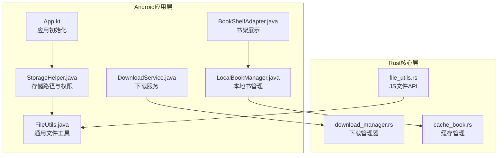
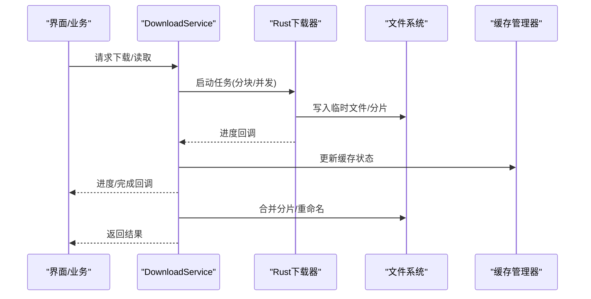
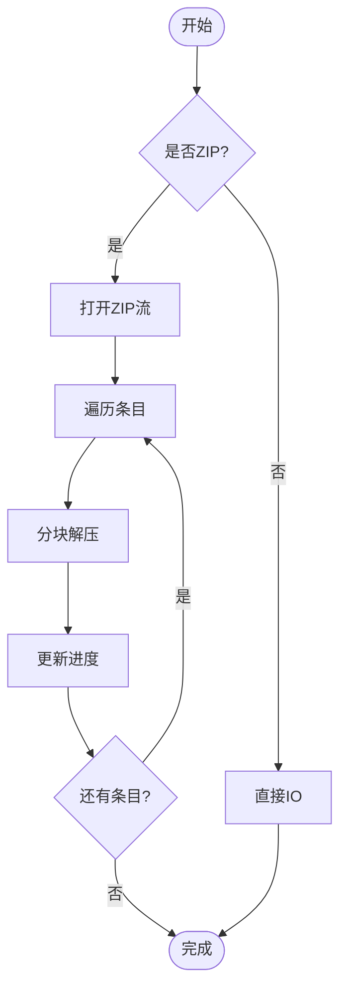
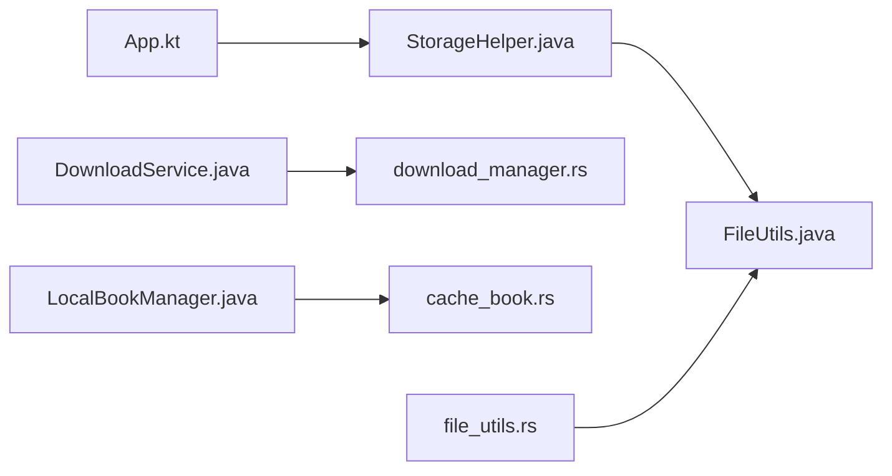

# 文件系统存储

<cite>
**本文引用的文件**   
- [app/src/main/java/io/legado/app/App.kt](file://app/src/main/java/io/legado/app/App.kt)
- [app/src/main/java/io/legado/app/help/storage/StorageHelper.java](file://app/src/main/java/io/legado/app/help/storage/StorageHelper.java)
- [app/src/main/java/io/legado/app/utils/FileUtils.java](file://app/src/main/java/io/legado/app/utils/FileUtils.java)
- [app/src/main/java/io/legado/app/utils/compress/ZipUtils.java](file://app/src/main/java/io/legado/app/utils/compress/ZipUtils.java)
- [app/src/main/java/io/legado/app/service/DownloadService.java](file://app/src/main/java/io/legado/app/service/DownloadService.java)
- [app/src/main/java/io/legado/app/model/localBook/LocalBookManager.java](file://app/src/main/java/io/legado/app/model/localBook/LocalBookManager.java)
- [rust/legado-core/src/download_manager.rs](file://rust/legado-core/src/download_manager.rs)
- [rust/legado-core/src/cache_book.rs](file://rust/legado-core/src/cache_book.rs)
- [rust/legado-js/src/host_api/file_utils.rs](file://rust/legado-js/src/host_api/file_utils.rs)
- [app/src/main/java/io/legado/app/ui/book/shelf/adapter/BookShelfAdapter.java](file://app/src/main/java/io/legado/app/ui/book/shelf/adapter/BookShelfAdapter.java)
</cite>

## 目录
1. [简介](#简介)
2. [项目结构](#项目结构)
3. [核心组件](#核心组件)
4. [架构总览](#架构总览)
5. [详细组件分析](#详细组件分析)
6. [依赖关系分析](#依赖关系分析)
7. [性能考虑](#性能考虑)
8. [故障排查指南](#故障排查指南)
9. [结论](#结论)
10. [附录](#附录)

## 简介
本文件围绕Legado项目的“文件系统存储”能力进行系统化文档化，覆盖以下关键主题：
- 文件组织结构：书籍文件、缓存文件、配置文件与临时文件的目录规划
- 文件读写操作：流式读写、缓冲策略与内存管理
- 文件压缩与解压：ZIP格式支持、分块压缩与进度监控
- 文件同步机制：增量同步、冲突检测与合并策略
- 文件权限管理：Android存储权限、沙箱隔离与安全访问
- 性能优化：预读取、懒加载与垃圾回收
- 完整性校验、损坏修复与备份恢复策略

本说明既面向开发者，也兼顾非技术读者，通过分层讲解与图示帮助快速理解。

## 项目结构
Legado在Android端采用Kotlin/Java为主，Rust提供高性能核心能力（下载、缓存、IO等）。与文件系统相关的代码主要分布在：
- Android应用层：负责UI交互、权限处理、路径管理与业务编排
- Rust核心层：实现高并发下载、缓存、压缩与IO优化
- JS宿主API：为脚本环境提供安全的文件访问能力

图表来源
- [app/src/main/java/io/legado/app/App.kt](file://app/src/main/java/io/legado/app/App.kt)
- [app/src/main/java/io/legado/app/help/storage/StorageHelper.java](file://app/src/main/java/io/legado/app/help/storage/StorageHelper.java)
- [app/src/main/java/io/legado/app/utils/FileUtils.java](file://app/src/main/java/io/legado/app/utils/FileUtils.java)
- [app/src/main/java/io/legado/app/service/DownloadService.java](file://app/src/main/java/io/legado/app/service/DownloadService.java)
- [app/src/main/java/io/legado/app/model/localBook/LocalBookManager.java](file://app/src/main/java/io/legado/app/model/localBook/LocalBookManager.java)
- [rust/legado-core/src/download_manager.rs](file://rust/legado-core/src/download_manager.rs)
- [rust/legado-core/src/cache_book.rs](file://rust/legado-core/src/cache_book.rs)
- [rust/legado-js/src/host_api/file_utils.rs](file://rust/legado-js/src/host_api/file_utils.rs)

章节来源
- [app/src/main/java/io/legado/app/App.kt](file://app/src/main/java/io/legado/app/App.kt)
- [app/src/main/java/io/legado/app/help/storage/StorageHelper.java](file://app/src/main/java/io/legado/app/help/storage/StorageHelper.java)
- [app/src/main/java/io/legado/app/utils/FileUtils.java](file://app/src/main/java/io/legado/app/utils/FileUtils.java)
- [app/src/main/java/io/legado/app/service/DownloadService.java](file://app/src/main/java/io/legado/app/service/DownloadService.java)
- [app/src/main/java/io/legado/app/model/localBook/LocalBookManager.java](file://app/src/main/java/io/legado/app/model/localBook/LocalBookManager.java)
- [rust/legado-core/src/download_manager.rs](file://rust/legado-core/src/download_manager.rs)
- [rust/legado-core/src/cache_book.rs](file://rust/legado-core/src/cache_book.rs)
- [rust/legado-js/src/host_api/file_utils.rs](file://rust/legado-js/src/host_api/file_utils.rs)

## 核心组件
- StorageHelper：集中管理存储根路径、子目录划分（书籍、缓存、配置、临时）、权限检查与适配不同Android版本
- FileUtils：封装常用文件操作（创建、删除、移动、复制、遍历、大小统计、编码转换）
- DownloadService：协调网络下载与本地落盘，支持断点续传、并发控制与进度回调
- LocalBookManager：本地书籍生命周期管理（导入、索引、扫描、清理）
- Rust download_manager：高性能下载引擎，支持分块、重试、限速与并发
- Rust cache_book：缓存策略（TTL、LRU、容量上限、冷热分离）
- Rust file_utils：向JS脚本暴露安全文件API（受限路径、白名单、只读/只写模式）

章节来源
- [app/src/main/java/io/legado/app/help/storage/StorageHelper.java](file://app/src/main/java/io/legado/app/help/storage/StorageHelper.java)
- [app/src/main/java/io/legado/app/utils/FileUtils.java](file://app/src/main/java/io/legado/app/utils/FileUtils.java)
- [app/src/main/java/io/legado/app/service/DownloadService.java](file://app/src/main/java/io/legado/app/service/DownloadService.java)
- [app/src/main/java/io/legado/app/model/localBook/LocalBookManager.java](file://app/src/main/java/io/legado/app/model/localBook/LocalBookManager.java)
- [rust/legado-core/src/download_manager.rs](file://rust/legado-core/src/download_manager.rs)
- [rust/legado-core/src/cache_book.rs](file://rust/legado-core/src/cache_book.rs)
- [rust/legado-js/src/host_api/file_utils.rs](file://rust/legado-js/src/host_api/file_utils.rs)

## 架构总览
整体数据流从上层UI或业务发起，经Android层编排，调用Rust核心完成高效IO与并发控制，最终落盘到规范化的目录结构中。

图表来源
- [app/src/main/java/io/legado/app/service/DownloadService.java](file://app/src/main/java/io/legado/app/service/DownloadService.java)
- [rust/legado-core/src/download_manager.rs](file://rust/legado-core/src/download_manager.rs)
- [rust/legado-core/src/cache_book.rs](file://rust/legado-core/src/cache_book.rs)

## 详细组件分析

### 文件组织与目录规划
- 书籍文件：按来源/分类建立目录，便于扫描与索引；常见包含元数据、封面、正文内容
- 缓存文件：按资源类型与时间戳组织，支持过期清理与空间回收
- 配置文件：用户设置、规则配置、主题与字体等
- 临时文件：下载分片、转码中间产物、日志与调试输出

建议的目录层次（概念性）：
- /books：书籍主目录
  - /by_source：按来源分组
  - /local：本地导入
  - /metadata：元数据与索引
- /cache：缓存目录
  - /images：封面与图片
  - /content：章节内容片段
  - /audio：音频缓存
- /config：配置目录
- /temp：临时目录
  - /downloads：下载分片
  - /transcode：转码中间文件

章节来源
- [app/src/main/java/io/legado/app/help/storage/StorageHelper.java](file://app/src/main/java/io/legado/app/help/storage/StorageHelper.java)
- [app/src/main/java/io/legado/app/model/localBook/LocalBookManager.java](file://app/src/main/java/io/legado/app/model/localBook/LocalBookManager.java)

### 文件读写与流式处理
- 流式读写：优先使用流式接口避免大文件一次性加载导致OOM
- 缓冲策略：合理设置缓冲区大小，结合I/O线程池提升吞吐
- 内存管理：及时释放引用，避免长生命周期持有大对象；对图片等资源使用按需解码

章节来源
- [app/src/main/java/io/legado/app/utils/FileUtils.java](file://app/src/main/java/io/legado/app/utils/FileUtils.java)
- [rust/legado-core/src/download_manager.rs](file://rust/legado-core/src/download_manager.rs)

### 压缩与解压（ZIP）
- ZIP支持：统一归档与解压，便于打包导出与离线阅读
- 分块压缩：大文件分块压缩，降低峰值内存占用
- 进度监控：回调上报压缩/解压进度，供UI展示

图表来源
- [app/src/main/java/io/legado/app/utils/compress/ZipUtils.java](file://app/src/main/java/io/legado/app/utils/compress/ZipUtils.java)

章节来源
- [app/src/main/java/io/legado/app/utils/compress/ZipUtils.java](file://app/src/main/java/io/legado/app/utils/compress/ZipUtils.java)

### 文件同步机制
- 增量同步：基于时间戳或哈希对比，仅同步变更部分
- 冲突检测：多端或多进程修改时，比较版本/哈希并标记冲突
- 合并策略：文本类可尝试三方合并，二进制类以最新或用户选择为准

章节来源
- [rust/legado-core/src/cache_book.rs](file://rust/legado-core/src/cache_book.rs)
- [app/src/main/java/io/legado/app/model/localBook/LocalBookManager.java](file://app/src/main/java/io/legado/app/model/localBook/LocalBookManager.java)

### 文件权限与沙箱隔离
- Android存储权限：根据系统版本申请必要权限，兼容分区存储
- 沙箱隔离：限制脚本访问范围，仅允许白名单路径与受控操作
- 安全访问：最小权限原则，读写分离，敏感配置加密存储

章节来源
- [app/src/main/java/io/legado/app/help/storage/StorageHelper.java](file://app/src/main/java/io/legado/app/help/storage/StorageHelper.java)
- [rust/legado-js/src/host_api/file_utils.rs](file://rust/legado-js/src/host_api/file_utils.rs)

### 性能优化技巧
- 预读取：对即将使用的章节或资源提前加载，减少等待
- 懒加载：按需加载封面、目录与内容，降低初始开销
- 垃圾回收：及时释放不再使用的对象，避免内存抖动

章节来源
- [app/src/main/java/io/legado/app/ui/book/shelf/adapter/BookShelfAdapter.java](file://app/src/main/java/io/legado/app/ui/book/shelf/adapter/BookShelfAdapter.java)
- [rust/legado-core/src/cache_book.rs](file://rust/legado-core/src/cache_book.rs)

## 依赖关系分析
Android层与Rust层的职责边界清晰：Android负责UI与权限，Rust专注高性能IO与并发。

图表来源
- [app/src/main/java/io/legado/app/App.kt](file://app/src/main/java/io/legado/app/App.kt)
- [app/src/main/java/io/legado/app/help/storage/StorageHelper.java](file://app/src/main/java/io/legado/app/help/storage/StorageHelper.java)
- [app/src/main/java/io/legado/app/utils/FileUtils.java](file://app/src/main/java/io/legado/app/utils/FileUtils.java)
- [app/src/main/java/io/legado/app/service/DownloadService.java](file://app/src/main/java/io/legado/app/service/DownloadService.java)
- [app/src/main/java/io/legado/app/model/localBook/LocalBookManager.java](file://app/src/main/java/io/legado/app/model/localBook/LocalBookManager.java)
- [rust/legado-core/src/download_manager.rs](file://rust/legado-core/src/download_manager.rs)
- [rust/legado-core/src/cache_book.rs](file://rust/legado-core/src/cache_book.rs)
- [rust/legado-js/src/host_api/file_utils.rs](file://rust/legado-js/src/host_api/file_utils.rs)

章节来源
- [app/src/main/java/io/legado/app/App.kt](file://app/src/main/java/io/legado/app/App.kt)
- [app/src/main/java/io/legado/app/help/storage/StorageHelper.java](file://app/src/main/java/io/legado/app/help/storage/StorageHelper.java)
- [app/src/main/java/io/legado/app/utils/FileUtils.java](file://app/src/main/java/io/legado/app/utils/FileUtils.java)
- [app/src/main/java/io/legado/app/service/DownloadService.java](file://app/src/main/java/io/legado/app/service/DownloadService.java)
- [app/src/main/java/io/legado/app/model/localBook/LocalBookManager.java](file://app/src/main/java/io/legado/app/model/localBook/LocalBookManager.java)
- [rust/legado-core/src/download_manager.rs](file://rust/legado-core/src/download_manager.rs)
- [rust/legado-core/src/cache_book.rs](file://rust/legado-core/src/cache_book.rs)
- [rust/legado-js/src/host_api/file_utils.rs](file://rust/legado-js/src/host_api/file_utils.rs)

## 性能考虑
- I/O吞吐：使用异步与多线程，避免阻塞主线程；合理设置缓冲区大小
- 内存占用：流式处理大文件，避免全量加载；图片与音频按需解码
- 缓存命中：LRU+TTL策略，热点数据常驻内存，冷数据落盘
- 压缩效率：分块压缩与并行解压，减少CPU与内存峰值

[本节为通用指导，不直接分析具体文件]

## 故障排查指南
常见问题与定位思路：
- 权限不足：检查Android存储权限申请流程与运行时授权
- 磁盘空间不足：监控可用空间，清理临时与过期缓存
- 下载失败：查看重试策略、网络错误码与断点续传状态
- 压缩异常：确认ZIP格式与分块逻辑，检查进度回调是否中断
- 缓存不一致：核对TTL与LRU策略，必要时强制刷新

章节来源
- [app/src/main/java/io/legado/app/help/storage/StorageHelper.java](file://app/src/main/java/io/legado/app/help/storage/StorageHelper.java)
- [app/src/main/java/io/legado/app/service/DownloadService.java](file://app/src/main/java/io/legado/app/service/DownloadService.java)
- [app/src/main/java/io/legado/app/utils/compress/ZipUtils.java](file://app/src/main/java/io/legado/app/utils/compress/ZipUtils.java)
- [rust/legado-core/src/cache_book.rs](file://rust/legado-core/src/cache_book.rs)

## 结论
Legado的文件系统存储方案通过清晰的目录规划、流式IO、高效的压缩与缓存策略，以及严格的权限与沙箱控制，实现了稳定、高性能且安全的文件管理能力。配合Rust核心的高并发与低延迟特性，能够支撑大规模书籍与资源的读写需求。

[本节为总结性内容，不直接分析具体文件]

## 附录
- 最佳实践清单
  - 始终使用流式接口处理大文件
  - 为下载与压缩任务设置合理的并发度与超时
  - 定期清理临时与过期缓存，保持磁盘健康
  - 对敏感配置进行加密与最小权限访问
  - 在UI层提供明确的进度与错误提示

[本节为补充信息，不直接分析具体文件]