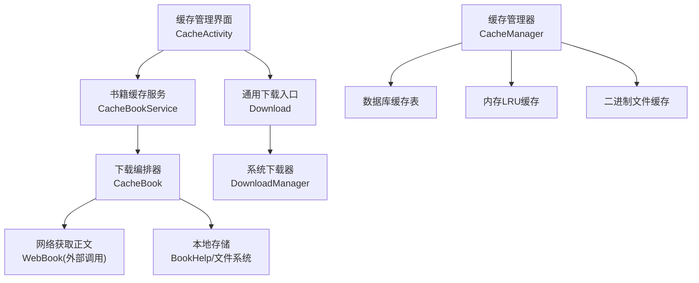
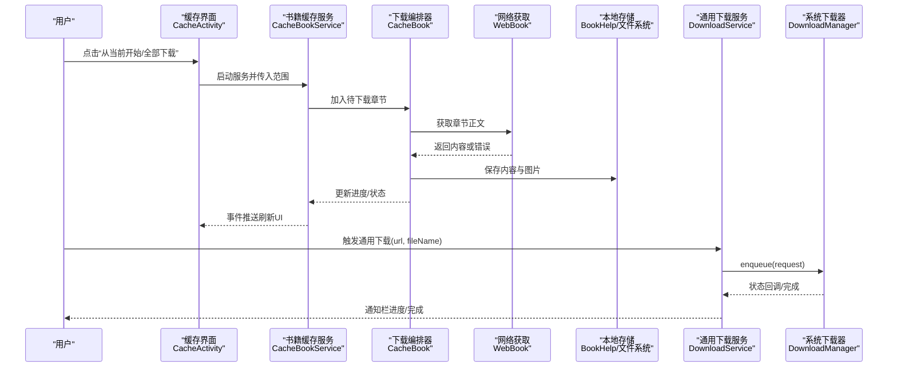
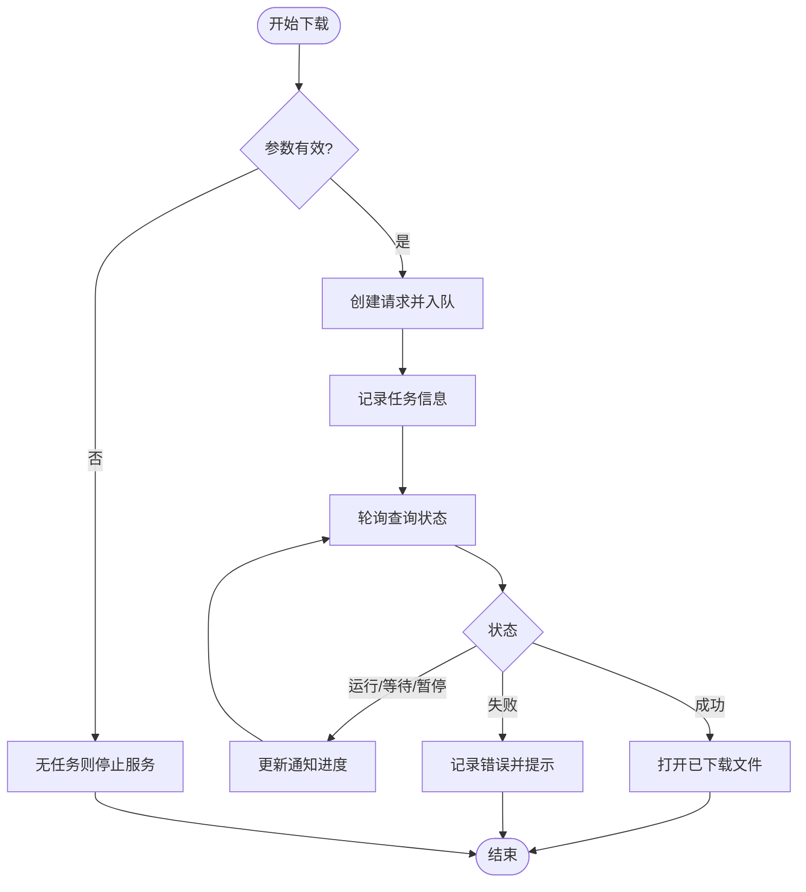
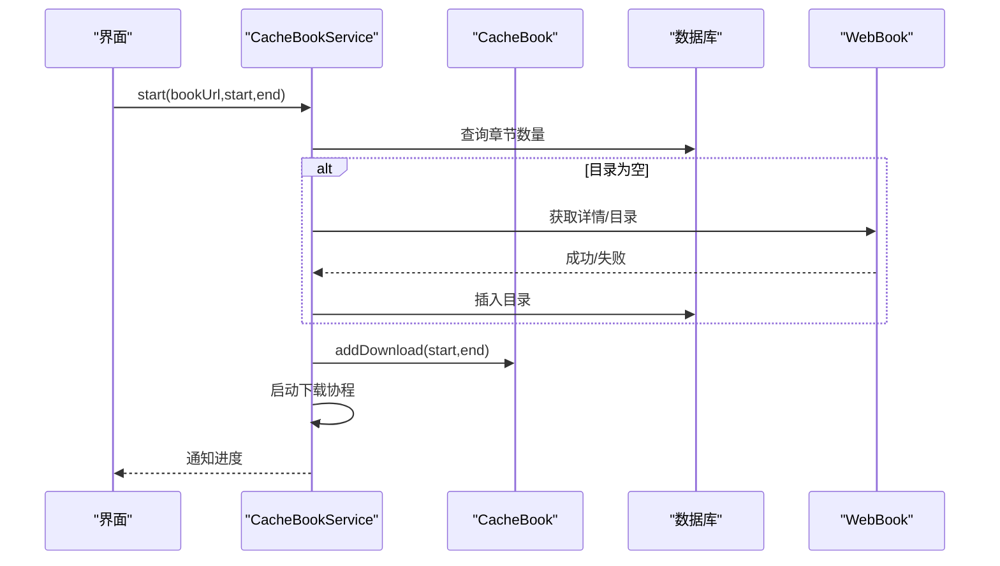
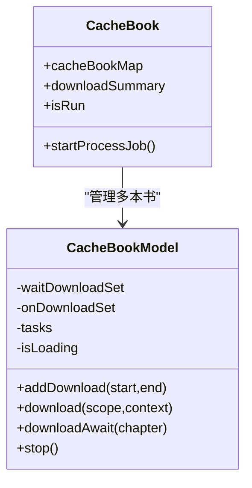
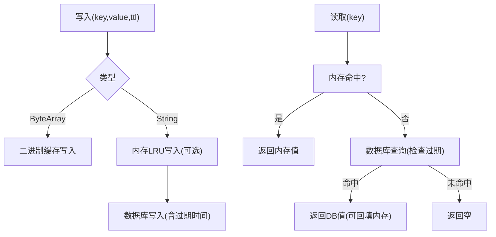
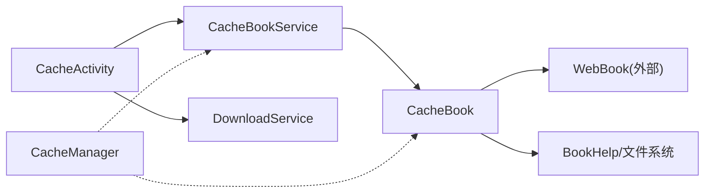

# 缓存下载系统

<cite>
**本文引用的文件**
- [DownloadService.kt](file://app/src/main/java/io/legado/app/service/DownloadService.kt)
- [Download.kt](file://app/src/main/java/io/legado/app/model/Download.kt)
- [CacheBookService.kt](file://app/src/main/java/io/legado/app/service/CacheBookService.kt)
- [CacheBook.kt](file://app/src/main/java/io/legado/app/model/CacheBook.kt)
- [CacheActivity.kt](file://app/src/main/java/io/legado/app/ui/book/cache/CacheActivity.kt)
- [CacheManager.kt](file://app/src/main/java/io/legado/app/help/CacheManager.kt)
- [BookCacheInfo.kt](file://app/src/main/java/io/legado/app/data/entities/BookCacheInfo.kt)
</cite>

## 目录
1. [简介](#简介)
2. [项目结构](#项目结构)
3. [核心组件](#核心组件)
4. [架构总览](#架构总览)
5. [详细组件分析](#详细组件分析)
6. [依赖关系分析](#依赖关系分析)
7. [性能考量](#性能考量)
8. [故障排查指南](#故障排查指南)
9. [结论](#结论)
10. [附录](#附录)

## 简介
本仓库包含一个完整的“缓存下载系统”，用于离线缓存书籍章节、管理下载任务、持久化与内存缓存，并提供用户界面进行批量操作。系统由以下关键部分组成：
- 通用文件下载服务：基于系统 DownloadManager 的后台下载能力，提供进度通知与完成处理。
- 书籍缓存服务：按书为单位组织章节下载，支持并发、重试、状态聚合与前台通知。
- 缓存管理器：统一的键值缓存入口，兼顾内存 LRU、数据库持久化与二进制文件缓存。
- 缓存管理界面：提供批量下载、导出、分组筛选等交互。

该系统的目标是提升阅读体验（离线可用）、降低网络开销（重复内容本地复用）并保证下载过程稳定可靠（失败重试、并发控制）。

## 项目结构
围绕缓存下载的核心代码主要位于 app 模块中，涉及 Service、Model、UI 与帮助类：
- 服务层：DownloadService（通用下载）、CacheBookService（书籍缓存下载）
- 模型层：CacheBook（任务编排、重试、统计）、Download（启动下载入口）
- 数据实体：BookCacheInfo（缓存目录命名与类型判断）
- 缓存工具：CacheManager（内存+磁盘+二进制）
- 界面：CacheActivity（列表、菜单、批量操作）

图表来源
- [CacheActivity.kt:124-182](file://app/src/main/java/io/legado/app/ui/book/cache/CacheActivity.kt#L124-L182)
- [CacheBookService.kt:77-169](file://app/src/main/java/io/legado/app/service/CacheBookService.kt#L77-L169)
- [CacheBook.kt:127-154](file://app/src/main/java/io/legado/app/model/CacheBook.kt#L127-L154)
- [DownloadService.kt:62-125](file://app/src/main/java/io/legado/app/service/DownloadService.kt#L62-L125)
- [CacheManager.kt:57-163](file://app/src/main/java/io/legado/app/help/CacheManager.kt#L57-L163)

章节来源
- [CacheActivity.kt:124-182](file://app/src/main/java/io/legado/app/ui/book/cache/CacheActivity.kt#L124-L182)
- [CacheBookService.kt:77-169](file://app/src/main/java/io/legado/app/service/CacheBookService.kt#L77-L169)
- [CacheBook.kt:127-154](file://app/src/main/java/io/legado/app/model/CacheBook.kt#L127-L154)
- [DownloadService.kt:62-125](file://app/src/main/java/io/legado/app/service/DownloadService.kt#L62-L125)
- [CacheManager.kt:57-163](file://app/src/main/java/io/legado/app/help/CacheManager.kt#L57-L163)

## 核心组件
- 通用下载服务（DownloadService）
  - 职责：接收 URL 与文件名，使用系统 DownloadManager 执行下载；维护下载任务集合；轮询查询状态；更新前台通知；完成后打开文件。
  - 关键点：隐藏通知、队列去重、错误提示、成功回调、取消下载。
- 书籍缓存服务（CacheBookService）
  - 职责：按书维度添加/移除下载任务；维护线程池；启动后台任务；更新前台通知；在任务结束后停止自身。
  - 关键点：并发线程数限制、通知聚合、事件上报、停止与清理。
- 下载编排器（CacheBook）
  - 职责：维护每本书的任务状态机（等待/进行中/加载目录）；并发调度；失败重试；成功/失败统计；与读取流程联动。
  - 关键点：流式调度、并发控制、重试策略、与 ReadBook 集成。
- 缓存管理器（CacheManager）
  - 职责：统一存取接口；内存 LRU + 数据库持久化 + 二进制文件缓存；过期时间控制；变量清理。
  - 关键点：避免 OOM、读写分离、TTL 控制。
- 缓存管理界面（CacheActivity）
  - 职责：展示书籍列表；提供“从当前开始”“全部下载”“导出”等操作；监听下载状态变化更新 UI。
  - 关键点：分组过滤、菜单配置、导出路径选择、事件驱动刷新。

章节来源
- [DownloadService.kt:35-279](file://app/src/main/java/io/legado/app/service/DownloadService.kt#L35-L279)
- [CacheBookService.kt:36-186](file://app/src/main/java/io/legado/app/service/CacheBookService.kt#L36-L186)
- [CacheBook.kt:42-469](file://app/src/main/java/io/legado/app/model/CacheBook.kt#L42-L469)
- [CacheManager.kt:25-206](file://app/src/main/java/io/legado/app/help/CacheManager.kt#L25-L206)
- [CacheActivity.kt:70-589](file://app/src/main/java/io/legado/app/ui/book/cache/CacheActivity.kt#L70-L589)

## 架构总览
整体采用“界面 -> 服务 -> 编排器 -> 网络/存储”的分层架构，结合系统级下载能力与自研并发控制，实现高可用的离线缓存。

图表来源
- [CacheActivity.kt:150-182](file://app/src/main/java/io/legado/app/ui/book/cache/CacheActivity.kt#L150-L182)
- [CacheBookService.kt:101-169](file://app/src/main/java/io/legado/app/service/CacheBookService.kt#L101-L169)
- [CacheBook.kt:314-387](file://app/src/main/java/io/legado/app/model/CacheBook.kt#L314-L387)
- [DownloadService.kt:89-125](file://app/src/main/java/io/legado/app/service/DownloadService.kt#L89-L125)

## 详细组件分析

### 通用下载服务（DownloadService）
- 功能要点
  - 通过 IntentAction.start 接收 url 与 fileName，创建 DownloadManager.Request 并设置隐藏通知与目标目录。
  - 维护 downloads 映射与 completeDownloads 集合，避免重复下载与重复打开。
  - 定时轮询查询状态，根据状态更新通知与完成动作。
  - 支持取消下载与删除通知。
- 错误处理
  - 捕获权限异常与一般异常，提示用户并记录日志。
- 性能与可靠性
  - 使用系统 DownloadManager，适合大文件或后台稳定下载。
  - 通知聚合与唯一 ID 避免重复通知。

图表来源
- [DownloadService.kt:89-125](file://app/src/main/java/io/legado/app/service/DownloadService.kt#L89-L125)
- [DownloadService.kt:152-224](file://app/src/main/java/io/legado/app/service/DownloadService.kt#L152-L224)

章节来源
- [DownloadService.kt:35-279](file://app/src/main/java/io/legado/app/service/DownloadService.kt#L35-L279)
- [Download.kt:8-19](file://app/src/main/java/io/legado/app/model/Download.kt#L8-L19)

### 书籍缓存服务（CacheBookService）
- 功能要点
  - 接收 bookUrl 与起止章节范围，初始化或更新对应 CacheBookModel。
  - 若目录为空且详情页失败，则移除任务并记录错误。
  - 使用固定大小线程池并发执行下载任务，完成后停止服务。
  - 前台通知显示汇总信息，支持取消操作。
- 并发与资源
  - 线程数受 AppConfig.threadCount 与最大线程上限约束。
  - 服务销毁时关闭线程池并释放资源。

图表来源
- [CacheBookService.kt:101-169](file://app/src/main/java/io/legado/app/service/CacheBookService.kt#L101-L169)

章节来源
- [CacheBookService.kt:36-186](file://app/src/main/java/io/legado/app/service/CacheBookService.kt#L36-L186)

### 下载编排器（CacheBook）
- 功能要点
  - 维护每本书的等待集与进行中集，避免重复下载。
  - 流式调度：不断发射未加载中的模型，按并发度并行执行。
  - 失败重试：非并发异常累计计数，最多重试三次。
  - 与读取流程联动：将已下载章节标记到 ReadBook，便于即时阅读。
- 数据结构与复杂度
  - 使用 LinkedHashSet 保持顺序与去重，查找/插入近似 O(1)。
  - 并发度由 AppConfig.threadCount 控制，避免过载。

图表来源
- [CacheBook.kt:42-154](file://app/src/main/java/io/legado/app/model/CacheBook.kt#L42-L154)
- [CacheBook.kt:193-469](file://app/src/main/java/io/legado/app/model/CacheBook.kt#L193-L469)

章节来源
- [CacheBook.kt:42-469](file://app/src/main/java/io/legado/app/model/CacheBook.kt#L42-L469)

### 缓存管理器（CacheManager）
- 功能要点
  - put/get 支持字符串与字节数组；字符串优先走内存 LRU，再回落到数据库；字节数组走二进制缓存。
  - 支持 TTL（秒），到期自动失效。
  - 提供 WebCacheManager 暴露给 JS 环境访问。
  - 清理源变量，防止内存泄漏。
- 复杂度与空间
  - 内存 LRU 上限约 50MB，sizeOf 估算对象大小。
  - 数据库持久化保证重启后仍可读取。

图表来源
- [CacheManager.kt:57-163](file://app/src/main/java/io/legado/app/help/CacheManager.kt#L57-L163)

章节来源
- [CacheManager.kt:25-206](file://app/src/main/java/io/legado/app/help/CacheManager.kt#L25-L206)

### 缓存管理界面（CacheActivity）
- 功能要点
  - 列表展示书籍，支持分组筛选与排序。
  - 菜单提供“从当前开始”“全部下载”“导出”等选项。
  - 监听 EventBus.UP_DOWNLOAD 与 UP_DOWNLOAD_STATE 更新按钮状态与条目。
  - 导出支持自定义路径、格式与编码。
- 交互流程
  - 选择导出文件夹 -> 校验写权限 -> 启动导出服务。
  - 批量下载前弹窗确认，避免误操作。

章节来源
- [CacheActivity.kt:70-589](file://app/src/main/java/io/legado/app/ui/book/cache/CacheActivity.kt#L70-L589)

## 依赖关系分析
- 界面依赖服务：CacheActivity 通过 Intent 启动 CacheBookService 与 DownloadService。
- 服务依赖编排器：CacheBookService 委托 CacheBook 进行任务编排与并发控制。
- 编排器依赖网络与存储：通过 WebBook 获取内容，通过 BookHelp 保存到本地。
- 缓存管理器独立：为各层提供统一缓存访问，解耦具体存储实现。

图表来源
- [CacheActivity.kt:150-182](file://app/src/main/java/io/legado/app/ui/book/cache/CacheActivity.kt#L150-L182)
- [CacheBookService.kt:101-169](file://app/src/main/java/io/legado/app/service/CacheBookService.kt#L101-L169)
- [CacheBook.kt:314-387](file://app/src/main/java/io/legado/app/model/CacheBook.kt#L314-L387)
- [CacheManager.kt:57-163](file://app/src/main/java/io/legado/app/help/CacheManager.kt#L57-L163)

章节来源
- [CacheActivity.kt:150-182](file://app/src/main/java/io/legado/app/ui/book/cache/CacheActivity.kt#L150-L182)
- [CacheBookService.kt:101-169](file://app/src/main/java/io/legado/app/service/CacheBookService.kt#L101-L169)
- [CacheBook.kt:314-387](file://app/src/main/java/io/legado/app/model/CacheBook.kt#L314-L387)
- [CacheManager.kt:57-163](file://app/src/main/java/io/legado/app/help/CacheManager.kt#L57-L163)

## 性能考量
- 并发控制
  - 书籍下载使用固定线程池，线程数受配置与上限限制，避免过多并发导致网络拥塞或崩溃。
- 重试机制
  - 非并发异常累计计数，最多重试三次，减少瞬时错误影响。
- 缓存策略
  - 内存 LRU 限制约 50MB，防止 OOM；数据库持久化保证重启可用；二进制缓存用于大对象。
- 通知与 UI
  - 使用前台服务与聚合通知，减少系统资源消耗与用户干扰。
- I/O 优化
  - 先检查本地是否已有内容，避免重复下载；图片与正文分别处理，提高命中率。

[本节为通用指导，不直接分析具体文件]

## 故障排查指南
- 下载失败
  - 检查存储权限与网络状态；查看 DownloadService 的错误提示与日志。
  - 对于书籍章节下载失败，关注重试次数与错误类型（并发异常不计入重试）。
- 无法打开文件
  - 确认 DownloadManager 已成功下载并生成 URI；检查文件类型识别逻辑。
- 内存压力
  - 观察 CacheManager 的内存 LRU 使用情况；必要时清理源变量或减少并发。
- 通知异常
  - 检查通知渠道配置与 ID 冲突；确保服务生命周期内正确注册/注销广播。

章节来源
- [DownloadService.kt:116-124](file://app/src/main/java/io/legado/app/service/DownloadService.kt#L116-L124)
- [CacheBook.kt:258-280](file://app/src/main/java/io/legado/app/model/CacheBook.kt#L258-L280)
- [CacheManager.kt:35-45](file://app/src/main/java/io/legado/app/help/CacheManager.kt#L35-L45)

## 结论
本缓存下载系统通过分层设计与系统能力结合，实现了稳定高效的离线缓存能力。其核心优势包括：
- 明确的职责划分：界面、服务、编排器各司其职。
- 可靠的并发与重试：保障在网络波动下的下载成功率。
- 灵活的缓存策略：内存与磁盘协同，兼顾性能与持久性。
- 友好的用户体验：前台通知、批量操作与导出能力完善。

建议后续优化方向：
- 引入更细粒度的速率限制与退避策略。
- 增强断点续传与增量更新能力。
- 扩展缓存清理策略（如按容量阈值回收）。

[本节为总结性内容，不直接分析具体文件]

## 附录
- 相关实体说明
  - BookCacheInfo：描述书籍缓存信息，提供目录命名规则与类型判断（本地/EPUB）。

章节来源
- [BookCacheInfo.kt:8-37](file://app/src/main/java/io/legado/app/data/entities/BookCacheInfo.kt#L8-L37)