# 网络请求与缓存

<cite>
**本文引用的文件**   
- [lib.rs](file://rust/legado-net/src/lib.rs)
- [client.rs](file://rust/legado-net/src/client.rs)
- [request.rs](file://rust/legado-net/src/request.rs)
- [response.rs](file://rust/legado-net/src/response.rs)
- [retry.rs](file://rust/legado-net/src/retry.rs)
- [cookie_store.rs](file://rust/legado-net/src/cookie_store.rs)
- [ssl_config.rs](file://rust/legado-net/src/ssl_config.rs)
- [middleware.rs](file://rust/legado-net/src/middleware.rs)
- [rate_limit.rs](file://rust/legado-net/src/rate_limit.rs)
- [proxy.rs](file://rust/legado-net/src/proxy.rs)
- [source_checker.rs](file://rust/legado-net/src/source_checker.rs)
- [regex_safe.rs](file://rust/legado-core/src/regex_safe.rs)
- [regex_engine.rs](file://rust/legado-parser/src/regex_engine.rs)
- [source_check_api.rs](file://rust/legado-ffi/src/api/source_check_api.rs)
- [cache_api.rs](file://rust/legado-ffi/src/api/cache_api.rs)
- [cookie_repository.rs](file://rust/legado-db/src/repository/cookie_repository.rs)
- [cache_repository.rs](file://rust/legado-db/src/repository/cache_repository.rs)
- [HttpTest.kt](file://app/src/androidTest/java/io/legado/app/HttpTest.kt)
- [cronet.json](file://app/src/main/assets/cronet.json)
</cite>

## 更新摘要
**所做更改**
- 新增安全正则表达式编译机制章节，详细说明正则表达式安全防护措施
- 更新网络源检查组件，集成安全正则表达式编译
- 增强正则表达式安全性说明，包括长度限制、嵌套深度防御和负缓存机制
- 更新依赖关系分析，包含新的正则表达式安全模块

## 目录
1. [简介](#简介)
2. [项目结构](#项目结构)
3. [核心组件](#核心组件)
4. [架构总览](#架构总览)
5. [详细组件分析](#详细组件分析)
6. [依赖关系分析](#依赖关系分析)
7. [性能考量](#性能考量)
8. [故障排查指南](#故障排查指南)
9. [结论](#结论)
10. [附录](#附录)

## 简介
本文件面向Legado项目的网络请求与缓存子系统，系统性说明HTTP客户端配置（连接池、超时、SSL证书管理）、缓存策略（内存/磁盘/智能失效）、重试机制（指数退避、熔断器、降级）、Cookie与会话保持（多站点同步与隐私保护）、监控调试（日志、性能分析、错误追踪），以及优化与安全最佳实践（连接复用、请求合并、带宽控制、HTTPS强制、证书固定、数据加密）。文档以代码级为依据，辅以可视化图示，帮助开发者快速理解并正确使用该子系统。

**更新** 本次更新重点增强了网络源检查过程中的正则表达式安全性，确保所有用户可控的正则表达式都通过统一的安全编译入口处理，防止栈溢出攻击和资源耗尽问题。

## 项目结构
Legado的网络能力由Rust模块legado-net提供核心实现，并通过FFI暴露给上层应用；Android端通过Cronet进行底层网络加速与缓存；数据库层负责持久化Cookie与缓存条目。关键目录与职责如下：
- Rust网络库（legado-net）：封装HTTP客户端、请求/响应模型、重试、中间件、速率限制、代理、SSL配置、Cookie存储、书源校验等。
- 正则表达式安全（legado-core）：提供统一的安全正则表达式编译入口，防止病态模式导致的崩溃。
- FFI接口（legado-ffi）：对外暴露缓存API和书源校验API等能力，供Kotlin/Java侧调用。
- Android端（app）：集成Cronet，提供测试用例与运行时配置。
- 数据库（legado-db）：持久化Cookie与缓存数据。

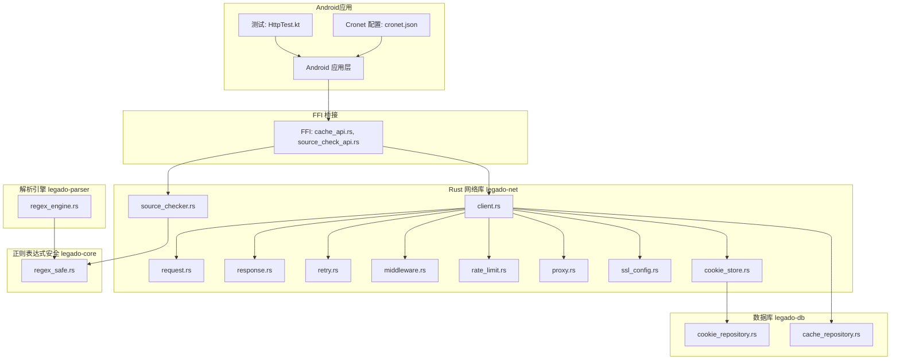

图表来源 
- [HttpTest.kt](file://app/src/androidTest/java/io/legado/app/HttpTest.kt)
- [cronet.json](file://app/src/main/assets/cronet.json)
- [cache_api.rs](file://rust/legado-ffi/src/api/cache_api.rs)
- [source_check_api.rs](file://rust/legado-ffi/src/api/source_check_api.rs)
- [client.rs](file://rust/legado-net/src/client.rs)
- [source_checker.rs](file://rust/legado-net/src/source_checker.rs)
- [regex_safe.rs](file://rust/legado-core/src/regex_safe.rs)
- [regex_engine.rs](file://rust/legado-parser/src/regex_engine.rs)

章节来源
- [lib.rs](file://rust/legado-net/src/lib.rs)
- [client.rs](file://rust/legado-net/src/client.rs)
- [request.rs](file://rust/legado-net/src/request.rs)
- [response.rs](file://rust/legado-net/src/response.rs)
- [retry.rs](file://rust/legado-net/src/retry.rs)
- [cookie_store.rs](file://rust/legado-net/src/cookie_store.rs)
- [ssl_config.rs](file://rust/legado-net/src/ssl_config.rs)
- [middleware.rs](file://rust/legado-net/src/middleware.rs)
- [rate_limit.rs](file://rust/legado-net/src/rate_limit.rs)
- [proxy.rs](file://rust/legado-net/src/proxy.rs)
- [source_checker.rs](file://rust/legado-net/src/source_checker.rs)
- [regex_safe.rs](file://rust/legado-core/src/regex_safe.rs)
- [regex_engine.rs](file://rust/legado-parser/src/regex_engine.rs)
- [source_check_api.rs](file://rust/legado-ffi/src/api/source_check_api.rs)
- [cache_api.rs](file://rust/legado-ffi/src/api/cache_api.rs)
- [cookie_repository.rs](file://rust/legado-db/src/repository/cookie_repository.rs)
- [cache_repository.rs](file://rust/legado-db/src/repository/cache_repository.rs)
- [HttpTest.kt](file://app/src/androidTest/java/io/legado/app/HttpTest.kt)
- [cronet.json](file://app/src/main/assets/cronet.json)

## 核心组件
- HTTP客户端（client.rs）：统一入口，负责构建请求、执行网络IO、组装响应、串联中间件与重试策略。
- 请求/响应模型（request.rs, response.rs）：定义请求头、参数、URL模板解析、响应体与头部处理。
- 重试与容错（retry.rs）：实现指数退避、熔断器与降级策略，保障稳定性。
- 中间件（middleware.rs）：横切关注点（鉴权、签名、压缩、日志等）的管道式扩展。
- 速率限制（rate_limit.rs）：按域名或全局限流，避免触发服务端限制。
- 代理（proxy.rs）：支持HTTP/SOCKS代理配置。
- SSL配置（ssl_config.rs）：证书校验、自定义CA、证书固定等安全设置。
- Cookie存储（cookie_store.rs + cookie_repository.rs）：跨域Cookie管理与持久化。
- 书源校验（source_checker.rs）：验证书源的搜索、目录、内容功能完整性。
- 安全正则表达式（regex_safe.rs）：统一的正则表达式编译入口，防止病态模式攻击。
- 正则表达式引擎（regex_engine.rs）：提供安全的正则匹配功能。
- FFI接口（cache_api.rs, source_check_api.rs）：对外暴露缓存读写能力和书源校验能力。
- Cronet集成（cronet.json）：Android端连接池、缓存、TLS等底层优化。

章节来源
- [client.rs](file://rust/legado-net/src/client.rs)
- [request.rs](file://rust/legado-net/src/request.rs)
- [response.rs](file://rust/legado-net/src/response.rs)
- [retry.rs](file://rust/legado-net/src/retry.rs)
- [middleware.rs](file://rust/legado-net/src/middleware.rs)
- [rate_limit.rs](file://rust/legado-net/src/rate_limit.rs)
- [proxy.rs](file://rust/legado-net/src/proxy.rs)
- [ssl_config.rs](file://rust/legado-net/src/ssl_config.rs)
- [cookie_store.rs](file://rust/legado-net/src/cookie_store.rs)
- [source_checker.rs](file://rust/legado-net/src/source_checker.rs)
- [regex_safe.rs](file://rust/legado-core/src/regex_safe.rs)
- [regex_engine.rs](file://rust/legado-parser/src/regex_engine.rs)
- [source_check_api.rs](file://rust/legado-ffi/src/api/source_check_api.rs)
- [cache_api.rs](file://rust/legado-ffi/src/api/cache_api.rs)
- [cookie_repository.rs](file://rust/legado-db/src/repository/cookie_repository.rs)
- [cache_repository.rs](file://rust/legado-db/src/repository/cache_repository.rs)
- [cronet.json](file://app/src/main/assets/cronet.json)

## 架构总览
整体采用"应用层 -> FFI -> Rust网络库 -> 系统网络栈/Cronet"的分层架构。Rust层提供可插拔的中间件与重试策略，Android层通过Cronet获得高性能网络能力，数据库层负责Cookie与缓存的持久化。**新增** 正则表达式安全层为所有用户可控的正则表达式提供统一的安全编译入口，防止恶意模式导致的系统崩溃。

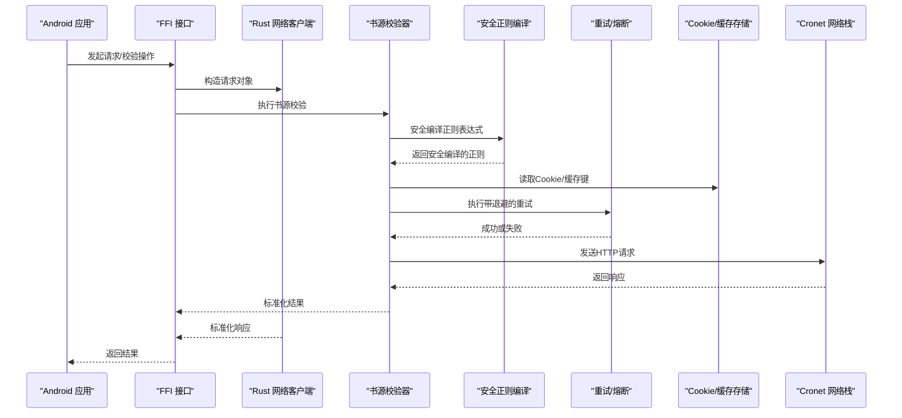

图表来源 
- [cache_api.rs](file://rust/legado-ffi/src/api/cache_api.rs)
- [source_check_api.rs](file://rust/legado-ffi/src/api/source_check_api.rs)
- [client.rs](file://rust/legado-net/src/client.rs)
- [source_checker.rs](file://rust/legado-net/src/source_checker.rs)
- [regex_safe.rs](file://rust/legado-core/src/regex_safe.rs)
- [retry.rs](file://rust/legado-net/src/retry.rs)
- [cookie_store.rs](file://rust/legado-net/src/cookie_store.rs)
- [cookie_repository.rs](file://rust/legado-db/src/repository/cookie_repository.rs)
- [cache_repository.rs](file://rust/legado-db/src/repository/cache_repository.rs)
- [cronet.json](file://app/src/main/assets/cronet.json)

## 详细组件分析

### HTTP客户端与连接池、超时、SSL配置
- 连接池与超时：Android端通过Cronet配置文件集中管理连接池大小、空闲超时、Keep-Alive策略与读写超时。建议在高频场景下增大连接池上限，合理设置读/写超时以避免阻塞。
- SSL证书管理：Rust层提供SSL配置模块，支持自定义CA、禁用主机名校验（仅调试用）、证书固定等。生产环境应启用严格校验与证书固定，防止中间人攻击。

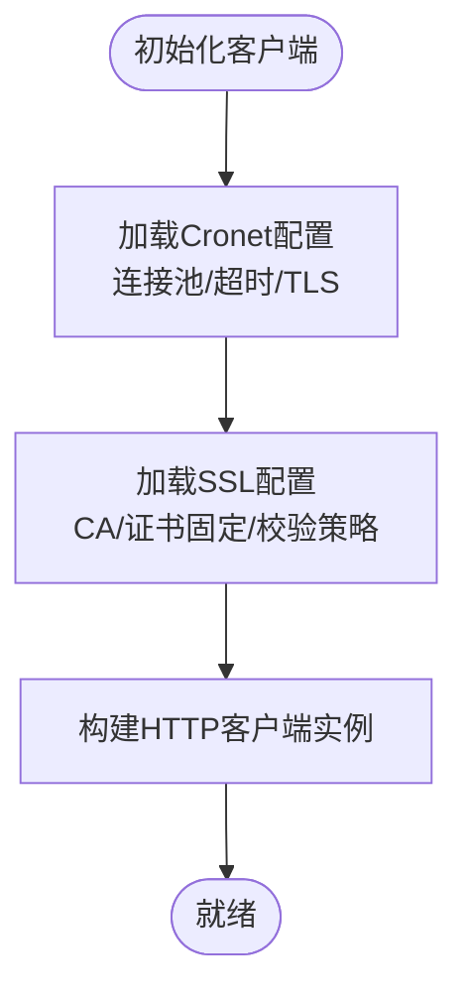

图表来源 
- [cronet.json](file://app/src/main/assets/cronet.json)
- [ssl_config.rs](file://rust/legado-net/src/ssl_config.rs)
- [client.rs](file://rust/legado-net/src/client.rs)

章节来源
- [client.rs](file://rust/legado-net/src/client.rs)
- [ssl_config.rs](file://rust/legado-net/src/ssl_config.rs)
- [cronet.json](file://app/src/main/assets/cronet.json)

### 安全正则表达式编译机制
**新增** Legado项目实现了统一的安全正则表达式编译机制，用于防护恶意或病态的正则表达式模式可能导致的栈溢出和资源耗尽攻击。

- **长度限制**：正则表达式模式长度限制为1KB（MAX_REGEX_PATTERN_LEN），超过此长度的模式会被直接拒绝。
- **嵌套深度防御**：使用regex_syntax的nest_limit(32)进行预解析，在真正编译前拦截过深的嵌套模式。
- **负缓存机制**：编译失败的非法模式会被永久缓存，避免重复触发编译过程。
- **独立线程编译**：在8MB栈大小的独立线程中进行正则编译，作为最后的兜底防护。

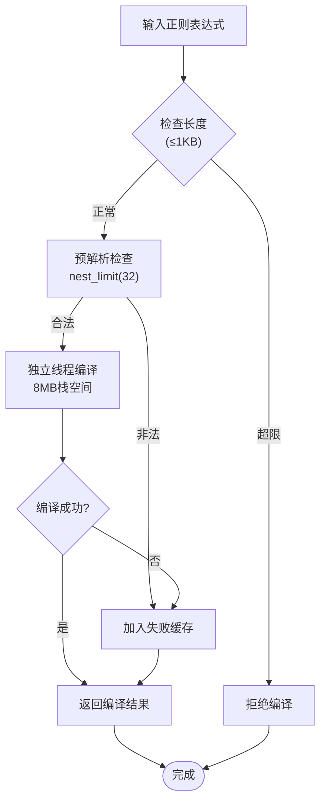

图表来源 
- [regex_safe.rs](file://rust/legado-core/src/regex_safe.rs)

章节来源
- [regex_safe.rs](file://rust/legado-core/src/regex_safe.rs)

### 网络源检查与安全正则集成
**更新** 网络源检查器现在集成了安全正则表达式编译机制，确保所有用户可控的正则表达式都经过安全检查。

- **书源规则验证**：在提取书籍链接时，使用`compile_regex_safe`安全编译`book_url_pattern`。
- **验证码检测**：通过关键词匹配检测各种类型的验证码，包括图片验证码、滑动验证、点击验证等。
- **重定向检测**：检测请求是否被重定向到登录页面或其他验证页面。
- **四步验证流程**：完整的书源验证包括搜索、详情、目录、正文四个阶段的检查。

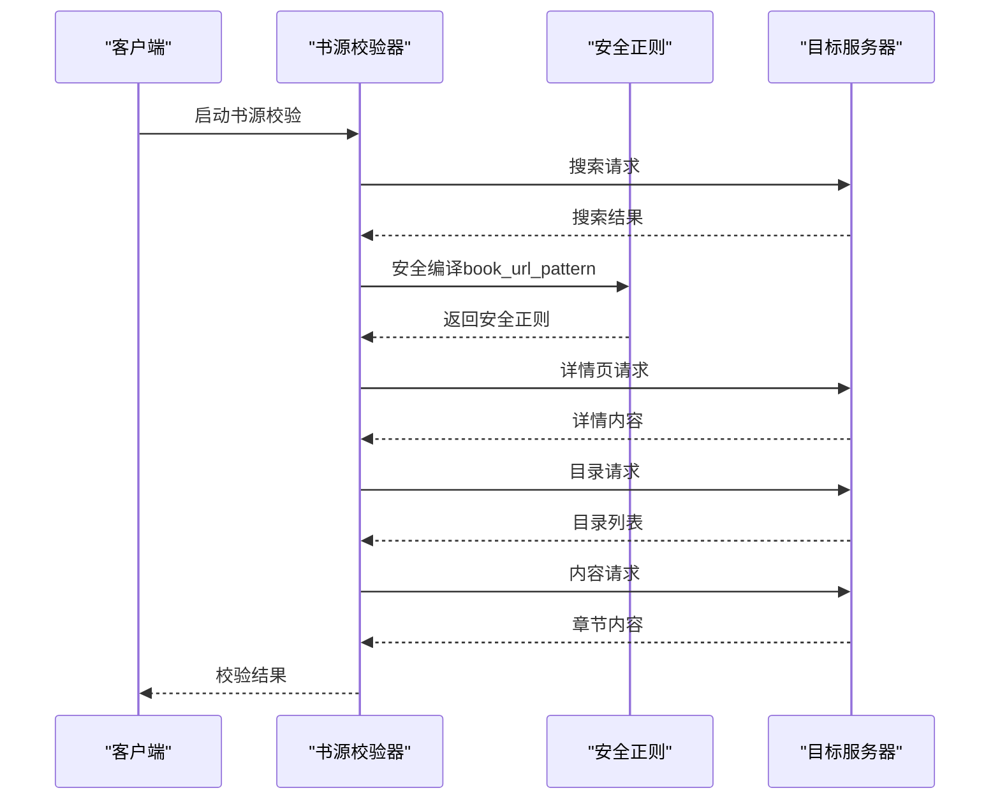

图表来源 
- [source_checker.rs](file://rust/legado-net/src/source_checker.rs)
- [regex_safe.rs](file://rust/legado-core/src/regex_safe.rs)

章节来源
- [source_checker.rs](file://rust/legado-net/src/source_checker.rs)
- [regex_safe.rs](file://rust/legado-core/src/regex_safe.rs)

### 缓存策略设计（内存、磁盘、智能失效）
- 内存缓存：适用于热点数据，低延迟但受限于内存容量。
- 磁盘缓存：通过数据库持久化缓存条目，支持TTL、LRU淘汰、按域名/路径分片。
- 智能失效：基于时间窗口、命中率统计与资源变更信号（如ETag/Last-Modified）触发局部刷新。

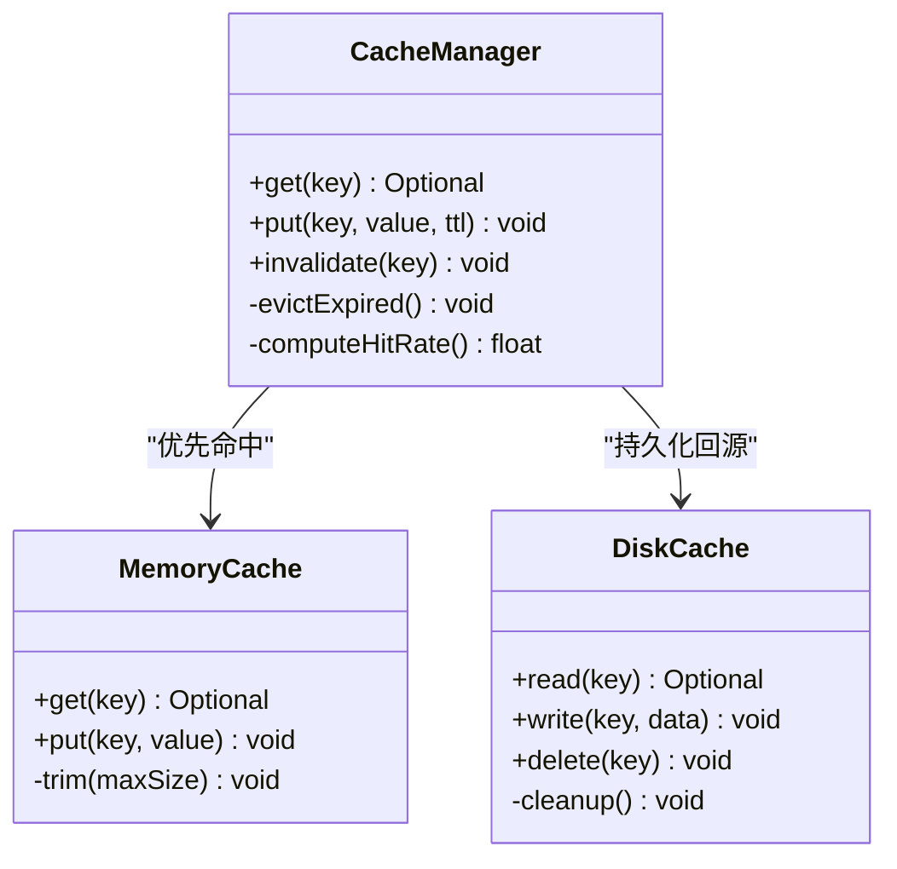

图表来源 
- [cache_api.rs](file://rust/legado-ffi/src/api/cache_api.rs)
- [cache_repository.rs](file://rust/legado-db/src/repository/cache_repository.rs)

章节来源
- [cache_api.rs](file://rust/legado-ffi/src/api/cache_api.rs)
- [cache_repository.rs](file://rust/legado-db/src/repository/cache_repository.rs)

### 请求重试机制（指数退避、熔断器、降级）
- 指数退避：对瞬时错误（网络抖动、5xx）采用递增等待时间重试，避免雪崩。
- 熔断器：当错误率超过阈值时快速失败，降低下游压力。
- 降级策略：在不可用时返回兜底数据或空结果，保证用户体验。

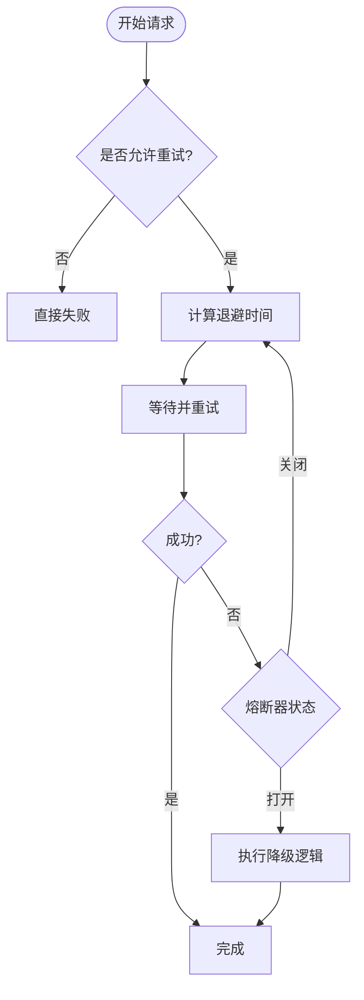

图表来源 
- [retry.rs](file://rust/legado-net/src/retry.rs)
- [client.rs](file://rust/legado-net/src/client.rs)

章节来源
- [retry.rs](file://rust/legado-net/src/retry.rs)
- [client.rs](file://rust/legado-net/src/client.rs)

### Cookie管理与会话保持（多站点同步与隐私保护）
- Cookie存储：Rust层维护Cookie存储，结合数据库持久化，支持按域隔离与过期清理。
- 多站点同步：通过统一的CookieJar与域名匹配规则，确保跨页面/跨子域登录态一致。
- 隐私保护：敏感Cookie标记为HttpOnly/Secure，必要时进行脱敏与最小化传输。

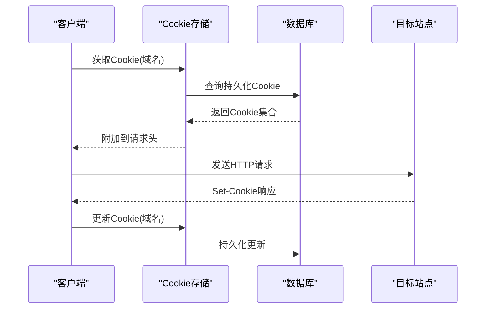

图表来源 
- [cookie_store.rs](file://rust/legado-net/src/cookie_store.rs)
- [cookie_repository.rs](file://rust/legado-db/src/repository/cookie_repository.rs)

章节来源
- [cookie_store.rs](file://rust/legado-net/src/cookie_store.rs)
- [cookie_repository.rs](file://rust/legado-db/src/repository/cookie_repository.rs)

### 网络监控与调试（日志、性能分析、错误追踪）
- 请求日志：中间件层记录请求/响应摘要、耗时、状态码与错误信息。
- 性能分析：统计QPS、P95/P99延迟、连接池利用率、缓存命中率。
- 错误追踪：聚合异常类型、堆栈与上下文，便于定位问题。

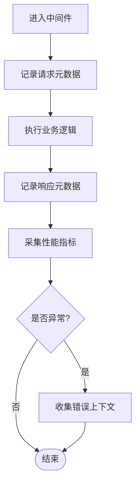

图表来源 
- [middleware.rs](file://rust/legado-net/src/middleware.rs)
- [client.rs](file://rust/legado-net/src/client.rs)

章节来源
- [middleware.rs](file://rust/legado-net/src/middleware.rs)
- [client.rs](file://rust/legado-net/src/client.rs)

### 网络优化最佳实践（连接复用、请求合并、带宽控制）
- 连接复用：启用HTTP Keep-Alive，合理设置连接池大小与空闲回收策略。
- 请求合并：对相同资源的并发请求去重，减少重复网络开销。
- 带宽控制：通过限速器与优先级队列控制吞吐，避免拥塞。

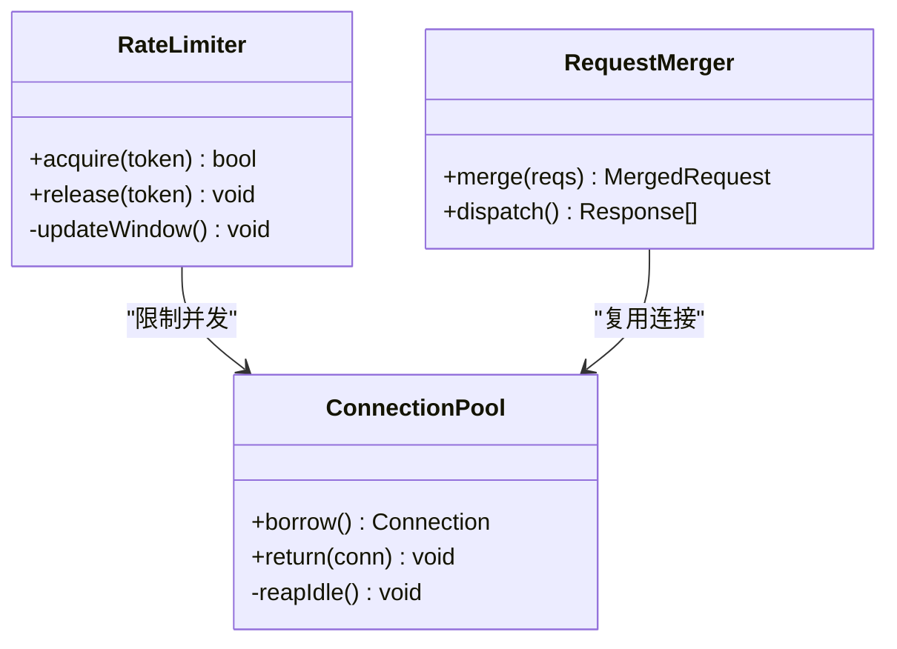

图表来源 
- [rate_limit.rs](file://rust/legado-net/src/rate_limit.rs)
- [client.rs](file://rust/legado-net/src/client.rs)

章节来源
- [rate_limit.rs](file://rust/legado-net/src/rate_limit.rs)
- [client.rs](file://rust/legado-net/src/client.rs)

### 网络安全考虑（HTTPS强制、证书固定、数据加密）
- HTTPS强制：拒绝明文HTTP，强制使用TLS。
- 证书固定：绑定可信公钥指纹，抵御证书伪造。
- 数据加密：对敏感字段进行端到端加密，避免泄露。

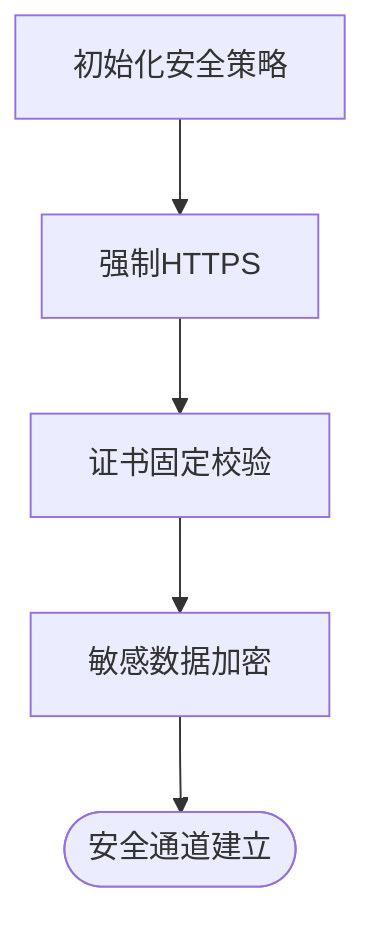

图表来源 
- [ssl_config.rs](file://rust/legado-net/src/ssl_config.rs)
- [client.rs](file://rust/legado-net/src/client.rs)

章节来源
- [ssl_config.rs](file://rust/legado-net/src/ssl_config.rs)
- [client.rs](file://rust/legado-net/src/client.rs)

## 依赖关系分析
Rust网络库内部模块间耦合清晰，外部依赖主要为Cronet与数据库持久化。FFI作为边界，屏蔽底层实现差异。**新增** 正则表达式安全模块为所有需要正则匹配的组件提供统一的安全编译入口。

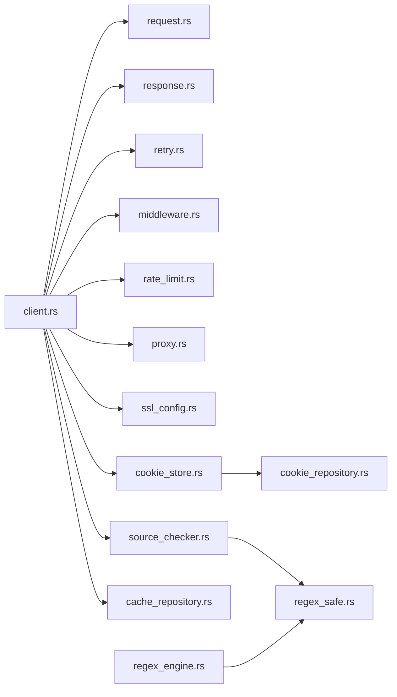

图表来源 
- [client.rs](file://rust/legado-net/src/client.rs)
- [request.rs](file://rust/legado-net/src/request.rs)
- [response.rs](file://rust/legado-net/src/response.rs)
- [retry.rs](file://rust/legado-net/src/retry.rs)
- [middleware.rs](file://rust/legado-net/src/middleware.rs)
- [rate_limit.rs](file://rust/legado-net/src/rate_limit.rs)
- [proxy.rs](file://rust/legado-net/src/proxy.rs)
- [ssl_config.rs](file://rust/legado-net/src/ssl_config.rs)
- [cookie_store.rs](file://rust/legado-net/src/cookie_store.rs)
- [source_checker.rs](file://rust/legado-net/src/source_checker.rs)
- [regex_safe.rs](file://rust/legado-core/src/regex_safe.rs)
- [regex_engine.rs](file://rust/legado-parser/src/regex_engine.rs)
- [cookie_repository.rs](file://rust/legado-db/src/repository/cookie_repository.rs)
- [cache_repository.rs](file://rust/legado-db/src/repository/cache_repository.rs)

章节来源
- [client.rs](file://rust/legado-net/src/client.rs)
- [source_checker.rs](file://rust/legado-net/src/source_checker.rs)
- [regex_safe.rs](file://rust/legado-core/src/regex_safe.rs)
- [regex_engine.rs](file://rust/legado-parser/src/regex_engine.rs)
- [cookie_repository.rs](file://rust/legado-db/src/repository/cookie_repository.rs)
- [cache_repository.rs](file://rust/legado-db/src/repository/cache_repository.rs)

## 性能考量
- 连接池调优：根据并发量与RTT调整最大连接数与空闲超时，避免过多连接导致内存占用过高。
- 缓存命中率：提升内存缓存命中率，减少磁盘IO与网络请求。
- 重试策略：合理设置最大重试次数与退避上限，避免放大错误流量。
- 带宽控制：在高并发场景下启用限速，避免拥塞丢包。
- 压缩与编码：启用Gzip/Brotli压缩，减少带宽消耗。
- **正则表达式性能**：利用编译结果缓存机制，避免重复编译相同的正则表达式模式。

[本节为通用指导，不直接分析具体文件]

## 故障排查指南
- 常见问题：
  - 连接超时：检查Cronet超时配置与服务器响应时间。
  - SSL握手失败：确认证书链与固定指纹是否正确。
  - Cookie丢失：检查域名匹配与过期策略。
  - 频繁重试：观察错误类型与熔断器状态。
  - **正则表达式崩溃**：检查是否有超长或过深嵌套的正则表达式模式。
- 诊断手段：
  - 开启详细日志，捕获请求/响应与中间件链路。
  - 统计性能指标，定位瓶颈。
  - 复现错误上下文，结合错误追踪定位根因。
  - **正则表达式调试**：使用安全编译入口的错误信息定位问题模式。

章节来源
- [middleware.rs](file://rust/legado-net/src/middleware.rs)
- [retry.rs](file://rust/legado-net/src/retry.rs)
- [ssl_config.rs](file://rust/legado-net/src/ssl_config.rs)
- [cookie_store.rs](file://rust/legado-net/src/cookie_store.rs)
- [regex_safe.rs](file://rust/legado-core/src/regex_safe.rs)

## 结论
Legado的网络与缓存子系统通过Rust层模块化设计与Android端Cronet的高性能网络栈相结合，提供了稳定、高效且安全的网络能力。**新增** 的安全正则表达式编译机制进一步增强了系统的健壮性，有效防止了恶意或病态正则表达式导致的系统崩溃风险。合理的连接池与超时配置、健壮的缓存与重试策略、完善的Cookie与会话管理、全面的监控调试与优化措施，共同保障了应用的可用性与用户体验。在生产环境中，应重点关注SSL安全、证书固定、数据加密以及正则表达式安全性，持续优化性能指标与错误率。

[本节为总结性内容，不直接分析具体文件]

## 附录
- 参考测试与配置：
  - Android端测试用例用于验证HTTP行为与缓存策略。
  - Cronet配置文件集中管理网络参数。
- **正则表达式安全测试**：
  - 包含对超长模式、深嵌套模式、非法模式的完整测试覆盖。
  - 验证负缓存机制的有效性。

章节来源
- [HttpTest.kt](file://app/src/androidTest/java/io/legado/app/HttpTest.kt)
- [cronet.json](file://app/src/main/assets/cronet.json)
- [regex_safe.rs](file://rust/legado-core/src/regex_safe.rs)