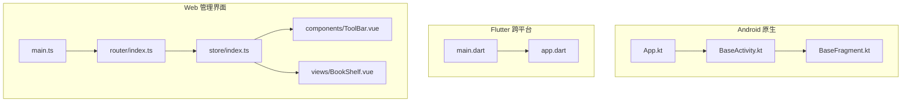
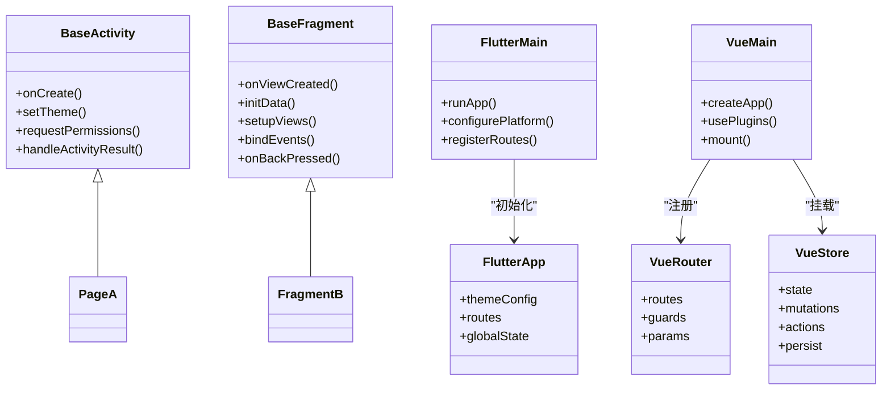
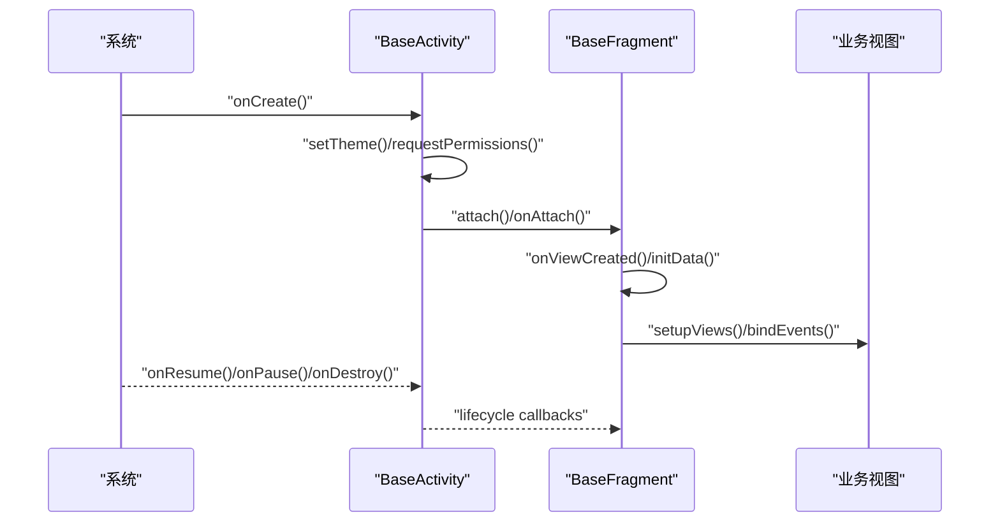
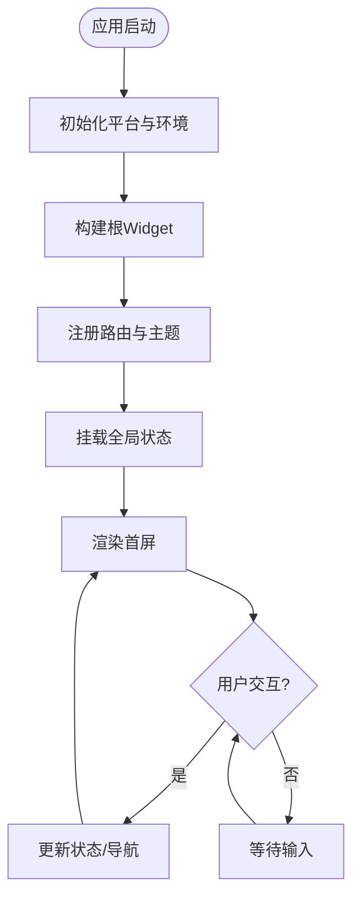
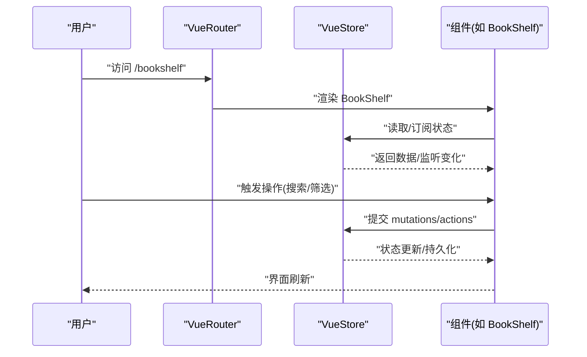
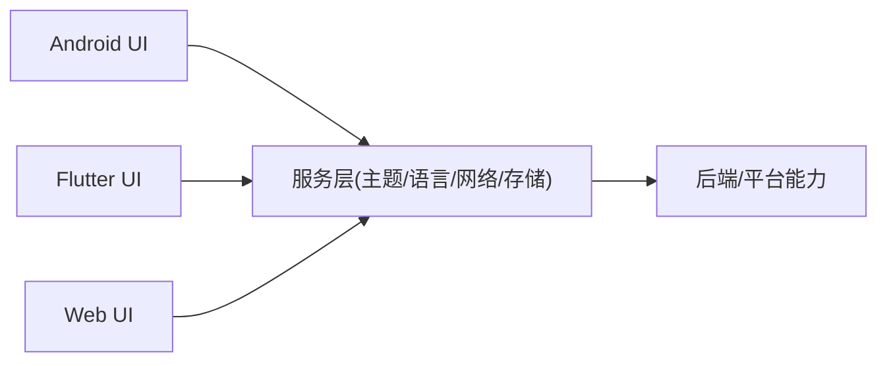
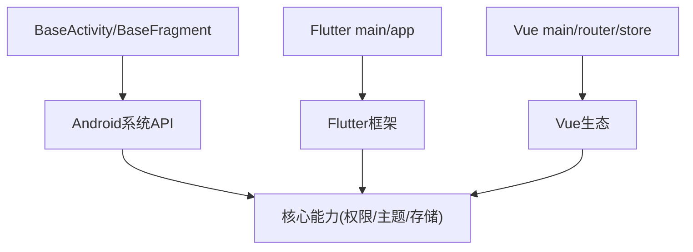

# 表现层设计

<cite>
**本文引用的文件**   
- [app/src/main/java/io/legado/app/base/BaseActivity.kt](file://app/src/main/java/io/legado/app/base/BaseActivity.kt)
- [app/src/main/java/io/legado/app/base/BaseFragment.kt](file://app/src/main/java/io/legado/app/base/BaseFragment.kt)
- [app/src/main/java/io/legado/app/App.kt](file://app/src/main/java/io/legado/app/App.kt)
- [flutter_legado/lib/main.dart](file://flutter_legado/lib/main.dart)
- [flutter_legado/lib/app.dart](file://flutter_legado/lib/app.dart)
- [modules/web/src/main.ts](file://modules/web/src/main.ts)
- [modules/web/src/router/index.ts](file://modules/web/src/router/index.ts)
- [modules/web/src/store/index.ts](file://modules/web/src/store/index.ts)
- [modules/web/src/components/ToolBar.vue](file://modules/web/src/components/ToolBar.vue)
- [modules/web/src/views/BookShelf.vue](file://modules/web/src/views/BookShelf.vue)
</cite>

## 目录
1. [简介](#简介)
2. [项目结构](#项目结构)
3. [核心组件](#核心组件)
4. [架构总览](#架构总览)
5. [详细组件分析](#详细组件分析)
6. [依赖分析](#依赖分析)
7. [性能考量](#性能考量)
8. [故障排查指南](#故障排查指南)
9. [结论](#结论)
10. [附录](#附录)

## 简介
本文件聚焦Legado应用的表现层设计，覆盖Android原生UI、Flutter跨平台UI与Web管理界面三大前端体系。文档从架构模式、基础组件复用、状态管理与路由、平台适配策略、生命周期与事件处理、响应式与多设备适配等方面展开，并给出扩展自定义UI组件的实践指引。

## 项目结构
Legado在表现层采用“多端并行”的架构：
- Android原生：以Kotlin为主，基于Activity/Fragment构建页面，配合资源与主题系统实现样式与布局。
- Flutter跨平台：通过Flutter工程提供Android/iOS/Web等多端一致的UI体验，使用Widget树组织界面，结合Provider/StatefulWidget进行状态管理。
- Web管理界面：基于Vue.js（Vite + TypeScript）构建，采用组件化、路由与Store进行状态持久化与模块化管理。

图表来源
- [app/src/main/java/io/legado/app/App.kt](file://app/src/main/java/io/legado/app/App.kt)
- [app/src/main/java/io/legado/app/base/BaseActivity.kt](file://app/src/main/java/io/legado/app/base/BaseActivity.kt)
- [app/src/main/java/io/legado/app/base/BaseFragment.kt](file://app/src/main/java/io/legado/app/base/BaseFragment.kt)
- [flutter_legado/lib/main.dart](file://flutter_legado/lib/main.dart)
- [flutter_legado/lib/app.dart](file://flutter_legado/lib/app.dart)
- [modules/web/src/main.ts](file://modules/web/src/main.ts)
- [modules/web/src/router/index.ts](file://modules/web/src/router/index.ts)
- [modules/web/src/store/index.ts](file://modules/web/src/store/index.ts)
- [modules/web/src/components/ToolBar.vue](file://modules/web/src/components/ToolBar.vue)
- [modules/web/src/views/BookShelf.vue](file://modules/web/src/views/BookShelf.vue)

章节来源
- [app/src/main/java/io/legado/app/App.kt](file://app/src/main/java/io/legado/app/App.kt)
- [flutter_legado/lib/main.dart](file://flutter_legado/lib/main.dart)
- [modules/web/src/main.ts](file://modules/web/src/main.ts)

## 核心组件
- Android基础组件
  - BaseActivity：统一生命周期封装、权限申请、主题切换、日志埋点、异常捕获等横切能力。
  - BaseFragment：统一Fragment初始化流程、懒加载、数据绑定、返回键处理、导航跳转等通用逻辑。
- Flutter入口与根组件
  - main.dart：Flutter应用启动、平台初始化、路由注册、全局配置注入。
  - app.dart：Material/Cupertino主题、国际化、路由表、全局状态容器挂载。
- Web管理界面
  - main.ts：Vue应用初始化、插件注册、路由与Store挂载、环境配置。
  - router/index.ts：页面路由定义、守卫、动态路由与参数传递。
  - store/index.ts：全局状态集中管理、持久化策略、模块划分。
  - components/ToolBar.vue：顶部工具栏组件，提供按钮、搜索、设置入口等。
  - views/BookShelf.vue：书架视图，聚合列表、筛选、分页与交互。

章节来源
- [app/src/main/java/io/legado/app/base/BaseActivity.kt](file://app/src/main/java/io/legado/app/base/BaseActivity.kt)
- [app/src/main/java/io/legado/app/base/BaseFragment.kt](file://app/src/main/java/io/legado/app/base/BaseFragment.kt)
- [flutter_legado/lib/main.dart](file://flutter_legado/lib/main.dart)
- [flutter_legado/lib/app.dart](file://flutter_legado/lib/app.dart)
- [modules/web/src/main.ts](file://modules/web/src/main.ts)
- [modules/web/src/router/index.ts](file://modules/web/src/router/index.ts)
- [modules/web/src/store/index.ts](file://modules/web/src/store/index.ts)
- [modules/web/src/components/ToolBar.vue](file://modules/web/src/components/ToolBar.vue)
- [modules/web/src/views/BookShelf.vue](file://modules/web/src/views/BookShelf.vue)

## 架构总览
表现层采用“分层+模块化”的设计：
- Android层：以BaseActivity/BaseFragment为基类，向上派生业务页面；通过资源与主题系统实现样式与行为解耦。
- Flutter层：以Widget树为核心，通过Provider/StatefulWidget管理状态，利用路由与平台通道对接原生能力。
- Web层：以Vue组件为粒度，Router负责页面导航，Store负责状态与持久化，组件间通过props/events或Store通信。

图表来源
- [app/src/main/java/io/legado/app/base/BaseActivity.kt](file://app/src/main/java/io/legado/app/base/BaseActivity.kt)
- [app/src/main/java/io/legado/app/base/BaseFragment.kt](file://app/src/main/java/io/legado/app/base/BaseFragment.kt)
- [flutter_legado/lib/main.dart](file://flutter_legado/lib/main.dart)
- [flutter_legado/lib/app.dart](file://flutter_legado/lib/app.dart)
- [modules/web/src/main.ts](file://modules/web/src/main.ts)
- [modules/web/src/router/index.ts](file://modules/web/src/router/index.ts)
- [modules/web/src/store/index.ts](file://modules/web/src/store/index.ts)

## 详细组件分析

### Android基础组件：BaseActivity与BaseFragment
- 设计模式
  - 模板方法：在基类中定义生命周期骨架，子类重写具体步骤。
  - 职责分离：横切关注点（权限、主题、日志、异常）集中在基类，业务页面专注UI与交互。
- 生命周期与事件
  - BaseActivity统一处理创建、恢复、销毁、结果回调；BaseFragment统一处理视图创建、数据初始化、事件绑定与返回键拦截。
- 复用机制
  - 通过抽象方法与默认实现组合，减少重复代码；通过接口回调与LiveData/Flow进行数据驱动更新。

图表来源
- [app/src/main/java/io/legado/app/base/BaseActivity.kt](file://app/src/main/java/io/legado/app/base/BaseActivity.kt)
- [app/src/main/java/io/legado/app/base/BaseFragment.kt](file://app/src/main/java/io/legado/app/base/BaseFragment.kt)

章节来源
- [app/src/main/java/io/legado/app/base/BaseActivity.kt](file://app/src/main/java/io/legado/app/base/BaseActivity.kt)
- [app/src/main/java/io/legado/app/base/BaseFragment.kt](file://app/src/main/java/io/legado/app/base/BaseFragment.kt)

### Flutter跨平台UI层：Widget树、状态管理与平台适配
- Widget树结构
  - 以main.dart为入口，构建根Widget，注册路由与主题；app.dart定义全局配置、状态容器与路由表。
- 状态管理
  - 使用Provider/StatefulWidget对局部与全局状态进行管理；通过ChangeNotifier或Riverpod等方案实现响应式更新。
- 平台适配
  - 通过platform channel调用原生能力；根据平台类型选择不同UI组件与行为。

图表来源
- [flutter_legado/lib/main.dart](file://flutter_legado/lib/main.dart)
- [flutter_legado/lib/app.dart](file://flutter_legado/lib/app.dart)

章节来源
- [flutter_legado/lib/main.dart](file://flutter_legado/lib/main.dart)
- [flutter_legado/lib/app.dart](file://flutter_legado/lib/app.dart)

### Web管理界面：Vue.js组件架构、路由与状态持久化
- 组件通信
  - 父子组件通过props与events通信；兄弟组件通过Store共享状态。
- 路由管理
  - router/index.ts定义路由表、守卫与参数传递；支持动态路由与嵌套路由。
- 状态持久化
  - store/index.ts集中管理状态，结合本地存储实现持久化；模块化的actions/mutations保证状态变更可追踪。

图表来源
- [modules/web/src/router/index.ts](file://modules/web/src/router/index.ts)
- [modules/web/src/store/index.ts](file://modules/web/src/store/index.ts)
- [modules/web/src/views/BookShelf.vue](file://modules/web/src/views/BookShelf.vue)

章节来源
- [modules/web/src/main.ts](file://modules/web/src/main.ts)
- [modules/web/src/router/index.ts](file://modules/web/src/router/index.ts)
- [modules/web/src/store/index.ts](file://modules/web/src/store/index.ts)
- [modules/web/src/components/ToolBar.vue](file://modules/web/src/components/ToolBar.vue)
- [modules/web/src/views/BookShelf.vue](file://modules/web/src/views/BookShelf.vue)

### 各平台UI层的统一抽象与差异处理策略
- 统一抽象
  - 将通用能力（主题、语言、权限、网络、存储）抽象为服务层，供各平台UI调用。
- 差异处理
  - Android：基于资源与主题系统，使用XML布局与Kotlin代码控制。
  - Flutter：通过Widget与平台通道实现跨端一致性与平台特性。
  - Web：通过Vue组件与浏览器API实现功能，必要时通过后端接口桥接。

[本节为概念性说明，不直接分析具体文件]

## 依赖分析
- Android层依赖
  - BaseActivity/BaseFragment依赖系统API与第三方库（如权限、主题、日志）。
- Flutter层依赖
  - main.dart/app.dart依赖Flutter框架与插件（如路由、状态管理、平台通道）。
- Web层依赖
  - main.ts/router/index.ts/store/index.ts依赖Vue生态（Vue Router、Pinia/Vuex、Axios等）。

图表来源
- [app/src/main/java/io/legado/app/base/BaseActivity.kt](file://app/src/main/java/io/legado/app/base/BaseActivity.kt)
- [app/src/main/java/io/legado/app/base/BaseFragment.kt](file://app/src/main/java/io/legado/app/base/BaseFragment.kt)
- [flutter_legado/lib/main.dart](file://flutter_legado/lib/main.dart)
- [flutter_legado/lib/app.dart](file://flutter_legado/lib/app.dart)
- [modules/web/src/main.ts](file://modules/web/src/main.ts)
- [modules/web/src/router/index.ts](file://modules/web/src/router/index.ts)
- [modules/web/src/store/index.ts](file://modules/web/src/store/index.ts)

章节来源
- [app/src/main/java/io/legado/app/base/BaseActivity.kt](file://app/src/main/java/io/legado/app/base/BaseActivity.kt)
- [app/src/main/java/io/legado/app/base/BaseFragment.kt](file://app/src/main/java/io/legado/app/base/BaseFragment.kt)
- [flutter_legado/lib/main.dart](file://flutter_legado/lib/main.dart)
- [flutter_legado/lib/app.dart](file://flutter_legado/lib/app.dart)
- [modules/web/src/main.ts](file://modules/web/src/main.ts)
- [modules/web/src/router/index.ts](file://modules/web/src/router/index.ts)
- [modules/web/src/store/index.ts](file://modules/web/src/store/index.ts)

## 性能考量
- Android
  - 避免在主线程执行耗时操作；合理使用RecyclerView与DiffUtil；减少不必要的布局层级。
- Flutter
  - 使用const Widget与不可变数据提升重建效率；按需加载与缓存图片；避免过度setState。
- Web
  - 组件懒加载与路由级分包；使用虚拟滚动处理大数据列表；合理序列化与持久化策略。

[本节为通用指导，不直接分析具体文件]

## 故障排查指南
- Android
  - 检查BaseActivity/BaseFragment的生命周期是否正确调用；确认权限请求与结果回调是否处理。
- Flutter
  - 检查路由注册与参数传递；确认状态更新是否触发正确的rebuild；查看平台通道错误。
- Web
  - 检查路由守卫与权限校验；确认Store状态变更是否被正确持久化；查看网络请求与错误处理。

章节来源
- [app/src/main/java/io/legado/app/base/BaseActivity.kt](file://app/src/main/java/io/legado/app/base/BaseActivity.kt)
- [app/src/main/java/io/legado/app/base/BaseFragment.kt](file://app/src/main/java/io/legado/app/base/BaseFragment.kt)
- [flutter_legado/lib/main.dart](file://flutter_legado/lib/main.dart)
- [flutter_legado/lib/app.dart](file://flutter_legado/lib/app.dart)
- [modules/web/src/router/index.ts](file://modules/web/src/router/index.ts)
- [modules/web/src/store/index.ts](file://modules/web/src/store/index.ts)

## 结论
Legado的表现层通过Android、Flutter与Web三端协同，形成统一的UI架构。BaseActivity/BaseFragment提供Android基础能力，Flutter以Widget树与状态管理实现跨端一致性，Web通过Vue组件化与Store实现灵活的状态与路由管理。通过统一抽象与差异处理策略，各端既能复用核心能力，又能发挥平台优势。

[本节为总结性内容，不直接分析具体文件]

## 附录
- 扩展自定义UI组件示例路径
  - Android：参考BaseActivity/BaseFragment的继承与重写方式，新增业务页面或Fragment。
  - Flutter：在app.dart中注册新路由与组件，使用Provider/StatefulWidget管理状态。
  - Web：在components与views下新增组件，通过router与store集成到应用中。

章节来源
- [app/src/main/java/io/legado/app/base/BaseActivity.kt](file://app/src/main/java/io/legado/app/base/BaseActivity.kt)
- [app/src/main/java/io/legado/app/base/BaseFragment.kt](file://app/src/main/java/io/legado/app/base/BaseFragment.kt)
- [flutter_legado/lib/app.dart](file://flutter_legado/lib/app.dart)
- [modules/web/src/components/ToolBar.vue](file://modules/web/src/components/ToolBar.vue)
- [modules/web/src/views/BookShelf.vue](file://modules/web/src/views/BookShelf.vue)