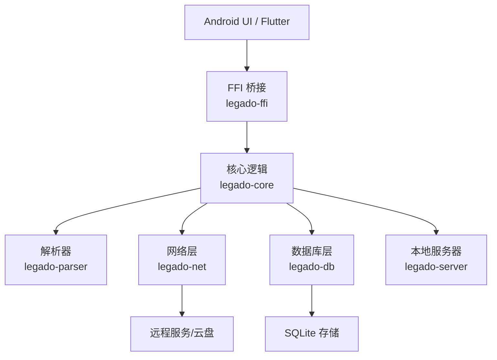
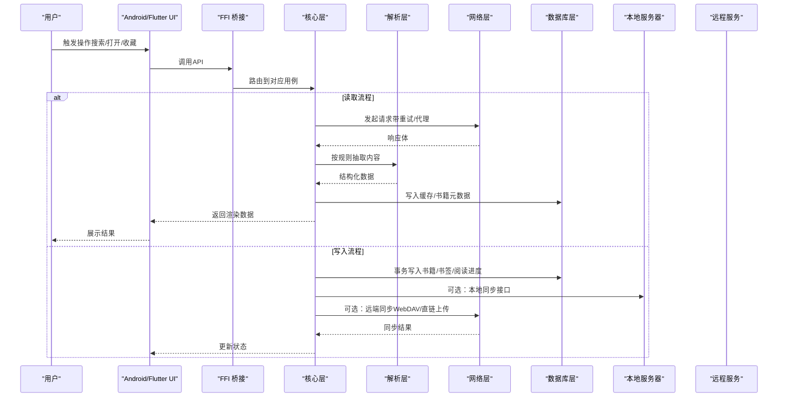
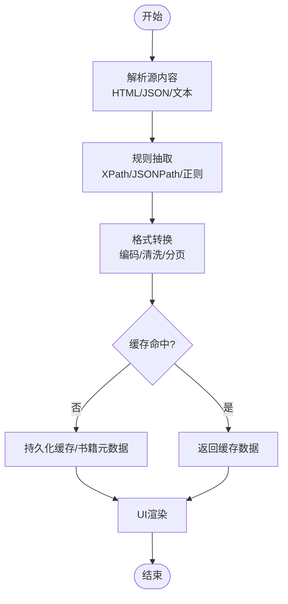
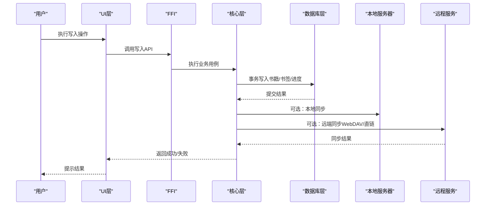
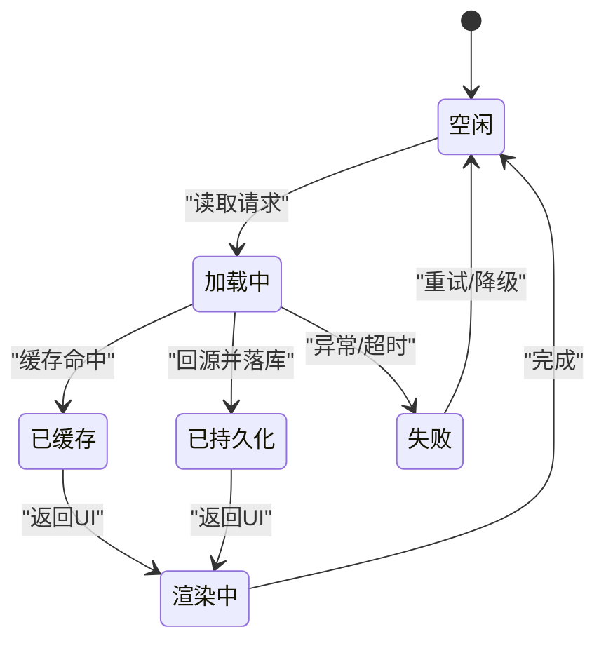
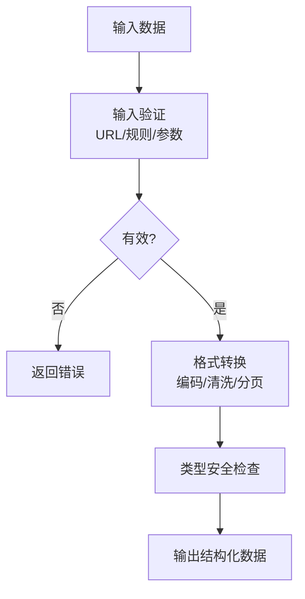
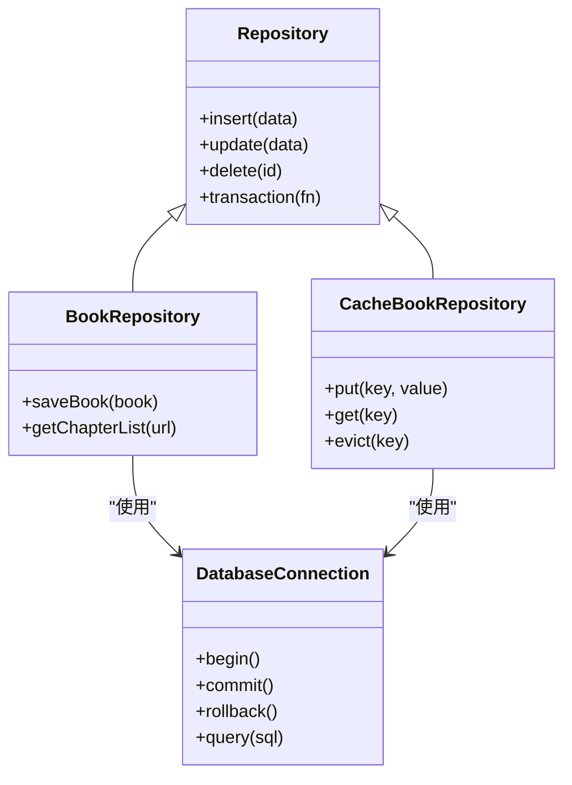
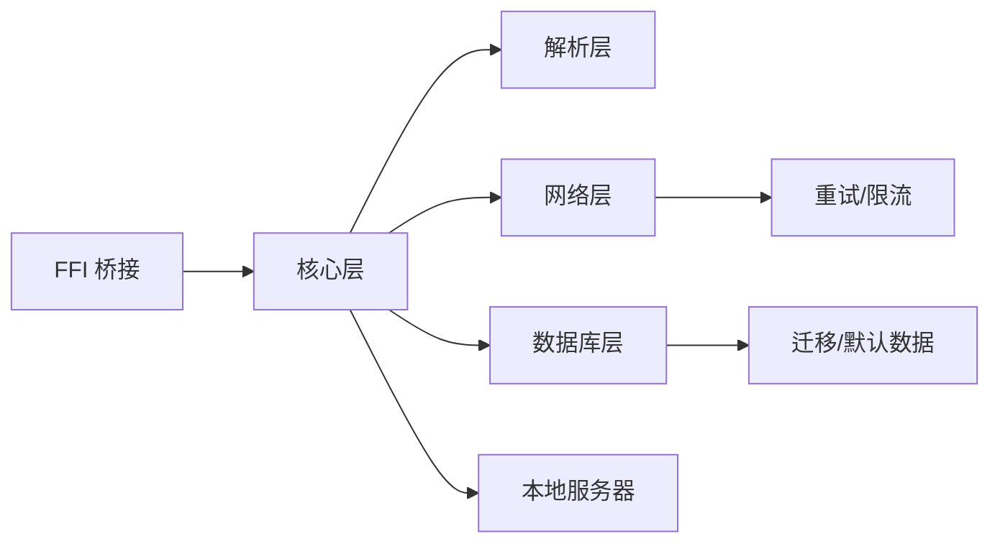

# 数据流设计

<cite>
**本文引用的文件**   
- [App.kt](file://app/src/main/java/io/legado/app/App.kt)
- [lib.rs (Rust核心)](file://rust/legado-core/src/lib.rs)
- [lib.rs (FFI桥接)](file://rust/legado-ffi/src/lib.rs)
- [bridge.rs](file://rust/legado-ffi/src/bridge.rs)
- [db_state.rs](file://rust/legado-ffi/src/db_state.rs)
- [repository mod](file://rust/legado-db/src/repository/mod.rs)
- [book_repository.rs](file://rust/legado-db/src/repository/book_repository.rs)
- [cache_book_repository.rs](file://rust/legado-db/src/repository/cache_book_repository.rs)
- [connection.rs](file://rust/legado-db/src/connection.rs)
- [migration.rs](file://rust/legado-db/src/migration.rs)
- [client.rs](file://rust/legado-net/src/client.rs)
- [request.rs](file://rust/legado-net/src/request.rs)
- [response.rs](file://rust/legado-net/src/response.rs)
- [retry.rs](file://rust/legado-net/src/retry.rs)
- [analyze_rule.rs](file://rust/legado-parser/src/analyze_rule.rs)
- [rule_analyzer.rs](file://rust/legado-parser/src/rule_analyzer.rs)
- [html.rs](file://rust/legado-parser/src/html.rs)
- [jsonpath.rs](file://rust/legado-parser/src/jsonpath.rs)
- [content_processor.rs](file://rust/legado-core/src/content_processor.rs)
- [cache_book.rs](file://rust/legado-core/src/cache_book.rs)
- [read_state.rs](file://rust/legado-core/src/read_state.rs)
- [download_manager.rs](file://rust/legado-core/src/download_manager.rs)
- [server_api.rs](file://rust/legado-ffi/src/api/server_api.rs)
- [backup_api.rs](file://rust/legado-ffi/src/api/backup_api.rs)
- [webdav.rs](file://rust/legado-net/src/webdav.rs)
- [direct_link_upload.rs](file://rust/legado-net/src/direct_link_upload.rs)
- [AppDatabase schema](file://app/cronetlib/schemas/io.legado.app.data.AppDatabase/1.json)
</cite>

## 目录
1. [简介](#简介)
2. [项目结构](#项目结构)
3. [核心组件](#核心组件)
4. [架构总览](#架构总览)
5. [详细组件分析](#详细组件分析)
6. [依赖关系分析](#依赖关系分析)
7. [性能考量](#性能考量)
8. [故障排查指南](#故障排查指南)
9. [结论](#结论)
10. [附录](#附录)

## 简介
本文件面向Legado应用的数据流设计与实现，聚焦从用户输入到数据存储的完整路径，覆盖读取与写入两大流程、状态管理与同步策略、数据验证与转换机制、并发与一致性保障，以及监控与优化方法。文档以“文件解析→内容提取→格式转换→缓存存储→UI展示”的读取链路和“用户操作→状态更新→持久化存储→同步上传”的写入链路为主线，结合Rust核心库、网络层、数据库层与Android/Frontend交互进行系统化说明。

## 项目结构
Legado采用多语言混合架构：Android/Kotlin作为上层入口与UI，Rust提供高性能核心（解析、网络、数据库、FFI桥接），Web端用于管理界面与调试。关键目录职责如下：
- app: Android应用入口、资源、测试与构建配置
- rust: Rust核心库与模块（core/net/parser/db/ffi/server）
- modules: 第三方或扩展模块（如epub等）
- flutter_legado: Flutter跨平台前端（可选）
- web: Web管理端（Vue+TS）

**图表来源** 
- [lib.rs (Rust核心)](file://rust/legado-core/src/lib.rs)
- [lib.rs (FFI桥接)](file://rust/legado-ffi/src/lib.rs)
- [client.rs](file://rust/legado-net/src/client.rs)
- [connection.rs](file://rust/legado-db/src/connection.rs)

**章节来源**
- [App.kt](file://app/src/main/java/io/legado/app/App.kt)
- [lib.rs (Rust核心)](file://rust/legado-core/src/lib.rs)
- [lib.rs (FFI桥接)](file://rust/legado-ffi/src/lib.rs)

## 核心组件
- 解析层（legado-parser）：负责HTML/XPath/JSONPath规则解析与抽取，支持正则引擎与规则补全。
- 核心层（legado-core）：编排数据流，包含内容处理、阅读状态、下载管理、缓存模型等。
- 网络层（legado-net）：HTTP客户端、重试、代理、Cookie、SSL、WebDAV、直链上传等。
- 数据层（legado-db）：Repository模式封装SQLite访问，含迁移与默认数据。
- 桥接层（legado-ffi）：暴露给Kotlin/Flutter的API，统一错误与状态。
- 服务器（legado-server）：本地HTTP/WebSocket服务，供Web端与管理工具使用。

**章节来源**
- [analyze_rule.rs](file://rust/legado-parser/src/analyze_rule.rs)
- [rule_analyzer.rs](file://rust/legado-parser/src/rule_analyzer.rs)
- [content_processor.rs](file://rust/legado-core/src/content_processor.rs)
- [client.rs](file://rust/legado-net/src/client.rs)
- [repository mod](file://rust/legado-db/src/repository/mod.rs)
- [bridge.rs](file://rust/legado-ffi/src/bridge.rs)

## 架构总览
下图展示从UI到存储与远端的端到端数据流，包括读取与写入路径、缓存与同步。

**图表来源** 
- [bridge.rs](file://rust/legado-ffi/src/bridge.rs)
- [client.rs](file://rust/legado-net/src/client.rs)
- [analyze_rule.rs](file://rust/legado-parser/src/analyze_rule.rs)
- [book_repository.rs](file://rust/legado-db/src/repository/book_repository.rs)
- [server_api.rs](file://rust/legado-ffi/src/api/server_api.rs)
- [webdav.rs](file://rust/legado-net/src/webdav.rs)
- [direct_link_upload.rs](file://rust/legado-net/src/direct_link_upload.rs)

## 详细组件分析

### 读取数据流：文件解析→内容提取→格式转换→缓存存储→UI展示
- 文件解析：通过解析器对HTML/JSON等源内容进行规则匹配与抽取，支持XPath/JSONPath与正则。
- 内容提取：将抽取结果转换为领域模型（书籍、章节、内容片段）。
- 格式转换：统一编码、清理HTML、分页合并、图片替换等。
- 缓存存储：优先命中内存/磁盘缓存，未命中则回源并落库。
- UI展示：将结构化数据推送至UI层渲染。

**图表来源** 
- [analyze_rule.rs](file://rust/legado-parser/src/analyze_rule.rs)
- [rule_analyzer.rs](file://rust/legado-parser/src/rule_analyzer.rs)
- [content_processor.rs](file://rust/legado-core/src/content_processor.rs)
- [cache_book.rs](file://rust/legado-core/src/cache_book.rs)
- [book_repository.rs](file://rust/legado-db/src/repository/book_repository.rs)

**章节来源**
- [analyze_rule.rs](file://rust/legado-parser/src/analyze_rule.rs)
- [rule_analyzer.rs](file://rust/legado-parser/src/rule_analyzer.rs)
- [html.rs](file://rust/legado-parser/src/html.rs)
- [jsonpath.rs](file://rust/legado-parser/src/jsonpath.rs)
- [content_processor.rs](file://rust/legado-core/src/content_processor.rs)
- [cache_book.rs](file://rust/legado-core/src/cache_book.rs)
- [book_repository.rs](file://rust/legado-db/src/repository/book_repository.rs)

### 写入数据流：用户操作→状态更新→持久化存储→同步上传
- 用户操作：收藏、书签、阅读进度、设置变更等。
- 状态更新：在内存中维护当前会话状态，确保UI即时反馈。
- 持久化存储：通过Repository写入SQLite，必要时开启事务保证一致性。
- 同步上传：可选地通过本地服务器或远端协议（WebDAV/直链）同步。

**图表来源** 
- [book_repository.rs](file://rust/legado-db/src/repository/book_repository.rs)
- [cache_book_repository.rs](file://rust/legado-db/src/repository/cache_book_repository.rs)
- [server_api.rs](file://rust/legado-ffi/src/api/server_api.rs)
- [webdav.rs](file://rust/legado-net/src/webdav.rs)
- [direct_link_upload.rs](file://rust/legado-net/src/direct_link_upload.rs)

**章节来源**
- [book_repository.rs](file://rust/legado-db/src/repository/book_repository.rs)
- [cache_book_repository.rs](file://rust/legado-db/src/repository/cache_book_repository.rs)
- [server_api.rs](file://rust/legado-ffi/src/api/server_api.rs)
- [backup_api.rs](file://rust/legado-ffi/src/api/backup_api.rs)
- [webdav.rs](file://rust/legado-net/src/webdav.rs)
- [direct_link_upload.rs](file://rust/legado-net/src/direct_link_upload.rs)

### 状态管理：本地状态、服务器状态、缓存状态的同步策略
- 本地状态：内存中的会话级状态，保证UI快速响应；在退出或崩溃时可通过持久化恢复。
- 服务器状态：本地服务器提供读写接口，便于多进程/多端共享与调试。
- 缓存状态：基于键的缓存策略（TTL/容量限制），优先命中缓存，未命中回源并回填。
- 同步策略：写后失效或增量同步；冲突时以本地为主或协商合并（视场景而定）。

**图表来源** 
- [cache_book.rs](file://rust/legado-core/src/cache_book.rs)
- [read_state.rs](file://rust/legado-core/src/read_state.rs)
- [db_state.rs](file://rust/legado-ffi/src/db_state.rs)

**章节来源**
- [cache_book.rs](file://rust/legado-core/src/cache_book.rs)
- [read_state.rs](file://rust/legado-core/src/read_state.rs)
- [db_state.rs](file://rust/legado-ffi/src/db_state.rs)

### 数据验证与转换：输入验证、格式转换、类型安全
- 输入验证：URL合法性、规则语法校验、参数范围检查。
- 格式转换：编码检测与统一、HTML清洗、分页拼接、图片链接规范化。
- 类型安全：Rust强类型与枚举约束，避免非法状态；FFI边界做二次校验。

**图表来源** 
- [request.rs](file://rust/legado-net/src/request.rs)
- [response.rs](file://rust/legado-net/src/response.rs)
- [content_processor.rs](file://rust/legado-core/src/content_processor.rs)
- [rule_analyzer.rs](file://rust/legado-parser/src/rule_analyzer.rs)

**章节来源**
- [request.rs](file://rust/legado-net/src/request.rs)
- [response.rs](file://rust/legado-net/src/response.rs)
- [content_processor.rs](file://rust/legado-core/src/content_processor.rs)
- [rule_analyzer.rs](file://rust/legado-parser/src/rule_analyzer.rs)

### 并发访问控制与事务处理
- 并发控制：网络层使用连接池与限流；数据库层通过SQLite事务与锁机制保证一致性。
- 事务处理：写入操作包裹在事务中，失败回滚；读取可走快照或读锁。
- 重试与退避：网络请求失败自动重试，指数退避与熔断保护。

**图表来源** 
- [repository mod](file://rust/legado-db/src/repository/mod.rs)
- [book_repository.rs](file://rust/legado-db/src/repository/book_repository.rs)
- [cache_book_repository.rs](file://rust/legado-db/src/repository/cache_book_repository.rs)
- [connection.rs](file://rust/legado-db/src/connection.rs)

**章节来源**
- [repository mod](file://rust/legado-db/src/repository/mod.rs)
- [book_repository.rs](file://rust/legado-db/src/repository/book_repository.rs)
- [cache_book_repository.rs](file://rust/legado-db/src/repository/cache_book_repository.rs)
- [connection.rs](file://rust/legado-db/src/connection.rs)
- [retry.rs](file://rust/legado-net/src/retry.rs)

## 依赖关系分析
- FFI层依赖核心层API，核心层依赖解析、网络、数据库模块。
- 网络层依赖重试、代理、Cookie、SSL配置等子模块。
- 数据库层依赖连接管理与迁移脚本。
- 服务器层提供HTTP/WebSocket接口，供Web端与外部工具调用。

**图表来源** 
- [lib.rs (FFI桥接)](file://rust/legado-ffi/src/lib.rs)
- [lib.rs (Rust核心)](file://rust/legado-core/src/lib.rs)
- [client.rs](file://rust/legado-net/src/client.rs)
- [migration.rs](file://rust/legado-db/src/migration.rs)

**章节来源**
- [lib.rs (FFI桥接)](file://rust/legado-ffi/src/lib.rs)
- [lib.rs (Rust核心)](file://rust/legado-core/src/lib.rs)
- [client.rs](file://rust/legado-net/src/client.rs)
- [migration.rs](file://rust/legado-db/src/migration.rs)

## 性能考量
- 解析优化：规则预编译与缓存，减少重复计算；批量抽取降低IO开销。
- 网络优化：连接复用、压缩传输、合理超时与重试策略。
- 缓存策略：多级缓存（内存/磁盘/TTL），热点数据常驻内存。
- 数据库优化：索引设计、批量写入、事务合并、读写分离（若适用）。
- 监控指标：请求耗时、命中率、错误率、吞吐与延迟分布。

[本节为通用指导，不直接分析具体文件]

## 故障排查指南
- 常见问题：解析失败（规则不匹配）、网络超时/中断、数据库锁竞争、缓存不一致。
- 定位手段：启用详细日志、记录请求ID与上下文、导出错误堆栈。
- 修复建议：修正规则表达式、调整重试与超时参数、优化SQL与索引、清理过期缓存。
- 工具支持：本地服务器调试接口、备份与恢复工具、Web端诊断页面。

**章节来源**
- [error.rs (Rust核心)](file://rust/legado-core/src/error.rs)
- [server_api.rs](file://rust/legado-ffi/src/api/server_api.rs)
- [backup_api.rs](file://rust/legado-ffi/src/api/backup_api.rs)

## 结论
Legado的数据流设计以Rust为核心，结合解析、网络、数据库与FFI桥接，形成高内聚、低耦合的分层架构。读取与写入链路清晰，状态管理与同步策略完善，具备较强的可扩展性与稳定性。通过合理的缓存、事务与并发控制，以及完善的监控与优化手段，能够支撑大规模内容与高频交互场景。

[本节为总结性内容，不直接分析具体文件]

## 附录
- 数据库Schema示例：参考AppDatabase版本化schema文件，了解表结构与字段定义。
- 迁移策略：遵循语义化版本升级，确保向后兼容与数据无损迁移。
- 最佳实践：单一职责、明确边界、幂等写入、可观测性优先。

**章节来源**
- [AppDatabase schema](file://app/cronetlib/schemas/io.legado.app.data.AppDatabase/1.json)
- [migration.rs](file://rust/legado-db/src/migration.rs)