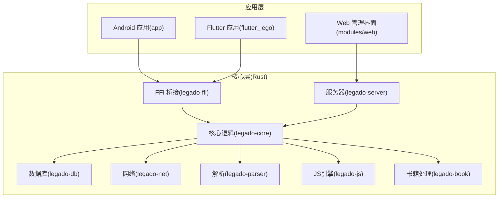
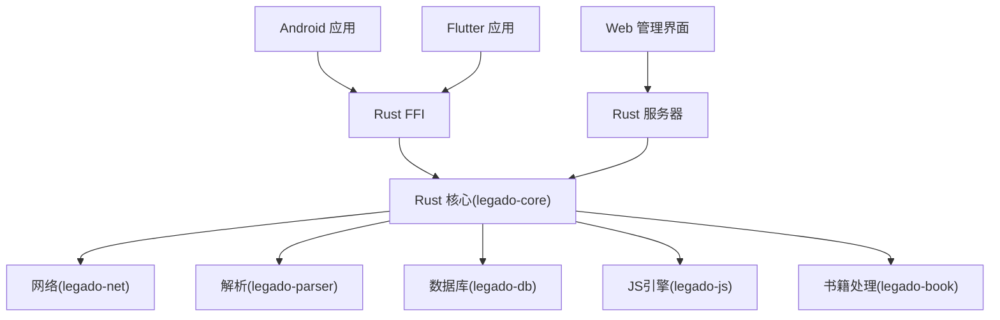
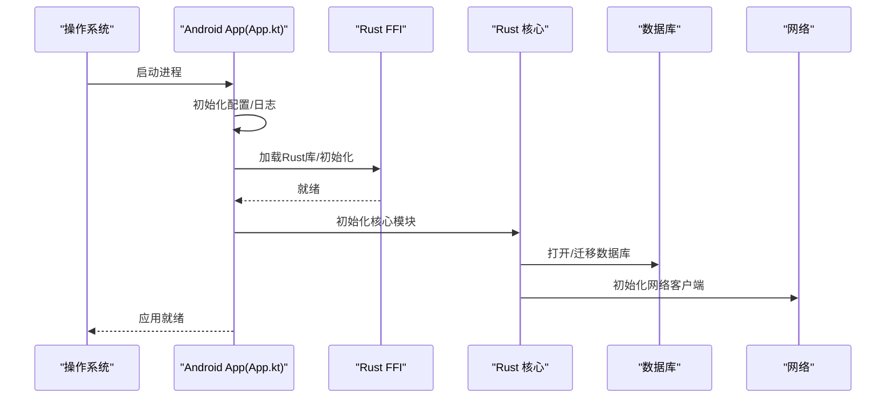
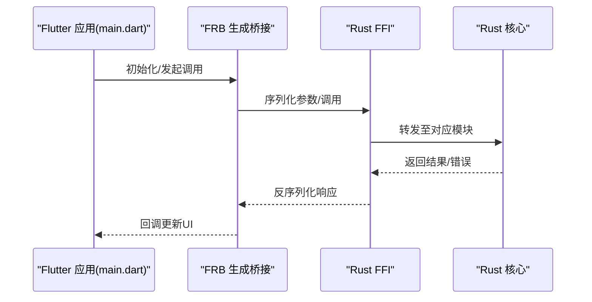
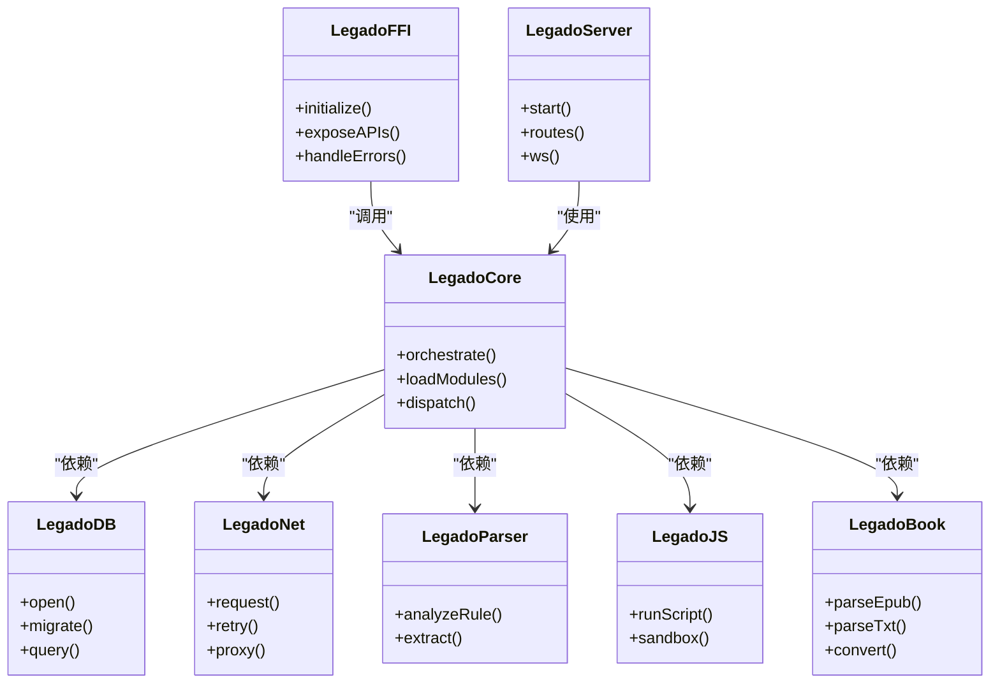
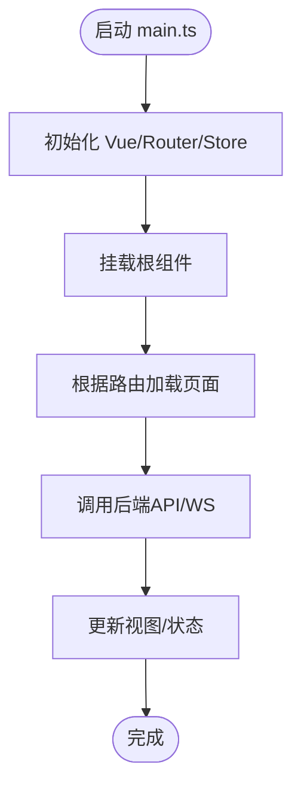
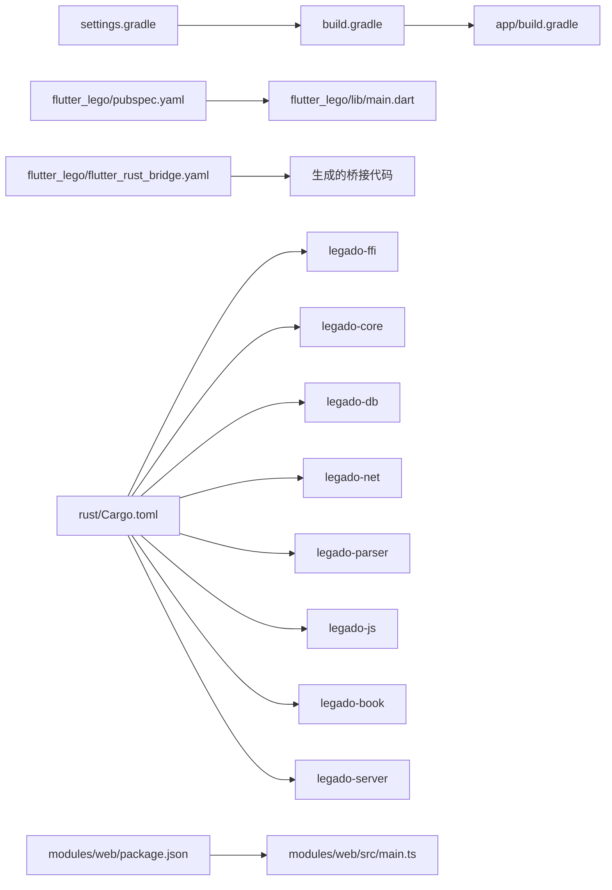

# 整体架构概览

<cite>
**本文引用的文件**   
- [app/src/main/java/io/legado/app/App.kt](file://app/src/main/java/io/legado/app/App.kt)
- [app/build.gradle](file://app/build.gradle)
- [build.gradle](file://build.gradle)
- [settings.gradle](file://settings.gradle)
- [flutter_lego/lib/main.dart](file://flutter_lego/lib/main.dart)
- [flutter_lego/pubspec.yaml](file://flutter_lego/pubspec.yaml)
- [flutter_lego/flutter_rust_bridge.yaml](file://flutter_lego/flutter_rust_bridge.yaml)
- [rust/Cargo.toml](file://rust/Cargo.toml)
- [rust/legado-ffi/src/lib.rs](file://rust/legado-ffi/src/lib.rs)
- [rust/legado-core/src/lib.rs](file://rust/legado-core/src/lib.rs)
- [rust/legado-db/src/lib.rs](file://rust/legado-db/src/lib.rs)
- [rust/legado-net/src/lib.rs](file://rust/legado-net/src/lib.rs)
- [rust/legado-parser/src/lib.rs](file://rust/legado-parser/src/lib.rs)
- [rust/legado-js/src/lib.rs](file://rust/legado-js/src/lib.rs)
- [rust/legado-book/src/lib.rs](file://rust/legado-book/src/lib.rs)
- [rust/legado-server/src/lib.rs](file://rust/legado-server/src/lib.rs)
- [modules/web/package.json](file://modules/web/package.json)
- [modules/web/vite.config.ts](file://modules/web/vite.config.ts)
- [modules/web/src/main.ts](file://modules/web/src/main.ts)
</cite>

## 目录
1. [简介](#简介)
2. [项目结构](#项目结构)
3. [核心组件](#核心组件)
4. [架构总览](#架构总览)
5. [详细组件分析](#详细组件分析)
6. [依赖关系分析](#依赖关系分析)
7. [性能考虑](#性能考虑)
8. [故障排查指南](#故障排查指南)
9. [结论](#结论)
10. [附录](#附录)

## 简介
本文件面向Legado应用的整体架构，围绕“多语言、多平台”的技术栈展开：Rust核心库、Android原生应用、Flutter跨平台应用、Vue.js Web管理界面。文档解释各技术栈的职责分工与协作方式，说明选择这些技术的理由与优势；梳理从Android App入口到Rust核心库加载的启动流程；阐述模块化设计原则（Cargo模块划分、Gradle依赖管理、Flutter包结构）；并提供系统架构图、数据流图以及可扩展性、可维护性与性能方面的建议。

## 项目结构
仓库采用多子工程组织：
- app：Android原生应用，负责UI、系统能力接入、资源管理与本地化。
- flutter_lego：Flutter跨平台应用，提供Android/iOS/Linux/macOS/Windows等多端统一体验。
- rust：Rust核心库，包含网络、解析、数据库、JS引擎、音频、导出/导入、服务器等能力，并通过FFI暴露给上层。
- modules/web：Vue.js Web管理界面，用于在线编辑与管理书源、书架等。
- gradle根配置与构建脚本：统一管理版本、依赖与构建流程。

图表来源
- [app/build.gradle](file://app/build.gradle)
- [flutter_lego/pubspec.yaml](file://flutter_lego/pubspec.yaml)
- [rust/Cargo.toml](file://rust/Cargo.toml)
- [modules/web/package.json](file://modules/web/package.json)

章节来源
- [app/build.gradle](file://app/build.gradle)
- [build.gradle](file://build.gradle)
- [settings.gradle](file://settings.gradle)
- [flutter_lego/pubspec.yaml](file://flutter_lego/pubspec.yaml)
- [rust/Cargo.toml](file://rust/Cargo.toml)
- [modules/web/package.json](file://modules/web/package.json)

## 核心组件
- Android应用（app）
  - 职责：应用生命周期、UI渲染、系统API调用、资源与国际化、Cronet网络加速集成、与Rust FFI交互。
  - 入口：App.kt作为Application子类，完成全局初始化与Rust库加载。
- Flutter应用（flutter_lego）
  - 职责：跨平台UI与业务编排，通过flutter_rust_bridge与Rust核心通信，复用同一套核心能力。
  - 入口：main.dart初始化框架并建立与Rust的桥接。
- Rust核心（rust）
  - 职责：将网络、解析、数据库、JS执行、音频、导出/导入、服务器等能力以安全稳定的FFI接口暴露给上层。
  - 模块：legado-ffi为对外边界；legado-core聚合业务；legado-db封装持久化；legado-net负责HTTP/代理/重试等；legado-parser实现规则与内容解析；legado-js提供沙箱化的JS执行环境；legado-book处理EPUB/TXT/PDF/MOBI/UMD等格式；legado-server提供HTTP/WS服务。
- Web管理界面（modules/web）
  - 职责：基于Vue.js+Vite的前端，通过REST/WebSocket与后端交互，用于书源编辑、调试与批量管理。

章节来源
- [app/src/main/java/io/legado/app/App.kt](file://app/src/main/java/io/legado/app/App.kt)
- [flutter_lego/lib/main.dart](file://flutter_lego/lib/main.dart)
- [rust/legado-ffi/src/lib.rs](file://rust/legado-ffi/src/lib.rs)
- [rust/legado-core/src/lib.rs](file://rust/legado-core/src/lib.rs)
- [rust/legado-db/src/lib.rs](file://rust/legado-db/src/lib.rs)
- [rust/legado-net/src/lib.rs](file://rust/legado-net/src/lib.rs)
- [rust/legado-parser/src/lib.rs](file://rust/legado-parser/src/lib.rs)
- [rust/legado-js/src/lib.rs](file://rust/legado-js/src/lib.rs)
- [rust/legado-book/src/lib.rs](file://rust/legado-book/src/lib.rs)
- [rust/legado-server/src/lib.rs](file://rust/legado-server/src/lib.rs)
- [modules/web/src/main.ts](file://modules/web/src/main.ts)

## 架构总览
Legado采用“前端多端 + Rust核心”的分层架构：
- 表现层：Android、Flutter、Web分别承担各自平台的UI与交互。
- 桥接层：Rust FFI提供稳定、类型安全的跨语言接口，屏蔽底层复杂性。
- 核心层：Rust模块按职责拆分，形成高内聚、低耦合的能力集合。
- 数据层：SQLite/ORM与缓存策略由legado-db统一管理。
- 网络层：legado-net提供统一的请求、重试、代理、Cookie与速率限制。
- 解析层：legado-parser支持XPath/JSONPath/正则等规则解析。
- 扩展层：legado-js允许用户脚本扩展行为，legado-book提供多格式书籍处理能力。
- 服务端：legado-server提供HTTP/WS接口，供Web管理界面与外部工具使用。

图表来源
- [app/src/main/java/io/legado/app/App.kt](file://app/src/main/java/io/legado/app/App.kt)
- [flutter_lego/lib/main.dart](file://flutter_lego/lib/main.dart)
- [rust/legado-ffi/src/lib.rs](file://rust/legado-ffi/src/lib.rs)
- [rust/legado-server/src/lib.rs](file://rust/legado-server/src/lib.rs)

## 详细组件分析

### Android应用与启动流程
- 入口点：App.kt作为Application子类，负责：
  - 初始化全局配置与日志
  - 加载Rust动态库（通过FFI）
  - 初始化数据库、网络、缓存等基础能力
  - 注册必要的系统服务与广播
- 启动序列：
  - 进程启动 -> Application.onCreate() -> 初始化Rust运行时 -> 暴露FFI接口 -> 上层业务按需调用

图表来源
- [app/src/main/java/io/legado/app/App.kt](file://app/src/main/java/io/legado/app/App.kt)
- [rust/legado-ffi/src/lib.rs](file://rust/legado-ffi/src/lib.rs)
- [rust/legado-core/src/lib.rs](file://rust/legado-core/src/lib.rs)
- [rust/legado-db/src/lib.rs](file://rust/legado-db/src/lib.rs)
- [rust/legado-net/src/lib.rs](file://rust/legado-net/src/lib.rs)

章节来源
- [app/src/main/java/io/legado/app/App.kt](file://app/src/main/java/io/legado/app/App.kt)

### Flutter跨平台应用
- 入口点：main.dart初始化Flutter框架，创建路由与状态管理，并通过flutter_rust_bridge与Rust核心通信。
- 包结构：遵循Flutter标准布局，src下按功能域划分，测试位于test目录。
- 与Rust交互：通过生成的bridge代码调用Rust函数，保证类型安全与异步回调。

图表来源
- [flutter_lego/lib/main.dart](file://flutter_lego/lib/main.dart)
- [flutter_lego/flutter_rust_bridge.yaml](file://flutter_lego/flutter_rust_bridge.yaml)
- [rust/legado-ffi/src/lib.rs](file://rust/legado-ffi/src/lib.rs)

章节来源
- [flutter_lego/lib/main.dart](file://flutter_lego/lib/main.dart)
- [flutter_lego/pubspec.yaml](file://flutter_lego/pubspec.yaml)
- [flutter_lego/flutter_rust_bridge.yaml](file://flutter_lego/flutter_rust_bridge.yaml)

### Rust核心库与模块划分
- FFI边界：legado-ffi定义对外函数与错误模型，负责内存安全与跨语言类型映射。
- 核心聚合：legado-core协调各子模块，提供高层API。
- 数据持久化：legado-db封装SQLite访问、迁移与默认数据注入。
- 网络能力：legado-net提供HTTP客户端、代理、重试、Cookie、速率限制等。
- 解析能力：legado-parser实现规则分析与内容提取。
- 脚本扩展：legado-js提供沙箱化的JS执行环境与宿主API。
- 书籍处理：legado-book支持多种电子书格式的读写与转换。
- 服务器：legado-server提供HTTP/WS接口，服务于Web管理界面与外部集成。

图表来源
- [rust/legado-ffi/src/lib.rs](file://rust/legado-ffi/src/lib.rs)
- [rust/legado-core/src/lib.rs](file://rust/legado-core/src/lib.rs)
- [rust/legado-db/src/lib.rs](file://rust/legado-db/src/lib.rs)
- [rust/legado-net/src/lib.rs](file://rust/legado-net/src/lib.rs)
- [rust/legado-parser/src/lib.rs](file://rust/legado-parser/src/lib.rs)
- [rust/legado-js/src/lib.rs](file://rust/legado-js/src/lib.rs)
- [rust/legado-book/src/lib.rs](file://rust/legado-book/src/lib.rs)
- [rust/legado-server/src/lib.rs](file://rust/legado-server/src/lib.rs)

章节来源
- [rust/Cargo.toml](file://rust/Cargo.toml)
- [rust/legado-ffi/src/lib.rs](file://rust/legado-ffi/src/lib.rs)
- [rust/legado-core/src/lib.rs](file://rust/legado-core/src/lib.rs)
- [rust/legado-db/src/lib.rs](file://rust/legado-db/src/lib.rs)
- [rust/legado-net/src/lib.rs](file://rust/legado-net/src/lib.rs)
- [rust/legado-parser/src/lib.rs](file://rust/legado-parser/src/lib.rs)
- [rust/legado-js/src/lib.rs](file://rust/legado-js/src/lib.rs)
- [rust/legado-book/src/lib.rs](file://rust/legado-book/src/lib.rs)
- [rust/legado-server/src/lib.rs](file://rust/legado-server/src/lib.rs)

### Vue.js Web管理界面
- 入口点：main.ts初始化Vue应用、路由与插件。
- 构建：Vite驱动开发/生产构建，package.json声明依赖与脚本。
- 通信：通过REST/WebSocket与Rust服务器交互，实现书源编辑、调试与批量操作。

图表来源
- [modules/web/src/main.ts](file://modules/web/src/main.ts)
- [modules/web/package.json](file://modules/web/package.json)
- [modules/web/vite.config.ts](file://modules/web/vite.config.ts)

章节来源
- [modules/web/src/main.ts](file://modules/web/src/main.ts)
- [modules/web/package.json](file://modules/web/package.json)
- [modules/web/vite.config.ts](file://modules/web/vite.config.ts)

## 依赖关系分析
- Gradle与设置
  - settings.gradle定义多模块工程结构。
  - build.gradle与app/build.gradle管理Android模块依赖、构建选项与打包产物。
- Flutter依赖
  - pubspec.yaml声明Flutter包依赖与插件，flutter_rust_bridge.yaml配置桥接生成。
- Rust工作区
  - Cargo.toml定义工作区成员与依赖，各子crate通过内部模块划分职责。
- Web依赖
  - package.json与vite.config.ts管理前端依赖与构建配置。

图表来源
- [settings.gradle](file://settings.gradle)
- [build.gradle](file://build.gradle)
- [app/build.gradle](file://app/build.gradle)
- [flutter_lego/pubspec.yaml](file://flutter_lego/pubspec.yaml)
- [flutter_lego/flutter_rust_bridge.yaml](file://flutter_lego/flutter_rust_bridge.yaml)
- [rust/Cargo.toml](file://rust/Cargo.toml)
- [modules/web/package.json](file://modules/web/package.json)

章节来源
- [settings.gradle](file://settings.gradle)
- [build.gradle](file://build.gradle)
- [app/build.gradle](file://app/build.gradle)
- [flutter_lego/pubspec.yaml](file://flutter_lego/pubspec.yaml)
- [flutter_lego/flutter_rust_bridge.yaml](file://flutter_lego/flutter_rust_bridge.yaml)
- [rust/Cargo.toml](file://rust/Cargo.toml)
- [modules/web/package.json](file://modules/web/package.json)

## 性能考虑
- Rust核心
  - 零成本抽象与内存安全，避免GC抖动；并发模型清晰，适合CPU密集任务（解析、转码）。
  - 通过legado-net实现连接池、重试与限流，降低网络抖动影响。
- Android
  - Cronet加速HTTP请求，减少首屏与列表加载延迟。
  - 数据库读写在后台线程，避免主线程阻塞。
- Flutter
  - 跨平台共享核心逻辑，减少重复实现；通过桥接调用Rust，避免在Dart侧做重型计算。
- Web
  - Vite快速热重载提升开发效率；静态资源优化与按需加载改善首屏时间。
- 总体
  - 分层解耦使热点路径可单独优化；FFI边界最小化数据传输，降低序列化开销。

[本节为通用指导，不直接分析具体文件]

## 故障排查指南
- Android启动失败
  - 检查App.kt中的初始化顺序与异常捕获；确认Rust库加载成功与FFI接口可用。
- Flutter桥接异常
  - 核对flutter_rust_bridge.yaml配置与生成代码是否最新；检查参数序列化与错误传播。
- Rust核心错误
  - 查看legado-ffi的错误模型与日志输出；定位具体模块（net/db/parser/js/book/server）。
- Web无法连接
  - 确认Rust服务器端口与路由；检查CORS与WebSocket握手；验证前端环境变量。

章节来源
- [app/src/main/java/io/legado/app/App.kt](file://app/src/main/java/io/legado/app/App.kt)
- [flutter_lego/flutter_rust_bridge.yaml](file://flutter_lego/flutter_rust_bridge.yaml)
- [rust/legado-ffi/src/lib.rs](file://rust/legado-ffi/src/lib.rs)
- [rust/legado-server/src/lib.rs](file://rust/legado-server/src/lib.rs)
- [modules/web/src/main.ts](file://modules/web/src/main.ts)

## 结论
Legado通过“多端前端 + Rust核心”的架构实现了高性能、可维护与可扩展的目标：
- 多端覆盖：Android、Flutter、Web各司其职，复用同一核心能力。
- 模块化清晰：Cargo与Gradle协同管理依赖，职责边界明确。
- 性能与安全：Rust提供稳定高效的底层能力，FFI确保跨语言安全交互。
- 可扩展性：JS脚本与服务器接口便于生态扩展与第三方集成。

[本节为总结性内容，不直接分析具体文件]

## 附录
- 术语
  - FFI：跨语言接口，用于Rust与其他语言互操作。
  - FRB：flutter_rust_bridge，用于Flutter与Rust的类型安全桥接。
- 最佳实践
  - 保持FFI接口稳定，变更需版本化管理。
  - 核心逻辑下沉至Rust，前端专注UI与交互。
  - 网络与IO操作统一在legado-net中管理，避免分散实现。

[本节为补充信息，不直接分析具体文件]