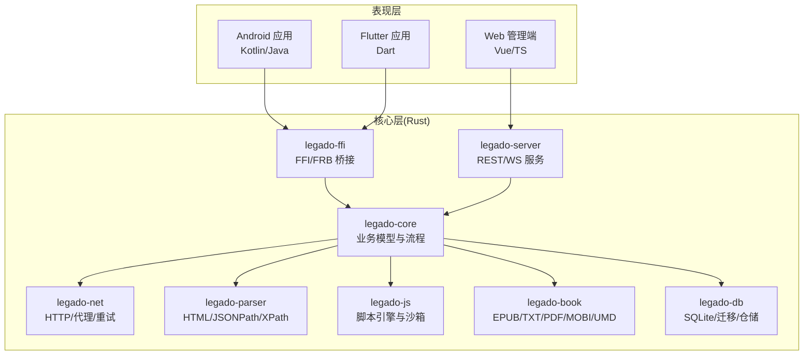
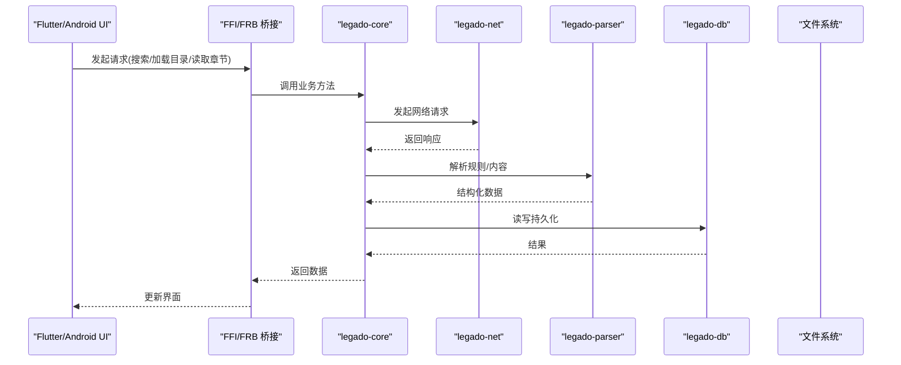
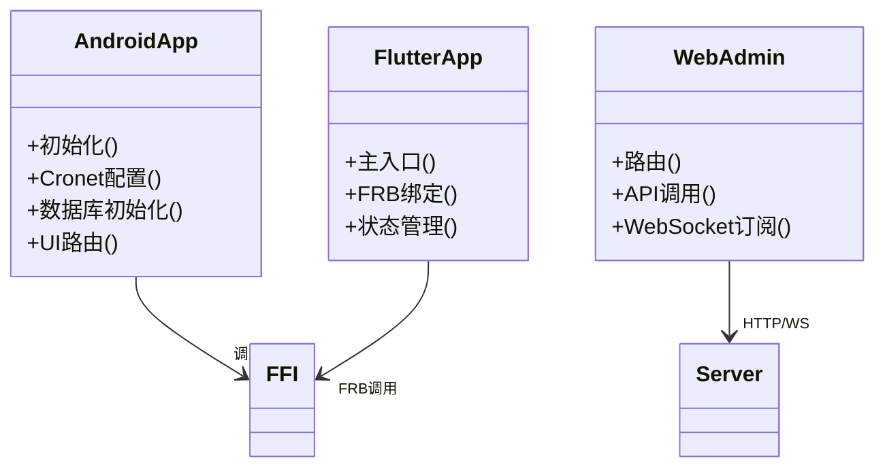
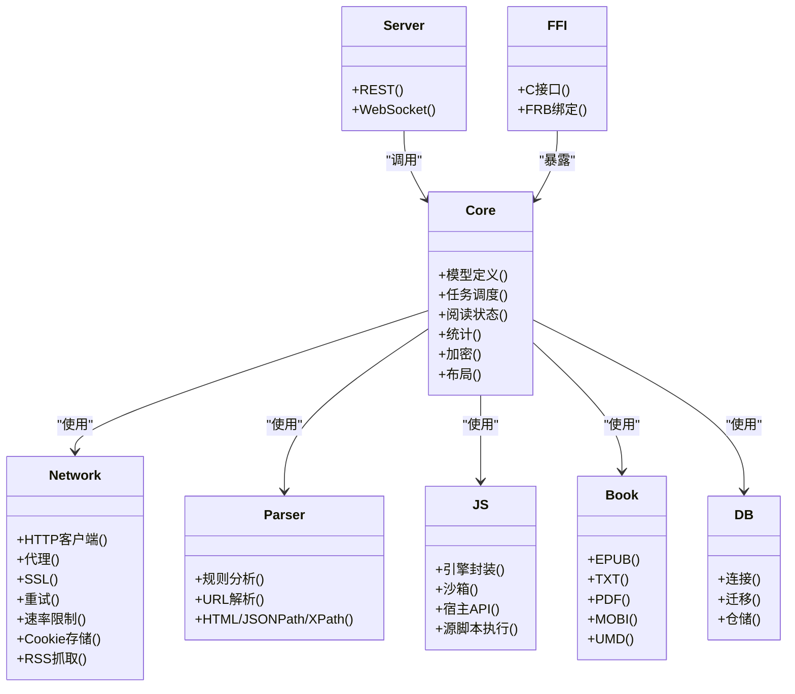
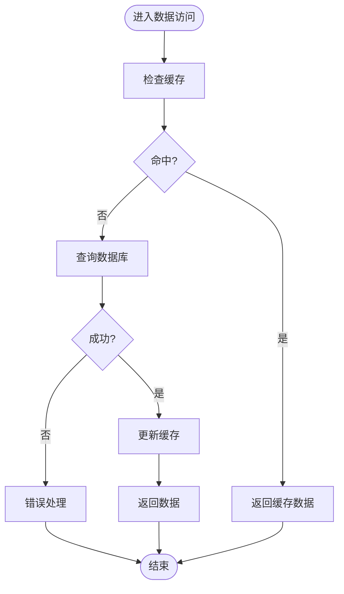
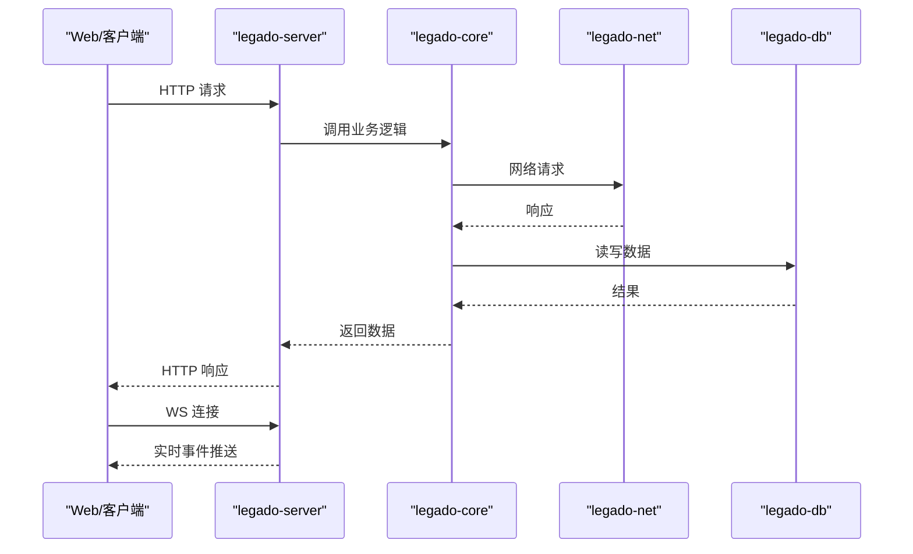
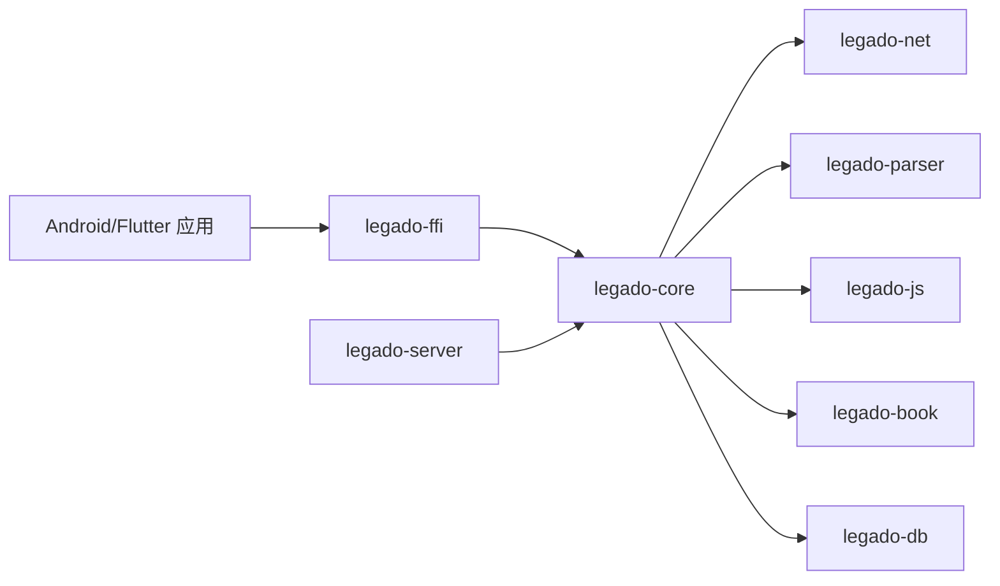

# 架构设计

<cite>
**本文引用的文件**   
- [README.md](file://README.md)
- [app/src/main/java/io/legado/app/App.kt](file://app/src/main/java/io/legado/app/App.kt)
- [app/build.gradle](file://app/build.gradle)
- [flutter_legado/lib/main.dart](file://flutter_legado/lib/main.dart)
- [flutter_legado/pubspec.yaml](file://flutter_legado/pubspec.yaml)
- [flutter_legado/flutter_rust_bridge.yaml](file://flutter_legado/flutter_rust_bridge.yaml)
- [rust/Cargo.toml](file://rust/Cargo.toml)
- [rust/legado-core/src/lib.rs](file://rust/legado-core/src/lib.rs)
- [rust/legado-db/src/lib.rs](file://rust/legado-db/src/lib.rs)
- [rust/legado-net/src/lib.rs](file://rust/legado-net/src/lib.rs)
- [rust/legado-parser/src/lib.rs](file://rust/legado-parser/src/lib.rs)
- [rust/legado-js/src/lib.rs](file://rust/legado-js/src/lib.rs)
- [rust/legado-book/src/lib.rs](file://rust/legado-book/src/lib.rs)
- [rust/legado-server/src/lib.rs](file://rust/legado-server/src/lib.rs)
- [rust/legado-ffi/src/lib.rs](file://rust/legado-ffi/src/lib.rs)
- [modules/web/package.json](file://modules/web/package.json)
</cite>

## 更新摘要
**所做更改**
- 移除了嵌入式git仓库功能的相关说明
- 更新了项目结构重组的相关描述
- 简化了架构图以反映当前实际的项目组织

## 目录
1. [简介](#简介)
2. [项目结构](#项目结构)
3. [核心组件](#核心组件)
4. [架构总览](#架构总览)
5. [详细组件分析](#详细组件分析)
6. [依赖关系分析](#依赖关系分析)
7. [性能考量](#性能考量)
8. [故障排查指南](#故障排查指南)
9. [结论](#结论)
10. [附录](#附录)

## 简介
Legado 是一个跨平台阅读与内容聚合应用，采用分层架构与模块化设计，核心计算与数据持久化由 Rust 实现，UI 层通过 Android 原生与 Flutter 提供多端体验，并通过 Web 模块提供浏览器管理界面。系统以 FFI（Flutter Rust Bridge）和 RESTful API/WebSocket 作为主要集成方式，将表现层、业务逻辑层与数据访问层解耦，形成高内聚、低耦合的可扩展架构。

## 项目结构
仓库包含三大子系统：
- Android 应用（Kotlin/Java）：原生 UI、系统集成、Cronet 网络栈、SQLite 数据库迁移等。
- Flutter 应用（Dart）：跨平台 UI，通过 FRB 调用 Rust 核心库。
- Rust 核心库（Cargo workspace）：核心业务、网络、解析、JS 引擎、书籍处理、服务器与 FFI 桥接。
- Web 管理端（Vue/TS）：用于规则编辑与调试的 Web 界面。

**图表来源** 
- [app/build.gradle](file://app/build.gradle)
- [flutter_legado/pubspec.yaml](file://flutter_legado/pubspec.yaml)
- [rust/Cargo.toml](file://rust/Cargo.toml)

**章节来源**
- [README.md](file://README.md)
- [app/build.gradle](file://app/build.gradle)
- [flutter_legado/pubspec.yaml](file://flutter_legado/pubspec.yaml)
- [rust/Cargo.toml](file://rust/Cargo.toml)

## 核心组件
- 表现层
  - Android 应用：负责原生能力接入、UI 渲染、本地缓存与 SQLite 迁移、Cronet 网络优化。
  - Flutter 应用：跨平台 UI，通过 FRB 调用 Rust 核心库，统一交互体验。
  - Web 管理端：基于 Vue/TS，提供规则编辑、源管理与调试工具。
- 业务逻辑层（Rust core）
  - legado-core：领域模型、任务调度、阅读状态、统计、加密、布局等核心逻辑。
  - legado-net：HTTP 客户端、代理、SSL、重试、速率限制、Cookie 存储、RSS 抓取。
  - legado-parser：规则分析、URL 解析、HTML/JSONPath/XPath 提取。
  - legado-js：Rhino/JS 引擎封装、沙箱、宿主 API、源脚本执行。
  - legado-book：电子书格式解析与导出（EPUB/TXT/PDF/MOBI/UMD）。
  - legado-db：SQLite 连接、迁移、仓储模式（Book/Chapter/Source/RSS/User 等）。
  - legado-server：内置 HTTP/WS 服务，暴露 REST API 与 WebSocket 事件。
  - legado-ffi：对外暴露 C/FRB 接口，供 Android/Flutter 调用。
- 数据访问层
  - SQLite：结构化数据存储与版本迁移。
  - 文件系统：缓存、下载、临时文件与资源管理。
- 外部服务集成
  - HTTP/HTTPS：通用请求、重试、代理、UA、验证。
  - WebSocket：实时通信（如进度同步、调试日志）。
  - Cronet：Android 高性能网络栈。

**章节来源**
- [rust/legado-core/src/lib.rs](file://rust/legado-core/src/lib.rs)
- [rust/legado-net/src/lib.rs](file://rust/legado-net/src/lib.rs)
- [rust/legado-parser/src/lib.rs](file://rust/legado-parser/src/lib.rs)
- [rust/legado-js/src/lib.rs](file://rust/legado-js/src/lib.rs)
- [rust/legado-book/src/lib.rs](file://rust/legado-book/src/lib.rs)
- [rust/legado-db/src/lib.rs](file://rust/legado-db/src/lib.rs)
- [rust/legado-server/src/lib.rs](file://rust/legado-server/src/lib.rs)
- [rust/legado-ffi/src/lib.rs](file://rust/legado-ffi/src/lib.rs)

## 架构总览
整体采用"表现层 + 核心层 + 数据层"的分层架构，结合模块化与微服务思想：
- 表现层通过 FFI/FRB 或 HTTP/WS 与核心层交互，避免直接依赖底层实现。
- 核心层按职责拆分为多个 Cargo crate，保持高内聚与可测试性。
- 数据层通过仓储抽象屏蔽具体存储细节，便于替换与扩展。
- 内置服务器提供跨进程/跨设备集成的能力，支持远程调试与自动化。

**图表来源** 
- [flutter_legado/lib/main.dart](file://flutter_legado/lib/main.dart)
- [flutter_legado/flutter_rust_bridge.yaml](file://flutter_legado/flutter_rust_bridge.yaml)
- [rust/legado-ffi/src/lib.rs](file://rust/legado-ffi/src/lib.rs)
- [rust/legado-core/src/lib.rs](file://rust/legado-core/src/lib.rs)
- [rust/legado-net/src/lib.rs](file://rust/legado-net/src/lib.rs)
- [rust/legado-parser/src/lib.rs](file://rust/legado-parser/src/lib.rs)
- [rust/legado-db/src/lib.rs](file://rust/legado-db/src/lib.rs)

## 详细组件分析

### 表现层（Android/Flutter/Web）
- Android 应用
  - 入口与初始化：应用启动、依赖注入、Cronet 配置、数据库初始化。
  - UI 与交互：页面路由、列表/阅读器、设置与主题。
  - 系统集成：权限、通知、音频播放、文件访问。
- Flutter 应用
  - 跨平台 UI：使用 Dart 构建一致的用户界面。
  - FRB 调用：通过 flutter_rust_bridge 生成绑定，调用 Rust 核心能力。
- Web 管理端
  - 规则编辑与调试：Vue/TS 前端，通过 REST/WS 与后端交互。

**图表来源** 
- [app/src/main/java/io/legado/app/App.kt](file://app/src/main/java/io/legado/app/App.kt)
- [flutter_legado/lib/main.dart](file://flutter_legado/lib/main.dart)
- [flutter_legado/flutter_rust_bridge.yaml](file://flutter_legado/flutter_rust_bridge.yaml)
- [rust/legado-ffi/src/lib.rs](file://rust/legado-ffi/src/lib.rs)
- [rust/legado-server/src/lib.rs](file://rust/legado-server/src/lib.rs)

**章节来源**
- [app/src/main/java/io/legado/app/App.kt](file://app/src/main/java/io/legado/app/App.kt)
- [flutter_legado/lib/main.dart](file://flutter_legado/lib/main.dart)
- [flutter_legado/flutter_rust_bridge.yaml](file://flutter_legado/flutter_rust_bridge.yaml)

### 业务逻辑层（Rust 核心库）
- legado-core：定义领域模型（书、章节、源、RSS）、任务调度、阅读状态、统计、加密、布局等。
- legado-net：HTTP 客户端、代理、SSL、重试、速率限制、Cookie 存储、RSS 抓取。
- legado-parser：规则分析、URL 解析、HTML/JSONPath/XPath 提取。
- legado-js：脚本引擎封装、沙箱、宿主 API、源脚本执行。
- legado-book：电子书格式解析与导出（EPUB/TXT/PDF/MOBI/UMD）。
- legado-db：SQLite 连接、迁移、仓储模式（Book/Chapter/Source/RSS/User 等）。
- legado-server：内置 HTTP/WS 服务，暴露 REST API 与 WebSocket 事件。
- legado-ffi：对外暴露 C/FRB 接口，供 Android/Flutter 调用。

**图表来源** 
- [rust/legado-core/src/lib.rs](file://rust/legado-core/src/lib.rs)
- [rust/legado-net/src/lib.rs](file://rust/legado-net/src/lib.rs)
- [rust/legado-parser/src/lib.rs](file://rust/legado-parser/src/lib.rs)
- [rust/legado-js/src/lib.rs](file://rust/legado-js/src/lib.rs)
- [rust/legado-book/src/lib.rs](file://rust/legado-book/src/lib.rs)
- [rust/legado-db/src/lib.rs](file://rust/legado-db/src/lib.rs)
- [rust/legado-server/src/lib.rs](file://rust/legado-server/src/lib.rs)
- [rust/legado-ffi/src/lib.rs](file://rust/legado-ffi/src/lib.rs)

**章节来源**
- [rust/legado-core/src/lib.rs](file://rust/legado-core/src/lib.rs)
- [rust/legado-net/src/lib.rs](file://rust/legado-net/src/lib.rs)
- [rust/legado-parser/src/lib.rs](file://rust/legado-parser/src/lib.rs)
- [rust/legado-js/src/lib.rs](file://rust/legado-js/src/lib.rs)
- [rust/legado-book/src/lib.rs](file://rust/legado-book/src/lib.rs)
- [rust/legado-db/src/lib.rs](file://rust/legado-db/src/lib.rs)
- [rust/legado-server/src/lib.rs](file://rust/legado-server/src/lib.rs)
- [rust/legado-ffi/src/lib.rs](file://rust/legado-ffi/src/lib.rs)

### 数据访问层（SQLite/文件系统）
- SQLite：结构化数据存储，版本化管理（schemas），仓储模式抽象。
- 文件系统：缓存、下载、临时文件与资源管理。
- 迁移：数据库版本升级与默认数据导入。

**图表来源** 
- [rust/legado-db/src/lib.rs](file://rust/legado-db/src/lib.rs)

**章节来源**
- [rust/legado-db/src/lib.rs](file://rust/legado-db/src/lib.rs)

### 外部服务集成（RESTful API/WebSocket）
- RESTful API：通过内置服务器暴露接口，供 Web 管理端与其他进程调用。
- WebSocket：实时通信，支持进度同步、调试日志推送。
- Cronet：Android 高性能网络栈，提升网络性能。

**图表来源** 
- [rust/legado-server/src/lib.rs](file://rust/legado-server/src/lib.rs)
- [rust/legado-core/src/lib.rs](file://rust/legado-core/src/lib.rs)
- [rust/legado-net/src/lib.rs](file://rust/legado-net/src/lib.rs)
- [rust/legado-db/src/lib.rs](file://rust/legado-db/src/lib.rs)

**章节来源**
- [rust/legado-server/src/lib.rs](file://rust/legado-server/src/lib.rs)

## 依赖关系分析
- Cargo workspace 组织各 crate，明确依赖边界。
- FFI/FRB 作为跨语言边界，确保类型安全与稳定接口。
- 表现层与核心层解耦，通过 API/FFI 通信，降低耦合度。

**图表来源** 
- [rust/Cargo.toml](file://rust/Cargo.toml)
- [rust/legado-ffi/src/lib.rs](file://rust/legado-ffi/src/lib.rs)
- [rust/legado-core/src/lib.rs](file://rust/legado-core/src/lib.rs)

**章节来源**
- [rust/Cargo.toml](file://rust/Cargo.toml)

## 性能考量
- Rust 核心库：零成本抽象、内存安全、并发友好，适合 CPU 密集任务（解析、加密、布局）。
- Cronet：Android 高性能网络栈，减少延迟与内存占用。
- 缓存策略：多级缓存（内存/磁盘）提升读取速度。
- 异步与协程：非阻塞 IO，提高吞吐。
- 序列化与压缩：合理选择序列化格式与压缩算法，平衡体积与性能。

[本节为通用指导，不直接分析具体文件]

## 故障排查指南
- 常见问题定位
  - FFI/FRB 绑定异常：检查生成配置与接口签名。
  - 网络请求失败：检查代理、SSL、重试策略与速率限制。
  - 数据库迁移失败：核对 schema 版本与迁移脚本。
  - 解析规则错误：校验 XPath/JSONPath 表达式与 HTML 结构变化。
- 调试手段
  - 启用日志与调试输出。
  - 使用 Web 管理端进行规则调试与源测试。
  - 通过 WebSocket 获取实时事件与状态。

**章节来源**
- [flutter_legado/flutter_rust_bridge.yaml](file://flutter_legado/flutter_rust_bridge.yaml)
- [rust/legado-server/src/lib.rs](file://rust/legado-server/src/lib.rs)
- [rust/legado-db/src/lib.rs](file://rust/legado-db/src/lib.rs)

## 结论
Legado 通过分层架构与模块化设计，实现了高内聚、低耦合的系统结构。Rust 核心库提供高性能与稳定性，Flutter/Android 提供一致的跨平台体验，Web 管理端增强可维护性与可扩展性。FFI/FRB 与 REST/WS 的集成方式使系统具备良好的扩展性与可观测性，满足复杂阅读与内容聚合场景的需求。

[本节为总结，不直接分析具体文件]

## 附录
- 技术决策与权衡
  - 选择 Rust：性能、内存安全、并发优势，适合核心计算与数据处理。
  - Flutter：跨平台 UI，代码复用率高，开发效率好。
  - Android 原生：深度系统集成与高性能网络（Cronet）。
  - Web 管理端：便于规则编辑与调试，提升可维护性。
- 可扩展性建议
  - 新增解析器：在 parser 模块扩展规则引擎。
  - 新增数据源：在 net/js 模块扩展抓取与脚本能力。
  - 新增存储后端：在 db 模块抽象仓储接口。
- 安全考虑
  - 输入校验与沙箱隔离（JS 引擎）。
  - 敏感数据加密与密钥管理。
  - 网络安全（HTTPS、证书校验、代理安全）。

[本节为补充信息，不直接分析具体文件]