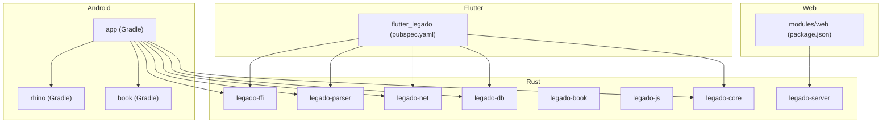
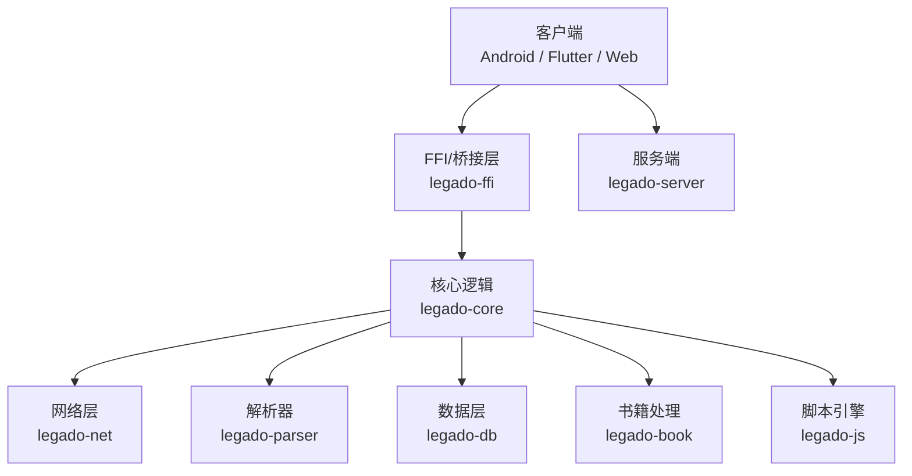
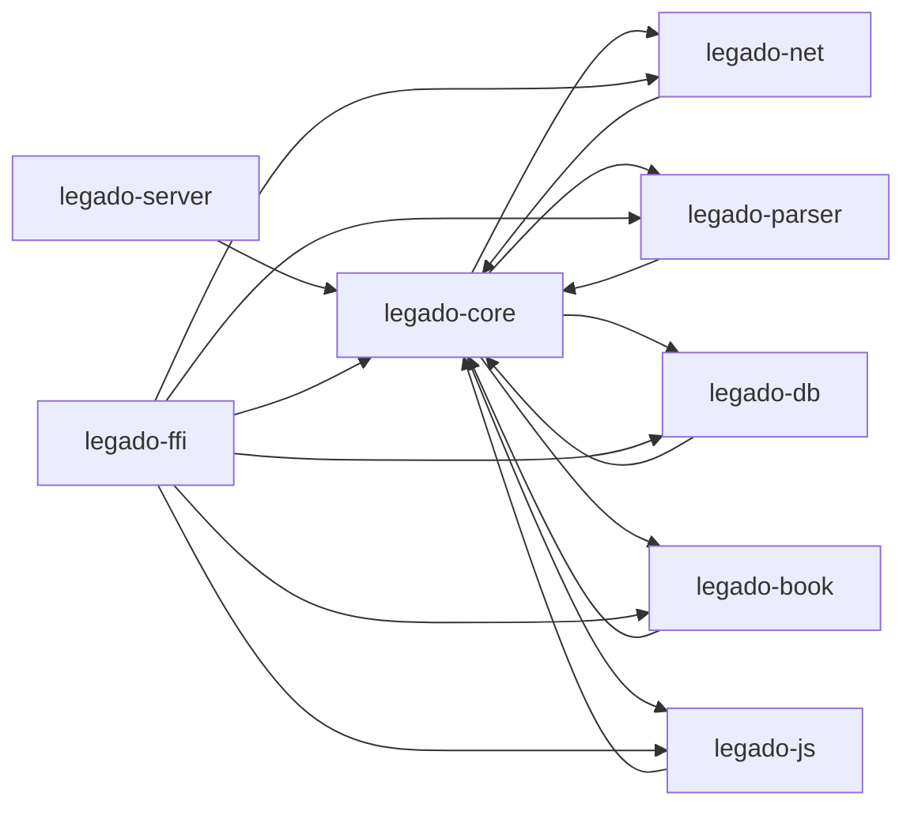
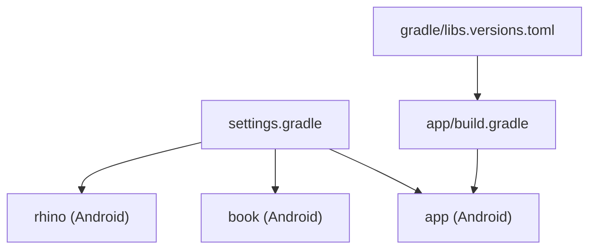
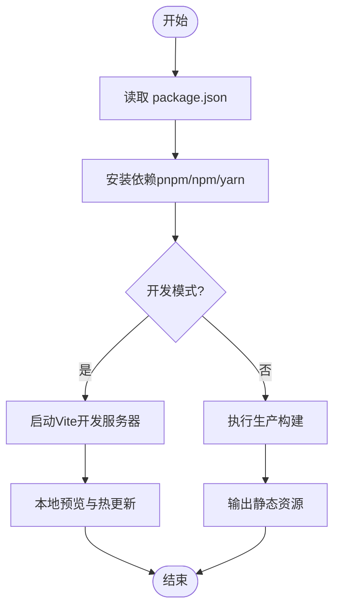
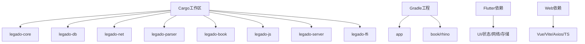

# 模块依赖关系

<cite>
**本文引用的文件**   
- [Cargo.toml](file://rust/Cargo.toml)
- [legado-core/Cargo.toml](file://rust/legado-core/Cargo.toml)
- [legado-db/Cargo.toml](file://rust/legado-db/Cargo.toml)
- [legado-net/Cargo.toml](file://rust/legado-net/Cargo.toml)
- [legado-parser/Cargo.toml](file://rust/legado-parser/Cargo.toml)
- [legado-book/Cargo.toml](file://rust/legado-book/Cargo.toml)
- [legado-js/Cargo.toml](file://rust/legado-js/Cargo.toml)
- [legado-server/Cargo.toml](file://rust/legado-server/Cargo.toml)
- [build.gradle](file://app/build.gradle)
- [settings.gradle](file://settings.gradle)
- [gradle/libs.versions.toml](file://gradle/libs.versions.toml)
- [pubspec.yaml](file://flutter_legado/pubspec.yaml)
- [package.json](file://modules/web/package.json)
</cite>

## 目录
1. [简介](#简介)
2. [项目结构](#项目结构)
3. [核心组件](#核心组件)
4. [架构总览](#架构总览)
5. [详细组件分析](#详细组件分析)
6. [依赖分析](#依赖分析)
7. [性能考虑](#性能考虑)
8. [故障排查指南](#故障排查指南)
9. [结论](#结论)
10. [附录](#附录)

## 简介
本文件面向Legado多语言、多平台工程，系统性梳理Rust Cargo模块、Android Gradle模块、Flutter包与Web项目的依赖关系与构建配置。重点覆盖：
- Rust核心模块职责与依赖树（legado-core、legado-db、legado-net、legado-parser等）
- Android Gradle模块的构建与依赖管理（app与各library的关系）
- Flutter项目的包依赖管理与版本约束（pubspec.yaml）
- Web项目的npm依赖管理（Vue.js组件库、工具库等）
- 依赖关系图与循环依赖检测策略
- 依赖版本管理与升级策略（向后兼容性与破坏性变更处理）

## 项目结构
Legado采用多语言、多平台混合工程：
- Rust层提供高性能核心能力（网络、解析、数据库、音频、规则引擎、FFI桥接等），通过Cargo组织为多个crate
- Android层以Gradle构建，app聚合各library模块，并集成Rust产物（通过FFI或插件）
- Flutter层提供跨端UI与业务编排，通过pubspec.yaml声明Dart/Flutter插件与第三方包
- Web层基于Vue/Vite，使用pnpm管理依赖，提供在线编辑与调试能力



图表来源 
- [Cargo.toml](file://rust/Cargo.toml)
- [build.gradle](file://app/build.gradle)
- [settings.gradle](file://settings.gradle)
- [pubspec.yaml](file://flutter_legado/pubspec.yaml)
- [package.json](file://modules/web/package.json)

章节来源
- [Cargo.toml](file://rust/Cargo.toml)
- [build.gradle](file://app/build.gradle)
- [settings.gradle](file://settings.gradle)
- [pubspec.yaml](file://flutter_legado/pubspec.yaml)
- [package.json](file://modules/web/package.json)

## 核心组件
本节聚焦Rust核心模块的职责边界与相互依赖，便于理解整体数据与控制流。

- legado-core：领域模型、状态机、阅读统计、缓存、加密、搜索、规则匹配、下载管理等通用能力
- legado-db：SQLite持久化、迁移、仓库抽象（Book/Chapter/RSS/Source等）
- legado-net：HTTP客户端、Cookie存储、代理、重试、速率限制、SSL配置、RSS抓取、远程书源
- legado-parser：HTML/XPath/JSONPath/正则引擎、URL与规则分析
- legado-book：电子书格式处理（EPUB/MOBI/PDF/TXT/UMD等）
- legado-js：Rhino JS引擎封装、沙箱、宿主API暴露（文件、加密、并发、编码等）
- legado-server：HTTP/WebSocket服务、路由、处理器、WebSocket通信
- legado-ffi：对外C API导出、运行时初始化、错误映射、FRB生成代码

章节来源
- [legado-core/Cargo.toml](file://rust/legado-core/Cargo.toml)
- [legado-db/Cargo.toml](file://rust/legado-db/Cargo.toml)
- [legado-net/Cargo.toml](file://rust/legado-net/Cargo.toml)
- [legado-parser/Cargo.toml](file://rust/legado-parser/Cargo.toml)
- [legado-book/Cargo.toml](file://rust/legado-book/Cargo.toml)
- [legado-js/Cargo.toml](file://rust/legado-js/Cargo.toml)
- [legado-server/Cargo.toml](file://rust/legado-server/Cargo.toml)

## 架构总览
下图展示从上层应用到Rust核心模块的调用路径与数据流向，强调FFI与库边界。



图表来源 
- [legado-ffi/Cargo.toml](file://rust/legado-ffi/Cargo.toml)
- [legado-core/Cargo.toml](file://rust/legado-core/Cargo.toml)
- [legado-net/Cargo.toml](file://rust/legado-net/Cargo.toml)
- [legado-parser/Cargo.toml](file://rust/legado-parser/Cargo.toml)
- [legado-db/Cargo.toml](file://rust/legado-db/Cargo.toml)
- [legado-book/Cargo.toml](file://rust/legado-book/Cargo.toml)
- [legado-js/Cargo.toml](file://rust/legado-js/Cargo.toml)
- [legado-server/Cargo.toml](file://rust/legado-server/Cargo.toml)

## 详细组件分析

### Rust Cargo模块依赖树
- 顶层Cargo工作区定义所有crate及其版本与特性开关
- 各crate通过Cargo.toml显式声明依赖，形成清晰的有向无环图（DAG）
- FFI层统一对外暴露接口，避免上层直接耦合内部实现



图表来源 
- [Cargo.toml](file://rust/Cargo.toml)
- [legado-core/Cargo.toml](file://rust/legado-core/Cargo.toml)
- [legado-db/Cargo.toml](file://rust/legado-db/Cargo.toml)
- [legado-net/Cargo.toml](file://rust/legado-net/Cargo.toml)
- [legado-parser/Cargo.toml](file://rust/legado-parser/Cargo.toml)
- [legado-book/Cargo.toml](file://rust/legado-book/Cargo.toml)
- [legado-js/Cargo.toml](file://rust/legado-js/Cargo.toml)
- [legado-server/Cargo.toml](file://rust/legado-server/Cargo.toml)
- [legado-ffi/Cargo.toml](file://rust/legado-ffi/Cargo.toml)

章节来源
- [Cargo.toml](file://rust/Cargo.toml)
- [legado-core/Cargo.toml](file://rust/legado-core/Cargo.toml)
- [legado-db/Cargo.toml](file://rust/legado-db/Cargo.toml)
- [legado-net/Cargo.toml](file://rust/legado-net/Cargo.toml)
- [legado-parser/Cargo.toml](file://rust/legado-parser/Cargo.toml)
- [legado-book/Cargo.toml](file://rust/legado-book/Cargo.toml)
- [legado-js/Cargo.toml](file://rust/legado-js/Cargo.toml)
- [legado-server/Cargo.toml](file://rust/legado-server/Cargo.toml)
- [legado-ffi/Cargo.toml](file://rust/legado-ffi/Cargo.toml)

### Android Gradle模块构建与依赖
- settings.gradle定义包含app与多个library模块
- build.gradle集中声明依赖版本与编译选项
- libs.versions.toml统一管理三方库版本，确保一致性
- app模块依赖Rust产物（通过FFI或插件）、以及book/rhino等本地库



图表来源 
- [settings.gradle](file://settings.gradle)
- [build.gradle](file://app/build.gradle)
- [gradle/libs.versions.toml](file://gradle/libs.versions.toml)

章节来源
- [settings.gradle](file://settings.gradle)
- [build.gradle](file://app/build.gradle)
- [gradle/libs.versions.toml](file://gradle/libs.versions.toml)

### Flutter项目包依赖管理
- pubspec.yaml声明Flutter/Dart依赖、插件与版本约束
- 通过锁定文件（如pubspec.lock）固化构建结果
- 依赖涵盖UI组件、网络、存储、音视频、Rust桥接等

```mermaid
flowchart TD
start(["开始"]) --> read_pubspec["读取 pubspec.yaml"]
read_pubspec --> resolve["解析依赖与版本约束"]
resolve --> lock{"是否已存在锁定文件?"}
lock --> |是| use_lock["使用锁定文件版本"]
lock --> |否| fetch["拉取依赖并生成锁定文件"]
use_lock --> verify["校验依赖完整性"]
fetch --> verify
verify --> build["构建Flutter应用"]
build --> end(["结束"])
```

图表来源 
- [pubspec.yaml](file://flutter_legado/pubspec.yaml)

章节来源
- [pubspec.yaml](file://flutter_legado/pubspec.yaml)

### Web项目npm依赖管理
- package.json声明Vue.js、Vite、TypeScript、Axios等依赖
- pnpm-lock.yaml锁定具体版本，保证可重复构建
- 提供在线编辑器、源码调试、API交互等功能



图表来源 
- [package.json](file://modules/web/package.json)

章节来源
- [package.json](file://modules/web/package.json)

## 依赖分析
- Rust层遵循严格的DAG结构，核心模块被其他模块引用，避免反向依赖
- Android层通过Gradle聚合模块，统一版本管理，减少冲突
- Flutter与Web分别通过包管理器隔离生态，降低跨平台耦合
- 建议引入依赖扫描工具（cargo-audit、cargo-outdated、Gradle dependencyInsight、pnpm audit）定期巡检



图表来源 
- [Cargo.toml](file://rust/Cargo.toml)
- [settings.gradle](file://settings.gradle)
- [build.gradle](file://app/build.gradle)
- [pubspec.yaml](file://flutter_legado/pubspec.yaml)
- [package.json](file://modules/web/package.json)

章节来源
- [Cargo.toml](file://rust/Cargo.toml)
- [settings.gradle](file://settings.gradle)
- [build.gradle](file://app/build.gradle)
- [pubspec.yaml](file://flutter_legado/pubspec.yaml)
- [package.json](file://modules/web/package.json)

## 性能考虑
- Rust侧：合理划分crate粒度，避免过度拆分导致链接开销；对热点路径启用优化编译；利用异步IO提升网络吞吐
- Android侧：按需加载Rust动态库，减少首屏体积；合理使用ProGuard/R8混淆与裁剪
- Flutter侧：按需引入插件，避免全量打包；使用AOT编译与Tree Shaking
- Web侧：按需懒加载组件与路由；压缩静态资源与启用CDN

[本节为通用指导，不直接分析具体文件]

## 故障排查指南
- 循环依赖检测
  - Rust：使用cargo tree/cargo-depends检查依赖环
  - Android：使用./gradlew :app:dependencies与dependencyInsight定位冲突
  - Flutter：使用dart pub deps与flutter doctor --verbose
  - Web：使用pnpm list --depth=0与pnpm why <pkg>
- 常见症状与对策
  - 构建失败：核对版本约束与锁定文件一致性
  - 运行时崩溃：检查FFI签名与ABI对齐
  - 网络异常：确认代理、SSL配置与重试策略
  - 解析错误：校验XPath/JSONPath表达式与正则引擎兼容性

[本节为通用指导，不直接分析具体文件]

## 结论
Legado通过分层与模块化设计，将高性能核心（Rust）与多端界面（Android/Flutter/Web）解耦。借助统一的依赖管理与构建系统，项目在可扩展性、可维护性与跨平台一致性方面具备良好基础。建议在CI中集成依赖审计与循环依赖检测，持续保障依赖健康度。

[本节为总结性内容，不直接分析具体文件]

## 附录

### 依赖版本管理与升级策略
- 语义化版本控制（SemVer）
  - 主版本（破坏性变更）：需评估影响面，提供迁移指南与过渡期
  - 次版本（新功能）：保持向后兼容，逐步引入
  - 补丁版本（缺陷修复）：优先合并，快速发布
- 自动化与治理
  - 使用dependabot/renovate自动提交升级PR
  - 在CI中运行cargo-audit、Gradle安全扫描、pnpm audit
  - 建立“最小可行升级”策略，先升级非关键依赖验证稳定性
- 回滚与兼容性
  - 保留旧版依赖分支与制品，支持快速回滚
  - 对破坏性变更提供适配器或兼容层，平滑过渡

[本节为通用指导，不直接分析具体文件]