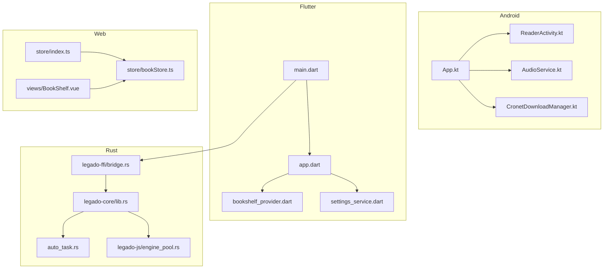
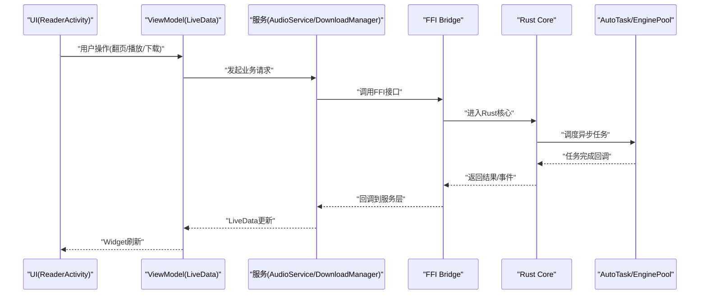
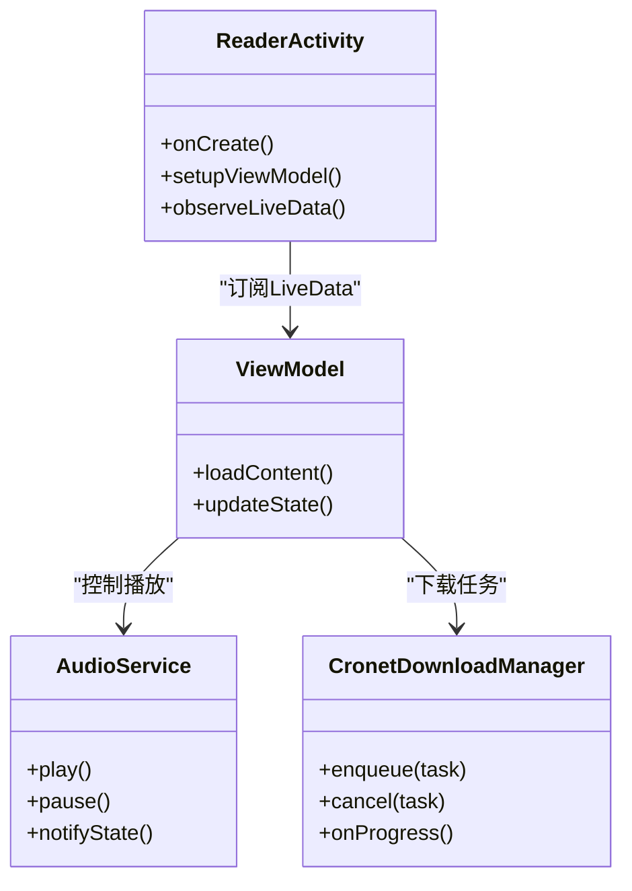
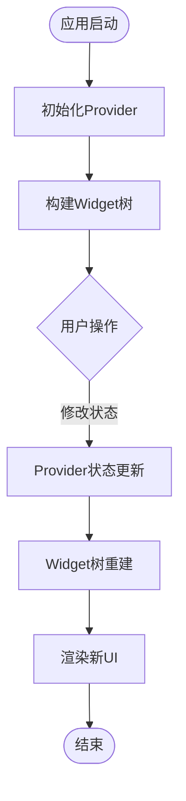
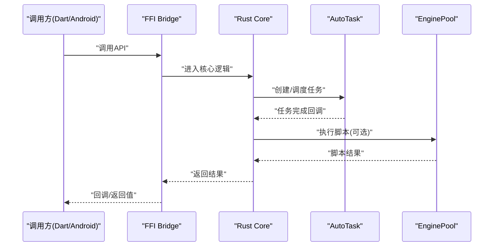
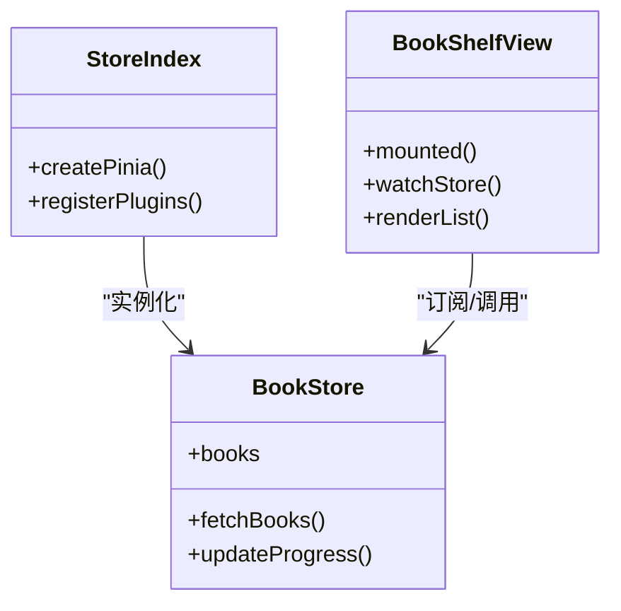
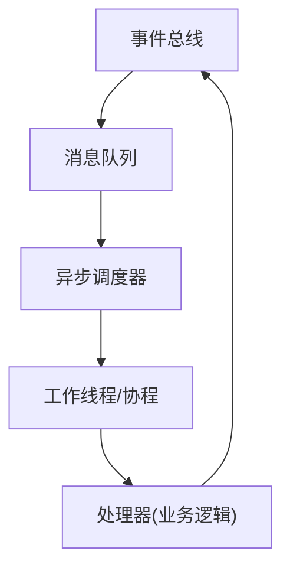
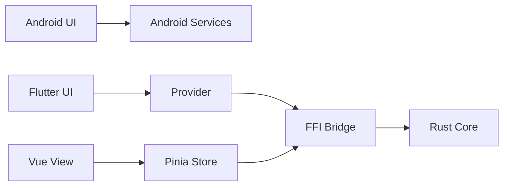

# 组件交互模式

<cite>
**本文引用的文件**   
- [app/src/main/java/io/legado/app/App.kt](file://app/src/main/java/io/legado/app/App.kt)
- [app/src/main/java/io/legado/app/ui/book/reader/ReaderActivity.kt](file://app/src/main/java/io/legado/app/ui/book/reader/ReaderActivity.kt)
- [app/src/main/java/io/legado/app/service/AudioService.kt](file://app/src/main/java/io/legado/app/service/AudioService.kt)
- [app/src/main/java/io/legado/app/lib/cronet/CronetDownloadManager.kt](file://app/src/main/java/io/legado/app/lib/cronet/CronetDownloadManager.kt)
- [flutter_legado/lib/src/main.dart](file://flutter_legado/lib/src/main.dart)
- [flutter_legado/lib/app.dart](file://flutter_legado/lib/app.dart)
- [flutter_legado/lib/src/providers/bookshelf_provider.dart](file://flutter_legado/lib/src/providers/bookshelf_provider.dart)
- [flutter_legado/lib/src/services/settings_service.dart](file://flutter_legado/lib/src/services/settings_service.dart)
- [rust/legado-core/src/lib.rs](file://rust/legado-core/src/lib.rs)
- [rust/legado-core/src/auto_task.rs](file://rust/legado-core/src/auto_task.rs)
- [rust/legado-ffi/src/bridge.rs](file://rust/legado-ffi/src/bridge.rs)
- [rust/legado-js/src/engine_pool.rs](file://rust/legado-js/src/engine_pool.rs)
- [modules/web/src/store/index.ts](file://modules/web/src/store/index.ts)
- [modules/web/src/store/bookStore.ts](file://modules/web/src/store/bookStore.ts)
- [modules/web/src/views/BookShelf.vue](file://modules/web/src/views/BookShelf.vue)
</cite>

## 目录
1. [简介](#简介)
2. [项目结构](#项目结构)
3. [核心组件](#核心组件)
4. [架构总览](#架构总览)
5. [详细组件分析](#详细组件分析)
6. [依赖分析](#依赖分析)
7. [性能考虑](#性能考虑)
8. [故障排查指南](#故障排查指南)
9. [结论](#结论)
10. [附录](#附录)

## 简介
本文件系统性梳理 Legado 在多平台（Android、Flutter、Rust、Web）中的组件交互模式，重点覆盖：
- Android 的 MVVM 与 LiveData 数据绑定
- Flutter 的 Provider 状态管理与 Widget 树更新
- Rust 的异步任务与回调机制
- Web 的 Pinia 状态管理与 Vue 组件通信
并进一步阐述事件驱动架构（事件总线、消息队列、异步调度）、依赖注入与服务定位、生命周期管理、解耦与测试策略、性能优化以及调试监控方法。文中所有技术细节均基于仓库源码进行归纳与可视化说明。

## 项目结构
Legado 采用多模块、多语言工程组织：
- app：Android 原生应用，包含 UI、服务、网络、数据库等
- flutter_legado：Flutter 跨平台界面层，通过 FFI 调用 Rust 核心能力
- rust：核心能力以 Rust 实现，提供 FFI 接口供上层调用
- modules/web：Web 端使用 Vue + Pinia 的状态管理与组件化视图

**图表来源** 
- [app/src/main/java/io/legado/app/App.kt](file://app/src/main/java/io/legado/app/App.kt)
- [app/src/main/java/io/legado/app/ui/book/reader/ReaderActivity.kt](file://app/src/main/java/io/legado/app/ui/book/reader/ReaderActivity.kt)
- [app/src/main/java/io/legado/app/service/AudioService.kt](file://app/src/main/java/io/legado/app/service/AudioService.kt)
- [app/src/main/java/io/legado/app/lib/cronet/CronetDownloadManager.kt](file://app/src/main/java/io/legado/app/lib/cronet/CronetDownloadManager.kt)
- [flutter_legado/lib/src/main.dart](file://flutter_legado/lib/src/main.dart)
- [flutter_legado/lib/app.dart](file://flutter_legado/lib/app.dart)
- [flutter_legado/lib/src/providers/bookshelf_provider.dart](file://flutter_legado/lib/src/providers/bookshelf_provider.dart)
- [flutter_legado/lib/src/services/settings_service.dart](file://flutter_legado/lib/src/services/settings_service.dart)
- [rust/legado-core/src/lib.rs](file://rust/legado-core/src/lib.rs)
- [rust/legado-core/src/auto_task.rs](file://rust/legado-core/src/auto_task.rs)
- [rust/legado-ffi/src/bridge.rs](file://rust/legado-ffi/src/bridge.rs)
- [rust/legado-js/src/engine_pool.rs](file://rust/legado-js/src/engine_pool.rs)
- [modules/web/src/store/index.ts](file://modules/web/src/store/index.ts)
- [modules/web/src/store/bookStore.ts](file://modules/web/src/store/bookStore.ts)
- [modules/web/src/views/BookShelf.vue](file://modules/web/src/views/BookShelf.vue)

**章节来源**
- [app/src/main/java/io/legado/app/App.kt](file://app/src/main/java/io/legado/app/App.kt)
- [flutter_legado/lib/src/main.dart](file://flutter_legado/lib/src/main.dart)
- [rust/legado-core/src/lib.rs](file://rust/legado-core/src/lib.rs)
- [modules/web/src/store/index.ts](file://modules/web/src/store/index.ts)

## 核心组件
- Android 层
  - App：应用初始化、全局配置、依赖注入入口
  - ReaderActivity：阅读页 UI，MVVM 与 LiveData 数据绑定
  - AudioService：音频播放服务，后台任务与状态同步
  - CronetDownloadManager：下载管理器，基于 Cronet 的网络请求与任务调度
- Flutter 层
  - main.dart / app.dart：应用启动与路由、Provider 根节点
  - bookshelf_provider.dart：书架状态管理，响应式更新
  - settings_service.dart：设置服务，持久化与变更通知
- Rust 层
  - legado-core：核心业务逻辑（自动任务、解析、网络、缓存等）
  - auto_task.rs：定时任务与调度
  - bridge.rs：FFI 桥接，暴露给 Dart/Android
  - engine_pool.rs：JS 引擎池，异步执行脚本
- Web 层
  - store/index.ts：Pinia 实例与插件注册
  - bookStore.ts：书籍相关状态与副作用处理
  - BookShelf.vue：书架视图，订阅 store 变化

**章节来源**
- [app/src/main/java/io/legado/app/App.kt](file://app/src/main/java/io/legado/app/App.kt)
- [app/src/main/java/io/legado/app/ui/book/reader/ReaderActivity.kt](file://app/src/main/java/io/legado/app/ui/book/reader/ReaderActivity.kt)
- [app/src/main/java/io/legado/app/service/AudioService.kt](file://app/src/main/java/io/legado/app/service/AudioService.kt)
- [app/src/main/java/io/legado/app/lib/cronet/CronetDownloadManager.kt](file://app/src/main/java/io/legado/app/lib/cronet/CronetDownloadManager.kt)
- [flutter_legado/lib/src/main.dart](file://flutter_legado/lib/src/main.dart)
- [flutter_legado/lib/app.dart](file://flutter_legado/lib/app.dart)
- [flutter_legado/lib/src/providers/bookshelf_provider.dart](file://flutter_legado/lib/src/providers/bookshelf_provider.dart)
- [flutter_legado/lib/src/services/settings_service.dart](file://flutter_legado/lib/src/services/settings_service.dart)
- [rust/legado-core/src/lib.rs](file://rust/legado-core/src/lib.rs)
- [rust/legado-core/src/auto_task.rs](file://rust/legado-core/src/auto_task.rs)
- [rust/legado-ffi/src/bridge.rs](file://rust/legado-ffi/src/bridge.rs)
- [rust/legado-js/src/engine_pool.rs](file://rust/legado-js/src/engine_pool.rs)
- [modules/web/src/store/index.ts](file://modules/web/src/store/index.ts)
- [modules/web/src/store/bookStore.ts](file://modules/web/src/store/bookStore.ts)
- [modules/web/src/views/BookShelf.vue](file://modules/web/src/views/BookShelf.vue)

## 架构总览
整体采用“前端 UI（Android/Flutter/Web）— 中间层（FFI/服务）— 核心（Rust）”的分层架构。UI 层通过状态管理或 MVVM 将用户操作转化为命令，交由服务或 FFI 调用 Rust 核心；Rust 负责异步任务、解析、网络与存储，并通过回调或事件回传结果至 UI。

**图表来源** 
- [app/src/main/java/io/legado/app/ui/book/reader/ReaderActivity.kt](file://app/src/main/java/io/legado/app/ui/book/reader/ReaderActivity.kt)
- [app/src/main/java/io/legado/app/service/AudioService.kt](file://app/src/main/java/io/legado/app/service/AudioService.kt)
- [app/src/main/java/io/legado/app/lib/cronet/CronetDownloadManager.kt](file://app/src/main/java/io/legado/app/lib/cronet/CronetDownloadManager.kt)
- [rust/legado-ffi/src/bridge.rs](file://rust/legado-ffi/src/bridge.rs)
- [rust/legado-core/src/lib.rs](file://rust/legado-core/src/lib.rs)
- [rust/legado-core/src/auto_task.rs](file://rust/legado-core/src/auto_task.rs)
- [rust/legado-js/src/engine_pool.rs](file://rust/legado-js/src/engine_pool.rs)

## 详细组件分析

### Android 组件：MVVM 与 LiveData 数据绑定
- ReaderActivity 作为 UI 容器，通过 ViewModel 持有 LiveData，订阅数据变化并触发 UI 更新
- AudioService 与 DownloadManager 作为后台服务，处理耗时任务并通过 LiveData/回调向 UI 层推送状态
- App 负责全局初始化与依赖注入，确保组件间松耦合

**图表来源** 
- [app/src/main/java/io/legado/app/ui/book/reader/ReaderActivity.kt](file://app/src/main/java/io/legado/app/ui/book/reader/ReaderActivity.kt)
- [app/src/main/java/io/legado/app/service/AudioService.kt](file://app/src/main/java/io/legado/app/service/AudioService.kt)
- [app/src/main/java/io/legado/app/lib/cronet/CronetDownloadManager.kt](file://app/src/main/java/io/legado/app/lib/cronet/CronetDownloadManager.kt)

**章节来源**
- [app/src/main/java/io/legado/app/ui/book/reader/ReaderActivity.kt](file://app/src/main/java/io/legado/app/ui/book/reader/ReaderActivity.kt)
- [app/src/main/java/io/legado/app/service/AudioService.kt](file://app/src/main/java/io/legado/app/service/AudioService.kt)
- [app/src/main/java/io/legado/app/lib/cronet/CronetDownloadManager.kt](file://app/src/main/java/io/legado/app/lib/cronet/CronetDownloadManager.kt)

### Flutter 组件：Provider 状态管理与 Widget 树更新
- main.dart 与 app.dart 构建应用根节点，注册 Provider
- bookshelf_provider.dart 管理书架状态，变更时触发 Widget 重建
- settings_service.dart 提供设置读写与监听，保证跨组件一致性

**图表来源** 
- [flutter_legado/lib/src/main.dart](file://flutter_legado/lib/src/main.dart)
- [flutter_legado/lib/app.dart](file://flutter_legado/lib/app.dart)
- [flutter_legado/lib/src/providers/bookshelf_provider.dart](file://flutter_legado/lib/src/providers/bookshelf_provider.dart)
- [flutter_legado/lib/src/services/settings_service.dart](file://flutter_legado/lib/src/services/settings_service.dart)

**章节来源**
- [flutter_legado/lib/src/main.dart](file://flutter_legado/lib/src/main.dart)
- [flutter_legado/lib/app.dart](file://flutter_legado/lib/app.dart)
- [flutter_legado/lib/src/providers/bookshelf_provider.dart](file://flutter_legado/lib/src/providers/bookshelf_provider.dart)
- [flutter_legado/lib/src/services/settings_service.dart](file://flutter_legado/lib/src/services/settings_service.dart)

### Rust 组件：异步任务与回调机制
- core/lib.rs 暴露核心能力，auto_task.rs 负责定时任务与调度
- bridge.rs 定义 FFI 接口，供 Dart/Android 调用
- engine_pool.rs 维护 JS 引擎池，支持并发执行脚本

**图表来源** 
- [rust/legado-core/src/lib.rs](file://rust/legado-core/src/lib.rs)
- [rust/legado-core/src/auto_task.rs](file://rust/legado-core/src/auto_task.rs)
- [rust/legado-ffi/src/bridge.rs](file://rust/legado-ffi/src/bridge.rs)
- [rust/legado-js/src/engine_pool.rs](file://rust/legado-js/src/engine_pool.rs)

**章节来源**
- [rust/legado-core/src/lib.rs](file://rust/legado-core/src/lib.rs)
- [rust/legado-core/src/auto_task.rs](file://rust/legado-core/src/auto_task.rs)
- [rust/legado-ffi/src/bridge.rs](file://rust/legado-ffi/src/bridge.rs)
- [rust/legado-js/src/engine_pool.rs](file://rust/legado-js/src/engine_pool.rs)

### Web 组件：Pinia 状态管理与 Vue 组件通信
- store/index.ts 初始化 Pinia 并注册插件
- bookStore.ts 管理书籍列表、阅读进度等状态，封装副作用
- BookShelf.vue 订阅 store 变化，渲染书架内容

**图表来源** 
- [modules/web/src/store/index.ts](file://modules/web/src/store/index.ts)
- [modules/web/src/store/bookStore.ts](file://modules/web/src/store/bookStore.ts)
- [modules/web/src/views/BookShelf.vue](file://modules/web/src/views/BookShelf.vue)

**章节来源**
- [modules/web/src/store/index.ts](file://modules/web/src/store/index.ts)
- [modules/web/src/store/bookStore.ts](file://modules/web/src/store/bookStore.ts)
- [modules/web/src/views/BookShelf.vue](file://modules/web/src/views/BookShelf.vue)

### 概念总览
以下流程图展示跨平台通用的事件驱动交互模式，不直接映射具体代码文件：

[本图为概念性流程，无需图表来源]

## 依赖分析
各层之间通过明确的接口与状态管理解耦：
- Android 层通过 LiveData 与 Service 解耦 UI 与后台任务
- Flutter 层通过 Provider 隔离状态与视图
- Rust 层通过 FFI 暴露稳定接口，内部模块按职责划分
- Web 层通过 Pinia 集中管理状态，组件仅关注订阅与渲染

**图表来源** 
- [app/src/main/java/io/legado/app/App.kt](file://app/src/main/java/io/legado/app/App.kt)
- [flutter_legado/lib/src/main.dart](file://flutter_legado/lib/src/main.dart)
- [rust/legado-ffi/src/bridge.rs](file://rust/legado-ffi/src/bridge.rs)
- [modules/web/src/store/index.ts](file://modules/web/src/store/index.ts)

**章节来源**
- [app/src/main/java/io/legado/app/App.kt](file://app/src/main/java/io/legado/app/App.kt)
- [flutter_legado/lib/src/main.dart](file://flutter_legado/lib/src/main.dart)
- [rust/legado-ffi/src/bridge.rs](file://rust/legado-ffi/src/bridge.rs)
- [modules/web/src/store/index.ts](file://modules/web/src/store/index.ts)

## 性能考虑
- Android：避免在主线程执行耗时操作，合理使用 LiveData 减少重复渲染；下载任务使用连接池与重试策略
- Flutter：使用不可变状态与选择性重建，避免不必要的 Widget 重建；Provider 变更粒度细化
- Rust：利用异步运行时与线程池提升并发；避免频繁内存分配，复用对象
- Web：按需加载与懒渲染，减少初始包体积；Pinia 状态分模块，避免全量更新

[本节为通用指导，无需章节来源]

## 故障排查指南
- Android：使用 Logcat 与 Profiler 观察 LiveData 更新与 Service 生命周期；检查下载任务状态与回调
- Flutter：使用 DevTools 观察 Widget 重建与 Provider 变更；打印关键状态差异
- Rust：启用日志与断点，检查 FFI 调用栈与异步任务状态；验证引擎池资源释放
- Web：使用浏览器开发者工具监控 Pinia 状态与网络请求；检查组件 watch 与副作用

**章节来源**
- [app/src/main/java/io/legado/app/service/AudioService.kt](file://app/src/main/java/io/legado/app/service/AudioService.kt)
- [app/src/main/java/io/legado/app/lib/cronet/CronetDownloadManager.kt](file://app/src/main/java/io/legado/app/lib/cronet/CronetDownloadManager.kt)
- [flutter_legado/lib/src/providers/bookshelf_provider.dart](file://flutter_legado/lib/src/providers/bookshelf_provider.dart)
- [rust/legado-js/src/engine_pool.rs](file://rust/legado-js/src/engine_pool.rs)
- [modules/web/src/store/bookStore.ts](file://modules/web/src/store/bookStore.ts)

## 结论
Legado 通过分层架构与明确的状态管理机制，实现了多平台下组件的高效交互。Android 的 MVVM/LiveData、Flutter 的 Provider、Rust 的异步与 FFI、Web 的 Pinia 共同构成稳定的交互基础。结合事件驱动、依赖注入与生命周期管理，系统在可维护性、可扩展性与性能方面具备良好表现。

[本节为总结，无需章节来源]

## 附录
- 组件生命周期图（Android Activity/Service、Flutter Widget、Rust 任务、Vue 组件）
- 事件总线与消息队列设计建议
- 依赖注入与服务定位最佳实践
- 单元测试与集成测试策略

[本节为概念性附录，无需章节来源]