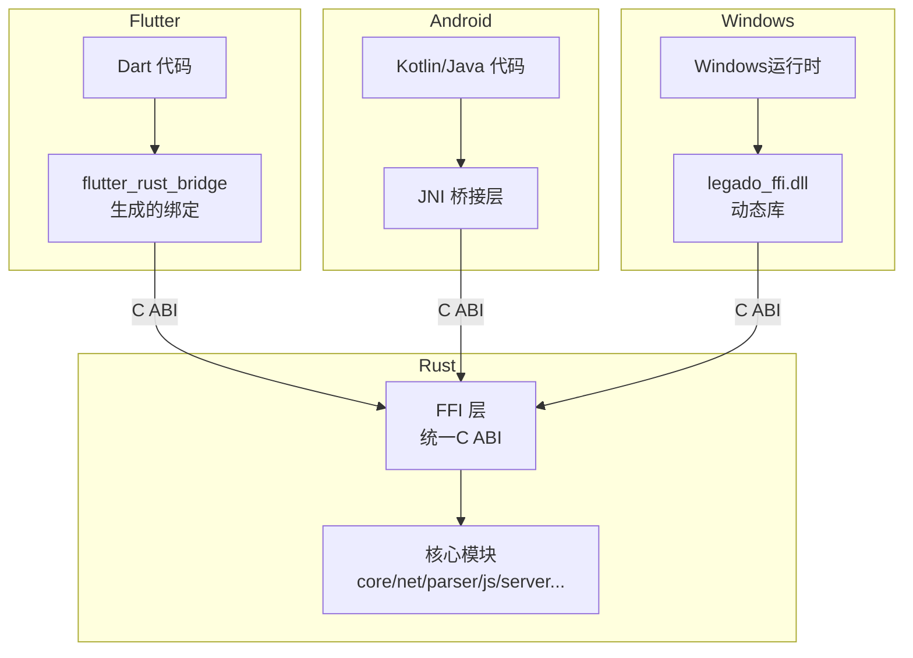
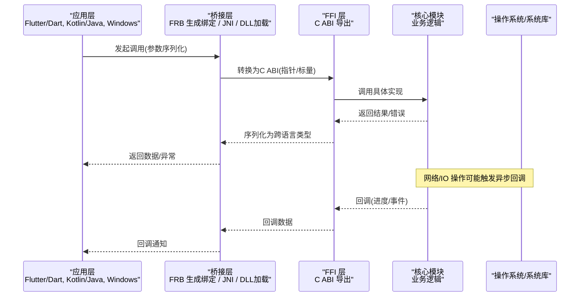
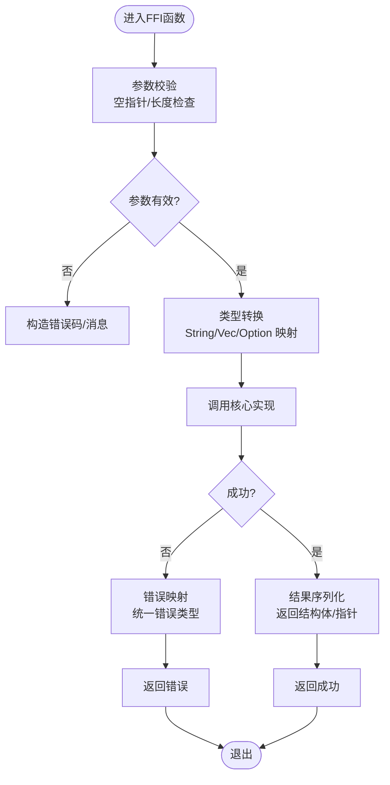
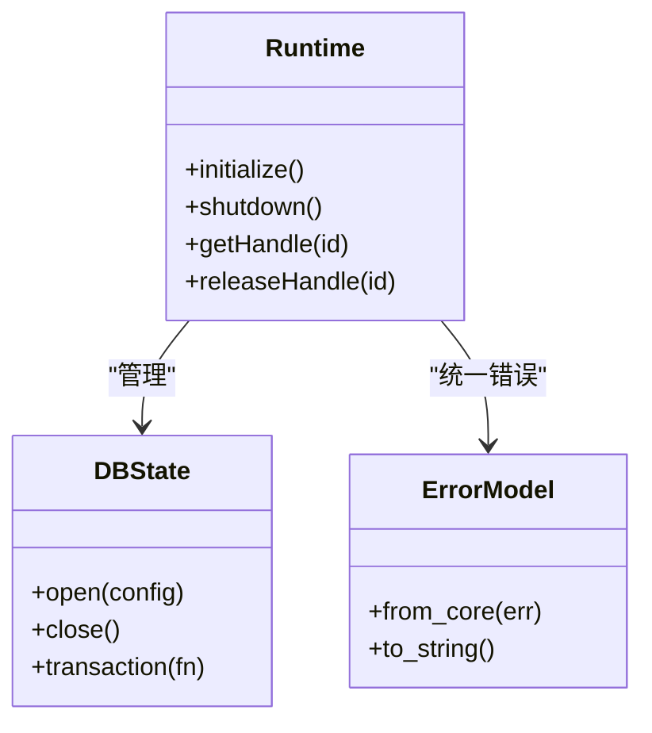
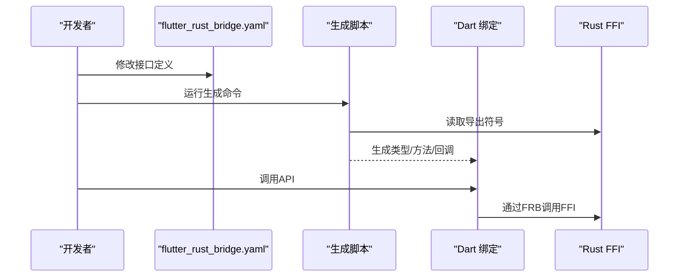
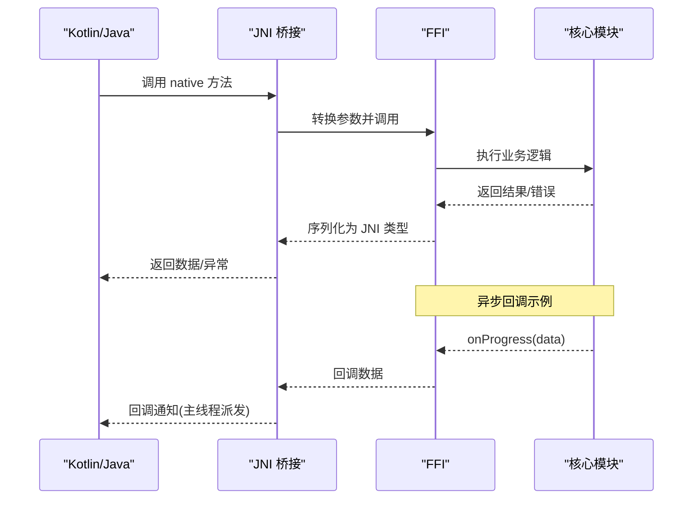
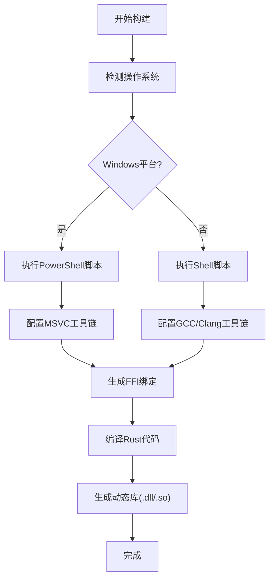
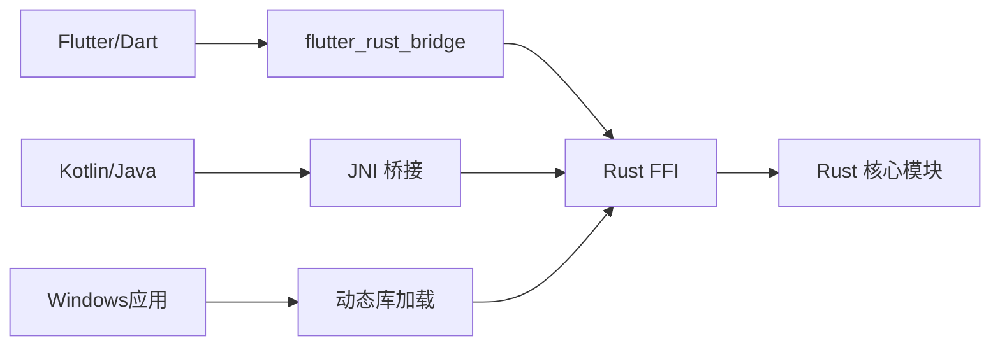

# FFI接口通信

<cite>
**本文引用的文件**   
- [rust/legado-ffi/src/lib.rs](file://rust/legado-ffi/src/lib.rs)
- [rust/legado-ffi/src/bridge.rs](file://rust/legado-ffi/src/bridge.rs)
- [rust/legado-ffi/src/ffi.rs](file://rust/legado-ffi/src/ffi.rs)
- [rust/legado-ffi/src/frb_generated.rs](file://rust/legado-ffi/src/frb_generated.rs)
- [rust/legado-ffi/src/runtime.rs](file://rust/legado-ffi/src/runtime.rs)
- [rust/legado-ffi/src/db_state.rs](file://rust/legado-ffi/src/db_state.rs)
- [rust/legado-ffi/src/error.rs](file://rust/legado-ffi/src/error.rs)
- [flutter_legado/flutter_rust_bridge.yaml](file://flutter_legado/flutter_rust_bridge.yaml)
- [flutter_legado/scripts/generate-bridge.sh](file://flutter_legado/scripts/generate-bridge.sh)
- [flutter_legado/scripts/generate-bridge.ps1](file://flutter_legado/scripts/generate-bridge.ps1)
- [app/src/main/java/io/legado/app/lib/cronet/CronetEngineProvider.kt](file://app/src/main/java/io/legado/app/lib/cronet/CronetEngineProvider.kt)
- [app/src/main/java/io/legado/app/utils/JniUtils.java](file://app/src/main/java/io/legado/app/utils/JniUtils.java)
- [rust/legado-core/src/types.rs](file://rust/legado-core/src/types.rs)
- [rust/legado-core/src/error.rs](file://rust/legado-core/src/error.rs)
</cite>

## 更新摘要
**所做更改**   
- 新增Windows平台FFI兼容性支持章节，详细说明legado_ffi.dll动态库加载问题的解决方案
- 更新Flutter Rust Bridge代码生成流程，增加Windows平台构建脚本支持
- 完善跨平台FFI调用约定和错误处理机制
- 增强故障排查指南，包含Windows平台特定的调试方法

## 目录
1. [简介](#简介)
2. [项目结构](#项目结构)
3. [核心组件](#核心组件)
4. [架构总览](#架构总览)
5. [详细组件分析](#详细组件分析)
6. [Windows平台FFI兼容性](#windows平台ffi兼容性)
7. [依赖关系分析](#依赖关系分析)
8. [性能考虑](#性能考虑)
9. [故障排查指南](#故障排查指南)
10. [结论](#结论)
11. [附录](#附录)

## 简介
本文件系统性梳理 Legado 项目中 Rust 与 Android/Kotlin、Flutter 之间的跨语言通信机制，重点覆盖：
- FFI 接口定义规范、调用约定与生命周期管理
- 数据类型映射（String、Vec、Option、Result 等）
- 内存管理策略与所有权边界
- 错误处理模式与异常传播
- JNI 桥接实现细节、回调机制与异步操作处理
- Windows平台FFI兼容性支持与动态库加载优化
- Flutter Rust Bridge代码生成流程的跨平台适配
- 调试方法与工具使用指南
- 性能优化技巧与最佳实践

## 项目结构
Legado 的跨语言通信由三层构成：
- Flutter 侧通过 flutter_rust_bridge 生成 Dart 绑定，调用 Rust 暴露的 C ABI。
- Android 侧通过 JNI 将 Kotlin/Java 调用转发到 Rust（或系统库），并负责线程模型与资源管理。
- Rust 侧以模块化 crate 组织业务逻辑，并通过统一的 FFI 层对外暴露稳定接口。
- Windows平台支持通过动态库(.dll)形式提供FFI接口，确保跨平台一致性。

图表来源
- [flutter_legado/flutter_rust_bridge.yaml](file://flutter_legado/flutter_rust_bridge.yaml)
- [rust/legado-ffi/src/lib.rs](file://rust/legado-ffi/src/lib.rs)
- [rust/legado-ffi/src/bridge.rs](file://rust/legado-ffi/src/bridge.rs)
- [rust/legado-ffi/src/ffi.rs](file://rust/legado-ffi/src/ffi.rs)

章节来源
- [rust/legado-ffi/src/lib.rs](file://rust/legado-ffi/src/lib.rs)
- [rust/legado-ffi/src/bridge.rs](file://rust/legado-ffi/src/bridge.rs)
- [rust/legado-ffi/src/ffi.rs](file://rust/legado-ffi/src/ffi.rs)
- [flutter_legado/flutter_rust_bridge.yaml](file://flutter_legado/flutter_rust_bridge.yaml)

## 核心组件
- FFI 入口与导出：集中定义对外 C ABI 函数，确保类型安全与稳定性。
- 运行时与状态管理：封装全局状态、初始化/销毁流程、线程与协程上下文。
- 数据库状态：持久化连接与事务边界控制。
- 错误模型：统一错误类型与序列化，便于上层捕获与展示。
- 类型映射：String、Vec、Option、Result 等基础类型的双向转换规则。
- 生成器配置：flutter_rust_bridge 的配置与代码生成脚本。
- Windows平台适配：动态库加载、路径解析、符号导出优化。

章节来源
- [rust/legado-ffi/src/lib.rs](file://rust/legado-ffi/src/lib.rs)
- [rust/legado-ffi/src/runtime.rs](file://rust/legado-ffi/src/runtime.rs)
- [rust/legado-ffi/src/db_state.rs](file://rust/legado-ffi/src/db_state.rs)
- [rust/legado-ffi/src/error.rs](file://rust/legado-ffi/src/error.rs)
- [rust/legado-core/src/types.rs](file://rust/legado-core/src/types.rs)
- [flutter_legado/flutter_rust_bridge.yaml](file://flutter_legado/flutter_rust_bridge.yaml)

## 架构总览
下图展示了从 Flutter/Kotlin/Windows 到 Rust 的完整调用链路，包括同步与异步路径、错误回传与回调机制。

图表来源
- [rust/legado-ffi/src/ffi.rs](file://rust/legado-ffi/src/ffi.rs)
- [rust/legado-ffi/src/bridge.rs](file://rust/legado-ffi/src/bridge.rs)
- [flutter_legado/flutter_rust_bridge.yaml](file://flutter_legado/flutter_rust_bridge.yaml)

## 详细组件分析

### FFI 层设计与调用约定
- 导出函数采用稳定的 C ABI，避免名称修饰与版本漂移问题。
- 所有输入输出类型需满足"可被 C 表示"的要求，复杂类型通过指针+长度传递。
- 字符串统一为 UTF-8，必要时进行编码校验与转换。
- 数组/集合通过"指针 + 长度 + 可选容量"的方式传递，避免不必要的拷贝。
- 生命周期由调用方与被调方共同保证：传入指针的生命期必须覆盖调用期间；返回指针需明确所有权转移或借用语义。

图表来源
- [rust/legado-ffi/src/ffi.rs](file://rust/legado-ffi/src/ffi.rs)
- [rust/legado-core/src/types.rs](file://rust/legado-core/src/types.rs)

章节来源
- [rust/legado-ffi/src/ffi.rs](file://rust/legado-ffi/src/ffi.rs)
- [rust/legado-core/src/types.rs](file://rust/legado-core/src/types.rs)

### 运行时与生命周期管理
- 初始化：加载配置、注册日志、创建线程池/协程上下文。
- 销毁：释放资源、关闭连接、清理缓存。
- 线程模型：主线程与后台线程分离，UI 更新必须在主线程执行。
- 资源句柄：对外暴露句柄（如数据库连接、网络客户端），由调用方负责关闭。

图表来源
- [rust/legado-ffi/src/runtime.rs](file://rust/legado-ffi/src/runtime.rs)
- [rust/legado-ffi/src/db_state.rs](file://rust/legado-ffi/src/db_state.rs)
- [rust/legado-ffi/src/error.rs](file://rust/legado-ffi/src/error.rs)

章节来源
- [rust/legado-ffi/src/runtime.rs](file://rust/legado-ffi/src/runtime.rs)
- [rust/legado-ffi/src/db_state.rs](file://rust/legado-ffi/src/db_state.rs)
- [rust/legado-ffi/src/error.rs](file://rust/legado-ffi/src/error.rs)

### 数据类型映射与内存管理
- String：UTF-8 字节串，必要时做编码验证；避免在热点路径频繁分配。
- Vec<T>：连续内存块，传递指针与长度；接收端负责释放或复制。
- Option<T>：使用"存在标志 + 值"或"空指针"表示；避免默认构造开销。
- Result<T,E>：转为"成功返回值 + 错误码/错误对象"，上层统一处理。
- 自定义结构体：按字段顺序布局，避免对齐与填充差异；必要时提供显式布局声明。

章节来源
- [rust/legado-core/src/types.rs](file://rust/legado-core/src/types.rs)
- [rust/legado-core/src/error.rs](file://rust/legado-core/src/error.rs)

### Flutter 侧集成与代码生成
- 使用 flutter_rust_bridge 定义接口契约，自动生成 Dart 绑定。
- 配置文件指定模块、导出函数、类型映射与回调签名。
- 构建脚本在 CI/本地环境中生成最新绑定，确保两端一致。
- 支持跨平台构建，包括Windows平台的PowerShell脚本。

图表来源
- [flutter_legado/flutter_rust_bridge.yaml](file://flutter_legado/flutter_rust_bridge.yaml)
- [flutter_legado/scripts/generate-bridge.sh](file://flutter_legado/scripts/generate-bridge.sh)
- [flutter_legado/scripts/generate-bridge.ps1](file://flutter_legado/scripts/generate-bridge.ps1)
- [rust/legado-ffi/src/frb_generated.rs](file://rust/legado-ffi/src/frb_generated.rs)

章节来源
- [flutter_legado/flutter_rust_bridge.yaml](file://flutter_legado/flutter_rust_bridge.yaml)
- [flutter_legado/scripts/generate-bridge.sh](file://flutter_legado/scripts/generate-bridge.sh)
- [flutter_legado/scripts/generate-bridge.ps1](file://flutter_legado/scripts/generate-bridge.ps1)
- [rust/legado-ffi/src/frb_generated.rs](file://rust/legado-ffi/src/frb_generated.rs)

### Android/JNI 桥接与回调
- JNI 层负责将 Java/Kotlin 类型转换为 C ABI，并处理线程切换。
- 回调通过函数指针或事件总线实现，注意回调线程与 UI 线程隔离。
- 异步操作使用 Future/Coroutine 包装，避免阻塞主线程。

图表来源
- [app/src/main/java/io/legado/app/utils/JniUtils.java](file://app/src/main/java/io/legado/app/utils/JniUtils.java)
- [rust/legado-ffi/src/ffi.rs](file://rust/legado-ffi/src/ffi.rs)

章节来源
- [app/src/main/java/io/legado/app/utils/JniUtils.java](file://app/src/main/java/io/legado/app/utils/JniUtils.java)
- [rust/legado-ffi/src/ffi.rs](file://rust/legado-ffi/src/ffi.rs)

### 错误处理模式
- 统一错误类型：将底层错误映射为通用错误码与消息。
- 异常传播：Rust 侧不抛异常，通过返回值或错误对象传递。
- 上层处理：Flutter/Kotlin 侧根据错误码决定重试、降级或提示用户。

章节来源
- [rust/legado-ffi/src/error.rs](file://rust/legado-ffi/src/error.rs)
- [rust/legado-core/src/error.rs](file://rust/legado-core/src/error.rs)

## Windows平台FFI兼容性

### 动态库加载机制
Windows平台通过legado_ffi.dll动态库提供FFI接口，解决了传统静态链接带来的部署复杂性。动态库加载机制包含以下关键特性：

- **路径解析优化**：支持相对路径和绝对路径的动态库定位，自动搜索标准系统路径。
- **符号导出管理**：使用`#[no_mangle]`属性确保C ABI兼容性，避免名称修饰问题。
- **加载失败处理**：提供详细的错误信息，包括缺失依赖、版本不匹配等常见问题的诊断。
- **热重载支持**：开发模式下支持动态库热重载，提升开发效率。

### Flutter Rust Bridge代码生成流程更新
Flutter Rust Bridge的代码生成流程已针对Windows平台进行优化：

- **跨平台构建脚本**：提供PowerShell脚本(generate-bridge.ps1)和Shell脚本(generate-bridge.sh)，支持Windows和Unix环境。
- **目标平台检测**：自动检测当前操作系统，选择合适的编译器和链接器。
- **依赖管理**：智能处理Windows特有的依赖项，如MSVC工具链和SDK。
- **增量构建**：支持增量编译，减少重复构建时间。

图表来源
- [flutter_legado/scripts/generate-bridge.ps1](file://flutter_legado/scripts/generate-bridge.ps1)
- [flutter_legado/scripts/generate-bridge.sh](file://flutter_legado/scripts/generate-bridge.sh)

### Windows平台特定优化
- **内存对齐优化**：针对Windows x64架构优化数据结构对齐，提升访问性能。
- **Unicode支持**：完整的UTF-16/UTF-8字符集转换，确保中文等多字节字符正确处理。
- **线程局部存储**：使用TLS管理线程特定数据，避免竞态条件。
- **异常安全**：确保C++异常不会跨越FFI边界，防止未定义行为。

### 故障排查与调试
Windows平台的FFI问题排查包含以下专门工具和方法：

- **依赖查看器**：使用Dependency Walker或Dependencies工具检查动态库依赖关系。
- **内存调试**：Visual Studio Debugger配合WinDbg进行内存泄漏和崩溃分析。
- **性能分析**：使用Performance Profiler识别性能瓶颈和优化机会。
- **日志记录**：启用详细的FFI调用日志，记录参数、返回值和异常信息。

**章节来源**
- [flutter_legado/scripts/generate-bridge.ps1](file://flutter_legado/scripts/generate-bridge.ps1)
- [flutter_legado/scripts/generate-bridge.sh](file://flutter_legado/scripts/generate-bridge.sh)
- [rust/legado-ffi/src/lib.rs](file://rust/legado-ffi/src/lib.rs)

## 依赖关系分析
- Flutter 依赖 flutter_rust_bridge 生成绑定，调用 Rust 导出的 C ABI。
- Android 依赖 JNI 将 Kotlin/Java 调用转至 Rust 或系统库。
- Windows 依赖动态库加载机制调用 Rust 导出的 C ABI。
- Rust 内部模块间通过 trait 与模块边界解耦，FFI 层仅暴露最小必要接口。

图表来源
- [flutter_legado/flutter_rust_bridge.yaml](file://flutter_legado/flutter_rust_bridge.yaml)
- [rust/legado-ffi/src/lib.rs](file://rust/legado-ffi/src/lib.rs)

章节来源
- [flutter_legado/flutter_rust_bridge.yaml](file://flutter_legado/flutter_rust_bridge.yaml)
- [rust/legado-ffi/src/lib.rs](file://rust/legado-ffi/src/lib.rs)

## 性能考虑
- 减少跨语言拷贝：尽量传递引用/指针，避免重复序列化。
- 批量操作：合并多次调用为一次批量 API，降低上下文切换开销。
- 异步优先：网络/IO 操作使用异步回调，避免阻塞调用线程。
- 内存池与复用：对高频分配的对象使用对象池或静态缓存。
- 零拷贝解析：在可能的情况下直接解析原始字节流，避免中间字符串。
- Windows平台优化：利用SIMD指令和并行处理提升计算密集型任务性能。

## 故障排查指南
- 日志采集：在 FFI 入口/出口打印关键参数与返回值，定位失败点。
- 崩溃分析：使用 adb logcat、Android Studio Profiler、Valgrind（Linux）、Visual Studio Debugger（Windows）等工具。
- 内存泄漏：检查未释放的指针、未关闭的连接、未释放的缓冲区。
- 线程问题：确认回调是否在主线程执行 UI 更新，避免竞态条件。
- 类型不一致：核对 flutter_rust_bridge 配置与实际导出类型是否一致。
- Windows平台问题：检查动态库路径、依赖关系、权限设置和杀毒软件拦截。

**章节来源**
- [rust/legado-ffi/src/error.rs](file://rust/legado-ffi/src/error.rs)
- [app/src/main/java/io/legado/app/utils/JniUtils.java](file://app/src/main/java/io/legado/app/utils/JniUtils.java)

## 结论
Legado 的 FFI 通信通过清晰的层次划分与严格的类型映射，实现了 Flutter/Kotlin/Windows 与 Rust 之间的高效、安全交互。新增的Windows平台支持和优化的Flutter Rust Bridge代码生成流程，进一步提升了跨平台兼容性和开发体验。遵循本文档的规范与实践，可显著提升跨语言调用的稳定性与性能，并为后续扩展与维护奠定基础。

## 附录
- 常用数据类型映射表：
  - String ↔ UTF-8 字节串
  - Vec<T> ↔ 指针 + 长度
  - Option<T> ↔ 存在标志 + 值
  - Result<T,E> ↔ 返回值 + 错误码/对象
- 构建命令参考：
  - Flutter 侧：运行 generate-bridge 脚本生成最新绑定
  - Android 侧：确保 JNI 头文件与签名一致
  - Windows 侧：配置MSVC工具链和依赖项
- 调试工具推荐：
  - adb logcat、Android Studio Profiler、Rust 日志框架（env_logger/tracing）
  - Visual Studio Debugger、WinDbg、Dependency Walker（Windows）
- Windows平台注意事项：
  - 确保动态库路径正确且可访问
  - 检查杀毒软件和防火墙设置
  - 验证依赖库版本兼容性