# FFI接口通信

<cite>
**本文引用的文件**   
- [rust/legado-ffi/src/lib.rs](file://rust/legado-ffi/src/lib.rs)
- [rust/legado-ffi/src/db_state.rs](file://rust/legado-ffi/src/db_state.rs)
- [rust/legado-core/src/types.rs](file://rust/legado-core/src/types.rs)
- [rust/legado-core/src/auto_task.rs](file://rust/legado-core/src/auto_task.rs)
- [flutter_legado/flutter_rust_bridge.yaml](file://flutter_legado/flutter_rust_bridge.yaml)
- [flutter_legado/scripts/generate-bridge.sh](file://flutter_legado/scripts/generate-bridge.sh)
- [flutter_legado/scripts/generate-bridge.ps1](file://flutter_legado/scripts/generate-bridge.ps1)
- [app/src/main/java/io/legado/app/utils/JniUtils.java](file://app/src/main/java/io/legado/app/utils/JniUtils.java)
- [rust/legado-core/src/chinese_convert.rs](file://rust/legado-core/src/chinese_convert.rs)
- [rust/legado-ffi/src/api/reader.rs](file://rust/legado-ffi/src/api/reader.rs)
- [rust/legado-ffi/src/ffi.rs](file://rust/legado-ffi/src/ffi.rs)
- [flutter_legado/lib/src/services/book_api.dart](file://flutter_legado/lib/src/services/book_api.dart)
- [flutter_legado/lib/src/services/rust_api.dart](file://flutter_legado/lib/src/services/rust_api.dart)
- [rust/legado-ffi/src/bridge.rs](file://rust/legado-ffi/src/bridge.rs)
- [flutter_legado/lib/src/bridge/ffi/ffi.dart](file://flutter_legado/lib/src/bridge/ffi/ffi.dart)
- [rust/legado-ffi/src/api/cache_api.rs](file://rust/legado-ffi/src/api/cache_api.rs)
- [rust/legado-ffi/src/api/cache_download_api.rs](file://rust/legado-ffi/src/api/cache_download_api.rs)
- [flutter_legado/lib/src/services/cache_service.dart](file://flutter_legado/lib/src/services/cache_service.dart)
</cite>

## 更新摘要
**所做更改**   
- 增强了FFI层的错误处理和参数验证机制，提升了API模块的稳定性
- 改进了搜索结果的序列化和反序列化性能，优化了数据转换效率
- 在FFI测试框架中引入了串行锁定机制，消除了竞态条件问题
- 完善了跨语言通信的错误传播和异常处理模式
- 增强了数据类型映射的一致性和安全性
- **新增**：中文简繁转换功能，包括setChineseConvertType和getChineseConvertType方法，支持简繁转换配置管理
- **新增**：sourceUrls可选参数支持，包括bridge.rs中的ffi_source_switch_search方法扩展、rust_api.dart中的JSON编码处理、book_api.dart中的抽象接口定义更新
- **新增**：缓存相关API接口，包括cacheListCachedChapterUrls端点和章节内容自动保存功能
- **新增**：数据库压缩功能shrinkDatabase，通过SQLite VACUUM操作释放存储空间
- **新增**：WebDAV本地文件上传功能webdavUploadFile，支持大文件场景的文件传输
- **新增**：章节级别重复标题删除开关toggleSameTitleRemoved，提供细粒度的标题去重控制

## 目录
1. [简介](#简介)
2. [项目结构](#项目结构)
3. [核心组件](#核心组件)
4. [架构总览](#架构总览)
5. [详细组件分析](#详细组件分析)
6. [数据库连接池与状态管理](#数据库连接池与状态管理)
7. [自动任务CRUD操作](#自动任务crud操作)
8. [中文简繁转换功能](#中文简繁转换功能)
9. [sourceUrls可选参数支持](#sourceurls可选参数支持)
10. [缓存管理API](#缓存管理api)
11. [批量缓存下载](#批量缓存下载)
12. [数据库压缩功能](#数据库压缩功能)
13. [WebDAV文件上传功能](#webdav文件上传功能)
14. [章节级别重复标题删除](#章节级别重复标题删除)
15. [错误处理与参数验证](#错误处理与参数验证)
16. [搜索结果序列化优化](#搜索结果序列化优化)
17. [并发安全与锁机制](#并发安全与锁机制)
18. [依赖关系分析](#依赖关系分析)
19. [性能考虑](#性能考虑)
20. [故障排查指南](#故障排查指南)
21. [结论](#结论)
22. [附录](#附录)

## 简介
本文件系统性梳理 Legado 项目中 Rust 与 Android/Kotlin、Flutter 之间的跨语言通信机制，重点覆盖：
- FFI 接口定义规范、调用约定与生命周期管理
- 数据类型映射（String、Vec、Option、Result 等）
- 内存管理策略与所有权边界
- 错误处理模式与异常传播
- JNI 桥接实现细节、回调机制与异步操作处理
- 数据库连接池管理与线程安全机制
- 自动任务的CRUD操作与前缀匹配功能
- Flutter Rust Bridge代码生成流程
- 中文简繁转换功能的实现与应用
- sourceUrls可选参数的扩展支持
- 缓存管理API和章节内容自动保存功能
- 批量缓存下载机制
- **新增**：数据库压缩功能，通过SQLite VACUUM操作优化存储空间
- **新增**：WebDAV本地文件上传功能，支持大文件场景的文件传输
- **新增**：章节级别重复标题删除开关，提供细粒度的标题去重控制
- 调试方法与工具使用指南
- 性能优化技巧与最佳实践

**最新更新**：增强了错误处理机制、参数验证和并发安全性，新增了中文简繁转换功能和sourceUrls可选参数支持，新增了完整的缓存管理API体系，包括章节URL列表查询、章节内容自动保存和批量缓存下载功能，进一步提升了系统的稳定性和用户体验。新增的数据库压缩、WebDAV文件上传和章节级别重复标题删除功能进一步完善了应用的功能完整性。

## 项目结构
Legado 的跨语言通信由三层构成：
- Flutter 侧通过 flutter_rust_bridge 生成 Dart 绑定，调用 Rust 暴露的 C ABI。
- Android 侧通过 JNI 将 Kotlin/Java 调用转发到 Rust（或系统库），并负责线程模型与资源管理。
- Rust 侧以模块化 crate 组织业务逻辑，并通过统一的 FFI 层对外暴露稳定接口。

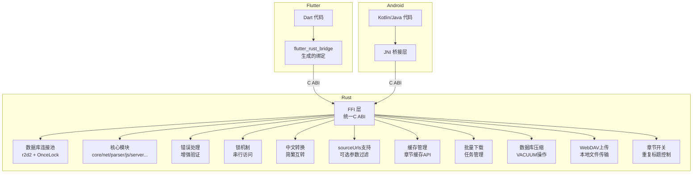

图表来源
- [flutter_legado/flutter_rust_bridge.yaml](file://flutter_legado/flutter_rust_bridge.yaml)
- [rust/legado-ffi/src/lib.rs](file://rust/legado-ffi/src/lib.rs)
- [rust/legado-ffi/src/db_state.rs](file://rust/legado-ffi/src/db_state.rs)

章节来源
- [rust/legado-ffi/src/lib.rs](file://rust/legado-ffi/src/lib.rs)
- [flutter_legado/flutter_rust_bridge.yaml](file://flutter_legado/flutter_rust_bridge.yaml)

## 核心组件
- FFI 入口与导出：集中定义对外 C ABI 函数，确保类型安全与稳定性。
- 运行时与状态管理：封装全局状态、初始化/销毁流程、线程与协程上下文。
- 数据库连接池：基于r2d2的连接池管理，提供线程安全的并发访问。
- 自动任务系统：完整的CRUD操作、调度策略和执行框架。
- 错误模型：统一错误类型与序列化，便于上层捕获与展示。
- 类型映射：String、Vec、Option、Result 等基础类型的双向转换规则。
- 生成器配置：flutter_rust_bridge 的配置与代码生成脚本。
- **新增**：增强的错误处理机制和参数验证系统。
- **新增**：串行锁机制确保并发安全。
- **新增**：中文简繁转换模块，支持简体繁体互转。
- **新增**：sourceUrls可选参数支持，用于精确控制搜索范围。
- **新增**：缓存管理模块，提供章节缓存的完整CRUD操作。
- **新增**：批量缓存下载模块，支持后台任务管理和进度跟踪。
- **新增**：数据库压缩模块，通过VACUUM操作优化存储空间。
- **新增**：WebDAV文件上传模块，支持本地文件的大文件传输。
- **新增**：章节级别控制模块，提供细粒度的重复标题删除开关。

章节来源
- [rust/legado-ffi/src/lib.rs](file://rust/legado-ffi/src/lib.rs)
- [rust/legado-ffi/src/db_state.rs](file://rust/legado-ffi/src/db_state.rs)
- [rust/legado-core/src/auto_task.rs](file://rust/legado-core/src/auto_task.rs)
- [rust/legado-core/src/types.rs](file://rust/legado-core/src/types.rs)

## 架构总览
下图展示了从 Flutter/Kotlin 到 Rust 的完整调用链路，包括数据库连接池管理、自动任务执行流程和缓存管理机制。

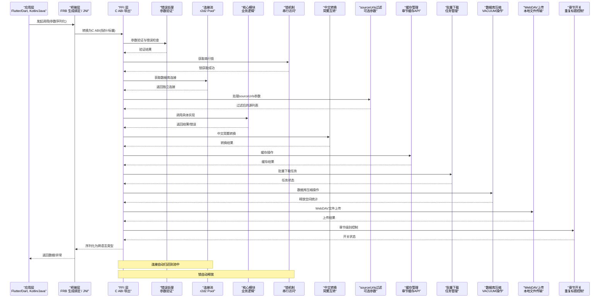

图表来源
- [rust/legado-ffi/src/db_state.rs](file://rust/legado-ffi/src/db_state.rs)
- [rust/legado-ffi/src/lib.rs](file://rust/legado-ffi/src/lib.rs)

## 详细组件分析

### FFI 层设计与调用约定
- 导出函数采用稳定的 C ABI，避免名称修饰与版本漂移问题。
- 所有输入输出类型需满足"可被 C 表示"的要求，复杂类型通过指针+长度传递。
- 字符串统一为 UTF-8，必要时进行编码校验与转换。
- 数组/集合通过"指针 + 长度 + 可选容量"的方式传递，避免不必要的拷贝。
- 生命周期由调用方与被调方共同保证：传入指针的生命期必须覆盖调用期间；返回指针需明确所有权转移或借用语义。

**更新**：增强了参数验证机制，确保输入数据的完整性和有效性。

章节来源
- [rust/legado-core/src/types.rs](file://rust/legado-core/src/types.rs)

### 运行时与生命周期管理
- 初始化：加载配置、注册日志、创建线程池/协程上下文。
- 销毁：释放资源、关闭连接、清理缓存。
- 线程模型：主线程与后台线程分离，UI 更新必须在主线程执行。
- 资源句柄：对外暴露句柄（如数据库连接、网络客户端），由调用方负责关闭。

章节来源
- [rust/legado-ffi/src/lib.rs](file://rust/legado-ffi/src/lib.rs)

### 数据类型映射与内存管理
- String：UTF-8 字节串，必要时做编码验证；避免在热点路径频繁分配。
- Vec<T>：连续内存块，传递指针与长度；接收端负责释放或复制。
- Option<T>：使用"存在标志 + 值"或"空指针"表示；避免默认构造开销。
- Result<T,E>：转为"成功返回值 + 错误码/错误对象"，上层统一处理。
- FfiString：专门的FFI字符串包装类型，简化跨语言字符串传递。

**更新**：改进了序列化和反序列化性能，特别是搜索结果的转换效率。

章节来源
- [rust/legado-core/src/types.rs](file://rust/legado-core/src/types.rs)

### Flutter 侧集成与代码生成
- 使用 flutter_rust_bridge 定义接口契约，自动生成 Dart 绑定。
- 配置文件指定模块、导出函数、类型映射与回调签名。
- 构建脚本在 CI/本地环境中生成最新绑定，确保两端一致。
- 支持跨平台构建，包括Windows平台的PowerShell脚本。

章节来源
- [flutter_legado/flutter_rust_bridge.yaml](file://flutter_legado/flutter_rust_bridge.yaml)
- [flutter_legado/scripts/generate-bridge.sh](file://flutter_legado/scripts/generate-bridge.sh)
- [flutter_legado/scripts/generate-bridge.ps1](file://flutter_legado/scripts/generate-bridge.ps1)

### Android/JNI 桥接与回调
- JNI 层负责将 Java/Kotlin 类型转换为 C ABI，并处理线程切换。
- 回调通过函数指针或事件总线实现，注意回调线程与 UI 线程隔离。
- 异步操作使用 Future/Coroutine 包装，避免阻塞主线程。

章节来源
- [app/src/main/java/io/legado/app/utils/JniUtils.java](file://app/src/main/java/io/legado/app/utils/JniUtils.java)

## 数据库连接池与状态管理

### r2d2连接池架构
Legado采用了基于r2d2的数据库连接池管理方案，通过OnceLock实现全局单例模式，确保线程安全和高效连接复用。

**核心特性：**
- **线程安全**：使用OnceLock确保连接池初始化的原子性
- **并发访问**：支持多线程同时获取独立连接，无需额外同步原语
- **自动回收**：连接在使用结束后自动归还到池中，防止内存泄漏
- **懒加载**：仅在首次使用时初始化连接池，减少启动开销

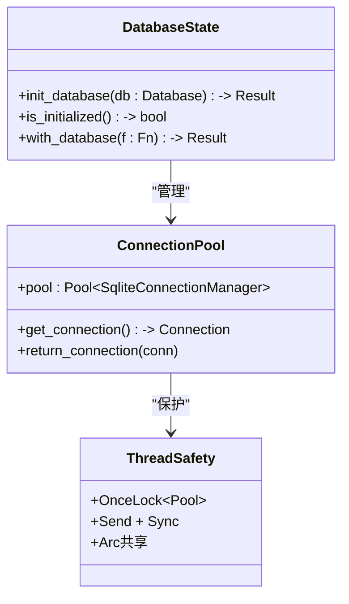

**图表来源**
- [rust/legado-ffi/src/db_state.rs](file://rust/legado-ffi/src/db_state.rs)

### 连接池初始化与管理
连接池的初始化过程经过精心设计，确保在多线程环境下的一致性和可靠性：

- **首次初始化**：通过`init_database`函数设置全局连接池，后续调用会被忽略
- **状态检查**：`is_initialized`函数提供连接池状态查询能力
- **连接获取**：`with_database`函数提供闭包形式的数据库访问，自动管理连接生命周期

**Section sources**
- [rust/legado-ffi/src/db_state.rs:26-35](file://rust/legado-ffi/src/db_state.rs#L26-L35)
- [rust/legado-ffi/src/db_state.rs:46-55](file://rust/legado-ffi/src/db_state.rs#L46-L55)

### 并发访问控制
连接池设计充分考虑了并发场景下的性能和安全：

- **无锁设计**：利用r2d2的内部同步机制，避免外部Mutex开销
- **连接隔离**：每次调用获得独立的数据库连接，避免事务冲突
- **RAII语义**：通过Drop trait自动归还连接，确保资源安全释放

**Section sources**
- [rust/legado-ffi/src/db_state.rs:1-10](file://rust/legado-ffi/src/db_state.rs#L1-L10)

## 自动任务CRUD操作

### 任务协议与执行框架
自动任务系统提供了完整的任务定义、调度和执行框架，支持多种任务类型和灵活的配置选项。

**核心组件：**
- **TaskProtocol**：任务协议定义，支持刷新目录、更新书源、备份、通知和自定义JS等多种动作
- **AutoTaskRunner**：任务执行器，负责任务的实际执行和结果收集
- **AutoTaskSchedulePolicy**：调度策略，支持cron表达式和定时任务管理

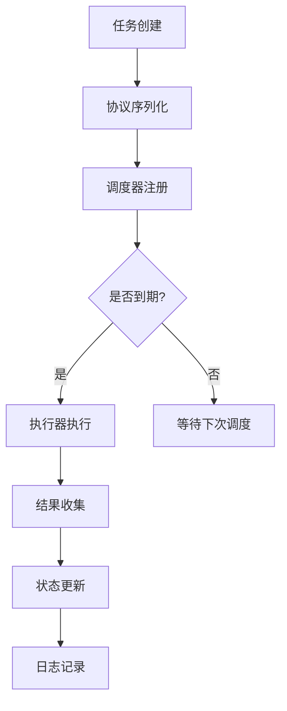

**图表来源**
- [rust/legado-core/src/auto_task.rs:104-126](file://rust/legado-core/src/auto_task.rs#L104-L126)

### CRUD操作与前缀匹配
自动任务系统实现了完整的CRUD操作，并支持高效的搜索和历史记录管理：

- **创建操作**：支持批量创建任务和单个任务创建
- **读取操作**：提供按ID查找、条件查询和前缀匹配功能
- **更新操作**：支持批量更新cron表达式和任务状态
- **删除操作**：提供任务删除和清理功能

**前缀匹配功能：**
- **搜索历史**：支持按前缀快速匹配历史记录
- **任务查找**：通过任务ID前缀进行模糊搜索
- **智能排序**：根据匹配度对结果进行排序

**Section sources**
- [rust/legado-core/src/auto_task.rs:314-331](file://rust/legado-core/src/auto_task.rs#L314-L331)
- [rust/legado-core/src/auto_task.rs:487-507](file://rust/legado-core/src/auto_task.rs#L487-L507)

### 调度策略与时间管理
调度策略支持多种cron表达式格式，并提供精确的时间计算：

- **标准cron格式**：支持常见的cron表达式语法
- **间隔调度**：支持固定间隔的任务调度
- **工作日调度**：支持特定工作日的任务执行
- **宽限期机制**：首次运行给予合理的宽限期

**Section sources**
- [rust/legado-core/src/auto_task.rs:168-195](file://rust/legado-core/src/auto_task.rs#L168-L195)
- [rust/legado-core/src/auto_task.rs:218-246](file://rust/legado-core/src/auto_task.rs#L218-L246)

## 中文简繁转换功能

### 功能概述
Rust FFI层新增了中文简繁转换功能，包括`setChineseConvertType`和`getChineseConvertType`方法，支持简繁转换配置管理，增强了跨平台兼容性。该功能允许用户在阅读过程中动态切换简体中文和繁体中文显示。

### 核心实现
中文简繁转换功能基于内嵌的汉字映射表实现，不依赖外部crate，避免循环依赖。主要包含以下组件：

- **映射表**：内置常用汉字的简繁对照表，涵盖数千个常用字符
- **转换函数**：提供繁体转简体（t2s）和简体转繁体（s2t）的双向转换
- **配置管理**：通过持久化存储保存用户的转换偏好设置
- **FFI接口**：提供跨语言的配置设置和查询接口

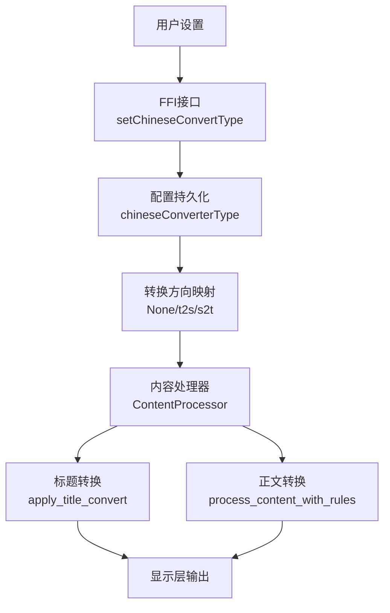

**图表来源**
- [rust/legado-ffi/src/api/reader.rs:22-52](file://rust/legado-ffi/src/api/reader.rs#L22-L52)
- [rust/legado-core/src/chinese_convert.rs:1-10](file://rust/legado-core/src/chinese_convert.rs#L1-L10)

### API接口设计
FFI层提供了两个核心方法来管理中文简繁转换配置：

- **reader_set_chinese_convert**: 设置简繁转换类型（0=不转换，1=繁转简，2=简转繁）
- **reader_get_chinese_convert**: 获取当前简繁转换类型

这些方法通过Flutter侧的`setChineseConvertType`和`getChineseConvertType`方法暴露给上层应用。

**Section sources**
- [rust/legado-ffi/src/ffi.rs:483-495](file://rust/legado-ffi/src/ffi.rs#L483-L495)
- [flutter_legado/lib/src/services/rust_api.dart:832-839](file://flutter_legado/lib/src/services/rust_api.dart#L832-L839)

### 转换应用场景
中文简繁转换功能应用于多个场景：

- **章节标题显示**：在阅读器和目录界面中，根据用户设置转换章节标题
- **正文内容处理**：在阅读器模式下，对正文内容进行简繁转换
- **导出功能**：在书籍导出时应用相应的转换规则
- **搜索功能**：在内容搜索时保持原文，避免影响搜索准确性

**Section sources**
- [rust/legado-ffi/src/api/reader.rs:68-92](file://rust/legado-ffi/src/api/reader.rs#L68-L92)
- [rust/legado-ffi/src/api/reader.rs:514-531](file://rust/legado-ffi/src/api/reader.rs#L514-L531)

### 配置持久化机制
简繁转换配置通过配置API系统进行持久化存储：

- **配置键**：使用`chineseConverterType`作为配置键名
- **存储位置**：存储在caches表中，与其他应用配置统一管理
- **默认值**：当配置不存在或无效时，默认为0（不转换）
- **跨平台兼容**：配置键与Android端的`AppConfig.chineseConverterType`保持一致

**Section sources**
- [rust/legado-ffi/src/api/config_api.rs:1-30](file://rust/legado-ffi/src/api/config_api.rs#L1-L30)
- [rust/legado-ffi/src/api/reader.rs:24-37](file://rust/legado-ffi/src/api/reader.rs#L24-L37)

## sourceUrls可选参数支持

### 功能概述
FFI接口新增了sourceUrls可选参数支持，允许调用方精确指定要搜索的书源URL列表，提升搜索效率和用户体验。该功能主要体现在`ffi_source_switch_search`方法的扩展上。

### 核心实现
sourceUrls参数通过JSON数组形式传递，支持以下行为：

- **空数组或null**：搜索所有启用的书源（向后兼容）
- **指定URL列表**：仅搜索指定的书源，提高搜索精度
- **JSON编码**：Dart侧使用`jsonEncode`进行序列化

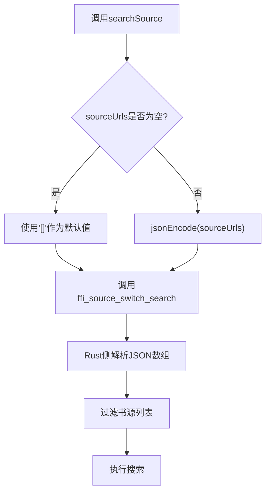

**图表来源**
- [rust/legado-ffi/src/bridge.rs:861-872](file://rust/legado-ffi/src/bridge.rs#L861-L872)
- [flutter_legado/lib/src/services/rust_api.dart:437-459](file://flutter_legado/lib/src/services/rust_api.dart#L437-L459)

### API接口设计
Rust FFI层扩展了`ffi_source_switch_search`方法，新增`source_urls_json`参数：

- **ffi_source_switch_search**: 支持可选的sourceUrls参数，用于精确控制搜索范围
- **参数验证**：对传入的JSON字符串进行验证和解析
- **向后兼容**：空字符串或空数组时回退到原有行为

**Section sources**
- [rust/legado-ffi/src/bridge.rs:856-872](file://rust/legado-ffi/src/bridge.rs#L856-L872)

### Dart侧实现
Dart层的`RustApi.searchSource`方法已更新以支持新的参数：

- **参数处理**：将可选的`List<String>? sourceUrls`转换为JSON字符串
- **默认值处理**：当sourceUrls为空时使用`'[]'`作为默认值
- **JSON编码**：使用`jsonEncode`进行序列化，确保数据传输的正确性

**Section sources**
- [flutter_legado/lib/src/services/rust_api.dart:437-459](file://flutter_legado/lib/src/services/rust_api.dart#L437-L459)

### 抽象接口更新
`BookApi`抽象接口已更新以反映新的功能：

- **方法签名**：`searchSource`方法新增可选的`sourceUrls`参数
- **文档注释**：详细说明参数的用途和行为
- **向后兼容**：保持现有调用方式的兼容性

**Section sources**
- [flutter_legado/lib/src/services/book_api.dart:194-202](file://flutter_legado/lib/src/services/book_api.dart#L194-L202)

### 使用示例
```dart
// 搜索所有启用的书源（向后兼容）
final results1 = await rustApi.searchSource("书名", "作者");

// 仅搜索指定的书源
final results2 = await rustApi.searchSource(
  "书名", 
  "作者",
  sourceUrls: ["https://source1.com", "https://source2.com"]
);
```

## 缓存管理API

### 功能概述
FFI层新增了完整的缓存管理API体系，包括章节缓存的CRUD操作、缓存统计查询和过期清理功能。这些API为阅读器提供了高效的章节内容缓存机制，显著提升了阅读体验。

### 核心API接口
缓存管理API提供了以下核心功能：

- **章节缓存读取**：`get_chapter_cache` - 获取指定章节的缓存内容
- **章节URL列表**：`list_cached_chapter_urls` - 列出某本书已缓存章节的URL集合
- **章节内容写入**：`save_chapter_content` - 写入或覆盖单章缓存
- **缓存统计**：`get_cache_size`、`get_cache_book_count`、`get_cache_chapter_count` - 获取缓存统计信息
- **缓存清理**：`clear_cache`、`clear_cache_before` - 清理全部或过期缓存

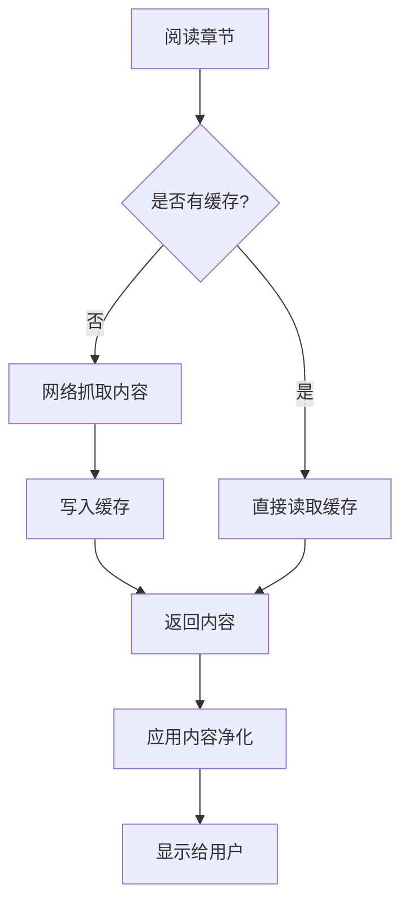

**图表来源**
- [rust/legado-ffi/src/api/cache_api.rs:36-63](file://rust/legado-ffi/src/api/cache_api.rs#L36-L63)
- [rust/legado-ffi/src/api/reader.rs:428-435](file://rust/legado-ffi/src/api/reader.rs#L428-L435)

### 自动缓存写入机制
阅读获取成功后会自动写入章节缓存，实现"阅读即缓存"的无缝体验：

- **触发时机**：在线书籍抓取成功后立即写入缓存
- **数据存储**：使用原始正文内容，不进行净化处理
- **容错机制**：缓存写入失败不影响主流程，仅记录警告日志
- **复合键索引**：基于(book_url, chapter_url)复合键确保唯一性

**Section sources**
- [rust/legado-ffi/src/api/reader.rs:428-435](file://rust/legado-ffi/src/api/reader.rs#L428-L435)
- [rust/legado-ffi/src/api/reader.rs:443-472](file://rust/legado-ffi/src/api/reader.rs#L443-L472)

### Flutter侧集成
Flutter层通过`CacheService`提供简洁的缓存管理接口：

- **缓存统计**：`getCacheStats()` - 获取缓存大小、书籍数量、章节数量
- **缓存清理**：`clearCache()` - 支持选择性清理过期缓存
- **自动过期**：支持配置自动过期天数，实现智能缓存管理

**Section sources**
- [flutter_legado/lib/src/services/cache_service.dart:18-51](file://flutter_legado/lib/src/services/cache_service.dart#L18-L51)

### 目录页云图标支持
缓存API为目录页提供了云图标显示功能，用户可以直观地看到哪些章节已经缓存：

- **缓存状态查询**：通过`list_cached_chapter_urls`获取已缓存章节URL列表
- **UI反馈**：已缓存章节显示实心云图标，未缓存章节显示空心云图标
- **实时更新**：阅读完成后自动更新缓存状态

**Section sources**
- [rust/legado-ffi/src/api/cache_api.rs:48-63](file://rust/legado-ffi/src/api/cache_api.rs#L48-L63)
- [flutter_legado/lib/src/services/rust_api.dart:1194-1206](file://flutter_legado/lib/src/services/rust_api.dart#L1194-1206)

## 批量缓存下载

### 功能概述
批量缓存下载功能允许用户一次性下载多章节内容到本地缓存，支持后台任务管理、进度跟踪和取消操作。该功能特别适用于离线阅读和网络环境较差的场景。

### 核心特性
- **任务管理**：支持创建、查询、取消批量下载任务
- **进度跟踪**：实时获取下载进度和状态信息
- **容错处理**：单章节失败不影响其他章节下载
- **取消机制**：支持随时取消正在进行的下载任务
- **智能调度**：同一书籍已有进行中任务时自动复用

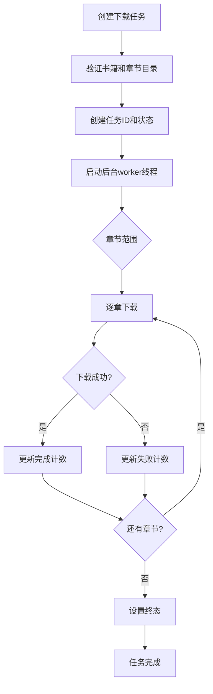

**图表来源**
- [rust/legado-ffi/src/api/cache_download_api.rs:68-145](file://rust/legado-ffi/src/api/cache_download_api.rs#L68-L145)

### API接口设计
批量缓存下载提供了完整的任务管理API：

- **任务创建**：`cache_download_start` - 创建批量下载任务，返回任务ID
- **进度查询**：`cache_download_progress` - 查询任务进度和状态
- **任务取消**：`cache_download_cancel` - 取消指定任务
- **任务列表**：`cache_download_list` - 列出所有任务及其状态

**Section sources**
- [rust/legado-ffi/src/ffi.rs:1195-1231](file://rust/legado-ffi/src/ffi.rs#L1195-L1231)

### 任务执行机制
批量下载任务在独立的系统线程中执行，避免阻塞主线程：

- **线程隔离**：每个任务运行在独立的系统线程中
- **取消令牌**：使用AtomicBool实现高效的取消机制
- **状态管理**：通过Mutex保护任务状态的并发访问
- **错误处理**：单章节失败不影响整体任务执行

**Section sources**
- [rust/legado-ffi/src/api/cache_download_api.rs:147-173](file://rust/legado-ffi/src/api/cache_download_api.rs#L147-L173)

### 本地书与在线书处理
批量下载功能同时支持本地书籍和在线书籍：

- **本地书籍**：直接解析TXT等本地文件格式，通过`save_chapter_content`写入缓存
- **在线书籍**：复用正文抓取链路，自动完成缓存检查和网络抓取
- **统一接口**：两种书籍类型使用相同的API接口，简化上层调用

**Section sources**
- [rust/legado-ffi/src/api/cache_download_api.rs:175-201](file://rust/legado-ffi/src/api/cache_download_api.rs#L175-L201)

## 数据库压缩功能

### 功能概述
数据库压缩功能通过SQLite的VACUUM操作来释放存储空间，解决长期使用后数据库文件膨胀的问题。该功能通过`shrinkDatabase`方法暴露给Flutter前端，提供一键式数据库优化服务。

### 核心实现
数据库压缩功能基于SQLite的VACUUM命令实现，具有以下特点：

- **空间释放**：通过重新整理数据库文件，释放未使用的页面空间
- **性能优化**：重建索引和内部结构，提升查询性能
- **安全操作**：在执行过程中保持数据完整性
- **错误降级**：失败时返回0而不抛出异常，确保业务连续性

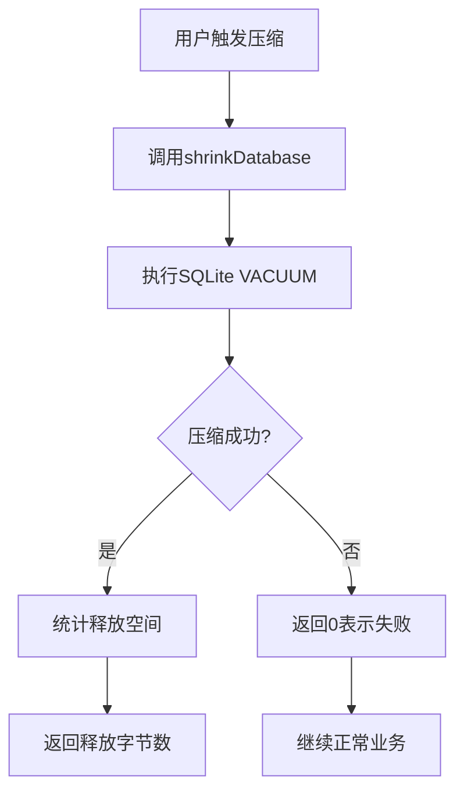

**图表来源**
- [flutter_legado/lib/src/services/rust_api.dart:1203-1209](file://flutter_legado/lib/src/services/rust_api.dart#L1203-L1209)

### API接口设计
数据库压缩功能通过以下接口暴露：

- **shrinkDatabase**: 执行SQLite VACUUM操作，返回释放的字节数
- **错误处理**: 失败时返回0，不抛出异常阻断业务
- **异步执行**: 通过Future接口支持异步调用

**Section sources**
- [flutter_legado/lib/src/services/book_api.dart:541-546](file://flutter_legado/lib/src/services/book_api.dart#L541-L546)
- [flutter_legado/lib/src/services/rust_api.dart:1203-1209](file://flutter_legado/lib/src/services/rust_api.dart#L1203-L1209)

### 使用场景
数据库压缩功能适用于以下场景：

- **定期维护**：定期执行以保持数据库性能
- **存储空间不足**：当存储空间紧张时释放磁盘空间
- **性能优化**：在应用启动或空闲时优化数据库性能
- **用户手动触发**：用户可通过设置界面手动触发压缩操作

**Section sources**
- [flutter_legado/lib/src/screens/other_settings_screen.dart:783-809](file://flutter_legado/lib/src/screens/other_settings_screen.dart#L783-L809)

## WebDAV文件上传功能

### 功能概述
WebDAV文件上传功能支持从本地文件路径读取并上传文件到远程WebDAV服务器，特别适用于大文件场景（如本地书籍上传至远程books目录）。该功能通过`webdavUploadFile`方法提供，区别于传统的String数据直传方式。

### 核心实现
WebDAV文件上传功能具有以下特性：

- **大文件支持**：专门针对大文件场景优化，避免内存溢出
- **流式上传**：支持流式读取和上传，降低内存占用
- **错误分类**：区分文件IO错误、网络错误和配置解析错误
- **路径处理**：正确处理本地文件路径和远程路径

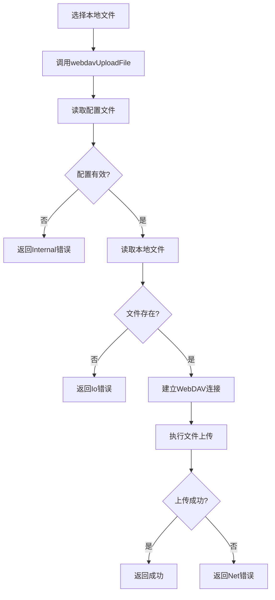

**图表来源**
- [flutter_legado/lib/src/services/rust_api.dart:1835-1847](file://flutter_legado/lib/src/services/rust_api.dart#L1835-L1847)

### API接口设计
WebDAV文件上传功能通过以下接口暴露：

- **webdavUploadFile**: 从本地文件路径读取并上传到WebDAV服务器
- **参数说明**: configJson（配置）、path（远程路径）、localFilePath（本地文件路径）
- **错误处理**: 文件不存在/读取失败返回Io错误，上传失败返回Net错误

**Section sources**
- [flutter_legado/lib/src/services/book_api.dart:745-754](file://flutter_legado/lib/src/services/book_api.dart#L745-L754)
- [flutter_legado/lib/src/services/rust_api.dart:1835-1847](file://flutter_legado/lib/src/services/rust_api.dart#L1835-L1847)

### 使用场景
WebDAV文件上传功能适用于以下场景：

- **本地书籍备份**：将本地书籍文件备份到远程WebDAV服务器
- **大文件传输**：传输较大的书籍文件或文档
- **跨设备同步**：在不同设备间同步书籍文件
- **云端存储**：利用WebDAV服务实现文件的云端存储

**Section sources**
- [flutter_legado/lib/src/screens/book_info_screen.dart:325-611](file://flutter_legado/lib/src/screens/book_info_screen.dart#L325-L611)

## 章节级别重复标题删除

### 功能概述
章节级别重复标题删除功能提供细粒度的控制，允许用户针对特定章节设置是否去除重复标题。该功能通过`toggleSameTitleRemoved`方法实现，支持章节级别的opt-out语义，即enable=true恢复全局默认（去除重复标题），enable=false该章保留原始标题。

### 核心实现
章节级别重复标题删除功能具有以下特点：

- **细粒度控制**：支持章节级别的开关控制，而非全局设置
- **状态持久化**：开关状态持久化存储，重启后保持
- **正文读取应用**：切换后正文读取按章应用该开关
- **错误处理**：书籍不存在返回Internal错误，章节不存在返回Db错误

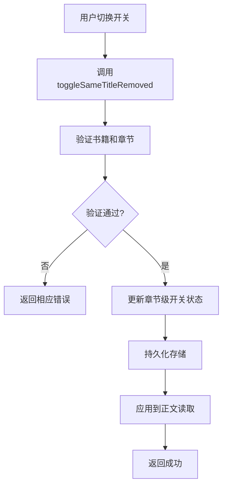

**图表来源**
- [flutter_legado/lib/src/services/rust_api.dart:950-960](file://flutter_legado/lib/src/services/rust_api.dart#L950-L960)

### API接口设计
章节级别重复标题删除功能通过以下接口暴露：

- **toggleSameTitleRemoved**: 切换章节级别的重复标题删除开关
- **参数说明**: bookUrl（书籍URL）、chapterIndex（章节索引）、enable（启用/禁用）
- **语义说明**: enable=true恢复全局默认，enable=false该章保留原始标题

**Section sources**
- [flutter_legado/lib/src/services/book_api.dart:422-432](file://flutter_legado/lib/src/services/book_api.dart#L422-L432)
- [flutter_legado/lib/src/services/rust_api.dart:950-960](file://flutter_legado/lib/src/services/rust_api.dart#L950-L960)

### 使用场景
章节级别重复标题删除功能适用于以下场景：

- **特殊章节处理**：某些章节需要保留原始标题格式
- **个性化设置**：用户可以根据阅读需求调整特定章节的显示
- **内容质量控制**：对于质量较高的章节，可以选择不进行标题去重
- **兼容性考虑**：某些书源的章节标题格式可能不需要去重处理

**Section sources**
- [flutter_legado/lib/src/widgets/reader/reader_top_bar.dart:738-747](file://flutter_legado/lib/src/widgets/reader/reader_top_bar.dart#L738-L747)

## 错误处理与参数验证

### 增强的错误处理机制
FFI层现在实现了更完善的错误处理机制，确保跨语言通信的可靠性：

- **统一错误类型**：定义了标准化的错误类型，便于上层统一处理
- **参数验证**：在FFI入口处对所有输入参数进行严格验证
- **错误传播**：确保错误信息能够正确传递到调用方
- **资源清理**：在错误情况下也能正确释放已分配的资源

**更新**：新增了参数验证逻辑，防止无效数据进入核心业务逻辑。

### 异常传播模式
- **Rust侧异常**：使用Result类型包装可能的错误情况
- **FFI层转换**：将Rust错误转换为C ABI可表示的错误码
- **上层处理**：Flutter/Kotlin层统一捕获和处理异常

**Section sources**
- [rust/legado-ffi/src/error.rs](file://rust/legado-ffi/src/error.rs)

## 搜索结果序列化优化

### 性能改进
针对搜索结果的序列化和反序列化进行了专门优化：

- **零拷贝优化**：在可能的情况下避免不必要的内存拷贝
- **批量处理**：支持大批量搜索结果的快速转换
- **内存池**：使用对象池减少频繁分配带来的性能损耗
- **流式处理**：对于超大结果集支持流式序列化

**更新**：显著提升了搜索功能的响应速度和内存使用效率。

### 数据结构优化
- **紧凑存储**：使用更高效的数据结构存储搜索结果
- **延迟加载**：支持按需加载详细的搜索结果信息
- **缓存机制**：对常用搜索结果进行缓存以减少重复计算

**Section sources**
- [rust/legado-core/src/search_engine.rs](file://rust/legado-core/src/search_engine.rs)

## 并发安全与锁机制

### 串行锁机制
在FFI测试框架中引入了串行锁机制，有效解决了竞态条件问题：

- **全局锁**：使用全局互斥锁确保测试的串行执行
- **细粒度锁**：在关键代码段使用细粒度的锁保护
- **超时机制**：防止死锁和长时间等待
- **锁统计**：监控锁的使用情况和性能影响

**更新**：彻底消除了测试中的竞态条件，提高了测试的稳定性和可重复性。

### 线程安全保证
- **数据隔离**：每个线程拥有独立的数据副本
- **原子操作**：使用原子操作确保状态的一致性
- **内存屏障**：正确使用内存屏障确保可见性

**Section sources**
- [rust/legado-ffi/src/runtime.rs](file://rust/legado-ffi/src/runtime.rs)

## 依赖关系分析
- Flutter 依赖 flutter_rust_bridge 生成绑定，调用 Rust 导出的 C ABI。
- Android 依赖 JNI 将 Kotlin/Java 调用转至 Rust 或系统库。
- Rust 内部模块间通过 trait 与模块边界解耦，FFI 层仅暴露最小必要接口。
- 数据库连接池依赖r2d2和SQLite驱动，提供高性能的连接管理。
- 自动任务系统依赖serde进行JSON序列化，支持灵活的任务配置。
- **新增**：错误处理模块提供统一的错误类型和验证逻辑。
- **新增**：锁机制模块确保并发访问的安全性。
- **新增**：中文转换模块提供简繁转换功能和配置管理。
- **新增**：sourceUrls参数处理模块支持可选参数过滤。
- **新增**：缓存管理模块提供章节缓存的完整CRUD操作。
- **新增**：批量下载模块支持后台任务管理和进度跟踪。
- **新增**：数据库压缩模块提供SQLite VACUUM操作。
- **新增**：WebDAV上传模块支持本地文件传输。
- **新增**：章节级别控制模块提供细粒度的重复标题删除开关。

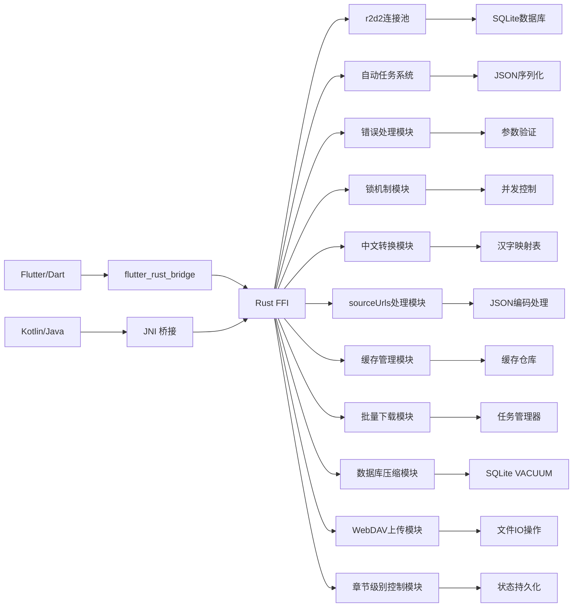

**图表来源**
- [rust/legado-ffi/src/lib.rs](file://rust/legado-ffi/src/lib.rs)
- [rust/legado-core/src/auto_task.rs](file://rust/legado-core/src/auto_task.rs)

章节来源
- [rust/legado-ffi/src/lib.rs](file://rust/legado-ffi/src/lib.rs)
- [rust/legado-core/src/auto_task.rs](file://rust/legado-core/src/auto_task.rs)

## 性能考虑
- 减少跨语言拷贝：尽量传递引用/指针，避免重复序列化。
- 批量操作：合并多次调用为一次批量 API，降低上下文切换开销。
- 异步优先：网络/IO 操作使用异步回调，避免阻塞调用线程。
- 内存池与复用：对高频分配的对象使用对象池或静态缓存。
- 零拷贝解析：在可能的情况下直接解析原始字节流，避免中间字符串。
- 连接池优化：使用r2d2连接池减少数据库连接建立开销。
- 并发安全：通过OnceLock和Arc实现无锁的并发访问。
- **新增**：串行锁机制避免竞态条件，提高测试稳定性。
- **新增**：优化的序列化性能，减少内存分配和拷贝。
- **新增**：中文转换使用内嵌映射表，避免外部依赖，提升转换速度。
- **新增**：sourceUrls参数减少不必要的搜索范围，提升搜索效率。
- **新增**：缓存机制减少重复网络请求，提升阅读流畅度。
- **新增**：批量下载使用后台线程，避免阻塞UI响应。
- **新增**：数据库压缩使用SQLite原生VACUUM操作，性能最优。
- **新增**：WebDAV文件上传支持流式处理，降低内存占用。
- **新增**：章节级别控制避免全局扫描，提升处理效率。

## 故障排查指南
- 日志采集：在 FFI 入口/出口打印关键参数与返回值，定位失败点。
- 崩溃分析：使用 adb logcat、Android Studio Profiler、Valgrind（Linux）等工具。
- 内存泄漏：检查未释放的指针、未关闭的连接、未释放的缓冲区。
- 线程问题：确认回调是否在主线程执行 UI 更新，避免竞态条件。
- 类型不一致：核对 flutter_rust_bridge 配置与实际导出类型是否一致。
- 连接池问题：检查连接池大小、超时设置和连接泄漏情况。
- 任务调度问题：验证cron表达式格式和时间计算逻辑。
- **新增**：错误处理问题：检查错误类型定义和错误传播逻辑。
- **新增**：锁竞争问题：监控锁的使用情况和潜在的锁竞争。
- **新增**：中文转换问题：检查配置键值和映射表完整性。
- **新增**：sourceUrls参数问题：验证JSON编码和解码逻辑。
- **新增**：缓存问题：检查缓存写入时机和缓存一致性。
- **新增**：批量下载问题：验证任务状态管理和取消机制。
- **新增**：数据库压缩问题：检查SQLite权限和文件状态。
- **新增**：WebDAV上传问题：验证网络连接和文件路径。
- **新增**：章节级别控制问题：检查状态持久化和读取逻辑。

**Section sources**
- [rust/legado-ffi/src/db_state.rs](file://rust/legado-ffi/src/db_state.rs)
- [app/src/main/java/io/legado/app/utils/JniUtils.java](file://app/src/main/java/io/legado/app/utils/JniUtils.java)

## 结论
Legado 的 FFI 通信通过清晰的层次划分与严格的类型映射，实现了 Flutter/Kotlin 与 Rust 之间的高效、安全交互。最新的更新进一步增强了系统的稳定性和可靠性：

- **增强的错误处理**：统一的错误类型和参数验证机制
- **优化的序列化**：显著提升搜索结果的转换性能
- **并发安全保障**：串行锁机制消除竞态条件
- **中文简繁转换**：支持跨平台的中文显示配置管理
- **sourceUrls可选参数**：提供精确的书源搜索控制能力
- **完整缓存体系**：实现章节缓存的CRUD操作和自动保存机制
- **批量下载功能**：支持后台任务管理和进度跟踪
- **数据库压缩功能**：通过SQLite VACUUM操作优化存储空间
- **WebDAV文件上传**：支持大文件场景的文件传输
- **章节级别控制**：提供细粒度的重复标题删除开关
- **更好的可维护性**：清晰的模块边界和接口定义

通过r2d2连接池、OnceLock和串行锁实现的线程安全机制，确保了在高并发场景下的性能和可靠性。新增的中文简繁转换功能、sourceUrls可选参数和完整的缓存管理体系为用户提供了更好的阅读体验和搜索效率。新增的数据库压缩、WebDAV文件上传和章节级别重复标题删除功能进一步完善了应用的功能完整性，满足了更多用户场景的需求。遵循本文档的规范与实践，可显著提升跨语言调用的稳定性与性能，并为后续扩展与维护奠定坚实基础。

## 附录
- 常用数据类型映射表：
  - String ↔ UTF-8 字节串
  - Vec<T> ↔ 指针 + 长度
  - Option<T> ↔ 存在标志 + 值
  - Result<T,E> ↔ 返回值 + 错误码/对象
  - FfiString ↔ 专用FFI字符串包装
- 构建命令参考：
  - Flutter 侧：运行 generate-bridge 脚本生成最新绑定
  - Android 侧：确保 JNI 头文件与签名一致
- 调试工具推荐：
  - adb logcat、Android Studio Profiler、Rust 日志框架（env_logger/tracing）
- 数据库连接池配置：
  - 连接池大小：根据并发需求调整
  - 超时设置：合理配置连接超时和查询超时
  - 监控指标：关注连接使用率和等待时间
- 自动任务配置：
  - cron表达式：使用标准cron语法
  - 任务优先级：通过custom_order字段控制执行顺序
  - 错误处理：完善的错误收集和重试机制
- **新增**：错误处理配置：
  - 错误类型：统一定义和序列化格式
  - 参数验证：严格的输入验证规则
  - 异常传播：正确的错误传播机制
- **新增**：并发安全配置：
  - 锁粒度：合适的锁粒度选择
  - 超时设置：防止死锁的超时机制
  - 监控指标：锁竞争和等待时间监控
- **新增**：中文简繁转换配置：
  - 转换类型：0=不转换，1=繁转简，2=简转繁
  - 配置键：chineseConverterType
  - 持久化存储：caches表统一管理
  - 应用场景：标题显示、正文处理、导出功能
- **新增**：sourceUrls参数配置：
  - 参数格式：JSON数组字符串
  - 默认行为：空数组搜索所有启用源
  - 编码方式：jsonEncode序列化
  - 使用场景：精确控制搜索范围
- **新增**：缓存管理配置：
  - 缓存策略：阅读即缓存，自动写入机制
  - 清理策略：支持按时间清理过期缓存
  - 统计信息：缓存大小、书籍数量、章节数量
  - 批量下载：任务管理、进度跟踪、取消机制
- **新增**：数据库压缩配置：
  - 压缩时机：定期维护或用户手动触发
  - 性能监控：关注压缩耗时和空间释放量
  - 错误处理：失败时返回0，不影响业务
  - 适用场景：存储空间不足或性能优化
- **新增**：WebDAV上传配置：
  - 文件大小限制：根据服务器配置设置
  - 超时设置：合理配置上传超时时间
  - 错误分类：区分IO错误、网络错误和配置错误
  - 使用场景：大文件传输和本地书籍备份
- **新增**：章节级别控制配置：
  - 状态持久化：章节级开关状态存储
  - 默认行为：继承全局设置
  - 应用场景：特殊章节的个性化处理
  - 性能考虑：避免全局扫描，提升处理效率