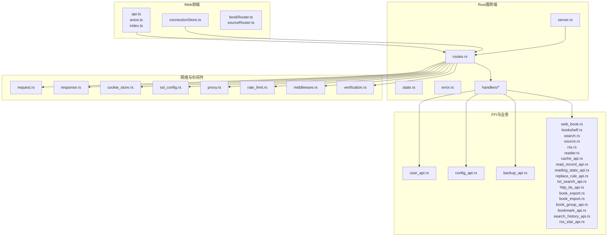
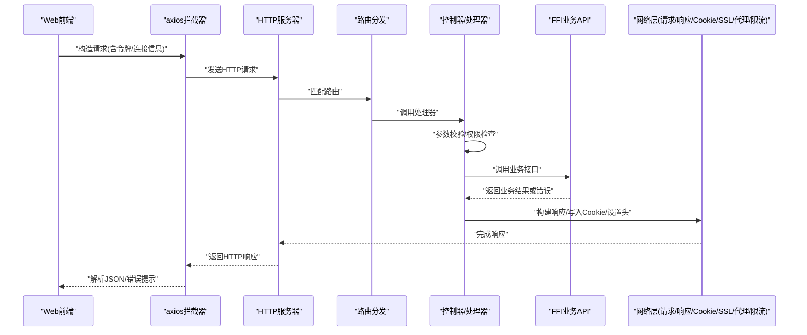
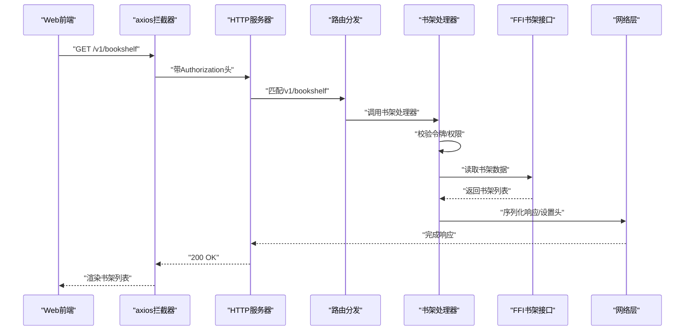
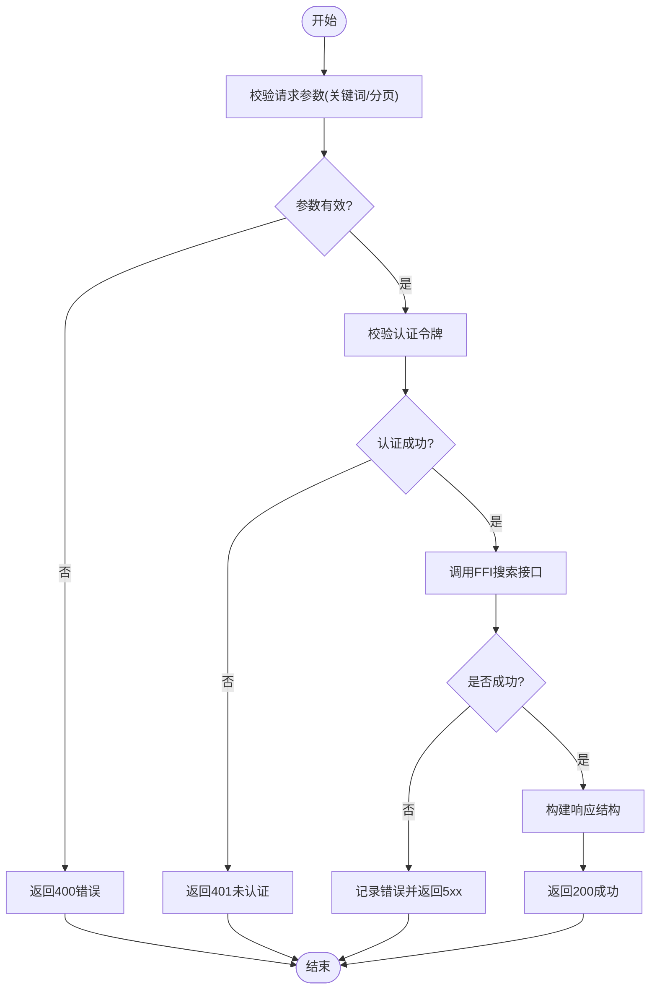
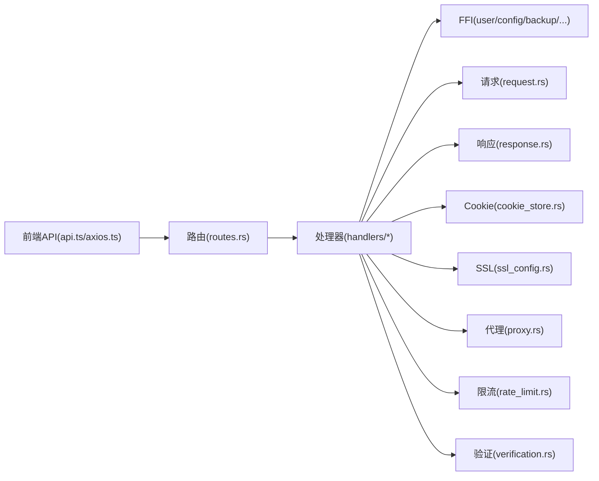

# RESTful API通信

<cite>
**本文引用的文件**   
- [routes.rs](file://rust/legado-server/src/routes.rs)
- [server.rs](file://rust/legado-server/src/server.rs)
- [state.rs](file://rust/legado-server/src/state.rs)
- [error.rs](file://rust/legado-server/src/error.rs)
- [lib.rs](file://rust/legado-server/src/lib.rs)
- [handlers/mod.rs](file://rust/legado-server/src/handlers/mod.rs)
- [api.ts](file://modules/web/src/api/api.ts)
- [axios.ts](file://modules/web/src/api/axios.ts)
- [index.ts](file://modules/web/src/api/index.ts)
- [sourceToken.ts](file://modules/web/src/api/sourceToken.ts)
- [connectionStore.ts](file://modules/web/src/store/connectionStore.ts)
- [bookRouter.ts](file://modules/web/src/router/bookRouter.ts)
- [sourceRouter.ts](file://modules/web/src/router/sourceRouter.ts)
- [rate_limit.rs](file://rust/legado-net/src/rate_limit.rs)
- [middleware.rs](file://rust/legado-net/src/middleware.rs)
- [request.rs](file://rust/legado-net/src/request.rs)
- [response.rs](file://rust/legado-net/src/response.rs)
- [cookie_store.rs](file://rust/legado-net/src/cookie_store.rs)
- [ssl_config.rs](file://rust/legado-net/src/ssl_config.rs)
- [proxy.rs](file://rust/legado-net/src/proxy.rs)
- [verification.rs](file://rust/legado-net/src/verification.rs)
- [user_api.rs](file://rust/legado-ffi/src/api/user_api.rs)
- [config_api.rs](file://rust/legado-ffi/src/api/config_api.rs)
- [backup_api.rs](file://rust/legado-ffi/src/api/backup_api.rs)
- [web_book.rs](file://rust/legado-ffi/src/api/web_book.rs)
- [bookshelf.rs](file://rust/legado-ffi/src/api/bookshelf.rs)
- [search.rs](file://rust/legado-ffi/src/api/search.rs)
- [source.rs](file://rust/legado-ffi/src/api/source.rs)
- [rss.rs](file://rust/legado-ffi/src/api/rss.rs)
- [reader.rs](file://rust/legado-ffi/src/api/reader.rs)
- [cache_api.rs](file://rust/legado-ffi/src/api/cache_api.rs)
- [read_record_api.rs](file://rust/legado-ffi/src/api/read_record_api.rs)
- [reading_stats_api.rs](file://rust/legado-ffi/src/api/reading_stats_api.rs)
- [replace_rule_api.rs](file://rust/legado-ffi/src/api/replace_rule_api.rs)
- [txt_search_api.rs](file://rust/legado-ffi/src/api/txt_search_api.rs)
- [http_tts_api.rs](file://rust/legado-ffi/src/api/http_tts_api.rs)
- [book_export.rs](file://rust/legado-ffi/src/api/book_export.rs)
- [book_import.rs](file://rust/legado-ffi/src/api/book_import.rs)
- [book_group_api.rs](file://rust/legado-ffi/src/api/book_group_api.rs)
- [bookmark_api.rs](file://rust/legado-ffi/src/api/bookmark_api.rs)
- [search_history_api.rs](file://rust/legado-ffi/src/api/search_history_api.rs)
- [rss_star_api.rs](file://rust/legado-ffi/src/api/rss_star_api.rs)
</cite>

## 目录
1. [简介](#简介)
2. [项目结构](#项目结构)
3. [核心组件](#核心组件)
4. [架构总览](#架构总览)
5. [详细组件分析](#详细组件分析)
6. [依赖关系分析](#依赖关系分析)
7. [性能考量](#性能考量)
8. [故障排查指南](#故障排查指南)
9. [结论](#结论)
10. [附录](#附录)

## 简介
本文件面向Legado项目的Web管理界面与后端服务之间的RESTful API通信，系统性说明路由设计模式、请求响应格式规范、状态码约定、认证机制（JWT令牌与会话管理）、数据验证规则、错误处理策略，以及API版本控制、限流与安全措施。同时提供端点文档模板、测试方法与调试工具使用指南，帮助开发者快速集成与排障。

## 项目结构
本项目采用多语言分层架构：
- Rust后端服务（legado-server）提供HTTP路由、中间件、状态管理与错误处理。
- FFI层（legado-ffi）将业务API暴露为统一接口，供服务端调用。
- Net层（legado-net）封装网络请求、响应、Cookie、SSL、代理、速率限制等能力。
- Web前端（modules/web）通过TypeScript/axios发起HTTP请求，维护连接上下文与鉴权令牌。

图表来源
- [server.rs](file://rust/legado-server/src/server.rs)
- [routes.rs](file://rust/legado-server/src/routes.rs)
- [state.rs](file://rust/legado-server/src/state.rs)
- [error.rs](file://rust/legado-server/src/error.rs)
- [handlers/mod.rs](file://rust/legado-server/src/handlers/mod.rs)
- [api.ts](file://modules/web/src/api/api.ts)
- [axios.ts](file://modules/web/src/api/axios.ts)
- [index.ts](file://modules/web/src/api/index.ts)
- [connectionStore.ts](file://modules/web/src/store/connectionStore.ts)
- [bookRouter.ts](file://modules/web/src/router/bookRouter.ts)
- [sourceRouter.ts](file://modules/web/src/router/sourceRouter.ts)
- [rate_limit.rs](file://rust/legado-net/src/rate_limit.rs)
- [middleware.rs](file://rust/legado-net/src/middleware.rs)
- [request.rs](file://rust/legado-net/src/request.rs)
- [response.rs](file://rust/legado-net/src/response.rs)
- [cookie_store.rs](file://rust/legado-net/src/cookie_store.rs)
- [ssl_config.rs](file://rust/legado-net/src/ssl_config.rs)
- [proxy.rs](file://rust/legado-net/src/proxy.rs)
- [verification.rs](file://rust/legado-net/src/verification.rs)
- [user_api.rs](file://rust/legado-ffi/src/api/user_api.rs)
- [config_api.rs](file://rust/legado-ffi/src/api/config_api.rs)
- [backup_api.rs](file://rust/legado-ffi/src/api/backup_api.rs)
- [web_book.rs](file://rust/legado-ffi/src/api/web_book.rs)
- [bookshelf.rs](file://rust/legado-ffi/src/api/bookshelf.rs)
- [search.rs](file://rust/legado-ffi/src/api/search.rs)
- [source.rs](file://rust/legado-ffi/src/api/source.rs)
- [rss.rs](file://rust/legado-ffi/src/api/rss.rs)
- [reader.rs](file://rust/legado-ffi/src/api/reader.rs)
- [cache_api.rs](file://rust/legado-ffi/src/api/cache_api.rs)
- [read_record_api.rs](file://rust/legado-ffi/src/api/read_record_api.rs)
- [reading_stats_api.rs](file://rust/legado-ffi/src/api/reading_stats_api.rs)
- [replace_rule_api.rs](file://rust/legado-ffi/src/api/replace_rule_api.rs)
- [txt_search_api.rs](file://rust/legado-ffi/src/api/txt_search_api.rs)
- [http_tts_api.rs](file://rust/legado-ffi/src/api/http_tts_api.rs)
- [book_export.rs](file://rust/legado-ffi/src/api/book_export.rs)
- [book_import.rs](file://rust/legado-ffi/src/api/book_import.rs)
- [book_group_api.rs](file://rust/legado-ffi/src/api/book_group_api.rs)
- [bookmark_api.rs](file://rust/legado-ffi/src/api/bookmark_api.rs)
- [search_history_api.rs](file://rust/legado-ffi/src/api/search_history_api.rs)
- [rss_star_api.rs](file://rust/legado-ffi/src/api/rss_star_api.rs)

章节来源
- [lib.rs](file://rust/legado-server/src/lib.rs)
- [server.rs](file://rust/legado-server/src/server.rs)
- [routes.rs](file://rust/legado-server/src/routes.rs)
- [state.rs](file://rust/legado-server/src/state.rs)
- [error.rs](file://rust/legado-server/src/error.rs)
- [api.ts](file://modules/web/src/api/api.ts)
- [axios.ts](file://modules/web/src/api/axios.ts)
- [index.ts](file://modules/web/src/api/index.ts)
- [connectionStore.ts](file://modules/web/src/store/connectionStore.ts)
- [bookRouter.ts](file://modules/web/src/router/bookRouter.ts)
- [sourceRouter.ts](file://modules/web/src/router/sourceRouter.ts)

## 核心组件
- 路由与控制器：按资源划分URL路径，统一由路由模块注册，控制器负责参数校验、权限检查、调用FFI业务层并返回标准化响应。
- 状态管理：集中管理应用级状态（如数据库连接、配置、会话信息），确保跨请求一致性。
- 错误处理：统一错误类型与HTTP状态码映射，保证客户端可解析的错误结构。
- 网络栈：封装请求构建、响应解析、Cookie持久化、SSL/TLS、代理、重试与速率限制。
- 前端API层：基于axios封装请求拦截器、令牌注入、错误提示与连接上下文管理。

章节来源
- [routes.rs](file://rust/legado-server/src/routes.rs)
- [state.rs](file://rust/legado-server/src/state.rs)
- [error.rs](file://rust/legado-server/src/error.rs)
- [request.rs](file://rust/legado-net/src/request.rs)
- [response.rs](file://rust/legado-net/src/response.rs)
- [cookie_store.rs](file://rust/legado-net/src/cookie_store.rs)
- [api.ts](file://modules/web/src/api/api.ts)
- [axios.ts](file://modules/web/src/api/axios.ts)
- [index.ts](file://modules/web/src/api/index.ts)
- [connectionStore.ts](file://modules/web/src/store/connectionStore.ts)

## 架构总览
下图展示从Web前端到后端服务的完整调用链路，包括鉴权、路由分发、FFI业务调用与网络层能力。

图表来源
- [server.rs](file://rust/legado-server/src/server.rs)
- [routes.rs](file://rust/legado-server/src/routes.rs)
- [handlers/mod.rs](file://rust/legado-server/src/handlers/mod.rs)
- [request.rs](file://rust/legado-net/src/request.rs)
- [response.rs](file://rust/legado-net/src/response.rs)
- [cookie_store.rs](file://rust/legado-net/src/cookie_store.rs)
- [ssl_config.rs](file://rust/legado-net/src/ssl_config.rs)
- [proxy.rs](file://rust/legado-net/src/proxy.rs)
- [rate_limit.rs](file://rust/legado-net/src/rate_limit.rs)

## 详细组件分析

### 路由设计与端点组织
- 路由按资源命名，遵循REST风格，例如用户、配置、备份、书籍、书架、搜索、源、RSS、阅读器、缓存、阅读记录、阅读统计、替换规则、TXT搜索、TTS、导出/导入、分组、书签、搜索历史、RSS收藏等。
- 路由注册集中在路由模块，便于统一管理与版本控制前缀。
- 建议以/v1作为默认版本前缀，后续演进通过路径或Header进行版本协商。

章节来源
- [routes.rs](file://rust/legado-server/src/routes.rs)
- [lib.rs](file://rust/legado-server/src/lib.rs)

### 认证机制（JWT与会话）
- 令牌传递：建议在Authorization头携带Bearer令牌；必要时在Cookie中存储会话标识。
- 令牌校验：中间件统一校验签名、过期时间与作用域；失败返回未授权状态码。
- 会话管理：支持Cookie持久化与同步，结合SSL保障传输安全。
- 前端注入：axios拦截器自动附加令牌，并在401时触发刷新或跳转登录。

章节来源
- [middleware.rs](file://rust/legado-net/src/middleware.rs)
- [cookie_store.rs](file://rust/legado-net/src/cookie_store.rs)
- [verification.rs](file://rust/legado-net/src/verification.rs)
- [axios.ts](file://modules/web/src/api/axios.ts)
- [connectionStore.ts](file://modules/web/src/store/connectionStore.ts)

### 数据验证与错误处理
- 输入验证：对路径参数、查询参数、请求体进行类型与范围校验，非法输入返回400。
- 错误模型：统一错误结构包含code、message、details等字段，便于前端展示与日志追踪。
- 状态码约定：
  - 2xx：成功
  - 400：请求参数错误
  - 401：未认证
  - 403：权限不足
  - 404：资源不存在
  - 429：限流
  - 5xx：服务端错误

章节来源
- [error.rs](file://rust/legado-server/src/error.rs)
- [request.rs](file://rust/legado-net/src/request.rs)
- [response.rs](file://rust/legado-net/src/response.rs)

### 版本控制策略
- 路径前缀：/v1/... 作为默认版本，后续新增/v2/...
- Header协商：可选X-API-Version头部用于灰度发布与兼容。
- 兼容性：旧版本保留至少一个稳定周期，废弃端点需提前公告。

章节来源
- [routes.rs](file://rust/legado-server/src/routes.rs)

### 限流机制
- 基于IP或用户ID的滑动窗口计数，达到阈值返回429。
- 可配置全局与端点级别限流策略。
- 前端应实现退避重试与友好提示。

章节来源
- [rate_limit.rs](file://rust/legado-net/src/rate_limit.rs)

### 安全防护
- HTTPS强制：启用TLS并禁用弱协议与密码套件。
- 代理与CORS：按需配置代理转发与跨域策略。
- Cookie安全：HttpOnly、Secure、SameSite属性。
- 输入过滤：防注入与XSS防护。

章节来源
- [ssl_config.rs](file://rust/legado-net/src/ssl_config.rs)
- [proxy.rs](file://rust/legado-net/src/proxy.rs)
- [cookie_store.rs](file://rust/legado-net/src/cookie_store.rs)

### API端点文档模板（示例）
以下为通用端点文档模板，实际路径与方法请根据路由定义填充：
- 端点名称：用户登录
- URL路径：/v1/auth/login
- HTTP方法：POST
- 请求参数：
  - 路径参数：无
  - 查询参数：无
  - 请求体：{username, password}
- 响应结构：
  - 成功：{token, expires_in}
  - 失败：{code, message}
- 状态码：200、400、401
- 示例：
  - 请求：POST /v1/auth/login {username:"admin", password:"***"}
  - 响应：200 {token:"eyJ...", expires_in:3600}

章节来源
- [routes.rs](file://rust/legado-server/src/routes.rs)
- [user_api.rs](file://rust/legado-ffi/src/api/user_api.rs)

### 关键业务流程时序图（以“获取书架列表”为例）

图表来源
- [routes.rs](file://rust/legado-server/src/routes.rs)
- [handlers/mod.rs](file://rust/legado-server/src/handlers/mod.rs)
- [bookshelf.rs](file://rust/legado-ffi/src/api/bookshelf.rs)
- [request.rs](file://rust/legado-net/src/request.rs)
- [response.rs](file://rust/legado-net/src/response.rs)

### 复杂逻辑流程图（以“搜索书籍”为例）

图表来源
- [routes.rs](file://rust/legado-server/src/routes.rs)
- [search.rs](file://rust/legado-ffi/src/api/search.rs)
- [error.rs](file://rust/legado-server/src/error.rs)

## 依赖关系分析
- 前端依赖：axios、连接上下文与路由配置。
- 服务端依赖：路由、处理器、FFI接口、网络层能力。
- 网络层依赖：请求构建、响应序列化、Cookie、SSL、代理、限流、验证。

图表来源
- [api.ts](file://modules/web/src/api/api.ts)
- [axios.ts](file://modules/web/src/api/axios.ts)
- [routes.rs](file://rust/legado-server/src/routes.rs)
- [handlers/mod.rs](file://rust/legado-server/src/handlers/mod.rs)
- [request.rs](file://rust/legado-net/src/request.rs)
- [response.rs](file://rust/legado-net/src/response.rs)
- [cookie_store.rs](file://rust/legado-net/src/cookie_store.rs)
- [ssl_config.rs](file://rust/legado-net/src/ssl_config.rs)
- [proxy.rs](file://rust/legado-net/src/proxy.rs)
- [rate_limit.rs](file://rust/legado-net/src/rate_limit.rs)
- [verification.rs](file://rust/legado-net/src/verification.rs)

章节来源
- [routes.rs](file://rust/legado-server/src/routes.rs)
- [handlers/mod.rs](file://rust/legado-server/src/handlers/mod.rs)
- [request.rs](file://rust/legado-net/src/request.rs)
- [response.rs](file://rust/legado-net/src/response.rs)
- [cookie_store.rs](file://rust/legado-net/src/cookie_store.rs)
- [ssl_config.rs](file://rust/legado-net/src/ssl_config.rs)
- [proxy.rs](file://rust/legado-net/src/proxy.rs)
- [rate_limit.rs](file://rust/legado-net/src/rate_limit.rs)
- [verification.rs](file://rust/legado-net/src/verification.rs)

## 性能考量
- 连接复用：保持HTTP长连接，减少握手开销。
- 压缩传输：启用Gzip/Brotli压缩大体积响应。
- 缓存策略：合理使用ETag/Last-Modified与浏览器缓存。
- 异步处理：耗时操作异步化，避免阻塞主线程。
- 限流保护：防止突发流量导致服务过载。

[本节为通用指导，不直接分析具体文件]

## 故障排查指南
- 常见问题定位：
  - 401未认证：检查Authorization头与令牌有效期。
  - 403权限不足：确认用户角色与端点权限。
  - 404资源不存在：核对URL路径与版本前缀。
  - 429限流：降低请求频率或提升配额。
  - 5xx服务端错误：查看服务端日志与错误堆栈。
- 调试工具：
  - 浏览器开发者工具Network面板查看请求/响应。
  - curl命令行快速验证端点。
  - Postman/Apifox批量测试与自动化脚本。
  - 服务端日志输出与结构化错误信息。

章节来源
- [error.rs](file://rust/legado-server/src/error.rs)
- [middleware.rs](file://rust/legado-net/src/middleware.rs)
- [axios.ts](file://modules/web/src/api/axios.ts)

## 结论
Legado的RESTful API采用清晰的分层架构与统一的错误模型，结合JWT认证、Cookie会话、HTTPS与限流等安全措施，为Web管理界面提供了稳定可靠的通信基础。通过标准化的端点文档与完善的调试流程，开发者可以快速集成与扩展功能。

[本节为总结性内容，不直接分析具体文件]

## 附录
- 端点清单模板：
  - 端点名称、URL路径、HTTP方法、请求参数、响应结构、状态码、示例
- 测试用例建议：
  - 正常路径、边界值、异常输入、权限不足、限流场景
- 安全基线：
  - TLS版本、密码套件、Cookie属性、CORS策略、输入过滤

[本节为补充信息，不直接分析具体文件]