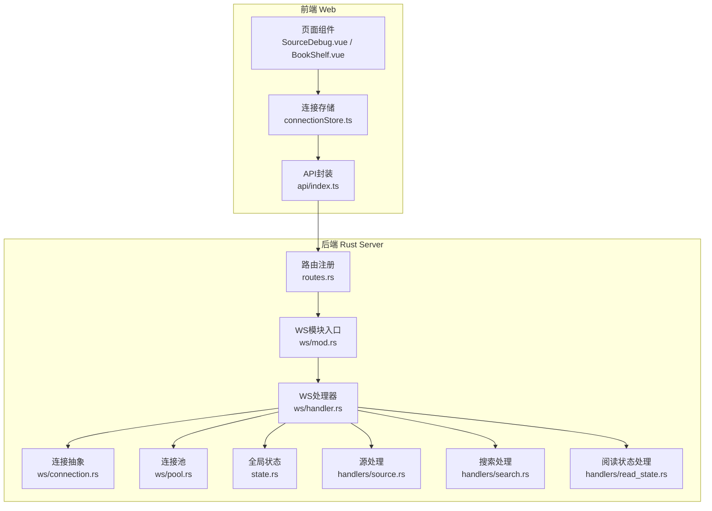
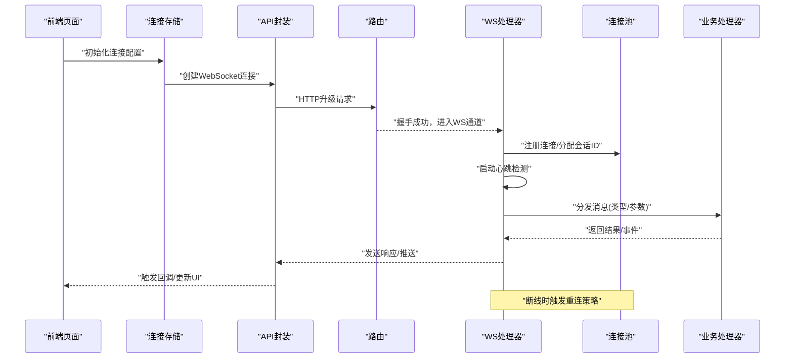
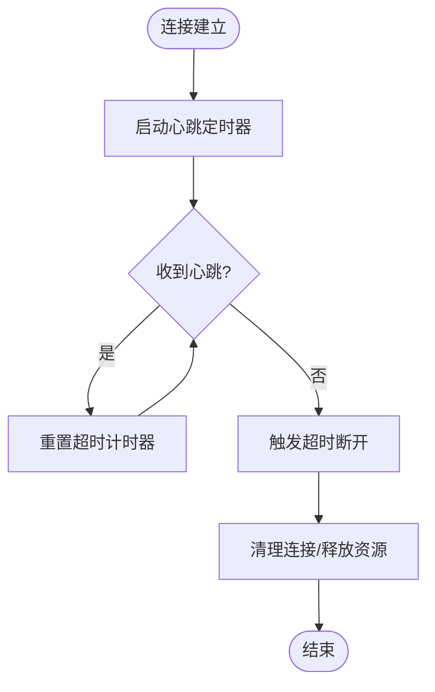
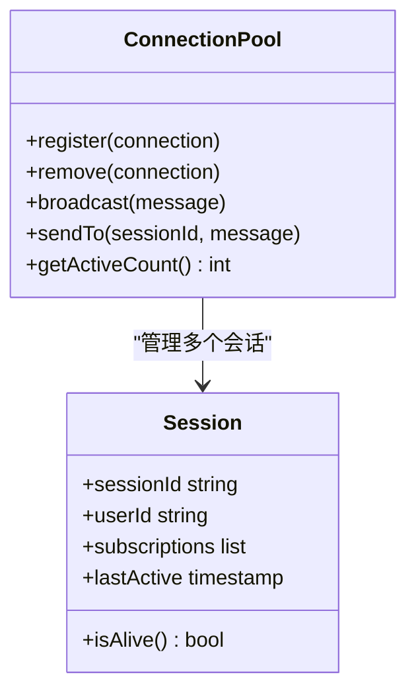
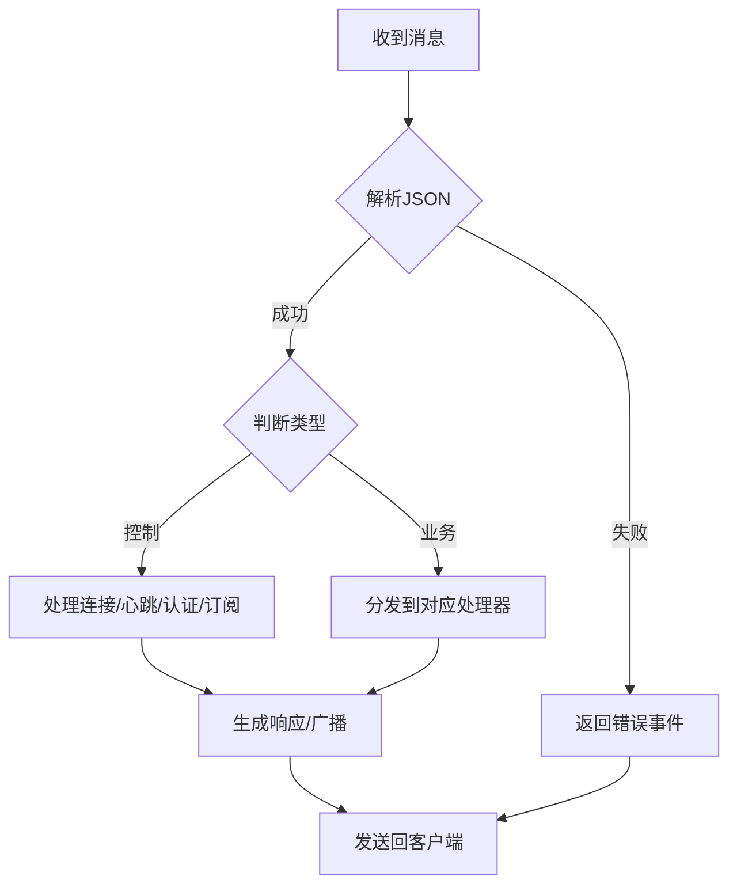
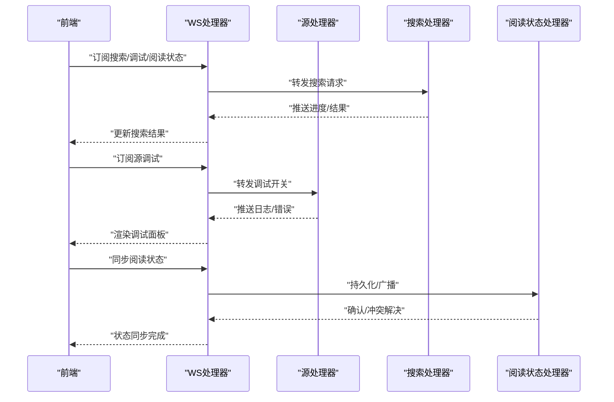
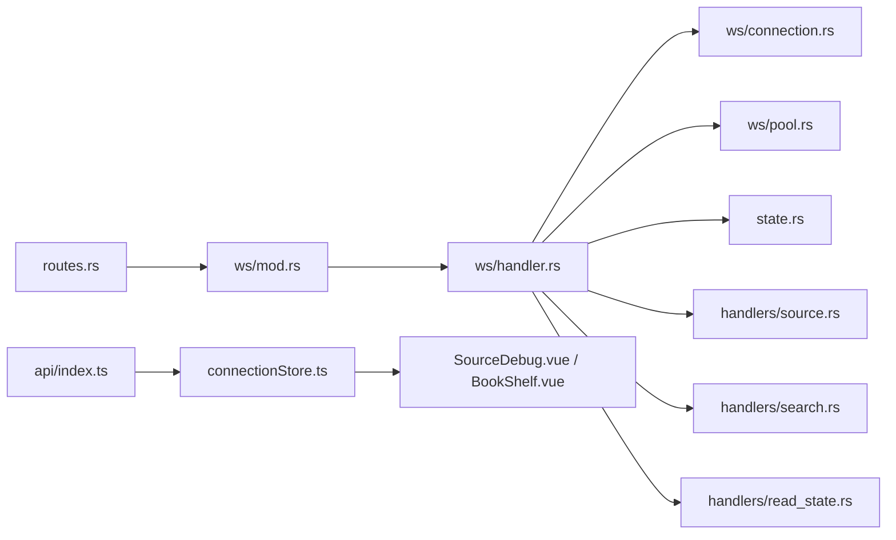

# WebSocket实时通信

<cite>
**本文引用的文件**   
- [server.rs](file://rust/legado-server/src/server.rs)
- [routes.rs](file://rust/legado-server/src/routes.rs)
- [state.rs](file://rust/legado-server/src/state.rs)
- [lib.rs](file://rust/legado-server/src/lib.rs)
- [ws/mod.rs](file://rust/legado-server/src/ws/mod.rs)
- [ws/handler.rs](file://rust/legado-server/src/ws/handler.rs)
- [ws/connection.rs](file://rust/legado-server/src/ws/connection.rs)
- [ws/pool.rs](file://rust/legado-server/src/ws/pool.rs)
- [handlers/source.rs](file://rust/legado-server/src/handlers/source.rs)
- [handlers/search.rs](file://rust/legado-server/src/handlers/search.rs)
- [handlers/read_state.rs](file://rust/legado-server/src/handlers/read_state.rs)
- [error.rs](file://rust/legado-server/src/error.rs)
- [connectionStore.ts](file://modules/web/src/store/connectionStore.ts)
- [api/index.ts](file://modules/web/src/api/index.ts)
- [SourceDebug.vue](file://modules/web/src/components/SourceDebug.vue)
- [BookShelf.vue](file://modules/web/src/views/BookShelf.vue)
</cite>

## 目录
1. [简介](#简介)
2. [项目结构](#项目结构)
3. [核心组件](#核心组件)
4. [架构总览](#架构总览)
5. [详细组件分析](#详细组件分析)
6. [依赖关系分析](#依赖关系分析)
7. [性能考虑](#性能考虑)
8. [故障排查指南](#故障排查指南)
9. [结论](#结论)
10. [附录](#附录)

## 简介
本文件面向Legado项目的WebSocket实时通信能力，系统性说明连接建立、心跳检测、断线重连与连接池管理；定义消息协议（格式、事件类型、状态管理）；覆盖典型使用场景（书籍搜索进度、源调试信息、阅读状态同步等）；并给出序列化、压缩传输与带宽优化建议，以及调试方法与监控指标。

## 项目结构
WebSocket功能由后端Rust服务与前端Web模块共同实现：
- 后端服务位于 rust/legado-server，提供HTTP路由与WebSocket端点，维护连接池、会话状态与业务处理器。
- 前端位于 modules/web，通过store与API层封装WebSocket连接、消息收发与UI联动。

**图表来源** 
- [routes.rs](file://rust/legado-server/src/routes.rs)
- [ws/mod.rs](file://rust/legado-server/src/ws/mod.rs)
- [ws/handler.rs](file://rust/legado-server/src/ws/handler.rs)
- [ws/connection.rs](file://rust/legado-server/src/ws/connection.rs)
- [ws/pool.rs](file://rust/legado-server/src/ws/pool.rs)
- [state.rs](file://rust/legado-server/src/state.rs)
- [handlers/source.rs](file://rust/legado-server/src/handlers/source.rs)
- [handlers/search.rs](file://rust/legado-server/src/handlers/search.rs)
- [handlers/read_state.rs](file://rust/legado-server/src/handlers/read_state.rs)

**章节来源**
- [server.rs](file://rust/legado-server/src/server.rs)
- [routes.rs](file://rust/legado-server/src/routes.rs)
- [state.rs](file://rust/legado-server/src/state.rs)
- [lib.rs](file://rust/legado-server/src/lib.rs)

## 核心组件
- WebSocket模块入口与路由：负责将HTTP请求升级为WebSocket，并将路径映射到具体处理器。
- 连接处理器：解析消息、分发到业务处理器、维护心跳与超时、错误上报。
- 连接抽象：封装发送/接收、关闭、状态标记、上下文信息。
- 连接池：按主题或会话维度管理活跃连接，支持广播与定向推送。
- 全局状态：保存配置、统计指标、限流策略、订阅关系。
- 业务处理器：针对“源调试”“搜索进度”“阅读状态”等场景的消息编排与转发。
- 前端连接存储与API封装：统一创建连接、自动重连、心跳、消息编解码与事件派发。

**章节来源**
- [ws/mod.rs](file://rust/legado-server/src/ws/mod.rs)
- [ws/handler.rs](file://rust/legado-server/src/ws/handler.rs)
- [ws/connection.rs](file://rust/legado-server/src/ws/connection.rs)
- [ws/pool.rs](file://rust/legado-server/src/ws/pool.rs)
- [state.rs](file://rust/legado-server/src/state.rs)
- [handlers/source.rs](file://rust/legado-server/src/handlers/source.rs)
- [handlers/search.rs](file://rust/legado-server/src/handlers/search.rs)
- [handlers/read_state.rs](file://rust/legado-server/src/handlers/read_state.rs)
- [connectionStore.ts](file://modules/web/src/store/connectionStore.ts)
- [api/index.ts](file://modules/web/src/api/index.ts)

## 架构总览
下图展示从浏览器发起WebSocket连接到服务端处理、业务分发与回推的完整流程。

**图表来源** 
- [routes.rs](file://rust/legado-server/src/routes.rs)
- [ws/handler.rs](file://rust/legado-server/src/ws/handler.rs)
- [ws/pool.rs](file://rust/legado-server/src/ws/pool.rs)
- [api/index.ts](file://modules/web/src/api/index.ts)
- [connectionStore.ts](file://modules/web/src/store/connectionStore.ts)

## 详细组件分析

### WebSocket连接生命周期与心跳
- 连接建立：前端通过API封装发起升级请求，后端路由识别并交由WS处理器接管。
- 心跳机制：客户端周期性发送心跳帧，服务端在连接上维护最后活跃时间，超过阈值判定为断开。
- 断线重连：前端检测到断开后执行指数退避重试，携带上次会话ID以尝试恢复上下文。
- 连接回收：服务端定期清理超时连接，释放资源并通知相关订阅者。

**图表来源** 
- [ws/handler.rs](file://rust/legado-server/src/ws/handler.rs)
- [ws/connection.rs](file://rust/legado-server/src/ws/connection.rs)
- [connectionStore.ts](file://modules/web/src/store/connectionStore.ts)

**章节来源**
- [ws/handler.rs](file://rust/legado-server/src/ws/handler.rs)
- [ws/connection.rs](file://rust/legado-server/src/ws/connection.rs)
- [connectionStore.ts](file://modules/web/src/store/connectionStore.ts)

### 连接池与会话管理
- 连接池按主题或会话维度组织活跃连接，支持广播与定向推送。
- 会话元数据包含用户标识、设备信息、订阅列表、权限与限流计数。
- 连接池提供增删查改接口，并在连接关闭时自动清理。

**图表来源** 
- [ws/pool.rs](file://rust/legado-server/src/ws/pool.rs)
- [state.rs](file://rust/legado-server/src/state.rs)

**章节来源**
- [ws/pool.rs](file://rust/legado-server/src/ws/pool.rs)
- [state.rs](file://rust/legado-server/src/state.rs)

### 消息协议设计
- 消息格式：采用JSON结构，包含字段如类型、载荷、时间戳、序列号、压缩标志等。
- 事件类型：
  - 控制类：连接、心跳、认证、订阅、取消订阅、错误。
  - 业务类：源调试日志、搜索进度、阅读状态同步、任务状态更新。
- 状态管理：客户端与服务端各自维护连接状态机（未连接、连接中、已连接、断开、重连中），并通过事件驱动更新UI。

**图表来源** 
- [ws/handler.rs](file://rust/legado-server/src/ws/handler.rs)
- [handlers/source.rs](file://rust/legado-server/src/handlers/source.rs)
- [handlers/search.rs](file://rust/legado-server/src/handlers/search.rs)
- [handlers/read_state.rs](file://rust/legado-server/src/handlers/read_state.rs)

**章节来源**
- [ws/handler.rs](file://rust/legado-server/src/ws/handler.rs)
- [handlers/source.rs](file://rust/legado-server/src/handlers/source.rs)
- [handlers/search.rs](file://rust/legado-server/src/handlers/search.rs)
- [handlers/read_state.rs](file://rust/legado-server/src/handlers/read_state.rs)

### 使用场景
- 书籍搜索进度：前端订阅搜索主题，服务端按批次推送进度与结果片段，避免轮询。
- 源调试信息：开发者通过调试面板订阅源日志，实时查看网络请求、规则匹配与异常堆栈。
- 阅读状态同步：多端同步当前页码、书签、阅读偏好，保证一致体验。

**图表来源** 
- [handlers/source.rs](file://rust/legado-server/src/handlers/source.rs)
- [handlers/search.rs](file://rust/legado-server/src/handlers/search.rs)
- [handlers/read_state.rs](file://rust/legado-server/src/handlers/read_state.rs)

**章节来源**
- [SourceDebug.vue](file://modules/web/src/components/SourceDebug.vue)
- [BookShelf.vue](file://modules/web/src/views/BookShelf.vue)
- [handlers/source.rs](file://rust/legado-server/src/handlers/source.rs)
- [handlers/search.rs](file://rust/legado-server/src/handlers/search.rs)
- [handlers/read_state.rs](file://rust/legado-server/src/handlers/read_state.rs)

### 序列化、压缩与带宽优化
- 序列化：统一JSON编码，对大文本字段启用可选压缩标志，服务端按需解压。
- 压缩传输：对批量结果或长日志进行Gzip/Brotli压缩，减少带宽占用。
- 分片与批处理：将大数据拆分为分片消息，结合序列号保证顺序与完整性。
- 去抖与合并：前端对高频事件进行去抖，服务端聚合相似事件后再推送。

**章节来源**
- [ws/handler.rs](file://rust/legado-server/src/ws/handler.rs)
- [api/index.ts](file://modules/web/src/api/index.ts)
- [connectionStore.ts](file://modules/web/src/store/connectionStore.ts)

## 依赖关系分析
- 路由依赖WS模块，WS模块依赖连接抽象、连接池与全局状态。
- 业务处理器依赖数据库与外部网络库，但通过WS处理器解耦。
- 前端依赖API封装与连接存储，屏蔽底层连接细节。

**图表来源** 
- [routes.rs](file://rust/legado-server/src/routes.rs)
- [ws/mod.rs](file://rust/legado-server/src/ws/mod.rs)
- [ws/handler.rs](file://rust/legado-server/src/ws/handler.rs)
- [ws/connection.rs](file://rust/legado-server/src/ws/connection.rs)
- [ws/pool.rs](file://rust/legado-server/src/ws/pool.rs)
- [state.rs](file://rust/legado-server/src/state.rs)
- [handlers/source.rs](file://rust/legado-server/src/handlers/source.rs)
- [handlers/search.rs](file://rust/legado-server/src/handlers/search.rs)
- [handlers/read_state.rs](file://rust/legado-server/src/handlers/read_state.rs)
- [api/index.ts](file://modules/web/src/api/index.ts)
- [connectionStore.ts](file://modules/web/src/store/connectionStore.ts)
- [SourceDebug.vue](file://modules/web/src/components/SourceDebug.vue)
- [BookShelf.vue](file://modules/web/src/views/BookShelf.vue)

**章节来源**
- [lib.rs](file://rust/legado-server/src/lib.rs)
- [server.rs](file://rust/legado-server/src/server.rs)

## 性能考虑
- 连接池容量与并发：限制最大连接数，避免内存泄漏；按会话隔离资源。
- 心跳间隔与超时：根据网络环境动态调整，降低误判与开销。
- 消息批处理与节流：合并高频事件，减少网络抖动影响。
- 压缩策略：对大负载启用压缩，权衡CPU与带宽。
- 背压与队列：当消费者处理慢时，服务端应限流或丢弃低优先级消息。

[本节为通用指导，不直接分析具体文件]

## 故障排查指南
- 连接问题：检查握手状态码、跨域配置、代理设置；前端记录重连次数与延迟。
- 心跳超时：核对客户端/服务端心跳间隔与超时阈值；观察网络丢包情况。
- 消息丢失：检查序列号与分片重组逻辑；确认订阅关系是否正确。
- 内存与CPU：监控连接池大小、消息队列长度、GC/CPU峰值。
- 错误上报：统一错误事件格式，包含错误码、消息、上下文与堆栈。

**章节来源**
- [error.rs](file://rust/legado-server/src/error.rs)
- [connectionStore.ts](file://modules/web/src/store/connectionStore.ts)
- [api/index.ts](file://modules/web/src/api/index.ts)

## 结论
本项目通过清晰的WS模块分层、稳健的心跳与重连机制、可扩展的连接池与处理器架构，实现了高效的实时通信。配合前端统一的连接存储与API封装，能够快速支撑搜索进度、源调试、阅读状态同步等场景。建议在后续迭代中持续完善监控指标、错误诊断与性能调优，以提升稳定性与用户体验。

[本节为总结性内容，不直接分析具体文件]

## 附录
- 监控指标建议：
  - 连接数、活跃连接、平均延迟、消息吞吐、错误率、重连次数。
  - 订阅分布、热点主题、消息大小分布。
- 调试方法：
  - 前端控制台打印连接状态与消息收发。
  - 后端日志输出握手、心跳、错误与性能指标。
  - 使用抓包工具验证协议与压缩效果。

[本节为补充信息，不直接分析具体文件]