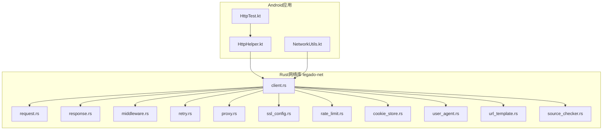
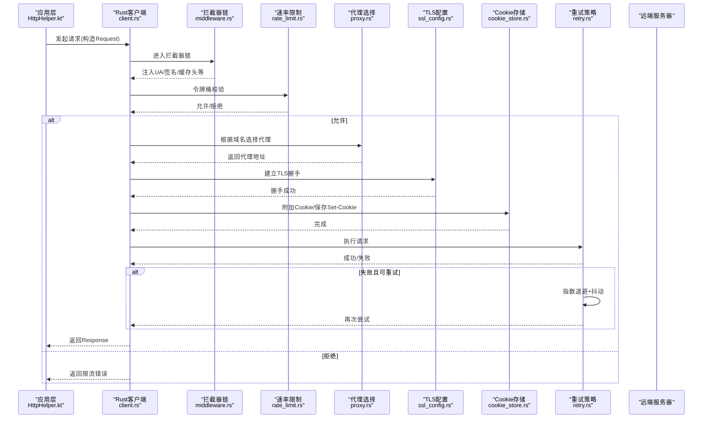
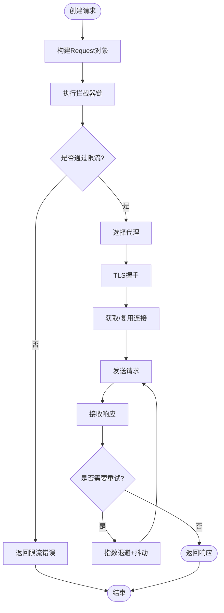
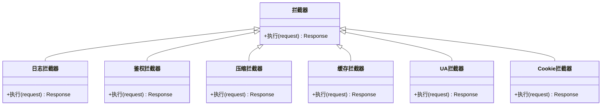
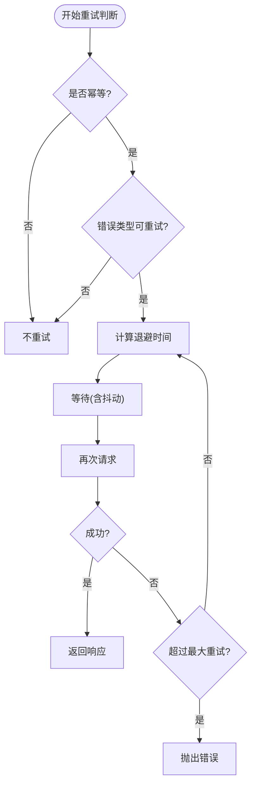
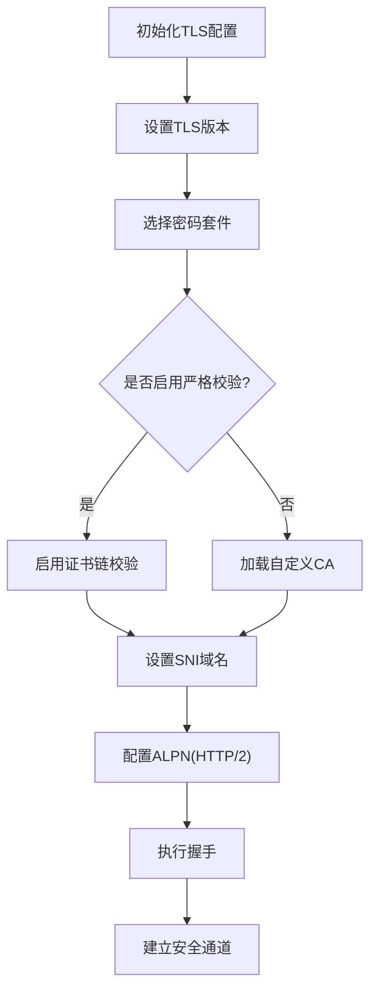
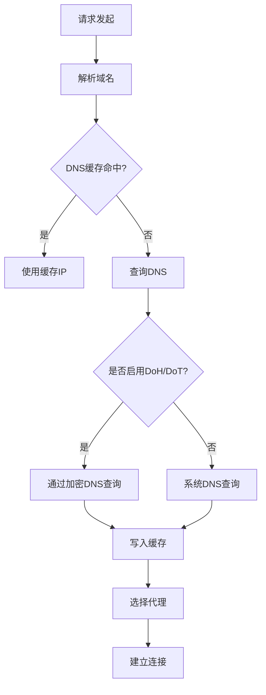
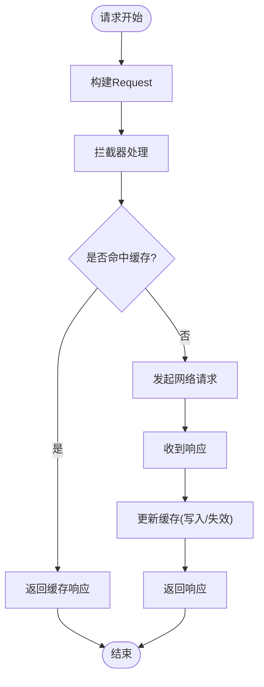
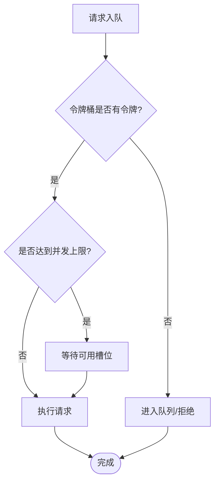
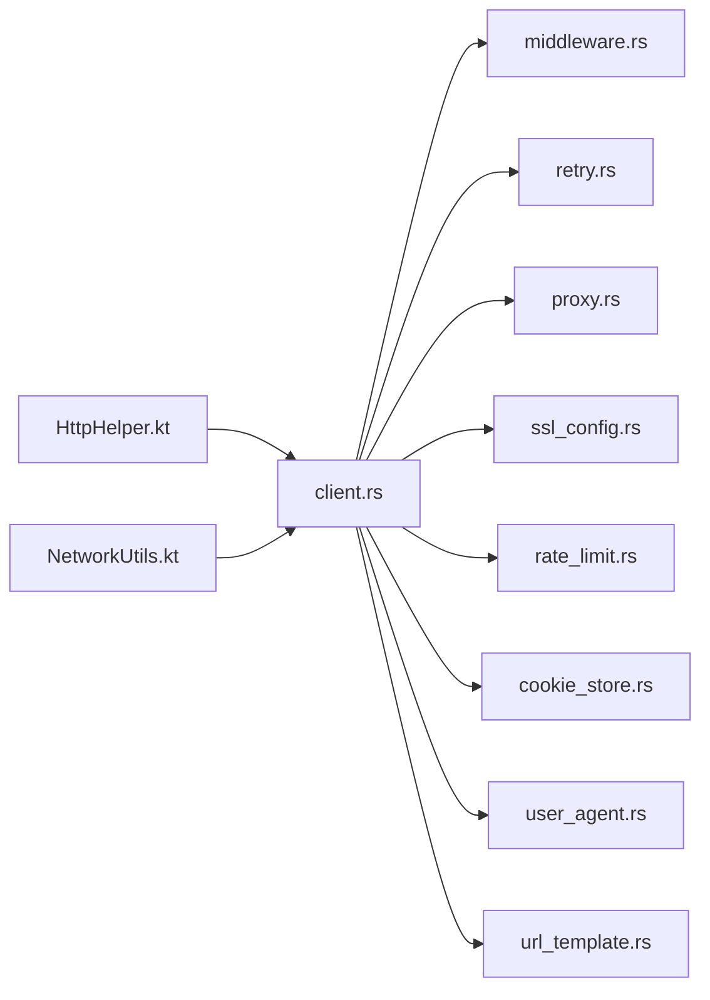

# 网络通信

<cite>
**本文引用的文件**   
- [legado-net/src/lib.rs](file://rust/legado-net/src/lib.rs)
- [legado-net/src/client.rs](file://rust/legado-net/src/client.rs)
- [legado-net/src/request.rs](file://rust/legado-net/src/request.rs)
- [legado-net/src/response.rs](file://rust/legado-net/src/response.rs)
- [legado-net/src/middleware.rs](file://rust/legado-net/src/middleware.rs)
- [legado-net/src/retry.rs](file://rust/legado-net/src/retry.rs)
- [legado-net/src/proxy.rs](file://rust/legado-net/src/proxy.rs)
- [legado-net/src/ssl_config.rs](file://rust/legado-net/src/ssl_config.rs)
- [legado-net/src/rate_limit.rs](file://rust/legado-net/src/rate_limit.rs)
- [legado-net/src/cookie_store.rs](file://rust/legado-net/src/cookie_store.rs)
- [legado-net/src/user_agent.rs](file://rust/legado-net/src/user_agent.rs)
- [legado-net/src/url_template.rs](file://rust/legado-net/src/url_template.rs)
- [legado-net/src/source_checker.rs](file://rust/legado-net/src/source_checker.rs)
- [app/src/main/java/io/legado/app/help/http/HttpHelper.kt](file://app/src/main/java/io/legado/app/help/http/HttpHelper.kt)
- [app/src/main/java/io/legado/app/utils/NetworkUtils.kt](file://app/src/main/java/io/legado/app/utils/NetworkUtils.kt)
- [app/src/test/java/io/legado/app/HttpTest.kt](file://app/src/test/java/io/legado/app/HttpTest.kt)
</cite>

## 目录
1. [简介](#简介)
2. [项目结构](#项目结构)
3. [核心组件](#核心组件)
4. [架构总览](#架构总览)
5. [详细组件分析](#详细组件分析)
6. [依赖关系分析](#依赖关系分析)
7. [性能考量](#性能考量)
8. [故障排查指南](#故障排查指南)
9. [结论](#结论)
10. [附录](#附录)

## 简介
本文件面向Legado项目的网络通信子系统，系统性阐述HTTP客户端实现与HTTPS安全通信。重点覆盖连接池管理、请求拦截器、重试机制、超时控制、缓存策略、并发控制、代理配置、DNS解析、网络状态监听、性能优化、流量监控与故障诊断，以及错误分类与用户友好提示。文档以代码级分析为基础，辅以架构图与时序图，帮助读者快速理解并高效使用或扩展该网络层。

## 项目结构
Legado的网络能力由Rust模块legado-net提供核心实现，Android端通过Kotlin辅助类进行集成与调用。关键目录与职责如下：
- Rust核心（legado-net）
  - client.rs：HTTP客户端封装，负责连接池、超时、重试、拦截器等组合
  - request.rs / response.rs：请求与响应模型定义
  - middleware.rs：请求拦截器链
  - retry.rs：重试策略与退避算法
  - proxy.rs：代理配置与选择
  - ssl_config.rs：TLS/SSL证书与加密参数配置
  - rate_limit.rs：速率限制与令牌桶
  - cookie_store.rs：Cookie持久化与会话保持
  - user_agent.rs：User-Agent管理与注入
  - url_template.rs：URL模板渲染
  - source_checker.rs：源站连通性检查
- Android集成
  - HttpHelper.kt：Kotlin侧HTTP工具与调用入口
  - NetworkUtils.kt：网络状态、DNS、代理等系统能力封装
  - HttpTest.kt：网络相关测试用例

图表来源 
- [legado-net/src/client.rs](file://rust/legado-net/src/client.rs)
- [legado-net/src/request.rs](file://rust/legado-net/src/request.rs)
- [legado-net/src/response.rs](file://rust/legado-net/src/response.rs)
- [legado-net/src/middleware.rs](file://rust/legado-net/src/middleware.rs)
- [legado-net/src/retry.rs](file://rust/legado-net/src/retry.rs)
- [legado-net/src/proxy.rs](file://rust/legado-net/src/proxy.rs)
- [legado-net/src/ssl_config.rs](file://rust/legado-net/src/ssl_config.rs)
- [legado-net/src/rate_limit.rs](file://rust/legado-net/src/rate_limit.rs)
- [legado-net/src/cookie_store.rs](file://rust/legado-net/src/cookie_store.rs)
- [legado-net/src/user_agent.rs](file://rust/legado-net/src/user_agent.rs)
- [legado-net/src/url_template.rs](file://rust/legado-net/src/url_template.rs)
- [legado-net/src/source_checker.rs](file://rust/legado-net/src/source_checker.rs)
- [app/src/main/java/io/legado/app/help/http/HttpHelper.kt](file://app/src/main/java/io/legado/app/help/http/HttpHelper.kt)
- [app/src/main/java/io/legado/app/utils/NetworkUtils.kt](file://app/src/main/java/io/legado/app/utils/NetworkUtils.kt)
- [app/src/test/java/io/legado/app/HttpTest.kt](file://app/src/test/java/io/legado/app/HttpTest.kt)

章节来源
- [legado-net/src/lib.rs](file://rust/legado-net/src/lib.rs)
- [app/src/main/java/io/legado/app/help/http/HttpHelper.kt](file://app/src/main/java/io/legado/app/help/http/HttpHelper.kt)
- [app/src/main/java/io/legado/app/utils/NetworkUtils.kt](file://app/src/main/java/io/legado/app/utils/NetworkUtils.kt)

## 核心组件
- HTTP客户端（client.rs）
  - 职责：统一构建请求、组装拦截器链、执行重试、设置超时、管理连接池、处理代理与TLS、维护Cookie与UA、限速与缓存策略。
  - 关键点：可插拔的中间件链；幂等与非幂等请求的重试差异；按域的连接复用与池大小上限；读写超时与整体超时。
- 请求与响应（request.rs, response.rs）
  - 职责：标准化请求体、头部、方法、URL模板变量；响应体、状态码、头部、流式读取与缓冲策略。
- 拦截器（middleware.rs）
  - 职责：日志记录、鉴权头注入、压缩协商、缓存控制、签名计算、UA/Cookie自动更新。
- 重试（retry.rs）
  - 职责：基于状态码/异常类型的可配置重试；指数退避与抖动；最大重试次数与熔断开关。
- 代理（proxy.rs）
  - 职责：HTTP/SOCKS代理配置、按域名路由、代理健康检查。
- TLS/SSL（ssl_config.rs）
  - 职责：证书校验、自定义CA、协议版本与密码套件选择、SNI配置。
- 速率限制（rate_limit.rs）
  - 职责：令牌桶/漏桶算法，按域或全局限流，避免触发目标服务限制。
- Cookie存储（cookie_store.rs）
  - 职责：跨请求会话保持、过期清理、安全标志（Secure/HttpOnly）。
- User-Agent（user_agent.rs）
  - 职责：设备指纹、版本信息、随机化策略。
- URL模板（url_template.rs）
  - 职责：路径参数与查询参数渲染、编码规则。
- 源站检查（source_checker.rs）
  - 职责：连通性探测、延迟统计、可用性评分。

章节来源
- [legado-net/src/client.rs](file://rust/legado-net/src/client.rs)
- [legado-net/src/request.rs](file://rust/legado-net/src/request.rs)
- [legado-net/src/response.rs](file://rust/legado-net/src/response.rs)
- [legado-net/src/middleware.rs](file://rust/legado-net/src/middleware.rs)
- [legado-net/src/retry.rs](file://rust/legado-net/src/retry.rs)
- [legado-net/src/proxy.rs](file://rust/legado-net/src/proxy.rs)
- [legado-net/src/ssl_config.rs](file://rust/legado-net/src/ssl_config.rs)
- [legado-net/src/rate_limit.rs](file://rust/legado-net/src/rate_limit.rs)
- [legado-net/src/cookie_store.rs](file://rust/legado-net/src/cookie_store.rs)
- [legado-net/src/user_agent.rs](file://rust/legado-net/src/user_agent.rs)
- [legado-net/src/url_template.rs](file://rust/legado-net/src/url_template.rs)
- [legado-net/src/source_checker.rs](file://rust/legado-net/src/source_checker.rs)

## 架构总览
下图展示从Android调用到Rust网络库执行的端到端流程，包括拦截器链、重试、代理、TLS、限速与Cookie等关键路径。

图表来源 
- [legado-net/src/client.rs](file://rust/legado-net/src/client.rs)
- [legado-net/src/middleware.rs](file://rust/legado-net/src/middleware.rs)
- [legado-net/src/rate_limit.rs](file://rust/legado-net/src/rate_limit.rs)
- [legado-net/src/proxy.rs](file://rust/legado-net/src/proxy.rs)
- [legado-net/src/ssl_config.rs](file://rust/legado-net/src/ssl_config.rs)
- [legado-net/src/cookie_store.rs](file://rust/legado-net/src/cookie_store.rs)
- [legado-net/src/retry.rs](file://rust/legado-net/src/retry.rs)
- [app/src/main/java/io/legado/app/help/http/HttpHelper.kt](file://app/src/main/java/io/legado/app/help/http/HttpHelper.kt)

## 详细组件分析

### HTTP客户端与连接池管理
- 连接池特性
  - 按主机名复用TCP/TLS连接，减少握手开销
  - 可配置最大空闲连接数、单主机最大连接数、连接存活时间
  - 支持连接健康检查与失效剔除
- 超时控制
  - 连接超时、读超时、写超时、整体请求超时
  - 对大文件下载启用分块读取与进度回调
- 并发控制
  - 全局并发上限与按域并发隔离
  - 任务队列与背压策略，避免内存暴涨

图表来源 
- [legado-net/src/client.rs](file://rust/legado-net/src/client.rs)
- [legado-net/src/middleware.rs](file://rust/legado-net/src/middleware.rs)
- [legado-net/src/rate_limit.rs](file://rust/legado-net/src/rate_limit.rs)
- [legado-net/src/proxy.rs](file://rust/legado-net/src/proxy.rs)
- [legado-net/src/ssl_config.rs](file://rust/legado-net/src/ssl_config.rs)
- [legado-net/src/retry.rs](file://rust/legado-net/src/retry.rs)

章节来源
- [legado-net/src/client.rs](file://rust/legado-net/src/client.rs)

### 请求拦截器链
- 典型拦截器
  - 日志记录：请求/响应摘要、耗时、状态码
  - 鉴权：动态注入Token、签名、时间戳
  - 压缩：协商gzip/br，自动解压
  - 缓存：Cache-Control/ETag/If-None-Match处理
  - UA/Cookie：自动更新与注入
- 执行顺序
  - 入栈顺序决定执行顺序，通常先鉴权后压缩再缓存
  - 异常在链中冒泡，便于统一处理

图表来源 
- [legado-net/src/middleware.rs](file://rust/legado-net/src/middleware.rs)

章节来源
- [legado-net/src/middleware.rs](file://rust/legado-net/src/middleware.rs)

### 重试机制与退避策略
- 触发条件
  - 网络异常（超时、连接中断）、服务端错误（5xx）、特定状态码（如429）
  - 非幂等请求默认不重试，除非显式配置
- 策略
  - 指数退避：基础间隔×2^重试次数
  - 抖动：加入随机因子避免雪崩
  - 最大重试次数与熔断：连续失败达到阈值暂停重试
- 结果
  - 成功则返回响应；失败则抛出带上下文的可诊断错误

图表来源 
- [legado-net/src/retry.rs](file://rust/legado-net/src/retry.rs)

章节来源
- [legado-net/src/retry.rs](file://rust/legado-net/src/retry.rs)

### HTTPS安全通信与SSL证书验证
- 证书校验
  - 默认启用严格校验，禁止自签证书通过
  - 支持注入自定义CA用于企业内网或抓包调试场景
- 协议与套件
  - 指定TLS版本范围（如1.2~1.3）
  - 选择安全密码套件，禁用弱算法
- SNI与ALPN
  - 正确设置SNI域名，提升兼容性
  - ALPN协商HTTP/2以提升吞吐
- 传输加密
  - 全链路TLS加密，防窃听与篡改

图表来源 
- [legado-net/src/ssl_config.rs](file://rust/legado-net/src/ssl_config.rs)

章节来源
- [legado-net/src/ssl_config.rs](file://rust/legado-net/src/ssl_config.rs)

### 代理配置与DNS解析
- 代理
  - 支持HTTP与SOCKS代理
  - 按域名白名单/黑名单选择代理
  - 代理健康检查与故障切换
- DNS
  - 系统DNS与自定义DNS（DoH/DoT）可选
  - 解析缓存与TTL控制
  - 解析失败回退策略

图表来源 
- [legado-net/src/proxy.rs](file://rust/legado-net/src/proxy.rs)
- [app/src/main/java/io/legado/app/utils/NetworkUtils.kt](file://app/src/main/java/io/legado/app/utils/NetworkUtils.kt)

章节来源
- [legado-net/src/proxy.rs](file://rust/legado-net/src/proxy.rs)
- [app/src/main/java/io/legado/app/utils/NetworkUtils.kt](file://app/src/main/java/io/legado/app/utils/NetworkUtils.kt)

### 网络请求生命周期与缓存策略
- 生命周期阶段
  - 构建→拦截→限流→代理→TLS→连接→发送→接收→重试→返回
- 缓存策略
  - 强缓存：Cache-Control、ETag
  - 协商缓存：If-Modified-Since、If-None-Match
  - 本地缓存：磁盘/内存两级，按TTL与体积淘汰
  - 预取：热点资源预测性加载

图表来源 
- [legado-net/src/middleware.rs](file://rust/legado-net/src/middleware.rs)
- [legado-net/src/cookie_store.rs](file://rust/legado-net/src/cookie_store.rs)

章节来源
- [legado-net/src/middleware.rs](file://rust/legado-net/src/middleware.rs)

### 并发控制与速率限制
- 并发控制
  - 全局并发上限，防止阻塞UI线程
  - 按域隔离并发，避免单一站点拖垮整体
- 速率限制
  - 令牌桶算法，平滑突发流量
  - 按域/全局配额，超限返回429或排队

图表来源 
- [legado-net/src/rate_limit.rs](file://rust/legado-net/src/rate_limit.rs)

章节来源
- [legado-net/src/rate_limit.rs](file://rust/legado-net/src/rate_limit.rs)

### Cookie与会话管理
- 功能
  - 自动携带与更新Cookie
  - 支持Secure/HttpOnly/SameSite标志
  - 过期清理与分区存储
- 使用建议
  - 敏感接口开启Strict模式
  - 多域共享时注意SameSite策略

章节来源
- [legado-net/src/cookie_store.rs](file://rust/legado-net/src/cookie_store.rs)

### User-Agent与URL模板
- User-Agent
  - 设备型号、系统版本、应用版本拼接
  - 可选随机化以避免反爬
- URL模板
  - 路径参数与查询参数渲染
  - 编码规则与特殊字符处理

章节来源
- [legado-net/src/user_agent.rs](file://rust/legado-net/src/user_agent.rs)
- [legado-net/src/url_template.rs](file://rust/legado-net/src/url_template.rs)

### 源站检查与健康度
- 功能
  - 定期探测连通性与延迟
  - 可用性评分与降级策略
- 用途
  - 智能选择最优节点
  - 故障转移与告警

章节来源
- [legado-net/src/source_checker.rs](file://rust/legado-net/src/source_checker.rs)

## 依赖关系分析
- 模块耦合
  - client.rs为核心编排者，依赖middleware、retry、proxy、ssl_config、rate_limit、cookie_store、user_agent、url_template
  - Android端通过HttpHelper.kt调用Rust客户端，NetworkUtils.kt提供系统能力
- 外部依赖
  - TLS/SSL底层库、DNS解析库、代理库、压缩库、序列化库

图表来源 
- [legado-net/src/client.rs](file://rust/legado-net/src/client.rs)
- [legado-net/src/middleware.rs](file://rust/legado-net/src/middleware.rs)
- [legado-net/src/retry.rs](file://rust/legado-net/src/retry.rs)
- [legado-net/src/proxy.rs](file://rust/legado-net/src/proxy.rs)
- [legado-net/src/ssl_config.rs](file://rust/legado-net/src/ssl_config.rs)
- [legado-net/src/rate_limit.rs](file://rust/legado-net/src/rate_limit.rs)
- [legado-net/src/cookie_store.rs](file://rust/legado-net/src/cookie_store.rs)
- [legado-net/src/user_agent.rs](file://rust/legado-net/src/user_agent.rs)
- [legado-net/src/url_template.rs](file://rust/legado-net/src/url_template.rs)
- [app/src/main/java/io/legado/app/help/http/HttpHelper.kt](file://app/src/main/java/io/legado/app/help/http/HttpHelper.kt)
- [app/src/main/java/io/legado/app/utils/NetworkUtils.kt](file://app/src/main/java/io/legado/app/utils/NetworkUtils.kt)

章节来源
- [legado-net/src/client.rs](file://rust/legado-net/src/client.rs)
- [app/src/main/java/io/legado/app/help/http/HttpHelper.kt](file://app/src/main/java/io/legado/app/help/http/HttpHelper.kt)

## 性能考量
- 连接复用与池化
  - 合理设置最大连接数与空闲超时，避免过多连接导致内存压力
- 压缩与分块
  - 启用gzip/br压缩，大文件分块下载与断点续传
- 缓存命中率
  - 合理使用ETag与强缓存，降低重复请求
- 并发与限流
  - 按域隔离并发，避免热点站点阻塞其他请求
- TLS优化
  - 复用TLS会话、启用ALPN、减少握手次数
- DNS优化
  - 启用DoH/DoT并缓存解析结果，缩短解析时延

[本节为通用指导，无需引用具体文件]

## 故障排查指南
- 常见问题定位
  - 连接超时：检查代理、防火墙、DNS解析与TLS握手
  - 证书错误：确认证书链完整性与CA信任
  - 429限流：调整令牌桶参数或增加退避时间
  - 5xx错误：查看服务端日志与重试策略
- 诊断手段
  - 启用详细日志（请求/响应摘要、耗时、状态码）
  - 抓取网络包（谨慎使用自签CA）
  - 源站健康检查与延迟统计
- 用户友好提示
  - 将技术错误映射为用户可读消息（如“网络不可用”“请检查代理设置”）
  - 提供重试按钮与离线缓存提示

章节来源
- [legado-net/src/middleware.rs](file://rust/legado-net/src/middleware.rs)
- [legado-net/src/source_checker.rs](file://rust/legado-net/src/source_checker.rs)
- [app/src/test/java/io/legado/app/HttpTest.kt](file://app/src/test/java/io/legado/app/HttpTest.kt)

## 结论
Legado的网络通信子系统以Rust为核心，提供高性能、高可靠的HTTP/HTTPS能力。通过拦截器链、重试、代理、TLS、限速、Cookie、UA与URL模板等模块化设计，实现了灵活可扩展的请求生命周期管理。结合Android端的集成与工具类，能够覆盖复杂业务场景下的网络需求。建议在生产环境启用严格TLS、合理配置连接池与限流，并通过日志与健康检查持续优化性能与稳定性。

[本节为总结，无需引用具体文件]

## 附录
- 最佳实践清单
  - 始终启用HTTPS与严格证书校验
  - 合理设置超时与重试，避免无限重试
  - 使用缓存与压缩降低带宽与延迟
  - 按域隔离并发与限流，保护自身与服务端
  - 完善错误分类与用户提示，提升体验
- 参考测试
  - 网络相关用例位于HttpTest.kt，可用于验证基本连通性与错误分支

章节来源
- [app/src/test/java/io/legado/app/HttpTest.kt](file://app/src/test/java/io/legado/app/HttpTest.kt)