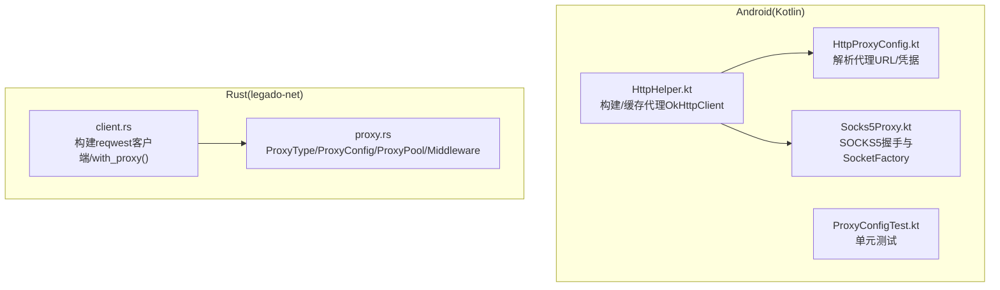
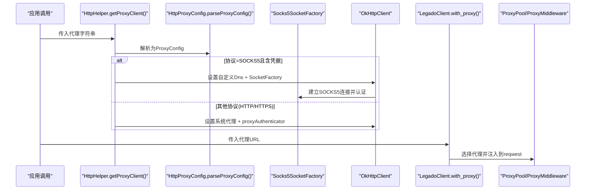
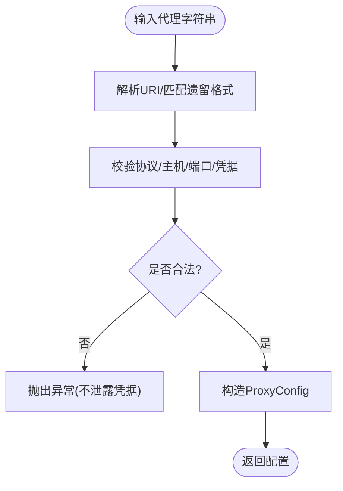
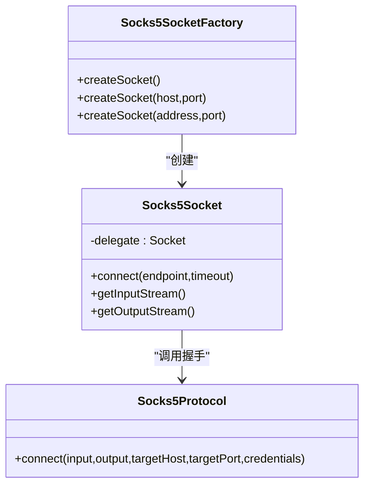
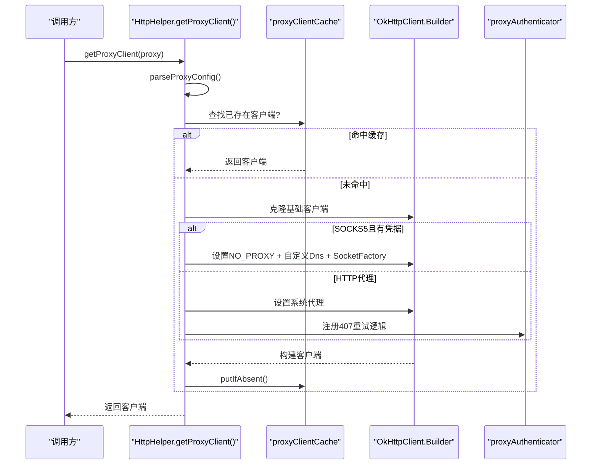
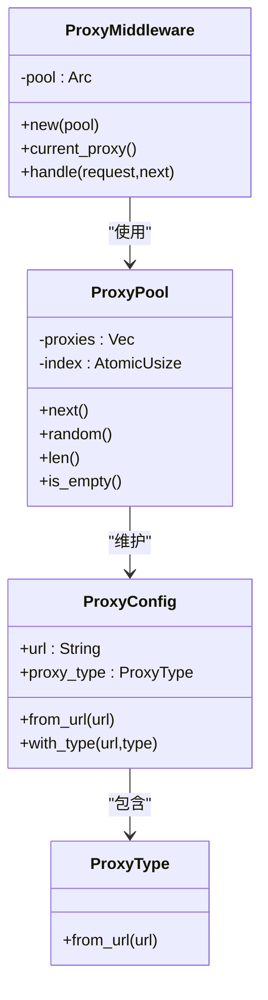
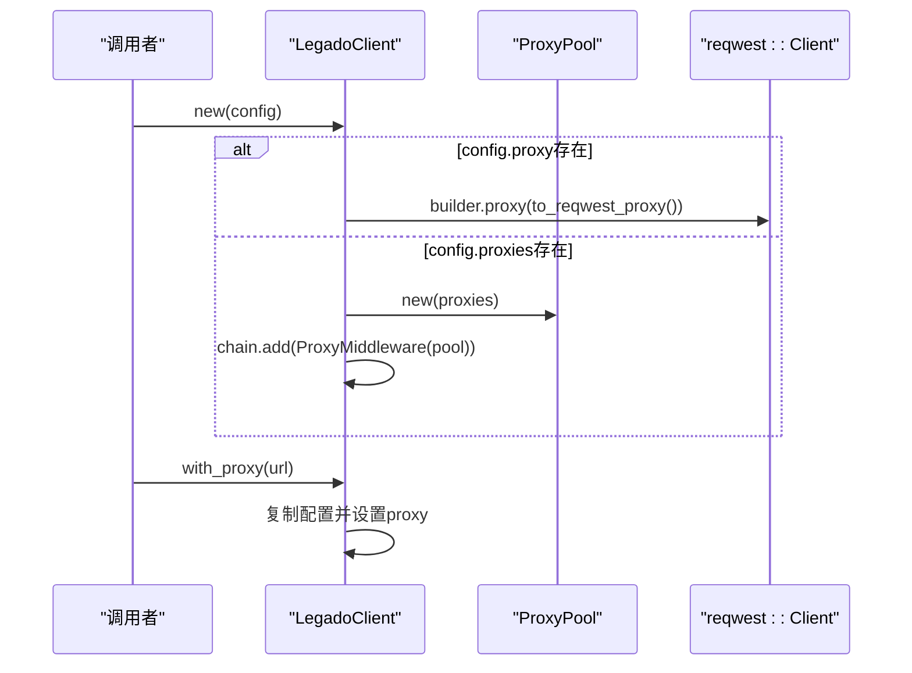
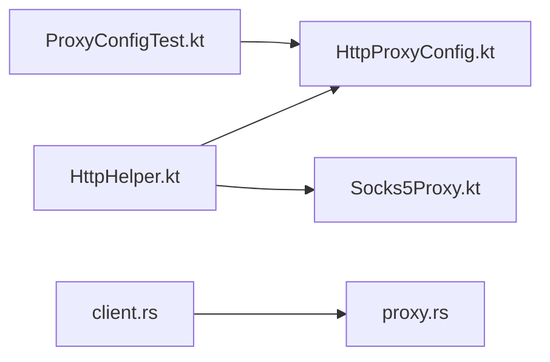

# SOCKS5代理支持

<cite>
**本文引用的文件**   
- [HttpHelper.kt](file://app/src/main/java/io/legado/app/help/http/HttpHelper.kt)
- [HttpProxyConfig.kt](file://app/src/main/java/io/legado/app/help/http/HttpProxyConfig.kt)
- [Socks5Proxy.kt](file://app/src/main/java/io/legado/app/help/http/Socks5Proxy.kt)
- [client.rs](file://rust/legado-net/src/client.rs)
- [proxy.rs](file://rust/legado-net/src/proxy.rs)
- [ProxyConfigTest.kt](file://app/src/test/java/io/legado/app/help/http/ProxyConfigTest.kt)
</cite>

## 目录
1. [简介](#简介)
2. [项目结构](#项目结构)
3. [核心组件](#核心组件)
4. [架构总览](#架构总览)
5. [详细组件分析](#详细组件分析)
6. [依赖关系分析](#依赖关系分析)
7. [性能考量](#性能考量)
8. [故障排查指南](#故障排查指南)
9. [结论](#结论)
10. [附录](#附录)

## 简介
本文件系统性梳理 Legado 项目中对 SOCKS5 代理的支持实现，覆盖 Android/Kotlin 与 Rust 两条技术栈：
- Android 侧通过自定义 SocketFactory、DNS 与 OkHttp 配置，实现对 SOCKS5（含用户名/密码认证）的透明代理。
- Rust 侧提供统一的代理类型识别、代理池与中间件，以及将配置转换为底层 HTTP 客户端代理的能力。

文档面向开发者与使用者，既包含代码级架构图与调用序列，也给出使用建议与排错要点。

## 项目结构
围绕 SOCKS5 代理的关键代码分布在以下模块：
- app（Android/Kotlin）
  - HttpHelper.kt：构建带代理的 OkHttpClient，缓存不同代理配置的客户端实例。
  - HttpProxyConfig.kt：解析代理字符串（支持 http/socks4/socks5），校验并提取主机、端口、凭据等。
  - Socks5Proxy.kt：实现 SOCKS5 握手与隧道建立，封装为 SocketFactory 供 OkHttp 使用。
  - ProxyConfigTest.kt：覆盖代理解析、边界条件与认证策略的单元测试。
- rust/legado-net（Rust）
  - proxy.rs：定义代理类型、代理配置、代理池与中间件，支持轮询与伪随机选择。
  - client.rs：根据配置创建 reqwest 客户端或副本，注入代理；测试用例覆盖 socks5 场景。

**图示来源** 
- [HttpHelper.kt:151-200](file://app/src/main/java/io/legado/app/help/http/HttpHelper.kt#L151-L200)
- [HttpProxyConfig.kt:36-84](file://app/src/main/java/io/legado/app/help/http/HttpProxyConfig.kt#L36-L84)
- [Socks5Proxy.kt:25-59](file://app/src/main/java/io/legado/app/help/http/Socks5Proxy.kt#L25-L59)
- [proxy.rs:15-64](file://rust/legado-net/src/proxy.rs#L15-L64)
- [client.rs:149-188](file://rust/legado-net/src/client.rs#L149-L188)

**章节来源**
- [HttpHelper.kt:1-211](file://app/src/main/java/io/legado/app/help/http/HttpHelper.kt#L1-L211)
- [HttpProxyConfig.kt:1-182](file://app/src/main/java/io/legado/app/help/http/HttpProxyConfig.kt#L1-L182)
- [Socks5Proxy.kt:1-290](file://app/src/main/java/io/legado/app/help/http/Socks5Proxy.kt#L1-L290)
- [proxy.rs:1-281](file://rust/legado-net/src/proxy.rs#L1-L281)
- [client.rs:120-239](file://rust/legado-net/src/client.rs#L120-L239)
- [ProxyConfigTest.kt:1-133](file://app/src/test/java/io/legado/app/help/http/ProxyConfigTest.kt#L1-L133)

## 核心组件
- 代理配置解析（Kotlin）
  - 支持协议：http、socks4、socks5
  - 支持标准与遗留两种凭据格式，自动解码百分号编码，校验端口范围与主机合法性
- SOCKS5 握手与隧道（Kotlin）
  - 自定义 Dns 避免系统 DNS 泄露
  - 自定义 SocketFactory 包装 SOCKS5 连接，完成用户名/密码认证与 CONNECT
- OkHttp 代理客户端（Kotlin）
  - 按 ProxyConfig 缓存 OkHttpClient，避免重复构建
  - 针对 SOCKS5+认证采用“禁用系统代理 + 自定义Dns + 自定义SocketFactory”的组合
  - 针对 HTTP 代理启用 proxyAuthenticator 重试一次 407 挑战
- 代理池与中间件（Rust）
  - ProxyType/ProxyConfig 从 URL scheme 推断类型
  - ProxyPool 提供轮询与伪随机选择
  - ProxyMiddleware 记录当前代理信息，实际代理在 Client 层设置
- 客户端构建（Rust）
  - with_proxy() 基于配置创建新客户端副本，注入代理
  - 测试覆盖 socks5 与代理池场景

**章节来源**
- [HttpProxyConfig.kt:36-99](file://app/src/main/java/io/legado/app/help/http/HttpProxyConfig.kt#L36-L99)
- [Socks5Proxy.kt:165-228](file://app/src/main/java/io/legado/app/help/http/Socks5Proxy.kt#L165-L228)
- [HttpHelper.kt:151-199](file://app/src/main/java/io/legado/app/help/http/HttpHelper.kt#L151-L199)
- [proxy.rs:15-168](file://rust/legado-net/src/proxy.rs#L15-L168)
- [client.rs:149-188](file://rust/legado-net/src/client.rs#L149-L188)

## 架构总览
下图展示 Kotlin 与 Rust 两端如何协同实现 SOCKS5 代理能力：Kotlin 负责 OkHttp 层的代理接入与握手细节，Rust 负责通用代理抽象、池化与客户端装配。

**图示来源** 
- [HttpHelper.kt:151-199](file://app/src/main/java/io/legado/app/help/http/HttpHelper.kt#L151-L199)
- [HttpProxyConfig.kt:36-84](file://app/src/main/java/io/legado/app/help/http/HttpProxyConfig.kt#L36-L84)
- [Socks5Proxy.kt:25-59](file://app/src/main/java/io/legado/app/help/http/Socks5Proxy.kt#L25-L59)
- [client.rs:425-430](file://rust/legado-net/src/client.rs#L425-L430)
- [proxy.rs:143-162](file://rust/legado-net/src/proxy.rs#L143-L162)

## 详细组件分析

### Kotlin 端：代理配置与解析
- 支持的协议与格式
  - 支持 http、socks4、socks5
  - 兼容标准 URI 与遗留格式（@user@password）
  - 支持 IPv4/IPv6、国际化域名、百分号编码的用户名/密码
- 校验与安全
  - 严格校验端口范围、主机合法性与凭据长度
  - 拒绝不支持的认证方式（如 SOCKS4 认证）

**图示来源** 
- [HttpProxyConfig.kt:36-99](file://app/src/main/java/io/legado/app/help/http/HttpProxyConfig.kt#L36-L99)
- [HttpProxyConfig.kt:101-161](file://app/src/main/java/io/legado/app/help/http/HttpProxyConfig.kt#L101-L161)

**章节来源**
- [HttpProxyConfig.kt:36-161](file://app/src/main/java/io/legado/app/help/http/HttpProxyConfig.kt#L36-L161)
- [ProxyConfigTest.kt:14-122](file://app/src/test/java/io/legado/app/help/http/ProxyConfigTest.kt#L14-L122)

### Kotlin 端：SOCKS5 握手与 SocketFactory
- 关键机制
  - 自定义 Dns：避免系统 DNS 解析导致真实目标泄露
  - 自定义 SocketFactory：所有 TCP 连接先连至 SOCKS5 服务器，再执行用户名/密码认证与 CONNECT
- 协议流程
  - 协商方法（仅支持用户/密码）
  - 发送认证报文（UTF-8 用户名/密码）
  - 发起 CONNECT（支持 IPv4/IPv6/域名）

**图示来源** 
- [Socks5Proxy.kt:25-59](file://app/src/main/java/io/legado/app/help/http/Socks5Proxy.kt#L25-L59)
- [Socks5Proxy.kt:61-101](file://app/src/main/java/io/legado/app/help/http/Socks5Proxy.kt#L61-L101)
- [Socks5Proxy.kt:165-228](file://app/src/main/java/io/legado/app/help/http/Socks5Proxy.kt#L165-L228)

**章节来源**
- [Socks5Proxy.kt:20-59](file://app/src/main/java/io/legado/app/help/http/Socks5Proxy.kt#L20-L59)
- [Socks5Proxy.kt:61-101](file://app/src/main/java/io/legado/app/help/http/Socks5Proxy.kt#L61-L101)
- [Socks5Proxy.kt:165-228](file://app/src/main/java/io/legado/app/help/http/Socks5Proxy.kt#L165-L228)

### Kotlin 端：OkHttp 代理客户端构建与缓存
- 行为要点
  - 无代理时返回默认客户端
  - SOCKS5+认证：禁用系统代理，注入自定义 Dns 与 SocketFactory
  - HTTP 代理：设置系统代理，启用 proxyAuthenticator，仅在首次 407 挑战时重试
  - 按 ProxyConfig 缓存 OkHttpClient，避免重复构建开销

**图示来源** 
- [HttpHelper.kt:151-199](file://app/src/main/java/io/legado/app/help/http/HttpHelper.kt#L151-L199)
- [HttpHelper.kt:182-197](file://app/src/main/java/io/legado/app/help/http/HttpHelper.kt#L182-L197)

**章节来源**
- [HttpHelper.kt:151-200](file://app/src/main/java/io/legado/app/help/http/HttpHelper.kt#L151-L200)

### Rust 端：代理类型、配置与池化
- 类型与配置
  - ProxyType：Http/Https/Socks5，由 URL scheme 推断
  - ProxyConfig：保存原始 URL 与类型
- 代理池
  - 轮询 next() 与伪随机 random()
  - 线程安全原子索引
- 中间件
  - ProxyMiddleware：记录当前代理，实际代理在 Client 层设置

**图示来源** 
- [proxy.rs:15-64](file://rust/legado-net/src/proxy.rs#L15-L64)
- [proxy.rs:66-114](file://rust/legado-net/src/proxy.rs#L66-L114)
- [proxy.rs:122-162](file://rust/legado-net/src/proxy.rs#L122-L162)

**章节来源**
- [proxy.rs:15-162](file://rust/legado-net/src/proxy.rs#L15-L162)

### Rust 端：客户端构建与代理注入
- 构建逻辑
  - new()：若配置包含单个代理，直接注入；若包含多个代理，创建 ProxyPool 并加入中间件链
  - with_proxy()：基于现有客户端创建副本，替换代理配置
- 测试覆盖
  - 包含 socks5 与代理池用例

**图示来源** 
- [client.rs:149-188](file://rust/legado-net/src/client.rs#L149-L188)
- [client.rs:425-430](file://rust/legado-net/src/client.rs#L425-L430)

**章节来源**
- [client.rs:120-239](file://rust/legado-net/src/client.rs#L120-L239)
- [client.rs:425-430](file://rust/legado-net/src/client.rs#L425-L430)

## 依赖关系分析
- Kotlin 内部依赖
  - HttpHelper 依赖 HttpProxyConfig（解析）、Socks5Proxy（SOCKS5 握手）
  - 测试 ProxyConfigTest 验证解析与认证策略
- Rust 内部依赖
  - client.rs 依赖 proxy.rs（代理类型、池、中间件）
  - 测试覆盖 socks5 与代理池路径

**图示来源** 
- [HttpHelper.kt:151-199](file://app/src/main/java/io/legado/app/help/http/HttpHelper.kt#L151-L199)
- [HttpProxyConfig.kt:36-84](file://app/src/main/java/io/legado/app/help/http/HttpProxyConfig.kt#L36-L84)
- [Socks5Proxy.kt:25-59](file://app/src/main/java/io/legado/app/help/http/Socks5Proxy.kt#L25-L59)
- [client.rs:149-188](file://rust/legado-net/src/client.rs#L149-L188)
- [proxy.rs:143-162](file://rust/legado-net/src/proxy.rs#L143-L162)

**章节来源**
- [HttpHelper.kt:151-199](file://app/src/main/java/io/legado/app/help/http/HttpHelper.kt#L151-L199)
- [client.rs:149-188](file://rust/legado-net/src/client.rs#L149-L188)

## 性能考量
- 客户端缓存
  - Kotlin 端按 ProxyConfig 缓存 OkHttpClient，减少重复构建与握手成本
- 连接复用
  - 合理设置超时与 Keep-Alive，避免频繁新建连接
- 代理池
  - Rust 端使用原子索引进行轮询，避免锁竞争；随机选择用于负载分散
- DNS 控制
  - Kotlin 端对 SOCKS5 使用自定义 Dns，避免额外解析开销与泄露风险

[本节为通用指导，无需引用具体文件]

## 故障排查指南
- 常见错误与定位
  - 代理字符串非法：检查协议、主机、端口与凭据格式（参考测试用例中的无效样例）
  - SOCKS5 认证失败：确认用户名/密码 UTF-8 长度限制与代理服务器配置
  - 407 未重试：HTTP 代理仅在首次 407 挑战时重试，需确保首次请求携带正确凭据
- 调试建议
  - 开启网络日志拦截器，观察握手与响应码
  - 验证 DNS 是否被自定义接管（SOCKS5 场景）
  - 检查代理池是否为空或索引越界

**章节来源**
- [ProxyConfigTest.kt:77-122](file://app/src/test/java/io/legado/app/help/http/ProxyConfigTest.kt#L77-L122)
- [HttpHelper.kt:182-197](file://app/src/main/java/io/legado/app/help/http/HttpHelper.kt#L182-L197)
- [Socks5Proxy.kt:181-202](file://app/src/main/java/io/legado/app/help/http/Socks5Proxy.kt#L181-L202)

## 结论
本项目在 Kotlin 与 Rust 两端均实现了完善的 SOCKS5 代理支持：
- Kotlin 侧通过自定义 Dns、SocketFactory 与 OkHttp 配置，精确处理 SOCKS5 握手与认证，并对 HTTP 代理提供可靠的 407 重试。
- Rust 侧提供统一的代理抽象、池化与中间件，便于在不同平台与客户端间复用。
整体设计兼顾安全性（不泄露凭据与 DNS）、可维护性（清晰的分层与缓存）与可扩展性（多协议与代理池）。

[本节为总结性内容，无需引用具体文件]

## 附录
- 使用建议
  - 优先使用标准 URI 格式（含 user:pass@host:port）
  - 对于高并发场景，建议使用代理池与客户端缓存
  - 谨慎配置超时与重试策略，避免雪崩
- 相关测试
  - 覆盖协议解析、IPv6、国际化域名、凭据编码与认证策略

[本节为补充说明，无需引用具体文件]