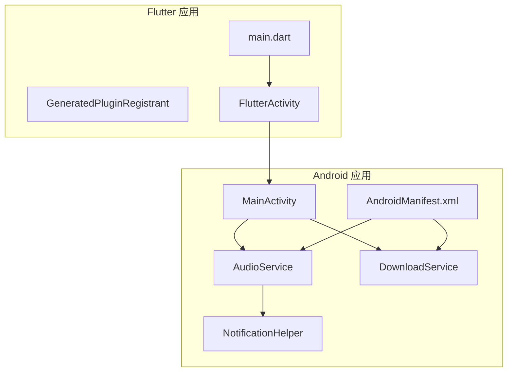
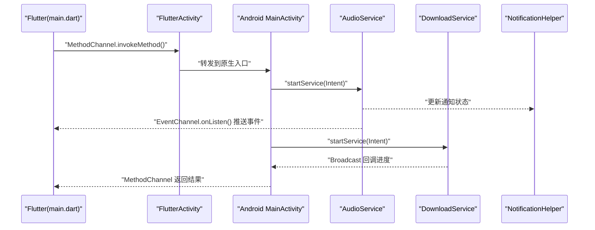
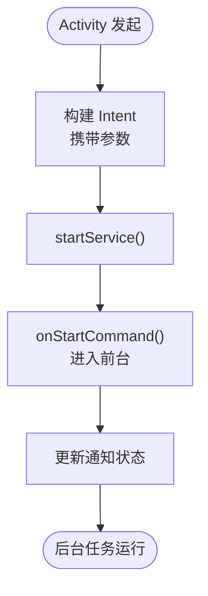
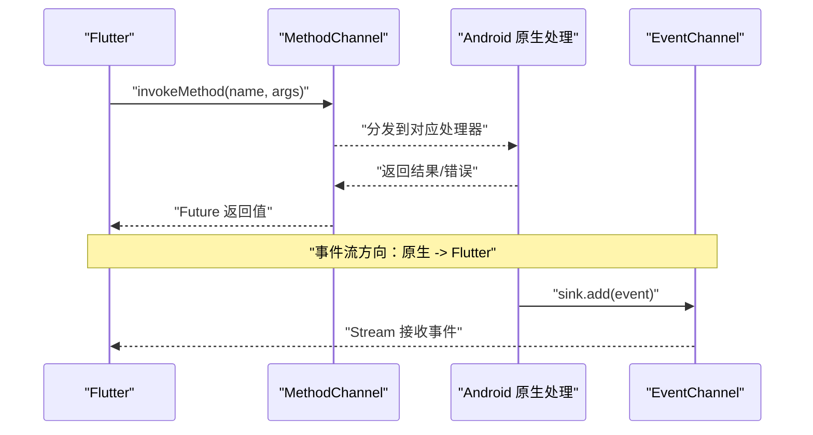
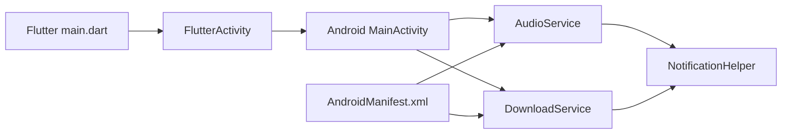

# 进程间通信

<cite>
**本文引用的文件**   
- [AndroidManifest.xml](file://app/src/main/AndroidManifest.xml)
- [App.kt](file://app/src/main/java/io/legado/app/App.kt)
- [AudioService.kt](file://app/src/main/java/io/legado/app/service/AudioService.kt)
- [DownloadService.kt](file://app/src/main/java/io/legado/app/service/DownloadService.kt)
- [NotificationHelper.kt](file://app/src/main/java/io/legado/app/utils/NotificationHelper.kt)
- [IntentDataTest.kt](file://app/src/test/java/io/legado/app/help/IntentDataTest.kt)
- [MainActivity.kt](file://app/src/main/java/io/legado/app/ui/main/MainActivity.kt)
- [FlutterActivity.kt](file://flutter_legado/android/app/src/main/java/io/flutter/embedding/android/FlutterActivity.java)
- [GeneratedPluginRegistrant.java](file://flutter_legado/android/app/src/main/java/io/flutter/plugins/GeneratedPluginRegistrant.java)
- [main.dart](file://flutter_legado/lib/main.dart)
- [pubspec.yaml](file://flutter_legado/pubspec.yaml)
</cite>

## 目录
1. [简介](#简介)
2. [项目结构](#项目结构)
3. [核心组件](#核心组件)
4. [架构总览](#架构总览)
5. [详细组件分析](#详细组件分析)
6. [依赖分析](#依赖分析)
7. [性能考虑](#性能考虑)
8. [故障排查指南](#故障排查指南)
9. [结论](#结论)
10. [附录](#附录)

## 简介
本文件面向 Android 应用与 Flutter 混合工程中的进程间通信（IPC）机制，系统性梳理并解释以下主题：
- Android 应用内 IPC：Intent、Broadcast、ContentProvider、AIDL
- Flutter 与原生平台通信：MethodChannel、EventChannel、BasicMessageChannel
- 跨进程数据交换的安全与性能优化
- Service 与 Activity 的通信模式、后台任务管理与系统级通信
- 调试技巧与常见问题解决方案

本说明以仓库中实际存在的 Android 模块与 Flutter 工程为依据，结合常见最佳实践进行归纳。

## 项目结构
该仓库包含两个主要子工程：
- app：Android 原生应用，包含 UI、服务、工具类、测试等
- flutter_legado：Flutter 应用及 Android 端桥接代码

图表来源
- [AndroidManifest.xml](file://app/src/main/AndroidManifest.xml)
- [MainActivity.kt](file://app/src/main/java/io/legado/app/ui/main/MainActivity.kt)
- [AudioService.kt](file://app/src/main/java/io/legado/app/service/AudioService.kt)
- [DownloadService.kt](file://app/src/main/java/io/legado/app/service/DownloadService.kt)
- [NotificationHelper.kt](file://app/src/main/java/io/legado/app/utils/NotificationHelper.kt)
- [FlutterActivity.kt](file://flutter_legado/android/app/src/main/java/io/flutter/embedding/android/FlutterActivity.java)
- [GeneratedPluginRegistrant.java](file://flutter_legado/android/app/src/main/java/io/flutter/plugins/GeneratedPluginRegistrant.java)
- [main.dart](file://flutter_legado/lib/main.dart)

章节来源
- [AndroidManifest.xml](file://app/src/main/AndroidManifest.xml)
- [App.kt](file://app/src/main/java/io/legado/app/App.kt)

## 核心组件
- Intent：用于在 Activity、Service、Receiver 之间传递消息与数据，支持显式与隐式调用，适合启动页面、启动服务、发送广播等场景。
- Broadcast：系统或应用内广播，适合解耦的事件通知，如网络状态变化、下载完成等。
- ContentProvider：跨进程共享数据，常用于媒体库、联系人、自定义数据源。
- AIDL：定义跨进程接口，适合高频、强类型、双向通信需求。
- Flutter Platform Channels：MethodChannel（请求-响应）、EventChannel（事件流）、BasicMessageChannel（轻量消息）。

章节来源
- [IntentDataTest.kt](file://app/src/test/java/io/legado/app/help/IntentDataTest.kt)
- [NotificationHelper.kt](file://app/src/main/java/io/legado/app/utils/NotificationHelper.kt)
- [pubspec.yaml](file://flutter_legado/pubspec.yaml)

## 架构总览
下图展示 Flutter 与 Android 之间的典型通信路径，以及 Android 内部 Activity-Service 交互。

图表来源
- [main.dart](file://flutter_legado/lib/main.dart)
- [FlutterActivity.kt](file://flutter_legado/android/app/src/main/java/io/flutter/embedding/android/FlutterActivity.java)
- [MainActivity.kt](file://app/src/main/java/io/legado/app/ui/main/MainActivity.kt)
- [AudioService.kt](file://app/src/main/java/io/legado/app/service/AudioService.kt)
- [DownloadService.kt](file://app/src/main/java/io/legado/app/service/DownloadService.kt)
- [NotificationHelper.kt](file://app/src/main/java/io/legado/app/utils/NotificationHelper.kt)

## 详细组件分析

### Android 内部 IPC：Intent 与 Service
- 使用场景：从 Activity 启动后台服务执行耗时任务（音频播放、下载），并通过通知反馈状态。
- 关键点：
  - 显式 Intent 指定目标 Service，避免歧义。
  - 通过 startForeground 提升服务前台优先级，保障任务稳定性。
  - 使用 Notification 提供用户可见的状态与操作入口。

图表来源
- [MainActivity.kt](file://app/src/main/java/io/legado/app/ui/main/MainActivity.kt)
- [AudioService.kt](file://app/src/main/java/io/legado/app/service/AudioService.kt)
- [DownloadService.kt](file://app/src/main/java/io/legado/app/service/DownloadService.kt)
- [NotificationHelper.kt](file://app/src/main/java/io/legado/app/utils/NotificationHelper.kt)

章节来源
- [MainActivity.kt](file://app/src/main/java/io/legado/app/ui/main/MainActivity.kt)
- [AudioService.kt](file://app/src/main/java/io/legado/app/service/AudioService.kt)
- [DownloadService.kt](file://app/src/main/java/io/legado/app/service/DownloadService.kt)
- [NotificationHelper.kt](file://app/src/main/java/io/legado/app/utils/NotificationHelper.kt)

### Android 内部 IPC：Broadcast 广播
- 使用场景：服务完成后向 UI 层广播进度或结果；系统级事件（网络、电量）监听。
- 关键点：
  - 使用有序/粘性广播需谨慎，避免泄露敏感信息。
  - 注册/注销生命周期要匹配，防止内存泄漏。
  - 大对象建议仅传递标识符，由接收方按需加载。

章节来源
- [DownloadService.kt](file://app/src/main/java/io/legado/app/service/DownloadService.kt)
- [NotificationHelper.kt](file://app/src/main/java/io/legado/app/utils/NotificationHelper.kt)

### Android 内部 IPC：ContentProvider 与 AIDL
- ContentProvider：适用于需要跨进程访问结构化数据的场景，需声明权限与 URI 路由。
- AIDL：适用于高性能、强类型的跨进程方法调用，注意线程模型与异常序列化。

章节来源
- [AndroidManifest.xml](file://app/src/main/AndroidManifest.xml)

### Flutter 与原生通信：Platform Channels
- MethodChannel：请求-响应模式，适合调用原生功能（如打开设置、读取设备信息）。
- EventChannel：原生主动推送事件流给 Flutter，适合实时状态（播放进度、下载进度）。
- BasicMessageChannel：轻量消息通道，适合简单字符串/JSON 传输。

图表来源
- [main.dart](file://flutter_legado/lib/main.dart)
- [FlutterActivity.kt](file://flutter_legado/android/app/src/main/java/io/flutter/embedding/android/FlutterActivity.java)
- [GeneratedPluginRegistrant.java](file://flutter_legado/android/app/src/main/java/io/flutter/plugins/GeneratedPluginRegistrant.java)

章节来源
- [main.dart](file://flutter_legado/lib/main.dart)
- [pubspec.yaml](file://flutter_legado/pubspec.yaml)

### Service 与 Activity 通信模式
- 推荐模式：
  - Activity 通过 Intent 启动/绑定 Service，使用 LocalBroadcastManager 或 LiveData/Flow 进行轻量事件同步。
  - 复杂场景可使用 AIDL 实现强类型双向通信。
- 注意事项：
  - 避免在主线程执行耗时操作。
  - 合理管理 Service 生命周期，防止资源泄漏。

章节来源
- [MainActivity.kt](file://app/src/main/java/io/legado/app/ui/main/MainActivity.kt)
- [AudioService.kt](file://app/src/main/java/io/legado/app/service/AudioService.kt)

### 后台任务管理与系统级通信
- 前台服务：对长时间运行的任务（音频、下载）使用前台服务，配合通知栏展示状态。
- 系统广播：监听系统事件（开机、网络变化）时，确保权限声明与最小化数据传递。

章节来源
- [DownloadService.kt](file://app/src/main/java/io/legado/app/service/DownloadService.kt)
- [NotificationHelper.kt](file://app/src/main/java/io/legado/app/utils/NotificationHelper.kt)
- [AndroidManifest.xml](file://app/src/main/AndroidManifest.xml)

## 依赖分析
- Android 侧：
  - Activity 依赖 Service 执行后台任务。
  - Service 依赖通知工具类更新 UI 状态。
  - Manifest 声明组件与权限，决定可被外部调用的能力。
- Flutter 侧：
  - main.dart 通过 Platform Channels 与 Android 交互。
  - GeneratedPluginRegistrant 负责插件初始化与通道注册。

图表来源
- [main.dart](file://flutter_legado/lib/main.dart)
- [FlutterActivity.kt](file://flutter_legado/android/app/src/main/java/io/flutter/embedding/android/FlutterActivity.java)
- [MainActivity.kt](file://app/src/main/java/io/legado/app/ui/main/MainActivity.kt)
- [AudioService.kt](file://app/src/main/java/io/legado/app/service/AudioService.kt)
- [DownloadService.kt](file://app/src/main/java/io/legado/app/service/DownloadService.kt)
- [NotificationHelper.kt](file://app/src/main/java/io/legado/app/utils/NotificationHelper.kt)
- [AndroidManifest.xml](file://app/src/main/AndroidManifest.xml)

章节来源
- [AndroidManifest.xml](file://app/src/main/AndroidManifest.xml)
- [App.kt](file://app/src/main/java/io/legado/app/App.kt)

## 性能考虑
- 减少 IPC 开销：
  - 合并多次调用为批量请求，降低通道往返次数。
  - 使用 Parcelable 而非 Serializable 提高序列化效率。
  - 避免在 Binder 线程中执行阻塞 IO，必要时切换到工作线程。
- 数据大小控制：
  - 大对象拆分传输或使用临时文件+URI 引用。
  - 限制广播负载，仅传递必要字段。
- 并发与线程：
  - 明确各通道的线程模型，避免主线程阻塞。
  - 使用协程/线程池管理后台任务，保证可取消与超时。

[本节为通用指导，不直接分析具体文件]

## 故障排查指南
- 常见问题定位：
  - 未声明权限导致崩溃：检查 Manifest 权限与运行时申请。
  - 通道名称不一致：确保 Flutter 与 Android 端 MethodChannel/EventChannel 名称一致。
  - 生命周期错配：确保 Receiver/Service 正确注册与注销。
  - 数据过大导致 ANR：拆分数据或改用文件传输。
- 调试技巧：
  - 使用 Logcat 过滤关键字段，观察 IPC 调用链。
  - 使用 adb shell dumpsys activity/services 查看组件状态。
  - 针对 Flutter 通道，打印入参出参与异常堆栈。

章节来源
- [IntentDataTest.kt](file://app/src/test/java/io/legado/app/help/IntentDataTest.kt)
- [NotificationHelper.kt](file://app/src/main/java/io/legado/app/utils/NotificationHelper.kt)

## 结论
- Android 内部 IPC 应优先选择 Intent/Broadcast/ContentProvider/AIDL 的组合，依据场景权衡复杂度与性能。
- Flutter 与原生通信推荐使用 Platform Channels，按需求选择 MethodChannel/EventChannel/BasicMessageChannel。
- 安全方面需严格校验输入、最小化暴露权限、避免敏感数据泄露。
- 性能优化聚焦于序列化、线程模型与数据量控制。
- 建立完善的日志与监控体系，便于快速定位与修复问题。

[本节为总结性内容，不直接分析具体文件]

## 附录
- 术语表：
  - IPC：进程间通信
  - AIDL：Android 接口定义语言
  - Channel：Flutter 与原生通信通道
- 参考清单：
  - 组件声明与权限配置：AndroidManifest.xml
  - 服务与通知：AudioService.kt、DownloadService.kt、NotificationHelper.kt
  - Flutter 入口与通道：main.dart、FlutterActivity.kt、GeneratedPluginRegistrant.java

[本节为补充信息，不直接分析具体文件]