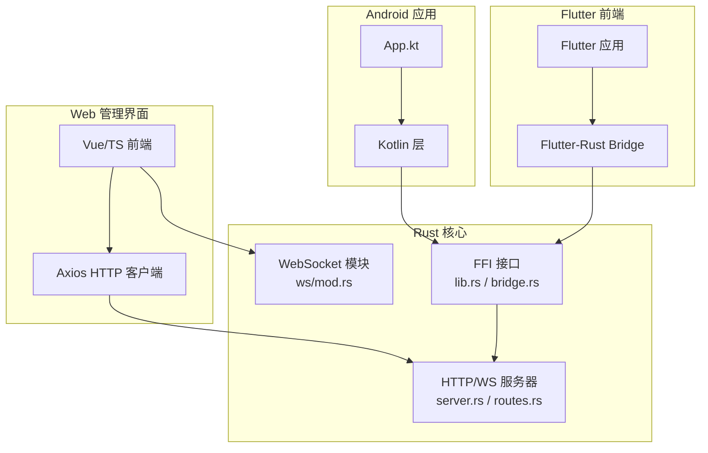
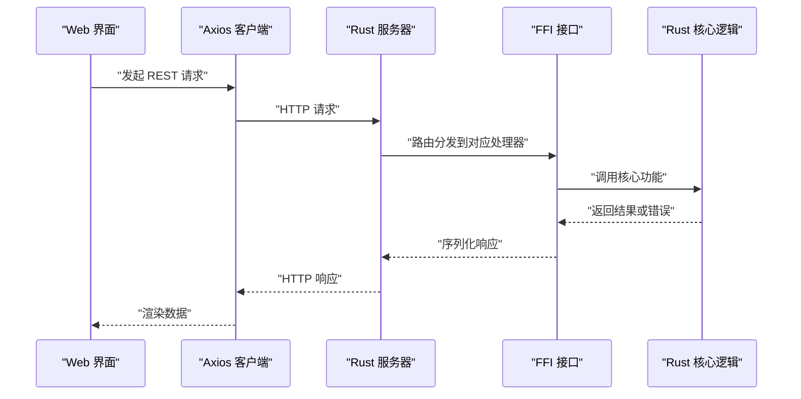
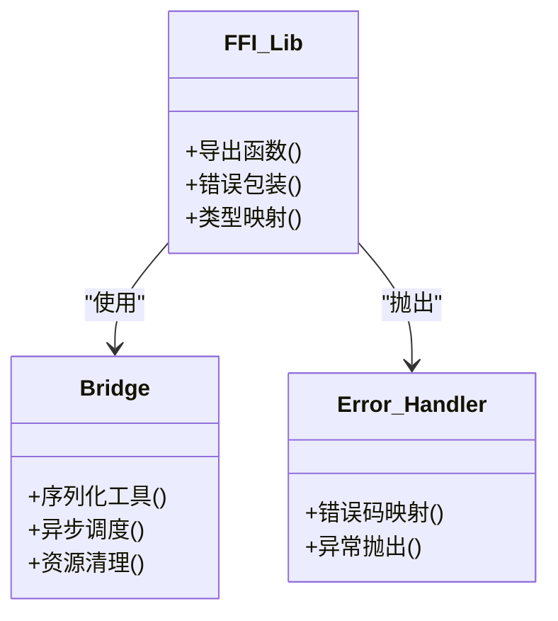
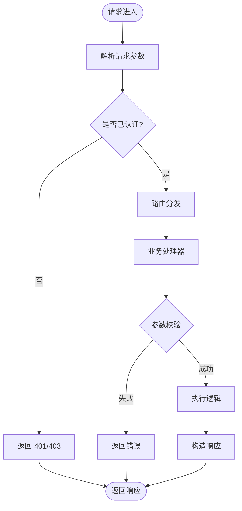
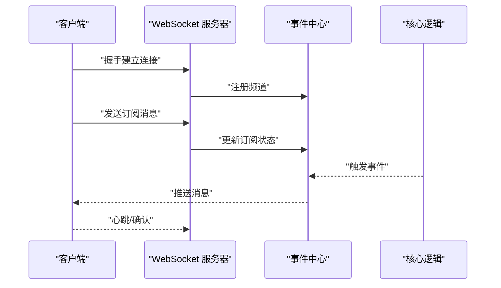
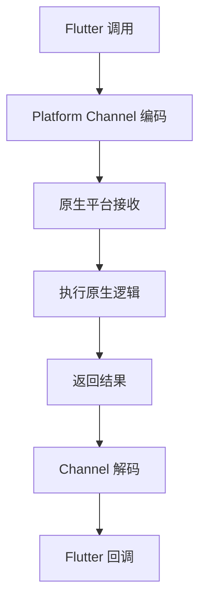
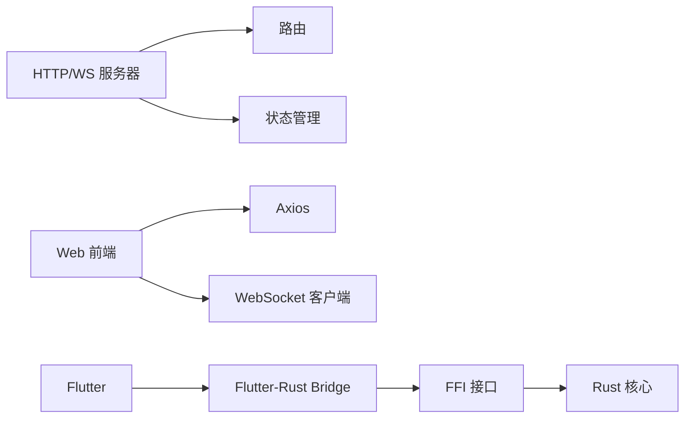

# 通信机制

<cite>
**本文引用的文件**   
- [rust/legado-ffi/src/lib.rs](file://rust/legado-ffi/src/lib.rs)
- [rust/legado-ffi/src/bridge.rs](file://rust/legado-ffi/src/bridge.rs)
- [rust/legado-ffi/src/error.rs](file://rust/legado-ffi/src/error.rs)
- [rust/legado-ffi/src/api/mod.rs](file://rust/legado-ffi/src/api/mod.rs)
- [rust/legado-server/src/server.rs](file://rust/legado-server/src/server.rs)
- [rust/legado-server/src/routes.rs](file://rust/legado-server/src/routes.rs)
- [rust/legado-server/src/state.rs](file://rust/legado-server/src/state.rs)
- [rust/legado-server/src/ws/mod.rs](file://rust/legado-server/src/ws/mod.rs)
- [app/src/main/java/io/legado/app/App.kt](file://app/src/main/java/io/legado/app/App.kt)
- [flutter_legado/pubspec.yaml](file://flutter_legado/pubspec.yaml)
- [flutter_legado/flutter_rust_bridge.yaml](file://flutter_legado/flutter_rust_bridge.yaml)
- [modules/web/src/api/axios.ts](file://modules/web/src/api/axios.ts)
- [modules/web/src/store/connectionStore.ts](file://modules/web/src/store/connectionStore.ts)
</cite>

## 目录
1. [简介](#简介)
2. [项目结构](#项目结构)
3. [核心组件](#核心组件)
4. [架构总览](#架构总览)
5. [详细组件分析](#详细组件分析)
6. [依赖关系分析](#依赖关系分析)
7. [性能考量](#性能考量)
8. [故障排查指南](#故障排查指南)
9. [结论](#结论)
10. [附录](#附录)

## 简介
本文件系统化梳理 Legado 应用的通信机制，覆盖以下关键路径：
- FFI 接口（Rust 与原生代码）：数据类型转换、内存管理、错误处理与调用流程。
- RESTful API（Web 管理界面与后端服务）：路由设计、请求响应格式、认证机制。
- WebSocket（实时通信）：连接管理、消息协议、事件处理。
- IPC 机制（进程间通信）：Android Intent、Flutter Platform Channels 等。

文档同时给出适用场景、性能特点、限制条件、安全策略、错误处理与重试机制，以及调试与监控方法，并配以流程图和消息格式示例。

## 项目结构
Legado 采用多语言、多模块协作：
- Rust 层提供高性能核心能力与网络栈，并通过 FFI 暴露给 Android/Kotlin 与 Flutter/Dart。
- Android 应用通过 Kotlin 调用 FFI，使用系统级 IPC（如 Intent）与其他组件交互。
- Flutter 前端通过 flutter_rust_bridge 与 Rust 通信，同时通过 HTTP/WebSocket 访问内置服务器。
- Web 管理界面通过 Axios 与后端 REST API 通信，并使用 WebSocket 进行实时状态同步。

图表来源
- [rust/legado-ffi/src/lib.rs](file://rust/legado-ffi/src/lib.rs)
- [rust/legado-ffi/src/bridge.rs](file://rust/legado-ffi/src/bridge.rs)
- [rust/legado-server/src/server.rs](file://rust/legado-server/src/server.rs)
- [rust/legado-server/src/routes.rs](file://rust/legado-server/src/routes.rs)
- [rust/legado-server/src/ws/mod.rs](file://rust/legado-server/src/ws/mod.rs)
- [app/src/main/java/io/legado/app/App.kt](file://app/src/main/java/io/legado/app/App.kt)
- [modules/web/src/api/axios.ts](file://modules/web/src/api/axios.ts)
- [modules/web/src/store/connectionStore.ts](file://modules/web/src/store/connectionStore.ts)

章节来源
- [rust/legado-ffi/src/lib.rs](file://rust/legado-ffi/src/lib.rs)
- [rust/legado-ffi/src/bridge.rs](file://rust/legado-ffi/src/bridge.rs)
- [rust/legado-server/src/server.rs](file://rust/legado-server/src/server.rs)
- [rust/legado-server/src/routes.rs](file://rust/legado-server/src/routes.rs)
- [rust/legado-server/src/ws/mod.rs](file://rust/legado-server/src/ws/mod.rs)
- [app/src/main/java/io/legado/app/App.kt](file://app/src/main/java/io/legado/app/App.kt)
- [modules/web/src/api/axios.ts](file://modules/web/src/api/axios.ts)
- [modules/web/src/store/connectionStore.ts](file://modules/web/src/store/connectionStore.ts)

## 核心组件
- FFI 接口层：统一暴露 Rust 能力给 Kotlin/Flutter，负责类型映射、序列化/反序列化、错误传播与生命周期管理。
- 内置 HTTP/WS 服务器：提供 RESTful API 与 WebSocket 端点，承载 Web 管理界面与外部客户端的通信。
- 连接管理与状态：集中维护服务器运行态、会话与资源清理。
- 前端通信层：Axios 封装 HTTP 请求；WebSocket 客户端管理连接、重连与事件分发。

章节来源
- [rust/legado-ffi/src/api/mod.rs](file://rust/legado-ffi/src/api/mod.rs)
- [rust/legado-server/src/state.rs](file://rust/legado-server/src/state.rs)
- [modules/web/src/api/axios.ts](file://modules/web/src/api/axios.ts)
- [modules/web/src/store/connectionStore.ts](file://modules/web/src/store/connectionStore.ts)

## 架构总览
整体通信架构围绕“Rust 核心 + 多语言绑定 + 内嵌服务”展开：
- Android/Kotlin 通过 FFI 调用 Rust，实现高性能数据处理与网络操作。
- Flutter 通过 flutter_rust_bridge 生成桥接代码，直接调用 Rust 函数。
- Web 管理界面通过 HTTP 与 WebSocket 访问 Rust 提供的服务。
- 所有跨边界数据均经过严格的类型映射与错误包装，确保稳定性与可观测性。

图表来源
- [rust/legado-server/src/routes.rs](file://rust/legado-server/src/routes.rs)
- [rust/legado-ffi/src/bridge.rs](file://rust/legado-ffi/src/bridge.rs)
- [modules/web/src/api/axios.ts](file://modules/web/src/api/axios.ts)

## 详细组件分析

### FFI 接口（Rust 与原生代码通信）
- 目标：为 Kotlin 与 Flutter 提供稳定、高效的跨语言调用入口。
- 关键点：
  - 数据类型转换：字符串、字节数组、JSON、枚举等在 Rust 与 Dart/Kotlin 之间映射。
  - 内存管理：避免跨边界拷贝大对象，必要时使用零拷贝或流式传输。
  - 错误处理：将 Rust Result/自定义错误转换为平台侧异常或错误码。
  - 生命周期：确保异步任务完成后释放资源，防止泄漏。

图表来源
- [rust/legado-ffi/src/lib.rs](file://rust/legado-ffi/src/lib.rs)
- [rust/legado-ffi/src/bridge.rs](file://rust/legado-ffi/src/bridge.rs)
- [rust/legado-ffi/src/error.rs](file://rust/legado-ffi/src/error.rs)

章节来源
- [rust/legado-ffi/src/lib.rs](file://rust/legado-ffi/src/lib.rs)
- [rust/legado-ffi/src/bridge.rs](file://rust/legado-ffi/src/bridge.rs)
- [rust/legado-ffi/src/error.rs](file://rust/legado-ffi/src/error.rs)

### RESTful API（Web 管理界面与后端服务通信）
- 目标：为 Web 管理界面提供统一的 HTTP 接口，支持资源 CRUD、配置管理、源管理等。
- 关键点：
  - 路由设计：按资源划分路由，便于扩展与维护。
  - 请求响应格式：统一 JSON 结构，包含状态码、数据体与错误信息。
  - 认证机制：基于 Token 或会话的鉴权，保护敏感接口。

图表来源
- [rust/legado-server/src/routes.rs](file://rust/legado-server/src/routes.rs)
- [rust/legado-server/src/state.rs](file://rust/legado-server/src/state.rs)

章节来源
- [rust/legado-server/src/routes.rs](file://rust/legado-server/src/routes.rs)
- [rust/legado-server/src/state.rs](file://rust/legado-server/src/state.rs)

### WebSocket（实时通信）
- 目标：为阅读进度、播放状态、下载进度等提供低延迟双向通信。
- 关键点：
  - 连接管理：建立、保活、断线重连。
  - 消息协议：定义消息类型、载荷结构与确认机制。
  - 事件处理：订阅/发布模式，支持多客户端广播。

图表来源
- [rust/legado-server/src/ws/mod.rs](file://rust/legado-server/src/ws/mod.rs)
- [rust/legado-server/src/server.rs](file://rust/legado-server/src/server.rs)

章节来源
- [rust/legado-server/src/ws/mod.rs](file://rust/legado-server/src/ws/mod.rs)
- [rust/legado-server/src/server.rs](file://rust/legado-server/src/server.rs)

### IPC 机制（进程间通信）
- Android Intent：用于启动 Activity、Service、Broadcast 等，传递结构化数据。
- Flutter Platform Channels：在 Dart 与原生平台之间传递消息与数据。
- 适用场景：
  - Intent：跨组件调用、系统级交互（如分享、安装）。
  - Platform Channels：Flutter 调用原生能力（文件系统、媒体、传感器）。

图表来源
- [flutter_legado/pubspec.yaml](file://flutter_legado/pubspec.yaml)
- [flutter_legado/flutter_rust_bridge.yaml](file://flutter_legado/flutter_rust_bridge.yaml)

章节来源
- [flutter_legado/pubspec.yaml](file://flutter_legado/pubspec.yaml)
- [flutter_legado/flutter_rust_bridge.yaml](file://flutter_legado/flutter_rust_bridge.yaml)

## 依赖关系分析
- FFI 依赖 Rust 核心库，暴露稳定的导出函数。
- 服务器依赖路由与状态管理，提供 HTTP/WS 服务。
- 前端依赖 Axios 与 WebSocket 客户端，封装网络细节。
- Flutter 依赖 flutter_rust_bridge 生成代码，简化跨语言调用。

图表来源
- [rust/legado-ffi/src/lib.rs](file://rust/legado-ffi/src/lib.rs)
- [rust/legado-server/src/routes.rs](file://rust/legado-server/src/routes.rs)
- [rust/legado-server/src/state.rs](file://rust/legado-server/src/state.rs)
- [modules/web/src/api/axios.ts](file://modules/web/src/api/axios.ts)
- [flutter_legado/flutter_rust_bridge.yaml](file://flutter_legado/flutter_rust_bridge.yaml)

章节来源
- [rust/legado-ffi/src/lib.rs](file://rust/legado-ffi/src/lib.rs)
- [rust/legado-server/src/routes.rs](file://rust/legado-server/src/routes.rs)
- [rust/legado-server/src/state.rs](file://rust/legado-server/src/state.rs)
- [modules/web/src/api/axios.ts](file://modules/web/src/api/axios.ts)
- [flutter_legado/flutter_rust_bridge.yaml](file://flutter_legado/flutter_rust_bridge.yaml)

## 性能考量
- FFI 调用开销：尽量减少跨边界数据拷贝，优先使用引用或流式传输。
- HTTP 并发：合理设置连接池与超时，避免阻塞主线程。
- WebSocket 负载：控制消息频率与大小，使用压缩与批量发送。
- 资源清理：及时释放网络连接、文件句柄与内存缓冲区。

[本节为通用指导，不直接分析具体文件]

## 故障排查指南
- FFI 问题：检查类型映射是否正确，错误码是否被正确捕获与上报。
- HTTP 问题：查看日志中的请求 URL、状态码与响应体，确认认证头是否携带。
- WebSocket 问题：监控连接状态、心跳间隔与消息丢失率。
- IPC 问题：验证 Intent 参数与 Channel 消息格式，确保两端编码一致。

章节来源
- [rust/legado-ffi/src/error.rs](file://rust/legado-ffi/src/error.rs)
- [modules/web/src/store/connectionStore.ts](file://modules/web/src/store/connectionStore.ts)

## 结论
Legado 的通信机制以 Rust 为核心，通过 FFI 与多语言生态无缝集成，结合 RESTful API 与 WebSocket 提供高效、可靠的网络能力。合理的错误处理、重试机制与安全策略保障了系统的稳定性与安全性。通过完善的调试与监控手段，可有效定位与解决通信问题。

[本节为总结性内容，不直接分析具体文件]

## 附录
- 消息格式示例（REST）：
  - 请求：{ "action": "get_chapters", "book_id": "123" }
  - 响应：{ "code": 0, "data": { "chapters": [...] }, "message": "success" }
- 消息格式示例（WebSocket）：
  - 订阅：{ "type": "subscribe", "channel": "reading_progress" }
  - 推送：{ "type": "progress", "book_id": "123", "position": 0.5 }

[本节为概念性示例，不直接分析具体文件]