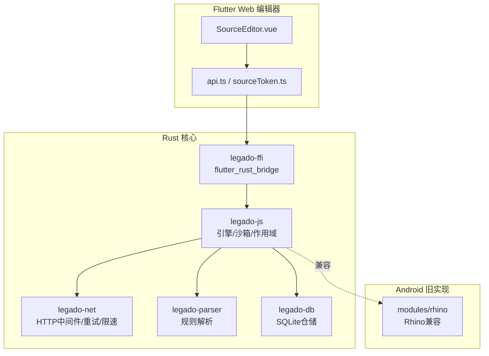
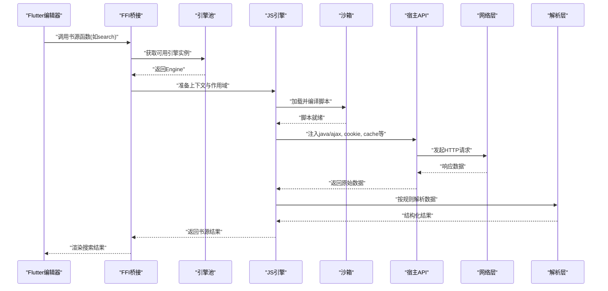
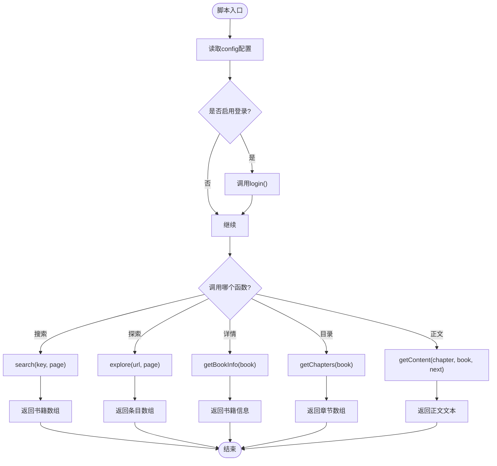
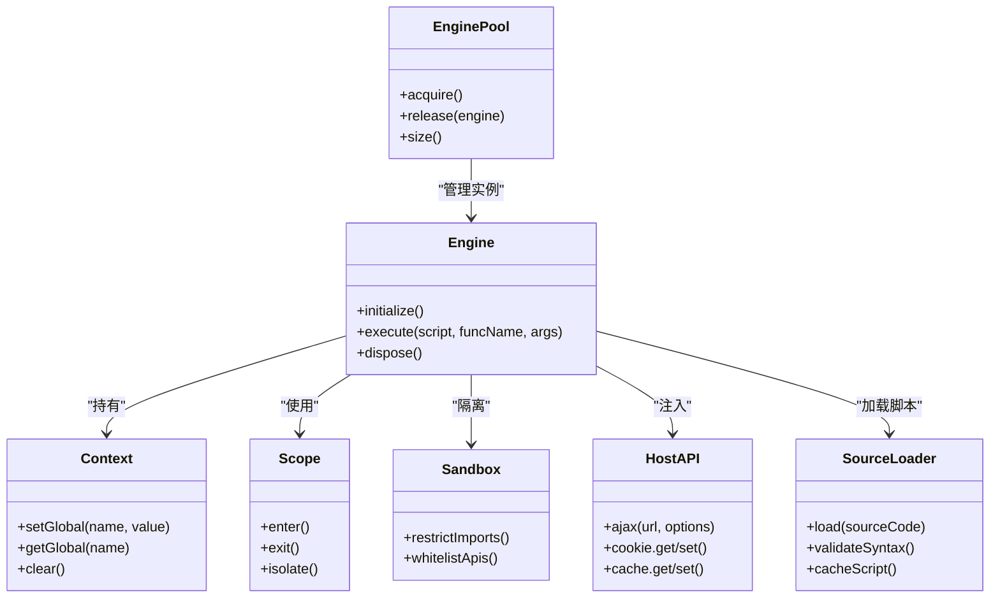
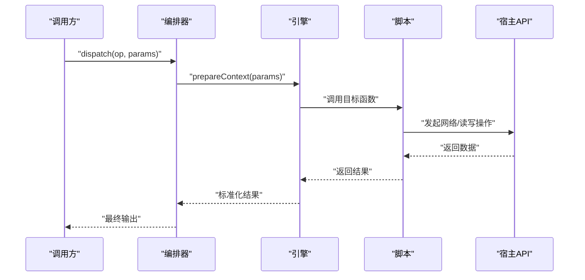
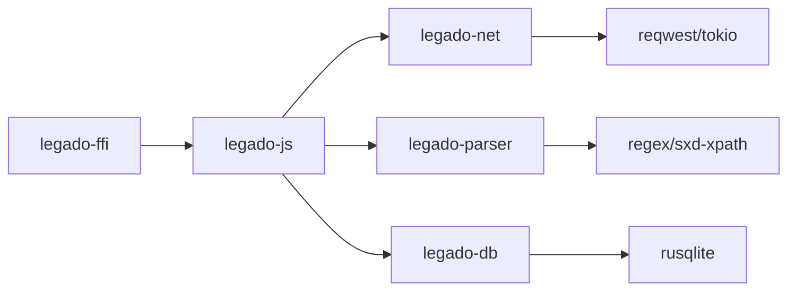

# JavaScript书源编排器

<cite>
**本文引用的文件**   
- [js_source_template.js](file://app/src/main/assets/js_source_template.js)
- [README.md](file://README.md)
- [lib.rs](file://rust/legado-js/src/lib.rs)
- [engine.rs](file://rust/legado-js/src/engine.rs)
- [engine_pool.rs](file://rust/legado-js/src/engine_pool.rs)
- [context.rs](file://rust/legado-js/src/context.rs)
- [sandbox.rs](file://rust/legado-js/src/sandbox.rs)
- [scope.rs](file://rust/legado-js/src/scope.rs)
- [source_engine.rs](file://rust/legado-js/src/source_engine.rs)
- [host_api.rs](file://rust/legado-js/src/host_api/mod.rs)
- [js_source_loader.rs](file://rust/legado-js/src/js_source/loader.rs)
- [JsEngineCapabilitiesTest.kt](file://app/src/test/java/io/legado/app/JsEngineCapabilitiesTest.kt)
- [AndroidJsTest.kt](file://app/src/androidTest/java/io/legado/app/AndroidJsTest.kt)
</cite>

## 目录
1. [简介](#简介)
2. [项目结构](#项目结构)
3. [核心组件](#核心组件)
4. [架构总览](#架构总览)
5. [详细组件分析](#详细组件分析)
6. [依赖关系分析](#依赖关系分析)
7. [性能考量](#性能考量)
8. [故障排查指南](#故障排查指南)
9. [结论](#结论)
10. [附录](#附录)

## 简介
本文件聚焦于Legado项目的“JavaScript书源编排器”，即通过JavaScript脚本定义书源行为（搜索、目录、正文等），由Rust侧的QuickJS沙箱执行，并与网络、解析、数据库等能力集成。文档从系统架构、数据流、处理逻辑、集成点与错误处理等方面展开，帮助读者理解并高效使用或扩展该能力。

## 项目结构
- Rust核心引擎包含多个crate，其中legado-js负责JavaScript运行时与书源编排：
  - 引擎生命周期管理（创建、复用、池化）
  - 上下文与作用域隔离
  - 宿主API注入（网络、缓存、Cookie等）
  - 书源脚本加载与执行
- Flutter UI层提供Web编辑器与调试工具，便于编写和验证JS书源。
- Android旧模块保留Rhino兼容层，但新架构以Rust QuickJS为主。

图表来源 
- [README.md:10-26](file://README.md#L10-L26)
- [lib.rs:1-50](file://rust/legado-js/src/lib.rs#L1-50)
- [engine.rs:1-80](file://rust/legado-js/src/engine.rs#L1-L80)
- [engine_pool.rs:1-60](file://rust/legado-js/src/engine_pool.rs#L1-L60)
- [context.rs:1-60](file://rust/legado-js/src/context.rs#L1-L60)
- [sandbox.rs:1-60](file://rust/legado-js/src/sandbox.rs#L1-L60)
- [scope.rs:1-60](file://rust/legado-js/src/scope.rs#L1-L60)
- [source_engine.rs:1-80](file://rust/legado-js/src/source_engine.rs#L1-L80)
- [host_api.rs:1-60](file://rust/legado-js/src/host_api/mod.rs#L1-L60)
- [js_source_loader.rs:1-60](file://rust/legado-js/src/js_source/loader.rs#L1-L60)

章节来源
- [README.md:10-26](file://README.md#L10-L26)

## 核心组件
- JavaScript书源模板与约定
  - 必需函数：search、getChapters、getContent
  - 可选函数：getBookInfo、explore、getReviewSummary、getReviewDetail
  - 配置对象：config（含bookSourceType、loginUi、exploreUrl等）
  - 运行时绑定：java、source、sourceApi、cookie、cache、baseUrl等
- Rust侧执行环境
  - 引擎与池：engine、engine_pool
  - 上下文与作用域：context、scope
  - 沙箱隔离：sandbox
  - 宿主API注入：host_api（网络、缓存、Cookie等）
  - 书源脚本加载：js_source/loader
  - 编排入口：source_engine（调度各函数）

章节来源
- [js_source_template.js:1-83](file://app/src/main/assets/js_source_template.js#L1-L83)
- [lib.rs:1-50](file://rust/legado-js/src/lib.rs#L1-L50)
- [engine.rs:1-80](file://rust/legado-js/src/engine.rs#L1-L80)
- [engine_pool.rs:1-60](file://rust/legado-js/src/engine_pool.rs#L1-L60)
- [context.rs:1-60](file://rust/legado-js/src/context.rs#L1-L60)
- [sandbox.rs:1-60](file://rust/legado-js/src/sandbox.rs#L1-L60)
- [scope.rs:1-60](file://rust/legado-js/src/scope.rs#L1-L60)
- [source_engine.rs:1-80](file://rust/legado-js/src/source_engine.rs#L1-L80)
- [host_api.rs:1-60](file://rust/legado-js/src/host_api/mod.rs#L1-L60)
- [js_source_loader.rs:1-60](file://rust/legado-js/src/js_source/loader.rs#L1-L60)

## 架构总览
下图展示从Flutter编辑器到Rust引擎执行JS书源的完整流程，包括请求路由、桥接、引擎初始化、脚本加载、函数调用与结果返回。

图表来源 
- [engine.rs:1-80](file://rust/legado-js/src/engine.rs#L1-L80)
- [engine_pool.rs:1-60](file://rust/legado-js/src/engine_pool.rs#L1-L60)
- [context.rs:1-60](file://rust/legado-js/src/context.rs#L1-L60)
- [sandbox.rs:1-60](file://rust/legado-js/src/sandbox.rs#L1-L60)
- [host_api.rs:1-60](file://rust/legado-js/src/host_api/mod.rs#L1-L60)
- [js_source_loader.rs:1-60](file://rust/legado-js/src/js_source/loader.rs#L1-L60)

## 详细组件分析

### JavaScript书源模板与约定
- 模板定义了书源脚本的标准结构与可调用函数，确保应用能统一调用不同来源的数据抓取逻辑。
- 关键约定：
  - search(key, page)：返回书籍列表
  - getChapters(book)：返回章节列表
  - getContent(chapter, book, nextChapterUrl)：返回正文文本
  - explore(url, page)：用于分类浏览
  - getBookInfo(book)：补充书籍信息
  - 段评相关：getReviewSummary、getReviewDetail（可选）
- 运行时绑定：
  - java.ajax：网络请求
  - source/sourceApi：兼容旧脚本的对象
  - cookie/cache/baseUrl：会话、缓存与基础URL

图表来源 
- [js_source_template.js:1-83](file://app/src/main/assets/js_source_template.js#L1-L83)

章节来源
- [js_source_template.js:1-83](file://app/src/main/assets/js_source_template.js#L1-L83)

### Rust引擎与沙箱
- 引擎生命周期：
  - engine_pool维护一组QuickJS引擎实例，避免频繁创建销毁开销
  - engine负责具体脚本执行、异常捕获与返回值封装
- 上下文与作用域：
  - context封装运行期状态（如全局变量、模块缓存）
  - scope隔离每次调用的局部环境，防止污染
- 沙箱隔离：
  - sandbox限制脚本能力边界，仅暴露必要API
- 宿主API注入：
  - host_api将网络、缓存、Cookie等能力以JS函数形式暴露给脚本
- 书源脚本加载：
  - js_source/loader负责从资源或用户输入加载脚本，并进行语法检查与缓存

图表来源 
- [engine.rs:1-80](file://rust/legado-js/src/engine.rs#L1-L80)
- [engine_pool.rs:1-60](file://rust/legado-js/src/engine_pool.rs#L1-L60)
- [context.rs:1-60](file://rust/legado-js/src/context.rs#L1-L60)
- [scope.rs:1-60](file://rust/legado-js/src/scope.rs#L1-L60)
- [sandbox.rs:1-60](file://rust/legado-js/src/sandbox.rs#L1-L60)
- [host_api.rs:1-60](file://rust/legado-js/src/host_api/mod.rs#L1-L60)
- [js_source_loader.rs:1-60](file://rust/legado-js/src/js_source/loader.rs#L1-L60)

章节来源
- [engine.rs:1-80](file://rust/legado-js/src/engine.rs#L1-L80)
- [engine_pool.rs:1-60](file://rust/legado-js/src/engine_pool.rs#L1-L60)
- [context.rs:1-60](file://rust/legado-js/src/context.rs#L1-L60)
- [sandbox.rs:1-60](file://rust/legado-js/src/sandbox.rs#L1-L60)
- [scope.rs:1-60](file://rust/legado-js/src/scope.rs#L1-L60)
- [host_api.rs:1-60](file://rust/legado-js/src/host_api/mod.rs#L1-L60)
- [js_source_loader.rs:1-60](file://rust/legado-js/src/js_source/loader.rs#L1-L60)

### 书源编排入口
- source_engine作为编排器，根据书源类型与操作类型分发到对应函数（search/explore/getBookInfo/getChapters/getContent）。
- 负责参数校验、上下文准备、异常处理与结果标准化。

图表来源 
- [source_engine.rs:1-80](file://rust/legado-js/src/source_engine.rs#L1-L80)
- [engine.rs:1-80](file://rust/legado-js/src/engine.rs#L1-L80)
- [host_api.rs:1-60](file://rust/legado-js/src/host_api/mod.rs#L1-L60)

章节来源
- [source_engine.rs:1-80](file://rust/legado-js/src/source_engine.rs#L1-L80)

## 依赖关系分析
- Rust crate间依赖：
  - legado-js依赖legado-net（网络）、legado-parser（解析）、legado-db（持久化）
  - legado-ffi为上层Flutter/Dart提供桥接接口
- 运行时依赖：
  - QuickJS引擎用于执行JS脚本
  - 宿主API提供受限能力集，保证安全与稳定

图表来源 
- [README.md:10-26](file://README.md#L10-L26)
- [lib.rs:1-50](file://rust/legado-js/src/lib.rs#L1-L50)

章节来源
- [README.md:10-26](file://README.md#L10-L26)
- [lib.rs:1-50](file://rust/legado-js/src/lib.rs#L1-L50)

## 性能考量
- 引擎池化：复用QuickJS实例，减少初始化开销
- 作用域隔离：避免全局污染导致的重复计算与内存泄漏
- 脚本缓存：对已加载脚本进行哈希缓存，提升二次执行速度
- 异步网络：通过tokio异步IO提高并发能力
- 解析优化：按需解析与增量更新，降低CPU占用

[本节为通用指导，不直接分析具体文件]

## 故障排查指南
- 常见问题定位：
  - 脚本语法错误：检查模板函数签名与返回值结构
  - 网络失败：确认java.ajax调用与超时设置
  - Cookie/缓存未生效：检查host_api注入与键名一致性
  - 权限限制：确认sandbox白名单是否包含所需API
- 测试用例参考：
  - JsEngineCapabilitiesTest：验证引擎能力与兼容性
  - AndroidJsTest：在Android环境下执行JS脚本的端到端测试

章节来源
- [JsEngineCapabilitiesTest.kt:1-100](file://app/src/test/java/io/legado/app/JsEngineCapabilitiesTest.kt#L1-L100)
- [AndroidJsTest.kt:1-100](file://app/src/androidTest/java/io/legado/app/AndroidJsTest.kt#L1-L100)

## 结论
JavaScript书源编排器通过标准化的脚本约定与安全的Rust沙箱执行环境，实现了灵活、可扩展的书源能力。结合引擎池化、作用域隔离与宿主API注入，既保证了性能与安全，又降低了开发门槛。未来可进一步丰富宿主API、增强调试工具与优化解析策略。

[本节为总结性内容，不直接分析具体文件]

## 附录
- 快速上手：
  - 基于js_source_template.js编写书源脚本
  - 使用Flutter Web编辑器进行在线调试
  - 通过FFI调用Rust引擎执行脚本
- 扩展建议：
  - 新增宿主API时，需在host_api中注册并在sandbox中放行
  - 增加错误码与日志级别，便于问题追踪
  - 引入单元测试覆盖常见书源场景

[本节为补充说明，不直接分析具体文件]