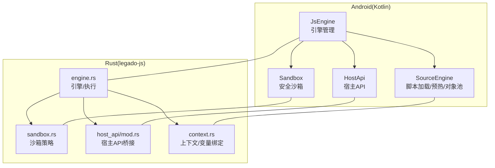
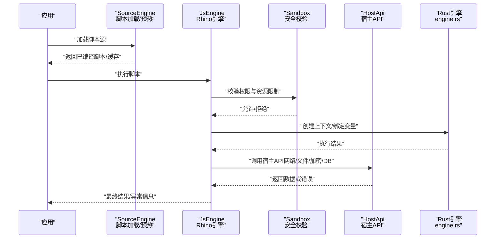
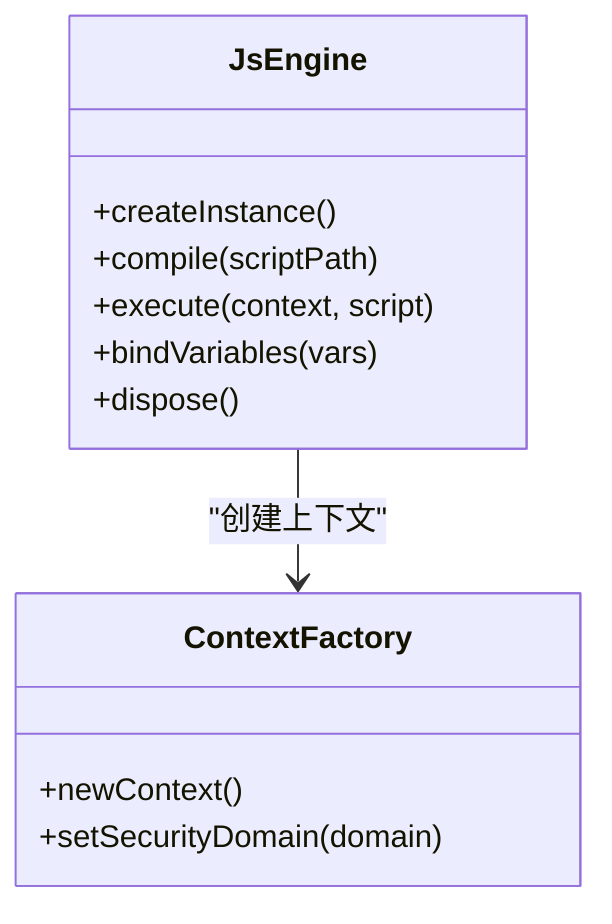
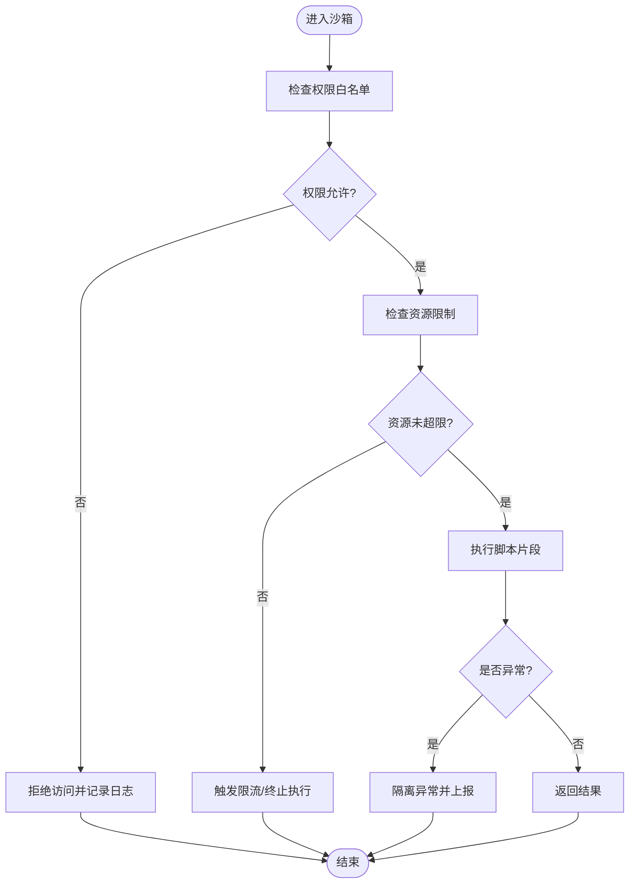
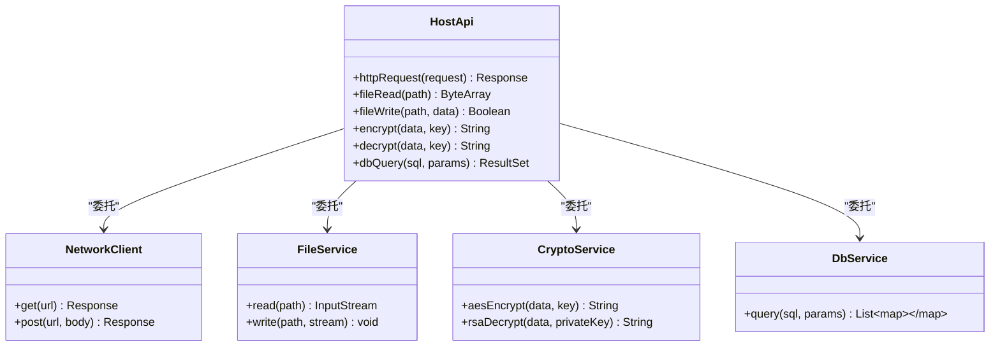
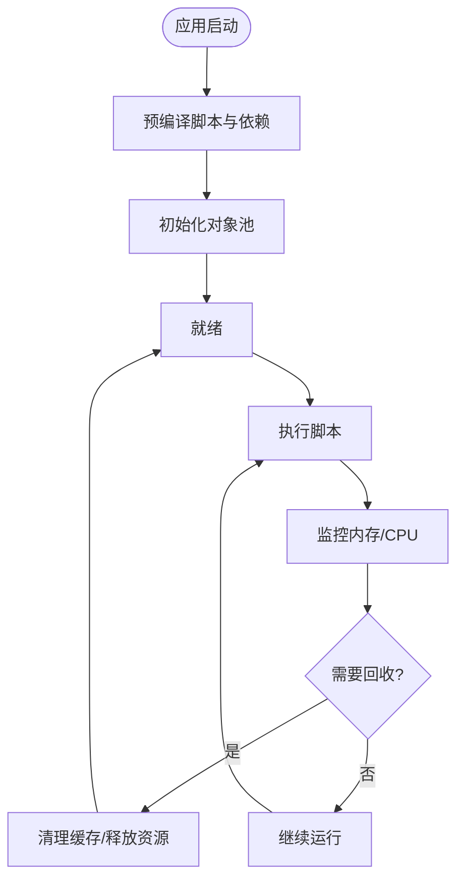
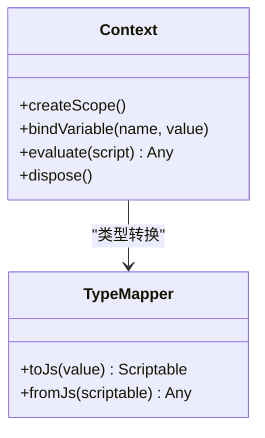
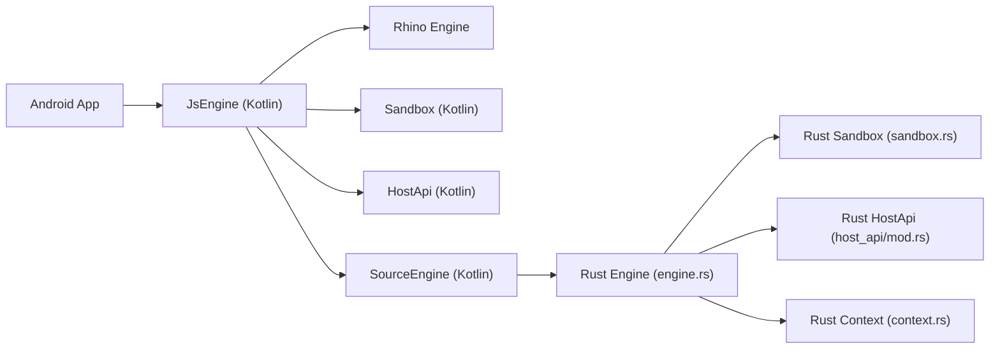

# JavaScript执行环境

<cite>
**本文引用的文件**   
- [modules/rhino/src/main/java/com/script/ScriptEngineManager.java](file://modules/rhino/src/main/java/com/script/ScriptEngineManager.java)
- [modules/rhino/src/main/java/org/htmlunit/corejs/javascript/ContextFactory.java](file://modules/rhino/src/main/java/org/htmlunit/corejs/javascript/ContextFactory.java)
- [app/src/main/java/io/legado/app/lib/js/JsEngine.kt](file://app/src/main/java/io/legado/app/lib/js/JsEngine.kt)
- [app/src/main/java/io/legado/app/lib/js/Sandbox.kt](file://app/src/main/java/io/legado/app/lib/js/Sandbox.kt)
- [app/src/main/java/io/legado/app/lib/js/HostApi.kt](file://app/src/main/java/io/legado/app/lib/js/HostApi.kt)
- [app/src/main/java/io/legado/app/lib/js/SourceEngine.kt](file://app/src/main/java/io/legado/app/lib/js/SourceEngine.kt)
- [app/src/main/assets/scripts/sample.js](file://app/src/main/assets/scripts/sample.js)
- [app/src/test/java/io/legado/app/JsTest.kt](file://app/src/test/java/io/legado/app/JsTest.kt)
- [rust/legado-js/src/engine.rs](file://rust/legado-js/src/engine.rs)
- [rust/legado-js/src/sandbox.rs](file://rust/legado-js/src/sandbox.rs)
- [rust/legado-js/src/host_api/mod.rs](file://rust/legado-js/src/host_api/mod.rs)
- [rust/legado-js/src/context.rs](file://rust/legado-js/src/context.rs)
</cite>

## 目录
1. [引言](#引言)
2. [项目结构](#项目结构)
3. [核心组件](#核心组件)
4. [架构总览](#架构总览)
5. [详细组件分析](#详细组件分析)
6. [依赖关系分析](#依赖关系分析)
7. [性能考量](#性能考量)
8. [故障排查指南](#故障排查指南)
9. [结论](#结论)
10. [附录](#附录)

## 引言
本文件面向Legado项目中JavaScript执行环境的实现与使用，重点覆盖以下方面：
- Rhino引擎集成方案：脚本加载、执行上下文、变量绑定等核心机制
- 安全沙箱：权限控制、资源限制、异常隔离
- 宿主API接口设计：网络请求、文件操作、加密解密、数据库访问等能力暴露
- 脚本生命周期管理：预热机制、对象池、内存回收等优化策略
- 调试与监控：日志记录、断点调试、性能分析
- JavaScript开发指南：API使用、最佳实践、常见问题与示例

## 项目结构
本项目在Android端通过Kotlin封装Rhino引擎，并在Rust侧提供高性能的JS引擎与沙箱实现。关键目录与职责如下：
- Android/Kotlin层（app模块）
  - JsEngine：Rhino引擎实例管理与脚本执行入口
  - Sandbox：安全沙箱配置与权限控制
  - HostApi：宿主能力暴露（网络、文件、加密、数据库等）
  - SourceEngine：脚本源加载与缓存、预热与对象池
- Rust层（legado-js模块）
  - engine.rs：引擎初始化、上下文创建、脚本编译与执行
  - sandbox.rs：沙箱策略、权限白名单、资源限制
  - host_api/mod.rs：宿主API注册与调用桥接
  - context.rs：执行上下文、变量绑定与作用域管理

**图表来源** 
- [app/src/main/java/io/legado/app/lib/js/JsEngine.kt](file://app/src/main/java/io/legado/app/lib/js/JsEngine.kt)
- [app/src/main/java/io/legado/app/lib/js/Sandbox.kt](file://app/src/main/java/io/legado/app/lib/js/Sandbox.kt)
- [app/src/main/java/io/legado/app/lib/js/HostApi.kt](file://app/src/main/java/io/legado/app/lib/js/HostApi.kt)
- [app/src/main/java/io/legado/app/lib/js/SourceEngine.kt](file://app/src/main/java/io/legado/app/lib/js/SourceEngine.kt)
- [rust/legado-js/src/engine.rs](file://rust/legado-js/src/engine.rs)
- [rust/legado-js/src/sandbox.rs](file://rust/legado-js/src/sandbox.rs)
- [rust/legado-js/src/host_api/mod.rs](file://rust/legado-js/src/host_api/mod.rs)
- [rust/legado-js/src/context.rs](file://rust/legado-js/src/context.rs)

**章节来源**
- [app/src/main/java/io/legado/app/lib/js/JsEngine.kt](file://app/src/main/java/io/legado/app/lib/js/JsEngine.kt)
- [app/src/main/java/io/legado/app/lib/js/Sandbox.kt](file://app/src/main/java/io/legado/app/lib/js/Sandbox.kt)
- [app/src/main/java/io/legado/app/lib/js/HostApi.kt](file://app/src/main/java/io/legado/app/lib/js/HostApi.kt)
- [app/src/main/java/io/legado/app/lib/js/SourceEngine.kt](file://app/src/main/java/io/legado/app/lib/js/SourceEngine.kt)
- [rust/legado-js/src/engine.rs](file://rust/legado-js/src/engine.rs)
- [rust/legado-js/src/sandbox.rs](file://rust/legado-js/src/sandbox.rs)
- [rust/legado-js/src/host_api/mod.rs](file://rust/legado-js/src/host_api/mod.rs)
- [rust/legado-js/src/context.rs](file://rust/legado-js/src/context.rs)

## 核心组件
- 引擎管理（JsEngine）
  - 负责Rhino引擎实例的创建、复用与销毁
  - 提供脚本编译、执行、上下文切换的统一入口
- 安全沙箱（Sandbox）
  - 定义可访问的类与方法白名单
  - 限制文件系统、网络、系统API的调用范围
  - 捕获并隔离脚本异常，防止影响宿主进程
- 宿主API（HostApi）
  - 将网络请求、文件读写、加密解密、数据库访问等能力以JS API形式暴露
  - 对参数进行校验与类型转换，确保跨语言调用的稳定性
- 脚本源引擎（SourceEngine）
  - 管理脚本的加载、缓存、预热与对象池
  - 支持按需加载与懒初始化，降低启动开销

**章节来源**
- [app/src/main/java/io/legado/app/lib/js/JsEngine.kt](file://app/src/main/java/io/legado/app/lib/js/JsEngine.kt)
- [app/src/main/java/io/legado/app/lib/js/Sandbox.kt](file://app/src/main/java/io/legado/app/lib/js/Sandbox.kt)
- [app/src/main/java/io/legado/app/lib/js/HostApi.kt](file://app/src/main/java/io/legado/app/lib/js/HostApi.kt)
- [app/src/main/java/io/legado/app/lib/js/SourceEngine.kt](file://app/src/main/java/io/legado/app/lib/js/SourceEngine.kt)

## 架构总览
下图展示了从脚本到宿主的完整调用链，包括引擎选择、沙箱校验、API桥接与结果返回。

**图表来源** 
- [app/src/main/java/io/legado/app/lib/js/SourceEngine.kt](file://app/src/main/java/io/legado/app/lib/js/SourceEngine.kt)
- [app/src/main/java/io/legado/app/lib/js/JsEngine.kt](file://app/src/main/java/io/legado/app/lib/js/JsEngine.kt)
- [app/src/main/java/io/legado/app/lib/js/Sandbox.kt](file://app/src/main/java/io/legado/app/lib/js/Sandbox.kt)
- [app/src/main/java/io/legado/app/lib/js/HostApi.kt](file://app/src/main/java/io/legado/app/lib/js/HostApi.kt)
- [rust/legado-js/src/engine.rs](file://rust/legado-js/src/engine.rs)

## 详细组件分析

### Rhino引擎集成（JsEngine）
- 引擎实例管理
  - 单例或多实例策略，按场景分配线程与上下文
  - 引擎预热：首次加载时预编译常用函数与库，减少冷启动延迟
- 脚本加载与执行
  - 支持从assets、本地文件或网络动态加载
  - 编译阶段进行语法检查与依赖解析
- 上下文与变量绑定
  - 为每个脚本创建独立上下文，避免状态污染
  - 支持全局变量注入与只读属性保护

**图表来源** 
- [modules/rhino/src/main/java/com/script/ScriptEngineManager.java](file://modules/rhino/src/main/java/com/script/ScriptEngineManager.java)
- [modules/rhino/src/main/java/org/htmlunit/corejs/javascript/ContextFactory.java](file://modules/rhino/src/main/java/org/htmlunit/corejs/javascript/ContextFactory.java)
- [app/src/main/java/io/legado/app/lib/js/JsEngine.kt](file://app/src/main/java/io/legado/app/lib/js/JsEngine.kt)

**章节来源**
- [app/src/main/java/io/legado/app/lib/js/JsEngine.kt](file://app/src/main/java/io/legado/app/lib/js/JsEngine.kt)
- [modules/rhino/src/main/java/com/script/ScriptEngineManager.java](file://modules/rhino/src/main/java/com/script/ScriptEngineManager.java)
- [modules/rhino/src/main/java/org/htmlunit/corejs/javascript/ContextFactory.java](file://modules/rhino/src/main/java/org/htmlunit/corejs/javascript/ContextFactory.java)

### 安全沙箱（Sandbox）
- 权限控制
  - 基于白名单的类与方法访问控制
  - 动态权限授予与撤销机制
- 资源限制
  - CPU时间片、内存上限、I/O配额
  - 网络域名白名单与协议限制
- 异常隔离
  - 捕获脚本异常并转换为宿主友好错误
  - 防止栈溢出与无限循环检测

**图表来源** 
- [app/src/main/java/io/legado/app/lib/js/Sandbox.kt](file://app/src/main/java/io/legado/app/lib/js/Sandbox.kt)
- [rust/legado-js/src/sandbox.rs](file://rust/legado-js/src/sandbox.rs)

**章节来源**
- [app/src/main/java/io/legado/app/lib/js/Sandbox.kt](file://app/src/main/java/io/legado/app/lib/js/Sandbox.kt)
- [rust/legado-js/src/sandbox.rs](file://rust/legado-js/src/sandbox.rs)

### 宿主API接口（HostApi）
- 网络请求
  - 封装HTTP客户端，支持超时、重试、代理、SSL配置
  - 统一响应格式与错误码
- 文件操作
  - 受限的文件读写API，路径白名单与大小限制
- 加密解密
  - 提供对称与非对称加密算法接口
  - 密钥管理与安全存储
- 数据库访问
  - 只读查询接口，防止写入与DDL操作
  - SQL注入防护与参数化查询

**图表来源** 
- [app/src/main/java/io/legado/app/lib/js/HostApi.kt](file://app/src/main/java/io/legado/app/lib/js/HostApi.kt)
- [rust/legado-js/src/host_api/mod.rs](file://rust/legado-js/src/host_api/mod.rs)

**章节来源**
- [app/src/main/java/io/legado/app/lib/js/HostApi.kt](file://app/src/main/java/io/legado/app/lib/js/HostApi.kt)
- [rust/legado-js/src/host_api/mod.rs](file://rust/legado-js/src/host_api/mod.rs)

### 脚本生命周期管理（SourceEngine）
- 预热机制
  - 启动时预编译高频脚本与依赖库
  - 异步加载与后台预热，不影响主流程
- 对象池
  - 复用引擎实例与上下文，减少GC压力
  - 连接池管理网络与数据库资源
- 内存回收
  - 定期清理无用对象与缓存
  - 监控内存使用并触发回收策略

**图表来源** 
- [app/src/main/java/io/legado/app/lib/js/SourceEngine.kt](file://app/src/main/java/io/legado/app/lib/js/SourceEngine.kt)
- [rust/legado-js/src/engine.rs](file://rust/legado-js/src/engine.rs)

**章节来源**
- [app/src/main/java/io/legado/app/lib/js/SourceEngine.kt](file://app/src/main/java/io/legado/app/lib/js/SourceEngine.kt)
- [rust/legado-js/src/engine.rs](file://rust/legado-js/src/engine.rs)

### 执行上下文与变量绑定（context.rs）
- 上下文隔离
  - 每个脚本拥有独立作用域，避免变量冲突
- 变量注入
  - 支持全局常量、配置项、运行时参数的注入
- 类型映射
  - Kotlin/Rust与JavaScript之间的类型自动转换

**图表来源** 
- [rust/legado-js/src/context.rs](file://rust/legado-js/src/context.rs)

**章节来源**
- [rust/legado-js/src/context.rs](file://rust/legado-js/src/context.rs)

## 依赖关系分析
- Android层依赖Rhino引擎库进行脚本解析与执行
- Rust层提供高性能引擎实现，通过FFI与Android层交互
- 沙箱策略由Kotlin与Rust共同实现，确保双重安全保障
- 宿主API通过统一的接口暴露，屏蔽底层实现差异

**图表来源** 
- [app/src/main/java/io/legado/app/lib/js/JsEngine.kt](file://app/src/main/java/io/legado/app/lib/js/JsEngine.kt)
- [app/src/main/java/io/legado/app/lib/js/Sandbox.kt](file://app/src/main/java/io/legado/app/lib/js/Sandbox.kt)
- [app/src/main/java/io/legado/app/lib/js/HostApi.kt](file://app/src/main/java/io/legado/app/lib/js/HostApi.kt)
- [app/src/main/java/io/legado/app/lib/js/SourceEngine.kt](file://app/src/main/java/io/legado/app/lib/js/SourceEngine.kt)
- [rust/legado-js/src/engine.rs](file://rust/legado-js/src/engine.rs)
- [rust/legado-js/src/sandbox.rs](file://rust/legado-js/src/sandbox.rs)
- [rust/legado-js/src/host_api/mod.rs](file://rust/legado-js/src/host_api/mod.rs)
- [rust/legado-js/src/context.rs](file://rust/legado-js/src/context.rs)

**章节来源**
- [app/src/main/java/io/legado/app/lib/js/JsEngine.kt](file://app/src/main/java/io/legado/app/lib/js/JsEngine.kt)
- [rust/legado-js/src/engine.rs](file://rust/legado-js/src/engine.rs)

## 性能考量
- 引擎预热：减少首次执行延迟，提升用户体验
- 对象池：复用引擎实例与上下文，降低GC频率
- 内存监控：实时监控内存使用，及时清理无用对象
- 异步执行：非阻塞脚本执行，避免主线程卡顿
- 资源限制：CPU与内存上限，防止恶意脚本耗尽资源

[本节为通用指导，无需特定文件引用]

## 故障排查指南
- 常见错误
  - 权限不足：检查沙箱白名单配置
  - 内存溢出：优化脚本逻辑，增加内存限制
  - 网络失败：验证域名白名单与SSL配置
- 调试工具
  - 日志记录：启用详细日志输出
  - 断点调试：IDE中设置断点跟踪执行流程
  - 性能分析：使用Profiler分析CPU与内存使用
- 测试方法
  - 单元测试：针对单个API进行覆盖测试
  - 集成测试：模拟完整脚本执行流程
  - 压力测试：高并发场景下的稳定性验证

**章节来源**
- [app/src/test/java/io/legado/app/JsTest.kt](file://app/src/test/java/io/legado/app/JsTest.kt)

## 结论
Legado项目的JavaScript执行环境通过Kotlin与Rust的双层实现，提供了高性能、高安全的脚本执行能力。Rhino引擎的集成确保了兼容性，而Rust层则带来了更好的性能与内存管理。安全沙箱机制有效保护了宿主系统，宿主API的设计使得脚本能够安全地访问系统资源。通过预热机制、对象池与内存监控等优化策略，系统在性能与稳定性之间取得了良好平衡。

[本节为总结性内容，无需特定文件引用]

## 附录

### JavaScript开发指南
- API使用规范
  - 遵循宿主API的调用约定与错误处理
  - 避免直接访问敏感系统API
- 最佳实践
  - 合理组织脚本结构，提高可维护性
  - 使用异步编程模式，避免阻塞主线程
  - 实现完善的错误处理与日志记录
- 常见问题
  - 性能问题：优化算法，减少不必要的计算
  - 内存泄漏：及时释放引用，避免循环依赖
  - 兼容性问题：注意不同平台的API差异

### 脚本示例与测试
- 基础示例
  - 网络请求：获取远程数据并解析
  - 文件操作：读取配置文件并处理
  - 加密解密：对敏感数据进行加解密
- 测试方法
  - 使用JsTest进行单元测试
  - 模拟真实场景进行集成测试
  - 编写边界条件与异常用例

**章节来源**
- [app/src/main/assets/scripts/sample.js](file://app/src/main/assets/scripts/sample.js)
- [app/src/test/java/io/legado/app/JsTest.kt](file://app/src/test/java/io/legado/app/JsTest.kt)