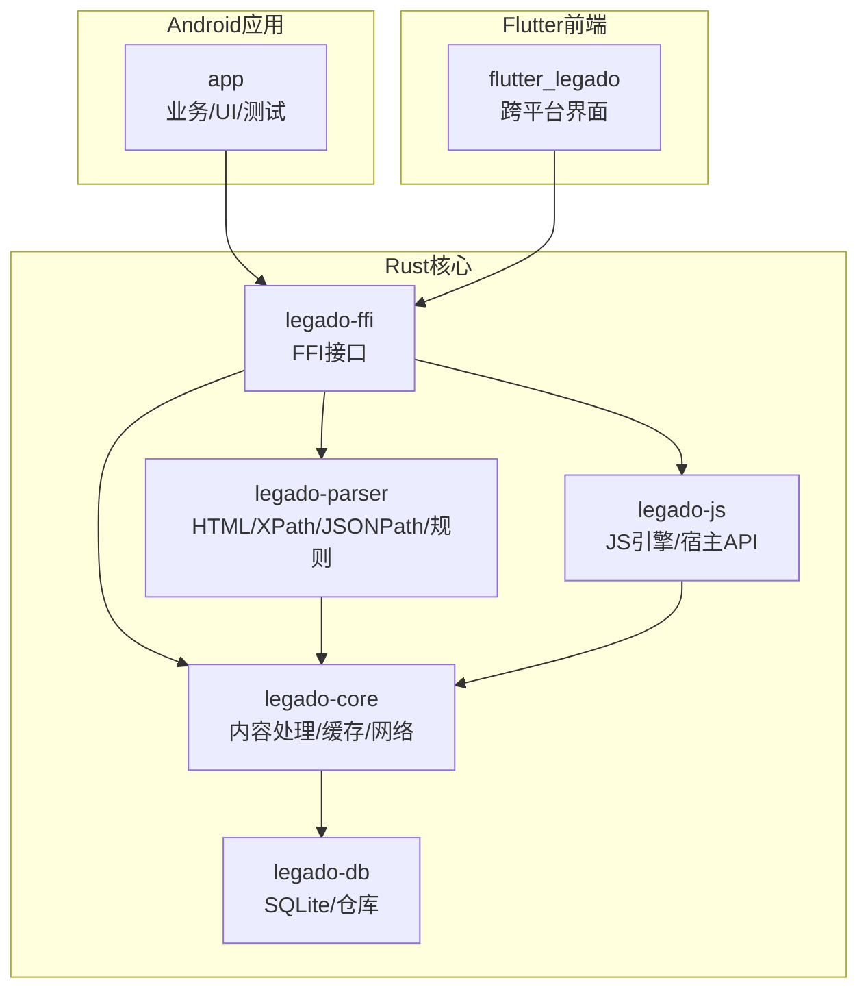
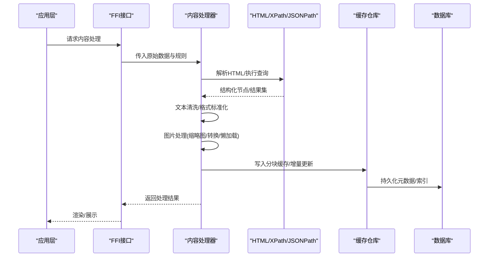
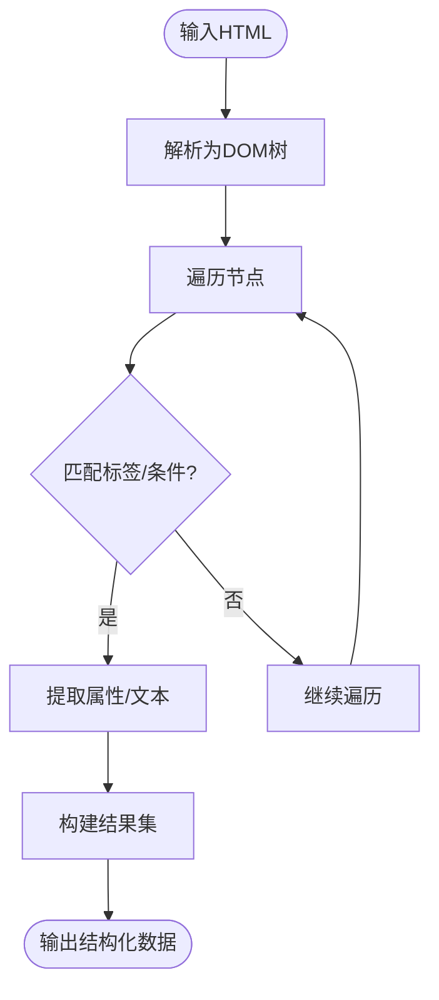
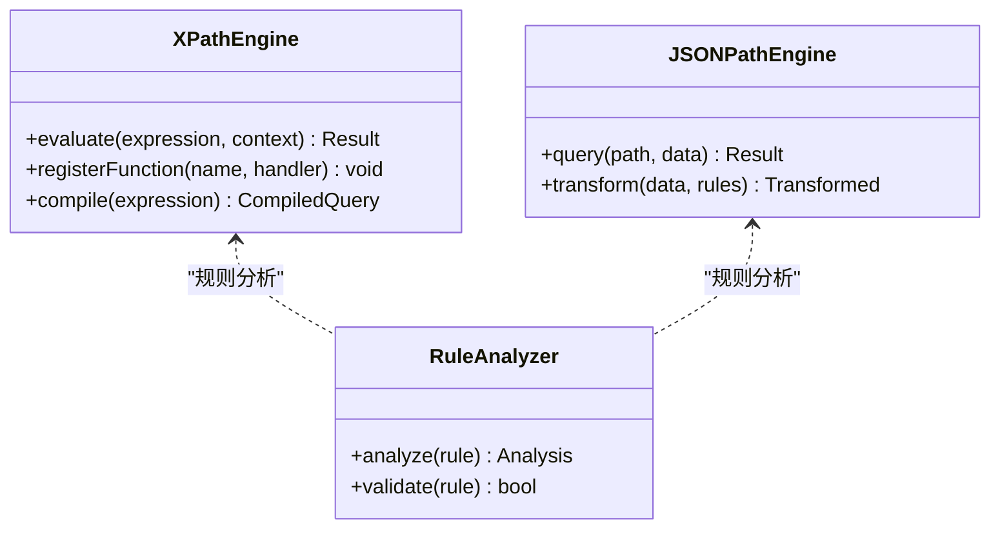
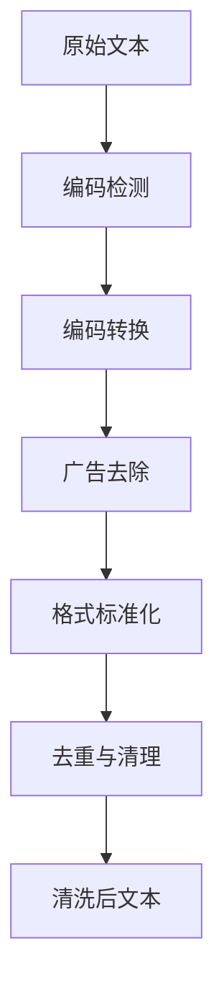
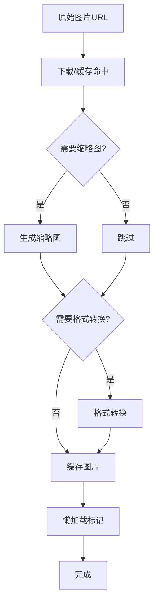
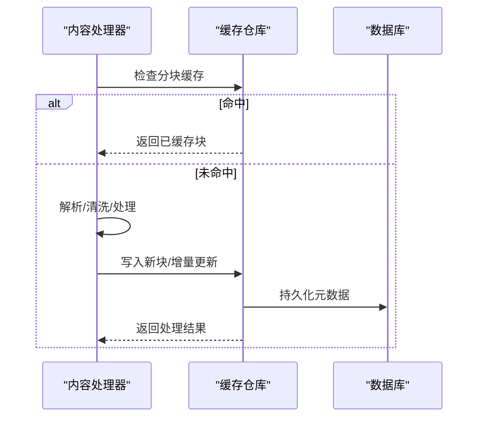
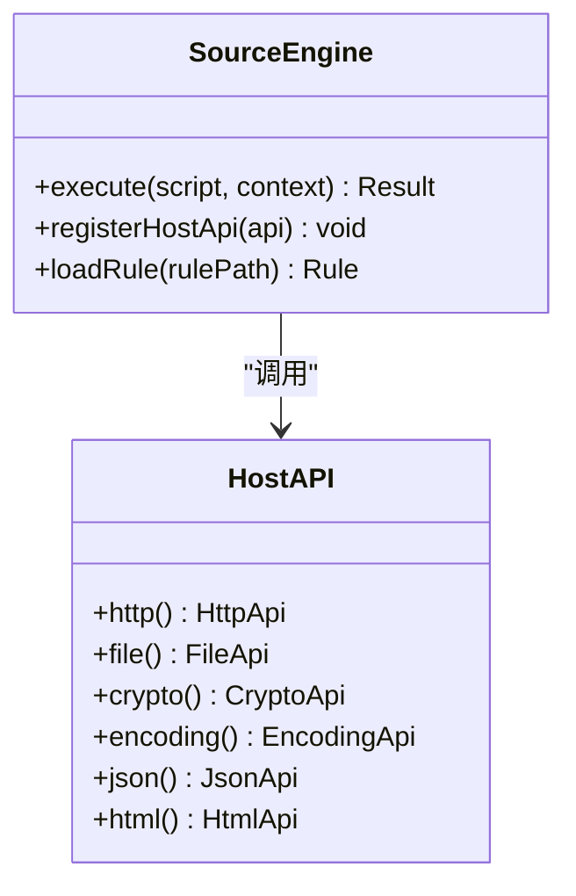
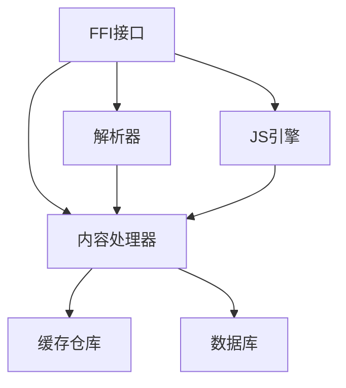

# 内容处理与清洗

<cite>
**本文引用的文件**   
- [content_processor.rs](file://rust/legado-core/src/content_processor.rs)
- [html.rs](file://rust/legado-parser/src/html.rs)
- [xpath.rs](file://rust/legado-parser/src/xpath.rs)
- [jsonpath.rs](file://rust/legado-parser/src/jsonpath.rs)
- [analyze_rule.rs](file://rust/legado-parser/src/analyze_rule.rs)
- [rule_analyzer.rs](file://rust/legado-parser/src/rule_analyzer.rs)
- [rule_complete.rs](file://rust/legado-parser/src/rule_complete.rs)
- [cache_book_repository.rs](file://rust/legado-db/src/repository/cache_book_repository.rs)
- [cache_repository.rs](file://rust/legado-db/src/repository/cache_repository.rs)
- [cache_api.rs](file://rust/legado-ffi/src/api/cache_api.rs)
- [source_engine.rs](file://rust/legado-js/src/source_engine.rs)
- [js_source](file://rust/legado-js/src/js_source)
- [HtmlFormatterTest.kt](file://app/src/test/java/io/legado/app/utils/HtmlFormatterTest.kt)
</cite>

## 目录
1. [简介](#简介)
2. [项目结构](#项目结构)
3. [核心组件](#核心组件)
4. [架构总览](#架构总览)
5. [详细组件分析](#详细组件分析)
6. [依赖关系分析](#依赖关系分析)
7. [性能考量](#性能考量)
8. [故障排查指南](#故障排查指南)
9. [结论](#结论)
10. [附录](#附录)

## 简介
本文件聚焦于Legado的内容处理与清洗子系统，围绕HTML解析、DOM树构建、标签与属性提取、XPath与JSONPath查询引擎、文本清洗算法（广告去除、格式标准化、编码转换）、图片处理机制（缩略图生成、格式转换、懒加载）、内容缓存策略（分块缓存、增量更新、失效管理）以及调试工具（解析预览、规则测试、性能分析）进行系统化说明。文档以代码级为依据，结合架构图与流程图帮助读者快速理解并高效使用相关能力。

## 项目结构
Legado在Rust层提供高性能的解析与处理能力，Kotlin/Android层负责UI与集成，Flutter用于跨平台界面。与内容处理相关的核心模块分布如下：
- Rust核心库
  - legado-core：内容处理器、缓存、网络、音频等通用能力
  - legado-parser：HTML解析、XPath/JSONPath查询、规则分析与补全
  - legado-js：JS脚本引擎与宿主API，支持动态规则与扩展
  - legado-db：SQLite持久化与仓库访问
  - legado-ffi：对外暴露的FFI接口
- Android应用
  - app：业务逻辑、UI、测试用例
- Flutter前端
  - flutter_legado：跨平台界面与桥接

图表来源
- [content_processor.rs](file://rust/legado-core/src/content_processor.rs)
- [html.rs](file://rust/legado-parser/src/html.rs)
- [xpath.rs](file://rust/legado-parser/src/xpath.rs)
- [jsonpath.rs](file://rust/legado-parser/src/jsonpath.rs)
- [cache_repository.rs](file://rust/legado-db/src/repository/cache_repository.rs)
- [cache_api.rs](file://rust/legado-ffi/src/api/cache_api.rs)

章节来源
- [content_processor.rs](file://rust/legado-core/src/content_processor.rs)
- [html.rs](file://rust/legado-parser/src/html.rs)
- [xpath.rs](file://rust/legado-parser/src/xpath.rs)
- [jsonpath.rs](file://rust/legado-parser/src/jsonpath.rs)
- [cache_repository.rs](file://rust/legado-db/src/repository/cache_repository.rs)
- [cache_api.rs](file://rust/legado-ffi/src/api/cache_api.rs)

## 核心组件
- HTML解析器与DOM构建：基于Rust实现的高性能HTML解析，支持标签提取、属性获取、节点遍历与选择。
- XPath与JSONPath查询引擎：提供路径表达式匹配、函数调用、结果过滤与聚合能力。
- 文本清洗算法：广告去除、格式标准化、编码转换、冗余清理。
- 图片处理机制：缩略图生成、格式转换、懒加载优化。
- 内容缓存策略：分块缓存、增量更新、失效管理与TTL控制。
- JS扩展与规则引擎：通过JS脚本驱动解析规则与清洗流程，便于动态配置与热更新。
- 调试工具：解析预览、规则测试、性能分析辅助。

章节来源
- [content_processor.rs](file://rust/legado-core/src/content_processor.rs)
- [html.rs](file://rust/legado-parser/src/html.rs)
- [xpath.rs](file://rust/legado-parser/src/xpath.rs)
- [jsonpath.rs](file://rust/legado-parser/src/jsonpath.rs)
- [analyze_rule.rs](file://rust/legado-parser/src/analyze_rule.rs)
- [rule_analyzer.rs](file://rust/legado-parser/src/rule_analyzer.rs)
- [rule_complete.rs](file://rust/legado-parser/src/rule_complete.rs)
- [cache_book_repository.rs](file://rust/legado-db/src/repository/cache_book_repository.rs)
- [cache_repository.rs](file://rust/legado-db/src/repository/cache_repository.rs)
- [cache_api.rs](file://rust/legado-ffi/src/api/cache_api.rs)
- [source_engine.rs](file://rust/legado-js/src/source_engine.rs)
- [js_source](file://rust/legado-js/src/js_source)
- [HtmlFormatterTest.kt](file://app/src/test/java/io/legado/app/utils/HtmlFormatterTest.kt)

## 架构总览
内容处理的整体流程从网络响应或本地数据开始，经过HTML解析、XPath/JSONPath查询、文本清洗、图片处理，最终进入缓存与展示层。JS引擎允许在关键阶段注入自定义规则与处理逻辑。

图表来源
- [content_processor.rs](file://rust/legado-core/src/content_processor.rs)
- [html.rs](file://rust/legado-parser/src/html.rs)
- [xpath.rs](file://rust/legado-parser/src/xpath.rs)
- [jsonpath.rs](file://rust/legado-parser/src/jsonpath.rs)
- [cache_repository.rs](file://rust/legado-db/src/repository/cache_repository.rs)
- [cache_api.rs](file://rust/legado-ffi/src/api/cache_api.rs)

## 详细组件分析

### HTML解析器与DOM构建
- DOM树构建：将原始HTML字符串解析为可遍历的节点树，支持父子关系、兄弟节点与属性映射。
- 标签提取：按标签名、层级、上下文条件筛选目标节点集合。
- 属性获取：读取节点属性值，支持默认值与类型转换。
- 选择器与遍历：提供基础选择能力，配合XPath进行复杂定位。

图表来源
- [html.rs](file://rust/legado-parser/src/html.rs)

章节来源
- [html.rs](file://rust/legado-parser/src/html.rs)

### XPath与JSONPath查询引擎
- 路径表达式：支持层级、属性、文本匹配与条件过滤。
- 函数调用：内置常用函数（如字符串处理、数值计算、日期格式化）。
- 结果过滤：支持分页、排序、去重与聚合。
- JSONPath：对JSON数据进行路径式查询与变换。

图表来源
- [xpath.rs](file://rust/legado-parser/src/xpath.rs)
- [jsonpath.rs](file://rust/legado-parser/src/jsonpath.rs)
- [rule_analyzer.rs](file://rust/legado-parser/src/rule_analyzer.rs)

章节来源
- [xpath.rs](file://rust/legado-parser/src/xpath.rs)
- [jsonpath.rs](file://rust/legado-parser/src/jsonpath.rs)
- [analyze_rule.rs](file://rust/legado-parser/src/analyze_rule.rs)
- [rule_analyzer.rs](file://rust/legado-parser/src/rule_analyzer.rs)
- [rule_complete.rs](file://rust/legado-parser/src/rule_complete.rs)

### 文本清洗算法
- 广告去除：基于规则与模式识别移除广告区块与无关元素。
- 格式标准化：统一换行、空格、标点与段落结构。
- 编码转换：自动检测并转换为UTF-8，处理常见乱码场景。
- 冗余清理：删除空节点、重复内容与无意义样式。

图表来源
- [content_processor.rs](file://rust/legado-core/src/content_processor.rs)

章节来源
- [content_processor.rs](file://rust/legado-core/src/content_processor.rs)

### 图片处理机制
- 缩略图生成：根据尺寸与质量参数生成缩略图，提升加载速度。
- 格式转换：支持常见图片格式的互转与压缩。
- 懒加载：按需加载图片资源，减少初始带宽占用。
- 缓存策略：本地缓存缩略图与转换结果，避免重复计算。

图表来源
- [content_processor.rs](file://rust/legado-core/src/content_processor.rs)

章节来源
- [content_processor.rs](file://rust/legado-core/src/content_processor.rs)

### 内容缓存策略
- 分块缓存：将大内容拆分为小块缓存，提高局部更新效率。
- 增量更新：仅更新变化的部分，减少IO与CPU开销。
- 失效管理：基于TTL与版本号控制缓存有效性。
- 持久化：通过SQLite存储元数据与索引，支持快速检索。

图表来源
- [cache_repository.rs](file://rust/legado-db/src/repository/cache_repository.rs)
- [cache_book_repository.rs](file://rust/legado-db/src/repository/cache_book_repository.rs)
- [cache_api.rs](file://rust/legado-ffi/src/api/cache_api.rs)

章节来源
- [cache_repository.rs](file://rust/legado-db/src/repository/cache_repository.rs)
- [cache_book_repository.rs](file://rust/legado-db/src/repository/cache_book_repository.rs)
- [cache_api.rs](file://rust/legado-ffi/src/api/cache_api.rs)

### JS扩展与规则引擎
- 脚本引擎：Rhino/Node兼容环境，支持动态加载与执行JS规则。
- 宿主API：提供HTTP、文件、加密、编码、JSON、HTML格式化等能力。
- 规则驱动：通过JS定义解析、清洗、转换规则，灵活适配不同站点。

图表来源
- [source_engine.rs](file://rust/legado-js/src/source_engine.rs)
- [js_source](file://rust/legado-js/src/js_source)

章节来源
- [source_engine.rs](file://rust/legado-js/src/source_engine.rs)
- [js_source](file://rust/legado-js/src/js_source)

### 调试工具与最佳实践
- 解析预览：可视化DOM树与查询结果，辅助定位问题。
- 规则测试：在线验证XPath/JSONPath表达式与清洗规则。
- 性能分析：监控解析耗时、内存占用与缓存命中率。
- 最佳实践：合理拆分规则、避免过度正则、优先使用选择器；利用缓存与懒加载提升体验。

章节来源
- [HtmlFormatterTest.kt](file://app/src/test/java/io/legado/app/utils/HtmlFormatterTest.kt)

## 依赖关系分析
内容处理子系统各模块间存在清晰的依赖关系：FFI作为对外接口，协调核心处理器、解析器与缓存；JS引擎提供扩展能力；数据库负责持久化。

图表来源
- [cache_api.rs](file://rust/legado-ffi/src/api/cache_api.rs)
- [content_processor.rs](file://rust/legado-core/src/content_processor.rs)
- [html.rs](file://rust/legado-parser/src/html.rs)
- [source_engine.rs](file://rust/legado-js/src/source_engine.rs)
- [cache_repository.rs](file://rust/legado-db/src/repository/cache_repository.rs)

章节来源
- [cache_api.rs](file://rust/legado-ffi/src/api/cache_api.rs)
- [content_processor.rs](file://rust/legado-core/src/content_processor.rs)
- [html.rs](file://rust/legado-parser/src/html.rs)
- [source_engine.rs](file://rust/legado-js/src/source_engine.rs)
- [cache_repository.rs](file://rust/legado-db/src/repository/cache_repository.rs)

## 性能考量
- 解析性能：采用Rust实现的高性能HTML解析，避免GC抖动。
- 查询优化：编译XPath/JSONPath表达式，复用查询计划。
- 缓存命中：分块缓存与增量更新降低IO压力。
- 图片优化：缩略图与懒加载减少带宽与内存占用。
- 并发控制：限制并行任务数，避免资源竞争。

[本节为通用指导，不直接分析具体文件]

## 故障排查指南
- 解析失败：检查HTML完整性与编码，确认选择器与XPath表达式正确性。
- 查询结果为空：验证上下文节点与过滤条件，逐步缩小范围定位。
- 清洗异常：查看规则日志，确认广告模式与格式规范是否覆盖全面。
- 缓存不一致：检查TTL与版本号，必要时强制刷新与重建索引。
- 性能瓶颈：监控CPU与内存，优化规则复杂度与缓存策略。

章节来源
- [content_processor.rs](file://rust/legado-core/src/content_processor.rs)
- [html.rs](file://rust/legado-parser/src/html.rs)
- [xpath.rs](file://rust/legado-parser/src/xpath.rs)
- [jsonpath.rs](file://rust/legado-parser/src/jsonpath.rs)
- [cache_repository.rs](file://rust/legado-db/src/repository/cache_repository.rs)

## 结论
Legado的内容处理与清洗子系统以Rust为核心，结合JS扩展与SQLite缓存，提供了高性能、可扩展且易于调试的能力。通过合理的规则设计与优化策略，能够有效应对多样化的网页结构与内容需求，提升用户体验与系统稳定性。

[本节为总结性内容，不直接分析具体文件]

## 附录
- 示例流程：从网络抓取到展示的全链路示例，涵盖解析、清洗、缓存与渲染。
- 规则模板：提供常用XPath/JSONPath与清洗规则的模板，便于快速上手。
- 性能基准：不同规模内容的处理时间与资源消耗参考。

[本节为补充信息，不直接分析具体文件]