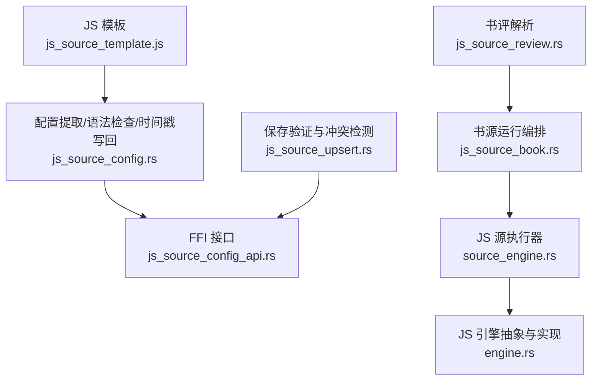
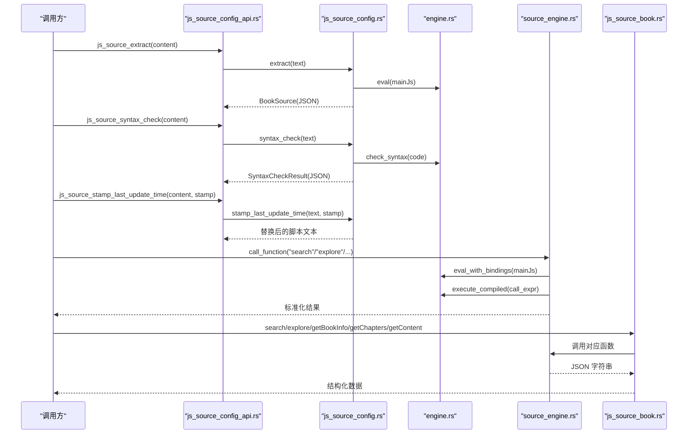
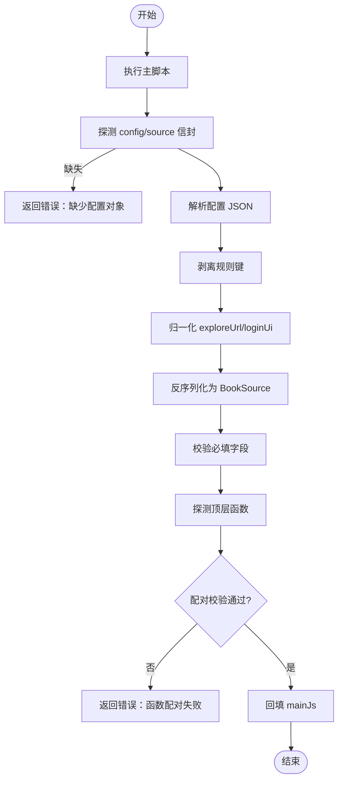
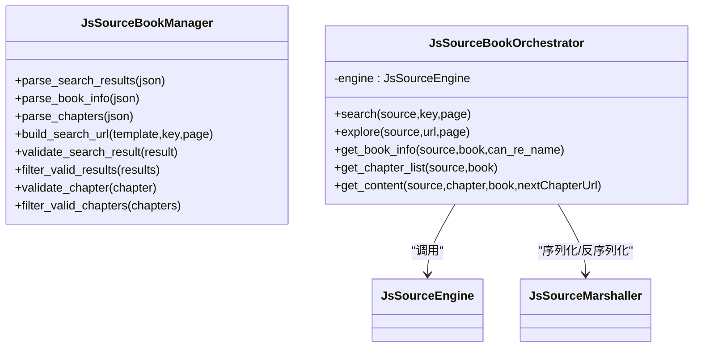
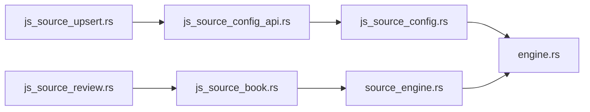

# JavaScript源配置管理

<cite>
**本文引用的文件**   
- [js_source_template.js](file://app/src/main/assets/js_source_template.js)
- [mod.rs](file://rust/legado-js/src/js_source/mod.rs)
- [js_source_config.rs](file://rust/legado-js/src/js_source/js_source_config.rs)
- [js_source_book.rs](file://rust/legado-js/src/js_source/js_source_book.rs)
- [js_source_upsert.rs](file://rust/legado-js/src/js_source/js_source_upsert.rs)
- [js_source_review.rs](file://rust/legado-js/src/js_source/js_source_review.rs)
- [engine.rs](file://rust/legado-js/src/engine.rs)
- [source_engine.rs](file://rust/legado-js/src/source_engine.rs)
- [js_source_config_api.rs](file://rust/legado-ffi/src/api/js_source_config_api.rs)
</cite>

## 目录
1. [简介](#简介)
2. [项目结构](#项目结构)
3. [核心组件](#核心组件)
4. [架构总览](#架构总览)
5. [详细组件分析](#详细组件分析)
6. [依赖关系分析](#依赖关系分析)
7. [性能考量](#性能考量)
8. [故障排查指南](#故障排查指南)
9. [结论](#结论)
10. [附录](#附录)

## 简介
本文件面向 Legado 项目的“JavaScript 单文件书源”配置与执行体系，系统性梳理从脚本模板、配置提取、语法检查、时间戳写回，到运行时调用（搜索/发现/详情/目录/正文）与保存校验的完整链路。文档以代码级为依据，配合架构图与流程图帮助读者快速理解并高效排错。

## 项目结构
JS 源配置管理由三部分组成：
- 前端模板与资源：提供 JS 单文件书源模板，定义必需/可选函数与配置字段约定。
- Rust 实现层：负责在沙箱中执行 JS、提取配置、语法检查、时间戳写回、数据编解码与编排调用。
- FFI 暴露层：对外暴露统一的 JSON 接口供上层调用。

**图表来源** 
- [js_source_template.js:1-91](file://app/src/main/assets/js_source_template.js#L1-L91)
- [js_source_config.rs:1-120](file://rust/legado-js/src/js_source/js_source_config.rs#L1-L120)
- [js_source_config_api.rs:1-40](file://rust/legado-ffi/src/api/js_source_config_api.rs#L1-L40)
- [js_source_book.rs:1-120](file://rust/legado-js/src/js_source/js_source_book.rs#L1-L120)
- [source_engine.rs:1-120](file://rust/legado-js/src/source_engine.rs#L1-L120)
- [engine.rs:1-120](file://rust/legado-js/src/engine.rs#L1-L120)
- [js_source_upsert.rs:1-80](file://rust/legado-js/src/js_source/js_source_upsert.rs#L1-L80)
- [js_source_review.rs:1-60](file://rust/legado-js/src/js_source/js_source_review.rs#L1-L60)

**章节来源**
- [js_source_template.js:1-91](file://app/src/main/assets/js_source_template.js#L1-L91)
- [mod.rs:1-17](file://rust/legado-js/src/js_source/mod.rs#L1-L17)

## 核心组件
- 模板与约定：定义顶层 config/source、必备函数（search/getChapters/getContent）、可选函数（getBookInfo/explore/loginUi+loginAction、段评 getReviewSummary/getReviewDetail）。
- 配置提取与校验：在沙箱中执行脚本，提取并归一化配置，校验必备字段与函数配对，剥离规则键，回填 mainJs。
- 语法检查：QuickJS 只编译不执行；未启用时降级为括号平衡基础检查。
- 时间戳写回：定位 lastUpdateTime 的值位置并替换为新时间戳。
- 运行编排：封装 search/explore/getBookInfo/getChapters/getContent 调用，统一序列化/反序列化与错误处理。
- 保存验证：载荷大小、JSON 合法性、必要字段校验、冲突检测与用户状态合并。
- 书评解析：摘要与详情分页解析，嵌套回复扁平化，相对 URL 解析。
- 引擎抽象：JsEngine trait + QuickJsEngine 实现，支持超时中断、内存限制、绑定注入与脚本缓存。

**章节来源**
- [js_source_config.rs:1-120](file://rust/legado-js/src/js_source/js_source_config.rs#L1-L120)
- [js_source_book.rs:1-120](file://rust/legado-js/src/js_source/js_source_book.rs#L1-L120)
- [js_source_upsert.rs:1-120](file://rust/legado-js/src/js_source/js_source_upsert.rs#L1-L120)
- [js_source_review.rs:1-120](file://rust/legado-js/src/js_source/js_source_review.rs#L1-L120)
- [engine.rs:1-200](file://rust/legado-js/src/engine.rs#L1-L200)
- [source_engine.rs:1-120](file://rust/legado-js/src/source_engine.rs#L1-L120)

## 架构总览
下图展示从 FFI 入口到 JS 引擎执行的端到端流程，以及配置提取、语法检查与时间戳写回的分支路径。

**图表来源** 
- [js_source_config_api.rs:1-40](file://rust/legado-ffi/src/api/js_source_config_api.rs#L1-L40)
- [js_source_config.rs:60-290](file://rust/legado-js/src/js_source/js_source_config.rs#L60-L290)
- [engine.rs:420-480](file://rust/legado-js/src/engine.rs#L420-L480)
- [source_engine.rs:230-330](file://rust/legado-js/src/source_engine.rs#L230-L330)
- [js_source_book.rs:130-296](file://rust/legado-js/src/js_source/js_source_book.rs#L130-L296)

## 详细组件分析

### 配置提取与校验（js_source_config.rs）
- 能力
  - extract：在沙箱中执行脚本，探测顶层 config/source，剥离规则键，归一化 exploreUrl/loginUi，反序列化为 BookSource，校验必备字段与函数配对，回填 mainJs。
  - syntax_check：QuickJS 只编译不执行；未启用 feature 时进行括号平衡基础检查。
  - stamp_last_update_time：精准定位 lastUpdateTime 的数字字面量或 Date.now() 调用并替换为新时间戳。
- 关键约束
  - 必备函数：普通源 search/getChapters/getContent；文件类源 search/getBookInfo。
  - exploreUrl 与 explore 函数必须成对存在。
  - loginUi 函数与 config.loginUi 二选一，且需配对 loginAction。
  - 段评函数 getReviewSummary 与 getReviewDetail 必须成对声明。
- 复杂度与性能
  - extract 包含一次脚本 eval、两次表达式 eval（配置信封与函数探测），整体 O(脚本长度)。
  - stamp_last_update_time 采用字节级扫描，跳过注释与字符串，线性扫描。

**图表来源** 
- [js_source_config.rs:60-290](file://rust/legado-js/src/js_source/js_source_config.rs#L60-L290)

**章节来源**
- [js_source_config.rs:1-120](file://rust/legado-js/src/js_source/js_source_config.rs#L1-L120)
- [js_source_config.rs:290-362](file://rust/legado-js/src/js_source/js_source_config.rs#L290-L362)
- [js_source_config.rs:365-485](file://rust/legado-js/src/js_source/js_source_config.rs#L365-L485)
- [js_source_config.rs:488-710](file://rust/legado-js/src/js_source/js_source_config.rs#L488-L710)

### 书源运行编排（js_source_book.rs）
- 能力
  - search/explore：调用 JS 函数，解析搜索结果数组。
  - getBookInfo：可选函数，缺失则沿用搜索字段；tocUrl 为空回退 bookUrl。
  - getChapters：解析目录数组，空目录抛出 TocEmpty。
  - getContent：解析正文，空正文抛出 ContentEmpty；卷章直通优化。
- 数据流
  - 参数以 JsValue 绑定传入，返回值经 Marshaller 规范化后转为结构化类型。

**图表来源** 
- [js_source_book.rs:1-120](file://rust/legado-js/src/js_source/js_source_book.rs#L1-L120)
- [js_source_book.rs:120-296](file://rust/legado-js/src/js_source/js_source_book.rs#L120-L296)

**章节来源**
- [js_source_book.rs:1-120](file://rust/legado-js/src/js_source/js_source_book.rs#L1-L120)
- [js_source_book.rs:120-296](file://rust/legado-js/src/js_source/js_source_book.rs#L120-L296)

### 保存验证与冲突检测（js_source_upsert.rs）
- 能力
  - validate_payload：空内容与过大内容拦截。
  - validate：JSON 合法性、必要字段（bookSourceUrl/bookSourceName/mainJs）校验与警告。
  - detect_conflict：按 bookSourceUrl 检测冲突，必要时提示名称冲突。
  - merge_user_state：保留用户自定义设置（enabled/enabledExplore/customOrder/weight/respondTime/bookSourceGroup）。
- 适用场景
  - 导入/编辑/批量更新前进行前置校验，避免脏数据入库。

**章节来源**
- [js_source_upsert.rs:1-120](file://rust/legado-js/src/js_source/js_source_upsert.rs#L1-L120)
- [js_source_upsert.rs:120-240](file://rust/legado-js/src/js_source/js_source_upsert.rs#L120-L240)

### 书评解析（js_source_review.rs）
- 能力
  - parse_reviews：列表解析。
  - parse_review_summary：摘要统计过滤（paraIndex=-1 或 >0 且 count>0）。
  - parse_detail_page：详情分页解析，嵌套回复扁平化，相对 URL 解析。
- 数据结构
  - ReviewSummary：counts(keys) 与 keys(paraData) 映射。
  - ReviewDetailPage：items 与 nextPageUrl。

**章节来源**
- [js_source_review.rs:1-120](file://rust/legado-js/src/js_source/js_source_review.rs#L1-L120)
- [js_source_review.rs:120-224](file://rust/legado-js/src/js_source/js_source_review.rs#L120-L224)

### 引擎抽象与实现（engine.rs）
- 能力
  - JsEngine trait：eval、eval_with_bindings、compile、execute_compiled、execute_compiled_with_bindings。
  - QuickJsEngine：内存限制、超时中断、宿主 API 注册、沙箱隔离、语法检查（只编译不执行）。
  - StubJsEngine：未启用 quickjs 时的占位实现，所有调用返回错误提示。
- 关键点
  - 超时中断基于 interrupt handler，使用固定 epoch 计算绝对 deadline。
  - 语法检查通过 Function 构造器仅编译函数体，避免执行风险。

**章节来源**
- [engine.rs:1-200](file://rust/legado-js/src/engine.rs#L1-L200)
- [engine.rs:210-480](file://rust/legado-js/src/engine.rs#L210-L480)

### 源执行器（source_engine.rs）
- 能力
  - 构建作用域：注入 baseUrl 与用户参数，首次调用 eval mainJs，后续复用。
  - 调用表达式：按函数名与参数名生成调用表达式，编译并执行。
  - 池化模式：通过 EnginePool 共享引擎实例，减少创建开销。
  - 结果归一化：null/undefined 转 None，其他字符串保留。
- 性能
  - mainJs 求值缓存与脚本编译缓存降低重复开销。

**章节来源**
- [source_engine.rs:1-120](file://rust/legado-js/src/source_engine.rs#L1-L120)
- [source_engine.rs:230-330](file://rust/legado-js/src/source_engine.rs#L230-L330)
- [source_engine.rs:330-368](file://rust/legado-js/src/source_engine.rs#L330-L368)

### FFI 接口（js_source_config_api.rs）
- 暴露方法
  - js_source_extract：返回 BookSource JSON。
  - js_source_syntax_check：返回 SyntaxCheckResult JSON。
  - js_source_stamp_last_update_time：返回替换后的脚本文本（无替换点返回空串）。

**章节来源**
- [js_source_config_api.rs:1-40](file://rust/legado-ffi/src/api/js_source_config_api.rs#L1-L40)

## 依赖关系分析
- 模块内聚与耦合
  - js_source_config.rs 依赖 engine.rs 的 QuickJsEngine 进行脚本执行与语法检查。
  - js_source_book.rs 依赖 source_engine.rs 进行函数调用编排。
  - js_source_upsert.rs 与 js_source_review.rs 为纯数据处理模块，低耦合。
  - FFI 层仅依赖 js_source_config.rs 的能力，保持薄封装。
- 外部依赖
  - serde_json：JSON 序列化/反序列化。
  - rquickjs：QuickJS 绑定，提供执行与语法检查能力。

**图表来源** 
- [js_source_config_api.rs:1-40](file://rust/legado-ffi/src/api/js_source_config_api.rs#L1-L40)
- [js_source_config.rs:1-120](file://rust/legado-js/src/js_source/js_source_config.rs#L1-L120)
- [engine.rs:1-120](file://rust/legado-js/src/engine.rs#L1-L120)
- [js_source_book.rs:1-120](file://rust/legado-js/src/js_source/js_source_book.rs#L1-L120)
- [source_engine.rs:1-120](file://rust/legado-js/src/source_engine.rs#L1-L120)
- [js_source_upsert.rs:1-80](file://rust/legado-js/src/js_source/js_source_upsert.rs#L1-L80)
- [js_source_review.rs:1-60](file://rust/legado-js/src/js_source/js_source_review.rs#L1-L60)

**章节来源**
- [mod.rs:1-17](file://rust/legado-js/src/js_source/mod.rs#L1-L17)

## 性能考量
- 脚本执行
  - mainJs 求值仅一次，后续复用；调用表达式编译缓存避免重复编译。
  - 池化模式共享引擎实例，减少上下文创建成本。
- 语法检查
  - 只编译不执行，独立上下文避免沙箱影响。
- 超时与内存
  - 超时中断基于 interrupt handler，确保长时间运行被及时终止。
  - 内存限制防止恶意脚本耗尽资源。
- I/O 与序列化
  - 大量 JSON 转换集中在编排层，便于集中优化与监控。

[本节为通用指导，无需引用具体文件]

## 故障排查指南
- 常见错误与定位
  - “缺少顶层 config 配置对象”：确认脚本是否定义了 config 或兼容的 source。
  - “缺少必备函数”：检查 search/getChapters/getContent（或文件类的 getBookInfo）是否声明。
  - “exploreUrl 与 explore 函数配对失败”：二者必须同时存在。
  - “loginUi 与 login 函数配对失败”：二者必须同时存在，或与 loginUi 函数互斥。
  - “段评函数配对失败”：getReviewSummary 与 getReviewDetail 必须成对。
  - “目录为空/正文为空”：检查 JS 函数返回值是否为空数组或空字符串。
  - “语法检查失败”：查看 message 中的行号线索，修正语法错误。
- 调试建议
  - 使用 js_source_syntax_check 提前验证脚本语法。
  - 使用 js_source_extract 输出 BookSource 校验配置是否正确。
  - 在 source_engine 中打印 call_expression 与 bindings，确认参数传递。
  - 开启超时与内存限制测试，确保异常路径可恢复。

**章节来源**
- [js_source_config.rs:60-290](file://rust/legado-js/src/js_source/js_source_config.rs#L60-L290)
- [js_source_book.rs:120-296](file://rust/legado-js/src/js_source/js_source_book.rs#L120-L296)
- [engine.rs:420-480](file://rust/legado-js/src/engine.rs#L420-L480)

## 结论
Legado 的 JS 单文件书源体系通过严格的配置提取与校验、安全的沙箱执行、完善的运行时编排与保存验证，实现了可扩展、可维护、高性能的书源生态。开发者应遵循模板约定与函数配对规则，利用语法检查与提取工具提升开发效率，并通过超时与内存限制保障系统稳定性。

[本节为总结性内容，无需引用具体文件]

## 附录
- 模板要点
  - 顶层 config/source 必须包含 bookSourceUrl 与 bookSourceName。
  - 必备函数与可选函数的职责与返回值约定参见模板。
- 最佳实践
  - 优先使用 exploreUrl 与 explore 函数实现分类发现。
  - 合理使用 loginUi 与 login 函数实现动态登录。
  - 段评功能按需启用，保证 summary/detail 成对。
  - 保存前进行 validate 与 detect_conflict，避免冲突与无效数据。

[本节为补充信息，无需引用具体文件]