# 源管理与配置

<cite>
**本文引用的文件**
- [book_source.rs](file://rust/legado-core/src/models/book_source.rs)
- [rss_source.rs](file://rust/legado-core/src/models/rss_source.rs)
- [book_source_repository.rs](file://rust/legado-db/src/repository/book_source_repository.rs)
- [rss_source_repository.rs](file://rust/legado-db/src/repository/rss_source_repository.rs)
- [source.rs](file://rust/legado-ffi/src/api/source.rs)
- [source_checker.rs](file://rust/legado-net/src/source_checker.rs)
- [source_check_api.rs](file://rust/legado-ffi/src/api/source_check_api.rs)
- [config_api.rs](file://rust/legado-ffi/src/api/config_api.rs)
- [rule_analyzer.rs](file://rust/legado-parser/src/rule_analyzer.rs)
- [analyze_rule.rs](file://rust/legado-parser/src/analyze_rule.rs)
- [import.rs](file://rust/legado-db/src/import.rs)
- [schema.rs](file://rust/legado-db/src/schema.rs)
- [SourceEditor.vue](file://modules/web/src/views/SourceEditor.vue)
- [SourceJson.vue](file://modules/web/src/components/SourceJson.vue)
- [SourceList.vue](file://modules/web/src/components/SourceList.vue)
- [sourceStore.ts](file://modules/web/src/store/sourceStore.ts)
- [bookSourceEditConfig.ts](file://modules/web/src/config/bookSourceEditConfig.ts)
- [js_source_template.js](file://app/src/main/assets/js_source_template.js)
- [source_notifier.dart](file://flutter_legado/lib/src/providers/source/source_notifier.dart)
- [source_state.dart](file://flutter_legado/lib/src/providers/source/source_state.dart)
</cite>

## 更新摘要
**所做更改**
- 新增持久化配置存储功能，支持源检查参数的持久化保存和恢复
- 增强源检查器配置系统，支持超时设置和步骤特定开关的灵活配置
- 实现优雅降级处理机制，确保配置缺失时的默认行为
- 扩展配置管理API，提供完整的配置CRUD操作接口
- 更新验证机制章节，详细说明新的配置持久化和回退处理逻辑

## 目录
1. [简介](#简介)
2. [项目结构](#项目结构)
3. [核心组件](#核心组件)
4. [架构总览](#架构总览)
5. [详细组件分析](#详细组件分析)
6. [Flutter批量操作功能](#flutter批量操作功能)
7. [依赖关系分析](#依赖关系分析)
8. [性能考量](#性能考量)
9. [故障排查指南](#故障排查指南)
10. [结论](#结论)
11. [附录](#附录)

## 简介
本文件聚焦"源"（书籍源、RSS源等）在 Legado 中的实体模型、CRUD 操作、验证机制、导入导出、分组与排序，以及调试工具与管理最佳实践。文档面向开发者与维护者，兼顾非技术读者可理解性，提供从高层架构到代码级细节的完整说明。

**更新** 新增了持久化配置存储功能，支持源检查参数的持久化保存和恢复，包括超时设置、步骤特定开关等配置项的灵活管理和优雅降级处理机制。同时增强了Flutter Legado应用的完整批量操作功能，包括持久化底部导航栏、高级选择管理、12种批量操作（启用/禁用、添加/移除分组、切换发现功能、移动源、导出/分享、验证、范围选择等），以及增强的状态管理和视觉反馈系统。

## 项目结构
Legado 的源管理涉及多语言与多模块：
- Rust 核心层：定义数据模型、数据库访问、网络校验、规则解析等
- FFI 桥接层：对外暴露 API（如 source.rs）
- Web 前端：提供源的编辑、列表、JSON 视图与交互
- Flutter 移动端：实现完整的批量操作功能和现代化UI体验
- Android 资源：包含 JS 源模板与默认数据

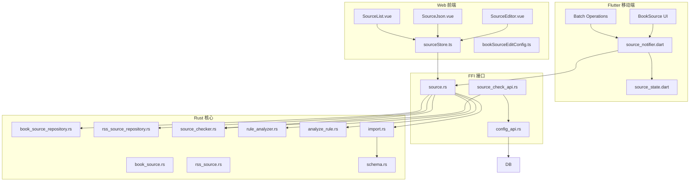

**图表来源** 
- [SourceEditor.vue](file://modules/web/src/views/SourceEditor.vue)
- [SourceJson.vue](file://modules/web/src/components/SourceJson.vue)
- [SourceList.vue](file://modules/web/src/components/SourceList.vue)
- [sourceStore.ts](file://modules/web/src/store/sourceStore.ts)
- [bookSourceEditConfig.ts](file://modules/web/src/config/bookSourceEditConfig.ts)
- [source_notifier.dart](file://flutter_legado/lib/src/providers/source/source_notifier.dart)
- [source_state.dart](file://flutter_legado/lib/src/providers/source/source_state.dart)
- [source.rs](file://rust/legado-ffi/src/api/source.rs)
- [source_check_api.rs](file://rust/legado-ffi/src/api/source_check_api.rs)
- [config_api.rs](file://rust/legado-ffi/src/api/config_api.rs)
- [book_source.rs](file://rust/legado-core/src/models/book_source.rs)
- [rss_source.rs](file://rust/legado-core/src/models/rss_source.rs)
- [book_source_repository.rs](file://rust/legado-db/src/repository/book_source_repository.rs)
- [rss_source_repository.rs](file://rust/legado-db/src/repository/rss_source_repository.rs)
- [source_checker.rs](file://rust/legado-net/src/source_checker.rs)
- [rule_analyzer.rs](file://rust/legado-parser/src/rule_analyzer.rs)
- [analyze_rule.rs](file://rust/legado-parser/src/analyze_rule.rs)
- [import.rs](file://rust/legado-db/src/import.rs)
- [schema.rs](file://rust/legado-db/src/schema.rs)

**章节来源**
- [book_source.rs](file://rust/legado-core/src/models/book_source.rs)
- [rss_source.rs](file://rust/legado-core/src/models/rss_source.rs)
- [book_source_repository.rs](file://rust/legado-db/src/repository/book_source_repository.rs)
- [rss_source_repository.rs](file://rust/legado-db/src/repository/rss_source_repository.rs)
- [source.rs](file://rust/legado-ffi/src/api/source.rs)
- [source_checker.rs](file://rust/legado-net/src/source_checker.rs)
- [source_check_api.rs](file://rust/legado-ffi/src/api/source_check_api.rs)
- [config_api.rs](file://rust/legado-ffi/src/api/config_api.rs)
- [rule_analyzer.rs](file://rust/legado-parser/src/rule_analyzer.rs)
- [analyze_rule.rs](file://rust/legado-parser/src/analyze_rule.rs)
- [import.rs](file://rust/legado-db/src/import.rs)
- [schema.rs](file://rust/legado-db/src/schema.rs)
- [SourceEditor.vue](file://modules/web/src/views/SourceEditor.vue)
- [SourceJson.vue](file://modules/web/src/components/SourceJson.vue)
- [SourceList.vue](file://modules/web/src/components/SourceList.vue)
- [sourceStore.ts](file://modules/web/src/store/sourceStore.ts)
- [bookSourceEditConfig.ts](file://modules/web/src/config/bookSourceEditConfig.ts)
- [js_source_template.js](file://app/src/main/assets/js_source_template.js)
- [source_notifier.dart](file://flutter_legado/lib/src/providers/source/source_notifier.dart)
- [source_state.dart](file://flutter_legado/lib/src/providers/source/source_state.dart)

## 核心组件
- 数据模型
  - 书籍源模型：定义基本信息（名称、URL、编码、请求头）、解析规则（搜索、列表、详情、目录、正文）、配置项（超时、重试、代理、Cookie、JS 引擎开关等）
  - RSS 源模型：定义标题、链接、描述、条目字段映射、更新策略等
- 仓库层
  - 书籍源仓库：实现 CRUD、批量导入导出、按分组/优先级查询
  - RSS 源仓库：实现 CRUD、批量导入导出、订阅状态管理
- 校验与分析
  - 源检查器：网络连通性、响应格式、关键字段存在性
  - 规则分析器：语法检查、XPath/JSONPath/正则表达式有效性、依赖检测
- 导入导出
  - 统一导入流程：JSON 解析、冲突解决（覆盖/跳过/合并）、批量事务
- 前端编辑器
  - SourceEditor：可视化编辑表单、实时预览、规则测试
  - SourceJson：直接编辑 JSON 配置、语法高亮、错误提示
  - SourceList：列表展示、分组筛选、排序、批量操作
- **新增** 持久化配置存储
  - 配置管理API：提供配置的CRUD操作接口
  - 配置DTO：支持可选字段的灵活配置
  - 优雅降级：配置缺失时自动使用默认值
- **新增** Flutter批量操作组件
  - SourceNotifier：Riverpod状态管理，处理所有批量操作逻辑
  - SourceState：不可变状态管理，支持批量模式和选择状态
  - 批量操作管理器：支持12种不同的批量操作类型

**章节来源**
- [book_source.rs](file://rust/legado-core/src/models/book_source.rs)
- [rss_source.rs](file://rust/legado-core/src/models/rss_source.rs)
- [book_source_repository.rs](file://rust/legado-db/src/repository/book_source_repository.rs)
- [rss_source_repository.rs](file://rust/legado-db/src/repository/rss_source_repository.rs)
- [source_checker.rs](file://rust/legado-net/src/source_checker.rs)
- [source_check_api.rs](file://rust/legado-ffi/src/api/source_check_api.rs)
- [config_api.rs](file://rust/legado-ffi/src/api/config_api.rs)
- [rule_analyzer.rs](file://rust/legado-parser/src/rule_analyzer.rs)
- [analyze_rule.rs](file://rust/legado-parser/src/analyze_rule.rs)
- [import.rs](file://rust/legado-db/src/import.rs)
- [SourceEditor.vue](file://modules/web/src/views/SourceEditor.vue)
- [SourceJson.vue](file://modules/web/src/components/SourceJson.vue)
- [SourceList.vue](file://modules/web/src/components/SourceList.vue)
- [sourceStore.ts](file://modules/web/src/store/sourceStore.ts)
- [bookSourceEditConfig.ts](file://modules/web/src/config/bookSourceEditConfig.ts)
- [source_notifier.dart](file://flutter_legado/lib/src/providers/source/source_notifier.dart)
- [source_state.dart](file://flutter_legado/lib/src/providers/source/source_state.dart)

## 架构总览
源管理的端到端流程如下：
- 前端通过 store 调用 FFI 接口进行源的增删改查、导入导出、校验与测试
- Flutter 应用通过 Riverpod 状态管理处理批量操作和用户交互
- FFI 层将请求路由至对应仓库或工具模块
- 仓库层负责持久化与事务处理
- 校验与分析模块确保规则与网络行为正确性
- 导入模块处理批量数据与冲突策略
- **新增** 配置存储模块提供持久化的检查参数管理

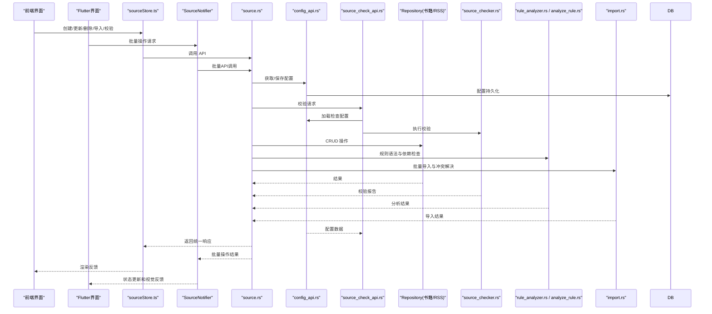

**图表来源** 
- [sourceStore.ts](file://modules/web/src/store/sourceStore.ts)
- [source_notifier.dart](file://flutter_legado/lib/src/providers/source/source_notifier.dart)
- [source_state.dart](file://flutter_legado/lib/src/providers/source/source_state.dart)
- [source.rs](file://rust/legado-ffi/src/api/source.rs)
- [source_check_api.rs](file://rust/legado-ffi/src/api/source_check_api.rs)
- [config_api.rs](file://rust/legado-ffi/src/api/config_api.rs)
- [book_source_repository.rs](file://rust/legado-db/src/repository/book_source_repository.rs)
- [rss_source_repository.rs](file://rust/legado-db/src/repository/rss_source_repository.rs)
- [source_checker.rs](file://rust/legado-net/src/source_checker.rs)
- [rule_analyzer.rs](file://rust/legado-parser/src/rule_analyzer.rs)
- [analyze_rule.rs](file://rust/legado-parser/src/analyze_rule.rs)
- [import.rs](file://rust/legado-db/src/import.rs)

## 详细组件分析

### 数据模型设计（书籍源与 RSS 源）
- 书籍源实体
  - 基本信息：名称、标识、类型、版本、描述、作者、语言、状态
  - 网络配置：基础 URL、请求头、超时、重试、代理、SSL 设置
  - 解析规则：搜索 URL、列表选择器、详情选择器、目录选择器、正文选择器、分页规则
  - 高级选项：JS 引擎开关、脚本路径、缓存策略、并发限制
- RSS 源实体
  - 基本信息：标题、链接、描述、图标
  - 条目映射：标题、链接、时间、内容、分类、作者
  - 更新策略：间隔、增量更新、去重规则

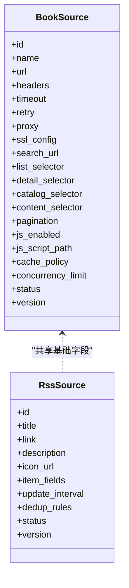

**图表来源** 
- [book_source.rs](file://rust/legado-core/src/models/book_source.rs)
- [rss_source.rs](file://rust/legado-core/src/models/rss_source.rs)

**章节来源**
- [book_source.rs](file://rust/legado-core/src/models/book_source.rs)
- [rss_source.rs](file://rust/legado-core/src/models/rss_source.rs)

### CRUD 操作（数据库层）
- 创建：插入新记录，生成唯一标识，初始化默认值
- 读取：按 ID、名称、分组、状态、优先级查询；支持分页与排序
- 更新：字段级更新与全量替换；支持事务回滚
- 删除：软删除与硬删除；级联清理关联数据
- 批量：批量插入/更新/删除；失败回滚与部分成功策略

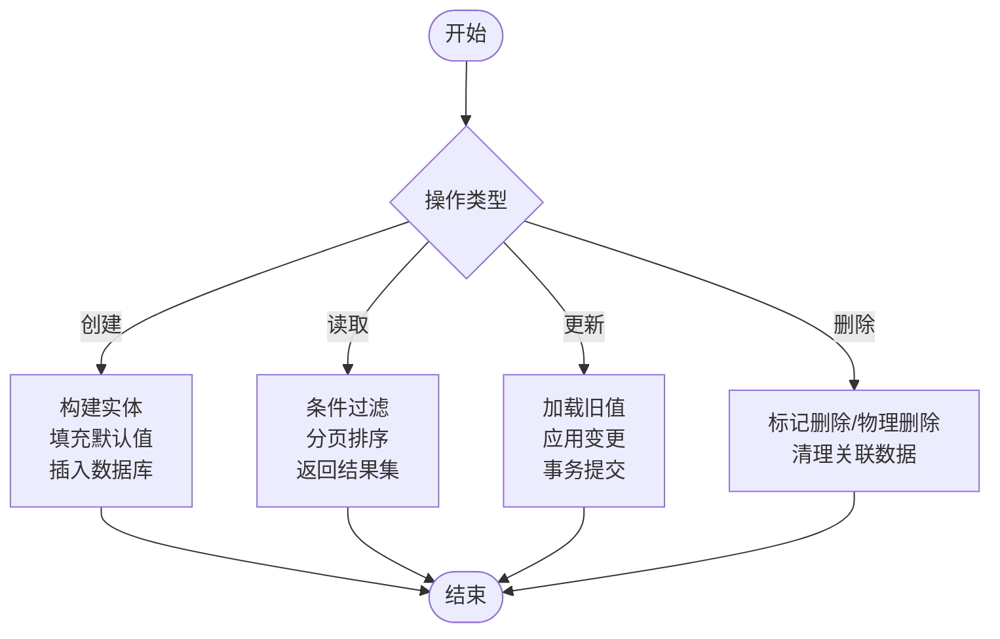

**图表来源** 
- [book_source_repository.rs](file://rust/legado-db/src/repository/book_source_repository.rs)
- [rss_source_repository.rs](file://rust/legado-db/src/repository/rss_source_repository.rs)

**章节来源**
- [book_source_repository.rs](file://rust/legado-db/src/repository/book_source_repository.rs)
- [rss_source_repository.rs](file://rust/legado-db/src/repository/rss_source_repository.rs)

### 验证机制（规则检查、语法验证、依赖检测）
- 规则检查
  - 必填字段校验：名称、URL、关键选择器
  - 格式校验：URL 模板、JSONPath/XPath/正则表达式语法
  - 依赖检测：跨字段引用、外部脚本依赖、网络可达性
- 网络校验
  - 连接测试：HTTP 状态码、响应体长度、关键字段存在
  - 性能基线：延迟阈值、重试成功率
- 静态分析
  - 规则复杂度评估：选择器深度、正则回溯风险
  - 安全扫描：禁止危险函数、注入防护
- **新增** 持久化配置验证
  - 配置完整性检查：验证必需的配置项是否存在
  - 配置格式验证：确保配置数据的格式正确性
  - 优雅降级处理：配置缺失时使用默认值继续执行

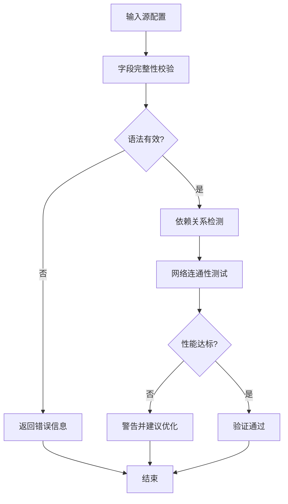

**图表来源** 
- [source_checker.rs](file://rust/legado-net/src/source_checker.rs)
- [source_check_api.rs](file://rust/legado-ffi/src/api/source_check_api.rs)
- [config_api.rs](file://rust/legado-ffi/src/api/config_api.rs)
- [rule_analyzer.rs](file://rust/legado-parser/src/rule_analyzer.rs)
- [analyze_rule.rs](file://rust/legado-parser/src/analyze_rule.rs)

**章节来源**
- [source_checker.rs](file://rust/legado-net/src/source_checker.rs)
- [source_check_api.rs](file://rust/legado-ffi/src/api/source_check_api.rs)
- [config_api.rs](file://rust/legado-ffi/src/api/config_api.rs)
- [rule_analyzer.rs](file://rust/legado-parser/src/rule_analyzer.rs)
- [analyze_rule.rs](file://rust/legado-parser/src/analyze_rule.rs)

### 导入导出（JSON 格式、批量操作、冲突解决）
- 导入流程
  - 解析 JSON 配置，转换为内部模型
  - 冲突检测：同名源、重复 URL、版本差异
  - 冲突策略：覆盖、跳过、合并（保留用户修改）
  - 批量事务：全部成功或全部回滚
- 导出流程
  - 序列化模型为 JSON，包含元数据与注释
  - 支持选择性导出（仅启用源、特定分组）
  - 导出校验：生成后二次解析验证

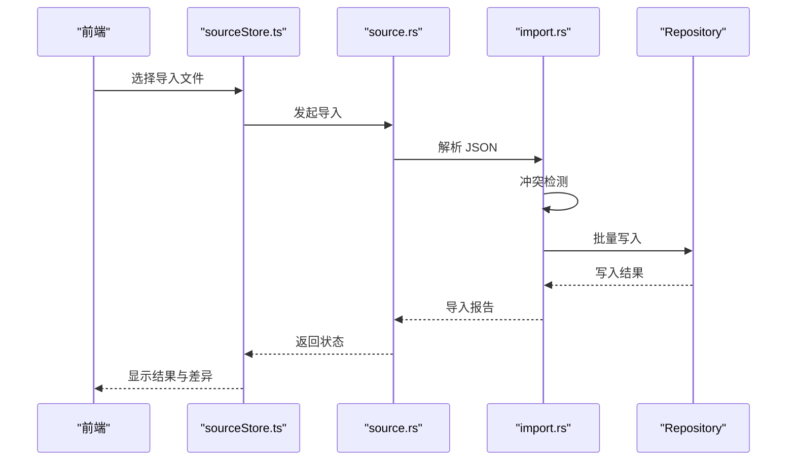

**图表来源** 
- [sourceStore.ts](file://modules/web/src/store/sourceStore.ts)
- [source.rs](file://rust/legado-ffi/src/api/source.rs)
- [import.rs](file://rust/legado-db/src/import.rs)
- [book_source_repository.rs](file://rust/legado-db/src/repository/book_source_repository.rs)
- [rss_source_repository.rs](file://rust/legado-db/src/repository/rss_source_repository.rs)

**章节来源**
- [import.rs](file://rust/legado-db/src/import.rs)
- [source.rs](file://rust/legado-ffi/src/api/source.rs)
- [sourceStore.ts](file://modules/web/src/store/sourceStore.ts)

### 分组与排序（分类管理、优先级设置、动态排序）
- 分组管理
  - 预置分组：官方、社区、自定义
  - 动态分组：基于标签、来源域名、语言自动归类
  - 分组权限：只读、编辑、删除
- 优先级设置
  - 全局优先级：影响搜索结果的顺序
  - 局部优先级：按分组内排序
  - 动态优先级：基于命中率、延迟自适应调整
- 排序策略
  - 手动拖拽排序
  - 按名称、更新时间、状态排序
  - 自定义排序键

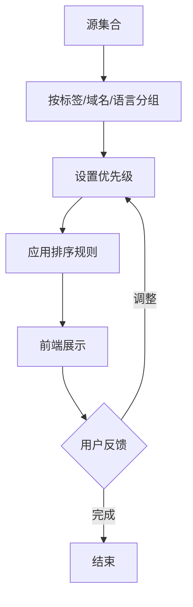

**图表来源** 
- [book_source_repository.rs](file://rust/legado-db/src/repository/book_source_repository.rs)
- [rss_source_repository.rs](file://rust/legado-db/src/repository/rss_source_repository.rs)

**章节来源**
- [book_source_repository.rs](file://rust/legado-db/src/repository/book_source_repository.rs)
- [rss_source_repository.rs](file://rust/legado-db/src/repository/rss_source_repository.rs)

### 调试工具（规则测试、网络抓包、性能分析）
- 规则测试
  - 在线测试：输入样例 HTML/JSON，实时输出解析结果
  - 断点调试：逐步执行选择器，查看中间变量
  - 覆盖率统计：规则命中次数、失败率
- 网络抓包
  - 请求日志：URL、方法、头、体、状态码
  - 响应分析：HTML/JSON 结构、关键字段提取
  - 代理拦截：Fiddler/mitmproxy 集成
- 性能分析
  - 耗时统计：单页解析、批量抓取
  - 内存占用：大页面处理、流式解析
  - 并发控制：线程池大小、限流策略

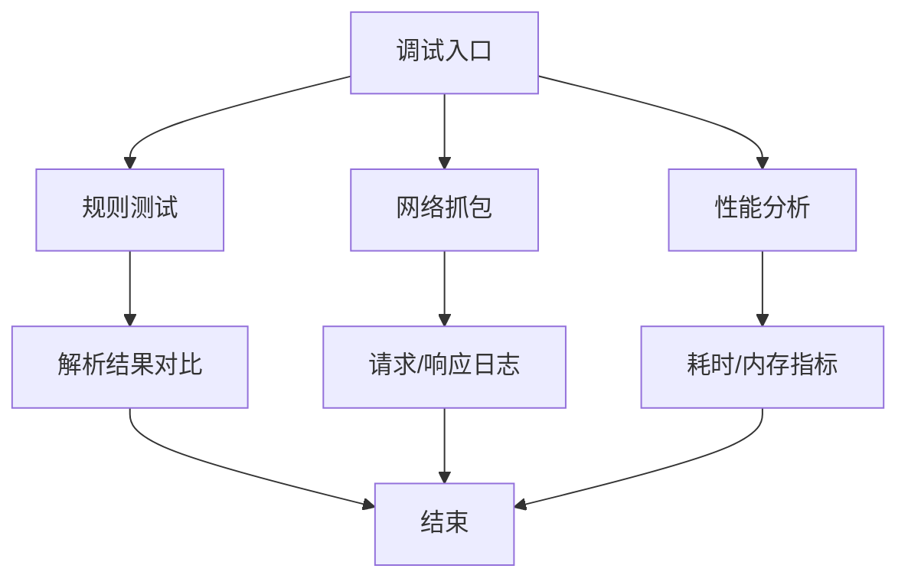

**图表来源** 
- [SourceEditor.vue](file://modules/web/src/views/SourceEditor.vue)
- [SourceJson.vue](file://modules/web/src/components/SourceJson.vue)
- [source_checker.rs](file://rust/legado-net/src/source_checker.rs)
- [rule_analyzer.rs](file://rust/legado-parser/src/rule_analyzer.rs)

**章节来源**
- [SourceEditor.vue](file://modules/web/src/views/SourceEditor.vue)
- [SourceJson.vue](file://modules/web/src/components/SourceJson.vue)
- [source_checker.rs](file://rust/legado-net/src/source_checker.rs)
- [rule_analyzer.rs](file://rust/legado-parser/src/rule_analyzer.rs)

### 持久化配置存储（新增功能）
- 配置管理API
  - 配置获取：`get_config(key)` 获取指定配置项
  - 配置设置：`set_config(key, value)` 设置配置项
  - 批量获取：`get_all_config()` 获取所有配置项
- 检查配置DTO
  - 可选字段：keyword、step_timeout_ms、check_search、check_toc、check_content、detect_captcha、detect_redirect
  - 默认值处理：未指定的字段自动使用默认配置
  - 配置解析：支持JSON格式的灵活配置
- 优雅降级机制
  - 配置缺失：自动回退到默认配置值
  - 格式错误：捕获异常并提供友好的错误信息
  - 空配置：空字符串或空对象使用默认配置

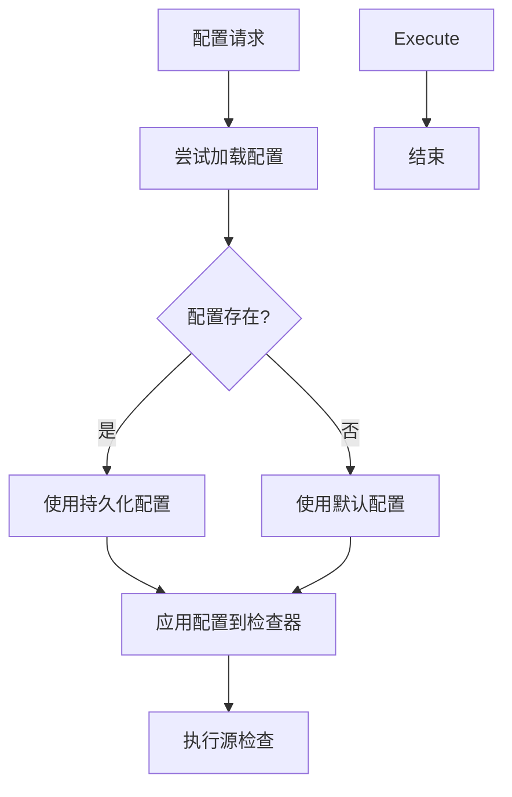

**图表来源** 
- [config_api.rs](file://rust/legado-ffi/src/api/config_api.rs)
- [source_check_api.rs](file://rust/legado-ffi/src/api/source_check_api.rs)
- [source_checker.rs](file://rust/legado-net/src/source_checker.rs)

**章节来源**
- [config_api.rs](file://rust/legado-ffi/src/api/config_api.rs)
- [source_check_api.rs](file://rust/legado-ffi/src/api/source_check_api.rs)
- [source_checker.rs](file://rust/legado-net/src/source_checker.rs)

### Flutter批量操作功能

#### 批量操作架构设计
Flutter Legado应用实现了完整的批量操作功能，采用Riverpod状态管理模式，提供现代化的用户界面和流畅的操作体验。

```mermaid
classDiagram
class SourceNotifier {
+enterBatchMode()
+exitBatchMode()
+toggleSelection(String)
+selectAll()
+deselectAll()
+revertSelection()
+batchEnable()
+batchDisable()
+batchDelete()
+batchToggleExplore(bool)
+batchMoveSelection({required bool toTop})
+batchAddGroup(String)
+batchRemoveGroup(String)
+exportSelectedSources()
+moveSource(String, {required bool toTop})
}
class SourceState {
+sources : BookSource[]
+loading : bool
+error : String?
+filterKeyword : String
+selectedGroup : String?
+sort : SourceSort
+sortAscending : bool
+batchMode : bool
+selectedUrls : Set~String~
+lastImportResult : ImportResult?
}
class BatchOperations {
+启用/禁用操作
+分组管理操作
+移动排序操作
+导出分享操作
+验证检查操作
+范围选择操作
}
SourceNotifier --> SourceState
SourceNotifier --> BatchOperations
```

**图表来源** 
- [source_notifier.dart](file://flutter_legado/lib/src/providers/source/source_notifier.dart)
- [source_state.dart](file://flutter_legado/lib/src/providers/source/source_state.dart)

#### 12种批量操作详解

##### 1. 启用/禁用操作
- **批量启用**：将所有选中的书源设置为启用状态
- **批量禁用**：将所有选中的书源设置为禁用状态
- **单个切换**：快速切换单个书源的启用状态

##### 2. 分组管理操作
- **添加分组**：为选中的书源添加指定分组
- **移除分组**：从选中的书源中移除指定分组
- **分组筛选**：按分组筛选和管理书源

##### 3. 发现功能操作
- **启用发现**：批量启用选中书源的发现功能
- **禁用发现**：批量禁用选中书源的发现功能
- **单个切换**：切换单个书源的发现状态

##### 4. 移动排序操作
- **置顶操作**：将选中的书源移动到列表顶部
- **置底操作**：将选中的书源移动到列表底部
- **单个移动**：移动单个书源的位置

##### 5. 导出分享操作
- **导出选中**：将选中的书源导出为JSON格式
- **导出全部**：导出所有书源为JSON格式
- **分享功能**：支持分享导出的配置文件

##### 6. 验证检查操作
- **批量验证**：对选中的书源进行规则验证
- **网络检查**：检查书源的网络连通性
- **语法检查**：验证书源配置的语法正确性

##### 7. 范围选择操作
- **全选操作**：选择当前过滤结果中的所有书源
- **取消全选**：清除所有选中的书源
- **反选操作**：反转当前过滤结果的选中状态
- **单选操作**：切换单个书源的选中状态

#### 状态管理系统
Flutter应用使用Riverpod进行状态管理，确保批量操作的原子性和一致性。

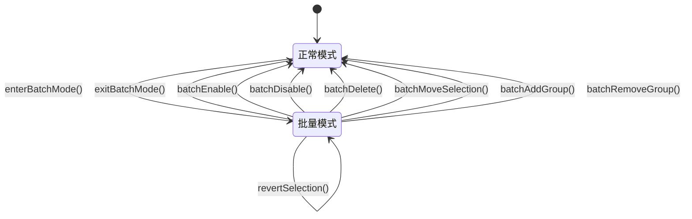

**图表来源** 
- [source_notifier.dart](file://flutter_legado/lib/src/providers/source/source_notifier.dart)
- [source_state.dart](file://flutter_legado/lib/src/providers/source/source_state.dart)

#### 视觉反馈系统
- **进度指示**：批量操作时显示加载状态
- **错误提示**：操作失败时显示详细的错误信息
- **成功反馈**：操作完成时显示成功提示
- **选择状态**：实时更新选中状态的视觉反馈

**章节来源**
- [source_notifier.dart](file://flutter_legado/lib/src/providers/source/source_notifier.dart)
- [source_state.dart](file://flutter_legado/lib/src/providers/source/source_state.dart)

## 依赖关系分析
- 模块耦合
  - FFI 层依赖仓库层与工具模块，解耦业务逻辑
  - 前端依赖 store 与 FFI 接口，保持 UI 与后端一致
  - Flutter 应用依赖 Riverpod 状态管理和 FFI 接口
- 外部依赖
  - 网络库：HTTP 客户端、SSL、代理、重试
  - 解析库：XPath、JSONPath、正则表达式引擎
  - 数据库：SQLite 迁移、索引优化
  - 状态管理：Riverpod、Freezed
- 循环依赖
  - 通过接口抽象避免循环引用
  - 事件总线解耦异步任务

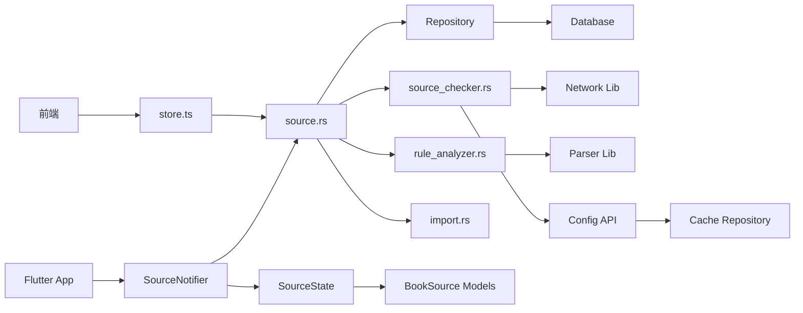

**图表来源** 
- [sourceStore.ts](file://modules/web/src/store/sourceStore.ts)
- [source_notifier.dart](file://flutter_legado/lib/src/providers/source/source_notifier.dart)
- [source_state.dart](file://flutter_legado/lib/src/providers/source/source_state.dart)
- [source.rs](file://rust/legado-ffi/src/api/source.rs)
- [book_source_repository.rs](file://rust/legado-db/src/repository/book_source_repository.rs)
- [rss_source_repository.rs](file://rust/legado-db/src/repository/rss_source_repository.rs)
- [source_checker.rs](file://rust/legado-net/src/source_checker.rs)
- [rule_analyzer.rs](file://rust/legado-parser/src/rule_analyzer.rs)
- [import.rs](file://rust/legado-db/src/import.rs)
- [config_api.rs](file://rust/legado-ffi/src/api/config_api.rs)

**章节来源**
- [sourceStore.ts](file://modules/web/src/store/sourceStore.ts)
- [source_notifier.dart](file://flutter_legado/lib/src/providers/source/source_notifier.dart)
- [source_state.dart](file://flutter_legado/lib/src/providers/source/source_state.dart)
- [source.rs](file://rust/legado-ffi/src/api/source.rs)
- [book_source_repository.rs](file://rust/legado-db/src/repository/book_source_repository.rs)
- [rss_source_repository.rs](file://rust/legado-db/src/repository/rss_source_repository.rs)
- [source_checker.rs](file://rust/legado-net/src/source_checker.rs)
- [rule_analyzer.rs](file://rust/legado-parser/src/rule_analyzer.rs)
- [import.rs](file://rust/legado-db/src/import.rs)
- [config_api.rs](file://rust/legado-ffi/src/api/config_api.rs)

## 性能考量
- 解析优化
  - 使用流式解析处理大页面
  - 缓存常用选择器编译结果
  - 避免正则回溯灾难
- 网络优化
  - 连接池复用、Keep-Alive
  - 压缩传输（Gzip/Brotli）
  - 重试与退避策略
- 存储优化
  - 合理索引：ID、名称、分组、状态
  - 批量写入减少事务开销
  - 定期清理无用数据
- **新增** Flutter性能优化
  - Riverpod状态缓存避免重复计算
  - 批量操作的事务性保证
  - 异步操作的非阻塞处理
- **新增** 配置存储优化
  - 配置缓存减少数据库查询
  - 批量配置操作提高性能
  - 配置变更的增量更新

## 故障排查指南
- 常见错误
  - 规则语法错误：检查 XPath/JSONPath/正则表达式
  - 网络超时：检查代理、SSL、防火墙
  - 导入失败：确认 JSON 格式、字段映射
  - 批量操作失败：检查网络连接和权限设置
  - 配置错误：验证配置格式和必需字段
- 诊断步骤
  - 启用详细日志，捕获请求/响应
  - 使用规则测试工具验证选择器
  - 检查数据库约束与索引
  - 监控Flutter状态变化和操作日志
  - 验证配置存储的读写操作
- 恢复策略
  - 回滚事务，保留原始数据
  - 使用备份恢复配置
  - 降级到稳定版本
  - 重置为默认配置

**章节来源**
- [source_checker.rs](file://rust/legado-net/src/source_checker.rs)
- [source_check_api.rs](file://rust/legado-ffi/src/api/source_check_api.rs)
- [config_api.rs](file://rust/legado-ffi/src/api/config_api.rs)
- [rule_analyzer.rs](file://rust/legado-parser/src/rule_analyzer.rs)
- [import.rs](file://rust/legado-db/src/import.rs)
- [source_notifier.dart](file://flutter_legado/lib/src/providers/source/source_notifier.dart)

## 结论
Legado 的源管理系统通过清晰的分层架构、严格的验证机制、灵活的导入导出与强大的调试工具，提供了高效可靠的源管理能力。新增的持久化配置存储功能进一步增强了系统的灵活性和可靠性，支持源检查参数的持久化保存和优雅降级处理。同时，Flutter批量操作功能的完善使得用户体验更加流畅和高效，支持12种不同的批量操作类型。开发者可基于此扩展新的源类型与功能，维护者可依据最佳实践优化性能与稳定性。

## 附录
- 配置示例
  - 书籍源 JSON 示例：包含基本信息、解析规则、高级选项
  - RSS 源 JSON 示例：包含条目映射、更新策略
  - 检查配置 JSON 示例：包含超时设置、步骤开关等
- 最佳实践
  - 命名规范：简洁明确，避免特殊字符
  - 规则设计：优先使用 CSS 选择器，复杂场景用正则
  - 错误处理：捕获异常，返回友好提示
  - 性能调优：监控耗时，优化热点路径
  - 批量操作：合理使用批量操作提高管理效率
  - 配置管理：合理设置检查参数，平衡准确性与性能
- 调试技巧
  - 使用浏览器开发者工具模拟请求
  - 启用 FFI 日志定位问题
  - 编写单元测试覆盖边界情况
  - 使用Flutter DevTools调试状态变化
  - 利用配置存储功能进行调试和测试

**章节来源**
- [bookSourceEditConfig.ts](file://modules/web/src/config/bookSourceEditConfig.ts)
- [js_source_template.js](file://app/src/main/assets/js_source_template.js)
- [source_notifier.dart](file://flutter_legado/lib/src/providers/source/source_notifier.dart)
- [source_state.dart](file://flutter_legado/lib/src/providers/source/source_state.dart)
- [source_check_api.rs](file://rust/legado-ffi/src/api/source_check_api.rs)
- [config_api.rs](file://rust/legado-ffi/src/api/config_api.rs)