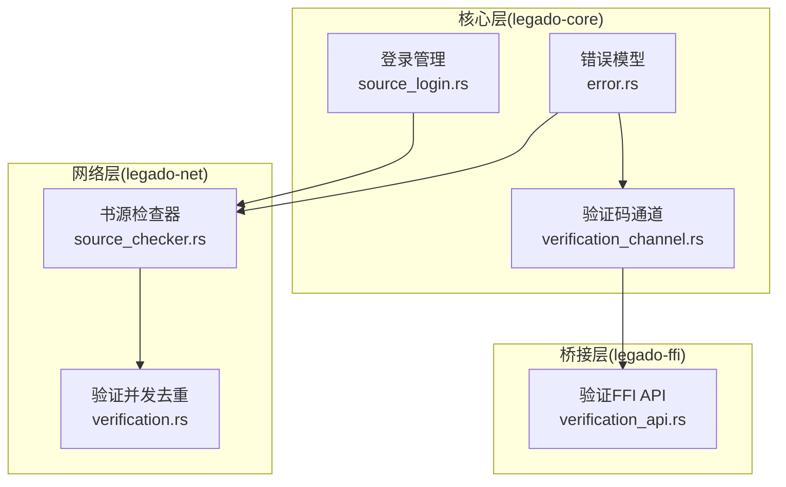
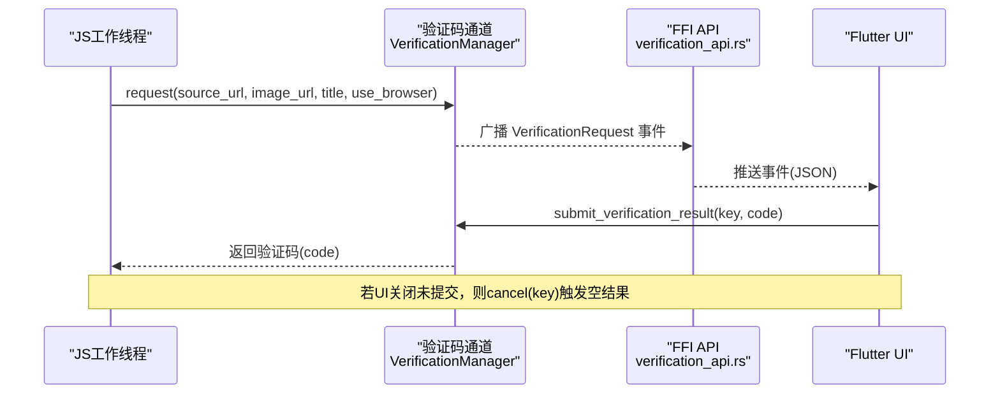
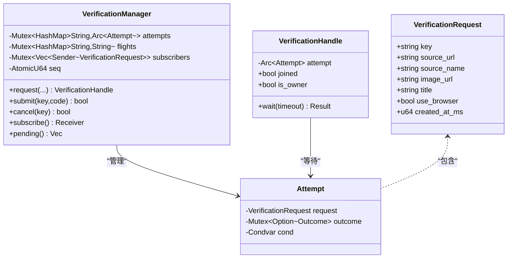
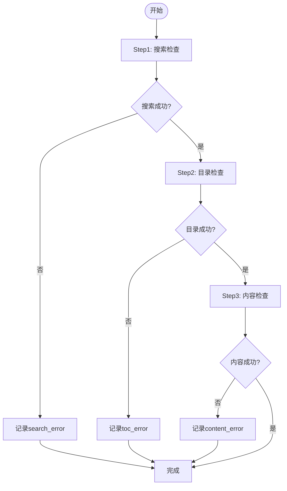
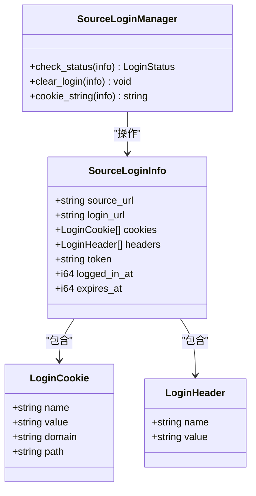
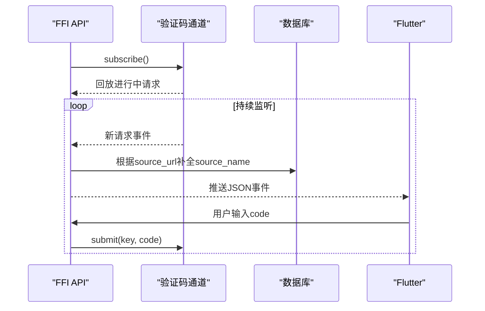
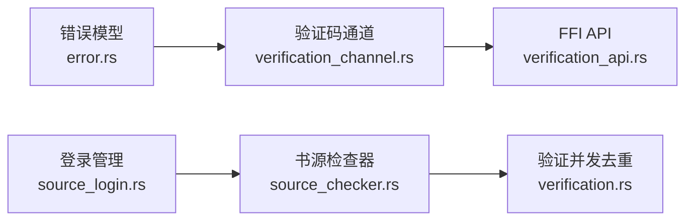

# 源验证框架

<cite>
**本文引用的文件**   
- [README.md](file://README.md)
- [verification_channel.rs](file://rust/legado-core/src/verification_channel.rs)
- [verification_api.rs](file://rust/legado-ffi/src/api/verification_api.rs)
- [source_checker.rs](file://rust/legado-net/src/source_checker.rs)
- [verification.rs](file://rust/legado-net/src/verification.rs)
- [source_login.rs](file://rust/legado-core/src/source_login.rs)
- [error.rs](file://rust/legado-core/src/error.rs)
</cite>

## 目录
1. [简介](#简介)
2. [项目结构](#项目结构)
3. [核心组件](#核心组件)
4. [架构总览](#架构总览)
5. [详细组件分析](#详细组件分析)
6. [依赖关系分析](#依赖关系分析)
7. [性能考量](#性能考量)
8. [故障排查指南](#故障排查指南)
9. [结论](#结论)

## 简介
本文件系统化梳理 Legado 的“源验证框架”，覆盖验证码交互通道、书源有效性检查、并发去重注册表与登录状态管理等关键能力。该框架对齐 Kotlin 实现，提供跨线程、跨语言（Rust ↔ Flutter）的稳定交互机制，确保在遇到验证码、重定向或登录拦截时，能够以统一流程完成用户交互与结果回传。

## 项目结构
Legado 采用 Rust 核心引擎 + Flutter UI 的跨平台架构。源验证相关代码主要分布在以下 crate：
- legado-core：验证码交互通道、登录管理、错误模型等基础能力
- legado-net：书源有效性检查器、来源验证并发去重注册表
- legado-ffi：面向 Flutter 的 FFI API（事件流、提交/取消接口）



图表来源
- [verification_channel.rs:1-120](file://rust/legado-core/src/verification_channel.rs#L1-L120)
- [source_checker.rs:1-120](file://rust/legado-net/src/source_checker.rs#L1-L120)
- [verification.rs:1-80](file://rust/legado-net/src/verification.rs#L1-L80)
- [verification_api.rs:1-60](file://rust/legado-ffi/src/api/verification_api.rs#L1-L60)
- [source_login.rs:1-80](file://rust/legado-core/src/source_login.rs#L1-L80)
- [error.rs:1-60](file://rust/legado-core/src/error.rs#L1-L60)

章节来源
- [README.md:1-26](file://README.md#L1-L26)

## 核心组件
- 验证码交互通道（VerificationManager / VerificationHandle）
  - 负责生成唯一 key、广播请求事件、等待/唤醒、超时清理、同书源并发去重共享结果
- 书源有效性检查器（SourceChecker）
  - 执行搜索/目录/内容三步校验，并检测验证码与重定向
- 来源验证并发去重注册表（VerificationFlightRegistry）
  - 对相同 sourceUrl 的验证请求进行去重，避免重复弹窗
- 登录管理器（SourceLoginManager）
  - 管理 Cookie/Token/过期时间，辅助判断登录状态
- FFI 验证 API（verification_api.rs）
  - 暴露事件流订阅、提交/取消接口，供 Flutter 侧调用

章节来源
- [verification_channel.rs:1-120](file://rust/legado-core/src/verification_channel.rs#L1-L120)
- [source_checker.rs:1-120](file://rust/legado-net/src/source_checker.rs#L1-L120)
- [verification.rs:1-80](file://rust/legado-net/src/verification.rs#L1-L80)
- [source_login.rs:1-80](file://rust/legado-core/src/source_login.rs#L1-L80)
- [verification_api.rs:1-60](file://rust/legado-ffi/src/api/verification_api.rs#L1-L60)

## 架构总览
下图展示从 JS 钩子发起验证码请求到 Flutter 弹出对话框、用户输入后回传的完整时序。



图表来源
- [verification_channel.rs:120-200](file://rust/legado-core/src/verification_channel.rs#L120-L200)
- [verification_api.rs:40-100](file://rust/legado-ffi/src/api/verification_api.rs#L40-L100)

## 详细组件分析

### 验证码交互通道（VerificationChannel）
- 设计要点
  - 使用 condvar 阻塞等待，避免占用 tokio 工作者线程
  - 通过 mpsc 将事件推送到订阅者（FFI/UI）
  - 按 source_url 做航班去重，多个等待方共享同一结果
  - 默认超时 5 分钟；owner 超时自动清理悬挂状态
- 关键数据结构
  - VerificationRequest：事件载荷（key、source_url、image_url、title、use_browser、created_at_ms）
  - Attempt：单次尝试（request + outcome + condvar）
  - VerificationManager：全局单例，维护 attempts/flights/subscribers
  - VerificationHandle：等待句柄，支持 wait(timeout)
- 行为语义
  - request：创建或加入航班，广播事件
  - submit/cancel：设置结局并唤醒所有等待方
  - subscribe：回放进行中请求，之后实时接收新事件



图表来源
- [verification_channel.rs:30-120](file://rust/legado-core/src/verification_channel.rs#L30-L120)
- [verification_channel.rs:120-200](file://rust/legado-core/src/verification_channel.rs#L120-L200)
- [verification_channel.rs:280-360](file://rust/legado-core/src/verification_channel.rs#L280-L360)

章节来源
- [verification_channel.rs:1-120](file://rust/legado-core/src/verification_channel.rs#L1-L120)
- [verification_channel.rs:120-200](file://rust/legado-core/src/verification_channel.rs#L120-L200)
- [verification_channel.rs:280-360](file://rust/legado-core/src/verification_channel.rs#L280-L360)

### 书源有效性检查器（SourceChecker）
- 功能概述
  - 快速检查（仅搜索+验证码/重定向检测）
  - 完整检查（搜索→目录→内容），记录每步成功/失败
  - 验证码检测：基于关键词匹配图片/滑动/点击/人机验证
  - 重定向检测：对比请求与响应 URL，识别登录/验证页跳转
- 输出模型
  - CheckResult：包含 search_ok/toc_ok/content_ok、各阶段错误信息、total_time_ms、captcha、redirect
- 典型流程



图表来源
- [source_checker.rs:180-280](file://rust/legado-net/src/source_checker.rs#L180-L280)
- [source_checker.rs:380-460](file://rust/legado-net/src/source_checker.rs#L380-L460)

章节来源
- [source_checker.rs:1-120](file://rust/legado-net/src/source_checker.rs#L1-L120)
- [source_checker.rs:180-280](file://rust/legado-net/src/source_checker.rs#L180-L280)
- [source_checker.rs:380-460](file://rust/legado-net/src/source_checker.rs#L380-L460)

### 来源验证并发去重注册表（VerificationFlightRegistry）
- 作用
  - 针对相同 sourceUrl 的验证请求进行去重，避免重复弹窗
  - 第一个等待者获得完整结果，其余等待者收到 Refetch 信号
- 关键方法
  - register：注册新的验证航班
  - try_join：尝试加入已有航班
  - complete：完成验证并通知所有等待者
  - can_join：查询是否可加入

```mermaid
classDiagram
class VerificationFlightRegistry {
-Arc~Mutex~HashMap~String,Vec~oneshot : : Sender~~ flights
+register(source_url) oneshot : : Receiver
+try_join(source_url) Option~Receiver~
+complete(source_url, result) void
+can_join(source_url) bool
}
class VerificationResult {
<<enum>>
Response{code, cookie}
Refetch
}
VerificationFlightRegistry --> VerificationResult : "发送"
```

图表来源
- [verification.rs:1-80](file://rust/legado-net/src/verification.rs#L1-L80)
- [verification.rs:80-120](file://rust/legado-net/src/verification.rs#L80-L120)

章节来源
- [verification.rs:1-80](file://rust/legado-net/src/verification.rs#L1-L80)
- [verification.rs:80-120](file://rust/legado-net/src/verification.rs#L80-L120)

### 登录管理器（SourceLoginManager）
- 职责
  - 检查登录状态（未登录/已登录/已过期）
  - 清除登录信息
  - 生成 Cookie 字符串用于 HTTP 请求头
- 数据模型
  - SourceLoginInfo：包含 cookies、headers、token、过期时间等
  - LoginCookie/LoginHeader：认证凭据



图表来源
- [source_login.rs:1-80](file://rust/legado-core/src/source_login.rs#L1-L80)
- [source_login.rs:80-160](file://rust/legado-core/src/source_login.rs#L80-L160)

章节来源
- [source_login.rs:1-80](file://rust/legado-core/src/source_login.rs#L1-L80)
- [source_login.rs:80-160](file://rust/legado-core/src/source_login.rs#L80-L160)

### FFI 验证 API（verification_api.rs）
- 暴露能力
  - run_verification_request_stream：长期存活的事件流，订阅验证码请求
  - submit_verification_result：提交验证码结果，唤醒 JS 等待方
  - cancel_verification_request：取消请求（以空结果唤醒）
  - pending_requests_json：拉取进行中请求列表（调试用）
- 事件序列化
  - serialize_event：补全书源名称后序列化为 JSON（snake_case 字段契约）



图表来源
- [verification_api.rs:30-100](file://rust/legado-ffi/src/api/verification_api.rs#L30-L100)
- [verification_channel.rs:240-280](file://rust/legado-core/src/verification_channel.rs#L240-L280)

章节来源
- [verification_api.rs:1-100](file://rust/legado-ffi/src/api/verification_api.rs#L1-L100)

## 依赖关系分析
- 验证码通道依赖错误模型（LegadoError）
- 书源检查器依赖网络客户端与响应模型
- FFI API 依赖验证码通道与数据库仓库（用于补全书源名称）
- 登录管理器为书源请求提供认证上下文



图表来源
- [error.rs:1-60](file://rust/legado-core/src/error.rs#L1-L60)
- [verification_channel.rs:1-60](file://rust/legado-core/src/verification_channel.rs#L1-L60)
- [verification_api.rs:1-40](file://rust/legado-ffi/src/api/verification_api.rs#L1-L40)
- [source_login.rs:1-60](file://rust/legado-core/src/source_login.rs#L1-L60)
- [source_checker.rs:1-60](file://rust/legado-net/src/source_checker.rs#L1-L60)
- [verification.rs:1-60](file://rust/legado-net/src/verification.rs#L1-L60)

章节来源
- [error.rs:1-60](file://rust/legado-core/src/error.rs#L1-L60)
- [verification_channel.rs:1-60](file://rust/legado-core/src/verification_channel.rs#L1-L60)
- [verification_api.rs:1-40](file://rust/legado-ffi/src/api/verification_api.rs#L1-L40)
- [source_login.rs:1-60](file://rust/legado-core/src/source_login.rs#L1-L60)
- [source_checker.rs:1-60](file://rust/legado-net/src/source_checker.rs#L1-L60)
- [verification.rs:1-60](file://rust/legado-net/src/verification.rs#L1-L60)

## 性能考量
- 验证码通道使用 std::sync::Condvar 阻塞等待，不占用 tokio 工作者线程，适合在 spawn_blocking 中安全运行
- 事件流通过 mpsc 传输，无事件时轮询间隔为 1 秒，避免空转
- 同书源并发请求去重，减少重复弹窗与网络开销
- 书源检查器支持快速检查模式，适用于批量筛查场景

[本节为通用指导，无需特定文件引用]

## 故障排查指南
- 常见问题
  - 验证码结果为空：等待侧会抛出“验证结果为空”错误，检查 UI 是否正确提交或取消
  - 超时：默认 5 分钟，检查网络延迟与用户交互耗时
  - 重复弹窗：确认是否正确使用 source_url 去重逻辑
  - 重定向到登录页：检查 detect_redirect 配置与目标站点行为
- 定位手段
  - 使用 pending_requests_json 查看进行中请求
  - 检查事件 JSON 字段是否符合 snake_case 契约
  - 核对书源 header 解析（JSON 或 Key: Value 格式）

章节来源
- [verification_channel.rs:300-360](file://rust/legado-core/src/verification_channel.rs#L300-L360)
- [verification_api.rs:100-160](file://rust/legado-ffi/src/api/verification_api.rs#L100-L160)
- [source_checker.rs:490-620](file://rust/legado-net/src/source_checker.rs#L490-L620)

## 结论
Legado 的源验证框架以验证码交互通道为核心，结合书源有效性检查、并发去重与登录管理，构建了稳定可靠的跨线程/跨语言验证体系。其设计对齐 Kotlin 实现，兼顾性能与可维护性，为后续扩展（如更多验证码类型、更精细的重定向策略）提供了坚实基础。

[本节为总结性内容，无需特定文件引用]