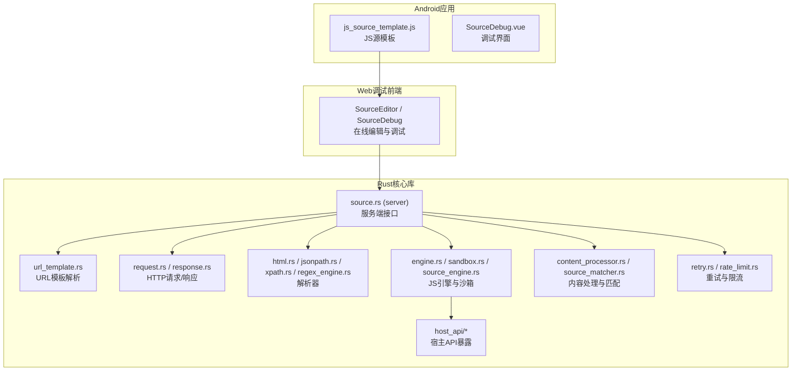
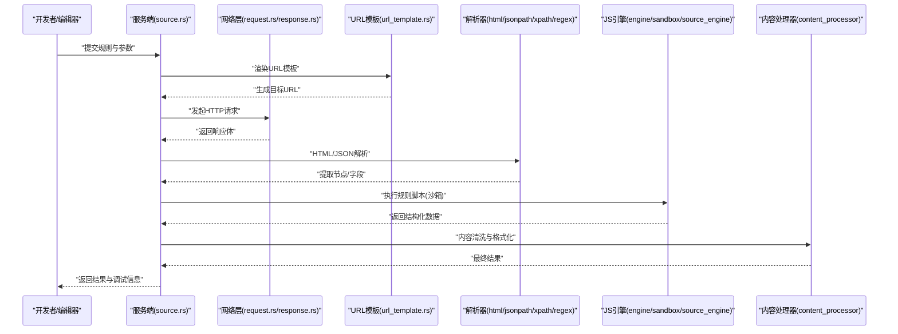
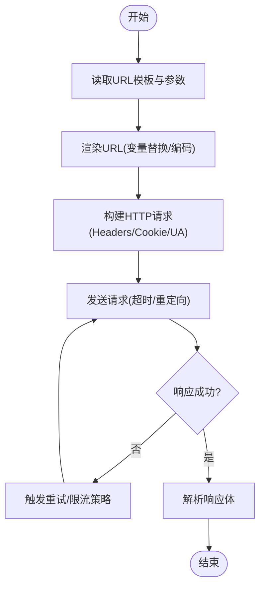
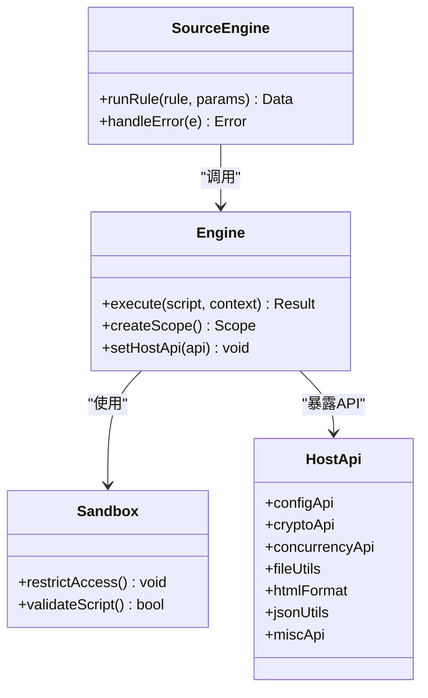
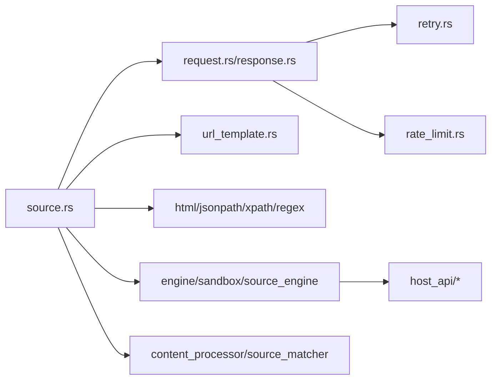

# 网络源系统

<cite>
**本文引用的文件**   
- [README.md](file://README.md)
- [app/src/main/assets/js_source_template.js](file://app/src/main/assets/js_source_template.js)
- [modules/web/src/components/SourceDebug.vue](file://modules/web/src/components/SourceDebug.vue)
- [rust/legado-net/src/url_template.rs](file://rust/legado-net/src/url_template.rs)
- [rust/legado-net/src/request.rs](file://rust/legado-net/src/request.rs)
- [rust/legado-net/src/response.rs](file://rust/legado-net/src/response.rs)
- [rust/legado-net/src/retry.rs](file://rust/legado-net/src/retry.rs)
- [rust/legado-net/src/rate_limit.rs](file://rust/legado-net/src/rate_limit.rs)
- [rust/legado-parser/src/html.rs](file://rust/legado-parser/src/html.rs)
- [rust/legado-parser/src/jsonpath.rs](file://rust/legado-parser/src/jsonpath.rs)
- [rust/legado-parser/src/xpath.rs](file://rust/legado-parser/src/xpath.rs)
- [rust/legado-parser/src/regex_engine.rs](file://rust/legado-parser/src/regex_engine.rs)
- [rust/legado-js/src/engine.rs](file://rust/legado-js/src/engine.rs)
- [rust/legado-js/src/sandbox.rs](file://rust/legado-js/src/sandbox.rs)
- [rust/legado-js/src/host_api/mod.rs](file://rust/legado-js/src/host_api/mod.rs)
- [rust/legado-js/src/host_api/concurrency_api.rs](file://rust/legado-js/src/host_api/concurrency_api.rs)
- [rust/legado-js/src/host_api/config_api.rs](file://rust/legado-js/src/host_api/config_api.rs)
- [rust/legado-js/src/host_api/crypto_api.rs](file://rust/legado-js/src/host_api/crypto_api.rs)
- [rust/legado-js/src/host_api/file_utils.rs](file://rust/legado-js/src/host_api/file_utils.rs)
- [rust/legado-js/src/host_api/html_format.rs](file://rust/legado-js/src/host_api/html_format.rs)
- [rust/legado-js/src/host_api/json_utils.rs](file://rust/legado-js/src/host_api/json_utils.rs)
- [rust/legado-js/src/host_api/misc_api.rs](file://rust/legado-js/src/host_api/misc_api.rs)
- [rust/legado-js/src/source_engine.rs](file://rust/legado-js/src/source_engine.rs)
- [rust/legado-core/src/content_processor.rs](file://rust/legado-core/src/content_processor.rs)
- [rust/legado-core/src/source_matcher.rs](file://rust/legado-core/src/source_matcher.rs)
- [rust/legado-server/src/handlers/source.rs](file://rust/legado-server/src/handlers/source.rs)
</cite>

## 目录
1. [简介](#简介)
2. [项目结构](#项目结构)
3. [核心组件](#核心组件)
4. [架构总览](#架构总览)
5. [详细组件分析](#详细组件分析)
6. [依赖关系分析](#依赖关系分析)
7. [性能考量](#性能考量)
8. [故障排查指南](#故障排查指南)
9. [结论](#结论)
10. [附录](#附录)

## 简介
本文件面向Legado项目的“网络源系统”，系统性阐述规则引擎与JavaScript执行环境如何协同工作，完成从URL模板解析、HTML抓取、JSON提取到XPath/正则匹配的全流程。文档同时覆盖脚本沙箱安全、API暴露、配置管理、内容清洗过滤、并发控制与错误恢复策略，并提供规则编写指南、最佳实践与测试方法，帮助开发者快速上手并高效维护高质量的网络源规则。

## 项目结构
网络源系统横跨Android应用层、Web调试前端与Rust核心库：
- Android应用层提供资源与模板（如JS源模板），以及Web调试界面入口。
- Web模块提供在线编辑器与调试工具，便于规则开发与联调。
- Rust核心库实现网络请求、URL模板解析、HTML/JSON/XPath/正则解析、JS引擎集成、内容处理与服务器接口。

图表来源
- [app/src/main/assets/js_source_template.js](file://app/src/main/assets/js_source_template.js)
- [modules/web/src/components/SourceDebug.vue](file://modules/web/src/components/SourceDebug.vue)
- [rust/legado-net/src/url_template.rs](file://rust/legado-net/src/url_template.rs)
- [rust/legado-net/src/request.rs](file://rust/legado-net/src/request.rs)
- [rust/legado-net/src/response.rs](file://rust/legado-net/src/response.rs)
- [rust/legado-parser/src/html.rs](file://rust/legado-parser/src/html.rs)
- [rust/legado-parser/src/jsonpath.rs](file://rust/legado-parser/src/jsonpath.rs)
- [rust/legado-parser/src/xpath.rs](file://rust/legado-parser/src/xpath.rs)
- [rust/legado-parser/src/regex_engine.rs](file://rust/legado-parser/src/regex_engine.rs)
- [rust/legado-js/src/engine.rs](file://rust/legado-js/src/engine.rs)
- [rust/legado-js/src/sandbox.rs](file://rust/legado-js/src/sandbox.rs)
- [rust/legado-js/src/source_engine.rs](file://rust/legado-js/src/source_engine.rs)
- [rust/legado-js/src/host_api/mod.rs](file://rust/legado-js/src/host_api/mod.rs)
- [rust/legado-core/src/content_processor.rs](file://rust/legado-core/src/content_processor.rs)
- [rust/legado-core/src/source_matcher.rs](file://rust/legado-core/src/source_matcher.rs)
- [rust/legado-net/src/retry.rs](file://rust/legado-net/src/retry.rs)
- [rust/legado-net/src/rate_limit.rs](file://rust/legado-net/src/rate_limit.rs)
- [rust/legado-server/src/handlers/source.rs](file://rust/legado-server/src/handlers/source.rs)

章节来源
- [README.md](file://README.md)

## 核心组件
- URL模板解析器：将带占位符的URL模板渲染为实际请求地址，支持参数替换、编码与路径拼接。
- HTTP客户端：封装请求构建、响应解析、Cookie与代理设置，配合重试与限流策略。
- 解析器集合：HTML抽取、JSON路径提取、XPath查询与正则表达式匹配，统一输出结构化数据。
- JavaScript引擎：基于Rhino的脚本执行环境，提供沙箱隔离与宿主API暴露，用于复杂规则逻辑。
- 内容处理器：广告去除、文本格式化、图片处理等清洗步骤，提升阅读体验。
- 调试与服务端：在线编辑器与调试面板，以及通过服务端接口进行规则验证与批量更新。

章节来源
- [rust/legado-net/src/url_template.rs](file://rust/legado-net/src/url_template.rs)
- [rust/legado-net/src/request.rs](file://rust/legado-net/src/request.rs)
- [rust/legado-net/src/response.rs](file://rust/legado-net/src/response.rs)
- [rust/legado-parser/src/html.rs](file://rust/legado-parser/src/html.rs)
- [rust/legado-parser/src/jsonpath.rs](file://rust/legado-parser/src/jsonpath.rs)
- [rust/legado-parser/src/xpath.rs](file://rust/legado-parser/src/xpath.rs)
- [rust/legado-parser/src/regex_engine.rs](file://rust/legado-parser/src/regex_engine.rs)
- [rust/legado-js/src/engine.rs](file://rust/legado-js/src/engine.rs)
- [rust/legado-js/src/sandbox.rs](file://rust/legado-js/src/sandbox.rs)
- [rust/legado-js/src/source_engine.rs](file://rust/legado-js/src/source_engine.rs)
- [rust/legado-core/src/content_processor.rs](file://rust/legado-core/src/content_processor.rs)
- [rust/legado-server/src/handlers/source.rs](file://rust/legado-server/src/handlers/source.rs)

## 架构总览
下图展示一次完整的网络源抓取流程：从URL模板渲染、HTTP请求、HTML/JSON解析、XPath/正则匹配，到JS脚本执行与内容清洗，最终返回结构化结果。

图表来源
- [rust/legado-server/src/handlers/source.rs](file://rust/legado-server/src/handlers/source.rs)
- [rust/legado-net/src/url_template.rs](file://rust/legado-net/src/url_template.rs)
- [rust/legado-net/src/request.rs](file://rust/legado-net/src/request.rs)
- [rust/legado-net/src/response.rs](file://rust/legado-net/src/response.rs)
- [rust/legado-parser/src/html.rs](file://rust/legado-parser/src/html.rs)
- [rust/legado-parser/src/jsonpath.rs](file://rust/legado-parser/src/jsonpath.rs)
- [rust/legado-parser/src/xpath.rs](file://rust/legado-parser/src/xpath.rs)
- [rust/legado-parser/src/regex_engine.rs](file://rust/legado-parser/src/regex_engine.rs)
- [rust/legado-js/src/engine.rs](file://rust/legado-js/src/engine.rs)
- [rust/legado-js/src/sandbox.rs](file://rust/legado-js/src/sandbox.rs)
- [rust/legado-js/src/source_engine.rs](file://rust/legado-js/src/source_engine.rs)
- [rust/legado-core/src/content_processor.rs](file://rust/legado-core/src/content_processor.rs)

## 详细组件分析

### URL模板解析与请求构建
- URL模板解析：支持变量替换、路径拼接、查询参数编码与默认值处理，确保生成的URL符合目标站点规范。
- 请求构建：封装Header、Cookie、User-Agent、超时、重定向策略；结合重试与限流保证稳定性。
- 响应处理：统一解码、压缩处理、状态码校验与错误映射。

图表来源
- [rust/legado-net/src/url_template.rs](file://rust/legado-net/src/url_template.rs)
- [rust/legado-net/src/request.rs](file://rust/legado-net/src/request.rs)
- [rust/legado-net/src/response.rs](file://rust/legado-net/src/response.rs)
- [rust/legado-net/src/retry.rs](file://rust/legado-net/src/retry.rs)
- [rust/legado-net/src/rate_limit.rs](file://rust/legado-net/src/rate_limit.rs)

章节来源
- [rust/legado-net/src/url_template.rs](file://rust/legado-net/src/url_template.rs)
- [rust/legado-net/src/request.rs](file://rust/legado-net/src/request.rs)
- [rust/legado-net/src/response.rs](file://rust/legado-net/src/response.rs)
- [rust/legado-net/src/retry.rs](file://rust/legado-net/src/retry.rs)
- [rust/legado-net/src/rate_limit.rs](file://rust/legado-net/src/rate_limit.rs)

### HTML抓取与解析
- HTML解析：DOM树构建、节点选择、属性提取、文本清理。
- 内容定位：支持CSS选择器与XPath混合使用，提高定位鲁棒性。
- 异常处理：对不完整或畸形HTML进行容错解析，避免崩溃。

章节来源
- [rust/legado-parser/src/html.rs](file://rust/legado-parser/src/html.rs)

### JSON数据提取
- JSON路径：支持点号与数组索引访问，简化常见字段提取。
- 类型转换：自动字符串/数字/布尔转换，缺失字段回退策略。
- 嵌套处理：层级遍历与条件过滤，适配复杂API结构。

章节来源
- [rust/legado-parser/src/jsonpath.rs](file://rust/legado-parser/src/jsonpath.rs)

### XPath与正则表达式匹配
- XPath：支持轴、谓词、函数扩展，适合复杂文档结构定位。
- 正则：全局匹配、分组捕获、多行模式，用于非结构化文本抽取。
- 性能优化：预编译正则、缓存匹配结果，减少重复计算。

章节来源
- [rust/legado-parser/src/xpath.rs](file://rust/legado-parser/src/xpath.rs)
- [rust/legado-parser/src/regex_engine.rs](file://rust/legado-parser/src/regex_engine.rs)

### JavaScript脚本执行环境
- Rhino引擎集成：在独立线程中执行脚本，避免阻塞主流程。
- 沙箱隔离：限制文件系统、网络、反射等危险操作，保障安全。
- API暴露：通过宿主API提供配置、加密、并发、文件、HTML格式化、JSON工具等能力。

图表来源
- [rust/legado-js/src/engine.rs](file://rust/legado-js/src/engine.rs)
- [rust/legado-js/src/sandbox.rs](file://rust/legado-js/src/sandbox.rs)
- [rust/legado-js/src/source_engine.rs](file://rust/legado-js/src/source_engine.rs)
- [rust/legado-js/src/host_api/mod.rs](file://rust/legado-js/src/host_api/mod.rs)

章节来源
- [rust/legado-js/src/engine.rs](file://rust/legado-js/src/engine.rs)
- [rust/legado-js/src/sandbox.rs](file://rust/legado-js/src/sandbox.rs)
- [rust/legado-js/src/source_engine.rs](file://rust/legado-js/src/source_engine.rs)
- [rust/legado-js/src/host_api/mod.rs](file://rust/legado-js/src/host_api/mod.rs)
- [rust/legado-js/src/host_api/concurrency_api.rs](file://rust/legado-js/src/host_api/concurrency_api.rs)
- [rust/legado-js/src/host_api/config_api.rs](file://rust/legado-js/src/host_api/config_api.rs)
- [rust/legado-js/src/host_api/crypto_api.rs](file://rust/legado-js/src/host_api/crypto_api.rs)
- [rust/legado-js/src/host_api/file_utils.rs](file://rust/legado-js/src/host_api/file_utils.rs)
- [rust/legado-js/src/host_api/html_format.rs](file://rust/legado-js/src/host_api/html_format.rs)
- [rust/legado-js/src/host_api/json_utils.rs](file://rust/legado-js/src/host_api/json_utils.rs)
- [rust/legado-js/src/host_api/misc_api.rs](file://rust/legado-js/src/host_api/misc_api.rs)

### 内容过滤与清洗算法
- 广告去除：基于规则与启发式检测移除广告区块与无关元素。
- 文本格式化：统一换行、空格、标点，增强可读性。
- 图片处理：相对路径转绝对、懒加载标记、尺寸规范化。

章节来源
- [rust/legado-core/src/content_processor.rs](file://rust/legado-core/src/content_processor.rs)

### 规则验证、自动更新与调试工具
- 规则验证：服务端接口接收规则与参数，返回解析结果与错误详情。
- 自动更新：支持远程规则仓库拉取与增量更新。
- 调试工具：在线编辑器与调试面板，实时查看请求、响应、中间结果与日志。

章节来源
- [rust/legado-server/src/handlers/source.rs](file://rust/legado-server/src/handlers/source.rs)
- [modules/web/src/components/SourceDebug.vue](file://modules/web/src/components/SourceDebug.vue)
- [app/src/main/assets/js_source_template.js](file://app/src/main/assets/js_source_template.js)

## 依赖关系分析
网络源系统的依赖关系清晰分层：
- 上层：服务端接口与Web调试前端。
- 中层：URL模板、HTTP客户端、解析器、JS引擎与内容处理器。
- 下层：重试、限流、Cookie存储、SSL配置等基础设施。

图表来源
- [rust/legado-server/src/handlers/source.rs](file://rust/legado-server/src/handlers/source.rs)
- [rust/legado-net/src/request.rs](file://rust/legado-net/src/request.rs)
- [rust/legado-net/src/response.rs](file://rust/legado-net/src/response.rs)
- [rust/legado-net/src/url_template.rs](file://rust/legado-net/src/url_template.rs)
- [rust/legado-parser/src/html.rs](file://rust/legado-parser/src/html.rs)
- [rust/legado-parser/src/jsonpath.rs](file://rust/legado-parser/src/jsonpath.rs)
- [rust/legado-parser/src/xpath.rs](file://rust/legado-parser/src/xpath.rs)
- [rust/legado-parser/src/regex_engine.rs](file://rust/legado-parser/src/regex_engine.rs)
- [rust/legado-js/src/engine.rs](file://rust/legado-js/src/engine.rs)
- [rust/legado-js/src/sandbox.rs](file://rust/legado-js/src/sandbox.rs)
- [rust/legado-js/src/source_engine.rs](file://rust/legado-js/src/source_engine.rs)
- [rust/legado-js/src/host_api/mod.rs](file://rust/legado-js/src/host_api/mod.rs)
- [rust/legado-core/src/content_processor.rs](file://rust/legado-core/src/content_processor.rs)
- [rust/legado-core/src/source_matcher.rs](file://rust/legado-core/src/source_matcher.rs)
- [rust/legado-net/src/retry.rs](file://rust/legado-net/src/retry.rs)
- [rust/legado-net/src/rate_limit.rs](file://rust/legado-net/src/rate_limit.rs)

章节来源
- [rust/legado-server/src/handlers/source.rs](file://rust/legado-server/src/handlers/source.rs)
- [rust/legado-net/src/request.rs](file://rust/legado-net/src/request.rs)
- [rust/legado-net/src/response.rs](file://rust/legado-net/src/response.rs)
- [rust/legado-net/src/url_template.rs](file://rust/legado-net/src/url_template.rs)
- [rust/legado-parser/src/html.rs](file://rust/legado-parser/src/html.rs)
- [rust/legado-parser/src/jsonpath.rs](file://rust/legado-parser/src/jsonpath.rs)
- [rust/legado-parser/src/xpath.rs](file://rust/legado-parser/src/xpath.rs)
- [rust/legado-parser/src/regex_engine.rs](file://rust/legado-parser/src/regex_engine.rs)
- [rust/legado-js/src/engine.rs](file://rust/legado-js/src/engine.rs)
- [rust/legado-js/src/sandbox.rs](file://rust/legado-js/src/sandbox.rs)
- [rust/legado-js/src/source_engine.rs](file://rust/legado-js/src/source_engine.rs)
- [rust/legado-js/src/host_api/mod.rs](file://rust/legado-js/src/host_api/mod.rs)
- [rust/legado-core/src/content_processor.rs](file://rust/legado-core/src/content_processor.rs)
- [rust/legado-core/src/source_matcher.rs](file://rust/legado-core/src/source_matcher.rs)
- [rust/legado-net/src/retry.rs](file://rust/legado-net/src/retry.rs)
- [rust/legado-net/src/rate_limit.rs](file://rust/legado-net/src/rate_limit.rs)

## 性能考量
- 解析器优化：预编译正则、缓存XPath表达式、批量处理节点。
- 并发控制：限制并发请求数，避免过载；合理设置超时与重试次数。
- 内存管理：流式处理大响应，及时释放临时对象。
- 脚本执行：限制执行时间与内存，避免死循环与无限递归。

[本节为通用指导，不直接分析具体文件]

## 故障排查指南
- 常见问题：
  - URL渲染失败：检查占位符与参数映射。
  - HTML解析异常：确认选择器与XPath表达式有效性。
  - JSON字段缺失：核对路径与数据类型转换。
  - 脚本执行错误：查看沙箱限制与API可用性。
- 调试技巧：
  - 使用在线编辑器与调试面板查看请求/响应与中间结果。
  - 逐步启用解析器与脚本，定位问题阶段。
  - 开启详细日志，记录关键步骤与异常堆栈。

章节来源
- [rust/legado-server/src/handlers/source.rs](file://rust/legado-server/src/handlers/source.rs)
- [modules/web/src/components/SourceDebug.vue](file://modules/web/src/components/SourceDebug.vue)

## 结论
Legado的网络源系统通过模块化设计与清晰的职责划分，实现了从URL渲染、网络请求、内容解析到脚本执行的完整链路。借助沙箱化的JS引擎与丰富的宿主API，开发者可以灵活编写复杂规则；配合重试、限流与内容清洗机制，系统在稳定性与用户体验上具备良好表现。建议遵循本文的最佳实践与调试方法，持续提升规则质量与运行效率。

[本节为总结性内容，不直接分析具体文件]

## 附录
- 规则编写指南：
  - 常用模式：列表分页、详情页抓取、搜索关键词替换、登录态保持。
  - 性能优化：避免重复请求、合理使用缓存、精简正则表达式。
  - 调试技巧：分步验证、打印中间结果、利用调试面板对比期望与实际。
- 测试方法：
  - 单元测试：针对解析器与脚本片段进行断言。
  - 集成测试：端到端验证URL渲染、请求、解析与输出。
  - 回归测试：定期运行历史规则集，确保兼容性。

[本节为补充说明，不直接分析具体文件]