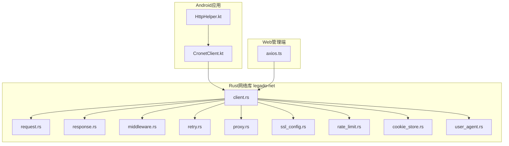
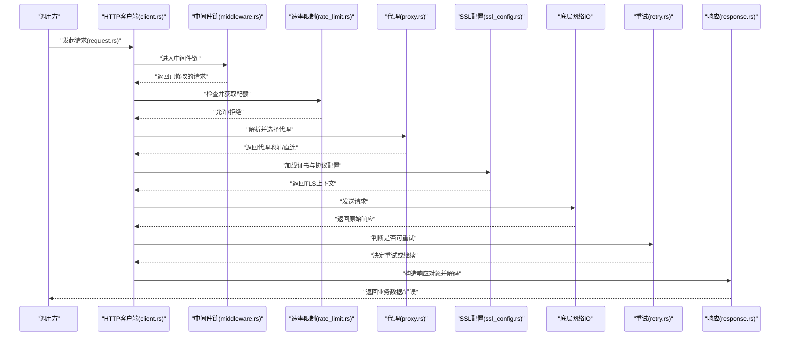
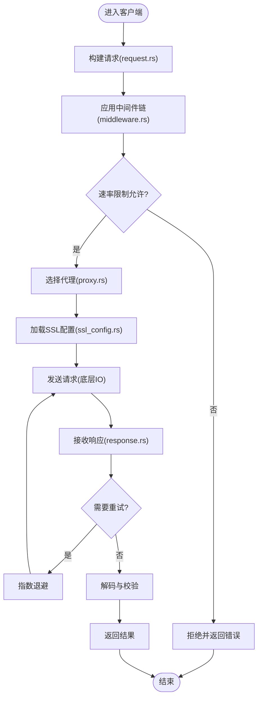
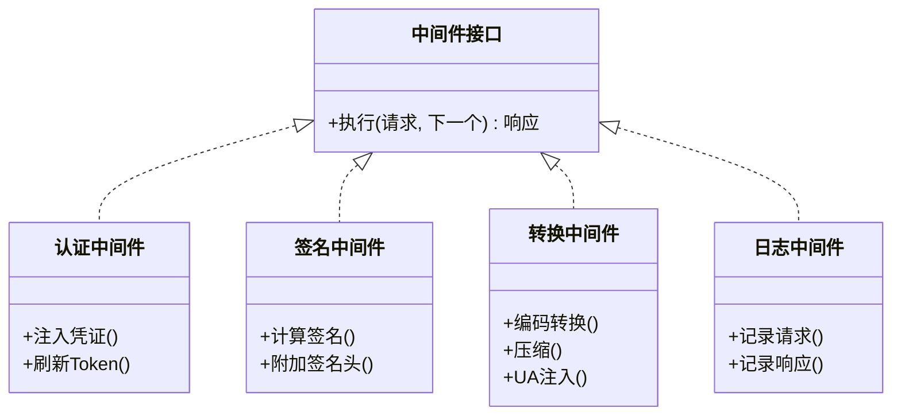
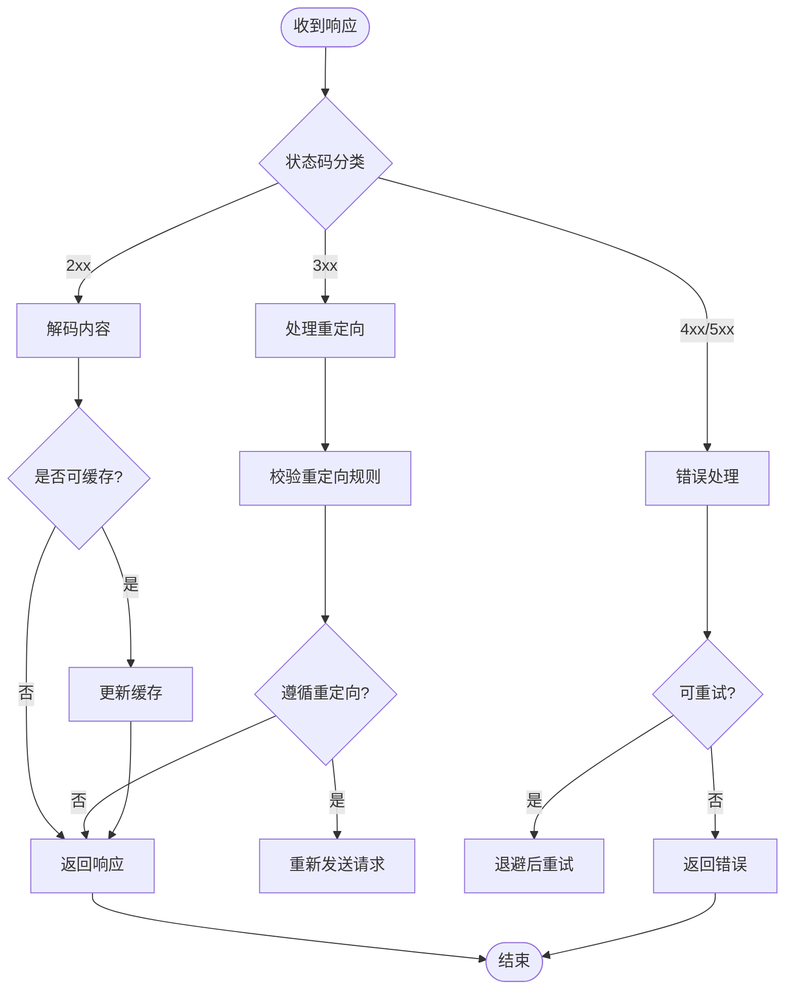
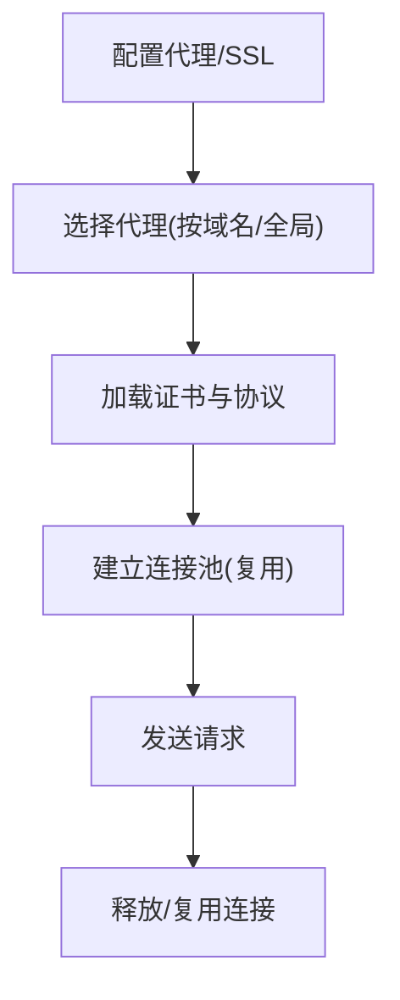
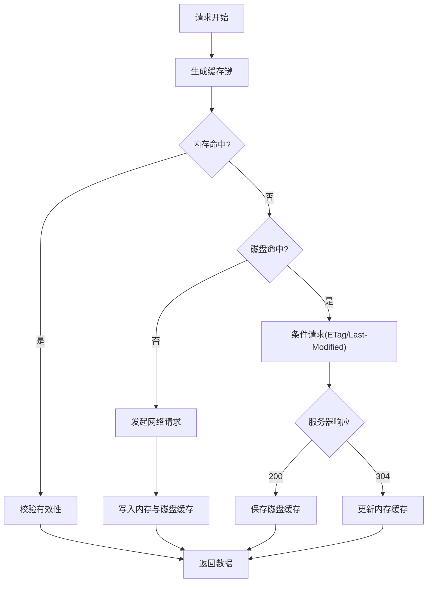
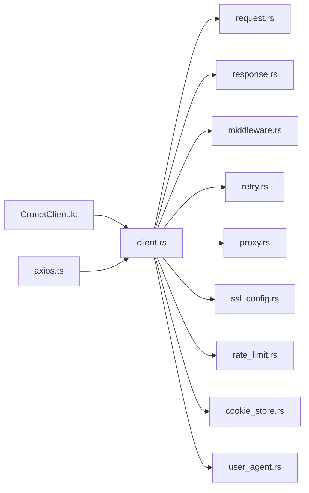

# 网络请求处理

<cite>
**本文引用的文件**   
- [legado-net/src/client.rs](file://rust/legado-net/src/client.rs)
- [legado-net/src/middleware.rs](file://rust/legado-net/src/middleware.rs)
- [legado-net/src/request.rs](file://rust/legado-net/src/request.rs)
- [legado-net/src/response.rs](file://rust/legado-net/src/response.rs)
- [legado-net/src/retry.rs](file://rust/legado-net/src/retry.rs)
- [legado-net/src/proxy.rs](file://rust/legado-net/src/proxy.rs)
- [legado-net/src/ssl_config.rs](file://rust/legado-net/src/ssl_config.rs)
- [legado-net/src/rate_limit.rs](file://rust/legado-net/src/rate_limit.rs)
- [legado-net/src/cookie_store.rs](file://rust/legado-net/src/cookie_store.rs)
- [legado-net/src/user_agent.rs](file://rust/legado-net/src/user_agent.rs)
- [app/src/main/java/io/legado/app/help/http/HttpHelper.kt](file://app/src/main/java/io/legado/app/help/http/HttpHelper.kt)
- [app/src/main/java/io/legado/app/lib/cronet/CronetClient.kt](file://app/src/main/java/io/legado/app/lib/cronet/CronetClient.kt)
- [modules/web/src/api/axios.ts](file://modules/web/src/api/axios.ts)
</cite>

## 目录
1. [简介](#简介)
2. [项目结构](#项目结构)
3. [核心组件](#核心组件)
4. [架构总览](#架构总览)
5. [详细组件分析](#详细组件分析)
6. [依赖关系分析](#依赖关系分析)
7. [性能考量](#性能考量)
8. [故障排除指南](#故障排除指南)
9. [结论](#结论)
10. [附录](#附录)

## 简介
本文件面向Legado项目的网络请求处理子系统，系统性阐述HTTP客户端设计、连接池与并发控制、请求拦截器（中间件）机制、响应处理流程、代理与SSL配置、缓存策略以及调试工具。文档同时覆盖Rust侧的legado-net模块与Android端的Cronet集成，帮助读者从高层到代码层全面理解请求生命周期与关键优化点。

## 项目结构
网络相关能力主要分布在以下位置：
- Rust侧网络库：rust/legado-net/src，包含客户端、请求/响应模型、中间件、重试、代理、SSL、速率限制、Cookie存储、User-Agent等实现。
- Android端HTTP辅助：app/src/main/java/io/legado/app/help/http/HttpHelper.kt，封装常用HTTP调用与错误处理。
- Cronet客户端：app/src/main/java/io/legado/app/lib/cronet/CronetClient.kt，基于Cronet的高性能HTTP客户端。
- Web管理端API：modules/web/src/api/axios.ts，前端对后端服务的HTTP访问封装。

图表来源 
- [legado-net/src/client.rs](file://rust/legado-net/src/client.rs)
- [legado-net/src/request.rs](file://rust/legado-net/src/request.rs)
- [legado-net/src/response.rs](file://rust/legado-net/src/response.rs)
- [legado-net/src/middleware.rs](file://rust/legado-net/src/middleware.rs)
- [legado-net/src/retry.rs](file://rust/legado-net/src/retry.rs)
- [legado-net/src/proxy.rs](file://rust/legado-net/src/proxy.rs)
- [legado-net/src/ssl_config.rs](file://rust/legado-net/src/ssl_config.rs)
- [legado-net/src/rate_limit.rs](file://rust/legado-net/src/rate_limit.rs)
- [legado-net/src/cookie_store.rs](file://rust/legado-net/src/cookie_store.rs)
- [legado-net/src/user_agent.rs](file://rust/legado-net/src/user_agent.rs)
- [app/src/main/java/io/legado/app/help/http/HttpHelper.kt](file://app/src/main/java/io/legado/app/help/http/HttpHelper.kt)
- [app/src/main/java/io/legado/app/lib/cronet/CronetClient.kt](file://app/src/main/java/io/legado/app/lib/cronet/CronetClient.kt)
- [modules/web/src/api/axios.ts](file://modules/web/src/api/axios.ts)

章节来源
- [legado-net/src/client.rs](file://rust/legado-net/src/client.rs)
- [app/src/main/java/io/legado/app/help/http/HttpHelper.kt](file://app/src/main/java/io/legado/app/help/http/HttpHelper.kt)
- [app/src/main/java/io/legado/app/lib/cronet/CronetClient.kt](file://app/src/main/java/io/legado/app/lib/cronet/CronetClient.kt)
- [modules/web/src/api/axios.ts](file://modules/web/src/api/axios.ts)

## 核心组件
- HTTP客户端（client.rs）：统一入口，负责构建请求、执行网络IO、组合中间件链、重试与限流、代理与SSL配置、Cookie与UA注入。
- 请求模型（request.rs）：定义请求方法、URL、头部、体、超时、分块上传、目标域等元数据。
- 响应模型（response.rs）：封装状态码、头部、体、解码结果、错误信息。
- 中间件（middleware.rs）：认证、签名、参数转换、日志、压缩、重定向等横切逻辑。
- 重试（retry.rs）：指数退避、最大次数、可重试错误分类。
- 代理（proxy.rs）：HTTP/SOCKS代理、按域名选择、连接复用。
- SSL配置（ssl_config.rs）：自定义证书、信任锚、协议版本、加密套件。
- 速率限制（rate_limit.rs）：令牌桶/漏桶、每域名或全局限速。
- Cookie存储（cookie_store.rs）：持久化、作用域、过期时间、安全标志。
- User-Agent（user_agent.rs）：动态生成、按源或会话定制。

章节来源
- [legado-net/src/client.rs](file://rust/legado-net/src/client.rs)
- [legado-net/src/request.rs](file://rust/legado-net/src/request.rs)
- [legado-net/src/response.rs](file://rust/legado-net/src/response.rs)
- [legado-net/src/middleware.rs](file://rust/legado-net/src/middleware.rs)
- [legado-net/src/retry.rs](file://rust/legado-net/src/retry.rs)
- [legado-net/src/proxy.rs](file://rust/legado-net/src/proxy.rs)
- [legado-net/src/ssl_config.rs](file://rust/legado-net/src/ssl_config.rs)
- [legado-net/src/rate_limit.rs](file://rust/legado-net/src/rate_limit.rs)
- [legado-net/src/cookie_store.rs](file://rust/legado-net/src/cookie_store.rs)
- [legado-net/src/user_agent.rs](file://rust/legado-net/src/user_agent.rs)

## 架构总览
下图展示一次典型HTTP请求在legado-net中的流转路径，涵盖中间件链、重试、限流、代理与SSL、以及响应解码。

图表来源 
- [legado-net/src/client.rs](file://rust/legado-net/src/client.rs)
- [legado-net/src/middleware.rs](file://rust/legado-net/src/middleware.rs)
- [legado-net/src/rate_limit.rs](file://rust/legado-net/src/rate_limit.rs)
- [legado-net/src/proxy.rs](file://rust/legado-net/src/proxy.rs)
- [legado-net/src/ssl_config.rs](file://rust/legado-net/src/ssl_config.rs)
- [legado-net/src/retry.rs](file://rust/legado-net/src/retry.rs)
- [legado-net/src/response.rs](file://rust/legado-net/src/response.rs)
- [legado-net/src/request.rs](file://rust/legado-net/src/request.rs)

## 详细组件分析

### HTTP客户端与连接池、队列、并发控制
- 连接池：通过底层HTTP引擎（如Cronet或系统网络栈）维护TCP/TLS连接复用，减少握手开销；按域名/代理分组，避免跨域连接污染。
- 请求队列：在高并发场景下，客户端内部可对同域请求进行排队，防止突发流量导致服务端限流或资源耗尽。
- 并发控制：结合速率限制与信号量，限制全局或每域并发度；支持优先级与取消语义，保证关键请求优先。
- 超时与取消：为每个请求设置连接、读写、整体超时；支持上层取消传播至底层IO。

图表来源 
- [legado-net/src/client.rs](file://rust/legado-net/src/client.rs)
- [legado-net/src/request.rs](file://rust/legado-net/src/request.rs)
- [legado-net/src/middleware.rs](file://rust/legado-net/src/middleware.rs)
- [legado-net/src/rate_limit.rs](file://rust/legado-net/src/rate_limit.rs)
- [legado-net/src/proxy.rs](file://rust/legado-net/src/proxy.rs)
- [legado-net/src/ssl_config.rs](file://rust/legado-net/src/ssl_config.rs)
- [legado-net/src/retry.rs](file://rust/legado-net/src/retry.rs)
- [legado-net/src/response.rs](file://rust/legado-net/src/response.rs)

章节来源
- [legado-net/src/client.rs](file://rust/legado-net/src/client.rs)
- [legado-net/src/rate_limit.rs](file://rust/legado-net/src/rate_limit.rs)
- [legado-net/src/proxy.rs](file://rust/legado-net/src/proxy.rs)
- [legado-net/src/ssl_config.rs](file://rust/legado-net/src/ssl_config.rs)
- [legado-net/src/retry.rs](file://rust/legado-net/src/retry.rs)

### 请求拦截器（中间件）机制
- 身份认证：注入Authorization头、Token刷新、OAuth流程回调。
- 参数签名：对URL、Body、时间戳、随机串进行签名计算，附加签名头。
- 请求转换：编码格式切换（JSON/XML）、压缩（gzip/br）、Header标准化、UA注入。
- 日志与审计：记录请求摘要、耗时、错误码，便于问题定位。
- 重定向与跳转：自动跟随3xx，防止循环跳转，保留必要头部。

图表来源 
- [legado-net/src/middleware.rs](file://rust/legado-net/src/middleware.rs)

章节来源
- [legado-net/src/middleware.rs](file://rust/legado-net/src/middleware.rs)

### 响应处理流程
- 状态码处理：区分成功、重定向、客户端错误、服务端错误；对特定状态码触发重试或降级。
- 内容解码：根据Content-Type与编码声明，自动解码文本、二进制、压缩内容。
- 错误重试：依据错误类型（网络抖动、超时、5xx）与策略（次数、间隔）决定是否重试。
- 缓存命中：若启用条件请求（ETag/Last-Modified），优先使用缓存并验证有效性。

图表来源 
- [legado-net/src/response.rs](file://rust/legado-net/src/response.rs)
- [legado-net/src/retry.rs](file://rust/legado-net/src/retry.rs)

章节来源
- [legado-net/src/response.rs](file://rust/legado-net/src/response.rs)
- [legado-net/src/retry.rs](file://rust/legado-net/src/retry.rs)

### 代理与SSL配置
- 代理：支持HTTP与SOCKS代理，可按域名或全局策略选择；连接复用与认证支持。
- SSL：自定义证书、信任锚、协议版本（TLS1.2/1.3）、加密套件白名单；证书固定与校验增强安全性。
- 连接复用：同一代理与TLS上下文的连接池复用，降低握手与协商成本。

图表来源 
- [legado-net/src/proxy.rs](file://rust/legado-net/src/proxy.rs)
- [legado-net/src/ssl_config.rs](file://rust/legado-net/src/ssl_config.rs)

章节来源
- [legado-net/src/proxy.rs](file://rust/legado-net/src/proxy.rs)
- [legado-net/src/ssl_config.rs](file://rust/legado-net/src/ssl_config.rs)

### 缓存策略
- 内存缓存：短TTL热点数据，快速命中，减少网络压力。
- 磁盘缓存：长期有效数据，支持条件请求（ETag/If-None-Match）。
- 条件请求：服务端变更时失效缓存，否则返回304，节省带宽。
- 缓存键：基于URL、查询参数、Header规范化生成稳定键。

图表来源 
- [legado-net/src/client.rs](file://rust/legado-net/src/client.rs)
- [legado-net/src/response.rs](file://rust/legado-net/src/response.rs)

章节来源
- [legado-net/src/client.rs](file://rust/legado-net/src/client.rs)
- [legado-net/src/response.rs](file://rust/legado-net/src/response.rs)

### 调试与监控
- 请求日志：记录URL、方法、头部摘要、耗时、状态码、错误堆栈。
- 抓包分析：通过代理输出完整报文（脱敏敏感字段），便于定位问题。
- 性能监控：统计QPS、延迟分布、失败率、重试率、缓存命中率。
- 诊断工具：提供开关以开启详细日志、导出最近请求快照。

章节来源
- [legado-net/src/middleware.rs](file://rust/legado-net/src/middleware.rs)
- [legado-net/src/client.rs](file://rust/legado-net/src/client.rs)

### Android端集成（Cronet与HttpHelper）
- CronetClient：基于Chromium Cronet的高性能HTTP客户端，具备连接复用、QUIC、HTTP/2等特性。
- HttpHelper：封装常用HTTP调用、错误处理、重试与超时策略，适配Android线程模型。

章节来源
- [app/src/main/java/io/legado/app/lib/cronet/CronetClient.kt](file://app/src/main/java/io/legado/app/lib/cronet/CronetClient.kt)
- [app/src/main/java/io/legado/app/help/http/HttpHelper.kt](file://app/src/main/java/io/legado/app/help/http/HttpHelper.kt)

### Web管理端API（axios封装）
- axios.ts：统一拦截器、基础URL、超时、错误处理、Token注入与重试。

章节来源
- [modules/web/src/api/axios.ts](file://modules/web/src/api/axios.ts)

## 依赖关系分析
legado-net各模块之间的耦合与职责边界清晰，客户端作为编排中心，依赖请求/响应模型、中间件、重试、代理、SSL、限流、Cookie与UA等子模块。Android端通过CronetClient与Rust客户端交互，Web端通过axios与后端服务通信。

图表来源 
- [legado-net/src/client.rs](file://rust/legado-net/src/client.rs)
- [legado-net/src/request.rs](file://rust/legado-net/src/request.rs)
- [legado-net/src/response.rs](file://rust/legado-net/src/response.rs)
- [legado-net/src/middleware.rs](file://rust/legado-net/src/middleware.rs)
- [legado-net/src/retry.rs](file://rust/legado-net/src/retry.rs)
- [legado-net/src/proxy.rs](file://rust/legado-net/src/proxy.rs)
- [legado-net/src/ssl_config.rs](file://rust/legado-net/src/ssl_config.rs)
- [legado-net/src/rate_limit.rs](file://rust/legado-net/src/rate_limit.rs)
- [legado-net/src/cookie_store.rs](file://rust/legado-net/src/cookie_store.rs)
- [legado-net/src/user_agent.rs](file://rust/legado-net/src/user_agent.rs)
- [app/src/main/java/io/legado/app/lib/cronet/CronetClient.kt](file://app/src/main/java/io/legado/app/lib/cronet/CronetClient.kt)
- [modules/web/src/api/axios.ts](file://modules/web/src/api/axios.ts)

章节来源
- [legado-net/src/client.rs](file://rust/legado-net/src/client.rs)
- [app/src/main/java/io/legado/app/lib/cronet/CronetClient.kt](file://app/src/main/java/io/legado/app/lib/cronet/CronetClient.kt)
- [modules/web/src/api/axios.ts](file://modules/web/src/api/axios.ts)

## 性能考量
- 连接复用：优先复用TCP/TLS连接，减少握手与协商开销。
- 并发控制：合理设置全局与每域并发上限，避免拥塞。
- 压缩传输：启用gzip/br压缩，降低带宽占用。
- 缓存命中：提高内存与磁盘缓存命中率，减少重复请求。
- 重试策略：指数退避与最大次数限制，避免雪崩。
- 超时设置：细粒度超时（连接、读、写、整体），快速失败。

[本节为通用指导，不直接分析具体文件]

## 故障排除指南
- 常见问题
  - 证书错误：检查自定义证书与信任锚配置，确认TLS版本与套件兼容。
  - 代理失败：验证代理地址、认证信息与权限，检查防火墙与DNS解析。
  - 频繁重试：调整重试阈值与退避策略，识别服务端限流或错误码。
  - 缓存异常：清理缓存键冲突，确保条件请求头正确。
- 诊断步骤
  - 开启详细日志，捕获请求/响应摘要与错误堆栈。
  - 使用抓包工具导出报文，比对头部与体内容。
  - 检查速率限制与并发配置，避免超限。
  - 逐步禁用中间件，定位问题环节。

章节来源
- [legado-net/src/ssl_config.rs](file://rust/legado-net/src/ssl_config.rs)
- [legado-net/src/proxy.rs](file://rust/legado-net/src/proxy.rs)
- [legado-net/src/retry.rs](file://rust/legado-net/src/retry.rs)
- [legado-net/src/middleware.rs](file://rust/legado-net/src/middleware.rs)
- [legado-net/src/client.rs](file://rust/legado-net/src/client.rs)

## 结论
legado-net通过清晰的模块化设计与强大的中间件机制，实现了高可用、高性能、可扩展的网络请求处理能力。结合Android端Cronet与Web端axios封装，形成端到端的HTTP解决方案。建议在生产环境中合理配置代理、SSL、缓存与重试策略，并通过日志与监控持续优化性能与稳定性。

[本节为总结性内容，不直接分析具体文件]

## 附录
- 示例用法
  - Android端：通过HttpHelper发起GET/POST请求，设置超时与重试，处理错误与响应。
  - Cronet客户端：配置连接池与HTTP/2，启用QUIC提升性能。
  - Web端：使用axios封装统一拦截器，注入Token与签名。
- 最佳实践
  - 明确超时与取消策略，避免资源泄漏。
  - 合理使用缓存与条件请求，降低带宽与延迟。
  - 精细化中间件链，避免不必要的处理开销。
  - 定期审查代理与SSL配置，确保安全与兼容性。

[本节为补充说明，不直接分析具体文件]