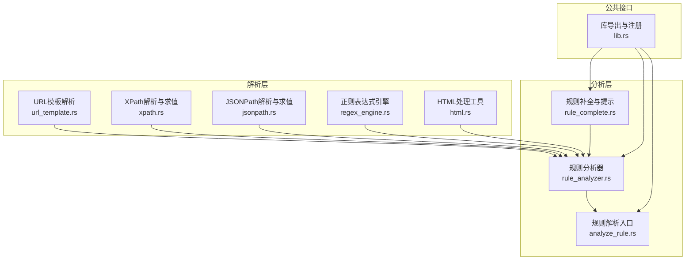
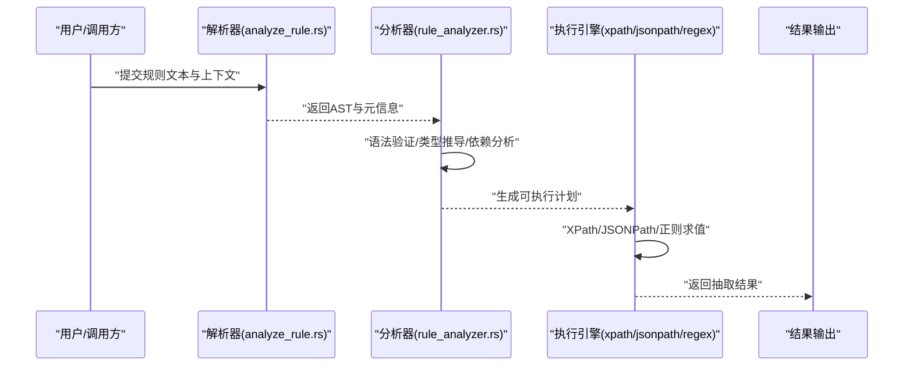
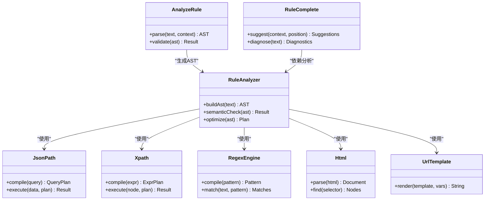

# 规则引擎核心

<cite>
**本文档引用的文件**   
- [analyze_rule.rs](file://rust/legado-parser/src/analyze_rule.rs)
- [rule_analyzer.rs](file://rust/legado-parser/src/rule_analyzer.rs)
- [rule_complete.rs](file://rust/legado-parser/src/rule_complete.rs)
- [jsonpath.rs](file://rust/legado-parser/src/jsonpath.rs)
- [xpath.rs](file://rust/legado-parser/src/xpath.rs)
- [regex_engine.rs](file://rust/legado-parser/src/regex_engine.rs)
- [html.rs](file://rust/legado-parser/src/html.rs)
- [lib.rs](file://rust/legado-parser/src/lib.rs)
- [url_template.rs](file://rust/legado-net/src/url_template.rs)
</cite>

## 目录
1. [简介](#简介)
2. [项目结构](#项目结构)
3. [核心组件](#核心组件)
4. [架构总览](#架构总览)
5. [详细组件分析](#详细组件分析)
6. [依赖分析](#依赖分析)
7. [性能考虑](#性能考虑)
8. [故障排查指南](#故障排查指南)
9. [结论](#结论)
10. [附录](#附录)

## 简介
本文件面向Legado项目的规则引擎核心，聚焦于规则解析器与规则分析器的实现机制，覆盖URL模板语法、XPath表达式、JSONPath查询、正则表达式匹配等关键能力；同时阐述AST构建、语法验证、性能优化策略，以及规则补全与智能提示系统。文档还包含规则缓存与编译机制的说明、编写指南与最佳实践，并给出示例与测试用例的组织方式，帮助读者快速理解与高效使用规则引擎。

## 项目结构
规则引擎核心位于Rust模块legado-parser中，围绕“解析-分析-执行”的主线组织：
- 解析层：负责将规则文本转换为结构化表示（如AST），包括URL模板、XPath、JSONPath、正则表达式等。
- 分析层：对AST进行语义校验、类型推导、依赖分析与优化准备。
- 执行层：在运行时基于AST或预编译产物执行规则，完成数据抽取与转换。
- 辅助能力：HTML处理、URL模板渲染、错误诊断与补全提示。

图表来源
- [lib.rs](file://rust/legado-parser/src/lib.rs)
- [analyze_rule.rs](file://rust/legado-parser/src/analyze_rule.rs)
- [rule_analyzer.rs](file://rust/legado-parser/src/rule_analyzer.rs)
- [rule_complete.rs](file://rust/legado-parser/src/rule_complete.rs)
- [jsonpath.rs](file://rust/legado-parser/src/jsonpath.rs)
- [xpath.rs](file://rust/legado-parser/src/xpath.rs)
- [regex_engine.rs](file://rust/legado-parser/src/regex_engine.rs)
- [html.rs](file://rust/legado-parser/src/html.rs)
- [url_template.rs](file://rust/legado-net/src/url_template.rs)

章节来源
- [lib.rs](file://rust/legado-parser/src/lib.rs)
- [analyze_rule.rs](file://rust/legado-parser/src/analyze_rule.rs)
- [rule_analyzer.rs](file://rust/legado-parser/src/rule_analyzer.rs)
- [rule_complete.rs](file://rust/legado-parser/src/rule_complete.rs)
- [jsonpath.rs](file://rust/legado-parser/src/jsonpath.rs)
- [xpath.rs](file://rust/legado-parser/src/xpath.rs)
- [regex_engine.rs](file://rust/legado-parser/src/regex_engine.rs)
- [html.rs](file://rust/legado-parser/src/html.rs)
- [url_template.rs](file://rust/legado-net/src/url_template.rs)

## 核心组件
- URL模板解析与渲染：支持变量替换、路径片段拼接、查询参数构造，用于动态生成请求URL。
- XPath表达式：对HTML/XML文档进行节点定位与内容提取，支持常用函数与轴操作。
- JSONPath查询：对JSON数据进行路径式选择与过滤，便于API响应解析。
- 正则表达式匹配：提供高性能模式匹配与捕获组提取，用于复杂文本抽取。
- HTML处理：DOM树构建、清理与遍历，为XPath与内容抽取提供基础。
- 规则分析器：对规则AST进行语义检查、类型推断、依赖关系分析，输出可执行计划。
- 规则补全与提示：基于上下文提供自动完成、错误检测与建议，提升编写体验。
- 库导出：统一对外暴露解析、分析、执行与补全能力。

章节来源
- [analyze_rule.rs](file://rust/legado-parser/src/analyze_rule.rs)
- [rule_analyzer.rs](file://rust/legado-parser/src/rule_analyzer.rs)
- [rule_complete.rs](file://rust/legado-parser/src/rule_complete.rs)
- [jsonpath.rs](file://rust/legado-parser/src/jsonpath.rs)
- [xpath.rs](file://rust/legado-parser/src/xpath.rs)
- [regex_engine.rs](file://rust/legado-parser/src/regex_engine.rs)
- [html.rs](file://rust/legado-parser/src/html.rs)
- [url_template.rs](file://rust/legado-net/src/url_template.rs)

## 架构总览
规则引擎采用分层设计，输入为规则文本与上下文数据，经解析与分析后生成可执行计划，最终在运行期高效执行。

图表来源
- [analyze_rule.rs](file://rust/legado-parser/src/analyze_rule.rs)
- [rule_analyzer.rs](file://rust/legado-parser/src/rule_analyzer.rs)
- [jsonpath.rs](file://rust/legado-parser/src/jsonpath.rs)
- [xpath.rs](file://rust/legado-parser/src/xpath.rs)
- [regex_engine.rs](file://rust/legado-parser/src/regex_engine.rs)

## 详细组件分析

### URL模板解析与渲染
- 功能要点：
  - 变量占位符识别与替换，支持嵌套对象字段访问。
  - 路径片段拼接与编码处理，避免非法字符。
  - 查询参数构建与排序，支持数组与多值参数。
  - 条件片段与默认值处理，增强模板鲁棒性。
- 性能优化：
  - 模板编译为中间表示，减少重复解析开销。
  - 字符串构建采用缓冲复用，降低内存分配。
- 错误处理：
  - 未定义变量报错并提供缺失字段建议。
  - 非法字符编码失败时回退到安全转义。

章节来源
- [url_template.rs](file://rust/legado-net/src/url_template.rs)

### XPath表达式解析与求值
- 功能要点：
  - 支持常用轴、谓词、函数与运算符。
  - 对HTML DOM树进行节点定位与属性/文本抽取。
  - 支持命名空间与上下文节点切换。
- 性能优化：
  - 表达式编译为执行计划，避免重复解析。
  - 节点遍历采用迭代与短路策略，减少不必要的扫描。
- 错误处理：
  - 语法错误定位行号与位置。
  - 节点不存在时返回空集合而非异常。

章节来源
- [xpath.rs](file://rust/legado-parser/src/xpath.rs)

### JSONPath查询解析与求值
- 功能要点：
  - 路径选择、过滤器、递归下降与通配符。
  - 支持数组索引、范围切片与键名访问。
  - 内置函数扩展（长度、过滤、映射）。
- 性能优化：
  - 查询编译为指令序列，减少解释开销。
  - 大对象采用惰性求值与流式处理。
- 错误处理：
  - 非法路径与类型不匹配时报错并提示修正建议。

章节来源
- [jsonpath.rs](file://rust/legado-parser/src/jsonpath.rs)

### 正则表达式匹配
- 功能要点：
  - 模式编译与缓存，支持捕获组与命名组。
  - 多行匹配与Unicode支持。
  - 与HTML/JSON数据的集成抽取。
- 性能优化：
  - 模式预编译与共享实例，避免重复构建。
  - 匹配失败快速路径，减少回溯。
- 错误处理：
  - 非法模式抛出明确错误信息。
  - 超时保护防止灾难性回溯。

章节来源
- [regex_engine.rs](file://rust/legado-parser/src/regex_engine.rs)

### HTML处理工具
- 功能要点：
  - HTML解析为DOM树，支持容错与清洗。
  - 节点查找、属性读取与文本提取。
  - 与XPath引擎无缝对接。
- 性能优化：
  - 增量解析与懒加载，降低内存占用。
  - 常用节点索引加速查询。
- 错误处理：
  - 损坏HTML降级处理，保证可用性。

章节来源
- [html.rs](file://rust/legado-parser/src/html.rs)

### 规则分析器（AST构建、语法验证、性能优化）
- AST构建：
  - 将规则文本解析为抽象语法树，节点类型涵盖URL模板、XPath、JSONPath、正则等。
  - 节点携带位置信息与上下文，便于错误定位与补全。
- 语法验证：
  - 类型检查与依赖分析，确保表达式可执行。
  - 冲突检测与冗余消除，提升稳定性。
- 性能优化：
  - 常量折叠与子表达式提取。
  - 执行计划生成，支持并行求值与短路。
- 错误处理：
  - 结构化错误报告，包含建议与修复方案。

章节来源
- [rule_analyzer.rs](file://rust/legado-parser/src/rule_analyzer.rs)
- [analyze_rule.rs](file://rust/legado-parser/src/analyze_rule.rs)

### 规则补全与智能提示
- 自动完成：
  - 基于上下文提供字段名、函数名与关键字建议。
  - 支持模板变量与XPath轴的智能填充。
- 错误检测：
  - 实时语法与类型检查，高亮问题位置。
  - 提供常见错误的修复建议。
- 上下文感知：
  - 根据数据模型与历史用法调整建议优先级。
  - 支持自定义词典与规则模板。

章节来源
- [rule_complete.rs](file://rust/legado-parser/src/rule_complete.rs)

### 库导出与统一接口
- 对外暴露解析、分析、执行与补全能力。
- 统一错误类型与日志记录。
- 提供配置项以启用/禁用特性。

章节来源
- [lib.rs](file://rust/legado-parser/src/lib.rs)

## 依赖分析
规则引擎各组件之间的依赖关系如下：

图表来源
- [analyze_rule.rs](file://rust/legado-parser/src/analyze_rule.rs)
- [rule_analyzer.rs](file://rust/legado-parser/src/rule_analyzer.rs)
- [rule_complete.rs](file://rust/legado-parser/src/rule_complete.rs)
- [jsonpath.rs](file://rust/legado-parser/src/jsonpath.rs)
- [xpath.rs](file://rust/legado-parser/src/xpath.rs)
- [regex_engine.rs](file://rust/legado-parser/src/regex_engine.rs)
- [html.rs](file://rust/legado-parser/src/html.rs)
- [url_template.rs](file://rust/legado-net/src/url_template.rs)

章节来源
- [analyze_rule.rs](file://rust/legado-parser/src/analyze_rule.rs)
- [rule_analyzer.rs](file://rust/legado-parser/src/rule_analyzer.rs)
- [rule_complete.rs](file://rust/legado-parser/src/rule_complete.rs)
- [jsonpath.rs](file://rust/legado-parser/src/jsonpath.rs)
- [xpath.rs](file://rust/legado-parser/src/xpath.rs)
- [regex_engine.rs](file://rust/legado-parser/src/regex_engine.rs)
- [html.rs](file://rust/legado-parser/src/html.rs)
- [url_template.rs](file://rust/legado-net/src/url_template.rs)

## 性能考虑
- 预编译与缓存：
  - 将XPath、JSONPath、正则表达式编译为可重用计划，避免重复解析。
  - URL模板渲染结果按输入签名缓存，命中即返回。
- 内存管理：
  - 使用对象池与缓冲区复用，减少GC压力。
  - 大文档采用流式处理与惰性求值。
- 版本控制：
  - 规则版本与编译产物绑定，升级时增量更新。
  - 缓存失效策略基于哈希与时间戳。
- 并发与隔离：
  - 规则执行在独立作用域内运行，避免状态污染。
  - 支持并行求值与短路，提升吞吐。

[本节为通用指导，无需特定文件引用]

## 故障排查指南
- 常见问题：
  - XPath表达式语法错误：检查轴与谓词是否正确，确认节点存在。
  - JSONPath路径无效：核对键名与数组索引，避免类型不匹配。
  - 正则表达式灾难性回溯：简化模式或使用非贪婪匹配。
  - URL模板变量缺失：确保所有占位符都有对应值。
- 调试技巧：
  - 启用详细日志，查看AST与执行计划。
  - 使用断点与单步执行定位问题。
  - 借助补全与诊断工具快速修复。
- 恢复策略：
  - 降级到默认规则或备用数据源。
  - 重试与超时控制，避免阻塞。

章节来源
- [rule_analyzer.rs](file://rust/legado-parser/src/rule_analyzer.rs)
- [rule_complete.rs](file://rust/legado-parser/src/rule_complete.rs)

## 结论
Legado规则引擎通过分层设计与模块化实现，提供了强大的URL模板、XPath、JSONPath与正则表达式能力。其AST构建、语义验证与优化策略确保了规则的可维护性与高性能。规则补全与智能提示显著提升了开发体验。结合缓存、版本控制与并发隔离，系统在复杂场景下依然稳定可靠。遵循本文的编写指南与最佳实践，可有效提升规则质量与执行效率。

[本节为总结，无需特定文件引用]

## 附录
- 规则编写指南：
  - 优先使用XPath与JSONPath进行结构化数据抽取，避免过度依赖正则。
  - 合理拆分复杂规则，提高可读性与可维护性。
  - 使用模板变量与默认值，增强鲁棒性。
- 常用模式：
  - 列表分页：基于URL模板构建分页链接。
  - 内容抽取：XPath定位标题、正文与图片。
  - API解析：JSONPath提取字段与嵌套对象。
  - 文本清洗：正则去除广告与无关内容。
- 测试用例组织：
  - 单元测试覆盖解析、分析与执行路径。
  - 集成测试模拟真实数据与网络环境。
  - 回归测试确保规则升级不破坏兼容性。

[本节为通用指导，无需特定文件引用]