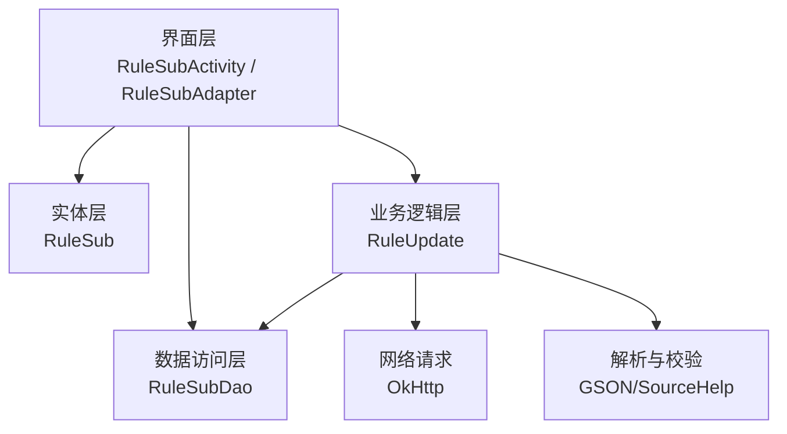
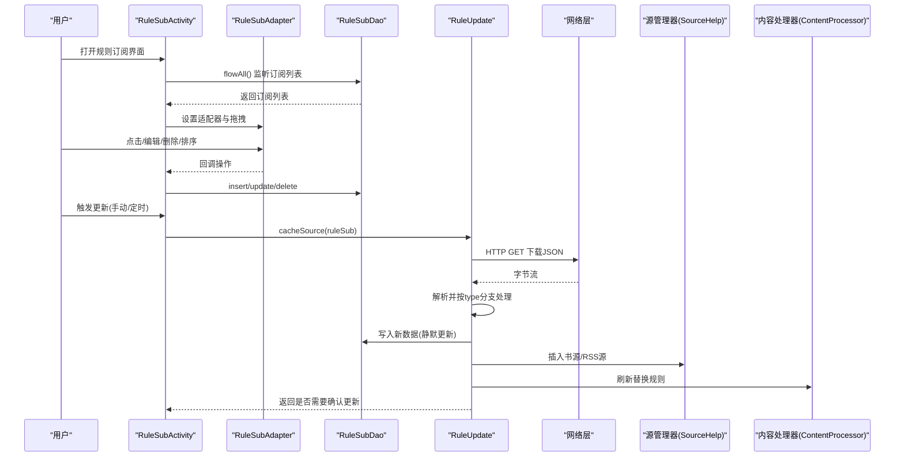
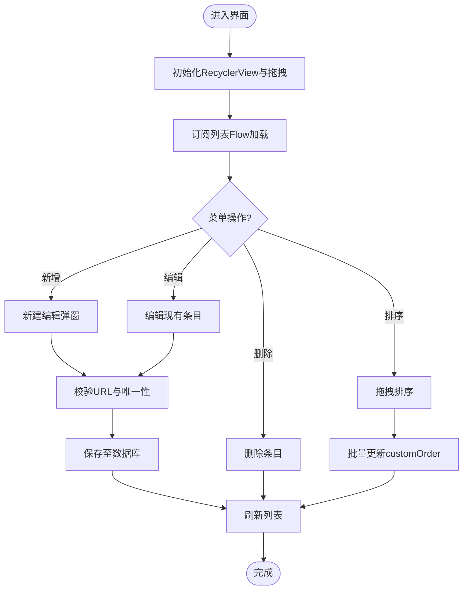
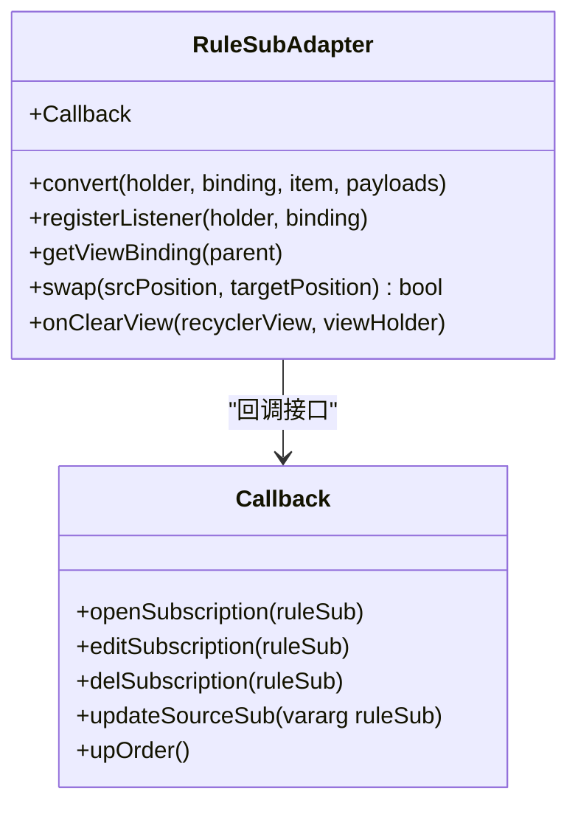
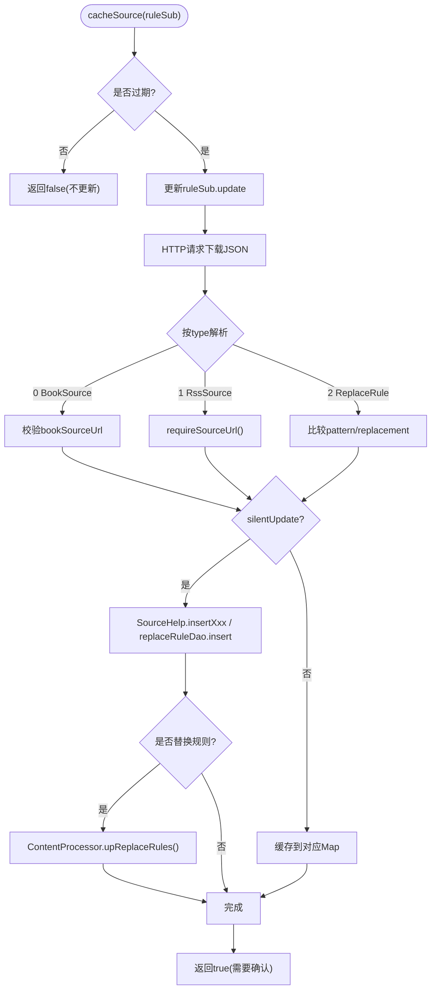
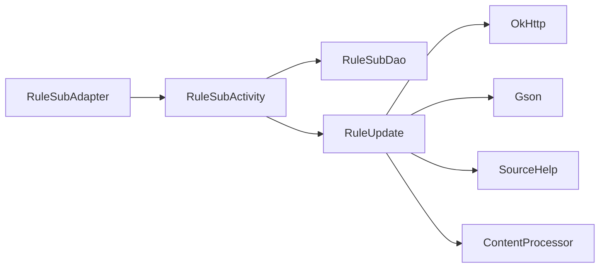

# 规则订阅管理系统

<cite>
**本文引用的文件**   
- [RuleSubActivity.kt](file://app/src/main/java/io/legado/app/ui/rss/subscription/RuleSubActivity.kt)
- [RuleSubAdapter.kt](file://app/src/main/java/io/legado/app/ui/rss/subscription/RuleSubAdapter.kt)
- [RuleSubDao.kt](file://app/src/main/java/io/legado/app/data/dao/RuleSubDao.kt)
- [RuleSub.kt](file://app/src/main/java/io/legado/app/data/entities/RuleSub.kt)
- [RuleUpdate.kt](file://app/src/main/java/io/legado/app/model/RuleUpdate.kt)
</cite>

## 目录
1. [简介](#简介)
2. [项目结构](#项目结构)
3. [核心组件](#核心组件)
4. [架构总览](#架构总览)
5. [详细组件分析](#详细组件分析)
6. [依赖分析](#依赖分析)
7. [性能考虑](#性能考虑)
8. [故障排查指南](#故障排查指南)
9. [结论](#结论)

## 简介
本文件围绕“规则订阅管理”功能进行系统化文档化，覆盖界面交互、数据持久化、网络拉取与更新策略等关键环节。该能力支持三类规则的订阅与增量更新：书源、RSS订阅源、替换规则。用户可在界面中新增、编辑、删除、排序订阅项，并配置自动更新策略；系统根据配置定时或手动触发远程拉取，按版本或内容差异进行静默或交互式更新。

## 项目结构
规则订阅管理主要涉及以下层次：
- 界面层：活动页与列表适配器，负责展示、编辑、拖拽排序与操作回调
- 数据访问层：Room DAO，提供查询、插入、更新、删除等操作
- 实体层：订阅项数据模型，包含类型、URL、更新策略等字段
- 业务逻辑层：规则更新器，负责网络请求、解析、去重与入库

图表来源
- [RuleSubActivity.kt:1-197](file://app/src/main/java/io/legado/app/ui/rss/subscription/RuleSubActivity.kt#L1-L197)
- [RuleSubAdapter.kt:1-95](file://app/src/main/java/io/legado/app/ui/rss/subscription/RuleSubAdapter.kt#L1-L95)
- [RuleSubDao.kt:1-30](file://app/src/main/java/io/legado/app/data/dao/RuleSubDao.kt#L1-L30)
- [RuleSub.kt:1-38](file://app/src/main/java/io/legado/app/data/entities/RuleSub.kt#L1-L38)
- [RuleUpdate.kt:1-110](file://app/src/main/java/io/legado/app/model/RuleUpdate.kt#L1-L110)

章节来源
- [RuleSubActivity.kt:1-197](file://app/src/main/java/io/legado/app/ui/rss/subscription/RuleSubActivity.kt#L1-L197)
- [RuleSubAdapter.kt:1-95](file://app/src/main/java/io/legado/app/ui/rss/subscription/RuleSubAdapter.kt#L1-L95)
- [RuleSubDao.kt:1-30](file://app/src/main/java/io/legado/app/data/dao/RuleSubDao.kt#L1-L30)
- [RuleSub.kt:1-38](file://app/src/main/java/io/legado/app/data/entities/RuleSub.kt#L1-L38)
- [RuleUpdate.kt:1-110](file://app/src/main/java/io/legado/app/model/RuleUpdate.kt#L1-L110)

## 核心组件
- 界面活动（RuleSubActivity）
  - 负责初始化RecyclerView、ItemTouchHelper拖拽排序、菜单新增、弹窗编辑、删除与批量更新顺序
  - 通过Flow监听数据库变化，驱动UI刷新
  - 打开订阅时根据type分发到不同导入对话框（书源/RSS/替换规则）
- 列表适配器（RuleSubAdapter）
  - 渲染订阅项名称、类型、URL
  - 处理点击、编辑、更多菜单（删除）、拖拽交换位置
  - 维护移动集合，在视图清理时批量更新customOrder
- 数据访问（RuleSubDao）
  - 提供all、flowAll、maxOrder、findByUrl、insert、delete、update等方法
  - 使用Room注解生成SQL，支持Flow响应式查询
- 实体模型（RuleSub）
  - 包含id、name、url、type（0书源/1订阅源/2替换规则）、customOrder、autoUpdate、updateInterval、silentUpdate、js/showRule/sourceUrl等
- 更新器（RuleUpdate）
  - 基于update与updateInterval判断是否过期
  - 发起HTTP请求获取JSON数组，按type分别解析为BookSource/RssSource/ReplaceRule
  - 对比本地版本或内容差异，支持静默更新或缓存待确认更新
  - 更新替换规则后调用ContentProcessor刷新全局替换规则

章节来源
- [RuleSubActivity.kt:1-197](file://app/src/main/java/io/legado/app/ui/rss/subscription/RuleSubActivity.kt#L1-L197)
- [RuleSubAdapter.kt:1-95](file://app/src/main/java/io/legado/app/ui/rss/subscription/RuleSubAdapter.kt#L1-L95)
- [RuleSubDao.kt:1-30](file://app/src/main/java/io/legado/app/data/dao/RuleSubDao.kt#L1-L30)
- [RuleSub.kt:1-38](file://app/src/main/java/io/legado/app/data/entities/RuleSub.kt#L1-L38)
- [RuleUpdate.kt:1-110](file://app/src/main/java/io/legado/app/model/RuleUpdate.kt#L1-L110)

## 架构总览
下图展示了从用户操作到数据落库与网络更新的完整流程。

图表来源
- [RuleSubActivity.kt:1-197](file://app/src/main/java/io/legado/app/ui/rss/subscription/RuleSubActivity.kt#L1-L197)
- [RuleSubAdapter.kt:1-95](file://app/src/main/java/io/legado/app/ui/rss/subscription/RuleSubAdapter.kt#L1-L95)
- [RuleSubDao.kt:1-30](file://app/src/main/java/io/legado/app/data/dao/RuleSubDao.kt#L1-L30)
- [RuleUpdate.kt:1-110](file://app/src/main/java/io/legado/app/model/RuleUpdate.kt#L1-L110)

## 详细组件分析

### 界面与交互（RuleSubActivity）
- 初始化与数据绑定
  - 设置RecyclerView与ItemTouchHelper，启用拖拽排序
  - 通过Flow订阅数据库变更，空态提示控制显示
- 菜单与新增
  - 新增时计算最大order+1，弹出编辑弹窗
- 编辑弹窗
  - 类型选择、名称、URL、自动更新开关、静默更新开关、更新间隔
  - 输入校验：URL非空、URL唯一性检查
  - 保存时写入数据库
- 删除与排序
  - 删除直接调用DAO
  - 拖拽结束后统一更新customOrder

图表来源
- [RuleSubActivity.kt:1-197](file://app/src/main/java/io/legado/app/ui/rss/subscription/RuleSubActivity.kt#L1-L197)

章节来源
- [RuleSubActivity.kt:1-197](file://app/src/main/java/io/legado/app/ui/rss/subscription/RuleSubActivity.kt#L1-L197)

### 列表适配器（RuleSubAdapter）
- 渲染：类型映射、名称、URL
- 交互：点击打开订阅、编辑、更多菜单删除
- 拖拽：交换位置，记录movedItems，onClearView时批量更新customOrder

图表来源
- [RuleSubAdapter.kt:1-95](file://app/src/main/java/io/legado/app/ui/rss/subscription/RuleSubAdapter.kt#L1-L95)

章节来源
- [RuleSubAdapter.kt:1-95](file://app/src/main/java/io/legado/app/ui/rss/subscription/RuleSubAdapter.kt#L1-L95)

### 数据访问（RuleSubDao）
- all：按customOrder排序读取全部
- flowAll：响应式列表
- maxOrder：用于新增排序
- findByUrl：唯一性校验
- insert/delete/update：CRUD操作

章节来源
- [RuleSubDao.kt:1-30](file://app/src/main/java/io/legado/app/data/dao/RuleSubDao.kt#L1-L30)

### 实体模型（RuleSub）
- id：自增主键
- name/url/type：基础信息，type区分书源/订阅源/替换规则
- customOrder：自定义排序
- autoUpdate/silentUpdate/updateInterval：自动更新策略
- update：上次更新时间戳
- js/showRule/sourceUrl：扩展字段，支持前置JS、显示规则与绑定源链接

章节来源
- [RuleSub.kt:1-38](file://app/src/main/java/io/legado/app/data/entities/RuleSub.kt#L1-L38)

### 更新器（RuleUpdate）
- 过期判断：update + updateInterval*3600*1000 > now
- 网络请求：支持UA覆盖（requestWithoutUA后缀）
- 解析与校验：
  - type=0：BookSource数组，校验bookSourceUrl非空
  - type=1：RssSource数组，要求sourceUrl存在
  - type=2：ReplaceRule数组，比较pattern/replacement差异
- 更新策略：
  - 静默更新：直接写入数据库并调用SourceHelp.insertXxx
  - 非静默：缓存到对应Map，等待用户确认
- 后置处理：替换规则更新后调用ContentProcessor.upReplaceRules()

图表来源
- [RuleUpdate.kt:1-110](file://app/src/main/java/io/legado/app/model/RuleUpdate.kt#L1-L110)

章节来源
- [RuleUpdate.kt:1-110](file://app/src/main/java/io/legado/app/model/RuleUpdate.kt#L1-L110)

## 依赖分析
- 组件耦合
  - RuleSubActivity依赖RuleSubDao进行数据读写，依赖RuleUpdate执行更新逻辑
  - RuleSubAdapter仅依赖RuleSub实体与回调接口，低耦合
  - RuleUpdate依赖网络层、GSON解析、SourceHelp与ContentProcessor
- 外部依赖
  - OkHttp用于网络请求
  - Room用于数据库访问
  - Gson用于JSON序列化/反序列化
- 潜在循环依赖
  - 当前无循环引用，职责清晰

图表来源
- [RuleSubActivity.kt:1-197](file://app/src/main/java/io/legado/app/ui/rss/subscription/RuleSubActivity.kt#L1-L197)
- [RuleSubAdapter.kt:1-95](file://app/src/main/java/io/legado/app/ui/rss/subscription/RuleSubAdapter.kt#L1-L95)
- [RuleSubDao.kt:1-30](file://app/src/main/java/io/legado/app/data/dao/RuleSubDao.kt#L1-L30)
- [RuleUpdate.kt:1-110](file://app/src/main/java/io/legado/app/model/RuleUpdate.kt#L1-L110)

章节来源
- [RuleSubActivity.kt:1-197](file://app/src/main/java/io/legado/app/ui/rss/subscription/RuleSubActivity.kt#L1-L197)
- [RuleSubAdapter.kt:1-95](file://app/src/main/java/io/legado/app/ui/rss/subscription/RuleSubAdapter.kt#L1-L95)
- [RuleSubDao.kt:1-30](file://app/src/main/java/io/legado/app/data/dao/RuleSubDao.kt#L1-L30)
- [RuleUpdate.kt:1-110](file://app/src/main/java/io/legado/app/model/RuleUpdate.kt#L1-L110)

## 性能考虑
- 列表加载
  - 使用Flow响应式加载，配合conflate减少高频更新导致的频繁UI刷新
- 拖拽排序
  - 延迟批量更新customOrder，避免多次IO
- 网络请求
  - 按需解压与流式处理，避免大对象驻留内存
- 更新策略
  - 基于时间窗口的过期判断减少无效请求
  - 静默更新跳过用户交互，提升自动化效率

[本节为通用指导，不直接分析具体文件]

## 故障排查指南
- URL为空或重复
  - 现象：保存失败或提示URL已存在
  - 排查：检查输入框与DAO的findByUrl逻辑
- 自动更新未生效
  - 现象：订阅未更新
  - 排查：确认updateInterval与update时间戳计算是否正确；检查silentUpdate与缓存Map
- 解析异常
  - 现象：JSON解析失败或类型不匹配
  - 排查：检查服务端返回格式是否符合BookSource/RssSource/ReplaceRule约定
- 替换规则未生效
  - 现象：替换规则未应用
  - 排查：确认ContentProcessor.upReplaceRules()被调用

章节来源
- [RuleSubActivity.kt:1-197](file://app/src/main/java/io/legado/app/ui/rss/subscription/RuleSubActivity.kt#L1-L197)
- [RuleSubDao.kt:1-30](file://app/src/main/java/io/legado/app/data/dao/RuleSubDao.kt#L1-L30)
- [RuleUpdate.kt:1-110](file://app/src/main/java/io/legado/app/model/RuleUpdate.kt#L1-L110)

## 结论
规则订阅管理系统以清晰的分层架构实现订阅项的增删改查、排序与自动更新。界面层与数据层解耦良好，更新器具备完善的过期判断、解析校验与差异化更新能力。建议后续可补充错误重试、断点续传与更细粒度的更新日志，以提升稳定性与可观测性。