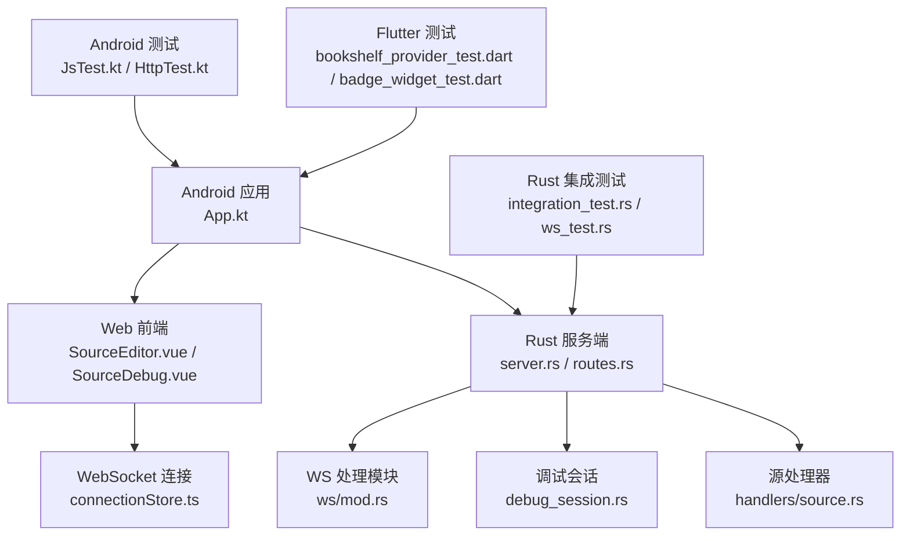
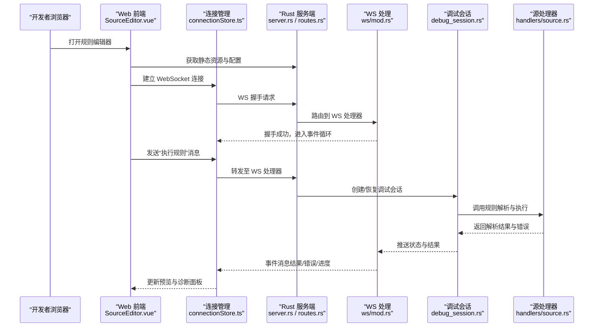
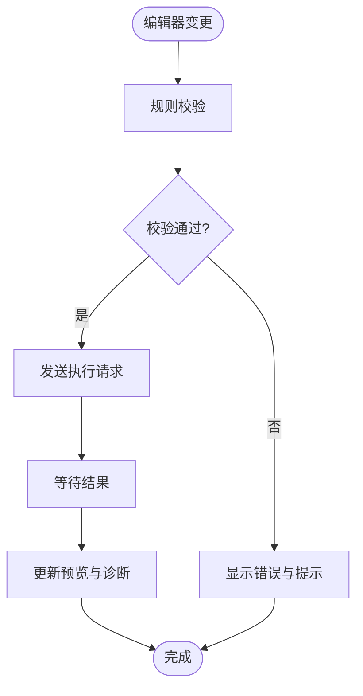
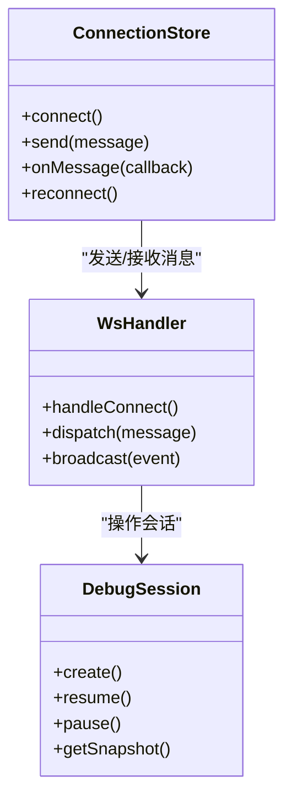
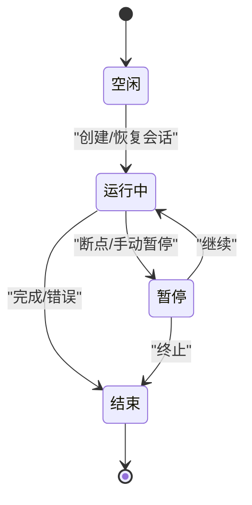
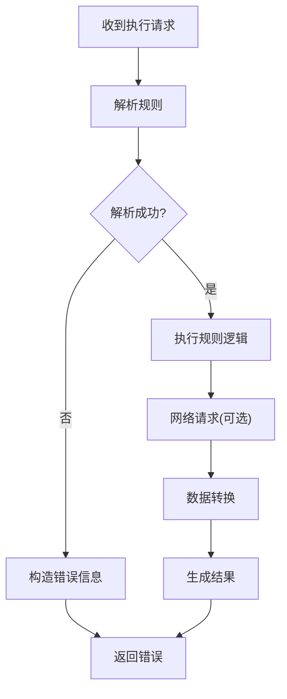
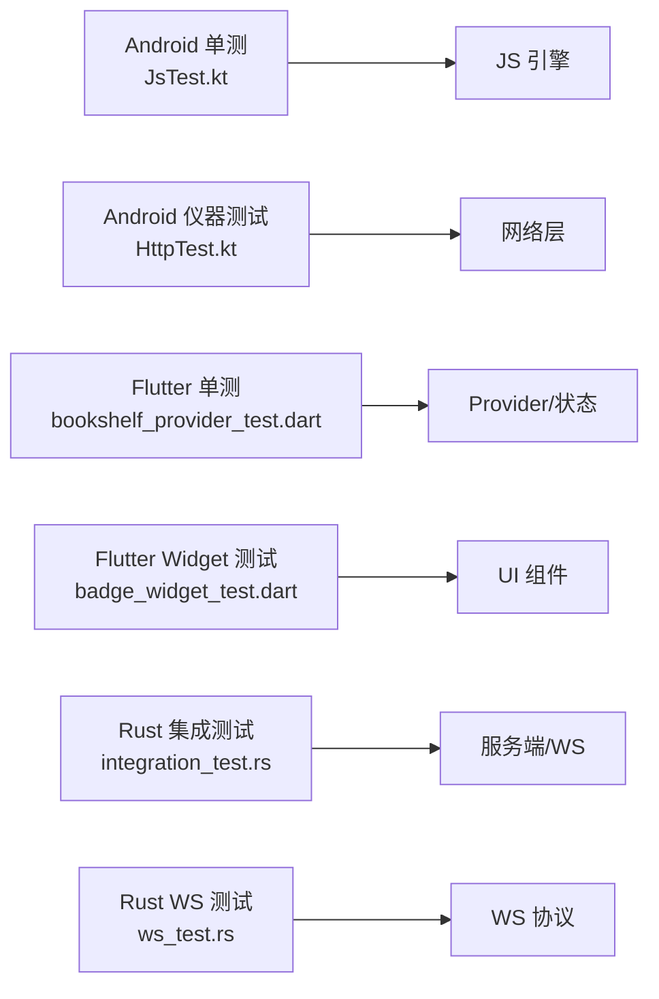
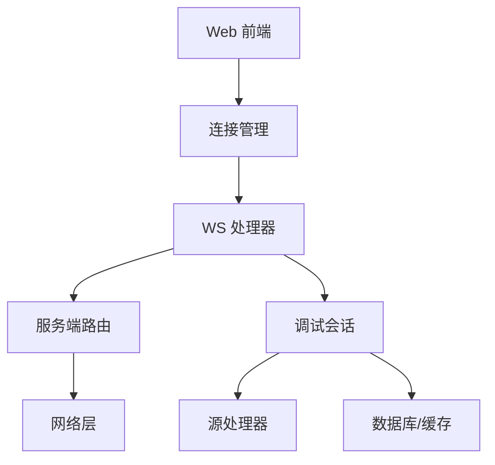

# 调试与测试工具

<cite>
**本文引用的文件**   
- [README.md](file://README.md)
- [app/src/main/java/io/legado/app/App.kt](file://app/src/main/java/io/legado/app/App.kt)
- [modules/web/src/views/SourceEditor.vue](file://modules/web/src/views/SourceEditor.vue)
- [modules/web/src/components/SourceDebug.vue](file://modules/web/src/components/SourceDebug.vue)
- [modules/web/src/store/connectionStore.ts](file://modules/web/src/store/connectionStore.ts)
- [rust/legado-server/src/server.rs](file://rust/legado-server/src/server.rs)
- [rust/legado-server/src/routes.rs](file://rust/legado-server/src/routes.rs)
- [rust/legado-server/src/ws/mod.rs](file://rust/legado-server/src/ws/mod.rs)
- [rust/legado-server/src/handlers/source.rs](file://rust/legado-server/src/handlers/source.rs)
- [rust/legado-core/src/debug_session.rs](file://rust/legado-core/src/debug_session.rs)
- [app/src/test/java/io/legado/app/JsTest.kt](file://app/src/test/java/io/legado/app/JsTest.kt)
- [app/src/androidTest/java/io/legado/app/HttpTest.kt](file://app/src/androidTest/java/io/legado/app/HttpTest.kt)
- [flutter_legado/test/unit/bookshelf_provider_test.dart](file://flutter_legado/test/unit/bookshelf_provider_test.dart)
- [flutter_legado/test/widget/badge_widget_test.dart](file://flutter_legado/test/widget/badge_widget_test.dart)
- [rust/legado-server/tests/integration_test.rs](file://rust/legado-server/tests/integration_test.rs)
- [rust/legado-server/tests/ws_test.rs](file://rust/legado-server/tests/ws_test.rs)
</cite>

## 目录
1. [简介](#简介)
2. [项目结构](#项目结构)
3. [核心组件](#核心组件)
4. [架构总览](#架构总览)
5. [详细组件分析](#详细组件分析)
6. [依赖关系分析](#依赖关系分析)
7. [性能考量](#性能考量)
8. [故障排查指南](#故障排查指南)
9. [结论](#结论)
10. [附录](#附录)

## 简介
本文件面向开发者，系统化梳理 Legado 项目的调试与测试工具链，覆盖：
- Web 调试界面：规则编辑器、实时预览、错误诊断等开发能力
- WebSocket 调试协议：消息格式、事件类型、状态同步机制
- 单元测试框架：Mock 数据、测试用例组织、覆盖率统计
- 性能分析工具：内存监控、CPU 分析、网络追踪等优化辅助
- 日志系统：分级记录、格式化输出、远程收集
- 调试最佳实践：问题定位、性能调优、错误排查技巧
- 完整调试场景示例与问题解决指南

## 项目结构
Legado 采用多模块协作：Android 应用（Kotlin）、Web 前端（Vue/TS）、Rust 服务端与核心库、Flutter 跨端层。调试与测试相关的关键位置如下：
- Android 应用入口与初始化：用于启用调试开关、注册服务与扩展
- Web 前端：规则编辑与调试面板、WebSocket 连接管理
- Rust 服务端：HTTP/WebSocket 路由、调试会话、处理器
- 测试：Android 单测/仪器测试、Flutter 单测/Widget 测试、Rust 集成测试

**图表来源** 
- [app/src/main/java/io/legado/app/App.kt](file://app/src/main/java/io/legado/app/App.kt)
- [modules/web/src/views/SourceEditor.vue](file://modules/web/src/views/SourceEditor.vue)
- [modules/web/src/components/SourceDebug.vue](file://modules/web/src/components/SourceDebug.vue)
- [modules/web/src/store/connectionStore.ts](file://modules/web/src/store/connectionStore.ts)
- [rust/legado-server/src/server.rs](file://rust/legado-server/src/server.rs)
- [rust/legado-server/src/routes.rs](file://rust/legado-server/src/routes.rs)
- [rust/legado-server/src/ws/mod.rs](file://rust/legado-server/src/ws/mod.rs)
- [rust/legado-server/src/handlers/source.rs](file://rust/legado-server/src/handlers/source.rs)
- [rust/legado-core/src/debug_session.rs](file://rust/legado-core/src/debug_session.rs)
- [app/src/test/java/io/legado/app/JsTest.kt](file://app/src/test/java/io/legado/app/JsTest.kt)
- [app/src/androidTest/java/io/legado/app/HttpTest.kt](file://app/src/androidTest/java/io/legado/app/HttpTest.kt)
- [flutter_legado/test/unit/bookshelf_provider_test.dart](file://flutter_legado/test/unit/bookshelf_provider_test.dart)
- [flutter_legado/test/widget/badge_widget_test.dart](file://flutter_legado/test/widget/badge_widget_test.dart)
- [rust/legado-server/tests/integration_test.rs](file://rust/legado-server/tests/integration_test.rs)
- [rust/legado-server/tests/ws_test.rs](file://rust/legado-server/tests/ws_test.rs)

**章节来源**
- [README.md](file://README.md)

## 核心组件
- Web 调试界面
  - 规则编辑器：提供源码规则编辑、语法高亮、校验提示
  - 实时预览：对规则解析结果进行即时渲染与对比
  - 错误诊断：展示解析错误、运行时异常与堆栈信息
- WebSocket 调试协议
  - 客户端通过 connectionStore 建立并维护 WS 连接
  - 服务端通过 ws 模块处理连接、鉴权、消息分发与状态广播
- 调试会话
  - debug_session 管理调试生命周期、断点、变量快照与上下文
- 测试框架
  - Android：JUnit + Espresso（单测与仪器测试）
  - Flutter：Dart Test + Widget Test
  - Rust：cargo test + 集成测试套件

**章节来源**
- [modules/web/src/views/SourceEditor.vue](file://modules/web/src/views/SourceEditor.vue)
- [modules/web/src/components/SourceDebug.vue](file://modules/web/src/components/SourceDebug.vue)
- [modules/web/src/store/connectionStore.ts](file://modules/web/src/store/connectionStore.ts)
- [rust/legado-server/src/ws/mod.rs](file://rust/legado-server/src/ws/mod.rs)
- [rust/legado-core/src/debug_session.rs](file://rust/legado-core/src/debug_session.rs)

## 架构总览
下图展示了 Web 调试界面与 Rust 服务端之间的交互流程，包括 HTTP 资源加载、WebSocket 握手、消息收发与状态同步。

**图表来源** 
- [modules/web/src/views/SourceEditor.vue](file://modules/web/src/views/SourceEditor.vue)
- [modules/web/src/store/connectionStore.ts](file://modules/web/src/store/connectionStore.ts)
- [rust/legado-server/src/server.rs](file://rust/legado-server/src/server.rs)
- [rust/legado-server/src/routes.rs](file://rust/legado-server/src/routes.rs)
- [rust/legado-server/src/ws/mod.rs](file://rust/legado-server/src/ws/mod.rs)
- [rust/legado-core/src/debug_session.rs](file://rust/legado-core/src/debug_session.rs)
- [rust/legado-server/src/handlers/source.rs](file://rust/legado-server/src/handlers/source.rs)

## 详细组件分析

### Web 调试界面：规则编辑器与实时预览
- 功能要点
  - 规则编辑区：支持语法高亮、自动补全、错误下划线提示
  - 实时预览：输入变更触发增量解析，渲染结果与差异对比
  - 错误诊断：聚合解析错误、运行时异常、堆栈与上下文片段
- 关键实现路径
  - 视图与组件：[SourceEditor.vue](file://modules/web/src/views/SourceEditor.vue)、[SourceDebug.vue](file://modules/web/src/components/SourceDebug.vue)
  - 连接管理：[connectionStore.ts](file://modules/web/src/store/connectionStore.ts)
- 典型交互流程
  - 用户修改规则 → 触发校验 → 发送执行请求 → 接收结果 → 更新预览与诊断面板

**图表来源** 
- [modules/web/src/views/SourceEditor.vue](file://modules/web/src/views/SourceEditor.vue)
- [modules/web/src/components/SourceDebug.vue](file://modules/web/src/components/SourceDebug.vue)
- [modules/web/src/store/connectionStore.ts](file://modules/web/src/store/connectionStore.ts)

**章节来源**
- [modules/web/src/views/SourceEditor.vue](file://modules/web/src/views/SourceEditor.vue)
- [modules/web/src/components/SourceDebug.vue](file://modules/web/src/components/SourceDebug.vue)
- [modules/web/src/store/connectionStore.ts](file://modules/web/src/store/connectionStore.ts)

### WebSocket 调试协议：消息格式、事件类型与状态同步
- 设计目标
  - 低延迟双向通信，支持规则执行、日志流、状态同步与调试控制
- 消息类型（概念性说明）
  - 请求类：执行规则、查询状态、设置断点、获取上下文
  - 响应类：执行结果、错误信息、进度更新、状态快照
  - 事件类：连接建立/断开、心跳、日志推送、调试通知
- 状态同步
  - 客户端维护连接状态与队列，重连策略与幂等处理
  - 服务端按会话广播状态，保证一致性

**图表来源** 
- [modules/web/src/store/connectionStore.ts](file://modules/web/src/store/connectionStore.ts)
- [rust/legado-server/src/ws/mod.rs](file://rust/legado-server/src/ws/mod.rs)
- [rust/legado-core/src/debug_session.rs](file://rust/legado-core/src/debug_session.rs)

**章节来源**
- [modules/web/src/store/connectionStore.ts](file://modules/web/src/store/connectionStore.ts)
- [rust/legado-server/src/ws/mod.rs](file://rust/legado-server/src/ws/mod.rs)
- [rust/legado-core/src/debug_session.rs](file://rust/legado-core/src/debug_session.rs)

### 调试会话：生命周期与上下文管理
- 职责
  - 创建/销毁会话、保存/恢复上下文、管理断点与变量快照
  - 与源处理器协作，执行规则并回传结果与错误
- 关键点
  - 并发安全：多线程访问与会话隔离
  - 资源清理：超时回收、内存释放

**图表来源** 
- [rust/legado-core/src/debug_session.rs](file://rust/legado-core/src/debug_session.rs)

**章节来源**
- [rust/legado-core/src/debug_session.rs](file://rust/legado-core/src/debug_session.rs)

### 源处理器：规则解析与执行
- 职责
  - 接收调试会话的请求，执行规则解析、数据抓取与转换
  - 返回结构化结果与错误信息，便于前端诊断
- 关键点
  - 错误分类：语法错误、网络错误、解析失败
  - 性能优化：缓存、限流、重试

**图表来源** 
- [rust/legado-server/src/handlers/source.rs](file://rust/legado-server/src/handlers/source.rs)

**章节来源**
- [rust/legado-server/src/handlers/source.rs](file://rust/legado-server/src/handlers/source.rs)

### 测试框架与用例
- Android 测试
  - 单测：JsTest.kt 验证 JS 引擎能力与兼容性
  - 仪器测试：HttpTest.kt 模拟网络请求与响应
- Flutter 测试
  - 单元与 Widget 测试：bookshelf_provider_test.dart、badge_widget_test.dart
- Rust 测试
  - 集成测试：integration_test.rs、ws_test.rs 验证端到端流程

**图表来源** 
- [app/src/test/java/io/legado/app/JsTest.kt](file://app/src/test/java/io/legado/app/JsTest.kt)
- [app/src/androidTest/java/io/legado/app/HttpTest.kt](file://app/src/androidTest/java/io/legado/app/HttpTest.kt)
- [flutter_legado/test/unit/bookshelf_provider_test.dart](file://flutter_legado/test/unit/bookshelf_provider_test.dart)
- [flutter_legado/test/widget/badge_widget_test.dart](file://flutter_legado/test/widget/badge_widget_test.dart)
- [rust/legado-server/tests/integration_test.rs](file://rust/legado-server/tests/integration_test.rs)
- [rust/legado-server/tests/ws_test.rs](file://rust/legado-server/tests/ws_test.rs)

**章节来源**
- [app/src/test/java/io/legado/app/JsTest.kt](file://app/src/test/java/io/legado/app/JsTest.kt)
- [app/src/androidTest/java/io/legado/app/HttpTest.kt](file://app/src/androidTest/java/io/legado/app/HttpTest.kt)
- [flutter_legado/test/unit/bookshelf_provider_test.dart](file://flutter_legado/test/unit/bookshelf_provider_test.dart)
- [flutter_legado/test/widget/badge_widget_test.dart](file://flutter_legado/test/widget/badge_widget_test.dart)
- [rust/legado-server/tests/integration_test.rs](file://rust/legado-server/tests/integration_test.rs)
- [rust/legado-server/tests/ws_test.rs](file://rust/legado-server/tests/ws_test.rs)

## 依赖关系分析
- 模块耦合
  - Web 前端依赖连接管理与 WS 协议；服务端依赖路由与 WS 处理器；调试会话贯穿前后端
- 外部依赖
  - 网络层（Cronet/OkHttp）、JS 引擎（Rhino/Rust 绑定）、数据库与缓存
- 潜在风险
  - 循环依赖：确保 WS 处理器与调试会话解耦
  - 版本兼容：JS 引擎与规则解析器版本对齐

**图表来源** 
- [modules/web/src/store/connectionStore.ts](file://modules/web/src/store/connectionStore.ts)
- [rust/legado-server/src/ws/mod.rs](file://rust/legado-server/src/ws/mod.rs)
- [rust/legado-server/src/routes.rs](file://rust/legado-server/src/routes.rs)
- [rust/legado-core/src/debug_session.rs](file://rust/legado-core/src/debug_session.rs)
- [rust/legado-server/src/handlers/source.rs](file://rust/legado-server/src/handlers/source.rs)

**章节来源**
- [rust/legado-server/src/routes.rs](file://rust/legado-server/src/routes.rs)
- [rust/legado-server/src/server.rs](file://rust/legado-server/src/server.rs)

## 性能考量
- 内存监控
  - 关注调试会话的上下文大小与对象生命周期，避免泄漏
  - 使用采样与快照工具定位热点对象
- CPU 分析
  - 规则解析与数据转换为热点，建议引入缓存与并行化
  - 使用火焰图识别阻塞点
- 网络追踪
  - 记录请求耗时、重试次数与失败原因
  - 对大体积响应进行分块与压缩
- 优化建议
  - 增量解析与懒加载
  - 连接池与限流
  - 异步任务编排与背压

## 故障排查指南
- 常见问题
  - WS 连接不稳定：检查心跳与重连策略
  - 规则解析失败：查看错误诊断面板与堆栈
  - 性能抖动：定位 CPU/内存热点，减少 GC 压力
- 排查步骤
  - 启用详细日志，过滤关键模块
  - 复现最小用例，逐步缩小范围
  - 使用快照与对比工具定位差异
- 工具推荐
  - 浏览器开发者工具（Network/Performance/Memory）
  - Android Studio Profiler
  - Rust 性能分析（perf/criterion）

## 结论
Legado 的调试与测试体系覆盖前端、后端与多平台测试，形成闭环质量保障。通过 Web 调试界面与 WS 协议，开发者可高效定位问题、优化性能并确保稳定性。建议持续完善日志与监控，强化自动化测试与覆盖率，提升交付质量。

## 附录
- 调试最佳实践
  - 明确错误分类与上报规范
  - 使用 Mock 数据稳定测试环境
  - 定期回归与性能基线对比
- 参考路径
  - Web 调试界面：[SourceEditor.vue](file://modules/web/src/views/SourceEditor.vue)、[SourceDebug.vue](file://modules/web/src/components/SourceDebug.vue)
  - WS 连接管理：[connectionStore.ts](file://modules/web/src/store/connectionStore.ts)
  - 服务端与 WS：[server.rs](file://rust/legado-server/src/server.rs)、[routes.rs](file://rust/legado-server/src/routes.rs)、[ws/mod.rs](file://rust/legado-server/src/ws/mod.rs)
  - 调试会话：[debug_session.rs](file://rust/legado-core/src/debug_session.rs)
  - 源处理器：[handlers/source.rs](file://rust/legado-server/src/handlers/source.rs)
  - 测试用例：[JsTest.kt](file://app/src/test/java/io/legado/app/JsTest.kt)、[HttpTest.kt](file://app/src/androidTest/java/io/legado/app/HttpTest.kt)、[bookshelf_provider_test.dart](file://flutter_legado/test/unit/bookshelf_provider_test.dart)、[badge_widget_test.dart](file://flutter_legado/test/widget/badge_widget_test.dart)、[integration_test.rs](file://rust/legado-server/tests/integration_test.rs)、[ws_test.rs](file://rust/legado-server/tests/ws_test.rs)