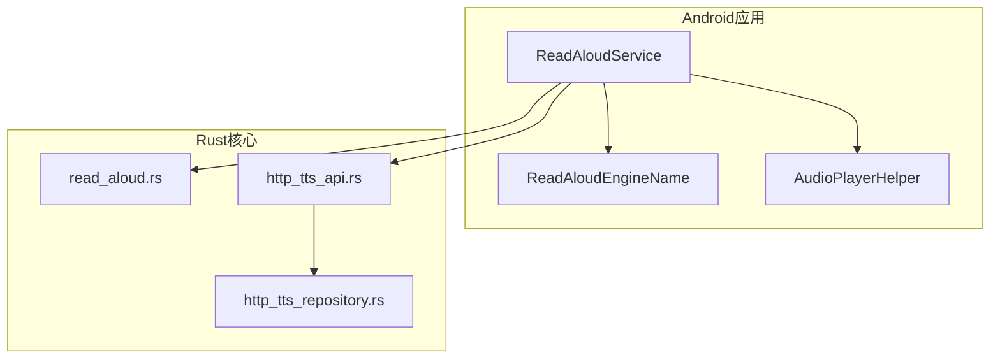
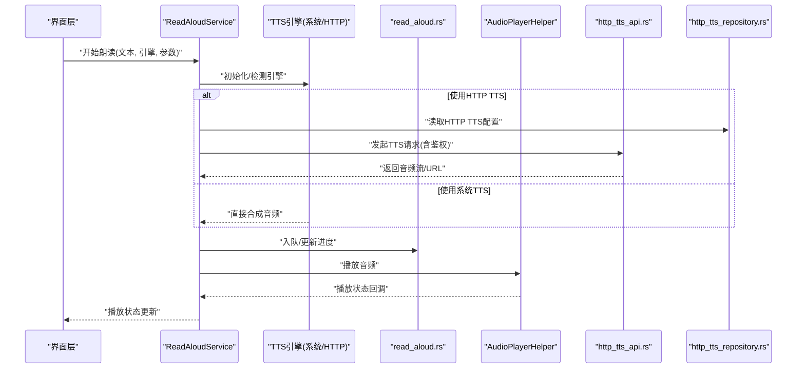
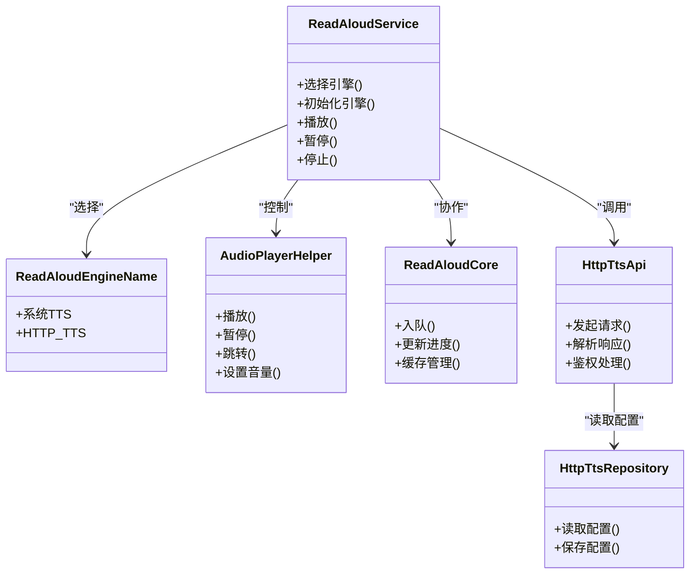

# TTS引擎集成

<cite>
**本文引用的文件**   
- [app/src/main/java/io/legado/app/service/ReadAloudService.kt](file://app/src/main/java/io/legado/app/service/ReadAloudService.kt)
- [app/src/main/java/io/legado/app/model/ReadAloudEngineName.kt](file://app/src/main/java/io/legado/app/model/ReadAloudEngineName.kt)
- [app/src/androidTest/java/io/legado/app/HttpTtsTest.kt](file://app/src/androidTest/java/io/legado/app/HttpTtsTest.kt)
- [rust/legado-core/src/read_aloud.rs](file://rust/legado-core/src/read_aloud.rs)
- [rust/legado-ffi/src/api/http_tts_api.rs](file://rust/legado-ffi/src/api/http_tts_api.rs)
- [rust/legado-db/src/repository/http_tts_repository.rs](file://rust/legado-db/src/repository/http_tts_repository.rs)
- [app/src/main/java/io/legado/app/help/audio/AudioPlayerHelper.kt](file://app/src/main/java/io/legado/app/help/audio/AudioPlayerHelper.kt)
</cite>

## 目录
1. [简介](#简介)
2. [项目结构](#项目结构)
3. [核心组件](#核心组件)
4. [架构总览](#架构总览)
5. [详细组件分析](#详细组件分析)
6. [依赖关系分析](#依赖关系分析)
7. [性能考虑](#性能考虑)
8. [故障排除指南](#故障排除指南)
9. [结论](#结论)
10. [附录](#附录)

## 简介
本文件面向需要在Legado中集成与扩展TTS（文本转语音）能力的开发者，系统梳理项目中支持的多种TTS引擎实现方式，包括系统内置TTS、在线HTTP TTS服务等。文档覆盖TTS引擎的初始化配置、语音参数设置（语速、音调、音量）、语言包管理、服务生命周期管理（引擎检测、连接建立、错误处理），以及自定义TTS服务的开发指南（接口规范、数据格式、认证方式）。同时提供引擎选择策略、性能优化建议、配置示例与故障排除方法，帮助读者快速落地并稳定运行。

## 项目结构
本项目在Android端通过服务层组织TTS播放能力，并在Rust侧提供HTTP TTS相关的API与持久化存储。关键目录与职责如下：
- Android端服务与模型
  - ReadAloudService：朗读服务入口，负责音频播放控制、状态同步、与底层引擎交互。
  - ReadAloudEngineName：朗读引擎名称枚举，用于区分不同TTS引擎类型。
  - AudioPlayerHelper：音频播放辅助工具，封装播放器行为与事件回调。
- Rust端能力
  - read_aloud.rs：朗读核心逻辑（如队列、进度、缓存等）。
  - http_tts_api.rs：HTTP TTS API桥接，暴露给上层调用。
  - http_tts_repository.rs：HTTP TTS配置的持久化仓库。
- 测试用例
  - HttpTtsTest：针对HTTP TTS的端到端测试，验证请求、响应与异常路径。

图表来源
- [app/src/main/java/io/legado/app/service/ReadAloudService.kt](file://app/src/main/java/io/legado/app/service/ReadAloudService.kt)
- [app/src/main/java/io/legado/app/model/ReadAloudEngineName.kt](file://app/src/main/java/io/legado/app/model/ReadAloudEngineName.kt)
- [app/src/main/java/io/legado/app/help/audio/AudioPlayerHelper.kt](file://app/src/main/java/io/legado/app/help/audio/AudioPlayerHelper.kt)
- [rust/legado-core/src/read_aloud.rs](file://rust/legado-core/src/read_aloud.rs)
- [rust/legado-ffi/src/api/http_tts_api.rs](file://rust/legado-ffi/src/api/http_tts_api.rs)
- [rust/legado-db/src/repository/http_tts_repository.rs](file://rust/legado-db/src/repository/http_tts_repository.rs)

章节来源
- [app/src/main/java/io/legado/app/service/ReadAloudService.kt](file://app/src/main/java/io/legado/app/service/ReadAloudService.kt)
- [app/src/main/java/io/legado/app/model/ReadAloudEngineName.kt](file://app/src/main/java/io/legado/app/model/ReadAloudEngineName.kt)
- [app/src/main/java/io/legado/app/help/audio/AudioPlayerHelper.kt](file://app/src/main/java/io/legado/app/help/audio/AudioPlayerHelper.kt)
- [rust/legado-core/src/read_aloud.rs](file://rust/legado-core/src/read_aloud.rs)
- [rust/legado-ffi/src/api/http_tts_api.rs](file://rust/legado-ffi/src/api/http_tts_api.rs)
- [rust/legado-db/src/repository/http_tts_repository.rs](file://rust/legado-db/src/repository/http_tts_repository.rs)

## 核心组件
- 朗读服务（ReadAloudService）
  - 职责：统一调度TTS引擎、管理播放生命周期、处理暂停/恢复/停止、上报播放状态、与Rust朗读模块交互。
  - 关键点：引擎切换、队列管理、错误重试、与系统TTS或HTTP TTS对接。
- 引擎名称（ReadAloudEngineName）
  - 职责：定义可用的TTS引擎标识，便于UI与业务层选择。
- 音频助手（AudioPlayerHelper）
  - 职责：封装播放器能力（播放、暂停、跳转、音量控制），屏蔽底层差异。
- Rust朗读核心（read_aloud.rs）
  - 职责：朗读队列、进度跟踪、缓存策略、与FFI桥接。
- HTTP TTS API（http_tts_api.rs）
  - 职责：对外暴露HTTP TTS能力，封装请求构建、鉴权、响应解析。
- HTTP TTS仓库（http_tts_repository.rs）
  - 职责：持久化HTTP TTS配置（URL、参数、鉴权信息），供运行时加载。

章节来源
- [app/src/main/java/io/legado/app/service/ReadAloudService.kt](file://app/src/main/java/io/legado/app/service/ReadAloudService.kt)
- [app/src/main/java/io/legado/app/model/ReadAloudEngineName.kt](file://app/src/main/java/io/legado/app/model/ReadAloudEngineName.kt)
- [app/src/main/java/io/legado/app/help/audio/AudioPlayerHelper.kt](file://app/src/main/java/io/legado/app/help/audio/AudioPlayerHelper.kt)
- [rust/legado-core/src/read_aloud.rs](file://rust/legado-core/src/read_aloud.rs)
- [rust/legado-ffi/src/api/http_tts_api.rs](file://rust/legado-ffi/src/api/http_tts_api.rs)
- [rust/legado-db/src/repository/http_tts_repository.rs](file://rust/legado-db/src/repository/http_tts_repository.rs)

## 架构总览
整体架构采用“Android服务 + Rust核心”的分层设计：
- Android层负责用户交互与服务编排，选择具体TTS引擎（系统内置或HTTP在线）。
- Rust层提供稳定的朗读核心能力与HTTP TTS API，确保跨平台一致性与高性能。
- 数据流：文本输入 → 引擎选择 → 音频生成（本地或网络） → 播放器播放 → 状态回传。

图表来源
- [app/src/main/java/io/legado/app/service/ReadAloudService.kt](file://app/src/main/java/io/legado/app/service/ReadAloudService.kt)
- [rust/legado-core/src/read_aloud.rs](file://rust/legado-core/src/read_aloud.rs)
- [rust/legado-ffi/src/api/http_tts_api.rs](file://rust/legado-ffi/src/api/http_tts_api.rs)
- [rust/legado-db/src/repository/http_tts_repository.rs](file://rust/legado-db/src/repository/http_tts_repository.rs)
- [app/src/main/java/io/legado/app/help/audio/AudioPlayerHelper.kt](file://app/src/main/java/io/legado/app/help/audio/AudioPlayerHelper.kt)

## 详细组件分析

### 系统内置TTS集成
- 引擎检测与初始化
  - 通过引擎名称枚举识别系统TTS，检查设备是否支持对应语言与音色。
  - 初始化时设置默认语速、音调、音量，并绑定语言包。
- 语音参数设置
  - 语速：影响合成速度，需适配不同引擎的最小/最大范围。
  - 音调：调整音高，增强表达效果。
  - 音量：与系统媒体音量联动，避免冲突。
- 语言包管理
  - 检测已安装语言包，缺失时提示下载或降级到可用语言。
- 生命周期管理
  - 启动时创建实例，空闲时释放资源；异常时自动重建。
- 错误处理
  - 捕获不支持的语言、资源不足、系统限制等异常，回退到默认引擎或提示用户。

章节来源
- [app/src/main/java/io/legado/app/model/ReadAloudEngineName.kt](file://app/src/main/java/io/legado/app/model/ReadAloudEngineName.kt)
- [app/src/main/java/io/legado/app/service/ReadAloudService.kt](file://app/src/main/java/io/legado/app/service/ReadAloudService.kt)

### 在线HTTP TTS服务集成
- 配置与认证
  - 从仓库加载HTTP TTS配置（URL、请求头、鉴权令牌、超时等）。
  - 支持Bearer Token、Basic Auth、签名等常见认证方式。
- 请求与响应
  - 构建请求体（文本、语言、音色、采样率等），接收音频流或可播放URL。
  - 处理压缩、分块传输、断点续传等场景。
- 错误与重试
  - 网络异常、鉴权失败、服务端错误等，进行指数退避重试。
  - 失败时回退到本地引擎或提示用户更换配置。
- 性能优化
  - 预取下一段音频，减少首帧延迟。
  - 合理设置缓冲大小与并发请求数。

章节来源
- [rust/legado-ffi/src/api/http_tts_api.rs](file://rust/legado-ffi/src/api/http_tts_api.rs)
- [rust/legado-db/src/repository/http_tts_repository.rs](file://rust/legado-db/src/repository/http_tts_repository.rs)
- [app/src/androidTest/java/io/legado/app/HttpTtsTest.kt](file://app/src/androidTest/java/io/legado/app/HttpTtsTest.kt)

### 朗读服务与播放器协作
- 服务编排
  - 根据引擎类型分发到不同实现，统一抽象出播放接口。
- 播放器控制
  - 封装播放、暂停、跳转、音量调节，监听播放完成与错误事件。
- 状态同步
  - 将播放进度、剩余时间、当前章节等信息回传给UI层。

章节来源
- [app/src/main/java/io/legado/app/service/ReadAloudService.kt](file://app/src/main/java/io/legado/app/service/ReadAloudService.kt)
- [app/src/main/java/io/legado/app/help/audio/AudioPlayerHelper.kt](file://app/src/main/java/io/legado/app/help/audio/AudioPlayerHelper.kt)

### Rust朗读核心
- 队列与进度
  - 维护朗读队列，记录每段文本的播放状态与进度。
- 缓存策略
  - 对已合成的音频片段进行缓存，避免重复请求。
- FFI桥接
  - 为Android层提供稳定的调用接口，屏蔽Rust内部实现细节。

章节来源
- [rust/legado-core/src/read_aloud.rs](file://rust/legado-core/src/read_aloud.rs)

## 依赖关系分析
- 耦合度
  - ReadAloudService与引擎实现解耦，通过枚举与接口隔离。
  - HTTP TTS依赖仓库配置与网络库，Rust核心依赖FFI桥接。
- 外部依赖
  - 系统TTS依赖Android框架能力。
  - HTTP TTS依赖网络栈与鉴权中间件。
- 循环依赖
  - 通过分层与接口避免循环引用，保证模块内聚。

图表来源
- [app/src/main/java/io/legado/app/service/ReadAloudService.kt](file://app/src/main/java/io/legado/app/service/ReadAloudService.kt)
- [app/src/main/java/io/legado/app/model/ReadAloudEngineName.kt](file://app/src/main/java/io/legado/app/model/ReadAloudEngineName.kt)
- [app/src/main/java/io/legado/app/help/audio/AudioPlayerHelper.kt](file://app/src/main/java/io/legado/app/help/audio/AudioPlayerHelper.kt)
- [rust/legado-core/src/read_aloud.rs](file://rust/legado-core/src/read_aloud.rs)
- [rust/legado-ffi/src/api/http_tts_api.rs](file://rust/legado-ffi/src/api/http_tts_api.rs)
- [rust/legado-db/src/repository/http_tts_repository.rs](file://rust/legado-db/src/repository/http_tts_repository.rs)

章节来源
- [app/src/main/java/io/legado/app/service/ReadAloudService.kt](file://app/src/main/java/io/legado/app/service/ReadAloudService.kt)
- [app/src/main/java/io/legado/app/model/ReadAloudEngineName.kt](file://app/src/main/java/io/legado/app/model/ReadAloudEngineName.kt)
- [app/src/main/java/io/legado/app/help/audio/AudioPlayerHelper.kt](file://app/src/main/java/io/legado/app/help/audio/AudioPlayerHelper.kt)
- [rust/legado-core/src/read_aloud.rs](file://rust/legado-core/src/read_aloud.rs)
- [rust/legado-ffi/src/api/http_tts_api.rs](file://rust/legado-ffi/src/api/http_tts_api.rs)
- [rust/legado-db/src/repository/http_tts_repository.rs](file://rust/legado-db/src/repository/http_tts_repository.rs)

## 性能考虑
- 引擎选择策略
  - 短文本优先系统TTS，长文本或高质量需求优先HTTP TTS。
  - 网络不稳定时自动降级到本地引擎。
- 缓存与预取
  - 预取下一段音频，减少首帧延迟。
  - 对热点文本片段进行缓存，降低重复请求。
- 并发与限流
  - 控制并发请求数，避免服务器过载。
  - 设置合理的超时与重试次数。
- 资源管理
  - 及时释放音频资源，避免内存泄漏。
  - 合理设置缓冲区大小，平衡延迟与稳定性。

[本节为通用指导，不直接分析具体文件]

## 故障排除指南
- 引擎检测失败
  - 检查设备是否安装系统TTS引擎，语言包是否完整。
  - 确认引擎名称枚举与实际实现匹配。
- HTTP TTS请求失败
  - 验证URL可达性、鉴权令牌有效性、请求参数格式。
  - 查看网络日志，定位超时、401/403、5xx错误。
- 播放异常
  - 检查音频格式兼容性、解码器支持情况。
  - 确认播放器状态机转换正确，无死锁或资源竞争。
- 进度不同步
  - 核对队列与播放器进度回调，确保状态一致。
  - 检查Rust核心与Android层的进度上报机制。

章节来源
- [app/src/androidTest/java/io/legado/app/HttpTtsTest.kt](file://app/src/androidTest/java/io/legado/app/HttpTtsTest.kt)
- [rust/legado-ffi/src/api/http_tts_api.rs](file://rust/legado-ffi/src/api/http_tts_api.rs)
- [rust/legado-db/src/repository/http_tts_repository.rs](file://rust/legado-db/src/repository/http_tts_repository.rs)

## 结论
Legado的TTS引擎集成采用清晰的分层架构，Android服务层负责编排与交互，Rust核心提供稳定高效的朗读能力与HTTP TTS API。通过统一的引擎选择与参数配置，系统能够灵活适配不同场景下的TTS需求。结合缓存、预取、重试等优化策略，可在保证体验的同时提升稳定性与性能。开发者可基于现有接口快速扩展自定义TTS服务，满足多样化业务需求。

[本节为总结性内容，不直接分析具体文件]

## 附录
- 配置示例要点
  - HTTP TTS：包含URL、请求头、鉴权方式、超时、重试策略。
  - 系统TTS：语速、音调、音量、语言包选择。
- 自定义TTS开发指南
  - 接口规范：定义统一的合成与播放接口，屏蔽底层差异。
  - 数据格式：明确请求体与响应体结构，支持流式传输。
  - 认证方式：支持Token、签名、证书等多种鉴权方案。
  - 错误处理：统一错误码与消息，便于上层处理与展示。

[本节为补充说明，不直接分析具体文件]