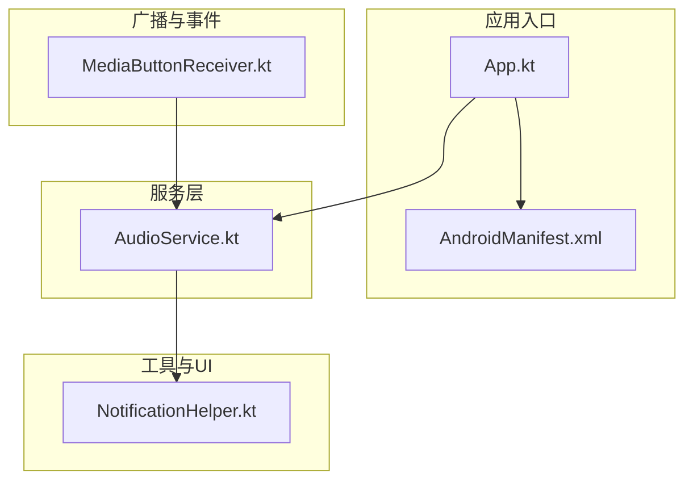
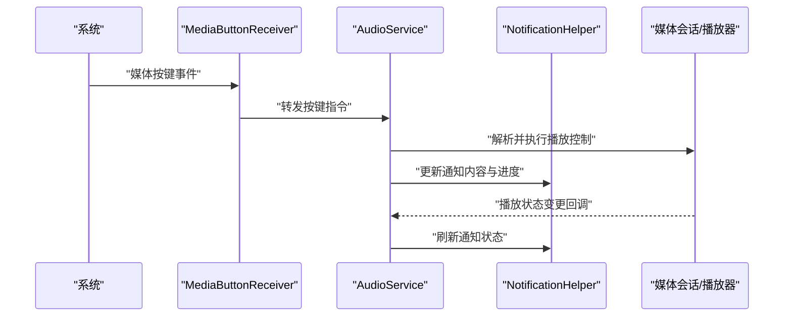
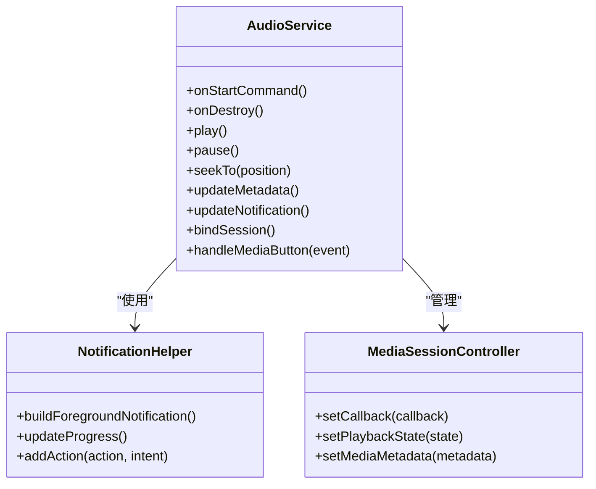
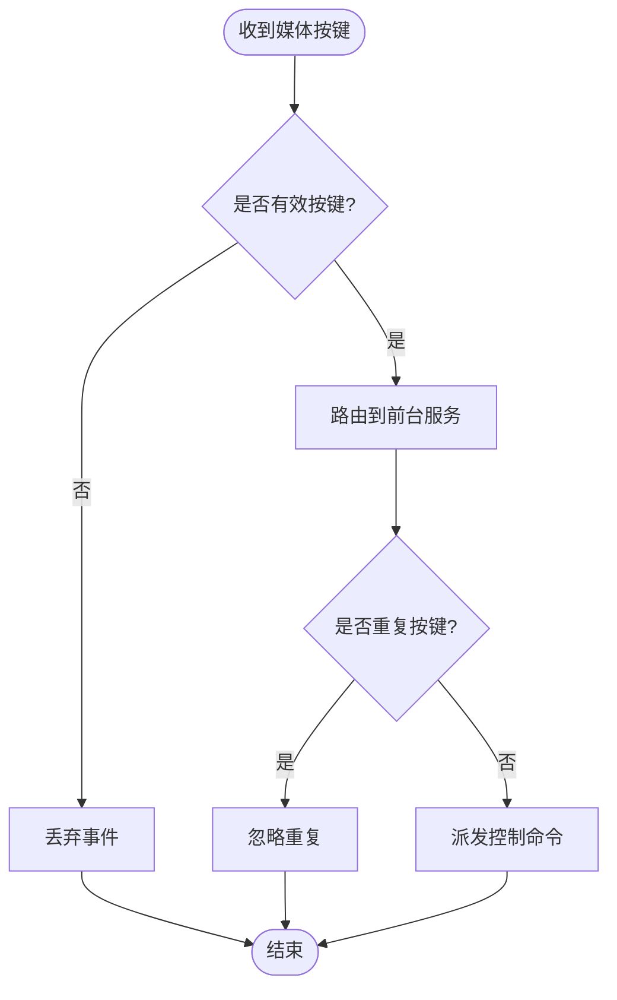
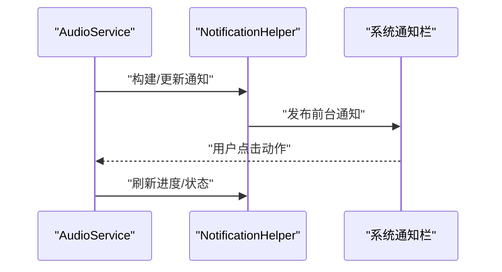
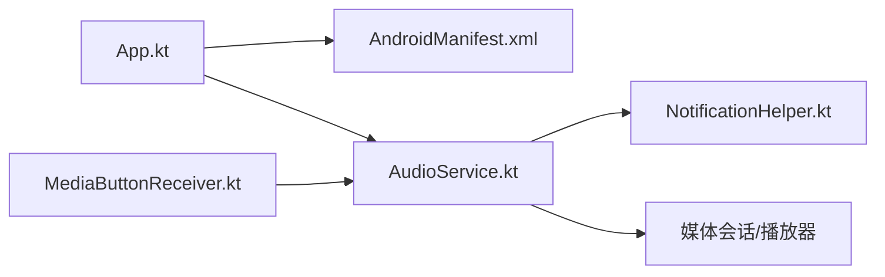

# 后台服务管理

<cite>
**本文引用的文件**   
- [AndroidManifest.xml](file://app/src/main/AndroidManifest.xml)
- [App.kt](file://app/src/main/java/io/legado/app/App.kt)
- [AudioService.kt](file://app/src/main/java/io/legado/app/service/AudioService.kt)
- [MediaButtonReceiver.kt](file://app/src/main/java/io/legado/app/receiver/MediaButtonReceiver.kt)
- [NotificationHelper.kt](file://app/src/main/java/io/legado/app/utils/NotificationHelper.kt)
- [AudioCacheServiceQueueTest.kt](file://app/src/test/java/io/legado/app/service/AudioCacheServiceQueueTest.kt)
- [AudioIdleResumeTest.kt](file://app/src/test/java/io/legado/app/service/AudioIdleResumeTest.kt)
- [AudioOfflineCachePlaybackTest.kt](file://app/src/test/java/io/legado/app/service/AudioOfflineCachePlaybackTest.kt)
- [ChapterStopTimerTest.kt](file://app/src/test/java/io/legado/app/service/ChapterStopTimerTest.kt)
- [HttpTtsPauseTest.kt](file://app/src/test/java/io/legado/app/service/HttpTtsPauseTest.kt)
- [ReadAloudFollowPositionRegressionTest.kt](file://app/src/test/java/io/legado/app/service/ReadAloudFollowPositionRegressionTest.kt)
- [ReadAloudFollowStateTest.kt](file://app/src/test/java/io/legado/app/service/ReadAloudFollowStateTest.kt)
- [ReadAloudSpeakingPositionSourceTest.kt](file://app/src/test/java/io/legado/app/service/ReadAloudSpeakingPositionSourceTest.kt)
- [SpeechFollowStateTest.kt](file://app/src/test/java/io/legado/app/service/SpeechFollowStateTest.kt)
- [SpeechNavigationGateTest.kt](file://app/src/test/java/io/legado/app/service/SpeechNavigationGateTest.kt)
</cite>

## 目录
1. [简介](#简介)
2. [项目结构](#项目结构)
3. [核心组件](#核心组件)
4. [架构总览](#架构总览)
5. [详细组件分析](#详细组件分析)
6. [依赖关系分析](#依赖关系分析)
7. [性能考量](#性能考量)
8. [故障排查指南](#故障排查指南)
9. [结论](#结论)
10. [附录](#附录)

## 简介
本文件面向“后台服务管理”主题，聚焦于前台服务的实现与集成，涵盖服务启动、通知显示、用户交互、媒体按钮响应（耳机按键、锁屏控制、系统媒体控件）、生命周期管理（进程保活、内存优化、资源释放）、跨进程通信（AIDL接口、广播机制、事件传递）、服务状态同步（多实例协调、状态一致性、异常恢复），以及配置与监控（日志记录、性能监控、错误上报）。文档以代码级分析与图示为主，辅以可操作的实践建议。

## 项目结构
本项目为 Android 应用工程，服务相关代码集中在 app 模块的 java/io/legado/app 目录下，其中 service 包负责后台/前台服务实现，receiver 包处理系统广播与媒体按键事件，utils 包提供通知等通用能力，AndroidManifest.xml 声明服务与广播接收器。测试用例覆盖音频缓存队列、空闲恢复、离线缓存播放、章节停止计时、TTS 暂停、朗读跟随位置与状态等关键场景。

图表来源 
- [AndroidManifest.xml](file://app/src/main/AndroidManifest.xml)
- [App.kt](file://app/src/main/java/io/legado/app/App.kt)
- [AudioService.kt](file://app/src/main/java/io/legado/app/service/AudioService.kt)
- [MediaButtonReceiver.kt](file://app/src/main/java/io/legado/app/receiver/MediaButtonReceiver.kt)
- [NotificationHelper.kt](file://app/src/main/java/io/legado/app/utils/NotificationHelper.kt)

章节来源
- [AndroidManifest.xml](file://app/src/main/AndroidManifest.xml)
- [App.kt](file://app/src/main/java/io/legado/app/App.kt)

## 核心组件
- 前台服务：承载音频播放、TTS 朗读、媒体会话与通知展示的核心逻辑，负责与系统媒体框架交互，统一处理播放控制与状态更新。
- 媒体按钮接收器：监听系统媒体按键（耳机线控、锁屏、车载/蓝牙设备）并转发至前台服务。
- 通知助手：封装通知构建、样式适配、动作按钮与进度更新，确保在各类 Android 版本上的一致性体验。
- 应用入口：初始化全局上下文、订阅系统事件、启动必要服务或调度任务。

章节来源
- [AudioService.kt](file://app/src/main/java/io/legado/app/service/AudioService.kt)
- [MediaButtonReceiver.kt](file://app/src/main/java/io/legado/app/receiver/MediaButtonReceiver.kt)
- [NotificationHelper.kt](file://app/src/main/java/io/legado/app/utils/NotificationHelper.kt)
- [App.kt](file://app/src/main/java/io/legado/app/App.kt)

## 架构总览
下图展示了从系统事件到服务处理的端到端流程：系统广播触发媒体按钮接收器，接收器将事件路由至前台服务；服务通过媒体会话与通知中心联动，驱动播放引擎执行具体操作。

图表来源 
- [MediaButtonReceiver.kt](file://app/src/main/java/io/legado/app/receiver/MediaButtonReceiver.kt)
- [AudioService.kt](file://app/src/main/java/io/legado/app/service/AudioService.kt)
- [NotificationHelper.kt](file://app/src/main/java/io/legado/app/utils/NotificationHelper.kt)

## 详细组件分析

### 前台服务（AudioService）
职责与要点
- 服务启动与前台化：在首次播放或需要常驻时提升为前台服务，创建持久通知，避免被系统回收。
- 媒体会话与播放控制：对接系统媒体框架，统一处理播放、暂停、上一首、下一首、跳转、音量、元数据更新。
- 通知联动：根据播放状态动态更新通知标题、副标题、进度条、操作按钮。
- 生命周期管理：正确处理 onStartCommand、onDestroy、onTaskRemoved，保证资源释放与状态持久化。
- 跨进程通信：通过 Binder/AIDL 暴露控制接口，供其他进程或组件调用。
- 状态同步：维护播放位置、播放列表、当前章节/曲目、是否正在朗读等状态，并在进程重启后恢复。

图表来源 
- [AudioService.kt](file://app/src/main/java/io/legado/app/service/AudioService.kt)
- [NotificationHelper.kt](file://app/src/main/java/io/legado/app/utils/NotificationHelper.kt)

章节来源
- [AudioService.kt](file://app/src/main/java/io/legado/app/service/AudioService.kt)

### 媒体按钮接收器（MediaButtonReceiver）
职责与要点
- 注册与权限：在清单中声明接收媒体按钮广播，确保具备相应权限。
- 事件分发：拦截系统媒体按键，过滤无效事件，转发给前台服务处理。
- 锁屏与车载集成：兼容不同厂商 ROM 的媒体按键行为，确保在锁屏界面与车载环境可用。
- 防抖与幂等：对重复按键进行去抖，保证多次触发的稳定性。

图表来源 
- [MediaButtonReceiver.kt](file://app/src/main/java/io/legado/app/receiver/MediaButtonReceiver.kt)

章节来源
- [MediaButtonReceiver.kt](file://app/src/main/java/io/legado/app/receiver/MediaButtonReceiver.kt)

### 通知助手（NotificationHelper）
职责与要点
- 通知构建：按 Android 版本适配通知样式，设置图标、标题、内容、进度条。
- 动作按钮：添加播放/暂停、上一首/下一首、关闭等动作，绑定 PendingIntent。
- 实时更新：在播放进度变化、元数据更新时刷新通知，保持 UI 一致。
- 前台服务关联：作为前台通知的载体，确保服务不被系统回收。

图表来源 
- [NotificationHelper.kt](file://app/src/main/java/io/legado/app/utils/NotificationHelper.kt)
- [AudioService.kt](file://app/src/main/java/io/legado/app/service/AudioService.kt)

章节来源
- [NotificationHelper.kt](file://app/src/main/java/io/legado/app/utils/NotificationHelper.kt)

### 应用入口（App）
职责与要点
- 全局初始化：初始化日志、网络、数据库、媒体会话等基础能力。
- 服务启动策略：根据用户操作或系统事件决定是否启动前台服务。
- 事件订阅：订阅系统广播（如开机、网络变化、屏幕开关），用于服务恢复与状态同步。

章节来源
- [App.kt](file://app/src/main/java/io/legado/app/App.kt)

## 依赖关系分析
- 组件耦合度：AudioService 依赖 NotificationHelper 与媒体会话控制器；MediaButtonReceiver 仅负责事件转发，降低耦合。
- 外部依赖：系统媒体框架、通知系统、Binder/AIDL 接口。
- 潜在循环依赖：应避免 Service 与 Helper 之间直接相互调用，采用单向依赖。
- 进程边界：通过 AIDL 暴露控制接口，确保跨进程安全访问。

图表来源 
- [AndroidManifest.xml](file://app/src/main/AndroidManifest.xml)
- [App.kt](file://app/src/main/java/io/legado/app/App.kt)
- [AudioService.kt](file://app/src/main/java/io/legado/app/service/AudioService.kt)
- [MediaButtonReceiver.kt](file://app/src/main/java/io/legado/app/receiver/MediaButtonReceiver.kt)
- [NotificationHelper.kt](file://app/src/main/java/io/legado/app/utils/NotificationHelper.kt)

章节来源
- [AndroidManifest.xml](file://app/src/main/AndroidManifest.xml)
- [App.kt](file://app/src/main/java/io/legado/app/App.kt)
- [AudioService.kt](file://app/src/main/java/io/legado/app/service/AudioService.kt)
- [MediaButtonReceiver.kt](file://app/src/main/java/io/legado/app/receiver/MediaButtonReceiver.kt)
- [NotificationHelper.kt](file://app/src/main/java/io/legado/app/utils/NotificationHelper.kt)

## 性能考量
- 进程保活：优先使用前台服务+持久通知，避免滥用 AlarmManager 或心跳导致耗电。
- 内存优化：及时释放 Bitmap、流对象、缓存过大对象；使用弱引用避免内存泄漏。
- 资源释放：在 onDestroy 中释放播放器、取消订阅、清理定时器与线程池。
- I/O 与网络：批量请求、连接复用、超时与重试策略，避免阻塞主线程。
- 通知频率：合并更新，减少频繁刷新导致的 UI 卡顿与电量消耗。

[本节为通用指导，不直接分析具体文件]

## 故障排查指南
常见问题与定位方法
- 服务被杀：检查前台通知是否正确创建；确认是否在低内存时被回收；查看系统日志中的 OOM 信息。
- 媒体按键无响应：确认广播已注册且权限正确；检查事件转发链路；验证服务是否处于前台。
- 通知不更新：检查更新时机与线程；确认 PendingIntent 参数未变更导致缓存命中。
- 播放状态不一致：核对状态机转换；增加状态落盘与恢复逻辑；对比媒体会话状态与服务内部状态。
- TTS 异常：关注网络超时、音频焦点冲突、权限缺失；增加重试与降级策略。

章节来源
- [AudioCacheServiceQueueTest.kt](file://app/src/test/java/io/legado/app/service/AudioCacheServiceQueueTest.kt)
- [AudioIdleResumeTest.kt](file://app/src/test/java/io/legado/app/service/AudioIdleResumeTest.kt)
- [AudioOfflineCachePlaybackTest.kt](file://app/src/test/java/io/legado/app/service/AudioOfflineCachePlaybackTest.kt)
- [ChapterStopTimerTest.kt](file://app/src/test/java/io/legado/app/service/ChapterStopTimerTest.kt)
- [HttpTtsPauseTest.kt](file://app/src/test/java/io/legado/app/service/HttpTtsPauseTest.kt)
- [ReadAloudFollowPositionRegressionTest.kt](file://app/src/test/java/io/legado/app/service/ReadAloudFollowPositionRegressionTest.kt)
- [ReadAloudFollowStateTest.kt](file://app/src/test/java/io/legado/app/service/ReadAloudFollowStateTest.kt)
- [ReadAloudSpeakingPositionSourceTest.kt](file://app/src/test/java/io/legado/app/service/ReadAloudSpeakingPositionSourceTest.kt)
- [SpeechFollowStateTest.kt](file://app/src/test/java/io/legado/app/service/SpeechFollowStateTest.kt)
- [SpeechNavigationGateTest.kt](file://app/src/test/java/io/legado/app/service/SpeechNavigationGateTest.kt)

## 结论
本方案以前台服务为核心，结合媒体按钮接收器与通知助手，构建了稳定可靠的后台服务管理体系。通过清晰的职责划分、严格的资源管理与健壮的状态同步机制，实现了跨进程通信、系统媒体控件集成与良好的用户体验。建议在后续迭代中持续完善日志与监控体系，强化异常恢复与性能调优，以提升整体稳定性与可观测性。

[本节为总结性内容，不直接分析具体文件]

## 附录
- 最佳实践清单
  - 始终在前台服务中持有媒体会话，确保系统媒体控件可用。
  - 使用统一的错误码与日志标签，便于问题追踪。
  - 对关键状态进行持久化，支持进程重启后的快速恢复。
  - 合理拆分线程与协程，避免主线程阻塞。
  - 针对各厂商 ROM 做兼容性测试，尤其是媒体按键与通知行为。

[本节为补充说明，不直接分析具体文件]