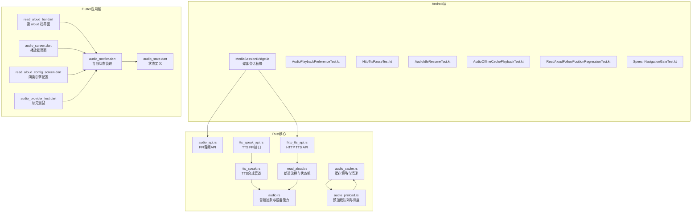
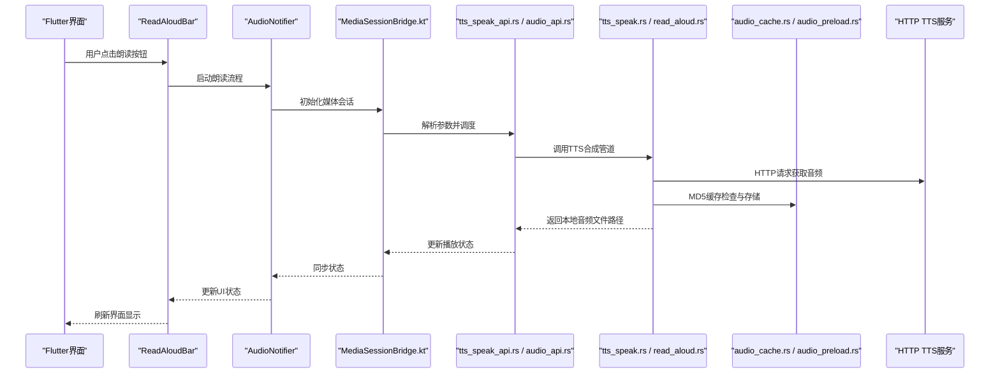
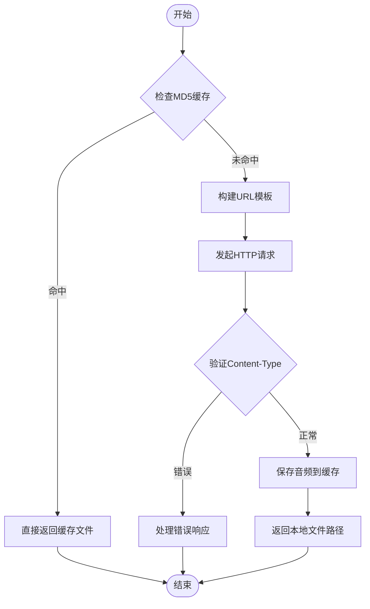
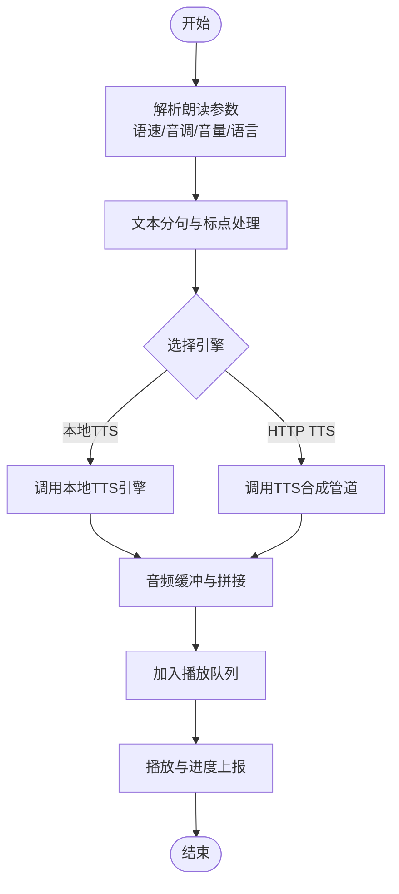
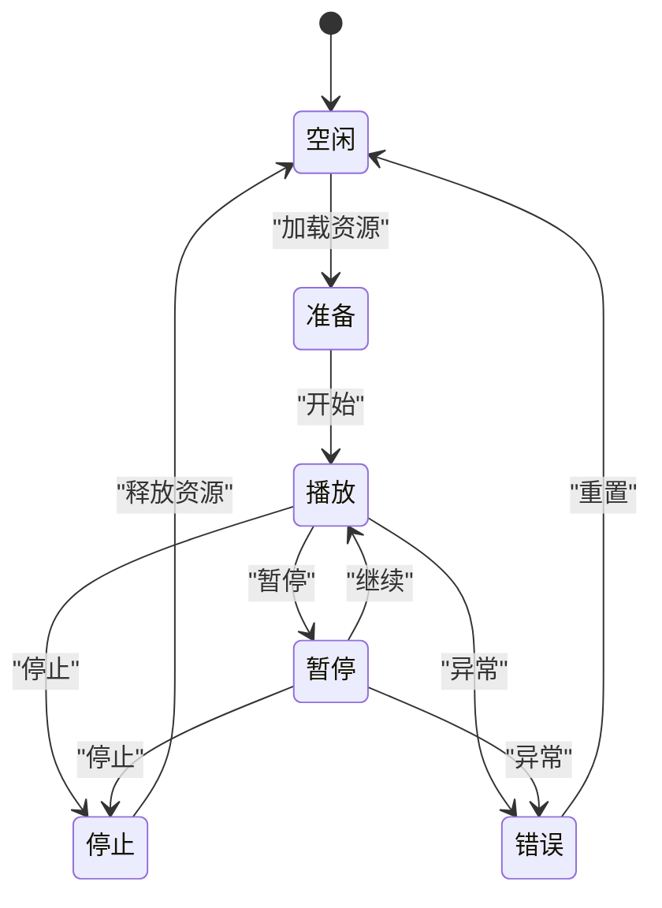
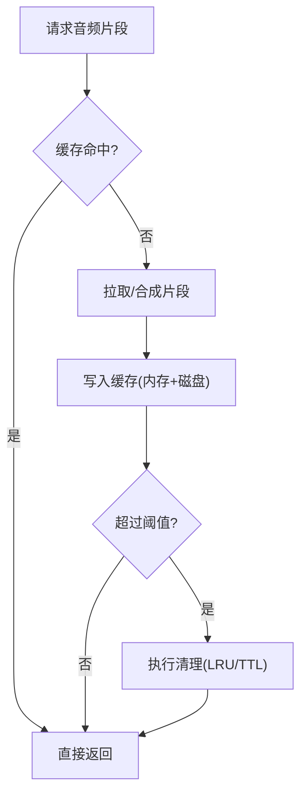
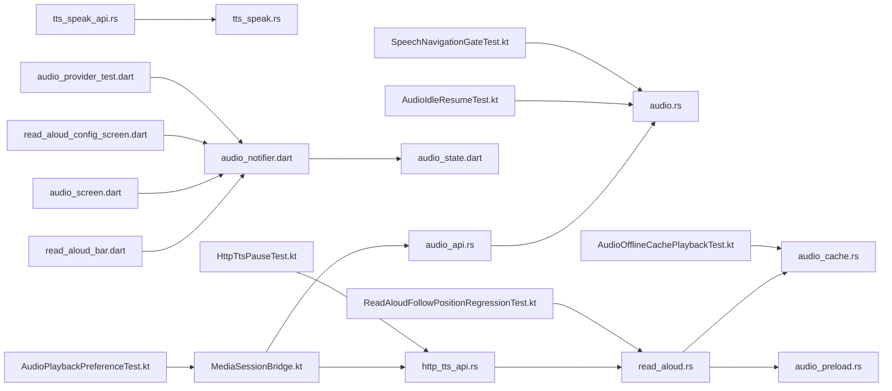

# 音频功能

<cite>
**本文引用的文件**   
- [tts_speak.rs](file://rust/legado-core/src/tts_speak.rs)
- [tts_speak_api.rs](file://rust/legado-ffi/src/api/tts_speak_api.rs)
- [audio.rs](file://rust/legado-core/src/audio.rs)
- [audio_cache.rs](file://rust/legado-core/src/audio_cache.rs)
- [audio_preload.rs](file://rust/legado-core/src/audio_preload.rs)
- [read_aloud.rs](file://rust/legado-core/src/read_aloud.rs)
- [audio_api.rs](file://rust/legado-ffi/src/api/audio_api.rs)
- [http_tts_api.rs](file://rust/legado-ffi/src/api/http_tts_api.rs)
- [MediaSessionBridge.kt](file://app/src/main/java/io/legado/app/lib/MediaSessionBridge.kt)
- [AudioPlaybackPreferenceTest.kt](file://app/src/test/java/io/legado/app/model/AudioPlaybackPreferenceTest.kt)
- [HttpTtsPauseTest.kt](file://app/src/androidTest/java/io/legado/app/HttpTtsPauseTest.kt)
- [AudioIdleResumeTest.kt](file://app/src/test/java/io/legado/app/service/AudioIdleResumeTest.kt)
- [AudioOfflineCachePlaybackTest.kt](file://app/src/test/java/io/legado/app/service/AudioOfflineCachePlaybackTest.kt)
- [ReadAloudFollowPositionRegressionTest.kt](file://app/src/test/java/io/legado/app/service/ReadAloudFollowPositionRegressionTest.kt)
- [SpeechNavigationGateTest.kt](file://app/src/test/java/io/legado/app/service/SpeechNavigationGateTest.kt)
- [read_aloud_bar.dart](file://flutter_legado\lib\src\widgets\reader\read_aloud_bar.dart)
- [audio_notifier.dart](file://flutter_legado\lib\src\providers\audio\audio_notifier.dart)
- [audio_state.dart](file://flutter_legado\lib\src\providers\audio\audio_state.dart)
- [audio_screen.dart](file://flutter_legado\lib\src\screens\audio_screen.dart)
- [read_aloud_config_screen.dart](file://flutter_legado\lib\src\screens\read_aloud_config_screen.dart)
- [audio_provider_test.dart](file://flutter_legado\test\unit\audio_provider_test.dart)
</cite>

## 更新摘要
**所做更改**
- 新增完整的TTS合成管道实现，包括rust/legado-core/src/tts_speak.rs核心实现、HTTP TTS服务集成、MD5文件缓存机制、多音频格式支持等
- 新增tts_speak_api.rs FFI接口和Flutter桥接集成
- 增强音频状态管理，从ChangeNotifier迁移到Riverpod Notifier架构
- 完善音频播放器页面，支持定时停止、播放模式切换等高级功能
- 新增朗读引擎配置页面，支持HTTP TTS引擎的增删改查操作
- 优化媒体会话集成，提升后台播放和系统级媒体控制体验

## 目录
1. [简介](#简介)
2. [项目结构](#项目结构)
3. [核心组件](#核心组件)
4. [架构总览](#架构总览)
5. [详细组件分析](#详细组件分析)
6. [依赖关系分析](#依赖关系分析)
7. [性能考量](#性能考量)
8. [故障排查指南](#故障排查指南)
9. [结论](#结论)
10. [附录](#附录)

## 简介
本文件面向Legado项目的音频能力，系统性梳理语音朗读（TTS）与音频播放、缓存、录制处理、后台服务与通知、以及配置定制等模块。文档以"从概念到实现"的方式组织，既帮助初学者快速上手，也为开发者提供深入的技术细节与优化建议。内容涵盖：
- **全新TTS合成管道**：基于Rust实现的HTTP TTS服务集成、MD5文件缓存机制、多音频格式支持
- TTS引擎集成与参数调节（语速、音调、音量、语言包选择）
- 播放器设计（播放列表、进度控制、循环/随机模式）
- 音频缓存机制（预加载策略、清理与内存管理）
- 录音与处理（质量设置、格式转换、音量调节）
- 后台播放与服务管理（前台服务、通知、媒体按钮、媒体会话集成）
- Flutter端读 aloud 栏界面与音频状态管理
- 配置与个性化（TTS引擎选择、播放参数调优、音效设置）
- 使用示例与常见问题解决

## 项目结构
音频相关代码主要分布在Rust核心库、Android测试用例和Flutter应用中：
- Rust核心层：音频抽象、缓存、预加载、朗读流程、**新增TTS合成管道**、FFI接口
- Android测试层：对TTS暂停、离线缓存播放、朗读跟随位置、空闲恢复等行为进行验证
- Flutter应用层：**新增读 aloud 栏界面、音频状态管理、播放器页面、朗读引擎配置**
- **新增媒体会话桥接层：Android MediaSession集成，提供系统级媒体控制支持**

图表来源 
- [tts_speak.rs](file://rust/legado-core/src/tts_speak.rs)
- [tts_speak_api.rs](file://rust/legado-ffi/src/api/tts_speak_api.rs)
- [audio.rs](file://rust/legado-core/src/audio.rs)
- [audio_cache.rs](file://rust/legado-core/src/audio_cache.rs)
- [audio_preload.rs](file://rust/legado-core/src/audio_preload.rs)
- [read_aloud.rs](file://rust/legado-core/src/read_aloud.rs)
- [audio_api.rs](file://rust/legado-ffi/src/api/audio_api.rs)
- [http_tts_api.rs](file://rust/legado-ffi/src/api/http_tts_api.rs)
- [MediaSessionBridge.kt](file://app/src/main/java/io/legado/app/lib/MediaSessionBridge.kt)
- [read_aloud_bar.dart](file://flutter_legado\lib\src\widgets\reader\read_aloud_bar.dart)
- [audio_notifier.dart](file://flutter_legado\lib\src\providers\audio\audio_notifier.dart)
- [audio_state.dart](file://flutter_legado\lib\src\providers\audio\audio_state.dart)
- [audio_screen.dart](file://flutter_legado\lib\src\screens\audio_screen.dart)
- [read_aloud_config_screen.dart](file://flutter_legado\lib\src\screens\read_aloud_config_screen.dart)
- [audio_provider_test.dart](file://flutter_legado\test\unit\audio_provider_test.dart)

章节来源
- [tts_speak.rs](file://rust/legado-core/src/tts_speak.rs)
- [tts_speak_api.rs](file://rust/legado-ffi/src/api/tts_speak_api.rs)
- [audio.rs](file://rust/legado-core/src/audio.rs)
- [audio_cache.rs](file://rust/legado-core/src/audio_cache.rs)
- [audio_preload.rs](file://rust/legado-core/src/audio_preload.rs)
- [read_aloud.rs](file://rust/legado-core/src/read_aloud.rs)
- [audio_api.rs](file://rust/legado-ffi/src/api/audio_api.rs)
- [http_tts_api.rs](file://rust/legado-ffi/src/api/http_tts_api.rs)
- [MediaSessionBridge.kt](file://app/src/main/java/io/legado/app/lib/MediaSessionBridge.kt)
- [read_aloud_bar.dart](file://flutter_legado\lib\src\widgets\reader\read_aloud_bar.dart)
- [audio_notifier.dart](file://flutter_legado\lib\src\providers\audio\audio_notifier.dart)
- [audio_state.dart](file://flutter_legado\lib\src\providers\audio\audio_state.dart)
- [audio_screen.dart](file://flutter_legado\lib\src\screens\audio_screen.dart)
- [read_aloud_config_screen.dart](file://flutter_legado\lib\src\screens\read_aloud_config_screen.dart)
- [audio_provider_test.dart](file://flutter_legado\test\unit\audio_provider_test.dart)

## 核心组件
- 音频抽象与设备能力：封装底层音频会话、输出设备检测、权限与路由、音量通道控制等
- 缓存与预加载：基于磁盘与内存的混合缓存，支持按章节/片段粒度预取与淘汰
- 朗读流程：文本预处理、分句切分、TTS引擎调用、播放队列编排、错误重试
- **TTS合成管道**：全新的HTTP TTS服务集成，支持URL模板替换、MD5文件缓存、多音频格式支持
- **Flutter读 aloud 栏界面**：阅读器底部常驻的朗读控制面板，支持播放控制和状态显示
- **音频状态管理**：基于Riverpod的不可变状态管理，替代原有的ChangeNotifier架构
- **播放器页面**：完整的听书播放界面，支持定时停止、播放模式切换、章节列表等
- **朗读引擎配置**：HTTP TTS引擎的增删改查管理界面
- 媒体会话桥接：Android MediaSession集成，统一系统级媒体控制接口
- FFI接口：向Android侧暴露统一的音频与TTS操作API
- 测试用例：覆盖TTS暂停、离线缓存播放、朗读跟随位置、空闲恢复、导航门控等关键路径

章节来源
- [tts_speak.rs](file://rust/legado-core/src/tts_speak.rs)
- [tts_speak_api.rs](file://rust/legado-ffi/src/api/tts_speak_api.rs)
- [audio.rs](file://rust/legado-core/src/audio.rs)
- [audio_cache.rs](file://rust/legado-core/src/audio_cache.rs)
- [audio_preload.rs](file://rust/legado-core/src/audio_preload.rs)
- [read_aloud.rs](file://rust/legado-core/src/read_aloud.rs)
- [read_aloud_bar.dart](file://flutter_legado\lib\src\widgets\reader\read_aloud_bar.dart)
- [audio_notifier.dart](file://flutter_legado\lib\src\providers\audio\audio_notifier.dart)
- [audio_state.dart](file://flutter_legado\lib\src\providers\audio\audio_state.dart)
- [audio_screen.dart](file://flutter_legado\lib\src\screens\audio_screen.dart)
- [read_aloud_config_screen.dart](file://flutter_legado\lib\src\screens\read_aloud_config_screen.dart)
- [MediaSessionBridge.kt](file://app/src/main/java/io/legado/app/lib/MediaSessionBridge.kt)
- [audio_api.rs](file://rust/legado-ffi/src/api/audio_api.rs)
- [http_tts_api.rs](file://rust/legado-ffi/src/api/http_tts_api.rs)

## 架构总览
整体采用分层架构：上层通过FFI接口调用Rust核心能力；核心层将TTS、缓存、预加载与朗读流程解耦；**Flutter应用层提供现代化的UI界面和状态管理**；Android侧通过测试与UI驱动具体行为。**新增的TTS合成管道提供了完整的HTTP TTS服务集成能力**。

图表来源 
- [tts_speak.rs](file://rust/legado-core/src/tts_speak.rs)
- [tts_speak_api.rs](file://rust/legado-ffi/src/api/tts_speak_api.rs)
- [read_aloud_bar.dart](file://flutter_legado\lib\src\widgets\reader\read_aloud_bar.dart)
- [audio_notifier.dart](file://flutter_legado\lib\src\providers\audio\audio_notifier.dart)
- [MediaSessionBridge.kt](file://app/src/main/java/io/legado/app/lib/MediaSessionBridge.kt)
- [audio_api.rs](file://rust/legado-ffi/src/api/audio_api.rs)
- [http_tts_api.rs](file://rust/legado-ffi/src/api/http_tts_api.rs)
- [read_aloud.rs](file://rust/legado-core/src/read_aloud.rs)
- [audio.rs](file://rust/legado-core/src/audio.rs)
- [audio_cache.rs](file://rust/legado-core/src/audio_cache.rs)
- [audio_preload.rs](file://rust/legado-core/src/audio_preload.rs)

## 详细组件分析

### 全新TTS合成管道（新增功能）
**新增** 完整的HTTP TTS语音合成管线实现，包含以下核心特性：

- **URL模板替换**：支持`{{speakText}}`/`{{text}}`和`{{speakSpeed}}`/`{{speed}}`占位符替换
- **MD5文件缓存**：基于模板+文本+语速的MD5哈希生成唯一缓存键，避免重复网络请求
- **多音频格式支持**：自动识别MP3、WAV、AAC、M4A、OGG、AMR、FLAC等格式
- **Content-Type校验**：智能判断JSON/text响应为错误信息，提高错误处理能力
- **异步网络集成**：通过闭包注入网络层，便于单元测试和Mock

**章节来源**
- [tts_speak.rs:1-498](file://rust/legado-core/src/tts_speak.rs#L1-L498)
- [tts_speak_api.rs:1-142](file://rust/legado-ffi/src/api/tts_speak_api.rs#L1-L142)

### TTS语音朗读（多引擎集成与参数调节）
- 引擎选择：支持本地TTS与HTTP TTS两种路径，可通过配置切换
- 参数调节：语速、音调、音量、语言包、断句策略等
- 流程要点：文本清洗→分句→引擎合成→缓冲→播放队列→状态同步
- **Flutter集成**：通过AudioNotifier统一管理TTS配置和播放状态

**章节来源**
- [read_aloud.rs](file://rust/legado-core/src/read_aloud.rs)
- [http_tts_api.rs](file://rust/legado-ffi/src/api/http_tts_api.rs)
- [audio_notifier.dart](file://flutter_legado\lib\src\providers\audio\audio_notifier.dart)

### 音频播放器（播放列表、进度、循环/随机）
- 播放列表：支持顺序、循环、随机三种模式，动态增删条目
- 进度控制：精确跳转、拖拽、自动续播
- 状态机：空闲、准备、播放、暂停、停止、错误
- 事件回调：播放完成、缓冲不足、网络异常、设备断开
- **Flutter实现**：AudioScreen提供完整的播放器界面，支持定时停止和播放模式切换

**章节来源**
- [audio_api.rs](file://rust/legado-ffi/src/api/audio_api.rs)
- [audio_screen.dart](file://flutter_legado\lib\src\screens\audio_screen.dart)

### 音频缓存机制（预加载、清理、内存管理）
- 预加载策略：按章节/片段维度预取，结合用户阅读速度与停留时长预测
- 缓存清理：LRU/TTL策略，按大小与时间阈值触发清理
- 内存管理：限制单条缓存大小，避免OOM；跨进程共享时注意引用计数

**章节来源**
- [audio_cache.rs](file://rust/legado-core/src/audio_cache.rs)
- [audio_preload.rs](file://rust/legado-core/src/audio_preload.rs)

### 音频录制与处理（质量、格式、音量）
- 录制质量：采样率、位深、声道数可调
- 格式转换：输入PCM转目标编码（如AAC/MP3），支持实时转码
- 音量调节：增益控制、压缩与限幅，避免削波

**章节来源**
- [audio.rs](file://rust/legado-core/src/audio.rs)

### 后台播放与服务管理（前台服务、通知、媒体按钮、媒体会话集成）
- 前台服务：保证播放不被系统回收，保持生命周期稳定
- 通知控制：显示当前播放信息、支持快进/后退/暂停/停止
- 媒体按钮：响应耳机按键、锁屏控件、蓝牙车载控制
- 媒体会话集成：通过MediaSessionBridge统一管理系统媒体会话，支持锁屏控件、通知栏控制、蓝牙耳机控制等系统级媒体交互
- **Flutter集成**：AudioNotifier统一管理媒体会话生命周期和状态同步

**新增** Flutter端的音频状态管理提供了以下功能：
- Riverpod状态管理：基于不可变状态的现代化架构
- 媒体会话生命周期：自动初始化和释放媒体会话资源
- 音频焦点管理：智能处理音频焦点变化，确保播放体验
- 播放状态同步：Flutter UI与Android媒体会话状态保持一致
- 错误处理：完善的异常捕获和用户友好的错误提示

**章节来源**
- [audio_api.rs](file://rust/legado-ffi/src/api/audio_api.rs)
- [MediaSessionBridge.kt](file://app/src/main/java/io/legado/app/lib/MediaSessionBridge.kt)
- [audio_notifier.dart](file://flutter_legado\lib\src\providers\audio\audio_notifier.dart)

### Flutter读 aloud 栏界面（新增功能）
- **阅读器底部常驻面板**：朗读激活时替代底部功能栏显示
- **完整控制功能**：上一章/下一章、播放/暂停、停止、语速调节
- **状态显示**：当前章节信息、播放状态、进度指示
- **便捷操作**：目录访问、朗读设置、转后台播放
- **收起功能**：最小化面板但保持朗读继续

**新增** ReadAloudBar组件提供了以下功能：
- 阅读器集成：作为ReaderScreen的底部常驻控件
- 播放控制：完整的播放控制按钮，包括章节切换和播放状态控制
- 语速调节：0.5x到3.0x范围的滑块控制
- 状态反馈：实时显示播放状态和当前章节信息
- 快捷操作：一键访问目录、朗读设置和后台播放

**章节来源**
- [read_aloud_bar.dart](file://flutter_legado\lib\src\widgets\reader\read_aloud_bar.dart)

### 音频状态管理（新增功能）
- **Riverpod架构**：从ChangeNotifier迁移到Notifer，提供更好的状态管理
- **不可变状态**：使用Freezed生成的不可变状态类，提高性能
- **媒体会话管理**：自动处理媒体会话的生命周期和状态同步
- **播放模式支持**：顺序播放、单曲循环、随机播放三种模式
- **TTS配置管理**：语速、音调、音量的范围校验和默认值处理

**新增** AudioNotifier提供了以下功能：
- 媒体会话初始化：自动处理Android MediaSession的创建和销毁
- 音频焦点管理：智能响应系统音频焦点变化
- 播放状态机：完整的状态转换逻辑，包括idle、playing、paused、loading、error
- 章节管理：章节列表加载、当前章节定位、章节跳转
- TTS引擎集成：HTTP TTS引擎的配置和调用

**章节来源**
- [audio_notifier.dart](file://flutter_legado\lib\src\providers\audio\audio_notifier.dart)
- [audio_state.dart](file://flutter_legado\lib\src\providers\audio\audio_state.dart)

### 播放器页面（新增功能）
- **完整播放界面**：包含当前播放信息、进度条、播放控制按钮
- **定时停止功能**：支持预设时间和自定义时间的定时停止
- **播放模式切换**：顺序、单曲循环、随机播放模式的切换
- **章节列表**：可点击跳转到指定章节
- **后台播放提示**：显示后台播放状态和功能说明

**新增** AudioScreen提供了以下功能：
- 定时停止：支持5、10、15、30分钟预设和自定义时间设置
- 倒计时显示：活动定时器的可视化显示和取消功能
- 播放控制：完整的播放控制按钮，包括模式切换和章节导航
- 设置面板：TTS参数的实时调节界面
- 章节导航：可视化的章节列表和快速跳转

**章节来源**
- [audio_screen.dart](file://flutter_legado\lib\src\screens\audio_screen.dart)

### 朗读引擎配置（新增功能）
- **HTTP TTS引擎管理**：支持添加、编辑、删除朗读引擎
- **表单验证**：URL格式验证、必填字段检查
- **引擎列表展示**：卡片式布局显示引擎信息
- **在线刷新**：支持重新加载引擎列表

**新增** ReadAloudConfigScreen提供了以下功能：
- 引擎CRUD操作：完整的增删改查功能
- 表单验证：严格的输入验证和错误提示
- 列表管理：支持大量引擎的滚动浏览
- 操作反馈：成功和失败的用户反馈

**章节来源**
- [read_aloud_config_screen.dart](file://flutter_legado\lib\src\screens\read_aloud_config_screen.dart)

## 依赖关系分析
- FFI层依赖核心层的音频抽象与朗读流程
- **新增TTS合成管道依赖**：tts_speak_api.rs依赖tts_speak.rs核心实现
- **Flutter应用层依赖AudioNotifier进行状态管理和业务逻辑**
- **ReadAloudBar依赖AudioNotifier提供播放控制**
- **AudioScreen依赖AudioNotifier管理播放状态**
- **ReadAloudConfigScreen依赖BookApi进行引擎管理**
- 媒体会话桥接层依赖FFI接口和核心音频服务
- 朗读流程依赖缓存与预加载模块
- 测试用例覆盖TTS暂停、离线缓存播放、朗读跟随位置、空闲恢复、导航门控等场景

**图表来源** 
- [tts_speak_api.rs](file://rust/legado-ffi/src/api/tts_speak_api.rs)
- [tts_speak.rs](file://rust/legado-core/src/tts_speak.rs)
- [audio_api.rs](file://rust/legado-ffi/src/api/audio_api.rs)
- [http_tts_api.rs](file://rust/legado-ffi/src/api/http_tts_api.rs)
- [audio.rs](file://rust/legado-core/src/audio.rs)
- [read_aloud.rs](file://rust/legado-core/src/read_aloud.rs)
- [audio_cache.rs](file://rust/legado-core/src/audio_cache.rs)
- [audio_preload.rs](file://rust/legado-core/src/audio_preload.rs)
- [MediaSessionBridge.kt](file://app/src/main/java/io/legado/app/lib/MediaSessionBridge.kt)
- [read_aloud_bar.dart](file://flutter_legado\lib\src\widgets\reader\read_aloud_bar.dart)
- [audio_notifier.dart](file://flutter_legado\lib\src\providers\audio\audio_notifier.dart)
- [audio_state.dart](file://flutter_legado\lib\src\providers\audio\audio_state.dart)
- [audio_screen.dart](file://flutter_legado\lib\src\screens\audio_screen.dart)
- [read_aloud_config_screen.dart](file://flutter_legado\lib\src\screens\read_aloud_config_screen.dart)
- [audio_provider_test.dart](file://flutter_legado\test\unit\audio_provider_test.dart)
- [AudioPlaybackPreferenceTest.kt](file://app/src/test/java/io/legado/app/model/AudioPlaybackPreferenceTest.kt)
- [HttpTtsPauseTest.kt](file://app/src/androidTest/java/io/legado/app/HttpTtsPauseTest.kt)
- [AudioIdleResumeTest.kt](file://app/src/test/java/io/legado/app/service/AudioIdleResumeTest.kt)
- [AudioOfflineCachePlaybackTest.kt](file://app/src/test/java/io/legado/app/service/AudioOfflineCachePlaybackTest.kt)
- [ReadAloudFollowPositionRegressionTest.kt](file://app/src/test/java/io/legado/app/service/ReadAloudFollowPositionRegressionTest.kt)
- [SpeechNavigationGateTest.kt](file://app/src/test/java/io/legado/app/service/SpeechNavigationGateTest.kt)

**章节来源**
- [tts_speak_api.rs](file://rust/legado-ffi/src/api/tts_speak_api.rs)
- [tts_speak.rs](file://rust/legado-core/src/tts_speak.rs)
- [audio_api.rs](file://rust/legado-ffi/src/api/audio_api.rs)
- [http_tts_api.rs](file://rust/legado-ffi/src/api/http_tts_api.rs)
- [audio.rs](file://rust/legado-core/src/audio.rs)
- [read_aloud.rs](file://rust/legado-core/src/read_aloud.rs)
- [audio_cache.rs](file://rust/legado-core/src/audio_cache.rs)
- [audio_preload.rs](file://rust/legado-core/src/audio_preload.rs)
- [MediaSessionBridge.kt](file://app/src/main/java/io/legado/app/lib/MediaSessionBridge.kt)
- [read_aloud_bar.dart](file://flutter_legado\lib\src\widgets\reader\read_aloud_bar.dart)
- [audio_notifier.dart](file://flutter_legado\lib\src\providers\audio\audio_notifier.dart)
- [audio_state.dart](file://flutter_legado\lib\src\providers\audio\audio_state.dart)
- [audio_screen.dart](file://flutter_legado\lib\src\screens\audio_screen.dart)
- [read_aloud_config_screen.dart](file://flutter_legado\lib\src\screens\read_aloud_config_screen.dart)
- [audio_provider_test.dart](file://flutter_legado\test\unit\audio_provider_test.dart)
- [AudioPlaybackPreferenceTest.kt](file://app/src/test/java/io/legado/app/model/AudioPlaybackPreferenceTest.kt)
- [HttpTtsPauseTest.kt](file://app/src/androidTest/java/io/legado/app/HttpTtsPauseTest.kt)
- [AudioIdleResumeTest.kt](file://app/src/test/java/io/legado/app/service/AudioIdleResumeTest.kt)
- [AudioOfflineCachePlaybackTest.kt](file://app/src/test/java/io/legado/app/service/AudioOfflineCachePlaybackTest.kt)
- [ReadAloudFollowPositionRegressionTest.kt](file://app/src/test/java/io/legado/app/service/ReadAloudFollowPositionRegressionTest.kt)
- [SpeechNavigationGateTest.kt](file://app/src/test/java/io/legado/app/service/SpeechNavigationGateTest.kt)

## 性能考量
- 预加载命中率：通过阅读速度模型提升命中率，减少首帧延迟
- 缓存容量：按设备内存与存储限制动态调整，避免频繁GC与IO抖动
- 线程模型：合成与播放分离，避免主线程阻塞
- 网络优化：HTTP TTS启用连接复用与断点续传，失败指数退避重试
- 音频编解码：选择合适的采样率与码率，平衡音质与功耗
- 媒体会话性能：避免频繁的元数据更新，批量处理状态变更，减少系统调用开销
- **Flutter性能**：使用不可变状态和Riverpod的增量更新，减少不必要的UI重建
- **状态管理优化**：Freezed生成的状态类提供更好的序列化和性能
- **TTS合成性能**：MD5缓存机制显著减少重复网络请求，提升响应速度

[本节为通用指导，不直接分析具体文件]

## 故障排查指南
- TTS无法发声：检查系统TTS引擎是否安装并设为默认；确认音频焦点与权限
- 播放卡顿：查看缓存命中率与网络状况；适当降低码率或增大预加载缓冲
- 后台被杀：确保前台服务正确启动，通知可见；检查Doze与省电策略
- 朗读位置不同步：核对章节边界与分句策略；检查跟随位置逻辑与重试机制
- 录制失真：检查输入增益与压缩设置；避免峰值过载
- 媒体会话异常：检查MediaSession初始化状态；确认权限配置；验证元数据格式
- **Flutter状态问题**：检查AudioNotifier是否正确初始化；确认Provider容器配置
- **读 aloud 栏不显示**：检查ReaderScreen是否正确集成ReadAloudBar组件
- **定时器失效**：检查Timer实例是否正确管理；确认页面生命周期
- **TTS合成失败**：检查HTTP TTS服务可用性；验证URL模板配置；查看缓存目录权限

**章节来源**
- [HttpTtsPauseTest.kt](file://app/src/androidTest/java/io/legado/app/HttpTtsPauseTest.kt)
- [AudioIdleResumeTest.kt](file://app/src/test/java/io/legado/app/service/AudioIdleResumeTest.kt)
- [AudioOfflineCachePlaybackTest.kt](file://app/src/test/java/io/legado/app/service/AudioOfflineCachePlaybackTest.kt)
- [ReadAloudFollowPositionRegressionTest.kt](file://app/src/test/java/io/legado/app/service/ReadAloudFollowPositionRegressionTest.kt)
- [SpeechNavigationGateTest.kt](file://app/src/test/java/io/legado/app/service/SpeechNavigationGateTest.kt)
- [MediaSessionBridge.kt](file://app/src/main/java/io/legado/app/lib/MediaSessionBridge.kt)
- [audio_notifier.dart](file://flutter_legado\lib\src\providers\audio\audio_notifier.dart)
- [read_aloud_bar.dart](file://flutter_legado\lib\src\widgets\reader\read_aloud_bar.dart)
- [audio_screen.dart](file://flutter_legado\lib\src\screens\audio_screen.dart)

## 结论
Legado的音频功能以Rust核心为基础，通过清晰的模块化设计与完善的测试覆盖，实现了稳定的TTS朗读、灵活的播放控制、高效的缓存与预加载、以及可靠的后台服务。**新增的TTS合成管道提供了完整的HTTP TTS服务集成能力，包括MD5文件缓存和多音频格式支持**。同时，**新增的Flutter端读 aloud 栏界面和音频状态管理进一步提升了用户体验，提供了现代化的界面设计和更好的状态管理能力**。媒体会话桥接组件增强了系统级媒体控制支持，使朗读功能与系统媒体控制中心无缝集成。建议在部署前根据设备特性调优缓存与预加载策略，并结合用户反馈持续优化朗读体验。

[本节为总结性内容，不直接分析具体文件]

## 附录
- 使用示例（步骤概述）
  - 选择TTS引擎并设置语速/音调/音量
  - 添加章节到播放列表，选择循环或随机模式
  - 开启预加载以提升流畅度
  - 在后台播放时通过通知控件控制播放
  - 利用系统媒体会话进行锁屏控制和蓝牙耳机操作
  - **使用阅读器底部的读 aloud 栏进行快速朗读控制**
  - **通过朗读引擎配置页面管理HTTP TTS引擎**
  - **利用TTS合成管道的MD5缓存机制提升性能**
- 常见问题定位
  - 使用对应测试用例复现问题，观察日志与状态变化
  - 检查缓存目录与磁盘空间，必要时清理缓存
  - 校验网络连通性与HTTP TTS端点可用性
  - 检查媒体会话状态和系统媒体控制响应
  - **验证Flutter状态管理是否正确初始化**
  - **检查读 aloud 栏组件的集成和生命周期管理**
  - **验证TTS合成管道的缓存目录权限和网络配置**

[本节为补充说明，不直接分析具体文件]